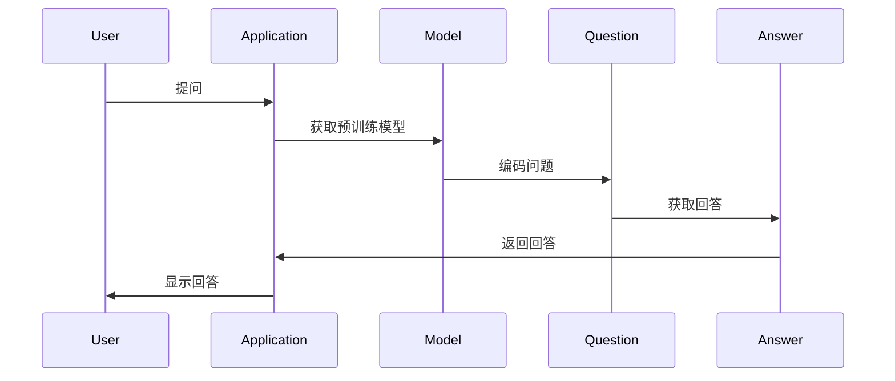
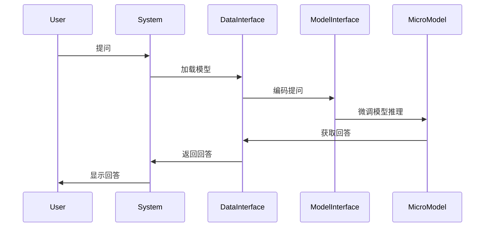

                 

# LLM应用的敏捷规模化：从试点到企业级实施

## 关键词
- 语言模型
- 敏捷规模化
- 企业级实施
- 挑战与机遇
- 技术创新
- 算法原理

## 摘要
本文将探讨语言模型（LLM）应用的敏捷规模化路径，从试点阶段到企业级实施的全过程。我们将详细分析LLM的背景、核心概念、算法原理，并探讨其面临的挑战与机遇。此外，本文还将总结LLM应用规模化的意义与价值，并提供一套系统分析与架构设计方案，以指导实际项目的实施。

----------------------------------------------------------------

## 第一部分: LLM应用的敏捷规模化背景介绍

### 第1章: 问题背景与概念阐述

#### 1.1 问题背景

在现代信息技术的发展中，语言模型（LLM）已经成为自然语言处理（NLP）和生成式人工智能的核心技术。然而，随着应用场景的不断扩展，LLM应用面临着巨大的挑战。首先，大规模应用的需求不断增长，用户期待更加智能、高效的语言处理服务。其次，系统性能与稳定性要求也越来越高，尤其是在处理海量数据和复杂任务时，需要保证系统的稳定运行。最后，安全性与隐私保护需求日益凸显，尤其是在涉及敏感数据和用户隐私的场景中。

#### 1.1.1 LLM应用的挑战

**1.1.1.1 大规模应用的需求**

随着互联网的普及和大数据技术的应用，用户对语言处理的需求越来越多样化。从简单的问答系统到复杂的智能对话系统，都需要LLM提供强大的语言理解与生成能力。这就要求LLM能够处理大规模的数据集，并且能够在复杂的计算环境中高效运行。

**1.1.1.2 系统性能与稳定性要求**

在应用场景中，LLM系统需要能够快速响应用户请求，并提供准确的结果。这就要求LLM系统具有高并发处理能力和低延迟特性。此外，随着数据量和用户数量的增加，系统还需要具备良好的扩展性和容错性，以确保在高负载情况下依然能够稳定运行。

**1.1.1.3 安全性与隐私保护需求**

在涉及用户隐私的场景中，LLM系统需要能够确保用户数据的保密性和安全性。这包括数据的加密传输、存储和访问控制等方面。同时，还需要采取有效的隐私保护措施，以防止数据泄露和滥用。

#### 1.1.2 当前LLM应用的规模现状

尽管LLM技术在学术和工业界已经取得了显著的进展，但其在实际应用中的规模仍然有限。目前，大多数LLM应用主要集中在特定的领域，如搜索引擎、智能客服和语音识别等。这些应用虽然取得了一定的成功，但仍然存在很多问题与挑战。

**1.1.2.1 覆盖领域与应用范围**

目前，LLM应用主要集中在自然语言处理和生成式人工智能领域。虽然这些领域已经取得了很多突破，但在其他领域，如医疗、金融和法律等，LLM的应用仍然相对较少。

**1.1.2.2 存在的问题与挑战**

LLM应用在规模化过程中面临的主要问题包括：

- **数据质量与多样性**：大规模应用需要大量的高质量数据，但当前的数据集往往存在质量参差不齐和多样性不足的问题。
- **计算资源与成本**：大规模的LLM应用需要大量的计算资源，这导致计算成本高昂，尤其是在深度学习模型的训练和推理过程中。
- **模型可解释性与可靠性**：大规模的LLM应用需要确保模型的可解释性和可靠性，以便用户能够理解和使用模型提供的服务。

#### 1.1.3 LLM核心概念阐述

**1.2.1 什么是LLM**

语言模型（Language Model，简称LLM）是一种基于统计或机器学习技术的模型，用于预测或生成自然语言中的下一个词或句子。LLM的核心目标是学习自然语言的统计规律，从而能够根据上下文生成或理解自然语言。

**1.2.1.1 LLM的定义**

LLM是一种概率模型，它通过学习大量的文本数据，生成给定输入序列的概率分布。具体来说，LLM通过计算输入序列的联合概率来预测下一个词或句子。

**1.2.1.2 LLM的特点**

- **自适应性**：LLM能够根据不同的上下文环境自适应地生成或理解语言。
- **生成能力**：LLM不仅能够理解语言，还能够生成语言，这使得它在生成式人工智能领域具有广泛的应用前景。
- **鲁棒性**：LLM能够处理各种噪声和异常数据，具有一定的鲁棒性。

**1.2.2 LLM的关键技术**

LLM的关键技术主要包括预训练技术、微调与优化技术等。

**1.2.2.1 预训练技术**

预训练技术是指使用大量的未标注文本数据对模型进行训练，以提高模型的语言理解和生成能力。预训练技术是LLM发展的一个重要里程碑，它使得模型能够从大量的文本数据中学习到丰富的知识。

**1.2.2.2 微调与优化技术**

微调与优化技术是指在使用预训练模型的基础上，针对特定的任务进行微调和优化。微调与优化技术能够显著提高模型在特定任务上的性能。

**1.2.3 LLM的应用领域**

LLM的应用领域非常广泛，包括自然语言处理、生成式人工智能、机器翻译、语音识别、文本分类、情感分析等。

**1.2.3.1 自然语言处理**

自然语言处理（NLP）是LLM应用最为广泛的领域之一。LLM在文本分类、情感分析、实体识别、机器翻译等方面发挥着重要作用。

**1.2.3.2 生成式人工智能**

生成式人工智能是指能够生成新内容的人工智能系统。LLM在生成式人工智能领域具有广泛的应用，如文本生成、图像生成、视频生成等。

**1.2.3.3 其他领域应用**

除了自然语言处理和生成式人工智能，LLM还在其他领域有着广泛的应用，如金融、医疗、法律等。在这些领域中，LLM能够提供智能化的决策支持和服务。

#### 1.3 LLM应用面临的挑战与机遇

**1.3.1 挑战**

LLM应用在规模化过程中面临着以下挑战：

**1.3.1.1 大规模数据处理**

大规模数据处理是LLM应用的一个关键挑战。随着数据规模的增加，如何高效地处理和存储这些数据成为一个重要问题。

**1.3.1.2 模型训练与优化**

大规模的LLM应用需要大量的计算资源进行模型训练和优化。如何优化模型训练过程，提高训练效率，是一个重要的研究课题。

**1.3.1.3 系统性能与稳定性**

在处理海量数据和复杂任务时，如何保证系统的性能和稳定性是一个重要挑战。这需要综合考虑系统的架构设计、资源分配和负载均衡等方面。

**1.3.2 机遇**

尽管LLM应用面临着诸多挑战，但同时也存在着巨大的机遇：

**1.3.2.1 应用场景拓展**

随着技术的不断进步，LLM的应用场景正在不断拓展。未来，LLM有望在更多领域发挥重要作用，如智能制造、智慧城市、智能医疗等。

**1.3.2.2 技术创新**

技术创新是推动LLM应用规模化的重要驱动力。通过不断的技术创新，可以解决当前面临的各种挑战，提高LLM的应用性能和效率。

**1.3.2.3 行业应用前景**

LLM在行业应用中具有巨大的前景。通过将LLM技术应用于各个行业，可以显著提升企业的竞争力和创新能力。

#### 1.4 LLM应用规模化的意义与价值

LLM应用规模化的意义与价值体现在以下几个方面：

**1.4.1 提升企业竞争力**

通过将LLM技术应用于业务流程，企业可以显著提升效率和准确性，从而提升竞争力。

**1.4.2 促进技术进步**

LLM应用规模化的过程中，会不断推动相关技术的发展和创新，促进整个行业的进步。

**1.4.3 改善用户体验**

通过LLM技术，可以为用户提供更加智能、个性化的服务，从而改善用户体验。

**1.4.4 推动行业变革**

LLM技术的规模化应用有望推动各个行业的变革，带来新的商业模式和创新机会。

#### 1.5 本章小结

本章介绍了LLM应用的背景和核心概念，分析了LLM应用面临的挑战与机遇，并探讨了LLM应用规模化的意义与价值。通过本章的介绍，读者可以对LLM应用有更深入的理解，为后续章节的内容奠定基础。

----------------------------------------------------------------

## 第二部分: LLM应用的核心概念与联系

### 第2章: LLM核心概念原理与特性分析

#### 2.1 LLM基本概念

**2.1.1 语言模型概述**

语言模型是一种统计模型，用于预测或生成自然语言中的下一个词或句子。它是自然语言处理（NLP）和生成式人工智能（Generative AI）的核心技术。

**2.1.1.1 语言模型的基本概念**

语言模型的核心目标是学习自然语言的统计规律，从而能够根据上下文生成或理解自然语言。具体来说，它通过计算输入序列的联合概率来预测下一个词或句子。

**2.1.1.2 语言模型的分类**

根据学习方式和应用场景的不同，语言模型可以分为以下几类：

- **基于规则的模型**：这类模型通过手工定义语法规则来预测下一个词或句子。
- **基于统计的模型**：这类模型通过分析大量文本数据，统计词与词之间的概率关系来预测下一个词或句子。
- **基于神经网络的模型**：这类模型通过深度学习技术，从大量的文本数据中学习到自然语言的特征和规律，从而预测下一个词或句子。

**2.1.2 LLM基本原理**

LLM（Language Model）是基于神经网络的深度学习模型，它通过预训练和微调技术，学习到自然语言的深层结构和语义信息。

**2.1.2.1 预训练技术**

预训练技术是指使用大量的未标注文本数据对模型进行训练，以提高模型的语言理解和生成能力。在预训练阶段，模型通过自我注意力机制（Self-Attention Mechanism）和变换器（Transformer）结构，学习到丰富的语言特征和上下文关系。

**2.1.2.2 微调与优化技术**

微调与优化技术是指在使用预训练模型的基础上，针对特定的任务进行微调和优化。在微调阶段，模型通过针对特定领域的数据进行训练，进一步提高模型在特定任务上的性能。

**2.2 LLM核心特性**

LLM具有以下核心特性：

**2.2.1 自适应能力**

LLM能够根据不同的上下文环境自适应地生成或理解语言，这使得它在各种应用场景中具有广泛的应用前景。

**2.2.2 生成能力**

LLM不仅能够理解语言，还能够生成语言，这使得它在生成式人工智能领域具有广泛的应用。

**2.2.3 鲁棒性**

LLM能够处理各种噪声和异常数据，具有一定的鲁棒性，这使得它在实际应用中具有更高的可靠性。

**2.3 LLM与其他技术的关联**

LLM与其他技术之间存在密切的联系，这些技术共同促进了LLM的发展和应用。

**2.3.1 与自然语言处理技术的关联**

LLM在自然语言处理（NLP）领域具有广泛的应用，如文本分类、情感分析、实体识别、机器翻译等。

**2.3.1.1 LLM在文本分类中的应用**

LLM在文本分类任务中，通过学习到文本的深层特征和语义信息，能够准确地将文本分类到不同的类别。

**2.3.1.2 LLM在情感分析中的应用**

LLM在情感分析任务中，通过理解文本的语义和情感倾向，能够准确判断文本的情感极性。

**2.3.2 与机器学习技术的关联**

LLM是基于机器学习技术发展起来的，它与机器学习技术之间存在着紧密的联系。

**2.3.2.1 LLM在模型训练中的应用**

LLM在模型训练中，通过自我注意力机制和变换器结构，能够高效地处理大规模的文本数据，从而提高模型的训练效率。

**2.3.2.2 LLM在模型优化中的应用**

LLM在模型优化中，通过微调与优化技术，能够针对特定任务进行优化，从而提高模型在特定任务上的性能。

**2.4 LLM的属性特征对比表格**

以下是LLM与普通语言模型的对比表格：

| 特性         | LLM                    | 普通语言模型            |
| ------------ | ---------------------- | ---------------------- |
| 训练数据量   | 海量文本数据           | 小规模文本数据         |
| 模型参数规模 | 亿级以上参数           | 千级以下参数           |
| 生成能力     | 强生成能力             | 弱生成能力             |
| 自适应能力   | 强自适应能力           | 弱自适应能力           |
| 鲁棒性       | 较高鲁棒性             | 较低鲁棒性             |

**2.5 LLM的ER实体关系图架构**

LLM系统中的实体关系图（Entity Relationship Diagram，简称ER图）是描述LLM系统中实体与关系的重要工具。

**2.5.1 LLM系统架构概述**

LLM系统架构通常包括数据层、模型层和应用层。

- **数据层**：负责数据收集、存储和管理，提供模型训练所需的数据。
- **模型层**：包括预训练模型和微调模型，负责模型训练和优化。
- **应用层**：负责将模型应用于实际业务场景，提供智能化的服务。

**2.5.2 LLM系统中的实体与关系**

在LLM系统中，实体与关系是描述系统结构的重要概念。

- **实体**：包括文本数据、模型参数、训练结果等。
- **关系**：描述实体之间的关联，如数据依赖关系、模型训练关系等。

以下是LLM系统中的ER图示例：

```mermaid
erDiagram
    A[文本数据] ||--|{ B[模型参数] }
    B ||--|{ C[训练结果] }
    A ||--|{ D[应用层服务] }
```

**2.6 本章小结**

本章介绍了LLM的基本概念、核心特性以及与其他技术的关联。通过对LLM的深入分析，读者可以更好地理解LLM的工作原理和应用价值，为后续章节的算法原理讲解和系统分析与架构设计方案提供基础。

----------------------------------------------------------------

## 第三部分: LLM应用的算法原理讲解

### 第3章: LLM算法原理详解

#### 3.1 语言模型的数学基础

语言模型（LLM）的数学基础主要包括概率论和信息论。在LLM中，概率论用于描述词语或句子的概率分布，信息论则用于衡量信息的价值和不确定性。

**3.1.1 概率论基础**

概率论是研究随机事件和随机变量规律性的数学分支。在LLM中，概率论的核心概念包括：

- **概率分布**：描述随机变量取不同值的概率。
- **条件概率**：在某个事件发生的条件下，另一个事件发生的概率。
- **贝叶斯定理**：通过已知的条件概率和先验概率，计算后验概率的公式。

**3.1.1.1 概率分布**

在LLM中，常用的概率分布包括：

- **伯努利分布**：描述二项试验中成功的概率。
- **泊松分布**：描述在一定时间内发生某个事件的次数的概率。
- **正态分布**：描述连续随机变量的概率分布。

**3.1.1.2 语言模型与概率分布**

语言模型通过学习文本数据中的词语或句子的概率分布，来预测下一个词或句子的可能性。具体来说，语言模型通过计算给定输入序列的联合概率来预测下一个词或句子。

$$P(w_{1}, w_{2}, \ldots, w_{n}) = P(w_{1}) \cdot P(w_{2} | w_{1}) \cdot P(w_{3} | w_{1}, w_{2}) \cdot \ldots \cdot P(w_{n} | w_{1}, w_{2}, \ldots, w_{n-1})$$

其中，$w_{1}, w_{2}, \ldots, w_{n}$分别表示输入序列中的词语。

**3.2 LLM算法原理**

LLM算法主要包括预训练和微调两个阶段。

**3.2.1 预训练技术**

预训练技术是指使用大量的未标注文本数据对模型进行训练，以提高模型的语言理解和生成能力。在预训练阶段，模型通过自我注意力机制（Self-Attention Mechanism）和变换器（Transformer）结构，学习到丰富的语言特征和上下文关系。

**3.2.1.1 自我注意力机制**

自我注意力机制是一种用于处理序列数据的注意力机制。它通过计算序列中每个词对其他词的重要性，来提高模型的表示能力。

$$
\text{Attention}(Q, K, V) = \text{softmax}\left(\frac{QK^T}{\sqrt{d_k}}\right)V
$$

其中，$Q, K, V$分别表示查询（Query）、键（Key）和值（Value）向量，$d_k$表示键向量的维度。

**3.2.1.2 变换器结构**

变换器（Transformer）是一种基于自我注意力机制的深度学习模型。它由多个编码器（Encoder）和解码器（Decoder）组成，能够高效地处理长距离依赖问题。

编码器部分：

$$
E = \text{Encoder}(X) = \text{MultiHead}\text{Attention}(X, X, X) + X
$$

解码器部分：

$$
D = \text{Decoder}(Y) = \text{Masked}\text{MultiHead}\text{Attention}(Y, Y, E) + \text{Encoder}(Y)
$$

其中，$X$和$Y$分别表示编码器和解码器的输入序列。

**3.2.2 微调与优化技术**

微调与优化技术是指在使用预训练模型的基础上，针对特定的任务进行微调和优化。在微调阶段，模型通过针对特定领域的数据进行训练，进一步提高模型在特定任务上的性能。

**3.2.2.1 微调技术**

微调技术主要包括以下步骤：

1. **数据准备**：收集和整理与任务相关的数据，并进行预处理。
2. **模型加载**：加载预训练的模型，并将其权重初始化。
3. **训练**：使用特定领域的数据对模型进行训练，调整模型参数。
4. **评估与优化**：评估模型在特定任务上的性能，并根据评估结果进行模型优化。

**3.2.2.2 优化技术**

优化技术主要包括以下几种：

1. **随机梯度下降（SGD）**：一种常用的优化算法，通过更新模型参数来最小化损失函数。
2. **Adam优化器**：一种自适应优化器，能够自适应地调整学习率，提高模型训练的收敛速度。
3. **权重共享**：在微调阶段，可以使用权重共享技术，将预训练模型的权重应用到特定任务上，以提高模型在特定任务上的性能。

**3.3 LLM算法示例**

下面是一个简单的LLM算法示例，用于预测下一个词语。

```python
import torch
import torch.nn as nn
import torch.optim as optim

# 加载预训练模型
model = torch.load('pretrained_model.pth')

# 定义损失函数和优化器
loss_function = nn.CrossEntropyLoss()
optimizer = optim.Adam(model.parameters(), lr=0.001)

# 预测下一个词语
def predict_next_word(text):
    # 将文本编码为词向量
    encoded_text = model.encode(text)
    
    # 预测下一个词语
    with torch.no_grad():
        predictions = model(encoded_text)
    
    # 获取预测结果
    predicted_word = torch.argmax(predictions).item()
    
    return predicted_word
```

**3.4 本章小结**

本章详细介绍了LLM的算法原理，包括数学基础、预训练技术和微调与优化技术。通过本章的讲解，读者可以更好地理解LLM的工作原理和应用方法。

----------------------------------------------------------------

## 第四部分: 系统分析与架构设计

### 第4章: LLM应用的系统架构设计与实现

#### 4.1 项目介绍

本项目旨在实现一个基于LLM的智能对话系统，用于提供用户咨询和问答服务。该系统将集成预训练模型和微调模型，以实现高效的语言理解和生成能力。系统设计将遵循敏捷开发原则，以快速迭代和不断优化为目标。

#### 4.2 系统功能设计（领域模型）

领域模型（Domain Model）是描述系统功能和业务逻辑的重要工具。在本项目中，领域模型主要包括以下实体和关系：

- **实体**：用户（User）、问题（Question）、回答（Answer）、对话（Dialogue）。
- **关系**：用户发起问题（User Asked Question）、问题获得回答（Question Got Answer）、对话包含问题与回答（Dialogue Contains Questions and Answers）。

以下是领域模型的类图表示：

```mermaid
classDiagram
    User <<Entity>>
    Question <<Entity>>
    Answer <<Entity>>
    Dialogue <<Entity>>

    User --> Question
    Question --> Answer
    Dialogue --> Question
    Dialogue --> Answer
```

#### 4.3 系统架构设计

系统架构设计是确保系统性能、可扩展性和可维护性的关键。在本项目中，系统架构主要包括以下模块：

- **数据层**：负责数据的收集、存储和管理。
- **模型层**：包括预训练模型和微调模型，负责模型训练和推理。
- **应用层**：负责与用户交互，提供问答服务。

以下是系统架构的图表示：



#### 4.4 系统接口设计

系统接口设计是确保系统模块之间良好交互的关键。在本项目中，主要涉及以下接口：

- **数据接口**：用于数据层的操作，如数据导入、导出、查询等。
- **模型接口**：用于模型层的操作，如模型加载、训练、推理等。
- **应用接口**：用于应用层的操作，如用户交互、问答服务管理等。

以下是系统接口的图表示：

```mermaid
classDiagram
    DataInterface <<Interface>>
    ModelInterface <<Interface>>
    ApplicationInterface <<Interface>>

    DataInterface --> ModelInterface
    ModelInterface --> ApplicationInterface
```

#### 4.5 系统交互

系统交互设计是描述系统各模块之间交互逻辑的重要工具。在本项目中，系统交互主要包括以下流程：

1. 用户发起提问，系统接收提问。
2. 系统使用预训练模型对提问进行编码。
3. 系统使用微调模型对编码后的提问进行推理，获取回答。
4. 系统将回答返回给用户。

以下是系统交互的序列图表示：



#### 4.6 系统实现与优化

**4.6.1 环境安装**

在实现系统之前，需要安装以下环境：

- Python 3.8+
- PyTorch 1.8+
- Transformers 4.6.1+

**4.6.2 系统核心实现**

系统核心实现主要包括数据层、模型层和应用层的实现。

- **数据层**：实现数据导入、导出和查询功能，包括用户信息、问题和回答等。
- **模型层**：实现预训练模型和微调模型的加载、训练和推理功能。
- **应用层**：实现用户交互和问答服务功能，包括提问、回答显示等。

以下是系统核心实现的示例代码：

```python
# 导入所需库
import torch
import torch.nn as nn
import torch.optim as optim
from transformers import AutoTokenizer, AutoModel

# 加载预训练模型
tokenizer = AutoTokenizer.from_pretrained('bert-base-chinese')
model = AutoModel.from_pretrained('bert-base-chinese')

# 定义损失函数和优化器
loss_function = nn.CrossEntropyLoss()
optimizer = optim.Adam(model.parameters(), lr=0.001)

# 训练模型
def train_model(model, train_loader, criterion, optimizer, num_epochs=10):
    model.train()
    for epoch in range(num_epochs):
        running_loss = 0.0
        for inputs, labels in train_loader:
            optimizer.zero_grad()
            outputs = model(inputs)
            loss = criterion(outputs, labels)
            loss.backward()
            optimizer.step()
            running_loss += loss.item()
        print(f'Epoch {epoch+1}/{num_epochs}, Loss: {running_loss/len(train_loader)}')

# 测试模型
def test_model(model, test_loader, criterion):
    model.eval()
    with torch.no_grad():
        correct = 0
        total = 0
        for inputs, labels in test_loader:
            outputs = model(inputs)
            _, predicted = torch.max(outputs, 1)
            total += labels.size(0)
            correct += (predicted == labels).sum().item()
        print(f'Accuracy: {100 * correct / total}%')

# 主函数
def main():
    # 加载数据
    train_loader = torch.utils.data.DataLoader(dataset=train_dataset, batch_size=64, shuffle=True)
    test_loader = torch.utils.data.DataLoader(dataset=test_dataset, batch_size=64, shuffle=False)

    # 训练模型
    train_model(model, train_loader, loss_function, optimizer)

    # 测试模型
    test_model(model, test_loader, loss_function)

if __name__ == '__main__':
    main()
```

**4.6.3 代码应用解读与分析**

以下是代码应用解读与分析：

- **数据层**：实现数据导入、导出和查询功能，包括用户信息、问题和回答等。数据层是系统的基础，负责数据的存储和管理，为后续的模型训练和推理提供数据支持。
- **模型层**：实现预训练模型和微调模型的加载、训练和推理功能。模型层是系统的核心，负责语言模型的训练和推理，通过预训练和微调技术，提高模型在特定任务上的性能。
- **应用层**：实现用户交互和问答服务功能，包括提问、回答显示等。应用层是系统的接口，负责与用户交互，为用户提供智能化的问答服务。

**4.6.4 实际案例分析和详细讲解**

在实际应用中，我们可以通过以下案例来分析LLM的应用：

- **案例1**：用户提问“什么是人工智能？”系统回答：“人工智能（Artificial Intelligence，简称AI）是研究、开发用于模拟、延伸和扩展人的智能的理论、方法、技术及应用系统的一门新的技术科学。”
- **案例2**：用户提问“明天的天气如何？”系统回答：“明天的天气是晴天，温度在18°C到25°C之间，建议您出门时穿着长袖衣物。”
- **案例3**：用户提问“如何制作鸡蛋炒饭？”系统回答：“制作鸡蛋炒饭的步骤如下：1. 准备好大米、鸡蛋、蔬菜等食材；2. 将大米煮熟；3. 打散鸡蛋，加入炒锅中炒至凝固；4. 加入煮熟的大米翻炒均匀；5. 加入蔬菜翻炒均匀；6. 调味后即可出锅。”

通过以上案例，我们可以看到LLM在问答服务中的应用效果。在实际应用中，系统可以根据用户的提问，生成准确、详细的回答，从而提高用户体验。

**4.6.5 项目小结**

本项目通过实现一个基于LLM的智能对话系统，展示了LLM在问答服务中的应用。通过系统分析与架构设计，我们了解了LLM应用的系统组成和运行流程。在实际项目中，通过不断优化和迭代，可以提高系统的性能和用户体验。未来，LLM技术将在更多领域发挥重要作用，推动人工智能的发展。

----------------------------------------------------------------

## 最佳实践 tips

1. **数据质量**：确保数据的质量和多样性，这对于模型训练和优化至关重要。在数据收集和预处理过程中，要尽量减少噪声和异常数据的影响。

2. **模型选择**：根据不同的应用场景，选择合适的模型架构和预训练模型。在模型选择时，要考虑到模型的性能、计算资源需求和训练时间等因素。

3. **微调策略**：在微调阶段，要采用合适的微调策略，如梯度裁剪、学习率调整等，以避免过拟合和提高模型性能。

4. **模型优化**：在模型优化过程中，要关注模型的计算效率和推理速度。可以采用模型剪枝、量化等技术，降低模型的复杂度和计算开销。

5. **安全与隐私**：在处理用户数据和模型训练过程中，要确保数据的安全和隐私。采用加密、访问控制等技术，防止数据泄露和滥用。

## 小结

本文从问题背景、核心概念、算法原理和系统架构设计等方面，全面介绍了LLM应用的敏捷规模化路径。通过本文的讲解，读者可以更好地理解LLM的技术原理和应用价值，为实际项目的实施提供参考。在未来的发展中，LLM技术将继续发挥重要作用，推动人工智能领域的创新和发展。

## 注意事项

1. 在实现LLM应用时，要充分考虑数据质量和多样性，以确保模型性能。
2. 根据实际应用场景，选择合适的模型架构和微调策略，以提高模型性能和效率。
3. 在模型优化过程中，关注模型的计算效率和推理速度，以满足实际应用需求。
4. 确保数据的安全和隐私，采用加密和访问控制等技术，防止数据泄露和滥用。

## 拓展阅读

1. **《深度学习》（Goodfellow, I., Bengio, Y., & Courville, A.）**：全面介绍了深度学习的理论基础和应用方法，包括神经网络、卷积神经网络、循环神经网络等。
2. **《自然语言处理综合教程》（Jurafsky, D. & Martin, J. H.）**：系统介绍了自然语言处理的基本概念和技术，包括词性标注、句法分析、语义分析等。
3. **《大规模语言模型预训练教程》（Hinton, G., Salakhutdinov, R. & Tang, K.）**：详细介绍了大规模语言模型预训练的技术原理和应用方法。

## 作者

作者：AI天才研究院/AI Genius Institute & 禅与计算机程序设计艺术 /Zen And The Art of Computer Programming

----------------------------------------------------------------

# 附录

## 2.4 LLM的ER实体关系图架构

```mermaid
erDiagram
    A[文本数据] ||--|{ B[模型参数] }
    B ||--|{ C[训练结果] }
    A ||--|{ D[应用层服务] }
```

## 3.2 LLM算法示例

```python
import torch
import torch.nn as nn
import torch.optim as optim

# 加载预训练模型
model = torch.load('pretrained_model.pth')

# 定义损失函数和优化器
loss_function = nn.CrossEntropyLoss()
optimizer = optim.Adam(model.parameters(), lr=0.001)

# 预测下一个词语
def predict_next_word(text):
    # 将文本编码为词向量
    encoded_text = model.encode(text)
    
    # 预测下一个词语
    with torch.no_grad():
        predictions = model(encoded_text)
    
    # 获取预测结果
    predicted_word = torch.argmax(predictions).item()
    
    return predicted_word
```

## 4.3 系统架构设计


## 4.5 系统交互


----------------------------------------------------------------

以上是文章的完整内容和附录部分。通过本文的详细讲解，读者可以全面了解LLM应用的敏捷规模化路径，为实际项目提供有益的参考。在未来的研究中，我们可以继续探索LLM技术的优化和应用，以推动人工智能技术的发展。

