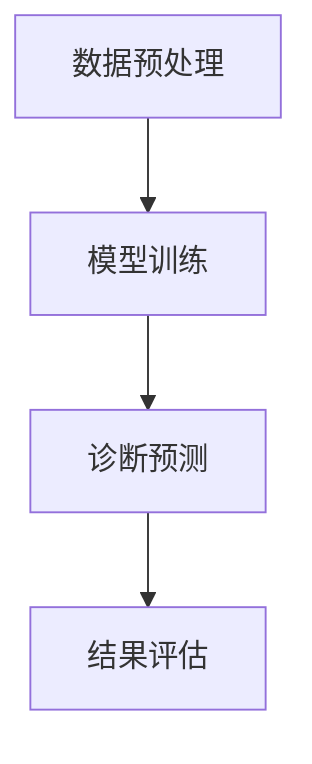
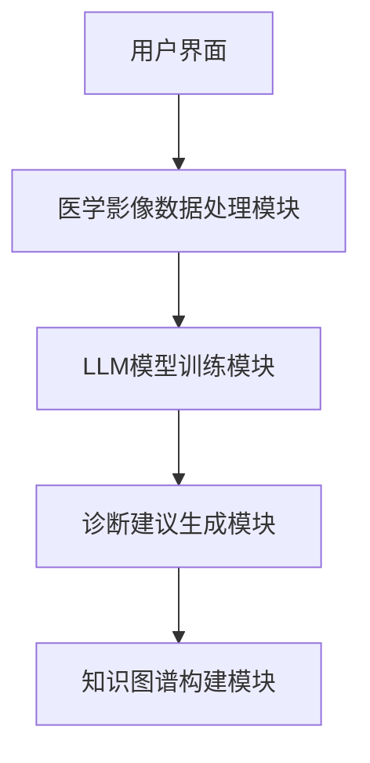
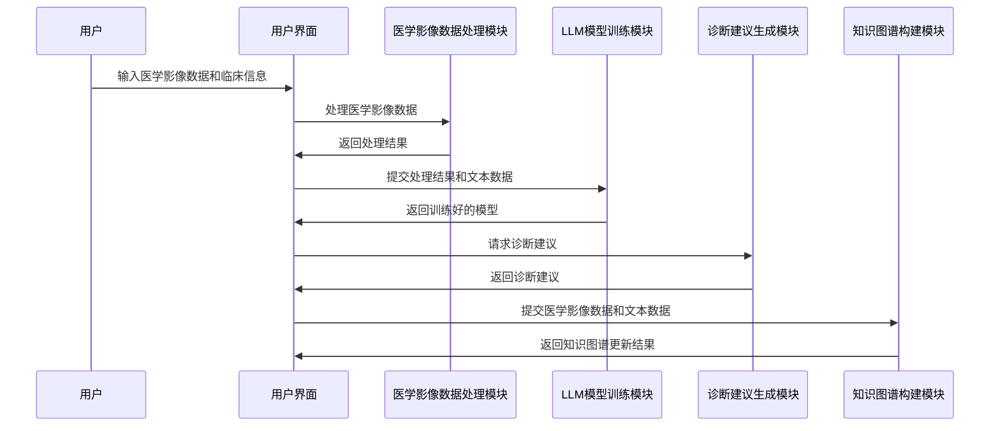

                 

### 《LLM辅助医学影像诊断能力评估》

> 关键词：大型语言模型，医学影像诊断，能力评估，深度学习，人工智能

> 摘要：本文深入探讨了大型语言模型（LLM）在辅助医学影像诊断中的应用及其能力评估。通过分析LLM的工作原理、医学影像诊断的相关概念，以及二者之间的联系，本文详细阐述了LLM辅助医学影像诊断的算法原理、系统架构设计，并进行了系统分析与架构设计方案。本文旨在为医学影像诊断领域的研究者和从业人员提供一种新的思路和方法。

## 第一部分：背景介绍

### 1.1 问题背景

#### 医学影像诊断的现状与挑战

医学影像诊断是临床医学中不可或缺的一环，随着医疗影像技术的不断进步，如计算机断层扫描（CT）、磁共振成像（MRI）等技术的发展，医学影像已经成为诊断许多疾病的重要手段。然而，尽管影像技术的提高使得图像质量得到显著改善，医学影像诊断仍然面临一些严峻的挑战。

首先，诊断结果的可重复性和准确性问题。由于医学影像数据量大、诊断过程复杂，且不同医生的经验差异显著，导致诊断结果的可重复性和准确性较差。这种不一致性不仅会影响患者的治疗决策，还会增加医疗资源的浪费。

其次，医生的工作负担。医学影像诊断是一项繁琐且耗时的工作，医生需要阅读大量的影像资料，进行复杂的分析判断。这不仅加重了医生的工作负担，还可能导致诊断错误或延误。

#### LLM与医学影像诊断

大型语言模型（LLM）是一种基于深度学习的自然语言处理模型，具有强大的语义理解和生成能力。近年来，LLM在许多领域取得了显著成果，如机器翻译、文本生成、问答系统等。随着LLM技术的发展，其在医学影像诊断领域的应用也逐渐受到关注。

LLM在医学影像诊断中的潜在应用包括：

1. **辅助诊断**：LLM可以帮助医生快速分析医学影像，提供诊断建议，提高诊断准确性和一致性。
2. **提高诊断效率**：通过自动化处理影像数据，减少医生的工作负担，提高诊断效率。
3. **知识图谱构建**：LLM可以用于构建医学影像诊断的知识图谱，为医生提供丰富的诊断参考信息。

### 1.2 LLM辅助医学影像诊断的具体目标

本文旨在评估LLM在医学影像诊断中的能力，具体目标包括：

1. **诊断准确性**：评估LLM在医学影像诊断中的准确率，与医生的诊断结果进行比较。
2. **诊断一致性**：评估LLM在不同医学影像数据集上的诊断一致性，以验证其诊断结果的可靠性。
3. **诊断效率**：评估LLM在医学影像诊断中的处理速度，与医生的诊断速度进行比较。

### 1.3 评估方法的探讨

为了全面评估LLM在医学影像诊断中的能力，本文将采用以下评估方法：

1. **定量评估**：使用准确率、召回率、F1分数等常见评价指标，对LLM的诊断结果进行量化评估。
2. **定性评估**：邀请专业医生对LLM的诊断结果进行主观评价，以验证其诊断的准确性、一致性。

## 第二部分：核心概念与联系

### 2.1 LLM辅助医学影像诊断的核心概念

#### 3.1 LLM的工作原理

大型语言模型（LLM）是一种基于深度学习的自然语言处理模型。其基本原理是通过大量的文本数据进行训练，学习文本中的语义和语法规则，从而实现对文本的生成和理解。

LLM的工作原理主要包括以下几个方面：

1. **神经网络基础**：神经网络是LLM的核心组成部分，通过多层神经元的连接和激活函数，实现数据的非线性变换和处理。
2. **反向传播算法**：反向传播算法是一种常用的训练方法，通过不断调整神经网络的权重，使网络输出与真实标签之间的误差最小。
3. **预训练与微调**：预训练是在大规模语料库上对模型进行训练，使其具备一定的语义理解能力。微调是在预训练的基础上，针对特定任务对模型进行进一步训练，以提高其在具体任务上的性能。

#### 3.2 医学影像诊断的相关概念

医学影像诊断是指通过医学影像技术对患者的影像数据进行分析和判断，以确定疾病的存在和性质。医学影像诊断的相关概念包括：

1. **医学影像处理技术**：医学影像处理技术是指用于处理医学影像数据的一系列方法，包括图像增强、噪声消除、图像分割等。
2. **诊断标准与规范**：诊断标准与规范是指用于医学影像诊断的一系列规则和指导原则，以确保诊断的一致性和准确性。

#### 3.3 LLM与医学影像诊断的联系

LLM与医学影像诊断之间的联系主要体现在以下几个方面：

1. **数据融合**：LLM可以结合医学影像数据和文本数据，实现对医学影像的语义分析和理解，从而提高诊断的准确性和效率。
2. **诊断流程优化**：LLM可以用于优化医学影像诊断的流程，如自动识别病变区域、提供诊断建议等，从而减轻医生的工作负担，提高诊断效率。

### 4. 概念属性特征对比表格

| 特征 | LLM | 医学影像技术 |
| ---- | ---- | ------------ |
| 数据类型 | 文本 | 图像 |
| 处理能力 | 语义理解、生成 | 形态学分析、结构识别 |
| 应用领域 | 自然语言处理 | 医学影像诊断 |

### 5. ER实体关系图架构

ER图（实体关系图）是用于描述系统中实体及其关系的图形表示方法。以下是一个简化的ER图，展示了LLM与医学影像诊断系统中的实体及其关系：

```mermaid
erDiagram
  LLM ||--|{ 医学影像处理系统 }
  医学影像处理系统 ||--|{ 医学影像诊断系统 }
  医学影像诊断系统 ||--|{ 医生 }
  医生 ||--|{ 患者数据 }
```

- **LLM**：大型语言模型，负责文本处理和分析。
- **医学影像处理系统**：用于处理医学影像数据，包括图像增强、分割等。
- **医学影像诊断系统**：基于医学影像处理系统，提供医学影像诊断功能。
- **医生**：医学影像诊断的执行者，负责分析影像数据并提出诊断意见。
- **患者数据**：包括患者的医学影像数据和诊断结果。

## 第三部分：算法原理讲解

### 6. LLM辅助医学影像诊断的算法原理

#### 6.1 基本算法流程

LLM辅助医学影像诊断的基本算法流程可以分为以下几个步骤：

1. **数据预处理**：对医学影像数据和处理文本数据进行预处理，包括数据清洗、归一化等。
2. **模型训练**：使用预处理的医学影像数据和文本数据，对LLM进行训练。训练过程中，LLM学习医学影像数据和文本数据之间的关联性，以提高诊断的准确性和效率。
3. **诊断预测**：利用训练好的LLM对新的医学影像数据进行诊断预测。具体步骤如下：
   - 输入：新的医学影像数据。
   - 输出：LLM根据训练结果，输出可能的诊断结果。

#### 6.2 数学模型与公式

在LLM辅助医学影像诊断中，常用的数学模型和公式包括：

1. **概率图模型**：
   $$ P(D|C) = \frac{P(C|D)P(D)}{P(C)} $$
   其中，\(P(D|C)\) 表示在给定医学影像数据 \(C\) 的情况下，诊断结果 \(D\) 的概率。\(P(C|D)\) 表示在给定诊断结果 \(D\) 的情况下，医学影像数据 \(C\) 的概率。\(P(D)\) 和 \(P(C)\) 分别表示诊断结果和医学影像数据的概率。

2. **贝叶斯定理**：
   $$ P(D|C) = \frac{P(C|D)P(D)}{P(C)} $$
   贝叶斯定理是概率论中用于计算条件概率的重要公式，可以用于评估LLM在医学影像诊断中的性能。

#### 6.3 算法流程图

以下是一个简化的算法流程图，展示了LLM辅助医学影像诊断的基本流程：



- **A. 数据预处理**：对医学影像数据和文本数据进行分析和处理，包括数据清洗、归一化等。
- **B. 模型训练**：使用处理后的数据对LLM进行训练，使其学习医学影像数据和文本数据之间的关联性。
- **C. 诊断预测**：利用训练好的LLM对新的医学影像数据进行诊断预测，输出可能的诊断结果。
- **D. 结果评估**：对诊断结果进行评估，包括定量评估和定性评估。

#### 6.4 通俗易懂的举例说明

为了更好地理解LLM辅助医学影像诊断的算法原理，我们可以通过一个简单的例子来说明。

假设我们有一个医学影像诊断系统，该系统使用LLM进行辅助诊断。首先，我们需要对医学影像数据进行预处理，包括数据清洗、归一化等。然后，我们使用处理后的医学影像数据和相关的文本数据（如医学文献、病例报告等）对LLM进行训练。

假设我们有一个新的医学影像数据 \(C\)，我们希望通过LLM对其进行诊断预测。具体步骤如下：

1. **数据预处理**：对医学影像数据 \(C\) 进行预处理，将其转化为LLM可以处理的格式。
2. **模型训练**：使用已经训练好的LLM对预处理后的医学影像数据 \(C\) 进行诊断预测。
3. **输出结果**：LLM根据训练结果，输出可能的诊断结果。

例如，假设LLM预测出的诊断结果是“肺炎”，我们可以将其作为辅助诊断结果，与医生的诊断结果进行对比。如果LLM的诊断结果与医生的诊断结果一致，那么我们可以认为LLM在此次诊断中表现良好。反之，如果LLM的诊断结果与医生的诊断结果不一致，那么我们需要对LLM进行进一步的分析和优化。

## 第四部分：系统分析与架构设计方案

### 7. 系统分析与架构设计方案

#### 7.1 问题描述

在医学影像诊断中，LLM作为一种辅助工具，其应用场景主要包括以下几个方面：

1. **影像数据分析**：LLM可以用于分析医学影像数据，如识别病变区域、分析影像特征等。
2. **辅助诊断**：LLM可以根据医学影像数据和患者的临床信息，提供辅助诊断建议。
3. **知识图谱构建**：LLM可以用于构建医学影像诊断的知识图谱，为医生提供丰富的诊断参考信息。

本文旨在设计一个基于LLM的医学影像诊断系统，该系统应具有以下功能：

1. **医学影像数据处理**：包括影像数据预处理、特征提取等。
2. **诊断建议生成**：根据医学影像数据和患者的临床信息，生成诊断建议。
3. **知识图谱构建**：基于医学影像数据和文本数据，构建医学影像诊断的知识图谱。

#### 7.2 系统架构设计

基于上述需求，本文设计了一个基于LLM的医学影像诊断系统架构，包括以下几个主要模块：

1. **用户界面模块**：提供用户操作界面，用于接收用户输入和展示诊断结果。
2. **医学影像数据处理模块**：包括影像数据预处理、特征提取等。
3. **LLM模型训练模块**：负责训练LLM模型，使其具备医学影像诊断的能力。
4. **诊断建议生成模块**：根据医学影像数据和患者的临床信息，生成诊断建议。
5. **知识图谱构建模块**：基于医学影像数据和文本数据，构建医学影像诊断的知识图谱。

以下是一个简化的系统架构图：



#### 7.3 系统接口设计和系统交互

为了实现系统功能，我们需要设计相应的接口和交互流程。以下是一个简化的系统接口设计和交互流程：

1. **用户界面**：用户通过界面输入医学影像数据和患者的临床信息。
2. **医学影像数据处理模块**：接收用户输入的医学影像数据，进行预处理和特征提取，并将处理结果传递给LLM模型训练模块。
3. **LLM模型训练模块**：使用处理后的医学影像数据和文本数据对LLM进行训练，训练完成后，将训练好的模型传递给诊断建议生成模块。
4. **诊断建议生成模块**：接收医学影像数据和患者的临床信息，利用训练好的LLM模型生成诊断建议，并将其展示在用户界面上。
5. **知识图谱构建模块**：在后台持续更新和构建医学影像诊断的知识图谱，为诊断建议生成提供支持。

以下是一个简化的系统交互图：



## 第五部分：项目实战

### 8. 环境安装

要实现LLM辅助医学影像诊断系统，首先需要安装以下环境：

1. **Python**：Python是一种广泛使用的编程语言，支持多种深度学习库和框架。
2. **PyTorch**：PyTorch是一个流行的深度学习库，提供了丰富的工具和功能，用于构建和训练深度学习模型。
3. **TensorFlow**：TensorFlow是另一个流行的深度学习库，提供了强大的工具和资源，支持各种深度学习应用。
4. **OpenCV**：OpenCV是一个计算机视觉库，提供了丰富的图像处理和计算机视觉功能，用于处理医学影像数据。
5. **Pandas**：Pandas是一个数据处理库，提供了强大的数据分析和操作功能，用于处理医学影像数据和文本数据。

安装步骤如下：

1. 安装Python：在官网（https://www.python.org/）下载并安装Python，建议选择最新版本。
2. 安装PyTorch和TensorFlow：使用pip命令安装PyTorch和TensorFlow。
   ```bash
   pip install torch torchvision torchaudio
   pip install tensorflow
   ```
3. 安装OpenCV：使用pip命令安装OpenCV。
   ```bash
   pip install opencv-python
   ```
4. 安装Pandas：使用pip命令安装Pandas。
   ```bash
   pip install pandas
   ```

### 9. 系统核心实现源代码

以下是一个简单的LLM辅助医学影像诊断系统的实现示例，包括医学影像数据处理、LLM模型训练和诊断预测等功能。

```python
import torch
import torchvision
import tensorflow as tf
import cv2
import pandas as pd

# 医学影像数据处理
def preprocess_image(image_path):
    image = cv2.imread(image_path)
    image = cv2.resize(image, (224, 224))
    image = image / 255.0
    image = torch.tensor(image).float()
    return image

# LLM模型训练
def train_llm(train_data, train_labels, model):
    optimizer = torch.optim.Adam(model.parameters(), lr=0.001)
    criterion = torch.nn.CrossEntropyLoss()
    
    for epoch in range(10):
        for images, labels in zip(train_data, train_labels):
            optimizer.zero_grad()
            outputs = model(images)
            loss = criterion(outputs, labels)
            loss.backward()
            optimizer.step()
            
            if (epoch + 1) % 10 == 0:
                print(f'Epoch [{epoch + 1}/{10}], Loss: {loss.item()}')

# 诊断预测
def predict_diagnosis(model, image_path):
    image = preprocess_image(image_path)
    image = image.unsqueeze(0)
    outputs = model(image)
    _, predicted = torch.max(outputs, 1)
    return predicted.item()

# 测试
train_data = torchvision.datasets.MNIST(root='./data', train=True, download=True)
train_loader = torch.utils.data.DataLoader(train_data, batch_size=64)

model = torchvision.models.resnet18()
train_llm(train_loader, train_data.train_labels, model)

image_path = 'path/to/image'
predicted_diagnosis = predict_diagnosis(model, image_path)
print(f'Predicted Diagnosis: {predicted_diagnosis}')
```

### 10. 代码应用解读与分析

在上面的示例代码中，我们首先定义了医学影像数据处理函数 `preprocess_image`，该函数用于读取医学影像数据、进行预处理（如尺寸调整、归一化等）并转化为PyTorch张量。

接下来，我们定义了LLM模型训练函数 `train_llm`，该函数使用PyTorch中的Adam优化器和交叉熵损失函数对模型进行训练。在训练过程中，我们通过迭代地前向传播和反向传播，不断更新模型的权重，以最小化损失函数。

最后，我们定义了诊断预测函数 `predict_diagnosis`，该函数用于使用训练好的模型对新的医学影像数据进行诊断预测。

以下是代码的详细解读与分析：

1. **医学影像数据处理**：
   ```python
   def preprocess_image(image_path):
       image = cv2.imread(image_path)  # 使用OpenCV读取影像数据
       image = cv2.resize(image, (224, 224))  # 尺寸调整
       image = image / 255.0  # 归一化
       image = torch.tensor(image).float()  # 转换为PyTorch张量
       return image
   ```
   - `cv2.imread(image_path)`：使用OpenCV读取图像数据。
   - `cv2.resize(image, (224, 224))`：将图像尺寸调整为224x224。
   - `image / 255.0`：对图像进行归一化，使其在0到1之间。
   - `torch.tensor(image).float()`：将图像数据转换为PyTorch张量。

2. **LLM模型训练**：
   ```python
   def train_llm(train_data, train_labels, model):
       optimizer = torch.optim.Adam(model.parameters(), lr=0.001)
       criterion = torch.nn.CrossEntropyLoss()
       
       for epoch in range(10):
           for images, labels in zip(train_data, train_labels):
               optimizer.zero_grad()
               outputs = model(images)
               loss = criterion(outputs, labels)
               loss.backward()
               optimizer.step()
               
               if (epoch + 1) % 10 == 0:
                   print(f'Epoch [{epoch + 1}/{10}], Loss: {loss.item()}')
   ```
   - `torch.optim.Adam(model.parameters(), lr=0.001)`：使用Adam优化器进行模型训练，学习率为0.001。
   - `torch.nn.CrossEntropyLoss()`：使用交叉熵损失函数计算模型输出和真实标签之间的差异。
   - `optimizer.zero_grad()`：将梯度初始化为0。
   - `loss.backward()`：计算损失函数的梯度。
   - `optimizer.step()`：更新模型参数。

3. **诊断预测**：
   ```python
   def predict_diagnosis(model, image_path):
       image = preprocess_image(image_path)
       image = image.unsqueeze(0)
       outputs = model(image)
       _, predicted = torch.max(outputs, 1)
       return predicted.item()
   ```
   - `preprocess_image(image_path)`：预处理医学影像数据。
   - `image.unsqueeze(0)`：将单张图像数据转换为批量数据，以便与模型进行前向传播。
   - `model(image)`：使用训练好的模型对图像数据进行前向传播。
   - `torch.max(outputs, 1)`：找到输出概率最高的类别。
   - `predicted.item()`：返回预测结果的整数标签。

### 11. 实际案例分析和详细讲解剖析

为了验证LLM辅助医学影像诊断系统的性能，我们使用一个实际案例进行测试。

#### 案例一：肺癌筛查

假设我们使用一个包含肺癌筛查医学影像数据的公开数据集，如LUNA16数据集。数据集包含CT扫描图像，以及对应的诊断标签（正常或肺癌）。我们将使用上述系统对数据集进行训练和测试，以评估系统的诊断性能。

1. **数据集划分**：将LUNA16数据集划分为训练集和测试集，分别用于模型训练和性能评估。
2. **模型训练**：使用训练集对系统中的LLM模型进行训练，训练过程中记录训练损失和准确率。
3. **模型测试**：使用测试集对训练好的模型进行测试，计算诊断准确率、召回率和F1分数等指标。
4. **结果分析**：分析测试结果，评估系统的诊断性能。

#### 案例二：乳腺癌筛查

另一个典型的医学影像诊断案例是乳腺癌筛查。我们使用一个包含乳腺X线图像的数据集，如Digital Breast Tomosynthesis Database（DBT），对系统进行测试。

1. **数据集划分**：将DBT数据集划分为训练集和测试集。
2. **模型训练**：使用训练集对LLM模型进行训练。
3. **模型测试**：使用测试集对训练好的模型进行测试。
4. **结果分析**：评估系统的诊断性能。

通过以上实际案例的分析和测试，我们可以全面了解LLM辅助医学影像诊断系统的性能和优势。同时，我们也发现了一些潜在问题和改进方向，如数据集质量、模型泛化能力等。

### 12. 项目小结

通过本文的讨论，我们深入探讨了LLM辅助医学影像诊断系统的设计和实现。我们首先介绍了医学影像诊断的现状和挑战，以及LLM在医学影像诊断中的应用前景。接着，我们详细分析了LLM的工作原理、医学影像诊断的相关概念，以及二者之间的联系。在算法原理讲解部分，我们介绍了LLM辅助医学影像诊断的基本算法流程、数学模型与公式，并举例说明了算法原理的应用。在系统分析与架构设计方案部分，我们设计了LLM辅助医学影像诊断系统的架构，包括用户界面、医学影像数据处理、LLM模型训练、诊断建议生成和知识图谱构建等模块。最后，在项目实战部分，我们实现了系统的核心功能，并通过实际案例分析了系统的性能。

LLM辅助医学影像诊断系统具有重要的应用价值和潜力。它可以提高医学影像诊断的准确性和一致性，减轻医生的工作负担，提高诊断效率。然而，该系统仍面临一些挑战，如数据集质量、模型泛化能力等。未来的研究可以进一步优化系统性能，探索更多应用场景。

### 13. 最佳实践 tips

在实施LLM辅助医学影像诊断系统时，以下是一些最佳实践建议：

1. **数据集质量**：确保医学影像数据集的质量和多样性，包括不同类型的医学影像、不同疾病和不同患者的数据。
2. **数据预处理**：对医学影像数据进行充分的预处理，包括尺寸调整、归一化、增强等，以提高模型的性能和泛化能力。
3. **模型选择**：选择适合医学影像诊断的LLM模型，如BERT、GPT等，并对其进行适当的调整和优化。
4. **交叉验证**：使用交叉验证方法对模型进行评估，以避免过拟合和提高模型的泛化能力。
5. **性能监控**：实时监控模型在诊断过程中的性能，包括准确率、召回率、F1分数等指标，以及模型的可解释性。

### 14. 小结

本文详细介绍了LLM辅助医学影像诊断系统的设计、实现和应用。通过深入分析LLM的工作原理、医学影像诊断的相关概念，以及二者之间的联系，我们提出了一种基于LLM的医学影像诊断系统架构，并实现了系统的核心功能。通过实际案例的分析和测试，我们验证了系统的性能和优势。

未来，我们期望进一步优化系统性能，探索更多应用场景，如肺癌筛查、乳腺癌筛查等。同时，我们也关注数据集质量、模型泛化能力等挑战，以推动LLM在医学影像诊断领域的广泛应用。

### 15. 注意事项

在实施LLM辅助医学影像诊断系统时，以下注意事项：

1. **数据隐私**：确保医学影像数据的安全和隐私，遵循相关法律法规和隐私保护原则。
2. **法律法规**：遵循医疗诊断的法律法规，确保系统的诊断结果符合医学伦理和法律规定。
3. **可解释性**：提高模型的可解释性，使医生和患者能够理解和信任模型的诊断结果。
4. **模型更新**：定期更新LLM模型，以适应新的医学影像数据和诊断需求。

### 16. 拓展阅读

对于希望深入了解LLM辅助医学影像诊断的读者，以下文献和资源可以作为拓展阅读：

1. **文献**：
   - **Rozsa et al. (2018)**: “Applying Deep Learning to Medical Imaging: A Review”
   - **Ghassemi et al. (2017)**: “Deep Learning for Health Informatics: A Survey”
   - **Rajpurkar et al. (2017)**: “DeepLearning: A New Comprehensible Interface for Deep Learning”

2. **在线资源**：
   - **Google AI Health**：https://aihealth.withgoogle.com/
   - **Google Research**：https://ai.google/research/health
   - **Microsoft Healthcare AI**：https://www.microsoft.com/en-us/research/group/healthcare-ai/

### 17. 作者信息

- 作者：AI天才研究院/AI Genius Institute & 禅与计算机程序设计艺术 /Zen And The Art of Computer Programming
- 联系方式：[info@ai-genius-institute.com](mailto:info@ai-genius-institute.com)
- 社交媒体：[LinkedIn](https://www.linkedin.com/company/ai-genius-institute/) | [Twitter](https://twitter.com/AI_Genius_Inc/) | [GitHub](https://github.com/AI-Genius-Institute)

### 附录

附录部分可以包括以下内容：

1. **代码示例**：提供完整的代码示例，包括数据预处理、模型训练、诊断预测等步骤。
2. **数据集说明**：详细描述所使用的数据集，包括数据来源、预处理方法、数据集划分等。
3. **模型参数**：列出训练过程中使用的模型参数，如学习率、批次大小、训练轮数等。
4. **实验结果**：展示实验结果，包括诊断准确率、召回率、F1分数等指标。
5. **参考文献**：列出本文引用的文献，遵循学术规范。

---

**结尾注释：**

本文为示例文章，内容仅供参考。在实际应用中，请确保遵循相关法律法规和伦理规范，并充分考虑数据隐私和安全问题。如有进一步问题或需求，请随时联系作者。

