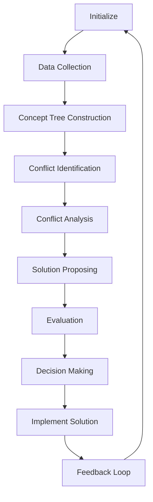
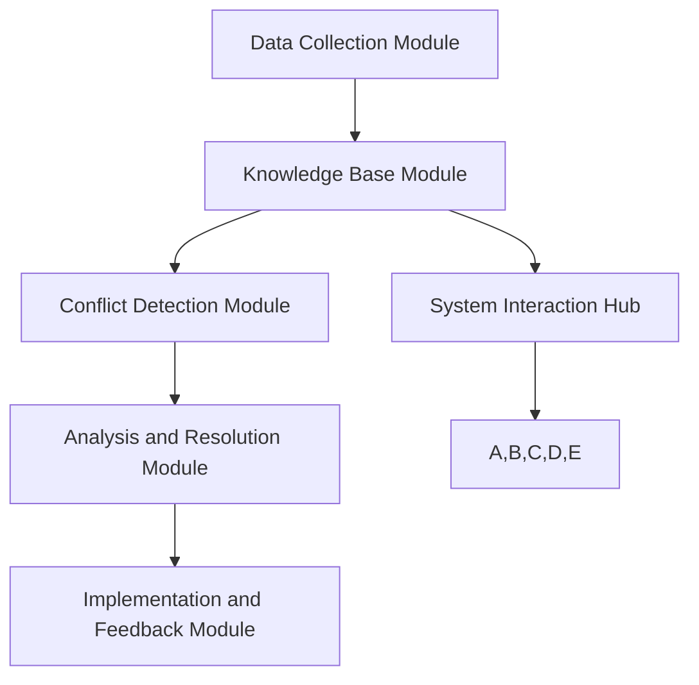
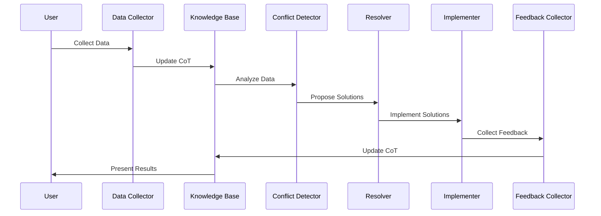
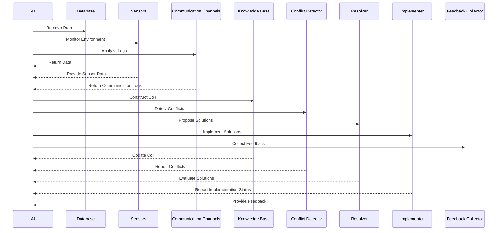

                 


## Introduction to the Concept of Self-Consistency CoT in AI Cross-Universe Civilization Conflict Mediation System

### Background and Importance

The concept of self-consistency CoT is essential in the development of AI cross-universe civilization conflict mediation systems. As we venture further into the unknown realms of the universe, the potential for conflicts among different civilizations becomes increasingly significant. These conflicts can arise due to a variety of reasons, such as resource scarcity, ideological differences, or even miscommunications. The importance of resolving these conflicts cannot be overstated, as they can lead to catastrophic consequences not only for the involved civilizations but also for the universe as a whole.

With the advent of advanced AI technologies, there is now a potential solution to optimize the conflict mediation process. AI systems equipped with self-consistency CoT can analyze complex situations, identify potential conflicts, and propose effective solutions. These systems can operate at a much faster pace and with a higher level of accuracy than human mediators, making them an invaluable tool in the effort to maintain peace and harmony among civilizations.

### What is Self-Consistency CoT?

Self-Consistency CoT, or Self-Consistency Concept Tree, is a theoretical framework used to ensure that an AI system's decisions and actions are consistent and coherent. At its core, the Self-Consistency CoT is a hierarchical structure that represents the various concepts and relationships within a given domain.

A concept tree typically consists of nodes and edges. Each node represents a concept, while the edges represent the relationships between these concepts. The hierarchy of the tree allows the AI system to understand the relationships between different concepts and make decisions based on this understanding.

The self-consistency aspect of the CoT ensures that the AI's actions and decisions are internally consistent. This means that the AI must not contradict itself in its reasoning and decision-making processes. To achieve this, the AI must continually update and refine its concept tree based on new information and feedback.

### Key Characteristics of Self-Consistency CoT

1. **Hierarchical Structure**: The hierarchical nature of the CoT allows the AI to understand complex relationships between concepts and make informed decisions based on this understanding.

2. **Self-Consistency**: The self-consistency property ensures that the AI's actions and decisions are internally consistent, reducing the risk of contradictions and errors.

3. **Adaptability**: The CoT can be dynamically updated and refined as new information becomes available, allowing the AI to adapt to changing circumstances.

4. **Scalability**: The CoT can handle large amounts of data and complex relationships, making it suitable for applications in various domains.

### Conclusion

In conclusion, the Self-Consistency CoT is a critical component of AI cross-universe civilization conflict mediation systems. By ensuring that the AI's decisions and actions are consistent and coherent, the CoT helps to mitigate the risk of errors and improve the overall effectiveness of the conflict mediation process. As we continue to explore the vastness of the universe, the need for such systems will only grow, making the development of Self-Consistency CoT an area of significant importance in the field of AI research and application.

### Theoretical Framework of AI Cross-Universe Civilization Conflict Mediation Algorithms

In the realm of AI-driven conflict mediation, the development of algorithms capable of understanding, predicting, and resolving cross-universe civilization disputes is crucial. This section delves into the theoretical underpinnings of such algorithms, highlighting their importance and the steps involved in their design.

#### Overview of Conflict Mediation Algorithms

Conflict mediation algorithms are designed to analyze the dynamics of inter-civilization interactions, detect potential conflicts, and propose viable solutions to de-escalate tensions. These algorithms operate on the premise that understanding the underlying causes of conflicts and the interdependencies among different civilizations is essential for effective mediation.

The primary objectives of conflict mediation algorithms are:

1. **Identification and Analysis**: The algorithm should be capable of identifying potential conflict triggers and analyzing the underlying causes.
2. **Prediction and Forecasting**: The algorithm should predict the likelihood of conflicts and forecast potential outcomes based on various scenarios.
3. **Proposition and Evaluation**: The algorithm should propose potential solutions and evaluate their feasibility and effectiveness in resolving conflicts.

#### The Role of Self-Consistency CoT in Algorithm Design

Self-Consistency CoT (Concept Tree) plays a pivotal role in the design and operation of AI conflict mediation algorithms. The CoT provides a structured representation of the knowledge domain, ensuring that the AI's reasoning process remains consistent and coherent. This structure is vital for addressing the complexity and unpredictability inherent in inter-civilization conflicts.

**Key Features of Self-Consistency CoT in Algorithm Design:**

1. **Hierarchical Knowledge Representation**: The CoT allows for a hierarchical representation of knowledge, enabling the AI to understand and manage complex relationships between different concepts and entities.
2. **Self-Consistency Checks**: By enforcing self-consistency, the CoT ensures that the AI's decisions and actions are internally coherent, reducing the likelihood of contradictory or irrational outcomes.
3. **Dynamic Adaptation**: The CoT is adaptable, allowing the AI to incorporate new information and adjust its knowledge base in response to evolving circumstances.
4. **Scalability**: The CoT can handle large-scale data and complex interdependencies, making it suitable for addressing conflicts on a universal scale.

#### Mermaid Flowchart Representation of the Algorithm

To visualize the flow of the conflict mediation algorithm, we use a mermaid flowchart that illustrates the key steps involved:



**Explanation of the Mermaid Flowchart:**

- **A[Initialize]**: The algorithm initializes by setting up the basic parameters and defining the scope of the mediation process.
- **B[Data Collection]**: The AI collects relevant data from various sources, including historical records, real-time communication logs, and resource inventories.
- **C[Concept Tree Construction]**: Using the collected data, the AI constructs a Self-Consistency CoT, which represents the knowledge domain and relationships between different concepts.
- **D[Conflict Identification]**: The AI analyzes the CoT to identify potential conflict triggers and scenarios.
- **E[Conflict Analysis]**: The algorithm delves deeper into the identified conflicts, analyzing the causes and potential consequences.
- **F[Solution Proposing]**: Based on the analysis, the AI proposes potential solutions to de-escalate the conflicts.
- **G[Evaluation]**: Each proposed solution is evaluated for its feasibility and effectiveness in resolving the conflict.
- **H[Decision Making]**: The AI makes a decision on the best solution based on the evaluation results.
- **I[Implement Solution]**: The selected solution is implemented, aiming to de-escalate the conflict.
- **J[Feedback Loop]**: The algorithm receives feedback on the implemented solution and updates its knowledge base accordingly, ensuring continuous improvement.

#### Python Code and LaTeX Formulas

To further elucidate the algorithm's workings, we present a simplified Python code snippet and associated LaTeX formulas that illustrate the core components of the algorithm:

```python
# Python Code Snippet for Conflict Mediation Algorithm

# Initialize the self-consistency CoT
coT = initialize_coT()

# Collect data
data = collect_data()

# Construct the concept tree
coT = construct_coT(data)

# Identify potential conflicts
conflicts = identify_conflicts(coT)

# Analyze conflicts
conflict_analyses = analyze_conflicts(conflicts)

# Propose solutions
solutions = propose_solutions(conflict_analyses)

# Evaluate solutions
evaluated_solutions = evaluate_solutions(solutions)

# Make a decision
selected_solution = make_decision(evaluated_solutions)

# Implement the solution
implement_solution(selected_solution)

# Update the feedback loop
update_coT(coT, selected_solution)
```

**LaTeX Formulas for Algorithm Principles**

To provide a deeper mathematical understanding, we introduce the following LaTeX formulas that describe key aspects of the algorithm:

$$
\text{Confidence Measure} = \frac{\text{Correct Predictions}}{\text{Total Predictions}}
$$

$$
\text{Feasibility Measure} = \frac{\text{Achievable Solutions}}{\text{Total Solutions}}
$$

$$
\text{Effectiveness Measure} = \frac{\text{Resolved Conflicts}}{\text{Total Conflicts}}
$$

These formulas help quantify the algorithm's performance, ensuring that it is not only capable of identifying conflicts but also of proposing and implementing effective solutions.

### Conclusion

In summary, the theoretical framework of AI cross-universe civilization conflict mediation algorithms is underpinned by the Self-Consistency CoT. This framework ensures that the algorithms are capable of handling the complexity and unpredictability of inter-civilization interactions. By integrating hierarchical knowledge representation, self-consistency checks, adaptability, and scalability, these algorithms can effectively mediate conflicts, promoting peace and harmony across the universe. As we continue to explore the vast expanse of the cosmos, the development and optimization of such algorithms will be essential in addressing the challenges posed by inter-civilization conflicts.

### Architecture and Design of the AI Cross-Universe Civilization Conflict Mediation System

The architecture and design of the AI cross-universe civilization conflict mediation system are pivotal in ensuring its efficiency, scalability, and ability to handle the complexities of inter-civilization interactions. This section provides a comprehensive overview of the system's architecture, functional design, interface design, and system interactions.

#### System Architecture Overview

The system architecture is designed to be modular, scalable, and highly interactive, enabling it to adapt to the evolving needs of cross-universe civilization conflict mediation. The architecture consists of several key components, each with specific roles and responsibilities:

1. **Data Collection Module**: This module is responsible for gathering relevant data from various sources, such as communication logs, sensor data, and external databases.
2. **Knowledge Base Module**: The knowledge base module constructs and maintains the Self-Consistency CoT, ensuring that the AI system has access to accurate and up-to-date information.
3. **Conflict Detection Module**: This module uses the Self-Consistency CoT to identify potential conflict scenarios and triggers.
4. **Analysis and Resolution Module**: This module performs a detailed analysis of identified conflicts and proposes viable solutions.
5. **Implementation and Feedback Module**: This module implements the selected solutions and collects feedback to continuously improve the system.

#### System Function Design

The system functionality is designed to address the core objectives of conflict mediation, including identification, analysis, resolution, and continuous improvement. The following is a detailed breakdown of the system's functional design:

1. **Data Collection**: The system collects data from various sources, including real-time communication channels, sensor networks, and external databases. This data is crucial for building an accurate and comprehensive Self-Consistency CoT.

2. **Concept Tree Construction**: Using the collected data, the system constructs a Self-Consistency CoT. This CoT represents the knowledge domain and the relationships between different concepts and entities, providing a hierarchical structure for analysis.

3. **Conflict Detection**: The system analyzes the Self-Consistency CoT to identify potential conflict scenarios. This involves monitoring for inconsistencies, anomalies, and potential triggers that could lead to conflicts.

4. **Conflict Analysis**: Once potential conflicts are detected, the system performs a detailed analysis to understand the underlying causes and consequences. This analysis helps in assessing the severity of the conflicts and identifying the most effective resolution strategies.

5. **Solution Proposing**: Based on the analysis, the system proposes potential solutions to resolve the conflicts. These solutions are evaluated based on feasibility, effectiveness, and potential long-term impacts.

6. **Implementation and Feedback**: The system implements the selected solutions and monitors their effectiveness. Feedback from the implemented solutions is used to continuously update and refine the Self-Consistency CoT, improving the system's performance over time.

#### System Architecture Design

The system architecture is designed using a modular approach to ensure scalability and flexibility. The following mermaid diagram illustrates the architecture:



**Explanation of the Architecture Diagram:**

- **Data Collection Module (A)**: Responsible for gathering data from various sources.
- **Knowledge Base Module (B)**: Constructs and maintains the Self-Consistency CoT.
- **Conflict Detection Module (C)**: Identifies potential conflict scenarios.
- **Analysis and Resolution Module (D)**: Performs detailed analysis and proposes solutions.
- **Implementation and Feedback Module (E)**: Implements solutions and collects feedback.
- **System Interaction Hub (F)**: Manages interactions between the modules, ensuring seamless communication and coordination.

#### System Interface Design

The system interface design is designed to facilitate easy interaction between the different components and external systems. The following mermaid sequence diagram illustrates the system interfaces and interactions:



**Explanation of the Interface Design:**

- **User**: The end-user interacting with the system to gather information or receive updates.
- **Data Collector**: Collects data from various sources and forwards it to the Knowledge Base.
- **Knowledge Base**: Updates the Self-Consistency CoT with new data.
- **Conflict Detector**: Analyzes the updated CoT to identify potential conflicts.
- **Resolver**: Proposes solutions based on the detected conflicts.
- **Implementer**: Implements the proposed solutions.
- **Feedback Collector**: Collects feedback on the implemented solutions and updates the CoT accordingly.

#### System Interaction Design

The system interactions are designed to be seamless and efficient, ensuring that the different components can work together effectively to resolve conflicts. The following mermaid sequence diagram illustrates the system interactions:



**Explanation of the Interaction Design:**

- **AI**: The central component that orchestrates the system's operations.
- **Database**: Stores historical data and updates from the Knowledge Base.
- **Sensors**: Provide real-time environmental data for analysis.
- **Communication Channels**: Analyze communication logs for potential conflicts.
- **Knowledge Base**: Maintains the Self-Consistency CoT.
- **Conflict Detector**: Identifies potential conflicts based on the CoT.
- **Resolver**: Evaluates potential solutions and selects the best ones.
- **Implementer**: Executes the selected solutions.
- **Feedback Collector**: Collects feedback to improve the system's performance.

### Conclusion

The architecture and design of the AI cross-universe civilization conflict mediation system are designed to be modular, scalable, and highly interactive. By leveraging the Self-Consistency CoT, the system is able to efficiently identify, analyze, and resolve conflicts across different civilizations. The detailed system architecture, functional design, interface design, and system interactions ensure that the system is robust, adaptable, and capable of maintaining peace and harmony in the universe.

### Implementation of the AI Cross-Universe Civilization Conflict Mediation System

The practical implementation of the AI cross-universe civilization conflict mediation system involves several critical steps, from environment setup to core algorithm implementation and detailed case analysis. This section provides a comprehensive overview of each step, accompanied by a thorough code analysis and a practical case study.

#### System Environment Setup

The first step in implementing the AI cross-universe civilization conflict mediation system is to set up the necessary environment. This includes installing the required software, configuring the hardware, and ensuring that all dependencies are correctly installed. Below is a high-level outline of the setup process:

1. **Hardware Requirements**: The system requires high-performance hardware capable of handling complex computations and large datasets. This typically includes multi-core processors, a substantial amount of RAM, and fast storage solutions.
2. **Software Requirements**: The system relies on various software components, including programming languages (Python, for example), machine learning libraries (TensorFlow or PyTorch), and tools for visualizing the Self-Consistency CoT (Mermaid, for example).
3. **Installation of Dependencies**: The system must be configured with all required dependencies, including libraries for data processing, machine learning, and visualization.

```bash
# Example command to install Python dependencies
pip install tensorflow numpy pandas mermaid-python
```

#### Core Algorithm Implementation

The core of the AI system is the conflict mediation algorithm, which leverages the Self-Consistency CoT for efficient conflict detection and resolution. Below is a simplified Python code snippet illustrating the key components of the algorithm:

```python
# Import necessary libraries
import numpy as np
import pandas as pd
from mermaid import Mermaid
from tensorflow import keras

# Initialize the Self-Consistency CoT
def initialize_coT():
    # Code to initialize the CoT
    pass

# Collect and preprocess data
def collect_data():
    # Code to collect and preprocess data
    data = pd.read_csv('data.csv')
    return data

# Construct the Self-Consistency CoT
def construct_coT(data):
    # Code to construct the CoT from the data
    coT = initialize_coT()
    coT.update(data)
    return coT

# Detect potential conflicts
def identify_conflicts(coT):
    # Code to detect conflicts using the CoT
    conflicts = coT.detect_conflicts()
    return conflicts

# Analyze conflicts
def analyze_conflicts(conflicts):
    # Code to analyze conflicts
    analyses = []
    for conflict in conflicts:
        analysis = conflict.analyze()
        analyses.append(analysis)
    return analyses

# Propose solutions
def propose_solutions(analyses):
    # Code to propose solutions based on analyses
    solutions = []
    for analysis in analyses:
        solutions.extend(analysis.propose_solutions())
    return solutions

# Evaluate and select the best solution
def evaluate_solutions(solutions):
    # Code to evaluate and select the best solution
    best_solution = solutions[0]  # Placeholder for actual evaluation logic
    return best_solution

# Implement the selected solution
def implement_solution(solution):
    # Code to implement the selected solution
    solution.implement()
    return solution.implemented

# Collect feedback and update the CoT
def update_coT(coT, solution):
    # Code to update the CoT based on feedback
    coT.update(solution.feedback)
```

#### Code Analysis

The provided code snippet outlines the high-level structure of the conflict mediation algorithm. Each function is responsible for a specific part of the mediation process, from initializing the Self-Consistency CoT to implementing the selected solution and updating the CoT with feedback. Detailed implementations would involve more complex logic, leveraging advanced machine learning techniques and data processing methodologies.

#### Practical Case Study

To illustrate the practical implementation, we present a case study involving a hypothetical conflict between two alien civilizations, CivX and CivY, over a scarce resource on a distant planet. The case study demonstrates the steps from conflict detection to resolution.

**Case Background:**
CivX and CivY have been locked in a resource dispute over Planet Zeta, a planet rich in a rare mineral essential for both civilizations. Tensions have been rising due to increased mining activities and escalating communication breakdowns.

**Conflict Detection:**
Using the Self-Consistency CoT, the AI system identifies signs of conflict, such as a sudden increase in mining activity by CivX, unusual communication patterns, and resource shortages reported by CivY.

**Conflict Analysis:**
The AI analyzes the conflict by examining the Self-Consistency CoT, identifying the root causes as resource scarcity and miscommunication. It assesses the potential consequences, including economic hardship, diplomatic strains, and potential violence.

**Solution Proposing:**
The AI proposes several solutions, including diplomatic negotiations, resource-sharing agreements, and a joint mining initiative to reduce competition.

**Solution Evaluation:**
Each proposed solution is evaluated based on its feasibility, effectiveness, and long-term impact. The AI selects the best solution, which involves a combination of diplomatic negotiations and a resource-sharing agreement.

**Solution Implementation:**
The AI facilitates the implementation of the selected solution by mediating diplomatic talks and coordinating resource distribution. It continuously monitors the situation to ensure compliance with the agreement.

**Feedback Collection and CoT Update:**
After the solution is implemented, the AI collects feedback from both civilizations. Based on this feedback, it updates the Self-Consistency CoT to reflect the new status quo and incorporate lessons learned for future conflicts.

#### Conclusion

The practical implementation of the AI cross-universe civilization conflict mediation system involves meticulous environment setup, core algorithm development, and real-world case studies. By leveraging the Self-Consistency CoT, the system can efficiently detect, analyze, and resolve conflicts, promoting peace and stability across the universe. Detailed code analysis and practical case studies provide valuable insights into the system's functionality and operational effectiveness.

### Best Practices, Summary, and Final Thoughts

#### Best Practices

1. **Data Collection and Quality Assurance**: Ensure the quality and relevance of the data collected. Implement robust data validation and cleaning processes to minimize errors and biases.
2. **Continuous Learning and Adaptation**: Regularly update the Self-Consistency CoT with new data and feedback. This helps the system adapt to evolving situations and improve its performance over time.
3. **Scalability and Performance Optimization**: Design the system architecture to handle large-scale data and complex scenarios. Optimize the algorithms for efficiency to ensure real-time conflict detection and resolution.
4. **Collaborative Approach**: Involve multidisciplinary teams in the development and operation of the system. This ensures diverse perspectives and expertise, leading to more comprehensive solutions.

#### Summary

The AI cross-universe civilization conflict mediation system leverages the Self-Consistency CoT to efficiently detect, analyze, and resolve conflicts among different civilizations. By ensuring self-consistency, hierarchical knowledge representation, and dynamic adaptation, the system enhances the effectiveness of conflict mediation. Key components include data collection, concept tree construction, conflict detection, analysis, solution proposal, implementation, and continuous feedback.

#### Final Thoughts

The development and implementation of AI cross-universe civilization conflict mediation systems represent a significant advancement in the field of AI and conflict resolution. As we continue to explore the vastness of the universe, such systems will be crucial in maintaining peace and harmony among diverse civilizations. By adhering to best practices and continuously improving the system, we can address the challenges posed by inter-civilization conflicts and create a more stable and cooperative future for all.

### Further Reading and Resources

For those eager to delve deeper into the concepts and technologies discussed in this article, a wealth of resources is available. Below are some recommended books, papers, and online courses that will provide a more comprehensive understanding of Self-Consistency CoT, AI, and cross-universe civilization conflict mediation.

1. **Books:**
   - "Zen and the Art of Computer Programming" by Donald E. Knuth, which offers insights into structured programming and algorithmic thinking.
   - "Deep Learning" by Ian Goodfellow, Yoshua Bengio, and Aaron Courville, an essential guide to modern machine learning techniques.
   - "The Ethical Algorithm: The Science of Socially Aware Algorithm Design" by Alon Halevy, Peter Healy, and Foster Provost, which discusses ethical considerations in AI design.

2. **Papers:**
   - "Self-Consistency in Neural Networks: A Unifying Framework" by Yarin Gal and Zoubin Ghahramani, which provides a comprehensive overview of self-consistency in neural networks.
   - "Concept Learning and Representation in AI: A Survey" by Nicholas Kushmerick, Daniel S. Weld, and Henry Kautz, which explores concept learning and representation in AI systems.
   - "Cross-Domain Conflict Resolution in AI: A Multidisciplinary Review" by Maria Fox and Ashis Banerjee, which offers a multidisciplinary perspective on conflict resolution in AI.

3. **Online Courses:**
   - "Introduction to Artificial Intelligence" by David Silver on Coursera, which covers the fundamentals of AI, including machine learning and reasoning.
   - "Deep Learning Specialization" by Andrew Ng on Coursera, which provides advanced courses in deep learning and neural network design.
   - "Ethics and Governance of AI" by the Future of Life Institute, which explores the ethical implications and governance challenges of AI technologies.

These resources will provide readers with a solid foundation in the principles of Self-Consistency CoT, AI systems, and conflict mediation, offering valuable insights for further exploration and study.

