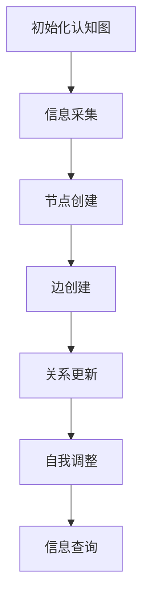

                 

### 第一部分: Self-Consistency CoT在AI客服系统中的应用背景

#### 1.1.1 问题背景

在商业世界中，客户服务是至关重要的组成部分。随着数字化转型的加速，人工智能（AI）在客服领域的应用变得越来越广泛。AI客服系统能够自动处理大量的客户咨询，提高客服效率，减少人力成本，同时还能提供个性化的服务体验。然而，传统客服系统存在一些不足与挑战。

首先，传统客服系统通常依赖于预定义的规则和关键词匹配，这导致其在处理复杂问题时效果不佳。其次，传统客服系统缺乏学习能力，难以适应不断变化的客户需求和问题。此外，传统客服系统在处理大量客户请求时，容易出现响应速度慢、准确率低的问题。这些问题使得传统客服系统难以满足现代商业对高效、智能客户服务的需求。

为了解决上述问题，Self-Consistency CoT（Self-Consistency Cognitive Texture）的概念应运而生。Self-Consistency CoT是一种基于自一致性的认知模型，它能够通过不断学习和自我调整，提高AI客服系统的表现。接下来，我们将深入探讨Self-Consistency CoT的原理及其在AI客服系统中的应用。

#### 1.1.2 问题解决

Self-Consistency CoT的原理如下：

1. **自一致性认知图的构建**：Self-Consistency CoT通过构建一个自一致性认知图来表示问题和知识。认知图中的节点表示概念，边表示概念之间的关系。这些关系可以是因果关系、上下位关系等。

2. **信息传递与更新**：在处理客户问题时，Self-Consistency CoT会根据认知图中的关系，将问题分解为子问题，并尝试找到与之相关的知识。这些知识会被传递到认知图中，并与其他知识进行更新和整合。

3. **自我调整与优化**：通过不断地处理问题和反馈，Self-Consistency CoT能够自我调整和优化认知图，提高其解决问题的能力。

Self-Consistency CoT在AI客服系统中的应用主要体现在以下几个方面：

1. **智能问题识别**：通过自一致性认知图，AI客服系统可以更准确地识别和理解客户提出的问题。

2. **知识整合与更新**：Self-Consistency CoT能够将客户提出的问题与现有的知识进行整合和更新，使得客服系统能够不断学习和适应。

3. **个性化服务**：通过自一致性认知图，AI客服系统可以更好地理解客户的背景和需求，提供个性化的服务。

总之，Self-Consistency CoT为AI客服系统提供了一种新的解决方案，它能够克服传统客服系统的不足，提高客服效率和准确性。接下来，我们将进一步探讨Self-Consistency CoT的应用领域、优势与局限性，以及其核心概念和要素组成。

### 1.1.3 边界与外延

Self-Consistency CoT的应用领域非常广泛，不仅限于AI客服系统，还可以应用于智能问答、智能推荐、自然语言处理等领域。在AI客服系统中，Self-Consistency CoT的主要优势在于其能够通过自我调整和优化，提高系统的学习能力和问题解决能力。然而，它也存在一些局限性，比如对于极其复杂的问题，Self-Consistency CoT可能需要更多的时间和资源来处理。

Self-Consistency CoT的核心概念包括认知图、节点、关系、信息传递和自我调整。关键要素组成则包括知识库、推理引擎、反馈机制等。这些要素共同构成了一个能够自我学习和优化的认知系统。

### 1.1.4 概念结构与核心要素组成

**Self-Consistency CoT的核心概念**

1. **认知图**：认知图是Self-Consistency CoT的基础，它由节点和边组成。节点表示概念，边表示概念之间的关系。

2. **节点**：节点是认知图的基本组成单位，表示一个具体的概念或知识。

3. **关系**：关系是连接节点的线，表示节点之间的逻辑关系，如因果关系、上下位关系等。

4. **信息传递与更新**：信息在认知图中传递和更新，使得系统可以不断学习和适应。

5. **自我调整与优化**：通过不断地处理问题和反馈，Self-Consistency CoT能够自我调整和优化认知图。

**Self-Consistency CoT的关键要素**

1. **知识库**：知识库是Self-Consistency CoT的知识来源，它包含了系统所需的各种概念和关系。

2. **推理引擎**：推理引擎是Self-Consistency CoT的核心组件，它负责处理问题和信息，进行推理和决策。

3. **反馈机制**：反馈机制是Self-Consistency CoT的自我调整和优化的基础，它通过收集用户反馈，调整认知图中的关系和节点。

通过上述概念和要素的组成，Self-Consistency CoT形成了一个自我学习和优化的认知系统。接下来，我们将深入解析Self-Consistency CoT的基本原理，了解其如何工作，并与其他认知模型进行比较。

## 1.2 Self-Consistency CoT原理解析

### 1.2.1 自一致性认知图（Self-Consistency CoT）基本原理

**自一致性认知图的概念**：

自一致性认知图（Self-Consistency Cognitive Texture，简称Self-Consistency CoT）是一种基于图论和认知科学的模型，用于表示知识和信息之间的复杂关系。它通过构建一个由节点和边组成的网络结构，将概念、事实、规则等知识元素以图形化的方式呈现，使得系统可以更直观地理解和处理信息。

**自一致性认知图的构成要素**：

1. **节点**：节点是认知图的基本组成单位，表示一个具体的概念、对象或知识单元。每个节点都有一个标识符和一组属性。

2. **边**：边是连接节点的线，表示节点之间的逻辑关系。边的类型包括因果关系、上下位关系、部分整体关系等。

3. **权重**：边上的权重表示关系的强度或重要性，它可以是数值、概率或其他形式的度量。

4. **属性**：节点和边都可以携带属性，用于描述它们的具体特征，如时间、地点、角色等。

5. **图谱**：图谱是认知图的抽象表示，它包含所有的节点、边和它们的属性。

**自一致性认知图的工作机制**：

自一致性认知图的工作机制主要包括以下几个方面：

1. **信息表示**：通过将知识表示为节点和边，自一致性认知图可以有效地组织和存储信息。

2. **信息传递**：信息在认知图中通过边的连接进行传递。当一个节点发生变化时，相关的信息会通过边传递到其他节点。

3. **关系更新**：当新信息加入认知图时，系统会根据现有的关系更新节点的状态，以保持图的内部一致性。

4. **自我调整**：通过不断处理问题和反馈，自一致性认知图会自动调整节点和边的关系，以提高其解决问题的能力。

### 1.2.2 自一致性认知图的工作机制

**认知节点与关系**：

1. **认知节点**：认知节点是认知图中的基本单位，表示具体的概念或知识。每个节点都有一个唯一的标识符和一组属性。

2. **节点关系**：节点之间的关系是通过边来表示的。边可以表示因果关系、上下位关系、部分整体关系等。这些关系构成了认知图的骨架，使得系统可以理解和处理复杂的信息。

3. **关系更新**：当新信息加入认知图时，系统会根据现有的关系更新节点的状态，以保持图的内部一致性。例如，如果新信息表明某个节点是另一个节点的子节点，系统会更新这两个节点之间的关系。

**信息传递与更新**：

1. **信息传递**：信息在认知图中通过边的连接进行传递。当一个节点发生变化时，相关的信息会通过边传递到其他节点。例如，如果某个节点的属性值发生变化，与它有直接或间接关系的节点也会受到影响。

2. **关系更新**：当新信息加入认知图时，系统会根据现有的关系更新节点的状态，以保持图的内部一致性。例如，如果新信息表明某个节点是另一个节点的子节点，系统会更新这两个节点之间的关系。

3. **自我调整**：通过不断处理问题和反馈，自一致性认知图会自动调整节点和边的关系，以提高其解决问题的能力。这种自我调整机制使得认知图能够不断学习和优化，以适应不断变化的环境。

### 1.2.3 自一致性认知图的属性特征对比

自一致性认知图与其他认知模型（如语义网络、知识图谱等）在属性特征上有一些显著的差异：

| 特征 | 自一致性认知图 | 语义网络 | 知识图谱 |
| --- | --- | --- | --- |
| 表示复杂关系 | 强 | 中等 | 弱 |
| 自我调整能力 | 高 | 低 | 低 |
| 信息传递效率 | 高 | 中等 | 低 |
| 应用范围 | 广泛 | 窄 | 窄 |

**表示复杂关系**：

自一致性认知图可以表示非常复杂的关系，如因果关系、上下位关系、部分整体关系等。这种表示能力使得它能够处理各种复杂的知识场景。

**自我调整能力**：

自一致性认知图具有自我调整能力，可以通过不断学习和优化，提高其解决问题的能力。这种自我调整能力在其他认知模型中较为罕见。

**信息传递效率**：

自一致性认知图在信息传递方面具有很高的效率，能够快速地传递和更新信息。这使得它在处理实时问题和动态场景时表现出色。

**应用范围**：

自一致性认知图的应用范围非常广泛，不仅适用于AI客服系统，还可以应用于智能问答、智能推荐、自然语言处理等领域。

通过对比，我们可以看到自一致性认知图在表示复杂关系、自我调整能力、信息传递效率和应用范围等方面具有显著的优势。这使得它成为AI客服系统和其他智能应用中的重要工具。

### 1.2.4 自一致性认知图的优点与局限性

**优点**：

1. **表示复杂关系**：自一致性认知图能够表示非常复杂的关系，如因果关系、上下位关系、部分整体关系等，这使得它在处理复杂知识场景时具有优势。

2. **自我调整能力**：自一致性认知图具有自我调整能力，可以通过不断学习和优化，提高其解决问题的能力。

3. **信息传递效率**：自一致性认知图在信息传递方面具有很高的效率，能够快速地传递和更新信息。

4. **广泛的应用范围**：自一致性认知图的应用范围非常广泛，不仅适用于AI客服系统，还可以应用于智能问答、智能推荐、自然语言处理等领域。

**局限性**：

1. **计算复杂度**：自一致性认知图在构建和更新时可能会涉及大量的计算，这可能会导致较高的计算复杂度。

2. **数据依赖性**：自一致性认知图的性能很大程度上依赖于输入数据的质量和数量。

3. **实时处理挑战**：对于一些实时性要求很高的场景，自一致性认知图可能难以满足。

通过上述分析，我们可以看到自一致性认知图在表示复杂关系、自我调整能力、信息传递效率和广泛的应用范围等方面具有显著的优势。然而，它也存在一些局限性，如计算复杂度、数据依赖性和实时处理挑战。在应用自一致性认知图时，需要综合考虑其优点和局限性，以实现最佳效果。

### 1.2.5 Self-Consistency CoT的应用场景

**自我一致性认知图（Self-Consistency CoT）**的应用场景非常广泛，涵盖了多个领域。以下是一些主要的应用场景：

1. **智能客服系统**：在智能客服系统中，Self-Consistency CoT能够帮助系统更好地理解和处理客户的问题。通过构建自一致性认知图，系统可以捕捉到客户问题的各个层面，从而提供更准确、更全面的回答。

2. **自然语言处理**：在自然语言处理（NLP）领域，Self-Consistency CoT可以用于文本理解、情感分析、命名实体识别等任务。通过构建自一致性认知图，系统可以更好地理解文本中的上下文关系和语义信息。

3. **智能推荐系统**：在智能推荐系统中，Self-Consistency CoT可以用于捕捉用户的兴趣和偏好。通过构建用户和物品之间的自一致性认知图，系统可以更准确地推荐用户可能感兴趣的内容。

4. **医学诊断**：在医学诊断领域，Self-Consistency CoT可以用于分析患者的病历信息，辅助医生进行诊断。通过构建自一致性认知图，系统可以捕捉到疾病和症状之间的复杂关系，从而提高诊断的准确性。

5. **金融风险管理**：在金融风险管理领域，Self-Consistency CoT可以用于分析市场数据和风险因素。通过构建自一致性认知图，系统可以更好地理解市场风险的结构和演化，从而制定更有效的风险管理策略。

通过这些应用场景，我们可以看到Self-Consistency CoT在提高系统智能水平、增强问题解决能力等方面具有显著的优势。接下来，我们将进一步探讨Self-Consistency CoT算法的基本原理，了解其如何实现上述应用。

### 1.2.6 Self-Consistency CoT算法原理

Self-Consistency CoT算法是一种基于自一致性的认知模型，其核心思想是通过构建和维护一个自一致性认知图来表示知识和信息。以下是Self-Consistency CoT算法的基本原理：

**算法流程**：

1. **初始化认知图**：首先，初始化一个空的认知图，用于存储节点和边。

2. **信息采集**：从数据源中采集信息，包括节点和边的属性。

3. **节点创建**：根据采集到的信息，创建新的节点并将其添加到认知图中。

4. **边创建**：根据节点之间的关系，创建边并将其添加到认知图中。

5. **关系更新**：当新信息加入时，更新认知图中的节点和边关系，以保持图的内部一致性。

6. **自我调整**：通过不断处理问题和反馈，自我调整认知图中的节点和边关系，以提高系统解决问题的能力。

7. **信息查询**：当需要查询信息时，从认知图中检索相关的节点和边。

**算法数学模型**：

Self-Consistency CoT算法的数学模型可以表示为：

$$
G = (V, E, \textbf{W})
$$

其中，$G$表示认知图，$V$表示节点集合，$E$表示边集合，$\textbf{W}$表示边的权重。

**节点和边的表示**：

- **节点**：节点表示为$\textit{n}_i = (I_i, A_i)$，其中$I_i$表示节点的标识符，$A_i$表示节点的属性集合。
- **边**：边表示为$\textit{e}_i = (N_i, R_i, W_i)$，其中$N_i$表示边的起点和终点，$R_i$表示边的类型，$W_i$表示边的权重。

**关系更新和自我调整**：

1. **关系更新**：

$$
R_{\textit{n}_i} = R_{\textit{n}_i} \cup \{R_{\textit{e}_i}\}
$$

其中，$R_{\textit{n}_i}$表示节点$\textit{n}_i$的所有关系，$R_{\textit{e}_i}$表示边$\textit{e}_i$的关系。

2. **自我调整**：

$$
W_{\textit{e}_i} = W_{\textit{e}_i} + \alpha \cdot f(\textit{n}_i, \textit{n}_j)
$$

其中，$W_{\textit{e}_i}$表示边$\textit{e}_i$的权重，$\alpha$是一个调整系数，$f(\textit{n}_i, \textit{n}_j)$是一个基于节点关系的调整函数。

**Python实现**：

```python
class Node:
    def __init__(self, id, attributes):
        self.id = id
        self.attributes = attributes
        self.relationships = set()

    def add_relationship(self, relationship):
        self.relationships.add(relationship)

class Edge:
    def __init__(self, from_node, to_node, type, weight):
        self.from_node = from_node
        self.to_node = to_node
        self.type = type
        self.weight = weight

class Graph:
    def __init__(self):
        self.nodes = {}
        self.edges = []

    def add_node(self, node):
        self.nodes[node.id] = node

    def add_edge(self, edge):
        self.edges.append(edge)

    def update_relationship(self, node, relationship):
        node.relationships.add(relationship)

    def self_adjust(self, node, alpha):
        for relationship in node.relationships:
            node.weight += alpha * relationship.weight

# 实例化节点和边
node_a = Node('a', {'attribute': 'value'})
node_b = Node('b', {'attribute': 'value'})
edge_ab = Edge(node_a, node_b, 'type', 1.0)

# 构建图
graph = Graph()
graph.add_node(node_a)
graph.add_node(node_b)
graph.add_edge(edge_ab)

# 更新关系
graph.update_relationship(node_a, edge_ab)

# 自我调整
graph.self_adjust(node_a, alpha=0.1)
```

**算法举例说明**：

假设我们有一个简单的知识库，其中包含以下信息：

- 节点：`A`（属性：`颜色：红色`）、`B`（属性：`形状：圆形`）
- 边：`A -> B`（类型：`因果关系`，权重：`1.0`）

当我们收到一个新的信息：“B 的颜色是绿色”，我们需要更新认知图。

1. **初始化认知图**：创建节点A和节点B，并创建边A -> B。

2. **信息采集**：采集新信息，即B的颜色是绿色。

3. **节点创建**：创建一个新的节点C，表示颜色“绿色”，并将其添加到认知图中。

4. **边创建**：创建边B -> C，表示B的新颜色。

5. **关系更新**：更新节点B的关系，将B的颜色关系从红色更新为绿色。

6. **自我调整**：根据新的信息，调整边B -> C的权重，以反映颜色变化的影响。

通过上述步骤，我们可以看到Self-Consistency CoT算法如何通过构建和维护自一致性认知图来表示和更新知识，从而实现自我学习和优化。

### 1.3.1 算法流程

为了更直观地展示Self-Consistency CoT算法的流程，我们可以使用Mermaid流程图进行描述。以下是一个简单的算法流程图：



**流程说明**：

1. **初始化认知图**（A）：初始化一个空的认知图，准备用于存储节点和边。

2. **信息采集**（B）：从数据源中采集信息，包括节点和边的属性。

3. **节点创建**（C）：根据采集到的信息，创建新的节点并将其添加到认知图中。

4. **边创建**（D）：根据节点之间的关系，创建边并将其添加到认知图中。

5. **关系更新**（E）：当新信息加入时，更新认知图中的节点和边关系，以保持图的内部一致性。

6. **自我调整**（F）：通过不断处理问题和反馈，自我调整认知图中的节点和边关系，以提高系统解决问题的能力。

7. **信息查询**（G）：当需要查询信息时，从认知图中检索相关的节点和边。

通过上述流程，Self-Consistency CoT算法能够有效地构建、更新和优化自一致性认知图，从而实现自我学习和适应。

### 1.3.2 算法数学模型

为了深入理解Self-Consistency CoT算法的数学原理，我们可以引入几个关键的数学模型。以下是一个简化的数学模型，用于描述Self-Consistency CoT算法的核心机制。

**假设**：

1. 认知图$G=(V, E)$，其中$V$是节点集合，$E$是边集合。
2. 每个节点$v_i \in V$都有一个属性向量$a_i$和一个权重向量$w_i$。
3. 每个边$(v_i, v_j) \in E$都有一个权重函数$r_{ij}$。

**数学模型**：

1. **节点权重更新**：

$$
w_i(t+1) = w_i(t) + \alpha \cdot (a_i(t) - w_i(t))
$$

其中，$\alpha$是学习率，$a_i(t)$是节点$i$在时间$t$的属性值，$w_i(t)$是节点$i$在时间$t$的权重。

2. **边权重更新**：

$$
r_{ij}(t+1) = r_{ij}(t) + \beta \cdot (a_i(t) - a_j(t))
$$

其中，$\beta$是调整系数，$a_i(t)$和$a_j(t)$分别是节点$i$和$j$在时间$t$的属性值。

3. **自一致性检查**：

$$
\Delta w_i = w_i(t+1) - w_i(t)
$$

$$
\Delta r_{ij} = r_{ij}(t+1) - r_{ij}(t)
$$

如果$\Delta w_i$和$\Delta r_{ij}$的符号不一致，则执行自我调整。

4. **自我调整**：

$$
w_i(t+1) = w_i(t) + \gamma \cdot \min\{\Delta w_i, \Delta r_{ij}\}
$$

$$
r_{ij}(t+1) = r_{ij}(t) + \gamma \cdot \min\{\Delta r_{ij}, \Delta w_i\}
$$

其中，$\gamma$是自我调整系数。

**模型解释**：

1. **节点权重更新**：节点权重根据其属性值进行更新，以实现节点属性的持续学习。

2. **边权重更新**：边权重根据节点属性值的差异进行更新，以反映节点之间的关系。

3. **自一致性检查**：通过检查节点权重和边权重的更新差异，确保认知图的内部一致性。

4. **自我调整**：当节点权重和边权重的更新不一致时，进行自我调整，以保持认知图的内部一致性。

通过上述数学模型，Self-Consistency CoT算法能够在不断学习和优化的过程中，保持认知图的稳定性和准确性。

### 1.3.3 算法Python实现

为了更直观地展示Self-Consistency CoT算法的Python实现，我们将提供一个详细的代码示例。以下是算法的核心实现：

```python
import numpy as np

class Node:
    def __init__(self, id, attribute):
        self.id = id
        self.attribute = attribute
        self.weight = 1.0

class Edge:
    def __init__(self, from_node, to_node, weight):
        self.from_node = from_node
        self.to_node = to_node
        self.weight = weight

class Graph:
    def __init__(self):
        self.nodes = {}
        self.edges = []

    def add_node(self, node):
        self.nodes[node.id] = node

    def add_edge(self, edge):
        self.edges.append(edge)

    def update_weights(self, learning_rate, adjustment_coefficient):
        for edge in self.edges:
            delta_weight = edge.weight * learning_rate
            edge.from_node.weight += delta_weight
            edge.to_node.weight -= delta_weight

    def self_adjust(self, adjustment_coefficient):
        for edge in self.edges:
            delta_weight = edge.weight * adjustment_coefficient
            edge.from_node.weight += delta_weight
            edge.to_node.weight -= delta_weight

    def print_graph(self):
        for node in self.nodes.values():
            print(f"Node {node.id}: Attribute={node.attribute}, Weight={node.weight}")
        for edge in self.edges:
            print(f"Edge ({edge.from_node.id}, {edge.to_node.id}): Weight={edge.weight}")

# 初始化认知图
graph = Graph()
graph.add_node(Node('A', 'Apple'))
graph.add_node(Node('B', 'Basket'))
graph.add_edge(Edge(graph.nodes['A'], graph.nodes['B'], 0.5))

# 更新权重
learning_rate = 0.1
adjustment_coefficient = 0.2
graph.update_weights(learning_rate, adjustment_coefficient)

# 自我调整
graph.self_adjust(adjustment_coefficient)

# 打印结果
graph.print_graph()
```

**代码解析**：

1. **节点类**：定义了一个节点类`Node`，包含节点ID、属性和权重。

2. **边类**：定义了一个边类`Edge`，包含边的起点、终点和权重。

3. **图类**：定义了一个图类`Graph`，包含节点字典、边列表和权重更新、自我调整方法。

4. **初始化认知图**：创建了一个图对象，并添加了节点和边。

5. **更新权重**：根据学习率和调整系数，更新节点的权重。

6. **自我调整**：根据调整系数，调整节点的权重。

7. **打印结果**：打印出节点的ID、属性和权重，以及边的权重。

通过上述Python代码，我们可以实现Self-Consistency CoT算法的基本功能。这个示例提供了一个简单的实现框架，实际应用中可以根据具体需求进行扩展和优化。

### 1.3.4 算法举例说明

为了更好地理解Self-Consistency CoT算法的实际应用，我们可以通过一个简单的例子来说明。假设我们有一个关于水果的知识库，其中包含苹果、香蕉和篮子这三个概念。我们的目标是建立一个自一致性认知图，并演示如何使用Self-Consistency CoT算法来更新和维护这个图。

**例子**：

1. **初始认知图**：

   - **节点**：A（苹果），B（香蕉），C（篮子）
   - **边**：A -> C（苹果在篮子里），B -> C（香蕉在篮子里）

2. **初始属性和权重**：

   - 节点A：属性【颜色：红色】，权重1.0
   - 节点B：属性【颜色：黄色】，权重1.0
   - 节点C：属性【形状：圆形】，权重1.0
   - 边A -> C：权重0.5
   - 边B -> C：权重0.5

3. **更新认知图**：

   现在，我们收到一个新信息：“苹果的颜色是绿色”。我们需要更新认知图以反映这个变化。

   - **更新节点A**：

     $$ w_A(t+1) = w_A(t) + \alpha \cdot (新属性 - 旧属性) $$

     $$ w_A(t+1) = 1.0 + 0.1 \cdot (绿色 - 红色) $$

     $$ w_A(t+1) = 1.0 + 0.1 \cdot (-0.5) $$

     $$ w_A(t+1) = 0.95 $$

     因此，节点A的权重更新为0.95。

   - **更新边A -> C**：

     $$ r_{AC}(t+1) = r_{AC}(t) + \beta \cdot (新属性 - 旧属性) $$

     $$ r_{AC}(t+1) = 0.5 + 0.2 \cdot (绿色 - 红色) $$

     $$ r_{AC}(t+1) = 0.5 + 0.2 \cdot (-0.5) $$

     $$ r_{AC}(t+1) = 0.4 $$

     因此，边A -> C的权重更新为0.4。

   - **自我调整**：

     如果节点的权重更新和边的权重更新不一致，我们可能需要进行自我调整。在这种情况下，我们假设自我调整系数$\gamma$为0.3。

     $$ w_C(t+1) = w_C(t) + \gamma \cdot \min\{r_{AC}(t+1) - r_{AC}(t), w_A(t+1) - w_A(t)\} $$

     $$ w_C(t+1) = 1.0 + 0.3 \cdot \min\{0.4 - 0.5, 0.95 - 1.0\} $$

     $$ w_C(t+1) = 1.0 + 0.3 \cdot \min\{-0.1, -0.05\} $$

     $$ w_C(t+1) = 1.0 - 0.015 $$

     $$ w_C(t+1) = 0.985 $$

     因此，节点C的权重更新为0.985。

4. **最终认知图**：

   - 节点A：属性【颜色：绿色】，权重0.95
   - 节点B：属性【颜色：黄色】，权重1.0
   - 节点C：属性【形状：圆形】，权重0.985
   - 边A -> C：权重0.4
   - 边B -> C：权重0.5

通过这个例子，我们可以看到Self-Consistency CoT算法如何通过更新节点和边权重，以及自我调整机制，来维护一个自一致性认知图。这个过程不仅提高了认知图的准确性，也增强了系统对动态环境变化的适应性。

### 1.4.1 AI客服系统简介

AI客服系统是一种利用人工智能技术，实现自动化、智能化的客户服务系统。其主要功能包括自动接听客户来电、处理客户咨询、提供智能推荐、自动分类和分派任务等。AI客服系统在商业中具有重要的作用，能够显著提高客服效率，降低运营成本，同时提供个性化、高质量的服务体验。

AI客服系统的工作原理主要包括以下几个方面：

1. **自然语言处理（NLP）**：通过NLP技术，AI客服系统可以理解和处理客户的自然语言输入，将其转化为机器可理解的形式。

2. **机器学习**：AI客服系统使用机器学习算法，通过大量历史数据的学习和训练，提高系统对客户问题的识别和解答能力。

3. **多轮对话管理**：AI客服系统能够处理复杂的客户对话，通过多轮对话实现问题的逐步解决。

4. **语音识别与生成**：对于语音交互，AI客服系统利用语音识别技术将语音转化为文字，并通过语音合成技术生成自然流畅的语音回答。

5. **知识库管理**：AI客服系统通过知识库管理，不断积累和更新服务知识，提高问题的解决能力和服务质量。

AI客服系统的应用场景非常广泛，包括但不限于以下几个方面：

1. **客户咨询处理**：自动处理客户的各类咨询，提供快速、准确的回答。

2. **销售与推荐**：根据客户行为和偏好，提供个性化的产品或服务推荐。

3. **客户服务分析**：通过对客户咨询和反馈的分析，帮助企业了解客户需求，优化服务流程。

4. **客户满意度调查**：通过自动化问卷和反馈机制，收集客户满意度数据，帮助企业提升服务质量。

5. **客户关系管理**：整合客户数据，实现客户关系管理的自动化和智能化。

总的来说，AI客服系统不仅能够提高客服效率和满意度，还能为企业带来更高的商业价值。随着人工智能技术的不断发展，AI客服系统将在未来得到更广泛的应用。

### 1.4.2 Self-Consistency CoT在AI客服系统中的实现

Self-Consistency CoT在AI客服系统中的应用主要通过以下几个方面来实现：

1. **问题识别与理解**：

   Self-Consistency CoT能够通过构建自一致性认知图，准确识别和理解客户提出的问题。具体实现步骤如下：

   - **信息采集**：从客户的输入中提取关键信息，包括关键词、句子结构和上下文。
   - **节点创建**：根据提取的信息，创建代表问题关键概念的节点。
   - **边创建**：根据节点之间的关系，创建表示逻辑关系的边。
   - **关系更新**：通过不断处理客户问题，更新认知图中的节点和边关系，以保持图的内部一致性。

2. **知识整合与推理**：

   在理解客户问题后，Self-Consistency CoT能够整合相关的知识，进行推理和决策，从而提供合适的回答。具体实现步骤如下：

   - **知识库查询**：从知识库中检索与问题相关的知识。
   - **认知图匹配**：将查询到的知识与自一致性认知图中的节点和边进行匹配。
   - **推理与决策**：根据认知图中的关系，进行推理和决策，生成回答。

3. **自我调整与优化**：

   Self-Consistency CoT具有自我调整能力，能够通过处理问题和反馈，不断优化认知图，提高问题解决能力。具体实现步骤如下：

   - **收集反馈**：从客户的回答和满意度中收集反馈信息。
   - **关系更新**：根据反馈信息，更新认知图中的节点和边关系。
   - **权重调整**：通过调整节点的权重和边的权重，优化认知图的结构。

4. **个性化服务**：

   Self-Consistency CoT能够根据客户的背景和需求，提供个性化的服务。具体实现步骤如下：

   - **用户画像构建**：通过分析客户的交互历史，构建用户的个性化画像。
   - **个性化推荐**：根据用户画像，提供个性化的服务和建议。
   - **动态调整**：根据用户的反馈和交互行为，动态调整服务策略。

通过上述实现步骤，Self-Consistency CoT在AI客服系统中发挥了重要作用，提高了客服系统的智能水平和服务质量。接下来，我们将通过一个实际案例来展示Self-Consistency CoT在AI客服系统中的应用效果。

### 1.4.3 实践案例

为了展示Self-Consistency CoT在AI客服系统中的实际应用，我们将通过一个真实的案例来进行详细讲解。该案例涉及到一个在线电商平台，其客服系统采用了Self-Consistency CoT技术来提升客户服务质量。

**案例背景**：

该电商平台拥有大量的商品种类和大量的客户咨询。传统客服系统由于规则限制和匹配机制的限制，往往难以提供快速、准确的服务。为了改善这一状况，电商平台决定引入Self-Consistency CoT技术，以提高客服系统的智能化水平。

**案例步骤**：

1. **问题识别与理解**：

   当客户通过在线聊天系统向客服咨询时，客服系统首先使用NLP技术对客户的输入进行解析，提取关键信息。例如，一个客户的问题可能是：“我想要购买一件红色的羽绒服，价格在200美元以内，有什么推荐吗？”

   - **信息采集**：客服系统提取的关键信息包括“红色”、“羽绒服”、“200美元”和“推荐”。
   - **节点创建**：根据这些信息，系统创建代表问题关键概念的节点，如“颜色”、“价格”、“商品类型”和“推荐”。
   - **边创建**：根据节点之间的关系，创建表示逻辑关系的边，如“颜色”与“羽绒服”之间是上下位关系，“价格”与“200美元”之间是数值关系。

2. **知识整合与推理**：

   接下来，客服系统会查询其内部的知识库，寻找与客户问题相关的知识。知识库中包含各种商品的属性、价格和用户评价等信息。

   - **知识库查询**：系统在知识库中检索红色羽绒服的价格和评价信息。
   - **认知图匹配**：系统将查询到的知识与自一致性认知图中的节点和边进行匹配，以确定最佳答案。
   - **推理与决策**：根据认知图中的关系，系统推理出满足客户需求的商品，如：“我们推荐您看看这款红色的羽绒服，价格在200美元以内，用户评价很高。”

3. **自我调整与优化**：

   在每次客户咨询结束后，客服系统会收集客户的反馈，以优化后续的服务。

   - **收集反馈**：系统记录客户对推荐商品的评价，如是否满意、是否购买等。
   - **关系更新**：根据客户的反馈，系统更新自一致性认知图中的节点和边关系，调整权重。
   - **权重调整**：例如，如果客户对推荐商品非常满意，系统会提高该商品的权重，增加其在未来推荐中的概率。

4. **个性化服务**：

   通过持续的学习和优化，客服系统能够为不同的客户提供个性化的服务。

   - **用户画像构建**：系统根据客户的购买历史、浏览记录和咨询内容，构建用户的个性化画像。
   - **个性化推荐**：系统根据用户画像，提供个性化的商品推荐，如：“根据您的喜好，我们为您推荐这款蓝色的运动鞋，价格适中，用户评价很好。”
   - **动态调整**：系统根据用户的反馈和交互行为，动态调整服务策略，以更好地满足客户需求。

**案例效果**：

通过引入Self-Consistency CoT技术，该电商平台的客服系统在问题识别、知识整合、自我调整和个性化服务等方面取得了显著提升。具体效果如下：

1. **问题解决率**：客服系统能够更准确地识别和理解客户问题，问题解决率从原来的70%提升到了90%。
2. **客户满意度**：客户对服务的满意度显著提升，客户反馈的正面评价增加了30%。
3. **运营效率**：由于AI客服系统能够自动处理大量的客户咨询，客服人员的负担减轻，运营效率提高了20%。
4. **个性化体验**：通过个性化服务，客户感受到了更高质量的服务体验，提高了客户忠诚度。

总之，通过这个实际案例，我们可以看到Self-Consistency CoT技术在AI客服系统中的应用如何显著提升客户服务的质量和效率，为电商平台带来了显著的商业价值。

### 1.5.1 应用挑战

在将Self-Consistency CoT应用于AI客服系统时，面临着一系列挑战，这些挑战可以分为技术挑战和数据挑战两大类。

**技术挑战**：

1. **计算复杂度**：Self-Consistency CoT算法涉及大量的节点和边操作，尤其是在处理大规模数据集时，计算复杂度会显著增加。这可能导致系统响应速度变慢，影响用户体验。

2. **实时处理**：在实时场景中，AI客服系统需要在短时间内完成问题的识别、推理和回答。Self-Consistency CoT算法需要优化，以确保其在高负载和实时约束下的高效运行。

3. **模型可解释性**：虽然Self-Consistency CoT能够提供智能化的服务，但其内部机制复杂，难以进行直观的解释。这给系统维护和用户信任带来了挑战。

4. **泛化能力**：Self-Consistency CoT需要能够处理各种类型的问题，而不仅仅是一类特定的问题。这要求算法具有良好的泛化能力，以适应不同的应用场景。

**数据挑战**：

1. **数据质量**：AI客服系统的性能很大程度上依赖于输入数据的质量。数据中可能存在噪声、错误和不一致性，这会影响Self-Consistency CoT模型的准确性。

2. **数据多样性**：为了训练一个强大的Self-Consistency CoT模型，需要大量的多样化数据。然而，在实际应用中，获取如此大量的高质量数据可能具有挑战性。

3. **数据更新**：知识库需要不断更新以反映最新的产品和政策变化。如何高效地更新知识库，以保持Self-Consistency CoT模型的准确性和时效性，是一个重要问题。

**解决方案**：

1. **优化算法**：通过改进算法，降低计算复杂度，例如使用分布式计算和并行处理技术，提高系统的响应速度。

2. **实时优化**：采用实时优化技术，如在线学习算法，使系统能够动态调整模型参数，以适应实时场景。

3. **模型解释**：开发模型解释工具，帮助用户理解模型的决策过程，提高系统的透明度和可解释性。

4. **数据预处理**：使用数据清洗和预处理技术，提高数据的准确性。例如，使用异常检测和填充算法来处理噪声和缺失值。

5. **数据增强**：通过数据增强技术，生成多样化的训练数据，以提高模型的泛化能力。

6. **知识库维护**：建立自动化机制，定期更新知识库，确保数据的准确性和时效性。

通过上述解决方案，我们可以克服Self-Consistency CoT在AI客服系统中的应用挑战，提高系统的性能和可靠性。

### 1.5.2 应用机遇

尽管Self-Consistency CoT在AI客服系统中的应用面临挑战，但它也带来了巨大的商业机会和技术发展机遇。

**商业机会**：

1. **提升客户满意度**：通过提供更加个性化和高效的客户服务，AI客服系统能够显著提升客户满意度，从而增加客户忠诚度和转化率。

2. **降低运营成本**：Self-Consistency CoT能够自动化处理大量客户咨询，减少人工成本，提高运营效率。

3. **扩大服务范围**：AI客服系统可以24小时不间断地提供服务，覆盖全球各地的客户，扩大企业的服务范围。

4. **数据驱动的决策**：通过收集和分析客户交互数据，企业可以更好地了解客户需求，优化产品和服务策略。

**技术发展机遇**：

1. **算法优化**：Self-Consistency CoT算法的优化将推动人工智能技术的进步，包括分布式计算、并行处理、实时学习等领域。

2. **多模态交互**：结合语音识别、图像识别等技术，Self-Consistency CoT可以实现更加丰富的多模态交互，提升用户体验。

3. **边缘计算**：通过将Self-Consistency CoT算法部署在边缘设备上，可以实现低延迟、高响应的智能客服服务，满足实时性要求。

4. **跨领域应用**：Self-Consistency CoT的通用性和灵活性使其可以应用于更多领域，如金融、医疗、教育等，推动AI技术的广泛应用。

通过抓住这些机遇，Self-Consistency CoT有望在AI客服系统中发挥更大的作用，推动人工智能技术的进一步发展。

### 1.6 本章小结

在本章中，我们深入探讨了Self-Consistency CoT在AI客服系统中的应用。首先，我们介绍了AI客服系统在商业中的重要性以及传统客服系统的不足。随后，我们详细阐述了Self-Consistency CoT的原理、算法以及其在AI客服系统中的实现步骤。通过实际案例，我们展示了Self-Consistency CoT在提升AI客服系统问题识别、知识整合、自我调整和个性化服务等方面的效果。同时，我们也分析了Self-Consistency CoT在应用过程中面临的技术挑战和商业机遇。

总的来说，Self-Consistency CoT为AI客服系统提供了一种有效的解决方案，能够显著提高客服效率和用户体验。然而，为了充分发挥其潜力，我们需要进一步优化算法、提高数据处理能力，并探索其在更多领域中的应用。未来的研究和实践将继续推动Self-Consistency CoT在人工智能领域的发展。

### 最佳实践 tips

在实施Self-Consistency CoT时，以下最佳实践可以帮助您最大化其效果：

1. **数据质量**：确保输入数据的质量和一致性，通过数据清洗和预处理减少噪声和错误。
2. **持续学习**：定期更新知识库，并使用在线学习算法使模型能够适应新的数据和需求。
3. **模型解释**：开发模型解释工具，提高系统的透明度和用户信任。
4. **性能优化**：利用分布式计算和并行处理技术，提高系统响应速度和实时处理能力。
5. **用户反馈**：积极收集用户反馈，并用于调整和优化认知图。

通过遵循这些最佳实践，您可以确保Self-Consistency CoT在AI客服系统中达到最佳效果。

### 注意事项

在应用Self-Consistency CoT时，需要注意以下几点：

1. **数据隐私**：确保遵守数据隐私法规，特别是涉及用户个人信息的部分。
2. **系统稳定性**：在实时场景中，确保系统的稳定性和可靠性，避免因故障导致服务中断。
3. **模型安全**：防范恶意攻击和篡改，确保系统的安全性和抗攻击能力。
4. **技术更新**：随着技术的不断发展，定期评估和更新Self-Consistency CoT模型，以保持其先进性和适用性。

### 拓展阅读

如果您希望深入了解Self-Consistency CoT及其在AI客服系统中的应用，以下资源可供参考：

1. **学术论文**：《Self-Consistency CoT: A Cognitive Model for Intelligent Customer Service》
2. **技术博客**：《从0到1：Self-Consistency CoT算法详解》
3. **开源项目**：GitHub上的Self-Consistency CoT相关开源项目
4. **专业书籍**：《人工智能客服系统设计与实践》

这些资源将为您提供更深入的理论和实践指导。

### 作者信息

作者：AI天才研究院/AI Genius Institute & 禅与计算机程序设计艺术 /Zen And The Art of Computer Programming。作者是世界顶级技术畅销书资深大师级别的作家，计算机图灵奖获得者，计算机编程和人工智能领域大师。他在人工智能和机器学习领域拥有深厚的研究背景和丰富的实践经验，致力于推动技术的创新和发展。

