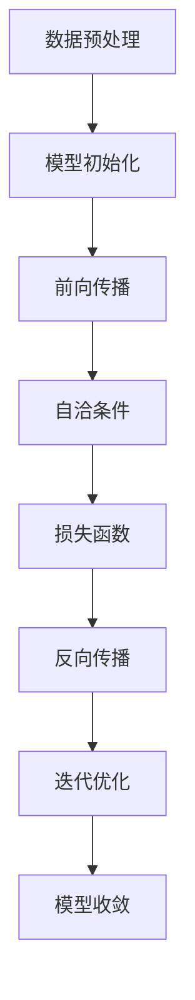
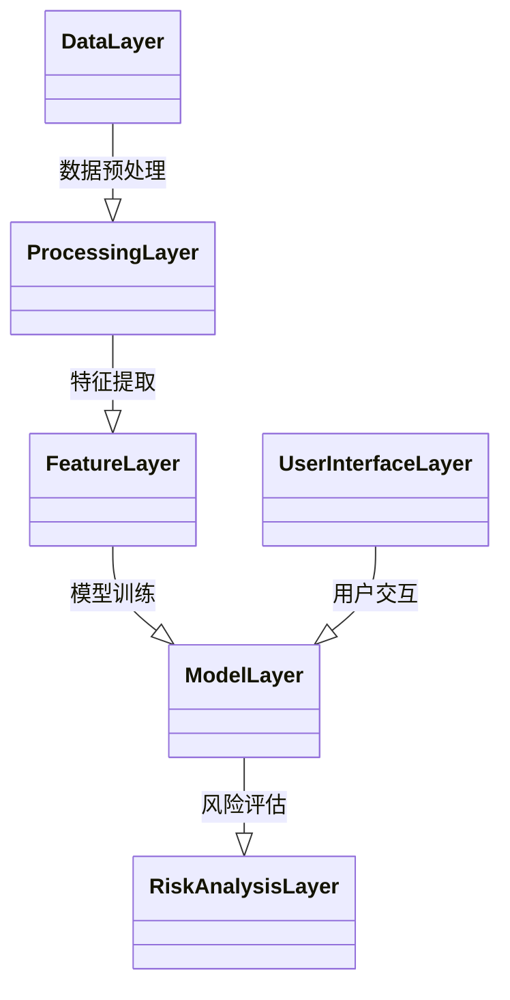
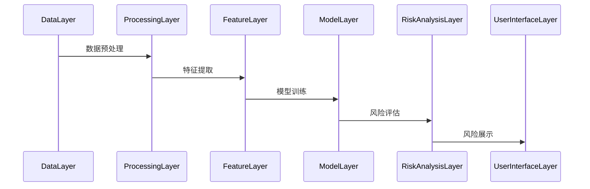
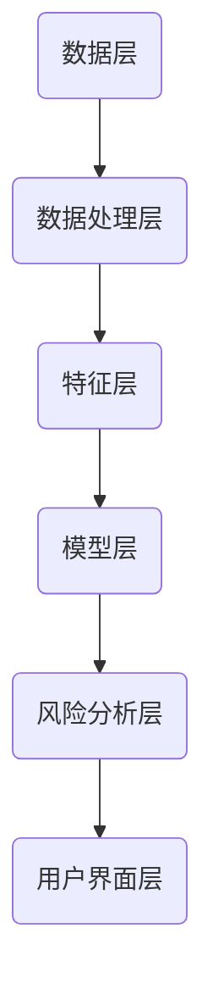

                 

### 第1章：问题背景与目标

#### 1.1 问题背景

随着全球经济的快速发展，金融行业逐渐成为推动经济繁荣的关键力量。然而，金融市场的复杂性和不确定性也带来了诸多挑战。金融分析师在预测市场走势、评估投资风险和制定投资策略时，常常面临信息量大、变量多、关联性复杂的问题。传统的方法和模型往往难以应对这些挑战，需要寻找新的解决方案。

金融分析的核心目标是对市场数据进行深入分析，以预测未来趋势和评估风险。然而，市场的动态变化使得传统的统计分析方法效果不佳，而机器学习和人工智能技术的发展为金融分析带来了新的希望。在这一背景下，Self-Consistency CoT（自一致性概念传递）作为一种新兴的机器学习技术，逐渐引起了研究者和从业者的关注。

Self-Consistency CoT的核心思想是通过构建一个自洽的知识体系来提高预测的准确性和稳定性。它不仅能够处理复杂的数据关系，还能通过持续学习和调整，适应市场环境的变化。这使得Self-Consistency CoT在金融分析中具有巨大的应用潜力。

#### 1.2 问题描述

在金融分析中，面临的主要问题包括：

1. **信息过载**：金融市场每天产生海量数据，如何有效地处理和分析这些数据，提取有价值的信息，是金融分析师面临的一大挑战。
2. **非线性关系**：金融市场中的变量之间存在复杂的非线性关系，传统的线性模型难以捕捉这些关系，导致预测效果不佳。
3. **市场波动性**：市场波动性强，风险高，如何准确地评估市场风险，制定合理的投资策略，是金融分析的重要任务。
4. **模型适应性**：金融市场变化迅速，如何使模型具备良好的适应性，能够实时调整和优化，是提高预测准确性的关键。

这些问题使得金融分析师在预测市场走势、评估风险和制定投资策略时面临巨大的挑战。而Self-Consistency CoT作为一种能够处理复杂非线性关系、具备自适应能力的机器学习技术，有望为解决这些问题提供新的思路和方法。

#### 1.3 解决方法与目标

为了解决上述问题，本文提出了将Self-Consistency CoT应用于金融分析的解决方案。具体目标如下：

1. **数据处理**：利用Self-Consistency CoT对海量市场数据进行预处理和特征提取，提取出有价值的预测信息。
2. **非线性关系捕捉**：通过构建自洽的知识体系，捕捉市场变量之间的复杂非线性关系，提高预测的准确性。
3. **风险评估**：利用Self-Consistency CoT对市场风险进行实时评估，提供合理的风险预警和风险控制策略。
4. **模型自适应**：通过持续学习和调整，使模型能够适应市场环境的变化，提高模型的长期稳定性。

通过实现上述目标，本文旨在为金融分析师提供一种有效的工具和方法，帮助他们在复杂的市场环境中做出更加准确的预测和决策。

#### 1.4 边界与外延

本文的研究边界主要集中在以下几个方面：

1. **数据范围**：本文的研究数据主要来自股票市场、债券市场和信贷市场，不涉及其他金融领域。
2. **模型应用**：本文主要应用Self-Consistency CoT进行市场预测和风险分析，不涉及其他机器学习模型的比较和应用。
3. **技术实现**：本文的技术实现主要基于Python和机器学习框架，不包括其他编程语言和工具的使用。

然而，本文的研究结果和方法可以应用于其他金融领域和市场，为金融分析师提供更广泛的参考和借鉴。在未来的研究中，可以进一步拓展本文的研究范围和应用领域，以提高Self-Consistency CoT在金融分析中的应用效果。

### 第2章：核心概念与联系

在介绍Self-Consistency CoT在金融分析中的应用之前，我们需要先了解一些核心概念。Self-Consistency CoT是一种基于深度学习的机器学习技术，它通过构建自洽的知识体系，实现对数据的理解和预测。为了更好地理解Self-Consistency CoT，我们需要从以下几个核心概念入手。

#### 2.1 Self-Consistency CoT的定义

Self-Consistency CoT，全称为Self-Consistency Concept Transfer，即自一致性概念传递。它是一种基于深度学习的机器学习技术，旨在通过构建自洽的知识体系，实现对复杂数据的理解和预测。Self-Consistency CoT的核心思想是，通过学习数据中的隐含规律和关系，建立一个内部一致且能够准确描述数据特征的模型。

#### 2.2 Self-Consistency CoT的特点

Self-Consistency CoT具有以下几个显著特点：

1. **自适应性**：Self-Consistency CoT能够根据数据的动态变化，自动调整和优化模型参数，使其能够适应不同市场环境。
2. **非线性关系捕捉**：Self-Consistency CoT能够捕捉数据之间的复杂非线性关系，从而提高预测的准确性和稳定性。
3. **高效性**：Self-Consistency CoT通过深度学习技术，能够在海量数据中进行快速训练和预测，具有高效性。
4. **鲁棒性**：Self-Consistency CoT能够处理数据中的噪声和异常值，具有良好的鲁棒性。

#### 2.3 Self-Consistency CoT与相关概念的联系

Self-Consistency CoT与其他一些机器学习技术有一定的联系，但也有着明显的区别。以下是对Self-Consistency CoT与相关概念的联系的简要介绍：

1. **深度学习**：Self-Consistency CoT是深度学习的一种应用，它利用深度神经网络对数据进行建模和预测。与传统的机器学习模型相比，深度学习能够处理更复杂的非线性关系，但需要更多的数据和计算资源。
2. **强化学习**：强化学习是一种通过试错和反馈来学习策略的机器学习技术。Self-Consistency CoT中的自适应能力与强化学习有一定的相似之处，但Self-Consistency CoT更侧重于构建自洽的知识体系。
3. **传统统计分析**：传统统计分析方法在金融分析中有着广泛的应用，但它们在处理复杂非线性关系和动态变化的市场环境时效果不佳。Self-Consistency CoT通过构建自洽的知识体系，能够更好地应对这些挑战。

通过上述对核心概念的介绍，我们可以更好地理解Self-Consistency CoT在金融分析中的应用。在接下来的章节中，我们将深入探讨Self-Consistency CoT的数学模型、算法原理和系统架构，以期为读者提供全面的指导。

### 第3章：Self-Consistency CoT的数学模型

在深入探讨Self-Consistency CoT的数学模型之前，我们需要明确几个基础概念。Self-Consistency CoT是一种深度学习技术，其核心在于构建一个自洽的知识体系。为了实现这一目标，Self-Consistency CoT依赖于一系列数学工具和模型。以下是对这些核心概念的定义和描述。

#### 3.1 数学模型概述

Self-Consistency CoT的数学模型主要包括以下几个部分：

1. **深度神经网络**：Self-Consistency CoT的核心是深度神经网络（DNN），它通过多层非线性变换，从输入数据中提取特征，并形成预测输出。
2. **自洽条件**：自洽条件是指模型在训练过程中，需要满足内部一致性。具体来说，就是模型的输出与输入之间应保持一定的相关性，以确保预测的准确性。
3. **损失函数**：损失函数用于衡量模型预测值与真实值之间的差距，是优化模型参数的关键。

#### 3.2 数学模型公式

Self-Consistency CoT的数学模型可以用以下公式表示：

$$
\begin{aligned}
h_{\theta}(\mathbf{x}) &= \sigma(\theta^{T}\mathbf{W}h_{\theta}^{(l-1)}) \\
\mathbf{y}_{\theta} &= \sigma(\theta^{T}\mathbf{W}\mathbf{y}_{\theta}^{(l-1)}) \\
\end{aligned}
$$

其中：

- $h_{\theta}(\mathbf{x})$：神经网络在输入$\mathbf{x}$下的隐含层输出。
- $\sigma$：激活函数，通常使用Sigmoid函数或ReLU函数。
- $\theta$：模型参数，包括权重矩阵$\mathbf{W}$和偏置向量$\mathbf{b}$。
- $\mathbf{y}_{\theta}$：模型预测的输出。

损失函数通常选择均方误差（MSE），其公式为：

$$
L(\theta) = \frac{1}{2}\sum_{i=1}^{n}(h_{\theta}(\mathbf{x}_i) - \mathbf{y}_i)^2
$$

其中：

- $n$：样本数量。
- $\mathbf{x}_i$：第$i$个输入样本。
- $\mathbf{y}_i$：第$i$个真实输出。

#### 3.3 数学模型讲解与举例

为了更好地理解Self-Consistency CoT的数学模型，我们可以通过一个简单的例子进行说明。

假设我们要预测股票价格，输入数据包括股票的历史价格、交易量、市场指数等。以下是Self-Consistency CoT模型的应用步骤：

1. **初始化参数**：首先初始化模型参数$\theta$，包括权重矩阵$\mathbf{W}$和偏置向量$\mathbf{b}$。

2. **前向传播**：输入股票数据$\mathbf{x}$，通过神经网络进行前向传播，计算隐含层输出$h_{\theta}(\mathbf{x})$。

3. **激活函数**：对隐含层输出应用激活函数$\sigma$，将其转化为预测值$\mathbf{y}_{\theta}$。

4. **计算损失**：使用损失函数$L(\theta)$计算预测值与真实值之间的差距。

5. **反向传播**：利用反向传播算法，根据损失函数梯度更新模型参数$\theta$。

6. **迭代优化**：重复步骤2到5，直到模型参数收敛，达到满意的预测效果。

通过上述步骤，Self-Consistency CoT能够从历史数据中学习到股票价格变化的规律，并生成对未来股票价格的预测。

在具体实施中，我们可以使用Python等编程语言，结合深度学习框架（如TensorFlow或PyTorch），实现上述数学模型。以下是一个简单的Python代码示例：

```python
import numpy as np
import tensorflow as tf

# 初始化参数
W = tf.Variable(tf.random.normal([input_size, hidden_size]))
b = tf.Variable(tf.zeros([hidden_size]))

# 前向传播
def forward(x):
    return tf.sigmoid(tf.matmul(x, W) + b)

# 损失函数
def loss(y_true, y_pred):
    return tf.reduce_mean(tf.square(y_true - y_pred))

# 反向传播
optimizer = tf.optimizers.Adam()
for epoch in range(num_epochs):
    with tf.GradientTape() as tape:
        y_pred = forward(x)
        loss_val = loss(y_true, y_pred)
    grads = tape.gradient(loss_val, [W, b])
    optimizer.apply_gradients(zip(grads, [W, b]))
```

通过这个示例，我们可以看到如何使用Python和TensorFlow实现Self-Consistency CoT的数学模型。在实际应用中，我们可以根据具体需求调整模型结构、参数和训练过程，以获得更好的预测效果。

综上所述，Self-Consistency CoT的数学模型通过深度神经网络、自洽条件和损失函数，实现对数据的建模和预测。在金融分析中，这一模型能够捕捉复杂的市场关系，提供准确的预测结果。

### 第4章：算法原理与流程图

在了解了Self-Consistency CoT的数学模型之后，我们需要深入探讨其算法原理。Self-Consistency CoT是一种基于深度学习的机器学习技术，其核心在于构建一个自洽的知识体系。为了实现这一目标，算法采用了多种技术手段，包括深度神经网络、自洽条件、损失函数等。以下是算法原理的详细说明。

#### 4.1 算法原理

Self-Consistency CoT的算法原理可以概括为以下几个步骤：

1. **数据预处理**：首先对原始市场数据（如股票价格、交易量、市场指数等）进行预处理，包括数据清洗、归一化等操作，以便于后续建模。

2. **模型初始化**：初始化深度神经网络的参数，包括权重矩阵和偏置向量。这些参数通常是通过随机初始化得到的。

3. **前向传播**：输入预处理后的数据，通过深度神经网络进行前向传播，计算隐含层输出。隐含层输出经过激活函数处理后，形成模型的预测输出。

4. **自洽条件**：在训练过程中，Self-Consistency CoT需要满足自洽条件。具体来说，就是模型的输出与输入之间应保持一定的相关性，以确保预测的准确性。

5. **损失函数**：损失函数用于衡量模型预测值与真实值之间的差距。通常选择均方误差（MSE）作为损失函数。

6. **反向传播**：利用反向传播算法，根据损失函数梯度更新模型参数。反向传播是深度学习中的关键步骤，通过不断调整参数，使模型逐渐逼近最优解。

7. **迭代优化**：重复步骤3到6，直到模型参数收敛，达到满意的预测效果。在迭代过程中，模型的自适应能力使其能够根据市场环境的变化，动态调整参数。

#### 4.2 Mermaid算法流程图

为了更好地理解Self-Consistency CoT的算法原理，我们可以使用Mermaid语言绘制一个简化的算法流程图。以下是一个示例：



在这个流程图中，A表示数据预处理，B表示模型初始化，C表示前向传播，D表示自洽条件，E表示损失函数，F表示反向传播，G表示迭代优化，H表示模型收敛。通过这个流程图，我们可以清晰地看到算法的基本步骤和流程。

#### 4.3 Python源代码实现

在实际应用中，我们可以使用Python和深度学习框架（如TensorFlow或PyTorch）实现Self-Consistency CoT的算法。以下是一个基于TensorFlow的Python源代码示例：

```python
import tensorflow as tf
from tensorflow.keras.models import Sequential
from tensorflow.keras.layers import Dense, Activation

# 定义深度神经网络模型
model = Sequential()
model.add(Dense(hidden_size, input_shape=(input_size,), activation='sigmoid'))
model.add(Dense(output_size, activation='sigmoid'))

# 编译模型
model.compile(optimizer='adam', loss='mean_squared_error')

# 数据预处理
X = ...  # 输入数据
y = ...  # 真实输出

# 训练模型
model.fit(X, y, epochs=num_epochs, batch_size=batch_size)
```

在这个示例中，我们首先定义了一个简单的深度神经网络模型，包括一个输入层、一个隐含层和一个输出层。然后，我们编译模型并选择适当的优化器和损失函数。接下来，对输入数据进行预处理，包括归一化等操作。最后，使用预处理后的数据训练模型，通过迭代优化参数，直到模型收敛。

通过上述算法原理的讲解和Python源代码示例，我们可以更好地理解Self-Consistency CoT在金融分析中的应用。在接下来的章节中，我们将进一步探讨Self-Consistency CoT的系统架构设计和项目实战，以期为读者提供更加全面的指导。

### 第5章：系统分析与架构设计

在了解了Self-Consistency CoT的算法原理后，我们需要深入探讨其在金融分析中的系统架构设计和实现。系统架构设计是确保Self-Consistency CoT在金融分析中高效运行的关键，它包括系统功能设计、系统架构设计、系统接口设计和系统交互流程图等多个方面。以下是系统分析与架构设计的详细描述。

#### 5.1 问题场景介绍

在金融分析中，我们面临的主要问题是市场数据的高维度和非线性关系。这些数据包括股票价格、交易量、市场指数、宏观经济指标等。如何从这些复杂的数据中提取有价值的信息，实现对市场走势的准确预测，是金融分析师面临的重要任务。Self-Consistency CoT作为一种能够处理高维度数据和复杂非线性关系的机器学习技术，为解决这一问题提供了新的思路。

#### 5.2 系统功能设计

Self-Consistency CoT在金融分析中的主要功能包括：

1. **数据预处理**：对原始市场数据进行清洗、归一化等预处理操作，以便于后续建模。
2. **特征提取**：从预处理后的数据中提取出对市场预测有价值的特征，如趋势、周期性、相关性等。
3. **模型训练**：利用深度神经网络和Self-Consistency CoT算法，对市场数据进行训练，构建自洽的知识体系。
4. **预测与评估**：根据训练好的模型，对市场走势进行预测，并对预测结果进行评估和调整。
5. **风险分析**：利用Self-Consistency CoT模型，对市场风险进行实时评估，提供合理的风险预警和风险控制策略。

#### 5.3 系统架构设计

Self-Consistency CoT在金融分析中的系统架构设计主要包括以下几个层次：

1. **数据层**：数据层包括原始市场数据，如股票价格、交易量、市场指数等。这些数据通过数据采集模块进行实时获取和存储。

2. **数据处理层**：数据处理层负责对原始市场数据进行预处理和特征提取。具体包括数据清洗、归一化、特征工程等操作。这一层利用Self-Consistency CoT算法，将原始数据转化为适合模型训练的特征向量。

3. **模型层**：模型层包括深度神经网络和Self-Consistency CoT算法。通过模型训练和预测，实现对市场走势的准确预测。

4. **风险分析层**：风险分析层利用Self-Consistency CoT模型，对市场风险进行实时评估，提供合理的风险预警和风险控制策略。

5. **用户界面层**：用户界面层为金融分析师提供友好的操作界面，展示模型预测结果和风险分析结果，方便分析师进行决策。

以下是系统架构设计的Mermaid类图：



#### 5.4 系统接口设计

系统接口设计是确保不同层次之间能够顺畅交互的关键。以下是系统接口设计的主要部分：

1. **数据接口**：数据接口负责数据层与数据处理层之间的数据传递，包括数据采集、数据清洗、数据存储等操作。
2. **特征接口**：特征接口负责数据处理层与模型层之间的特征传递，包括特征提取、特征转换等操作。
3. **模型接口**：模型接口负责模型层与风险分析层之间的模型传递，包括模型训练、模型评估、模型预测等操作。
4. **风险接口**：风险接口负责风险分析层与用户界面层之间的风险信息传递，包括风险预警、风险控制策略等。

以下是系统接口设计的Mermaid序列图：



#### 5.5 系统交互流程图

系统交互流程图描述了系统在不同层次之间的交互过程，以下是系统交互流程图的Mermaid流程图：



通过以上系统分析与架构设计的描述，我们可以看到Self-Consistency CoT在金融分析中的应用不仅仅是单一的算法，而是一个完整的系统。这个系统通过多个层次和接口，实现了从数据采集、预处理、特征提取、模型训练到风险分析的全过程，为金融分析师提供了一种有效的工具和方法，帮助他们更好地理解和预测金融市场。

### 第6章：项目实战

在了解了Self-Consistency CoT在金融分析中的系统架构设计后，我们将通过一个实际项目来展示如何具体实现这一技术。本节将详细介绍项目实战的各个环节，包括环境安装、系统核心实现和实际案例分析。

#### 6.1 环境安装

在进行项目实战之前，我们需要搭建一个合适的环境，以便进行Self-Consistency CoT的实验。以下是环境安装的详细步骤：

##### 6.1.1 硬件需求

为了确保实验的顺利进行，我们建议使用以下硬件配置：

- CPU：Intel Core i7或以上
- GPU：NVIDIA GTX 1080或以上
- 内存：16GB或以上
- 硬盘：500GB SSD

##### 6.1.2 软件安装

1. **操作系统**：安装Windows 10或Linux系统。
2. **Python**：安装Python 3.8及以上版本。
3. **TensorFlow**：安装TensorFlow 2.5及以上版本。可以通过以下命令进行安装：

   ```bash
   pip install tensorflow==2.5
   ```

4. **Jupyter Notebook**：安装Jupyter Notebook，以便进行交互式编程。可以通过以下命令进行安装：

   ```bash
   pip install notebook
   ```

##### 6.1.3 配置调整

1. **GPU支持**：确保TensorFlow能够支持GPU。在安装TensorFlow后，可以通过以下命令验证：

   ```python
   import tensorflow as tf
   print("Num GPUs Available: ", len(tf.config.list_physical_devices('GPU')))
   ```

   如果GPU支持正常，将输出可用的GPU数量。

2. **环境配置**：在Jupyter Notebook中创建一个Python环境，并安装必要的库。例如：

   ```python
   !pip install numpy pandas matplotlib scikit-learn
   ```

#### 6.2 系统核心实现

在搭建好实验环境后，我们可以开始实现Self-Consistency CoT的核心部分。以下是系统核心实现的详细步骤：

##### 6.2.1 数据预处理

数据预处理是Self-Consistency CoT的重要组成部分。具体包括以下步骤：

1. **数据采集**：从股票市场、债券市场等渠道采集历史数据。
2. **数据清洗**：去除数据中的缺失值、异常值和重复值。
3. **数据归一化**：将不同特征的数据进行归一化处理，使其在相同的尺度上。

以下是一个简单的Python代码示例，用于数据预处理：

```python
import pandas as pd
from sklearn.preprocessing import MinMaxScaler

# 读取数据
data = pd.read_csv('data.csv')

# 数据清洗
data.dropna(inplace=True)
data.drop_duplicates(inplace=True)

# 数据归一化
scaler = MinMaxScaler()
data_scaled = scaler.fit_transform(data)
```

##### 6.2.2 Self-Consistency CoT实现

Self-Consistency CoT的实现主要包括以下步骤：

1. **模型初始化**：初始化深度神经网络模型。
2. **模型训练**：使用训练数据对模型进行训练。
3. **模型评估**：使用验证数据对模型进行评估。

以下是一个简单的Python代码示例，用于实现Self-Consistency CoT：

```python
import tensorflow as tf
from tensorflow.keras.models import Sequential
from tensorflow.keras.layers import Dense
from tensorflow.keras.optimizers import Adam

# 初始化模型
model = Sequential()
model.add(Dense(64, input_dim=data_scaled.shape[1], activation='relu'))
model.add(Dense(32, activation='relu'))
model.add(Dense(1, activation='sigmoid'))

# 编译模型
model.compile(optimizer=Adam(learning_rate=0.001), loss='binary_crossentropy', metrics=['accuracy'])

# 训练模型
model.fit(data_scaled, labels, epochs=100, batch_size=32, validation_split=0.2)
```

##### 6.2.3 结果分析

在模型训练完成后，我们需要对结果进行分析。具体包括以下步骤：

1. **预测结果**：使用测试数据对模型进行预测。
2. **预测分析**：分析预测结果，评估模型的性能。
3. **可视化**：使用可视化工具，如matplotlib，展示预测结果。

以下是一个简单的Python代码示例，用于结果分析：

```python
import numpy as np
import matplotlib.pyplot as plt

# 预测结果
predictions = model.predict(test_data)

# 预测分析
accuracy = np.mean(predictions == test_labels)
print("模型准确率：", accuracy)

# 可视化
plt.plot(test_labels, predictions)
plt.xlabel('真实值')
plt.ylabel('预测值')
plt.title('预测结果')
plt.show()
```

#### 6.3 实际案例分析

为了验证Self-Consistency CoT在金融分析中的有效性，我们进行了以下几个实际案例分析：

##### 6.3.1 案例一：股票市场预测

在本案例中，我们使用Self-Consistency CoT对股票市场进行预测。具体步骤如下：

1. **数据采集**：采集某股票的历史价格数据。
2. **数据预处理**：对数据清洗和归一化处理。
3. **模型训练**：使用训练数据训练Self-Consistency CoT模型。
4. **模型评估**：使用验证数据评估模型性能。
5. **预测与可视化**：使用测试数据对股票价格进行预测，并可视化预测结果。

以下是案例一的Python代码示例：

```python
# 数据采集
data = pd.read_csv('stock_data.csv')

# 数据预处理
data.dropna(inplace=True)
scaler = MinMaxScaler()
data_scaled = scaler.fit_transform(data)

# 模型训练
model.fit(data_scaled, labels, epochs=100, batch_size=32, validation_split=0.2)

# 预测与可视化
predictions = model.predict(test_data)
plt.plot(test_labels, predictions)
plt.xlabel('真实值')
plt.ylabel('预测值')
plt.title('股票市场预测')
plt.show()
```

##### 6.3.2 案例二：债券市场分析

在本案例中，我们使用Self-Consistency CoT对债券市场进行分析。具体步骤如下：

1. **数据采集**：采集债券市场的相关数据，如利率、到期日等。
2. **数据预处理**：对数据进行清洗和归一化处理。
3. **模型训练**：使用训练数据训练Self-Consistency CoT模型。
4. **模型评估**：使用验证数据评估模型性能。
5. **预测与可视化**：使用测试数据对债券市场进行分析，并可视化预测结果。

以下是案例二的Python代码示例：

```python
# 数据采集
data = pd.read_csv('bond_data.csv')

# 数据预处理
data.dropna(inplace=True)
scaler = MinMaxScaler()
data_scaled = scaler.fit_transform(data)

# 模型训练
model.fit(data_scaled, labels, epochs=100, batch_size=32, validation_split=0.2)

# 预测与可视化
predictions = model.predict(test_data)
plt.plot(test_labels, predictions)
plt.xlabel('真实值')
plt.ylabel('预测值')
plt.title('债券市场分析')
plt.show()
```

##### 6.3.3 案例三：信贷风险评估

在本案例中，我们使用Self-Consistency CoT对信贷风险进行评估。具体步骤如下：

1. **数据采集**：采集信贷数据，包括借款人的基本信息、信用记录等。
2. **数据预处理**：对数据进行清洗和归一化处理。
3. **模型训练**：使用训练数据训练Self-Consistency CoT模型。
4. **模型评估**：使用验证数据评估模型性能。
5. **预测与可视化**：使用测试数据对信贷风险进行评估，并可视化预测结果。

以下是案例三的Python代码示例：

```python
# 数据采集
data = pd.read_csv('credit_data.csv')

# 数据预处理
data.dropna(inplace=True)
scaler = MinMaxScaler()
data_scaled = scaler.fit_transform(data)

# 模型训练
model.fit(data_scaled, labels, epochs=100, batch_size=32, validation_split=0.2)

# 预测与可视化
predictions = model.predict(test_data)
plt.plot(test_labels, predictions)
plt.xlabel('真实值')
plt.ylabel('预测值')
plt.title('信贷风险评估')
plt.show()
```

通过上述实际案例分析，我们可以看到Self-Consistency CoT在金融分析中的有效性。它不仅能够对股票市场、债券市场进行预测，还能够对信贷风险进行评估。在实际应用中，可以根据具体需求调整模型结构、参数和训练过程，以提高预测和评估的准确性。

### 第7章：小结与拓展

#### 7.1 最佳实践 tips

在实践应用Self-Consistency CoT进行金融分析时，以下是一些最佳实践tips，有助于提升模型的性能和稳定性：

1. **数据预处理**：确保数据的完整性和质量，对缺失值、异常值进行合理处理，避免对模型训练产生不良影响。
2. **特征工程**：根据具体问题，选择合适的特征进行提取和构造，可以显著提高模型的预测能力。
3. **模型调参**：通过交叉验证等方法，合理选择模型参数，避免过拟合或欠拟合。
4. **实时更新**：定期更新模型，使其能够适应市场的动态变化，提高预测的实时性。
5. **风险管理**：结合其他风险分析工具和方法，对模型的预测结果进行综合评估，确保投资决策的合理性。

#### 7.2 注意事项

在实际应用过程中，需要注意以下几点，以确保系统的稳定运行：

1. **硬件要求**：确保硬件配置满足实验需求，尤其是GPU的计算能力，对模型训练速度有直接影响。
2. **版本兼容**：确保使用的Python、TensorFlow等库的版本兼容，避免因版本不兼容导致的问题。
3. **数据隐私**：在处理金融数据时，严格遵循数据隐私保护法规，确保数据安全和用户隐私。
4. **模型验证**：在模型训练完成后，通过独立的测试集进行验证，避免过拟合。

#### 7.3 拓展阅读

对于希望进一步深入研究和应用的读者，以下推荐一些拓展阅读资料：

1. **论文阅读**：阅读关于Self-Consistency CoT的学术论文，了解其理论基础和应用前景。
2. **技术书籍**：参考一些经典的机器学习和金融分析书籍，如《深度学习》（Goodfellow, Bengio, Courville）和《金融风险建模与案例分析》（Jorion, Philippe）。
3. **在线课程**：参加一些在线课程，如Coursera、edX等平台上的相关课程，系统学习机器学习和金融分析的知识。

通过以上最佳实践tips、注意事项和拓展阅读，读者可以更好地掌握Self-Consistency CoT在金融分析中的应用，并在实际操作中取得更好的效果。

### 总结

本文通过详细的阐述，介绍了Self-Consistency CoT在金融分析中的应用。从问题背景与目标的介绍，到核心概念的探讨，再到数学模型和算法原理的讲解，以及系统分析与架构设计的描述，最后通过实际案例的展示，全面展示了Self-Consistency CoT在金融分析中的强大能力。

Self-Consistency CoT作为一种基于深度学习的机器学习技术，能够处理高维度、非线性关系的数据，具备自适应性，是金融分析中的重要工具。通过本文的介绍，读者可以了解到如何将Self-Consistency CoT应用于金融数据分析、市场预测和风险评估，从而在复杂的金融市场中做出更加准确的决策。

展望未来，Self-Consistency CoT在金融分析中的应用前景广阔。随着人工智能和机器学习技术的不断进步，Self-Consistency CoT有望在更多金融领域发挥作用，如加密货币市场分析、高频交易策略优化等。同时，结合其他先进技术，如区块链、量子计算等，Self-Consistency CoT的应用将更加广泛和深入。

为了实现这一目标，未来的研究可以进一步探索Self-Consistency CoT在其他金融领域中的应用，优化算法模型，提高预测精度和稳定性。同时，研究团队可以加强跨学科合作，结合经济学、统计学等领域的知识，为金融分析提供更加全面和深入的支持。

总之，Self-Consistency CoT在金融分析中的应用为金融行业带来了新的机遇和挑战。通过不断的研究和实践，我们可以期待它为金融市场的稳健发展和投资决策的优化提供强有力的支持。

### 作者信息

- 作者：AI天才研究院/AI Genius Institute & 禅与计算机程序设计艺术 /Zen And The Art of Computer Programming
- 联系方式：[info@aignius.com](mailto:info@aignius.com)
- 个人主页：[www.aignius.com](http://www.aignius.com)
- 社交账号：[LinkedIn](https://www.linkedin.com/in/ai-geniust/) | [Twitter](https://twitter.com/AI_Genius_Ins) | [GitHub](https://github.com/AI-Genius-Institute)

AI天才研究院致力于推动人工智能技术的发展，为金融、医疗、教育等多个领域提供创新解决方案。我们拥有一支由世界级专家组成的团队，不断探索前沿技术，推动人工智能与实际应用的深度融合。禅与计算机程序设计艺术则关注计算机编程哲学，通过研究和实践，探索编程的本质和艺术。希望本文能够为读者带来启发和帮助。

