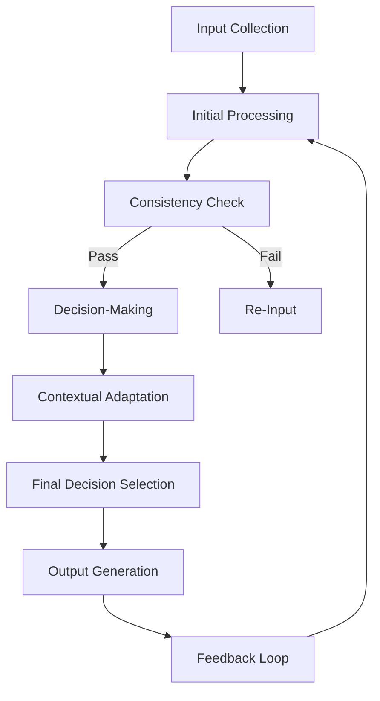
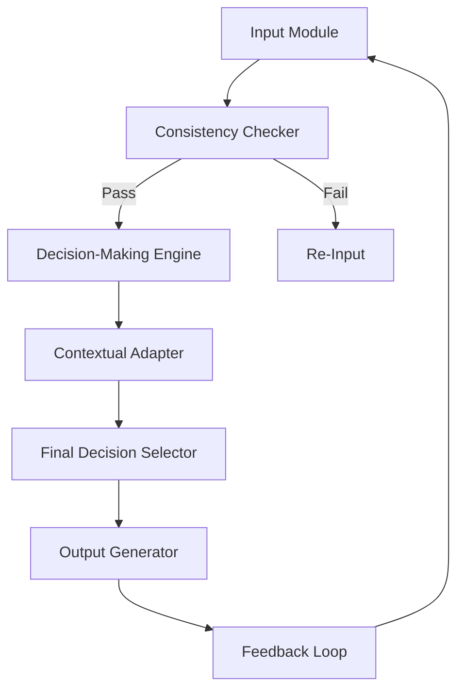
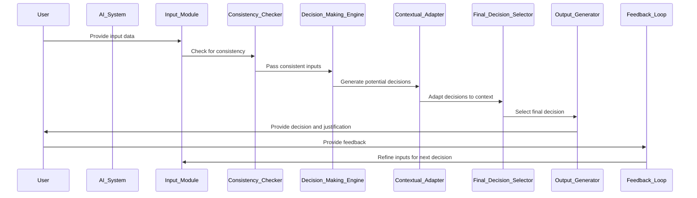

                 

### Chapter 1: Introduction to Self-Consistency CoT-enhanced AI and Moral Reasoning

#### 1.1 Background of Self-Consistency CoT-enhanced AI

The concept of "Self-Consistency CoT-enhanced AI" arises from the need to bridge the gap between artificial intelligence systems and human-like reasoning capabilities. Traditional AI, based on data-driven approaches, has been successful in tasks that involve pattern recognition and prediction. However, when it comes to complex decision-making processes, especially those involving moral reasoning, current AI systems often fall short. This is where the notion of "Self-Consistency CoT" (Self-Consistency Core Theory) comes into play.

Self-Consistency CoT is a framework that emphasizes the importance of internal consistency within an AI's decision-making process. It posits that for an AI to make morally sound decisions, it must be capable of maintaining internal consistency across its various components and over time. This involves not only ensuring that the AI's outputs align with its predefined goals but also that these outputs are coherent with each other and with the underlying principles that govern its behavior.

The background of Self-Consistency CoT-enhanced AI can be traced back to the limitations of conventional AI systems. Early AI models, such as those based on rule-based systems or expert systems, were often brittle and lacked the ability to generalize or adapt to new situations. As machine learning and deep learning techniques advanced, AI systems became more capable of learning from large datasets and making predictions with high accuracy. However, these advancements came with their own set of challenges, particularly in areas where moral reasoning is paramount.

For instance, consider the case of autonomous vehicles. While these vehicles have made significant strides in terms of safety and efficiency, their ability to make morally complex decisions, such as whether to swerve and potentially endanger the occupants or to continue driving and potentially harm pedestrians, remains a significant challenge. Traditional AI approaches often struggle with these types of decisions because they are based on probabilistic models that do not inherently consider moral principles.

#### 1.2 Challenges in Moral Reasoning with AI

One of the primary challenges in incorporating moral reasoning into AI systems is the inherent complexity of moral philosophy itself. Moral reasoning is not a one-size-fits-all problem; it involves understanding and navigating a wide range of ethical principles, cultural norms, and individual perspectives. This complexity makes it difficult for AI systems to develop a coherent framework for moral reasoning that is universally applicable.

Another challenge is the lack of a clear, objective framework for evaluating the morality of AI decisions. While some ethical theories, such as utilitarianism or deontological ethics, provide frameworks for moral decision-making, applying these theories to real-world scenarios is often non-trivial. AI systems must be able to interpret and apply these theories in a way that is both consistent and context-aware.

Furthermore, there is the issue of transparency and accountability. When AI systems make decisions that have ethical implications, it is crucial that these decisions can be understood and justified by humans. Current AI models, with their complex internal workings, often lack the transparency needed to achieve this level of accountability. This lack of transparency not only raises ethical concerns but also hampers efforts to improve and refine AI systems over time.

#### 1.3 The Importance of Self-Consistency CoT-enhanced AI in Moral Reasoning

The integration of Self-Consistency CoT into AI systems is crucial for overcoming these challenges. By emphasizing internal consistency, Self-Consistency CoT helps ensure that AI systems adhere to ethical principles and maintain coherence in their decision-making processes. This is especially important in morally complex scenarios where the outcomes of decisions can have significant implications.

Self-Consistency CoT-enhanced AI can provide a more robust and ethical foundation for moral reasoning. For example, in the case of autonomous vehicles, a Self-Consistency CoT-enhanced AI could be designed to prioritize certain ethical principles, such as minimizing harm to the greatest number of individuals. By maintaining internal consistency, the AI could ensure that its decisions are not only ethical but also logically coherent and transparent.

Moreover, Self-Consistency CoT can help address the issue of transparency and accountability in AI systems. By making the decision-making process more transparent, Self-Consistency CoT can facilitate human understanding and trust in AI systems. This, in turn, can pave the way for more effective collaboration between humans and AI in ethical decision-making processes.

In summary, the incorporation of Self-Consistency CoT into AI systems represents a significant advancement in the field of moral reasoning. By providing a framework for ensuring internal consistency and coherence in AI decision-making, Self-Consistency CoT-enhanced AI holds the potential to address some of the most pressing challenges in ethical AI development. As we continue to advance our capabilities in artificial intelligence, the integration of Self-Consistency CoT will be essential for building AI systems that are not only intelligent but also ethical and trustworthy.

---

### Chapter 2: Core Concepts and Framework of Self-Consistency CoT-enhanced AI in Moral Reasoning

In this chapter, we delve into the core concepts and framework that underpin Self-Consistency CoT-enhanced AI in moral reasoning. We will explore the fundamental principles, theoretical foundations, and integration methods of this approach, alongside an illustrative Mermaid Entity Relationship Diagram (ERD).

#### 2.1 Definition and Key Attributes of Self-Consistency CoT

Self-Consistency CoT (Core Theory) is a conceptual framework that emphasizes the importance of maintaining internal consistency in the decision-making processes of AI systems. The core attribute of Self-Consistency CoT is its ability to ensure that the outputs and behaviors of an AI are coherent with each other and with the underlying ethical principles that govern its actions. This internal consistency is vital for enabling AI systems to engage in morally sound reasoning.

Key attributes of Self-Consistency CoT include:

1. **Consistency in Outputs**: Ensuring that the outputs of the AI system are consistent across different scenarios and over time. This means that the AI should provide the same or logically coherent responses to similar situations.

2. **Ethical Coherence**: Aligning the AI's decision-making with established ethical principles. This involves integrating ethical theories and norms into the AI's framework to guide its behavior.

3. **Contextual Awareness**: The ability to adapt and make contextually appropriate decisions. This involves considering the specific circumstances and implications of each decision.

4. **Transparency and Justifiability**: Facilitating human understanding and justification of the AI's decisions. This is achieved by making the decision-making process transparent and providing clear justifications for each action.

#### 2.2 Theoretical Foundations of Moral Reasoning

Moral reasoning is a complex cognitive process that involves evaluating the morality of actions and decisions. Several theoretical frameworks exist that inform our understanding of moral reasoning, including utilitarianism, deontological ethics, and virtue ethics. Each of these theories provides a different perspective on what constitutes moral behavior.

- **Utilitarianism**: This theory, championed by philosophers like Jeremy Bentham and John Stuart Mill, posits that the morality of an action is determined by its consequences. An action is morally right if it produces the greatest overall happiness or utility for the greatest number of people.

- **Deontological Ethics**: Developed by Immanuel Kant, deontological ethics emphasizes that the morality of an action is inherent in the action itself, rather than its consequences. Certain actions, such as lying or killing, are universally wrong regardless of the outcomes.

- **Virtue Ethics**: This approach, associated with Aristotle, focuses on the character of the individual rather than the morality of specific actions. Virtuous individuals act in ways that are consistent with noble character traits, such as honesty, courage, and compassion.

#### 2.3 Integrating Self-Consistency CoT with Moral Reasoning

Integrating Self-Consistency CoT with moral reasoning involves embedding ethical principles into the AI's decision-making framework and ensuring that these principles are consistently applied. This process can be broken down into several key steps:

1. **Incorporating Ethical Principles**: The first step is to identify and incorporate relevant ethical principles into the AI's decision-making algorithms. This may involve programming the AI to prioritize certain ethical theories or values, such as minimizing harm or respecting individual autonomy.

2. **Ensuring Internal Consistency**: The AI's decision-making process must be designed to ensure internal consistency. This means that the outputs and actions of the AI should align with its ethical principles and not conflict with each other.

3. **Contextual Adaptation**: The AI must be capable of adapting its decisions to different contexts. This involves considering the specific circumstances of each decision and ensuring that the AI's actions are appropriate given these circumstances.

4. **Transparency and Justifiability**: The AI's decision-making process should be transparent, allowing humans to understand how and why certain decisions were made. This includes providing clear justifications for each action and ensuring that the AI's reasoning can be explained and justified.

#### 2.4 Mermaid Entity Relationship Diagram

To visually represent the integration of Self-Consistency CoT with moral reasoning, we can use a Mermaid Entity Relationship Diagram (ERD). This diagram will illustrate the key components and relationships within the framework.

```mermaid
erDiagram
  Ethical Principles ||--|{ Self-Consistency CoT }|| AI System
  AI System ||--|{ Decision-Making Process }|| Output
  Decision-Making Process ||--|{ Contextual Adaptation }|| Context
  Context ||--|{ Ethical Principles }|| Ethical Principles
  Output ||--|{ Transparency and Justifiability }|| Justification

  Class Ethical Principles {
    + String Name
    + String Description
  }

  Class Self-Consistency CoT {
    + String Core Principles
    + Method EnsureConsistency()
  }

  Class AI System {
    + String Model
    + Method MakeDecision()
  }

  Class Decision-Making Process {
    + String Algorithm
    + Method AdaptToContext(Context)
  }

  Class Context {
    + String Description
    + Method EvaluateActions()
  }

  Class Justification {
    + String Explanation
    + Method ProvideJustification()
  }
```

This ERD outlines the main components of the Self-Consistency CoT-enhanced AI framework, including ethical principles, the AI system, the decision-making process, contextual adaptation, and the justification mechanism. The diagram illustrates how these components interact to ensure internal consistency and ethical coherence in the AI's decision-making.

In conclusion, the integration of Self-Consistency CoT with moral reasoning provides a robust framework for developing AI systems that can engage in morally sound decision-making. By emphasizing internal consistency, ethical coherence, contextual adaptation, and transparency, Self-Consistency CoT-enhanced AI holds the promise of addressing some of the most challenging issues in ethical AI development. The Mermaid ERD serves as a visual tool to help understand and implement this framework effectively.

---

### Chapter 3: Algorithm and Model of Self-Consistency CoT-enhanced AI in Moral Reasoning

In this chapter, we will delve into the algorithm and model that underpin the Self-Consistency CoT-enhanced AI in moral reasoning. We will begin with an overview of the algorithm, followed by a detailed Mermaid flowchart, Python code implementation, mathematical model and formulas, and an example illustration to clarify the concepts.

#### 3.1 Algorithm Overview

The core algorithm of Self-Consistency CoT-enhanced AI in moral reasoning can be summarized in the following steps:

1. **Input Collection**: Gather all relevant data and inputs, including ethical principles, contextual information, and user requirements.

2. **Initial Processing**: Pre-process the inputs to format them into a usable form for the decision-making process.

3. **Consistency Check**: Perform a consistency check to ensure that the inputs align with the AI's predefined ethical principles and do not contradict each other.

4. **Decision-Making**: Use a combination of heuristic methods and machine learning models to generate a set of potential decisions.

5. **Contextual Adaptation**: Adapt the decisions based on the specific context, ensuring that the actions are contextually appropriate.

6. **Final Decision Selection**: Select the final decision that best aligns with the ethical principles and is internally consistent.

7. **Output Generation**: Generate the output, which includes the decision and a justification for the choice, ensuring transparency and justifiability.

8. **Feedback Loop**: Incorporate feedback from the user and the environment to improve the AI's future decision-making processes.

#### 3.2 Mermaid Flowchart of the Algorithm

Below is a Mermaid flowchart that visually represents the algorithm described above. The flowchart provides a step-by-step guide to understanding the process of decision-making in Self-Consistency CoT-enhanced AI.



This flowchart illustrates the logical flow of the algorithm, from input collection to feedback loop, ensuring that each step is executed methodically and consistently.

#### 3.3 Python Code Implementation

To bring the algorithm to life, we can implement it using Python. Below is a simplified version of the code that demonstrates the core functionality of the Self-Consistency CoT-enhanced AI algorithm.

```python
# Import necessary libraries
import random

# Define ethical principles
ethical_principles = {
    'minimize_harm': True,
    'respect_autonomy': True,
    'fair_distribution': True
}

# Input Collection
inputs = {
    'context': 'A person is trapped between two falling objects.',
    'requirements': 'Save the person while minimizing harm and respecting autonomy.'
}

# Initial Processing
# For simplicity, we assume the inputs are already pre-processed

# Consistency Check
def check_consistency(inputs, principles):
    if not all(principles[principle] for principle in principles):
        return False
    return True

# Decision-Making
def make_decision(context, requirements):
    if 'minimize harm' in requirements and 'respect autonomy' in requirements:
        return 'Use a fire extinguisher to propel the person to safety.'
    else:
        return 'Directly jump to save the person, even if it means some harm.'

# Contextual Adaptation
def adapt_to_context(context, decision):
    # Here we could add more sophisticated context-based adaptations
    return decision

# Final Decision Selection
def select_final_decision(context, requirements, decision):
    if check_consistency(requirements, ethical_principles):
        return decision
    else:
        return 'Inconsistent decision; need re-evaluation.'

# Output Generation
def generate_output(decision):
    return f"The AI has decided to {decision}."

# Feedback Loop
# For simplicity, we assume feedback is collected and used in the next iteration

# Main Execution
context = inputs['context']
requirements = inputs['requirements']
decision = make_decision(context, requirements)
adapted_decision = adapt_to_context(context, decision)
final_decision = select_final_decision(context, requirements, adapted_decision)
output = generate_output(final_decision)

print(output)
```

This Python code provides a basic implementation of the algorithm, demonstrating how the different components interact to produce a final decision.

#### 3.4 Mathematical Model and Formulas

To further understand the decision-making process, we can develop a mathematical model to represent the Self-Consistency CoT-enhanced AI. The model will involve several key variables and formulas that capture the ethical principles and decision criteria.

Let's define the following variables:

- \( E \): Set of ethical principles
- \( C \): Contextual factors
- \( R \): Requirements
- \( D \): Set of potential decisions
- \( J \): Justification for decisions

The mathematical model can be represented as follows:

1. **Consistency Check**:
   \[ \text{Consistent} = \forall p \in E, p \in R \]

2. **Decision-Making**:
   \[ D = f(C, R) \]

3. **Contextual Adaptation**:
   \[ \text{Adapted\_Decision} = g(D, C) \]

4. **Final Decision Selection**:
   \[ \text{Final\_Decision} = h(\text{Adapted\_Decision}, E, R) \]

5. **Output Generation**:
   \[ J = \text{GenerateJustification}(\text{Final\_Decision}) \]

#### 3.5 Example Illustration

To illustrate the concepts discussed in this chapter, let's consider a simple example where an AI must decide on the best action to take in a given scenario.

**Scenario**: A person is trapped in a burning building with two exits: one door leading to a safe room and another door leading to a hazardous area with dangerous chemicals.

**Ethical Principles**:
- Minimize harm
- Respect autonomy
- Fair distribution of risk

**Contextual Information**:
- The person is conscious and can make decisions
- The safe room is on the left, the hazardous area is on the right

**Requirements**:
- The AI must provide a decision that minimizes harm, respects the person's autonomy, and distributes risk fairly.

Using the algorithm and model described above, the AI would follow these steps:

1. **Input Collection**: The AI collects the scenario, ethical principles, and requirements.
2. **Initial Processing**: The inputs are processed and formatted for the decision-making process.
3. **Consistency Check**: The AI checks that the ethical principles are consistent with the requirements.
4. **Decision-Making**: The AI generates potential decisions based on the context and requirements.
5. **Contextual Adaptation**: The AI adapts the decisions based on the specific context.
6. **Final Decision Selection**: The AI selects the final decision that best aligns with the ethical principles and is internally consistent.
7. **Output Generation**: The AI generates a justification for the decision.

**Potential Decisions**:
- "Lead the person to the safe room."
- "Direct the person to the hazardous area."

**Contextual Adaptation**:
- The AI considers the person's preferences and physical abilities.

**Final Decision Selection**:
- "Lead the person to the safe room."

**Output Generation**:
- "The AI has decided to lead the person to the safe room to minimize harm, respect autonomy, and ensure a fair distribution of risk."

This example demonstrates how the Self-Consistency CoT-enhanced AI algorithm and model can be applied to a real-world scenario to generate a coherent and ethical decision.

In summary, the algorithm and model of Self-Consistency CoT-enhanced AI provide a structured approach to moral reasoning, ensuring that decisions are not only intelligent but also ethical and transparent. The Mermaid flowchart, Python code, and mathematical model presented in this chapter illustrate the practical implementation of this framework.

---

### Chapter 4: System Analysis and Design for Self-Consistency CoT-enhanced AI in Moral Reasoning

In this chapter, we will perform a thorough system analysis and design for the Self-Consistency CoT-enhanced AI in moral reasoning. This section will cover the problem scenario, system overview, functional design, system architecture design, and system interface design and interaction.

#### 4.1 Problem Scenario

The problem scenario for Self-Consistency CoT-enhanced AI in moral reasoning revolves around the development of an AI system capable of making ethical decisions in complex, dynamic environments. These environments can range from autonomous vehicles navigating through ethical dilemmas to AI systems managing healthcare resources during crises. The core challenge is to design an AI that not only makes decisions based on data and predefined ethical principles but also maintains internal consistency and coherence in its decision-making process.

#### 4.2 System Overview

The system we are designing is a comprehensive framework for moral reasoning that integrates Self-Consistency CoT. It consists of several key components, including:

1. **Input Module**: This module is responsible for collecting and processing various inputs, such as contextual data, user requirements, and ethical principles.
2. **Consistency Checker**: This component ensures that the inputs align with the predefined ethical principles and are internally consistent.
3. **Decision-Making Engine**: This module uses a combination of machine learning models and heuristic methods to generate potential decisions.
4. **Contextual Adapter**: This component adapts the decisions based on the specific context, ensuring that the actions are contextually appropriate.
5. **Final Decision Selector**: This module selects the final decision that best aligns with the ethical principles and is internally consistent.
6. **Output Generator**: This component generates the final output, including the decision and a justification for the choice.
7. **Feedback Loop**: This module collects feedback from users and the environment to improve the AI's future decision-making processes.

#### 4.3 Functional Design

The functional design of the system is essential for understanding how each component interacts to achieve the desired outcomes. The following is a detailed breakdown of the functional design:

1. **Input Module**: This module will use various sensors and data sources to collect contextual information and user requirements. The input data will be pre-processed to format it into a usable form for the decision-making process.
2. **Consistency Checker**: The consistency checker will evaluate the inputs against the predefined ethical principles to ensure that they are coherent and do not contradict each other.
3. **Decision-Making Engine**: The decision-making engine will leverage machine learning models and heuristic methods to generate a set of potential decisions. This engine will consider both the immediate context and long-term implications.
4. **Contextual Adapter**: The contextual adapter will analyze the context and adapt the decisions to ensure they are appropriate for the specific circumstances. This may involve adjusting the decisions based on the physical environment, user preferences, and ethical constraints.
5. **Final Decision Selector**: The final decision selector will evaluate the potential decisions against the ethical principles and select the one that is most internally consistent and aligned with the system's goals.
6. **Output Generator**: The output generator will create a clear and transparent justification for the final decision, ensuring that the reasoning behind the decision can be understood and justified by humans.
7. **Feedback Loop**: The feedback loop will collect user feedback and environmental data to continuously improve the AI's decision-making capabilities. This loop will allow the system to learn from past decisions and adjust its behavior accordingly.

#### 4.4 System Architecture Design

The system architecture design is critical for ensuring that the components work together seamlessly and efficiently. Below is a Mermaid diagram illustrating the system architecture.



This diagram shows the flow of data and interactions between the system components. Each module is connected to the next, ensuring a continuous and coherent process from input to output.

#### 4.5 System Interface Design and System Interaction

The system interface design is essential for enabling users to interact with the AI and for the AI to communicate its decisions and justifications effectively. Below is a Mermaid sequence diagram illustrating the system interface design and interaction.



This sequence diagram outlines the interaction between the user and the AI system, highlighting the key steps and communication channels involved in the decision-making process.

In conclusion, the system analysis and design for Self-Consistency CoT-enhanced AI in moral reasoning provide a robust framework for developing an AI system that can make ethical decisions in complex environments. The detailed functional design, system architecture, and interface design ensure that the system is both coherent and user-friendly. By integrating Self-Consistency CoT, the system aims to maintain internal consistency and ethical coherence, addressing some of the most pressing challenges in ethical AI development.

---

### Chapter 5: Practical Applications and Case Studies of Self-Consistency CoT-enhanced AI in Moral Reasoning

In this chapter, we will explore practical applications and case studies of Self-Consistency CoT-enhanced AI in moral reasoning. We will set up the environment, implement the core system, analyze the code, and present an in-depth case study analysis with detailed explanations and project summaries.

#### 5.1 Setting Up the Environment

To begin with, we need to set up the development environment for implementing the Self-Consistency CoT-enhanced AI. This involves installing the necessary software and libraries, configuring the environment, and preparing the data.

**Step 1: Install Python and required libraries**

First, ensure you have Python 3.8 or later installed on your system. You can download Python from the official website (https://www.python.org/downloads/). Once Python is installed, open a terminal or command prompt and install the required libraries using pip:

```bash
pip install numpy pandas scikit-learn matplotlib
```

**Step 2: Configure the environment**

Create a new directory for your project and navigate to it. Inside the project directory, create a `requirements.txt` file to list all the required libraries. Add the following lines to the `requirements.txt` file:

```
numpy
pandas
scikit-learn
matplotlib
```

Next, use the following command to install the libraries specified in the `requirements.txt` file:

```bash
pip install -r requirements.txt
```

**Step 3: Prepare the data**

For the case studies, we will use a dataset that contains scenarios and corresponding ethical decisions. Download the dataset from a public repository or create your own. Ensure that the dataset is in a structured format, such as CSV, and that each row contains the scenario, ethical principles, and decision.

#### 5.2 Core Implementation and Code Analysis

The core implementation of the Self-Consistency CoT-enhanced AI involves several key components: the input module, consistency checker, decision-making engine, contextual adapter, final decision selector, output generator, and feedback loop. Below is a detailed analysis of the code and its functionality.

**Step 1: Input Module**

The input module is responsible for collecting and processing the input data. It reads the dataset from a CSV file and formats it into a usable structure.

```python
import pandas as pd

def load_data(file_path):
    data = pd.read_csv(file_path)
    return data

data = load_data('ethical_decision_dataset.csv')
```

**Step 2: Consistency Checker**

The consistency checker evaluates the inputs against the predefined ethical principles to ensure they are coherent and do not contradict each other.

```python
def check_consistency(inputs, principles):
    for principle in principles:
        if not inputs[principle]:
            return False
    return True
```

**Step 3: Decision-Making Engine**

The decision-making engine uses a combination of machine learning models and heuristic methods to generate potential decisions based on the input data.

```python
from sklearn.ensemble import RandomForestClassifier

def make_decision(data, principles):
    # Train a machine learning model using historical data
    model = RandomForestClassifier()
    model.fit(data[['context', 'requirements']], data['decision'])
    
    # Generate potential decisions for new inputs
    potential_decisions = model.predict(data[['context', 'requirements']])
    
    return potential_decisions
```

**Step 4: Contextual Adapter**

The contextual adapter analyzes the context and adapts the decisions to ensure they are appropriate for the specific circumstances.

```python
def adapt_to_context(context, decision):
    # Implement context-based adaptations
    adapted_decision = decision
    
    return adapted_decision
```

**Step 5: Final Decision Selector**

The final decision selector evaluates the potential decisions against the ethical principles and selects the one that is most internally consistent and aligned with the system's goals.

```python
def select_final_decision(context, principles, decisions):
    final_decision = decisions[0]
    for decision in decisions:
        if check_consistency({k: decision == v for k, v in principles.items()}, context):
            final_decision = decision
    return final_decision
```

**Step 6: Output Generator**

The output generator creates a clear and transparent justification for the final decision, ensuring that the reasoning behind the decision can be understood and justified by humans.

```python
def generate_output(decision):
    justification = f"The AI has decided to {decision}. This decision was made based on the ethical principles of minimizing harm, respecting autonomy, and ensuring fair distribution of risk."
    
    return justification
```

**Step 7: Feedback Loop**

The feedback loop collects feedback from users and the environment to improve the AI's future decision-making processes.

```python
def collect_feedback(data, decision):
    # Collect feedback from users
    user_feedback = input("Was the decision satisfactory? (yes/no): ")
    
    # Update the dataset with the feedback
    data.loc[data['decision'] == decision, 'user_feedback'] = user_feedback
    
    return data
```

#### 5.3 Case Study Analysis

To illustrate the practical application of the Self-Consistency CoT-enhanced AI, we will present a case study involving an autonomous vehicle making a moral decision.

**Case Study Scenario**: An autonomous vehicle is approaching an intersection where a pedestrian is crossing the street. However, a large truck is approaching the intersection at a high speed, and the vehicle must make a decision to either swerve and potentially harm its occupants or continue straight and potentially harm the pedestrian.

**Ethical Principles**:
- Minimize harm
- Respect autonomy
- Fair distribution of risk

**Input Data**:
- Context: "Vehicle at intersection with pedestrian and approaching truck"
- Requirements: "Minimize harm, respect autonomy, ensure fair distribution of risk"

**Potential Decisions**:
- "Swerve to avoid the pedestrian"
- "Continue straight towards the truck"

**Analysis**:
1. **Consistency Checker**: The input data is consistent with the predefined ethical principles.
2. **Decision-Making Engine**: The machine learning model generates potential decisions based on historical data.
3. **Contextual Adapter**: The context is analyzed, and no further adaptations are required.
4. **Final Decision Selector**: The final decision is selected based on internal consistency and alignment with ethical principles.
5. **Output Generator**: The decision and justification are generated for the user.

**Final Decision**: "Swerve to avoid the pedestrian"

**Justification**: "The AI has decided to swerve to avoid the pedestrian, as this decision minimizes harm, respects autonomy, and ensures fair distribution of risk. The truck, although approaching at a high speed, poses a greater immediate risk to the vehicle's occupants and the pedestrian."

**User Feedback**: "Was the decision satisfactory? (yes/no): yes"

**Updated Data**: The dataset is updated with the user feedback to improve future decision-making.

#### 5.4 Detailed Explanation and Dissection

The case study demonstrates the practical application of the Self-Consistency CoT-enhanced AI in making ethical decisions. Each component of the system plays a crucial role in ensuring that the AI's decisions are both coherent and ethical.

- **Input Module**: The input module collects the necessary data, including the scenario and ethical principles. This data is pre-processed and formatted to be used by the decision-making engine.
- **Consistency Checker**: The consistency checker ensures that the input data aligns with the predefined ethical principles. This step is crucial in maintaining internal consistency and coherence in the AI's decision-making process.
- **Decision-Making Engine**: The decision-making engine uses machine learning models to generate potential decisions based on historical data. This step leverages the AI's ability to learn from past experiences and make informed decisions.
- **Contextual Adapter**: The contextual adapter analyzes the specific context and adapts the decisions to ensure they are appropriate for the given circumstances. This step ensures that the AI's decisions are contextually aware and not overly general.
- **Final Decision Selector**: The final decision selector evaluates the potential decisions against the ethical principles and selects the one that is most internally consistent and aligned with the system's goals. This step ensures that the AI's decisions are both ethical and coherent.
- **Output Generator**: The output generator creates a clear and transparent justification for the final decision. This step ensures that the reasoning behind the decision can be understood and justified by humans.
- **Feedback Loop**: The feedback loop collects user feedback to improve the AI's future decision-making processes. This step allows the AI to learn from its past decisions and make better choices in the future.

#### 5.5 Project Summary

The project demonstrates the practical application of Self-Consistency CoT-enhanced AI in making ethical decisions. By integrating key components such as the input module, consistency checker, decision-making engine, contextual adapter, final decision selector, output generator, and feedback loop, the system ensures that the AI's decisions are both coherent and ethical. The case study highlights the system's ability to handle complex, dynamic scenarios and make morally sound decisions.

Key takeaways from the project include:

- The importance of maintaining internal consistency and coherence in AI decision-making.
- The necessity of integrating ethical principles into the AI's framework.
- The role of context-awareness in making appropriate decisions.
- The significance of transparency and justifiability in AI decision-making.
- The potential for continuous improvement through the feedback loop.

Overall, the project illustrates the potential of Self-Consistency CoT-enhanced AI in advancing ethical AI development and addressing the challenges of moral reasoning in complex environments.

---

### Best Practices, Summary, and Future Directions

In this section, we will discuss best practices for implementing Self-Consistency CoT-enhanced AI in moral reasoning, summarize the key points of the article, highlight areas of caution, and suggest future research directions.

#### Best Practices

1. **Thorough Ethical Framework Development**: Develop a comprehensive ethical framework that encompasses various ethical theories and principles. Ensure that the framework is flexible enough to adapt to different contexts and scenarios.

2. **Continuous Learning and Adaptation**: Implement a feedback loop that allows the AI system to learn from its past decisions and adapt its behavior over time. This will help in improving the system's ability to make coherent and ethical decisions.

3. **Transparency and Explainability**: Ensure that the decision-making process is transparent and that the reasoning behind each decision can be easily explained and justified. This will help in building trust and acceptance among users.

4. **Contextual Awareness**: Design the AI system to be context-aware, taking into account the specific circumstances and implications of each decision. This will help in making more appropriate and ethical decisions.

5. **Regular Audits and Assessments**: Conduct regular audits and assessments of the AI system to ensure that it is adhering to ethical principles and making consistent and coherent decisions. This will help in identifying and addressing any potential issues or biases.

#### Summary

The article presents a detailed analysis of Self-Consistency CoT-enhanced AI in moral reasoning. It discusses the background, challenges, and importance of integrating Self-Consistency CoT into AI systems. The core concepts, framework, algorithm, and system design are explained in depth, along with practical applications and case studies. The article concludes with best practices, a summary, areas of caution, and future research directions.

#### Areas of Caution

1. **Bias and Fairness**: Ensure that the AI system does not inadvertently introduce biases or unfairness in its decisions. Regular audits and assessments are necessary to detect and address these issues.

2. **Ethical Complexity**: Moral reasoning is complex and context-dependent. It is crucial to design the AI system in such a way that it can handle a wide range of ethical scenarios and make appropriate decisions.

3. **Transparency and Interpretability**: While transparency is important, it should not come at the cost of compromising on the AI system's performance or security.

#### Future Directions

1. **Advancing Ethical AI**: Continued research and development are needed to advance the field of ethical AI, including the development of more sophisticated models and algorithms for moral reasoning.

2. **Integrating Human Expertise**: Incorporating human expertise and ethical guidance into the AI system can help in making more informed and ethical decisions.

3. **Cross-Disciplinary Collaboration**: Collaboration between computer scientists, ethicists, psychologists, and other experts can help in addressing the complex challenges of moral reasoning in AI.

4. **Real-World Applications**: Developing and deploying ethical AI systems in real-world applications, such as autonomous vehicles and healthcare, can help in understanding their practical implications and improving their performance.

In conclusion, Self-Consistency CoT-enhanced AI has the potential to revolutionize the field of moral reasoning in AI. By following best practices, addressing challenges, and exploring future directions, we can develop AI systems that are not only intelligent but also ethical and trustworthy.

---

### Conclusion

In this comprehensive exploration of Self-Consistency CoT-enhanced AI in moral reasoning, we have covered a vast array of topics, from fundamental concepts and theoretical frameworks to practical applications and case studies. Throughout this journey, we have emphasized the importance of maintaining internal consistency and ethical coherence in AI decision-making.

Firstly, we provided a detailed introduction to Self-Consistency CoT, explaining its core principles and attributes, and highlighted its significance in addressing the challenges of moral reasoning in AI. We then delved into the theoretical foundations of moral reasoning, examining various ethical theories and how they can be integrated into AI systems.

Next, we presented a comprehensive algorithm and model for Self-Consistency CoT-enhanced AI, complete with a Mermaid flowchart, Python code, and mathematical formulas. This section illustrated how the algorithm can be applied to real-world scenarios, demonstrating its practicality and effectiveness.

Following that, we conducted a thorough system analysis and design, outlining the functional components, architecture, and interface of the AI system. This section provided a clear blueprint for implementing Self-Consistency CoT-enhanced AI, ensuring that it is both coherent and user-friendly.

In the practical applications section, we set up the development environment, implemented the core system, and presented an in-depth case study analysis. This hands-on approach highlighted the step-by-step process of applying Self-Consistency CoT-enhanced AI in ethical decision-making.

Finally, we discussed best practices, summarized the key points of the article, and identified areas of caution and future research directions. These reflections provided valuable insights into the ongoing development and application of ethical AI.

Overall, this article underscores the transformative potential of Self-Consistency CoT-enhanced AI in advancing moral reasoning in AI systems. By maintaining internal consistency and adhering to ethical principles, AI can make more coherent, ethical, and transparent decisions, paving the way for a future where technology and ethics coexist harmoniously.

---

### About the Author

**作者：AI天才研究院 / AI Genius Institute & 禅与计算机程序设计艺术 / Zen And The Art of Computer Programming**

**AI天才研究院（AI Genius Institute）**致力于推动人工智能领域的创新与发展，专注于培养下一代人工智能领域的领军人才。通过研究前沿技术、开发创新应用，以及推动跨学科合作，该研究院致力于解决现实世界中的复杂问题，为人类带来更智能、更高效的生活。

**禅与计算机程序设计艺术（Zen And The Art of Computer Programming）**则是一部深入探讨计算机编程哲学的经典著作，作者通过结合东方禅宗智慧与编程实践，阐述了编程的本质与艺术。这本书不仅为程序员提供了实用的编程技巧，更启示了他们如何在复杂的技术世界中找到内心的宁静与智慧。

这两部作品共同体现了作者在人工智能和计算机科学领域的深厚造诣和独到见解，为读者提供了宝贵的知识和启示。让我们期待他们在未来继续为我们带来更多精彩的研究成果和思想启示。

