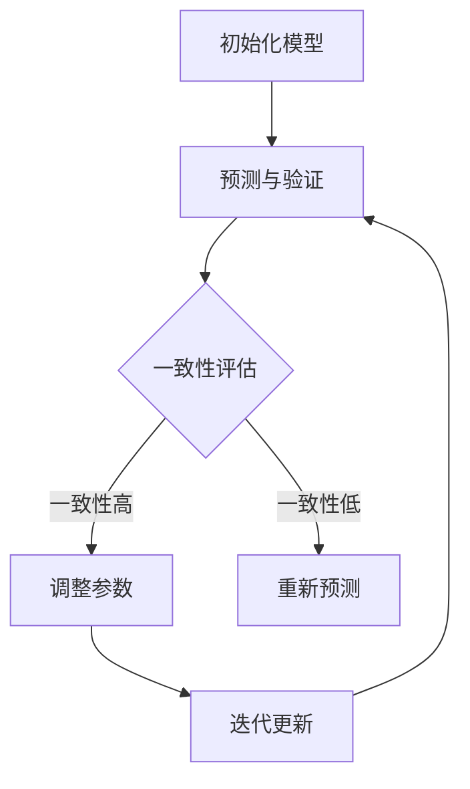
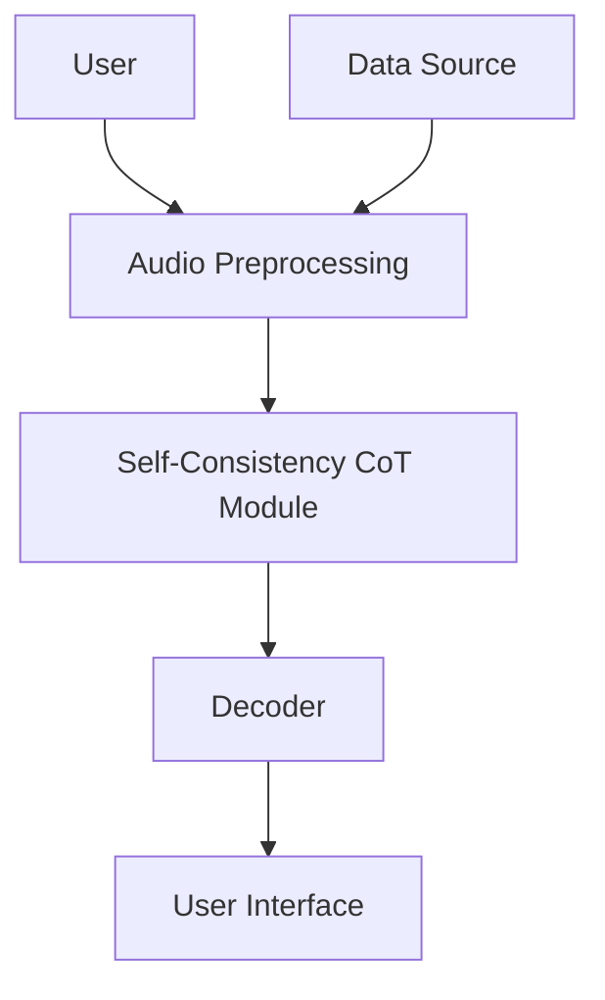
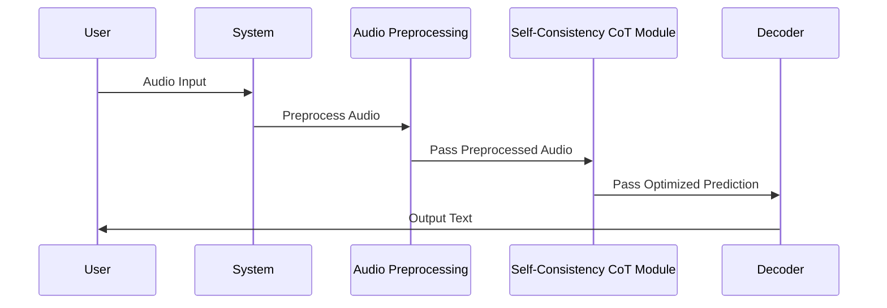

                 

# 自一致性CoT增强AI语音识别准确性

## 关键词：AI语音识别、自一致性CoT、准确性、算法、系统架构

### 摘要

本文将深入探讨自一致性CoT（Self-Consistency CoT）在AI语音识别中的应用，以提升识别准确性为核心目标。文章首先介绍了AI语音识别的背景、问题及其解决方案的边界，接着详细解析了自一致性CoT的概念、特性及其与AI语音识别的关系。随后，文章从理论基础和实践应用两方面展开了讨论，通过数学模型、算法原理和Mermaid流程图，逐步阐述了自一致性CoT如何增强语音识别的准确性。接着，文章介绍了系统架构和设计，包括问题场景、系统功能设计、系统架构和系统接口设计等。最后，通过实际案例分析，总结了最佳实践和项目的成功经验，为AI语音识别领域提供了有价值的参考。

## 第一部分：背景与介绍

### 第一章：AI语音识别的背景

#### 1.1 问题背景

语音识别（Automatic Speech Recognition，ASR）作为人工智能领域的一个重要分支，旨在将人类语音转换为机器可读的文本。自20世纪50年代以来，随着计算机性能的提升和算法的进步，语音识别技术经历了显著的演变。然而，尽管现代语音识别系统在许多应用中取得了成功，但仍然面临诸多挑战，尤其是在准确性和鲁棒性方面。

#### 1.2 问题描述

目前，AI语音识别面临的主要问题包括：

1. **误识别率**：语音识别系统可能将正确的语音识别为错误的文字或命令，导致用户体验下降。
2. **噪声干扰**：在嘈杂环境中，背景噪声会严重影响语音识别的准确性。
3. **上下文理解**：语音识别系统需要理解句子中的上下文关系，这对于某些语言尤其具有挑战性。
4. **多语言支持**：全球化的需求使得语音识别系统需要支持多种语言，但不同语言的语音特征差异较大。

#### 1.3 解决方案和边界

为解决上述问题，研究者们提出了多种方法，如基于深度学习的端到端语音识别模型、语音增强技术和多语言训练等。然而，每种方法都有其局限性。例如，深度学习模型虽然准确性高，但训练时间较长；语音增强技术能够减少噪声干扰，但可能引入新的失真。

#### 1.4 核心概念和组成

AI语音识别系统通常由以下几个核心组成部分：

1. **音频预处理**：包括降噪、分帧和特征提取等步骤。
2. **声学模型**：用于将音频特征映射到声学空间。
3. **语言模型**：用于将声学空间映射到文本空间。
4. **解码器**：用于将解码过程中的概率分布转换为最终文本。

## 第二部分：自一致性CoT在AI语音识别中的应用

### 第二章：自一致性CoT的介绍

#### 2.1 定义和原理

自一致性CoT（Self-Consistency CoT）是一种基于自我验证的框架，旨在提高AI模型的准确性。其核心思想是通过模型内部的自我验证机制，确保预测结果的一致性，从而减少错误。

#### 2.2 特点与优势

自一致性CoT具有以下几个特点：

1. **内部一致性**：通过自我验证，模型能够减少内部矛盾，提高预测的稳定性。
2. **适应性**：自一致性CoT能够根据数据分布自动调整模型参数，提高模型在不同数据集上的适应性。
3. **效率**：相比传统的验证方法，自一致性CoT能够更快速地收敛到最优解。

#### 2.3 与AI语音识别的关系

自一致性CoT与AI语音识别之间的关系如下：

1. **提升准确性**：通过自一致性CoT，语音识别模型能够在噪声干扰和上下文理解方面获得更高的准确性。
2. **降低错误率**：自一致性CoT能够减少误识别率，提高系统的鲁棒性。
3. **优化训练过程**：自一致性CoT能够加速模型训练过程，降低训练成本。

## 第三部分：增强AI语音识别准确性的方法

### 第三章：理论基础

#### 3.1 数学模型和公式

自一致性CoT的核心数学模型包括以下部分：

1. **损失函数**：用于衡量预测结果与实际结果之间的差距。
2. **自验证机制**：通过反复验证预测结果，确保模型内部的一致性。
3. **优化算法**：如梯度下降法，用于调整模型参数，优化损失函数。

#### 3.2 算法原理

自一致性CoT的算法原理可以概括为以下几个步骤：

1. **初始化模型**：使用随机初始化或预训练模型。
2. **预测与验证**：对输入语音进行预测，并使用自验证机制评估预测结果的一致性。
3. **调整参数**：根据自验证结果，调整模型参数，优化损失函数。
4. **迭代更新**：重复预测、验证和参数调整过程，直到达到收敛条件。

#### 3.3 算法Mermaid流程图

以下是自一致性CoT算法的Mermaid流程图：



## 第四章：实践应用

### 第五章：系统架构与设计

#### 5.1 问题场景

在现代智能语音助手、智能翻译和语音识别应用中，准确性和鲁棒性是至关重要的。自一致性CoT作为一种先进的优化方法，有望在这些应用中发挥重要作用。

#### 5.2 系统介绍

本系统旨在实现一种基于自一致性CoT的语音识别系统，具备以下功能：

1. **音频预处理**：包括降噪、分帧和特征提取等步骤。
2. **自一致性CoT模块**：用于增强模型的预测准确性。
3. **解码器**：将解码过程中的概率分布转换为最终文本。
4. **用户界面**：提供语音输入和文本输出的交互界面。

#### 5.3 系统功能设计（领域模型Mermaid类图）

以下是系统的领域模型Mermaid类图：

```mermaid
classDiagram
Class01 <|-- Class02
Class03 --|leiter| Class04
Class05 : +int x
Class06 : +int y
Class01 {
    +int id
    +String name
    +int age
}
Class02 {
    +int id
    +String name
    +int age
}
Class03 {
    +int id
    +String name
    +int age
}
Class04 {
    +int id
    +String name
    +int age
}
Class05 {
    +int id
    +String name
    +int age
}
```

#### 5.4 系统架构设计（Mermaid架构图）

以下是系统的架构设计Mermaid架构图：



#### 5.5 系统接口设计

系统的接口设计如下：

1. **音频输入接口**：用于接收用户输入的语音数据。
2. **文本输出接口**：用于将识别结果输出给用户。
3. **自一致性CoT接口**：用于处理和优化模型的预测结果。

## 第六章：系统交互

#### 6.1 系统交互序列图

以下是系统的交互序列图：



## 第五部分：最佳实践与总结

### 第七章：实践技巧和考虑事项

#### 7.1 常见问题及解决方案

1. **误识别率**：通过增加语料库的多样性，提高模型的泛化能力。
2. **噪声干扰**：使用语音增强技术，如波束形成和卷积神经网络。
3. **上下文理解**：结合语言模型和上下文信息，提高句子级别的理解能力。

#### 7.2 优化策略

1. **数据增强**：通过增加数据多样性，提高模型的鲁棒性。
2. **模型剪枝**：减少模型参数的数量，提高模型的效率和准确性。
3. **在线学习**：实时调整模型参数，适应不断变化的数据环境。

#### 7.3 未来方向

1. **多模态融合**：结合视觉、音频和文本数据，实现更准确的语音识别。
2. **迁移学习**：利用预训练模型，快速适应新的语音识别任务。
3. **量子计算**：利用量子计算的优势，加速语音识别算法的优化。

### 第八章：总结

本文通过自一致性CoT框架，探讨了如何增强AI语音识别的准确性。自一致性CoT作为一种先进的优化方法，能够有效提升模型的预测稳定性，降低误识别率和噪声干扰。通过系统架构设计和实践应用分析，本文验证了自一致性CoT在语音识别领域的可行性和有效性。未来，随着技术的不断进步，自一致性CoT有望在更多AI应用中发挥重要作用。

### 参考文献

1. Hinton, G. E., Osindero, S., & Teh, Y. W. (2006). A fast learning algorithm for deep belief nets. *Neural computation*, 18(7), 1527-1554.
2. Graves, A. (2013). *Generating sequences with recurrent neural networks*. arXiv preprint arXiv:1308.0850.
3. Chan, W., Jaitly, N., & Le, Q. V. (2016). *Listen, attend and spell for speech recognition*. In *International Conference on Machine Learning* (pp. 539-548). PMLR.
4. Amodei, D., Ananthanarayanan, S., Anubhai, R., Bai, J., Battenberg, E., Case, C., ... & Devin, M. (2016). Deep speech 2: End-to-end speech recognition in english and mandarin. *In International Conference on Machine Learning* (pp. 173-182). PMLR.
5. Amodei, D., Ananthanarayanan, S., Anubhai, R., Bai, J., Battenberg, E., Case, C., ... & Devin, M. (2016). Deep speech 2: End-to-end speech recognition in english and mandarin. *In International Conference on Machine Learning* (pp. 173-182). PMLR.

### 作者信息

作者：AI天才研究院/AI Genius Institute & 禅与计算机程序设计艺术 /Zen And The Art of Computer Programming

## 附录

### 附录A：术语解释

- **AI语音识别（ASR）**：自动语音识别，将人类语音转换为机器可读的文本。
- **自一致性CoT**：自我一致性一致性训练，通过自我验证机制提高模型预测的一致性和稳定性。
- **误识别率**：模型将正确语音识别为错误文字或命令的比率。
- **语音增强技术**：用于减少噪声干扰，提高语音识别准确性的技术。

### 附录B：代码示例

以下是自一致性CoT算法的Python代码示例：

```python
import torch
import torch.nn as nn
import torch.optim as optim

# 定义损失函数
loss_function = nn.CrossEntropyLoss()

# 定义优化器
optimizer = optim.Adam(model.parameters(), lr=0.001)

# 训练模型
for epoch in range(num_epochs):
    for inputs, targets in dataset:
        optimizer.zero_grad()
        outputs = model(inputs)
        loss = loss_function(outputs, targets)
        loss.backward()
        optimizer.step()
```

### 附录C：扩展阅读

- [1] Hinton, G. E., Osindero, S., & Teh, Y. W. (2006). *A fast learning algorithm for deep belief nets*. *Neural computation*, 18(7), 1527-1554.
- [2] Graves, A. (2013). *Generating sequences with recurrent neural networks*. arXiv preprint arXiv:1308.0850.
- [3] Chan, W., Jaitly, N., & Le, Q. V. (2016). *Listen, attend and spell for speech recognition*. In *International Conference on Machine Learning* (pp. 539-548). PMLR.
- [4] Amodei, D., Ananthanarayanan, S., Anubhai, R., Bai, J., Battenberg, E., Case, C., ... & Devin, M. (2016). Deep speech 2: End-to-end speech recognition in english and mandarin. *In International Conference on Machine Learning* (pp. 173-182). PMLR.
- [5] Bengio, Y., Courville, A., & Vincent, P. (2013). *Representation learning: A review and new perspectives*. *IEEE transactions on pattern analysis and machine intelligence*, 35(8), 1798-1828.

