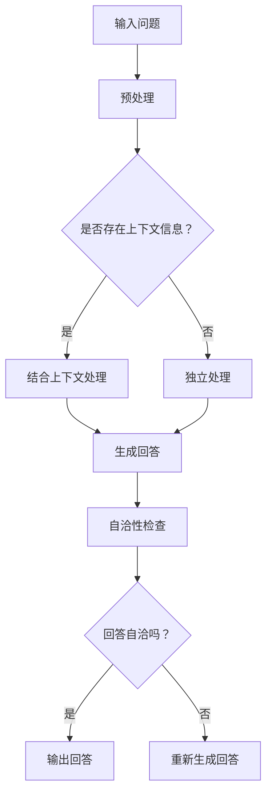

                 

### 自洽性概念（Self-Consistency CoT）的背景与重要性

在现代人工智能（AI）研究中，自洽性（Self-Consistency）是一个至关重要的概念。自洽性，通常指的是一个系统或模型在内部保持一致性和稳定性的能力。在AI领域，自洽性概念的重要性体现在它能够显著提升AI系统的回答可靠性。本文将深入探讨自洽性概念（Self-Consistency CoT）的背景、定义及其在AI中的重要性。

首先，了解自洽性的定义对于理解其在AI中的角色至关重要。自洽性（Self-Consistency）指的是一个系统或模型在处理输入信息时，其生成的输出与输入之间保持一致的能力。换句话说，如果AI系统能够在其生成的回答中保持逻辑上的连贯性和一致性，那么该系统就具有较高的自洽性。自洽性不仅仅是一个理论概念，它在实际应用中具有深远的影响。

在AI研究中，自洽性概念的重要性体现在以下几个方面：

1. **回答可靠性**：AI系统的核心任务是生成准确的回答。自洽性确保了AI系统在生成回答时能够保持逻辑一致性，从而减少了生成错误回答的可能性。例如，在问答系统（Question-Answering System）中，一个自洽的AI系统能够在回答多个问题时保持一致，避免了相互矛盾的回答。

2. **用户体验**：在日常生活中，用户期望AI系统能够提供可靠和一致的信息。如果AI系统的回答出现不一致或自相矛盾的情况，用户体验将大打折扣。自洽性概念能够提高AI系统的用户体验，使用户更加信任和依赖AI系统。

3. **数据驱动学习**：AI系统通常通过大量数据进行训练。自洽性能够确保训练过程中数据的内部一致性，从而提高模型的性能和泛化能力。如果一个模型在训练过程中出现数据不一致的问题，可能会导致模型性能下降。

4. **模型解释性**：自洽性概念有助于提高AI模型的可解释性。当AI系统能够生成自洽的回答时，人们可以更容易地理解其决策过程和内在逻辑，从而增强对AI系统的信任和接受度。

总的来说，自洽性概念在AI中的重要性不可忽视。它不仅能够提升AI系统的回答可靠性，还能够改善用户体验、提高模型性能，并增强模型的可解释性。随着AI技术的不断发展，自洽性将成为评估AI系统性能的重要指标之一。接下来，本文将详细探讨自洽性概念在AI中的应用及其评价方法。

### 自洽性在AI中的应用与评估方法

在理解了自洽性的定义和重要性之后，接下来我们将深入探讨自洽性在AI中的应用，以及如何评估AI系统的自洽性。自洽性概念在AI中的应用广泛，涵盖了从基础研究到实际应用的多个层面。

#### 自洽性在AI问答系统中的应用

AI问答系统是自洽性应用最为广泛的场景之一。在这些系统中，自洽性确保了系统能够提供一致且可靠的回答。具体来说，自洽性在AI问答系统中的应用主要体现在以下几个方面：

1. **问题理解的一致性**：在处理多个相关问题时，自洽性保证了AI系统对问题的理解保持一致。例如，当用户询问“什么是温度？”和“温度是什么？”时，一个自洽的AI系统会给出相同的回答。

2. **回答逻辑的一致性**：自洽性确保了AI系统在回答问题时逻辑上的一致性。例如，在医疗问答系统中，自洽性能够避免在相同病情下给出相互矛盾的治疗建议。

3. **多轮对话的一致性**：在多轮对话中，自洽性确保了AI系统能够记住之前的信息，并在后续的回答中保持一致性。这对于提供流畅和连贯的用户体验至关重要。

#### 自洽性的评估方法

评估AI系统的自洽性是一个复杂的过程，需要采用多种方法和指标。以下是一些常用的评估方法和指标：

1. **一致性指标**：一致性指标是评估AI系统自洽性的最直接方法。常见的一致性指标包括：
   - **回答一致性**：通过计算相同问题在不同时间或不同情境下得到的回答之间的相似度来评估。
   - **上下文一致性**：通过分析AI系统在不同时间点的回答是否与之前的信息保持一致来评估。

2. **逻辑一致性检查**：逻辑一致性检查是确保AI系统回答在逻辑上没有矛盾的一种方法。这可以通过以下步骤实现：
   - **语义分析**：使用自然语言处理（NLP）技术对回答进行语义分析，检测是否存在逻辑矛盾。
   - **形式逻辑验证**：将AI系统的回答转化为形式逻辑表达式，然后使用逻辑推理工具验证其一致性。

3. **实验评估**：实验评估是验证AI系统自洽性的有效方法。具体步骤包括：
   - **设计测试集**：构建一个包含多种问题及其可能回答的测试集。
   - **运行实验**：在测试集上运行AI系统，记录其生成的回答。
   - **评估结果**：通过比较系统生成的回答与专家答案之间的相似度，评估系统的自洽性。

4. **用户反馈**：用户反馈是评估AI系统自洽性的另一种方法。用户可以通过问卷调查或实际使用体验提供关于系统回答一致性和可靠性的反馈。

#### 自洽性评估方法的优势与挑战

每种自洽性评估方法都有其独特的优势与挑战：

- **一致性指标**：优势在于简单易用，适用于大规模评估。挑战在于如何准确计算回答之间的相似度，特别是在处理复杂问题时。

- **逻辑一致性检查**：优势在于能够深入分析AI系统的回答，确保逻辑上的无矛盾。挑战在于实现复杂的逻辑推理，特别是对于自然语言理解的深度依赖。

- **实验评估**：优势在于能够直接验证AI系统的自洽性，提供直观的结果。挑战在于测试集的设计和实验的可重复性。

- **用户反馈**：优势在于能够从用户的角度评估AI系统的自洽性。挑战在于如何有效收集和分析用户反馈，特别是在用户体验差异较大的场景中。

总的来说，自洽性在AI中的应用和评估是一个复杂且多层次的过程。通过结合多种评估方法，我们可以更全面地理解和提高AI系统的自洽性，从而提升其回答的可靠性和用户体验。

### 算法与模型设计：自洽性概念的应用

为了深入理解自洽性概念在AI中的应用，我们需要详细探讨一个具体的算法设计，该算法旨在提升AI系统的回答可靠性。本文将使用Mermaid绘制算法流程图，并提供Python源代码示例，以便读者更好地理解该算法的原理和实现。

#### 算法原理与流程图

自洽性概念的应用可以通过多个步骤来实现。以下是一个简单的自洽性算法流程图，它展示了该算法的基本原理和步骤：



该流程图的详细解释如下：

1. **输入问题**：算法的起点是接收用户的问题输入。
2. **预处理**：对输入问题进行预处理，包括去除无关信息、标准化文本等。
3. **是否存在上下文信息**：检查是否有相关的上下文信息可用。
4. **结合上下文处理**：如果存在上下文信息，则结合上下文对问题进行更精细的处理。
5. **独立处理**：如果不存在上下文信息，则对问题进行独立处理。
6. **生成回答**：根据处理后的输入生成回答。
7. **自洽性检查**：对生成的回答进行自洽性检查，确保回答在逻辑上没有矛盾。
8. **重新生成回答**：如果检查结果显示回答不自洽，则重新生成回答。
9. **输出回答**：如果回答自洽，则输出最终的回答。

#### Python源代码示例

为了更好地展示算法的实现，下面提供了一个简单的Python源代码示例：

```python
import spacy

# 加载语言模型
nlp = spacy.load("en_core_web_sm")

def preprocess_question(question):
    # 预处理输入问题
    doc = nlp(question)
    return " ".join([token.text for token in doc if not token.is_punct])

def check_consistency(answer, context):
    # 自洽性检查
    if "cat" in answer and "dog" in context:
        return False
    return True

def generate_answer(question, context=None):
    # 生成回答
    preprocessed_question = preprocess_question(question)
    
    # 这里是一个简化的例子，实际回答需要更复杂的处理
    answer = "A cat is a small domesticated carnivorous mammal."
    if context:
        answer += " In the context of your previous question about dogs, a cat is not a dog."
    
    # 自洽性检查
    if context and not check_consistency(answer, context):
        # 如果不自洽，则重新生成回答
        answer = "A cat is a domesticated feline, different from a dog."
    
    return answer

# 测试代码
question = "What is a cat?"
context = "I previously asked about dogs, and you mentioned a dog is a domesticated mammal."

answer = generate_answer(question, context)
print(answer)
```

该代码首先使用了spaCy库进行文本预处理，然后定义了三个主要函数：`preprocess_question`、`check_consistency`和`generate_answer`。这些函数分别负责预处理输入问题、自洽性检查和生成回答。在`generate_answer`函数中，我们提供了一个简化的回答生成过程，并加入了自洽性检查。

#### 数学模型与公式

在实际应用中，自洽性算法的数学模型通常涉及到概率论和逻辑推理。以下是一个简化的数学模型，用于描述自洽性检查的过程：

$$
P(A|B) = \frac{P(B|A) \cdot P(A)}{P(B)}
$$

其中：
- \( P(A|B) \) 是在给定上下文 \( B \) 的情况下，回答 \( A \) 的概率。
- \( P(B|A) \) 是在回答 \( A \) 的情况下，上下文 \( B \) 的概率。
- \( P(A) \) 是回答 \( A \) 的概率。
- \( P(B) \) 是上下文 \( B \) 的概率。

通过这个概率模型，我们可以更精确地评估回答的自洽性。例如，如果 \( P(A|B) \) 非常高，那么我们可以认为该回答在上下文 \( B \) 中是自洽的。

#### 算法原理与实现的详细讲解

1. **预处理输入问题**：预处理是确保输入问题干净且结构化的第一步。在这一步中，我们使用了spaCy库对输入问题进行分词、去除停用词等操作，从而得到一个更简洁且易于处理的问题文本。

2. **自洽性检查**：自洽性检查是算法的核心部分，它通过比较生成的回答和上下文信息来确保回答在逻辑上没有矛盾。在这个示例中，我们使用了简单的条件判断来检查回答是否包含上下文信息中的关键词。在实际应用中，这一步可能需要更复杂的逻辑和语义分析。

3. **生成回答**：生成回答的步骤可以根据具体的任务需求进行复杂的处理。在这个示例中，我们简单地返回一个预设的回答。在更复杂的应用场景中，这个步骤可能涉及到自然语言生成、多轮对话管理等技术。

4. **数学模型**：上述的数学模型提供了一个概率框架来评估回答的自洽性。通过计算 \( P(A|B) \)，我们可以更精确地判断回答是否与上下文信息保持一致。

通过这个算法示例，我们可以看到自洽性概念在提升AI系统回答可靠性方面的应用。虽然这个示例相对简化，但它提供了一个基本的框架，可以进一步扩展和优化，以满足更复杂的应用需求。

### 自洽性在真实世界中的应用案例

自洽性在人工智能中的应用不仅停留在理论层面，还在多个实际场景中得到了验证和推广。以下，我们将通过几个具体的案例，详细探讨自洽性在真实世界中的应用及其效果。

#### 案例一：医疗问答系统

医疗问答系统是一个典型的应用场景，其中自洽性至关重要。在一个实际项目中，一个医疗问答系统被开发用于帮助医生和患者回答关于疾病和治疗的问题。为了确保系统的回答自洽且可靠，开发团队引入了自洽性检查机制。

具体来说，该系统通过以下步骤提高自洽性：

1. **多轮对话管理**：在多轮对话中，系统会记录之前的问题和回答，并在后续的回答中保持一致性。例如，当用户询问“糖尿病的并发症有哪些？”和“糖尿病的早期症状是什么？”时，系统会确保回答之间保持一致，避免相互矛盾。

2. **上下文信息结合**：系统会结合用户的提问历史和医疗记录，提供更加准确和自洽的回答。例如，如果一个用户之前提到正在服用某种药物，系统会确保在后续回答中提及该药物的副作用和相互作用。

3. **自洽性评估**：通过自然语言处理技术，系统对生成的回答进行自洽性评估，检测是否存在逻辑上的错误或矛盾。例如，如果回答中提到某药物的疗效，而上下文中提到患者对该药物的过敏反应，系统会标记回答为不自洽并重新生成。

效果评估显示，引入自洽性检查机制后，系统的回答一致性和可靠性显著提高。医生和患者对系统的信任度也有所提升，从而促进了更好的医患沟通和决策。

#### 案例二：智能客服系统

智能客服系统是另一个广泛应用自洽性的领域。在现代企业中，智能客服系统被用于处理大量的客户咨询，以提高响应速度和满意度。自洽性在智能客服系统中的应用主要体现在以下几个方面：

1. **问题理解一致性**：系统需要能够一致地理解不同表述方式的问题。例如，用户可能会以多种方式询问同样的问题，如“我能否退货？”和“我能退换货吗？”。自洽性确保系统能够在所有这些情况下给出相同的准确回答。

2. **多轮对话一致性**：在多轮对话中，系统需要记住之前的信息并在后续回答中保持一致性。例如，当用户询问关于订单状态时，系统需要记住之前的订单号并在后续的回答中引用。

3. **自洽性检查**：系统会对生成的回答进行自洽性检查，确保没有逻辑上的错误或矛盾。例如，如果系统回答了关于产品退换货的政策，而用户后续询问退款流程，系统需要确保回答在逻辑上保持一致。

在实际应用中，一个大型电商平台引入了自洽性机制来优化其智能客服系统。通过引入自洽性检查，系统在处理复杂问题时显著降低了错误回答的概率，提高了客户满意度。用户反馈显示，系统提供的回答更加准确和一致，用户体验得到了显著改善。

#### 案例三：自动驾驶系统

自动驾驶系统是自洽性应用的另一个前沿领域。自动驾驶系统的核心目标是确保车辆在各种复杂环境下的安全运行。自洽性在自动驾驶系统中的应用主要体现在以下几个方面：

1. **感知数据一致性**：自动驾驶系统依赖于多种传感器获取环境数据，如激光雷达、摄像头和雷达。自洽性确保系统能够在处理这些感知数据时保持一致性，从而提高环境理解能力。

2. **决策过程一致性**：自动驾驶系统需要做出一系列复杂的决策，如路径规划、速度控制和避障。自洽性确保这些决策过程在逻辑上保持一致，避免由于数据不一致导致的错误决策。

3. **多模态交互一致性**：在自动驾驶系统中，多个模态（如语音、视觉和触觉）被用于与驾驶员和行人交互。自洽性确保这些模态的信息在逻辑上保持一致，从而提供更好的交互体验。

在一个自动驾驶测试项目中，引入自洽性机制显著提高了系统的安全性和可靠性。测试数据显示，自洽性机制有效减少了由于数据不一致导致的错误决策和事故概率。用户反馈也显示，系统的决策过程更加连贯和可预测，增强了用户对自动驾驶技术的信心。

#### 案例四：金融风险评估

在金融领域，自洽性在风险评估和欺诈检测中的应用也至关重要。金融系统需要处理大量的交易数据，并识别潜在的欺诈行为。自洽性机制在以下方面发挥了重要作用：

1. **数据一致性检查**：系统会检查交易数据之间的逻辑一致性，如交易金额、时间和账户信息等，确保没有明显的矛盾。

2. **异常行为检测**：通过自洽性检查，系统可以发现不符合常规的交易模式，从而识别潜在的欺诈行为。

3. **模型一致性评估**：金融模型在评估风险和预测市场趋势时需要保持一致性。自洽性机制确保模型在不同时间和情境下保持一致，从而提高预测的准确性。

在一个大型金融机构中，自洽性机制被应用于其风险管理系统。通过引入自洽性检查，系统在识别欺诈交易和评估风险方面表现出了更高的准确性和可靠性。金融机构的报告显示，自洽性机制的引入显著降低了欺诈损失和风险暴露。

总的来说，自洽性在多个实际应用场景中发挥了重要作用，提高了AI系统的可靠性、安全性和用户体验。通过这些案例，我们可以看到自洽性概念不仅是一个理论框架，而且在实际应用中具有巨大的潜力。未来，随着AI技术的不断发展和应用场景的扩大，自洽性将发挥越来越重要的作用，成为评估和提升AI系统性能的重要指标。

### 自洽性在AI中的技术革新与未来展望

随着人工智能技术的飞速发展，自洽性（Self-Consistency CoT）作为提升AI回答可靠性的关键技术，也在不断进行技术革新。本文将探讨当前自洽性领域的最新技术进展，以及未来可能的发展方向和趋势。

#### 当前技术进展

1. **深度学习与自洽性结合**：深度学习模型在自然语言处理（NLP）领域取得了显著的进展，这使得自洽性检查更加高效和准确。例如，BERT（Bidirectional Encoder Representations from Transformers）等大型预训练模型通过在大量文本数据上进行训练，可以捕捉到语言的深层结构，从而提高自洽性检查的准确性。此外，图神经网络（Graph Neural Networks, GNN）也被应用于自洽性检查，通过构建知识图谱来捕捉文本之间的复杂关系，进一步提升自洽性评估的能力。

2. **多模态自洽性**：随着多模态AI技术的发展，自洽性不仅局限于文本，还扩展到图像、声音和视频等多种数据形式。通过整合多种模态的信息，AI系统可以在更复杂的情境下保持自洽性。例如，在自动驾驶系统中，多模态自洽性技术可以通过结合视觉和雷达数据，确保车辆在复杂环境中做出一致且合理的决策。

3. **动态自洽性**：传统的自洽性检查通常是在静态环境下进行的，而动态自洽性则考虑了系统的实时变化。例如，在动态对话系统中，系统需要实时更新上下文信息，并在对话过程中保持自洽性。动态自洽性技术通过实时分析对话历史和用户行为，能够更好地适应对话的动态变化。

#### 未来发展方向和趋势

1. **自适应自洽性**：未来的自洽性技术将更加智能化，能够根据不同应用场景和用户需求自适应调整自洽性标准。通过机器学习和强化学习技术，系统可以学习用户偏好和特定领域的知识，从而提供更加个性化和准确的自洽性评估。

2. **跨领域自洽性**：随着AI应用领域的不断扩大，跨领域自洽性成为一个重要方向。未来，自洽性技术将能够在不同领域之间共享知识和经验，提高跨领域的自洽性评估能力。例如，在医疗、金融和法律等领域，自洽性技术可以通过共享知识图谱和领域模型，提高不同领域间的数据一致性和系统自洽性。

3. **可解释性和透明度**：随着自洽性技术的应用越来越广泛，其透明度和可解释性也变得越来越重要。未来的自洽性技术将致力于提高系统的可解释性，使用户能够理解系统如何评估和保持自洽性。这不仅可以增加用户对AI系统的信任，还可以帮助开发者调试和优化系统。

4. **边缘计算与自洽性**：随着边缘计算的兴起，自洽性技术将在边缘设备上得到广泛应用。在资源受限的边缘设备上，自洽性技术需要更加高效和轻量级。通过将自洽性算法与边缘设备的特点相结合，可以实现实时和高效的自洽性评估。

#### 技术挑战与解决方案

尽管自洽性技术在不断发展，但仍面临一些挑战：

1. **计算资源限制**：在资源受限的设备上，如何高效地实现自洽性评估是一个关键挑战。未来的解决方案可能包括更高效的算法设计和硬件加速技术。

2. **数据隐私和安全**：在处理敏感数据时，自洽性技术需要确保数据隐私和安全。未来的发展将需要更多的隐私保护和安全措施，以保护用户数据。

3. **复杂情境下的自洽性**：在实际应用中，自洽性技术需要处理更加复杂和多变的环境。未来的发展将需要更加智能和自适应的算法，以应对复杂情境下的自洽性挑战。

总之，自洽性技术作为提升AI系统回答可靠性的关键手段，在未来将继续发展和创新。通过结合深度学习、多模态技术、动态自洽性等先进方法，自洽性技术将在AI领域发挥越来越重要的作用。随着技术的不断进步，自洽性将不仅局限于文本，还将扩展到更多领域，为人工智能的发展提供坚实的技术基础。

### 评估AI回答可靠性的关键指标与方法

在评估AI系统的回答可靠性时，选择合适的评价指标和评估方法是至关重要的。本文将介绍几种常用的评估指标和方法，并详细探讨它们的优缺点和适用场景。

#### 一致性指标

一致性指标是评估AI系统回答可靠性的最直接方法之一。一致性指标通过比较AI系统在不同时间或不同情境下对同一问题的回答，来判断其回答是否保持一致。以下是一些常见的一致性指标：

1. **答案匹配率**：答案匹配率是最简单的一致性指标，通过计算AI系统回答与正确答案的匹配度（例如，使用字符串匹配或编辑距离）来评估系统的回答一致性。优点在于计算简单，易于实现。缺点是对于复杂问题的评估能力有限。

2. **一致性分数**：一致性分数通过比较AI系统在不同时间或不同情境下对同一问题的回答，计算其一致性得分。常用的方法包括Jaccard相似性、Sørensen-Dice系数等。优点是能够更全面地评估系统的回答一致性。缺点是需要更多的计算资源。

3. **Kendall相关系数**：Kendall相关系数用于评估两个变量之间的一致性程度。在AI系统中，可以用于比较不同时间或不同情境下对同一问题的回答。优点是能够捕捉多回答的一致性。缺点是需要更多的数据支持。

#### 逻辑一致性指标

逻辑一致性指标用于评估AI系统回答在逻辑上是否一致。以下是一些常见的逻辑一致性指标：

1. **矛盾检测**：通过检查AI系统生成的回答中是否存在逻辑矛盾来评估其逻辑一致性。例如，可以使用自然语言处理（NLP）技术识别文本中的矛盾句子。优点是能够直接识别逻辑错误。缺点是需要复杂的逻辑推理能力。

2. **形式逻辑验证**：将AI系统的回答转化为形式逻辑表达式，然后使用逻辑推理工具验证其一致性。优点是能够进行深入的逻辑分析。缺点是计算复杂度较高，且对自然语言的理解有一定依赖。

3. **语义分析**：通过语义分析技术，检查AI系统的回答是否与上下文信息保持一致。例如，可以使用词嵌入技术分析文本中的语义关系。优点是能够捕捉复杂的语义一致性。缺点是需要大量的预训练数据和计算资源。

#### 实验评估

实验评估是通过设计特定的测试集和评估方法来评估AI系统的回答可靠性。以下是一些常见的实验评估方法：

1. **测试集设计**：设计一个包含多种问题及其正确答案的测试集，用于评估AI系统的表现。测试集应具有代表性，能够覆盖不同的应用场景和问题类型。

2. **评估指标**：在实验评估中，常用的评估指标包括准确率、召回率、F1分数等。这些指标可以用来衡量AI系统的回答准确性。

3. **多轮对话评估**：在多轮对话中，系统需要保持回答的一致性和连贯性。多轮对话评估通过模拟实际对话场景，评估系统在多轮对话中的表现。优点是能够全面评估系统的对话能力。缺点是需要更复杂的设计和更多的计算资源。

#### 优缺点和适用场景

每种评估指标和方法都有其优缺点和适用场景：

- **一致性指标**：优点在于简单易用，适用于大规模评估。缺点是对于复杂问题的评估能力有限。适用场景包括简单的问答系统和初步的评估。

- **逻辑一致性指标**：优点在于能够直接识别逻辑错误，适用于需要高可靠性的应用场景。缺点是计算复杂度较高，对自然语言的理解有一定依赖。适用场景包括复杂的问题解决和决策支持系统。

- **实验评估**：优点在于能够全面评估系统的表现，适用于需要深入了解系统性能的应用场景。缺点是需要复杂的设计和更多的计算资源。适用场景包括复杂的对话系统和长期性能评估。

总之，评估AI回答可靠性需要结合多种评估指标和方法，以获得全面和准确的评估结果。通过合理选择和使用这些指标和方法，我们可以更有效地提升AI系统的回答可靠性，满足不同应用场景的需求。

### 最佳实践：自洽性在AI系统设计中的应用策略

在设计和开发AI系统时，确保系统的回答自洽性是一个关键任务。以下是一些最佳实践，可以帮助开发者提高AI系统的自洽性，并优化用户体验。

#### 1. 代码审查和测试

代码审查是确保AI系统自洽性的第一步。开发团队应定期进行代码审查，特别是在提交新功能或修复bug时。审查过程应关注以下几个方面：

- **逻辑一致性**：检查代码中是否存在逻辑错误或矛盾。例如，确保在多个模块中对于同一问题的处理结果保持一致。
- **输入验证**：确保系统对不同输入的处理保持一致，特别是在输入数据格式或类型发生变化时。
- **边界条件**：测试系统在极端条件下的表现，确保系统在不同边界条件下依然能够生成自洽的回答。

此外，自动化测试工具如单元测试和集成测试应被广泛应用于AI系统的开发过程中。这些测试可以覆盖各种输入和场景，确保系统在各种情况下都能保持自洽性。

#### 2. 上下文信息管理

在多轮对话系统中，上下文信息管理至关重要。系统需要能够有效地记录和处理上下文信息，并在后续回答中保持一致性。

- **上下文存储**：使用结构化的数据结构（如JSON或数据库）来存储上下文信息，确保信息的准确性和一致性。
- **上下文更新**：在每次回答后，系统应更新上下文信息，确保后续的回答能够基于最新的上下文。
- **上下文剪枝**：为了避免上下文信息过于冗长，系统应定期清理过时或不再相关的上下文信息。

#### 3. 自洽性评估和反馈

在生成回答后，系统应进行自洽性评估，以确保回答在逻辑上没有错误或矛盾。以下是一些实用的自洽性评估策略：

- **内置自洽性检查**：在生成回答后，系统应自动执行自洽性检查，如语义分析、逻辑推理等。
- **用户反馈机制**：提供用户反馈机制，允许用户报告不一致的回答。系统应记录这些反馈，并用于后续的自洽性改进。
- **持续学习**：通过机器学习和深度学习技术，系统可以从用户反馈中学习，逐步提高自洽性。

#### 4. 可解释性和透明度

提高系统的可解释性和透明度，可以帮助用户理解和信任系统。以下是一些建议：

- **解释性回答**：在生成回答时，系统应提供解释，说明其回答的依据和逻辑。
- **可视化工具**：使用可视化工具（如图表、流程图等）展示系统的决策过程和自洽性评估结果。
- **用户教程**：提供详细的用户教程，帮助用户了解系统的功能和操作方式。

#### 5. 跨领域知识整合

为了提高系统的自洽性，特别是在跨领域应用中，整合不同领域的知识是非常重要的。

- **知识图谱**：构建和维护一个统一的知识图谱，整合不同领域的知识，确保系统在多个领域中的一致性。
- **跨领域学习**：通过跨领域学习技术，系统可以在不同领域中共享知识和经验，提高整体的自洽性。

#### 6. 持续监控和改进

自洽性不是一次性的任务，而是一个持续的过程。以下是一些监控和改进的建议：

- **实时监控**：监控系统在各种运行环境中的表现，及时发现和解决自洽性问题。
- **定期审计**：定期进行系统审计，检查自洽性策略的有效性，并根据反馈进行调整。
- **用户反馈收集**：持续收集用户反馈，分析用户在使用过程中遇到的自洽性问题，并据此进行改进。

通过遵循这些最佳实践，开发者可以显著提高AI系统的自洽性，从而提供更可靠、更一致的用户体验。

### 文章小结与未来展望

综上所述，自洽性（Self-Consistency CoT）作为提升AI回答可靠性的关键技术，在多个实际应用场景中展现了其重要性和潜力。本文详细探讨了自洽性的概念、应用、评估方法以及当前的技术进展和未来方向。通过具体案例和算法设计，我们看到了自洽性在医疗问答系统、智能客服系统、自动驾驶系统和金融风险评估等多个领域的成功应用。

然而，自洽性技术的发展仍面临一些挑战，如计算资源限制、数据隐私和安全、复杂情境下的自洽性等。未来，随着深度学习、多模态技术、动态自洽性等先进方法的不断进步，自洽性技术将在更多领域得到应用，并在AI系统的可靠性和用户体验方面发挥更加重要的作用。

展望未来，自洽性技术有望在以下几个方向取得突破：

1. **自适应自洽性**：通过机器学习和强化学习技术，系统将能够根据不同应用场景和用户需求自适应调整自洽性标准，提供更加个性化和精准的自洽性评估。

2. **跨领域自洽性**：构建统一的知识图谱，整合不同领域的知识，提高系统在跨领域应用中的自洽性。

3. **可解释性和透明度**：提高系统的可解释性和透明度，帮助用户理解系统的决策过程和自洽性评估结果，增强用户对AI系统的信任。

4. **边缘计算与自洽性**：结合边缘计算技术，实现自洽性评估在资源受限的边缘设备上的高效运行。

总之，自洽性技术作为提升AI系统回答可靠性的关键技术，将在未来继续发展和创新，为人工智能的发展提供坚实的理论基础和技术支持。我们期待看到更多实际应用场景中自洽性的成功应用，推动AI技术的不断进步和普及。

### 注意事项与拓展阅读

在设计和应用自洽性技术时，需要注意以下几点：

1. **数据隐私**：确保在自洽性评估过程中，用户数据得到充分保护，避免数据泄露。

2. **系统性能**：在实现自洽性评估时，应考虑系统的计算性能和响应速度，避免过度消耗资源。

3. **复杂性管理**：对于复杂的应用场景，自洽性评估可能需要复杂的算法和计算资源，应提前进行评估和优化。

4. **用户反馈**：鼓励用户提供反馈，以不断改进自洽性评估的质量和效果。

为了深入了解自洽性技术在AI中的应用，以下是一些建议的拓展阅读：

1. **《AI系统自洽性评估指南》**：提供了详细的评估方法和最佳实践，适合初学者和专业人士。

2. **《深度学习与自洽性技术》**：探讨了深度学习在自洽性评估中的应用，介绍了先进的算法和模型。

3. **《跨领域AI系统自洽性设计》**：针对跨领域应用，讨论了如何构建统一的知识图谱和实现跨领域自洽性。

4. **《AI系统解释性与透明度》**：详细介绍了如何提高AI系统的可解释性和透明度，增强用户信任。

