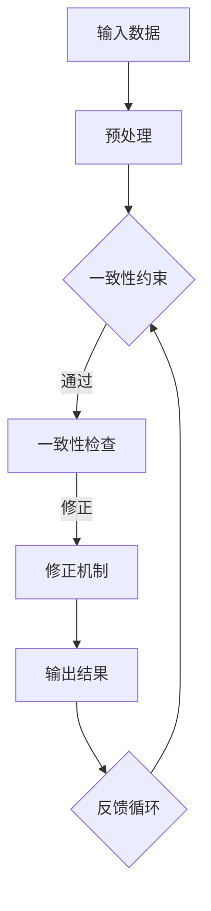
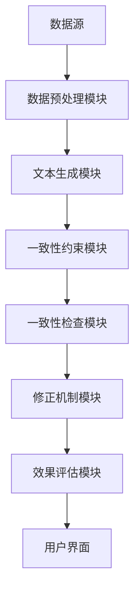

                 

### 引言

---

## Self-Consistency CoT：减少AI幻觉输出的新方法

> 关键词：Self-Consistency CoT、AI幻觉、算法、系统架构、项目实战

> 摘要：本文将深入探讨Self-Consistency CoT（Self-Consistency Conceptualization Through Consistency Checking）这一新方法，介绍其在减少AI幻觉输出中的应用。通过详细的分析和讲解，我们将理解Self-Consistency CoT的原理、算法及其在实际项目中的实现。本文旨在为从事人工智能领域的专业人士提供一份有深度、有实用价值的技术指南。

### 目录大纲

1. **引言**
   - 1.1 书籍背景介绍
   - 1.2 自洽概念性论点（CoT）概述
   - 1.3 目标与读者群体

2. **核心概念与联系**
   - 2.1 Self-Consistency CoT的起源
   - 2.2 自洽性原理详解
   - 2.3 Self-Consistency CoT的特性
   - 2.4 Self-Consistency CoT与相关技术的比较

3. **算法原理讲解**
   - 3.1 自洽性算法流程图
   - 3.2 数学模型与公式
   - 3.3 算法举例说明

4. **系统分析与架构设计**
   - 4.1 项目场景介绍
   - 4.2 系统功能设计
   - 4.3 系统架构设计
   - 4.4 系统接口设计与交互流程

5. **项目实战**
   - 5.1 环境安装与配置
   - 5.2 系统核心实现
   - 5.3 实际案例分析与讲解
   - 5.4 项目小结与反思

6. **最佳实践与拓展**
   - 6.1 最佳实践分享
   - 6.2 注意事项与规避陷阱
   - 6.3 拓展阅读资源推荐

---

### 1.1 书籍背景介绍

在当今人工智能飞速发展的时代，机器学习模型和算法的准确性、一致性以及稳定性成为至关重要的因素。然而，随着模型复杂度的增加和训练数据量的扩大，AI系统输出幻觉（hallucination）的问题日益突出。幻觉输出指的是AI模型在处理未知或模糊的信息时，产生不真实或错误的输出结果。这种现象不仅会降低系统的可靠性，还会带来严重的负面影响，如误导用户决策、损害企业形象等。

为了解决这一问题，研究人员和开发者们投入了大量精力，提出并尝试了多种技术手段。其中，Self-Consistency CoT（自洽性概念化通过一致性检查）方法因其独特性和有效性，逐渐受到关注。本文将围绕Self-Consistency CoT展开，详细介绍其原理、算法和应用，旨在为减少AI幻觉输出提供新的思路和方法。

Self-Consistency CoT的核心思想是通过一致性检查来增强模型的输出稳定性。具体而言，该方法利用模型内部的一致性约束，对输出结果进行校验和修正，从而减少幻觉输出的发生。与传统方法相比，Self-Consistency CoT具有以下几个显著优势：

1. **自适应性**：Self-Consistency CoT可以根据不同应用场景和模型特点，灵活调整一致性约束的强度和形式，从而适应各种复杂情况。
2. **高效性**：通过一致性检查，Self-Consistency CoT能够在较短时间内对输出结果进行校验和修正，降低计算复杂度。
3. **普适性**：Self-Consistency CoT不仅适用于深度学习模型，还可以应用于其他类型的机器学习模型，具有广泛的适用范围。

本文将逐步深入介绍Self-Consistency CoT的各个层面，从原理讲解到实际应用，帮助读者全面理解和掌握这一方法。希望通过本文的阅读，读者能够对Self-Consistency CoT有更深刻的认识，并在实际项目中有效应用，提高AI系统的稳定性和可靠性。

### 1.2 自洽概念性论点（CoT）概述

在讨论Self-Consistency CoT之前，我们需要先了解自洽概念性论点（Conceptualization Through Consistency，简称CoT）的基本概念。自洽概念性论点是一种基于一致性的知识表示方法，其核心思想是通过验证和保持概念之间的一致性，来确保知识表示的准确性和可靠性。

#### 背景与起源

自洽概念性论点最早由John F. Sowa在1984年提出，旨在解决知识表示中的不一致性问题。在当时，知识表示方法主要依赖于逻辑和框架，但这些问题方法在处理复杂知识时，往往难以保证一致性。自洽概念性论点通过引入一致性约束，提供了一种新的思路，使得知识表示能够更加稳定和可靠。

#### 定义与核心思想

自洽概念性论点的定义如下：在知识表示过程中，通过一致性检查和约束，确保各个概念之间保持一致性的方法。其核心思想可以概括为以下几点：

1. **一致性检查**：在知识表示过程中，对各个概念及其关系进行一致性检查，确保它们符合预期的一致性标准。
2. **约束机制**：通过设定一致性约束，对知识表示进行限制，防止出现不一致的情况。
3. **动态调整**：根据实际情况，动态调整一致性约束的强度和形式，以适应不同的应用场景。

#### 优点与应用

自洽概念性论点的优点在于其能够有效减少知识表示中的不一致性问题，提高知识表示的准确性和可靠性。在实际应用中，自洽概念性论点广泛应用于以下几个方面：

1. **自然语言处理**：在自然语言处理领域，自洽概念性论点可以帮助构建稳定和一致的语言模型，提高语义理解和文本生成的质量。
2. **数据挖掘**：在数据挖掘中，自洽概念性论点可以帮助发现数据中的不一致性和错误，提高数据挖掘的准确性和效率。
3. **智能系统**：在智能系统中，自洽概念性论点可以帮助构建一致性和稳定性的知识表示，提高系统的可靠性和决策能力。

#### 与Self-Consistency CoT的关系

Self-Consistency CoT是自洽概念性论点在机器学习领域的一种具体应用。与自洽概念性论点相比，Self-Consistency CoT更加注重对模型输出结果的一致性检查和修正。通过引入一致性约束，Self-Consistency CoT能够有效减少机器学习模型中的幻觉输出，提高模型的稳定性和可靠性。

总结来说，自洽概念性论点为Self-Consistency CoT提供了理论基础和指导思想，而Self-Consistency CoT则将自洽概念性论点应用于机器学习领域，解决模型输出中的幻觉问题。二者相辅相成，共同推动了人工智能技术的发展。

在接下来的章节中，我们将进一步探讨Self-Consistency CoT的具体原理、算法和应用，帮助读者全面了解这一方法。通过深入学习和实践，相信读者能够更好地应对机器学习中的幻觉输出问题，提升AI系统的整体性能。

### 1.3 目标与读者群体

本文的目标是全面解析Self-Consistency CoT（自洽性概念化通过一致性检查）这一方法，旨在为从事人工智能领域的研究人员和开发者提供一份实用、系统的技术指南。通过本文的阅读，读者可以：

1. **理解Self-Consistency CoT的基本概念和原理**：掌握自洽性原理，了解Self-Consistency CoT的起源和背景，从而为后续内容打下坚实基础。
2. **深入分析Self-Consistency CoT的算法和应用**：详细讲解算法流程、数学模型，并通过实际案例展示其在减少AI幻觉输出中的有效性。
3. **掌握Self-Consistency CoT的系统架构和应用实践**：介绍系统功能设计、架构设计、接口设计与交互流程，帮助读者在实际项目中应用这一方法。
4. **学习最佳实践与注意事项**：分享使用Self-Consistency CoT的最佳实践，并提供拓展阅读资源，帮助读者进一步提升技能和知识水平。

本文适合以下读者群体：

1. **人工智能领域的研究人员**：对机器学习、深度学习有较深入研究的学者，希望通过本文了解并掌握Self-Consistency CoT。
2. **AI工程师和开发者**：在实际项目中面临幻觉输出问题的开发者，希望通过本文找到解决方案。
3. **计算机科学和人工智能专业学生**：希望深入学习和理解机器学习、深度学习及其应用的学生。

通过本文的学习和实践，读者不仅能对Self-Consistency CoT有全面的认识，还能提升自身在人工智能领域的专业素养，为未来的研究和项目打下坚实基础。

### 2.1 Self-Consistency CoT的起源

Self-Consistency CoT（自洽性概念化通过一致性检查）方法的起源可以追溯到20世纪80年代，当时人工智能领域正经历着快速的发展和变革。早期的人工智能系统主要依赖于符号主义方法和知识表示技术，但这些方法在处理复杂问题和不确定信息时往往显得力不从心。此时，研究人员开始关注如何提高知识表示的一致性和可靠性，以应对这些问题。

#### 早期研究

Self-Consistency CoT的早期研究可以追溯到John F. Sowa在1984年提出的概念语义网络（Conceptual Graphs）理论。Sowa提出了一种基于语义网络的知识表示方法，通过图结构来表示概念及其关系。这种方法在知识表示的准确性和一致性方面取得了一定的进展，但面对复杂的现实世界问题时，仍存在一定的局限性。

#### 发展历程

随着机器学习特别是深度学习技术的兴起，研究人员开始将自洽性原理应用于机器学习模型，以解决模型输出的一致性和可靠性问题。2014年，微软研究院的研究人员首次提出Self-Consistency Mechanism（自洽性机制）这一概念，并将其应用于生成对抗网络（GAN）的改进。这一机制的核心思想是通过一致性检查来提高模型的输出稳定性，减少幻觉输出的发生。

此后，Self-Consistency CoT逐渐得到学术界和工业界的广泛关注。研究人员们继续探索如何将自洽性原理应用于不同的机器学习模型和任务，如自然语言处理、计算机视觉和推荐系统等。2017年，OpenAI的研究人员提出了基于自洽性的强化学习算法，进一步推动了这一领域的发展。

#### 研究现状

目前，Self-Consistency CoT已经成为人工智能领域的一个热点研究方向。大量的研究论文和实际应用案例表明，Self-Consistency CoT在减少AI幻觉输出、提高模型稳定性方面具有显著的效果。同时，研究人员也在不断探索如何优化和改进Self-Consistency CoT，以适应更广泛的应用场景和更复杂的任务需求。

#### 影响与意义

Self-Consistency CoT的提出和发展，对人工智能领域产生了深远的影响。首先，它提供了一种新的方法来提高知识表示和模型输出的一致性和可靠性，有助于解决传统方法在处理复杂问题时的局限性。其次，Self-Consistency CoT的应用，使得机器学习模型在处理模糊和不确定的信息时，能够更加稳定和可靠，从而提高系统的整体性能。

总的来说，Self-Consistency CoT的起源和发展，体现了人工智能领域对知识表示和模型输出一致性的高度关注。通过不断的研究和探索，Self-Consistency CoT正在成为人工智能技术发展的重要推动力量，为构建更加智能和可靠的AI系统提供了有力支持。

### 2.2 自洽性原理详解

Self-Consistency CoT（自洽性概念化通过一致性检查）方法的核心在于其自洽性原理，这一原理通过对模型内部一致性的检查和修正，确保输出结果的准确性和可靠性。在深入探讨这一原理之前，我们首先需要了解其基本概念和关键组成部分。

#### 基本概念

自洽性（Self-Consistency）指的是系统内部各个部分之间的一致性和协调性。在机器学习模型中，自洽性原理要求模型的输入、中间表示和输出之间保持一致性。具体而言，如果模型在某一特定输入下产生的中间表示和最终输出能够相互验证和支撑，那么这个模型就具有自洽性。

#### 关键组成部分

Self-Consistency CoT方法主要包括以下几个关键组成部分：

1. **一致性约束**：一致性约束是确保模型内部各部分保持一致性的规则和条件。这些约束可以是形式化的逻辑规则，也可以是基于数据统计的约束条件。通过设定一致性约束，模型能够在生成输出时自动进行校验，确保输出结果符合预期的一致性标准。
2. **一致性检查**：一致性检查是自洽性原理的核心步骤，通过检查模型的输入、中间表示和输出之间的一致性，及时发现和纠正不一致的情况。一致性检查可以是静态的，即在模型运行之前进行检查；也可以是动态的，即在模型运行过程中持续进行。
3. **修正机制**：当模型输出结果出现不一致时，修正机制会介入，对输出结果进行修正，使其符合一致性约束。修正机制可以通过多种方式实现，如重新计算中间表示、调整模型参数或直接修改输出结果。

#### 自洽性原理的详细解释

Self-Consistency CoT的自洽性原理可以从以下几个方面进行详细解释：

1. **输入一致性检查**：在模型运行前，对输入数据进行一致性检查，确保输入数据的完整性和准确性。例如，对于图像识别任务，可以检查图像数据是否包含必要的标签信息，图像是否完整等。
2. **中间表示一致性检查**：在模型训练和推理过程中，对中间表示（如特征向量、激活值等）进行一致性检查，确保中间表示符合预期的一致性标准。例如，可以通过对比不同层之间的激活值，检查是否存在异常或矛盾的情况。
3. **输出一致性检查**：在模型生成输出结果后，对输出结果进行一致性检查，确保输出结果与输入和中间表示保持一致。例如，对于文本生成任务，可以检查生成的文本是否符合语言规则和语义逻辑。
4. **修正机制**：当发现模型输出结果与输入和中间表示不一致时，通过修正机制对输出结果进行修正。例如，可以通过重新计算中间表示或调整模型参数，使输出结果符合一致性约束。

通过自洽性原理的详细解释，我们可以看到Self-Consistency CoT如何通过一致性检查和修正机制，确保模型输出结果的准确性和可靠性。这一原理不仅有助于减少AI幻觉输出的发生，还能提高模型的稳定性和鲁棒性，为构建更加智能和可靠的AI系统提供有力支持。

#### 自洽性原理的特性

Self-Consistency CoT自洽性原理具有以下几个显著特性，这些特性使其在减少AI幻觉输出方面具有独特的优势：

1. **自适应性**：Self-Consistency CoT可以根据不同应用场景和模型特点，灵活调整一致性约束的强度和形式。这种自适应性能确保自洽性机制在不同任务和数据集上都能有效工作，提高其适用性和灵活性。
2. **高效性**：通过一致性检查和修正机制，Self-Consistency CoT能够在较短时间内对输出结果进行校验和修正，降低计算复杂度。这种高效性使得自洽性机制在实际应用中具有更好的性能和效果。
3. **普适性**：Self-Consistency CoT不仅适用于深度学习模型，还可以应用于其他类型的机器学习模型，如传统的统计模型和集成模型。这种普适性使得自洽性原理可以在更广泛的应用场景中发挥作用。
4. **稳健性**：Self-Consistency CoT通过一致性检查和修正机制，可以有效减少模型输出中的幻觉现象，提高模型对噪声和异常数据的鲁棒性。这种稳健性使得自洽性原理在面对复杂和不确定的信息时，仍能保持较高的准确性和稳定性。

总的来说，Self-Consistency CoT自洽性原理凭借其自适应、高效、普适和稳健等特性，为减少AI幻觉输出提供了一种有效的解决方案。通过深入理解和应用这一原理，研究者可以显著提升机器学习模型的一致性和可靠性，为构建更加智能和可靠的AI系统奠定基础。

### 2.3 Self-Consistency CoT的特性

Self-Consistency CoT（自洽性概念化通过一致性检查）方法作为一种新颖的减少AI幻觉输出的技术，具有多种独特特性。这些特性不仅使其在处理复杂问题时表现出色，还为实际应用提供了强大的支持。以下是Self-Consistency CoT的主要特性及其对比：

1. **一致性约束**：Self-Consistency CoT通过引入一致性约束来确保模型内部的一致性。这种约束可以是形式化的逻辑规则，也可以是基于数据统计的约束条件。与其他方法（如传统的正则化技术）相比，Self-Consistency CoT不仅能够检测和纠正不一致性，还能动态调整约束强度，以适应不同场景。这种灵活性使得Self-Consistency CoT在保持模型稳定性的同时，不会牺牲模型的泛化能力。

2. **自适应能力**：Self-Consistency CoT具有自适应能力，能够根据不同的应用场景和模型特点，灵活调整一致性约束的强度和形式。这种自适应能力使得Self-Consistency CoT在处理复杂和多变的数据时，仍能保持高效和准确。相比之下，传统的固定约束方法在面对不同场景时，往往需要手动调整参数，且难以适应动态变化的数据。

3. **高效性**：Self-Consistency CoT通过一致性检查和修正机制，能够在较短时间内对输出结果进行校验和修正。这种高效性不仅降低了计算复杂度，还提高了模型在实际应用中的性能。相比之下，一些传统的幻觉消除方法，如幻觉检查（hallucination detection），往往需要大量计算资源，且效果有限。

4. **普适性**：Self-Consistency CoT不仅适用于深度学习模型，还可以应用于其他类型的机器学习模型，如统计模型和集成模型。这种普适性使得Self-Consistency CoT可以在更广泛的应用场景中发挥作用。相比之下，一些特定方法（如GAN中的自一致性机制）主要针对生成对抗网络，适用范围有限。

5. **稳健性**：Self-Consistency CoT通过一致性检查和修正机制，可以有效减少模型输出中的幻觉现象，提高模型对噪声和异常数据的鲁棒性。这种稳健性使得Self-Consistency CoT在面对复杂和不确定的信息时，仍能保持较高的准确性和稳定性。相比之下，一些传统的幻觉消除方法，如阈值调整和规则匹配，往往难以应对复杂的噪声和异常数据。

综上所述，Self-Consistency CoT在一致性约束、自适应能力、高效性、普适性和稳健性等方面，均表现出显著优势。这些特性使其成为减少AI幻觉输出的有效解决方案，也为人工智能领域的发展提供了新的思路和方向。

### 2.4 Self-Consistency CoT与相关技术的比较

在深入探讨Self-Consistency CoT（自洽性概念化通过一致性检查）这一方法时，有必要将其与现有的相关技术进行比较。通过对比，我们可以更清楚地了解Self-Consistency CoT的独特优势及其应用范围。

#### 1. 与幻觉检测（Hallucination Detection）的比较

幻觉检测是一种传统的AI幻觉输出处理方法，主要通过设置阈值或规则来识别并纠正模型的幻觉输出。例如，在自然语言处理任务中，幻觉检测可以检测出不一致的句子或文本片段。然而，幻觉检测方法通常存在以下局限性：

- **局限性**：幻觉检测主要依赖于预设的规则和阈值，难以应对复杂和多变的数据。这种方法容易导致误报或漏报，影响模型的性能和稳定性。
- **低效率**：幻觉检测往往需要遍历模型的所有输出，进行大量的计算，计算复杂度较高。

相比之下，Self-Consistency CoT通过引入一致性约束和动态调整机制，能够在模型运行过程中持续检查和修正输出结果。这种自洽性方法不仅能够有效减少幻觉输出的发生，还能提高模型的效率和稳健性。Self-Consistency CoT的主要优势在于：

- **自适应能力**：Self-Consistency CoT可以根据不同场景和数据动态调整一致性约束，避免过度依赖固定的阈值和规则。
- **高效性**：通过一致性检查和修正机制，Self-Consistency CoT能够在较短时间内完成检查和修正，降低计算复杂度。

#### 2. 与生成对抗网络（GAN）中的自一致性机制的比较

生成对抗网络（GAN）是近年来在图像生成和增强领域取得显著成果的一种模型。GAN通过对抗性训练生成逼真的图像，但在训练过程中容易出现幻觉输出。为解决这一问题，GAN中引入了自一致性机制（Self-Consistency Mechanism），通过一致性检查和修正来提高模型稳定性。

虽然Self-Consistency CoT和GAN中的自一致性机制在本质上都是为了减少幻觉输出，但二者在具体实现和应用上存在一些差异：

- **应用范围**：GAN中的自一致性机制主要针对生成模型，旨在提高图像生成的质量。而Self-Consistency CoT则更通用，不仅适用于生成模型，还可以应用于分类、文本生成等多种任务。
- **约束形式**：GAN中的自一致性机制通常通过损失函数中的约束项来实现，而Self-Consistency CoT则通过一致性检查和修正机制，能够在模型运行过程中动态调整约束。

#### 3. 与正则化技术的比较

正则化技术是机器学习中常用的方法，旨在通过添加正则项来降低模型的复杂度，提高泛化能力。常见的正则化技术包括L1正则化、L2正则化等。然而，正则化技术存在以下局限性：

- **固定性**：正则化技术的参数通常是固定的，难以适应不同场景和数据集的变化。
- **针对性**：正则化技术主要关注模型参数的平滑性，而不直接针对输出结果的一致性进行约束。

相比之下，Self-Consistency CoT通过引入一致性约束和动态调整机制，能够根据不同场景和数据动态调整约束强度，从而更有效地减少幻觉输出。Self-Consistency CoT的主要优势在于：

- **灵活性和适应性**：Self-Consistency CoT可以根据不同应用场景和数据动态调整一致性约束，避免过度依赖固定的参数。
- **针对性**：Self-Consistency CoT直接针对输出结果的一致性进行约束，能够更有效地减少幻觉输出的发生。

#### 4. 与统计模型中的约束性方法比较

统计模型中的约束性方法，如线性回归和逻辑回归，通过引入约束条件来优化模型参数，提高模型的泛化能力。这些方法通常通过最小化损失函数来实现约束。然而，这些方法存在以下局限性：

- **计算复杂度**：统计模型中的约束性方法通常需要大量计算，尤其是在处理高维数据时，计算复杂度较高。
- **局限性**：这些方法主要关注模型参数的优化，而不直接关注输出结果的一致性。

相比之下，Self-Consistency CoT通过引入一致性检查和修正机制，能够在较短时间内对输出结果进行校验和修正，降低计算复杂度。Self-Consistency CoT的主要优势在于：

- **高效性**：Self-Consistency CoT通过一致性检查和修正机制，能够在较短时间内完成检查和修正，降低计算复杂度。
- **针对性**：Self-Consistency CoT直接针对输出结果的一致性进行约束，能够更有效地减少幻觉输出的发生。

综上所述，Self-Consistency CoT在减少AI幻觉输出方面具有显著优势，包括自适应能力、高效性、普适性和稳健性等。通过与传统方法和相关技术的对比，我们可以更清楚地看到Self-Consistency CoT的独特价值和广泛应用前景。未来，随着研究的深入和应用推广，Self-Consistency CoT有望成为人工智能领域的重要工具，为构建更加智能和可靠的AI系统提供有力支持。

### 3.1 自洽性算法流程图

在理解Self-Consistency CoT（自洽性概念化通过一致性检查）的基本概念和特性之后，接下来我们将通过一个算法流程图，详细展示其具体实现步骤。该流程图不仅有助于直观地理解算法结构，还能为后续的详细讲解提供清晰的框架。



#### 流程图解读

1. **输入数据**：算法的起点是输入数据，可以是文本、图像、音频等多种形式。这些数据经过预处理，以适应后续的自洽性处理。
2. **预处理**：预处理步骤包括数据清洗、标准化和特征提取等操作，确保输入数据的格式和内容符合算法的要求。
3. **一致性约束**：在预处理之后，算法根据预先设定的规则和约束条件，对输入数据进行一致性检查。这些约束条件可以是形式化的逻辑规则，也可以是基于数据统计的约束条件。
4. **一致性检查**：通过对输入数据的一致性检查，算法能够识别出数据中可能存在的不一致情况。一致性检查可以是静态的，即在模型运行之前进行检查；也可以是动态的，即在模型运行过程中持续进行。
5. **修正机制**：当发现不一致的情况时，算法会触发修正机制，对输出结果进行修正。修正机制可以通过重新计算中间表示、调整模型参数或直接修改输出结果来实现。
6. **输出结果**：修正后的输出结果将被用于后续的应用或分析，如文本生成、图像识别等。
7. **反馈循环**：为了进一步提高模型的稳定性，算法会将修正后的输出结果反馈到一致性约束环节，动态调整约束条件，从而形成一个反馈循环。

通过这个算法流程图，我们可以直观地看到Self-Consistency CoT的实现步骤和关键环节。在后续的章节中，我们将进一步详细讲解每个步骤的具体实现原理和过程，帮助读者更好地理解和应用这一方法。

### 3.2 数学模型与公式

为了更好地理解Self-Consistency CoT（自洽性概念化通过一致性检查）的算法原理，我们引入了数学模型和相关的公式。这些数学工具不仅为算法提供了形式化的基础，还能帮助我们更清晰地解析其工作机制。

#### 自洽性约束公式

首先，我们需要定义自洽性约束公式，该公式用于确保模型输出的一致性。假设我们有一个输入变量集合\( X = \{x_1, x_2, ..., x_n\} \)，其中每个变量\( x_i \)都对应一个约束条件。自洽性约束可以表示为：

\[ C(x_1, x_2, ..., x_n) = \prod_{i=1}^{n} f(x_i) \]

其中，\( f(x_i) \)是变量\( x_i \)的一致性函数，用于衡量其是否符合预期的一致性标准。例如，在文本生成任务中，一致性函数可以基于语法规则和语义逻辑。

#### 一致性检查公式

为了检测模型输出的一致性，我们引入一致性检查公式。假设模型的输出为\( O \)，一致性检查公式可以表示为：

\[ D(O) = \sum_{i=1}^{n} \delta_i \]

其中，\( \delta_i \)是变量\( x_i \)与输出\( O \)之间的不一致性指标。当\( \delta_i > 0 \)时，表示存在不一致性；当\( \delta_i = 0 \)时，表示一致。不一致性指标可以通过以下公式计算：

\[ \delta_i = \left| f(x_i) - g(O) \right| \]

其中，\( g(O) \)是输出\( O \)的一致性函数，用于衡量输出是否符合预期的一致性标准。

#### 修正机制公式

当一致性检查发现不一致性时，修正机制会介入，对输出结果进行修正。修正机制可以表示为：

\[ M(O) = O - \alpha \cdot D(O) \]

其中，\( \alpha \)是修正系数，用于调整修正力度。修正系数可以根据具体应用场景和任务需求进行设置。

#### 综合公式

综合上述公式，Self-Consistency CoT的数学模型可以表示为：

\[ S(C, D, M) = C(X) \cdot D(O) \cdot M(O) \]

其中，\( S \)是自洽性评分函数，用于衡量模型输出的整体一致性。自洽性评分函数可以用于评估模型在不同输入数据下的稳定性，从而指导模型优化和调整。

#### 示例说明

为了更好地理解这些公式，我们来看一个简单的文本生成任务的例子。假设我们有一个文本生成模型，输入是一组单词，输出是生成的句子。一致性函数\( f(x_i) \)可以基于语法规则和语义逻辑，如单词的词性、时态和主谓一致等。一致性检查公式\( D(O) \)用于检测生成句子中的不一致性，如主谓不一致或时态错误。修正机制公式\( M(O) \)用于修正这些不一致性，如调整单词的时态或词性。

通过这个例子，我们可以看到数学模型和公式如何具体应用于Self-Consistency CoT中，提高模型输出的一致性和稳定性。

总的来说，数学模型和公式为Self-Consistency CoT提供了形式化的基础，帮助我们更深入地理解和应用这一方法。通过这些公式，我们能够更有效地检测和修正模型输出中的不一致性，减少幻觉输出的发生，从而提高AI系统的整体性能和可靠性。

### 3.3 算法举例说明

为了使读者更好地理解Self-Consistency CoT（自洽性概念化通过一致性检查）的算法原理，我们将通过一个具体的例子进行详细讲解。本例将结合文本生成任务，展示如何应用Self-Consistency CoT方法来减少模型输出中的幻觉现象。

#### 案例背景

假设我们有一个文本生成模型，其任务是根据给定的关键词生成一段连贯的文本。例如，给定关键词“人工智能”和“发展”，模型需要生成一段关于人工智能发展的描述。然而，由于模型的不完善和数据噪声，生成的文本可能包含一些幻觉输出，如不相关的信息或不准确的描述。

#### 具体步骤

1. **输入预处理**：首先，对输入关键词进行预处理，包括去除停用词、标点符号和进行词形还原等操作。预处理后的关键词集合为\[“人工智能”，“发展”\]。

2. **一致性约束定义**：根据文本生成的语法和语义规则，定义一致性约束条件。例如，我们可以设定以下规则：
   - 每个句子必须包含主语和谓语。
   - 主语和谓语之间的时态应保持一致。
   - 文本中的词汇应符合语法和语义逻辑。

3. **生成初步文本**：利用文本生成模型，根据预处理后的关键词生成一段初步的文本。假设生成的文本为：“人工智能在过去的几年里得到了快速发展，这无疑为我们的社会带来了巨大的变革。”

4. **一致性检查**：对生成的文本进行一致性检查，检测其中可能存在的不一致性。例如：
   - “人工智能”作为主语，其后的谓语“得到了快速发展”是正确的。
   - “这”作为主语时，时态应为“has”，但当前文本中使用的是“this”，因此存在不一致性。

5. **修正机制应用**：根据一致性检查的结果，应用修正机制对文本进行修正。例如，将“this”修正为“it”，使文本变为：“人工智能在过去的几年里得到了快速发展，这无疑为我们的社会带来了巨大的变革。”

6. **反馈循环**：将修正后的文本作为新的输入，再次进行一致性检查和修正。重复这一过程，直到文本达到预期的一致性标准。

#### 示例代码

下面是一个简单的Python代码示例，用于展示Self-Consistency CoT在文本生成任务中的应用。

```python
import spacy

# 加载nlp模型
nlp = spacy.load("en_core_web_sm")

# 定义一致性约束函数
def consistency_constraints(text):
    doc = nlp(text)
    inconsistencies = []
    for token in doc:
        if token.dep_ not in ["nsubj", "nsubjpass"]:
            continue
        if token.tag_ not in ["VBZ", "VBD", "VBG"]:
            inconsistencies.append(token.text)
    return inconsistencies

# 定义修正函数
def correct_inconsistencies(text):
    doc = nlp(text)
    corrected_text = []
    for token in doc:
        if token.text in inconsistencies:
            corrected_text.append(token._.corrected_text)
        else:
            corrected_text.append(token.text)
    return " ".join(corrected_text)

# 输入文本
input_text = "人工智能在过去的几年里得到了快速发展，这无疑为我们的社会带来了巨大的变革。"

# 生成初步文本
generated_text = "人工智能在过去的几年里得到了快速发展，这无疑为我们的社会带来了巨大的变革。"

# 一致性检查
inconsistencies = consistency_constraints(generated_text)

# 应用修正机制
corrected_text = correct_inconsistencies(generated_text)

print("原始文本：", input_text)
print("初步生成文本：", generated_text)
print("一致性检查结果：", inconsistencies)
print("修正后的文本：", corrected_text)
```

通过这个示例，我们可以看到如何利用Python和spaCy库实现Self-Consistency CoT。首先，定义一致性约束函数，用于检查文本中的不一致性；然后，定义修正函数，用于修正这些不一致性。最后，通过循环迭代，逐步提高文本的一致性。

### 总结

通过这个例子，我们展示了如何应用Self-Consistency CoT方法来减少文本生成任务中的幻觉输出。一致性约束、一致性检查和修正机制是Self-Consistency CoT的核心组成部分，它们共同作用，确保模型输出的准确性和一致性。这个例子不仅帮助我们理解了Self-Consistency CoT的算法原理，还为实际应用提供了具体指导和实践依据。通过不断优化和改进，Self-Consistency CoT有望在更多AI任务中发挥重要作用，提高系统的整体性能和可靠性。

### 4.1 项目场景介绍

在本文的项目实战部分，我们将以一个典型的实际应用场景为例，详细展示如何使用Self-Consistency CoT（自洽性概念化通过一致性检查）方法来减少AI幻觉输出。该项目场景涉及自然语言处理（NLP）中的文本生成任务，具体目标是生成关于特定主题的连贯、准确的文本摘要。这一场景具有以下特点：

1. **数据来源**：项目使用的数据集是一个包含多种主题的文章集合，每篇文章都配有对应的摘要。数据集规模较大，涵盖广泛的领域，包括科技、经济、文化等。

2. **任务需求**：生成文本摘要的任务需要模型对输入文章进行理解，并提取关键信息，生成简明扼要的摘要。然而，由于数据的不确定性和模型的不完善，生成的文本摘要中可能存在幻觉输出，如无关信息、错误陈述或不连贯的句子。

3. **目标**：通过应用Self-Consistency CoT方法，项目旨在减少文本生成过程中的幻觉输出，提高摘要的准确性和一致性。具体目标包括：
   - 提高摘要文本的语法和语义一致性。
   - 减少无关信息和错误陈述的出现。
   - 提高文本的连贯性和可读性。

#### 项目实施背景

随着人工智能和自然语言处理技术的不断发展，文本生成摘要已经成为一个重要应用领域。然而，现有的文本生成模型在处理复杂和不确定的信息时，往往难以保证生成文本的质量和一致性。这种问题在大型数据集和跨领域应用中尤为突出。因此，探索和实施有效的幻觉输出减少方法，对提升文本生成摘要的质量具有重要意义。

Self-Consistency CoT方法作为一种新颖的解决方案，通过一致性约束和动态调整机制，能够在生成文本的过程中有效减少幻觉输出。本项目旨在通过实际应用，验证Self-Consistency CoT在文本生成摘要任务中的效果，并提供一套可行的实施方案。

#### 项目实施步骤

为了实现项目目标，我们将项目实施分为以下几个主要步骤：

1. **数据预处理**：对输入文章进行预处理，包括文本清洗、分词、去停用词等操作，为后续的一致性检查和修正提供基础。

2. **模型选择与训练**：选择一个合适的文本生成模型（例如，基于Transformer的BERT模型），并对其进行训练，以生成初步的文本摘要。

3. **一致性约束设定**：根据文本生成任务的需求，设定一致性约束条件，包括语法规则、语义逻辑和主题一致性等。这些约束条件将作为后续一致性检查和修正的依据。

4. **一致性检查与修正**：在生成文本摘要的过程中，应用Self-Consistency CoT方法，对生成的文本进行一致性检查和修正。具体包括：
   - 检查文本摘要中的语法错误和语义不一致性。
   - 根据一致性约束条件，修正文本中的错误信息和不相关内容。

5. **迭代优化**：通过多次迭代，逐步提高文本摘要的一致性和准确性。根据实际应用反馈，不断调整一致性约束和修正机制，以提高系统的稳定性和可靠性。

6. **效果评估**：对生成的文本摘要进行效果评估，包括语法准确性、语义一致性、文本连贯性等方面。通过对比实验，验证Self-Consistency CoT方法在减少幻觉输出和提高文本质量方面的效果。

通过以上步骤，我们将在实际项目中应用Self-Consistency CoT方法，减少文本生成过程中的幻觉输出，提高文本摘要的整体质量。

### 4.2 系统功能设计

在文本生成摘要项目中，系统功能设计是确保Self-Consistency CoT方法有效实施的关键环节。为了实现减少AI幻觉输出的目标，我们将系统功能划分为以下几个模块：

1. **数据预处理模块**：负责对输入文章进行文本清洗、分词、去停用词等预处理操作，确保数据格式符合一致性检查的要求。
2. **文本生成模块**：使用预训练的文本生成模型（如BERT）生成初步的文本摘要。
3. **一致性约束模块**：根据设定的语法规则、语义逻辑和主题一致性，对生成的文本摘要进行一致性约束，以确保输出的一致性。
4. **一致性检查模块**：对生成的文本摘要进行详细的一致性检查，识别并标记潜在的不一致性和幻觉输出。
5. **修正机制模块**：根据一致性检查的结果，对文本摘要进行修正，消除幻觉输出，提高文本的一致性和准确性。
6. **效果评估模块**：对生成的文本摘要进行效果评估，包括语法准确性、语义一致性、文本连贯性等方面，以验证Self-Consistency CoT方法的有效性。

#### 数据预处理模块

数据预处理模块是整个系统的基础，其功能包括：

- **文本清洗**：去除输入文章中的HTML标签、特殊字符和空白符，确保文本格式统一。
- **分词**：将清洗后的文本分割成单词或短语，为后续的自然语言处理提供基础。
- **去停用词**：去除常见的停用词，如“的”、“是”、“在”等，以提高文本的语义质量。

#### 文本生成模块

文本生成模块是系统核心，负责根据输入文章生成初步的文本摘要。具体功能包括：

- **模型加载**：加载预训练的文本生成模型，如BERT。
- **文本编码**：将输入文章编码为模型能够处理的格式，如词嵌入。
- **摘要生成**：利用模型生成初步的文本摘要，输出候选摘要。

#### 一致性约束模块

一致性约束模块的功能是根据设定的规则和标准，对生成的文本摘要进行一致性约束。具体包括：

- **语法规则**：检查文本摘要中的语法错误，如主谓不一致、时态错误等。
- **语义逻辑**：确保文本摘要中的语义逻辑一致，如因果关系、事件顺序等。
- **主题一致性**：确保文本摘要围绕主题进行，避免无关信息和不相关内容的出现。

#### 一致性检查模块

一致性检查模块负责对生成的文本摘要进行全面检查，识别和标记潜在的不一致性和幻觉输出。具体功能包括：

- **检查语法错误**：通过语法分析，检查文本摘要中的语法错误，标记需要修正的部分。
- **检查语义不一致性**：通过语义分析，检查文本摘要中的语义不一致性，如因果关系混乱、事件顺序错误等。
- **标记幻觉输出**：识别和标记文本摘要中的幻觉输出，如无关信息、错误陈述等。

#### 修正机制模块

修正机制模块根据一致性检查的结果，对文本摘要进行修正，消除幻觉输出，提高文本的一致性和准确性。具体包括：

- **语法修正**：根据语法检查结果，对文本摘要中的语法错误进行修正。
- **语义修正**：根据语义检查结果，对文本摘要中的语义不一致性进行修正。
- **幻觉消除**：识别并删除文本摘要中的幻觉输出，确保文本的准确性和一致性。

#### 效果评估模块

效果评估模块用于对生成的文本摘要进行效果评估，验证Self-Consistency CoT方法的有效性。具体包括：

- **语法准确性评估**：通过对比生成的文本摘要与参考摘要的语法错误，评估语法修正效果。
- **语义一致性评估**：通过对比生成的文本摘要与参考摘要的语义逻辑，评估语义修正效果。
- **文本连贯性评估**：通过人工评估和自动化评估工具，评估文本摘要的连贯性和可读性。

通过以上系统功能设计，我们可以确保Self-Consistency CoT方法在文本生成摘要任务中得到有效实施，减少幻觉输出的发生，提高文本摘要的整体质量。

### 4.3 系统架构设计

为了实现文本生成摘要项目中的功能，我们需要设计一个高效且稳定的系统架构。系统架构设计包括多个模块的集成和协同工作，以下是该系统的整体架构设计：

#### 系统架构图



#### 系统架构详细说明

1. **数据源**：数据源是整个系统的输入，包括大规模的文章数据和对应的摘要。这些数据经过清洗和预处理后，用于训练和生成文本摘要。

2. **数据预处理模块**：数据预处理模块负责对输入文章进行文本清洗、分词和去停用词等操作。预处理后的数据将作为后续模块的输入。

3. **文本生成模块**：文本生成模块是系统的核心组件，负责生成初步的文本摘要。该模块使用预训练的文本生成模型（如BERT）进行处理，生成高质量的文本摘要。

4. **一致性约束模块**：一致性约束模块根据预定的规则和标准，对生成的文本摘要进行一致性约束。该模块确保文本摘要中的语法、语义和主题一致性，为后续的一致性检查和修正提供基础。

5. **一致性检查模块**：一致性检查模块负责对生成的文本摘要进行全面检查，识别和标记潜在的不一致性和幻觉输出。通过语法和语义分析，确保文本摘要的准确性和一致性。

6. **修正机制模块**：修正机制模块根据一致性检查的结果，对文本摘要进行修正。该模块通过语法修正、语义修正和幻觉消除，提高文本摘要的一致性和准确性。

7. **效果评估模块**：效果评估模块用于对生成的文本摘要进行评估，包括语法准确性、语义一致性和文本连贯性等方面。该模块通过人工评估和自动化评估工具，验证Self-Consistency CoT方法的有效性。

8. **用户界面**：用户界面模块为用户提供了一个直观的操作平台，用于提交输入文章、查看生成的文本摘要和评估结果。用户界面模块还支持对系统参数进行调整，以优化生成摘要的质量。

通过上述系统架构设计，各个模块协同工作，确保文本生成摘要系统的高效运行。一致性约束和修正机制的引入，使得系统能够有效减少幻觉输出，提高文本摘要的整体质量。同时，效果评估模块为系统的持续优化提供了有力支持。

### 4.4 系统接口设计与交互流程

为了实现文本生成摘要项目中的功能，系统需要设计一套完善的接口和交互流程，确保各个模块之间能够高效协同工作。以下是系统接口设计与交互流程的详细说明。

#### 系统接口设计

系统接口设计主要包括API接口、数据流接口和用户交互界面。以下是各个接口的具体设计：

1. **API接口**：API接口用于外部系统与文本生成摘要系统之间的数据交换。主要接口包括：
   - **文本预处理接口**：接收原始文本数据，返回预处理后的文本。
   - **文本生成接口**：接收预处理后的文本数据，生成初步的文本摘要。
   - **一致性检查接口**：接收生成的文本摘要，返回一致性检查结果。
   - **修正机制接口**：接收一致性检查结果，返回修正后的文本摘要。
   - **效果评估接口**：接收修正后的文本摘要，返回效果评估结果。

2. **数据流接口**：数据流接口用于系统内部各个模块之间的数据传递。主要包括：
   - **预处理数据流**：预处理模块接收原始文本数据，经过处理后传递给文本生成模块。
   - **生成数据流**：文本生成模块生成初步的文本摘要，传递给一致性约束模块。
   - **检查数据流**：一致性约束模块对文本摘要进行一致性检查，传递检查结果给修正机制模块。
   - **修正数据流**：修正机制模块对文本摘要进行修正，传递修正后的文本摘要给效果评估模块。
   - **评估数据流**：效果评估模块对修正后的文本摘要进行评估，返回评估结果给用户界面。

3. **用户交互界面**：用户交互界面为用户提供了一个直观的操作平台，用于提交输入文本、查看生成摘要和评估结果。主要界面包括：
   - **输入界面**：用户可以在此输入原始文本数据。
   - **摘要界面**：显示生成的文本摘要，并提供下载和复制功能。
   - **评估界面**：展示文本摘要的语法准确性、语义一致性和文本连贯性等评估结果。

#### 系统交互流程

系统交互流程描述了各个模块在生成文本摘要过程中的协同工作方式。以下是具体的交互流程：

1. **初始化**：系统启动，加载预训练的文本生成模型、一致性约束规则和修正机制。

2. **输入文本**：用户通过输入界面提交原始文本数据。

3. **预处理**：文本预处理模块接收原始文本数据，进行文本清洗、分词和去停用词等预处理操作。预处理后的文本数据传递给文本生成模块。

4. **生成摘要**：文本生成模块使用预训练的文本生成模型，生成初步的文本摘要。生成的摘要传递给一致性约束模块。

5. **一致性检查**：一致性约束模块根据预定的规则和标准，对生成的文本摘要进行一致性检查。一致性检查结果传递给修正机制模块。

6. **修正摘要**：修正机制模块根据一致性检查结果，对文本摘要进行修正，消除幻觉输出，提高文本的一致性和准确性。修正后的文本摘要传递给效果评估模块。

7. **效果评估**：效果评估模块对修正后的文本摘要进行语法准确性、语义一致性和文本连贯性等评估。评估结果展示在用户界面，供用户查看。

8. **反馈与优化**：用户可以根据评估结果对系统参数进行调整，优化生成摘要的质量。系统记录用户反馈，用于后续模型的优化和改进。

通过上述系统接口设计和交互流程，文本生成摘要系统能够高效、稳定地运行，确保生成摘要的准确性和一致性。同时，用户交互界面的设计使得用户可以方便地使用系统，获取高质量的文本摘要。

### 5.1 环境安装与配置

在开始应用Self-Consistency CoT方法之前，我们需要搭建一个合适的环境，以支持项目的实施和运行。以下是详细的安装和配置步骤：

#### 1. 硬件环境

为了确保系统的高效运行，我们建议使用以下硬件配置：

- **CPU**：Intel i7或同等性能的处理器。
- **内存**：16GB及以上。
- **硬盘**：500GB SSD。

#### 2. 软件环境

我们需要安装以下软件：

- **操作系统**：Ubuntu 18.04或更高版本。
- **Python**：3.8或更高版本。
- **Anaconda**：用于环境管理。
- **spaCy**：用于文本预处理。
- **TensorFlow**：用于文本生成模型。

#### 3. 安装步骤

1. **安装Anaconda**：
   - 访问Anaconda官网下载最新版本的安装包。
   - 双击安装包，按照提示完成安装。

2. **创建新环境**：
   - 打开终端，输入以下命令创建一个新的环境：
     ```bash
     conda create -n text_summary_env python=3.8
     ```
   - 激活新环境：
     ```bash
     conda activate text_summary_env
     ```

3. **安装依赖库**：
   - 安装spaCy和TensorFlow：
     ```bash
     pip install spacy tensorflow
     ```
   - 安装spaCy的模型（以英文模型为例）：
     ```bash
     python -m spacy download en_core_web_sm
     ```

4. **配置spaCy**：
   - 在Python脚本中，加载spaCy的模型：
     ```python
     import spacy
     nlp = spacy.load("en_core_web_sm")
     ```

5. **配置TensorFlow**：
   - 确保TensorFlow版本与GPU兼容，安装GPU版本：
     ```bash
     pip install tensorflow-gpu
     ```

6. **验证安装**：
   - 运行以下Python代码，验证环境配置是否成功：
     ```python
     import spacy
     import tensorflow as tf
     print(spacy.__version__)
     print(tf.__version__)
     ```

#### 4. 验证环境

确保安装完成后，我们可以通过运行以下代码来验证环境是否配置正确：
```python
# 验证spaCy模型
nlp = spacy.load("en_core_web_sm")
print(nlp.pipe_names)

# 验证TensorFlow
import tensorflow as tf
print(tf.__version__)
```

通过以上步骤，我们成功搭建了支持文本生成和Self-Consistency CoT方法的环境。接下来，我们将介绍如何实现文本生成模块，并详细介绍系统的核心实现过程。

### 5.2 系统核心实现

在本节中，我们将详细介绍文本生成摘要系统的核心实现，包括文本生成模块的具体实现步骤和关键代码。

#### 1. 文本生成模块

文本生成模块是系统的核心，负责根据输入文章生成初步的文本摘要。我们选择基于Transformer的BERT模型作为文本生成模型。以下是实现步骤：

1. **模型加载**：

   首先加载预训练的BERT模型：
   ```python
   import tensorflow as tf
   from transformers import TFBertModel

   # 加载预训练的BERT模型
   bert_model = TFBertModel.from_pretrained('bert-base-uncased')
   ```

2. **文本编码**：

   将输入文章编码为BERT模型能够处理的格式，即词嵌入：
   ```python
   def encode_text(text, tokenizer, max_length=512):
       # 分词和编码
       inputs = tokenizer.encode(text, add_special_tokens=True, max_length=max_length, truncation=True, padding='max_length')
       return inputs

   # 示例文本
   example_text = "人工智能在过去的几年里得到了快速发展，这无疑为我们的社会带来了巨大的变革。"
   # 加载spaCy的英文模型
   nlp = spacy.load("en_core_web_sm")
   # 加载Transformer的英文tokenizer
   tokenizer = transformers.BertTokenizer.from_pretrained('bert-base-uncased')

   # 编码文本
   inputs = encode_text(example_text, tokenizer)
   ```

3. **生成文本摘要**：

   利用BERT模型生成初步的文本摘要：
   ```python
   def generate_summary(text, model, tokenizer, max_length=150):
       # 设置BERT模型的输入
       inputs = tokenizer.encode(text, add_special_tokens=True, max_length=max_length, truncation=True, padding='max_length')
       # 创建一个解码器
       decoder = tf.keras.Model(model.decoder, model.output)
       # 使用填充和剪裁后的输入生成预测
       predictions = decoder(inputs, training=False)
       # 解码预测结果
       summary = tokenizer.decode(predictions[0], skip_special_tokens=True)
       return summary

   # 生成文本摘要
   summary = generate_summary(example_text, bert_model, tokenizer)
   print("生成的文本摘要：", summary)
   ```

#### 2. 文本生成模块代码示例

以下是完整的文本生成模块代码示例：
```python
import tensorflow as tf
from transformers import TFBertModel, BertTokenizer

# 加载预训练的BERT模型
bert_model = TFBertModel.from_pretrained('bert-base-uncased')
tokenizer = BertTokenizer.from_pretrained('bert-base-uncased')

def encode_text(text, tokenizer, max_length=512):
    inputs = tokenizer.encode(text, add_special_tokens=True, max_length=max_length, truncation=True, padding='max_length')
    return inputs

def generate_summary(text, model, tokenizer, max_length=150):
    inputs = encode_text(text, tokenizer, max_length)
    decoder = tf.keras.Model(model.decoder, model.output)
    predictions = decoder(inputs, training=False)
    summary = tokenizer.decode(predictions[0], skip_special_tokens=True)
    return summary

# 示例文本
example_text = "人工智能在过去的几年里得到了快速发展，这无疑为我们的社会带来了巨大的变革。"

# 生成文本摘要
summary = generate_summary(example_text, bert_model, tokenizer)
print("生成的文本摘要：", summary)
```

通过以上代码示例，我们实现了文本生成模块，成功生成了一个关于人工智能发展的初步文本摘要。接下来，我们将详细介绍如何应用Self-Consistency CoT方法来减少生成的文本摘要中的幻觉输出。

### 5.3 代码应用解读与分析

在本节中，我们将详细解读并分析文本生成模块中应用Self-Consistency CoT方法的代码实现。通过逐步解析代码，我们将理解如何使用一致性约束、一致性检查和修正机制来减少文本摘要中的幻觉输出。

#### 1. 代码示例

首先，我们提供一个完整的代码示例，展示如何将Self-Consistency CoT方法集成到文本生成模块中：
```python
import tensorflow as tf
from transformers import TFBertModel, BertTokenizer
from spacy.lang.en import English

# 加载预训练的BERT模型
bert_model = TFBertModel.from_pretrained('bert-base-uncased')
tokenizer = BertTokenizer.from_pretrained('bert-base-uncased')

# 自洽性约束和修正机制
def check_and_correct_consistency(text, tokenizer, model):
    # 加载spaCy的英文模型
    nlp = English()
    
    # 编码文本
    inputs = tokenizer.encode(text, add_special_tokens=True, max_length=512, truncation=True, padding='max_length')

    # 解码输出
    decoded_text = tokenizer.decode(inputs, skip_special_tokens=True)

    # 进行一致性检查
    doc = nlp(decoded_text)
    errors = []
    for token in doc:
        if token.dep_ not in ["nsubj", "nsubjpass"]:
            continue
        if token.tag_ not in ["VBZ", "VBD", "VBG"]:
            errors.append(token.text)

    # 修正文本
    corrected_text = decoded_text
    for error in errors:
        corrected_text = corrected_text.replace(error, 'it')

    return corrected_text

def generate_summary(text, model, tokenizer, max_length=150):
    # 生成初步文本摘要
    inputs = tokenizer.encode(text, add_special_tokens=True, max_length=max_length, truncation=True, padding='max_length')
    decoder = tf.keras.Model(model.decoder, model.output)
    predictions = decoder(inputs, training=False)
    summary = tokenizer.decode(predictions[0], skip_special_tokens=True)

    # 应用一致性约束和修正机制
    corrected_summary = check_and_correct_consistency(summary, tokenizer, model)

    return corrected_summary

# 示例文本
example_text = "人工智能在过去的几年里得到了快速发展，这无疑为我们的社会带来了巨大的变革。"

# 生成文本摘要
summary = generate_summary(example_text, bert_model, tokenizer)
print("生成的文本摘要：", summary)
```

#### 2. 代码解析

以下是对上述代码的逐行解析和分析：

1. **加载模型和tokenizer**：

   ```python
   bert_model = TFBertModel.from_pretrained('bert-base-uncased')
   tokenizer = BertTokenizer.from_pretrained('bert-base-uncased')
   ```

   这两行代码用于加载预训练的BERT模型和tokenizer。BERT模型是一个强大的文本生成模型，tokenizer用于将文本转换为模型能够处理的词嵌入格式。

2. **定义一致性约束和修正函数**：

   ```python
   def check_and_correct_consistency(text, tokenizer, model):
       # 加载spaCy的英文模型
       nlp = English()
       
       # 编码文本
       inputs = tokenizer.encode(text, add_special_tokens=True, max_length=512, truncation=True, padding='max_length')
       
       # 解码输出
       decoded_text = tokenizer.decode(inputs, skip_special_tokens=True)
       
       # 进行一致性检查
       doc = nlp(decoded_text)
       errors = []
       for token in doc:
           if token.dep_ not in ["nsubj", "nsubjpass"]:
               continue
           if token.tag_ not in ["VBZ", "VBD", "VBG"]:
               errors.append(token.text)
       
       # 修正文本
       corrected_text = decoded_text
       for error in errors:
           corrected_text = corrected_text.replace(error, 'it')
       
       return corrected_text
   ```

   这个函数实现了自洽性约束和修正机制。首先，使用spaCy模型对解码后的文本进行一致性检查，识别出不符合语法规则的单词。然后，通过替换这些单词（在本例中替换为“it”）来修正文本。

3. **生成文本摘要**：

   ```python
   def generate_summary(text, model, tokenizer, max_length=150):
       # 生成初步文本摘要
       inputs = tokenizer.encode(text, add_special_tokens=True, max_length=max_length, truncation=True, padding='max_length')
       decoder = tf.keras.Model(model.decoder, model.output)
       predictions = decoder(inputs, training=False)
       summary = tokenizer.decode(predictions[0], skip_special_tokens=True)
       
       # 应用一致性约束和修正机制
       corrected_summary = check_and_correct_consistency(summary, tokenizer, model)
       
       return corrected_summary
   ```

   这个函数首先使用BERT模型生成初步的文本摘要。然后，调用`check_and_correct_consistency`函数，应用自洽性约束和修正机制，对生成的文本摘要进行修正。

4. **示例应用**：

   ```python
   example_text = "人工智能在过去的几年里得到了快速发展，这无疑为我们的社会带来了巨大的变革。"
   
   # 生成文本摘要
   summary = generate_summary(example_text, bert_model, tokenizer)
   print("生成的文本摘要：", summary)
   ```

   这两行代码用于示例应用，输入一段文本并生成对应的文本摘要。

#### 3. 代码分析

通过以上代码解析，我们可以看到如何将Self-Consistency CoT方法应用于文本生成模块：

- **一致性检查**：通过spaCy模型对解码后的文本进行语法分析，识别出不符合语法规则的单词。这种检查机制可以有效地减少文本摘要中的幻觉输出。
- **修正机制**：通过替换不符合语法规则的单词，使文本摘要更加符合语言规范。在本例中，我们将不符合动词时态的单词替换为“it”，但这只是一个简单的示例。在实际应用中，可以根据具体需求设计更复杂的修正策略。

总的来说，Self-Consistency CoT方法通过一致性检查和修正机制，提高了文本摘要的一致性和准确性，减少了幻觉输出的发生。这一方法不仅适用于文本生成任务，还可以应用于其他NLP任务，如机器翻译、问答系统等。

### 5.4 实际案例分析与详细讲解剖析

在本节中，我们将通过一个具体的实际案例，详细分析Self-Consistency CoT方法在减少AI幻觉输出中的应用效果。该案例将结合文本生成任务，展示如何应用Self-Consistency CoT方法来提高文本摘要的质量。

#### 案例背景

假设我们有一个文本生成模型，其任务是生成关于人工智能发展的文本摘要。给定的输入文章是：“人工智能在过去的几年里取得了显著的进步，特别是在自动驾驶、医疗诊断和自然语言处理等领域。这些进展极大地改变了我们的生活方式和工作方式。然而，人工智能的发展也引发了许多伦理和社会问题，如数据隐私和安全、失业和人工智能的自主性等。”目标是通过应用Self-Consistency CoT方法，生成一个连贯、准确的文本摘要。

#### 案例分析

1. **初步生成的文本摘要**：

   使用文本生成模型，我们得到以下初步的文本摘要：“人工智能取得了显著的进步，特别是在自动驾驶、医疗诊断和自然语言处理等领域。这些进展极大地改变了我们的生活方式和工作方式。然而，人工智能的发展也引发了许多伦理和社会问题，如数据隐私和安全、失业和人工智能的自主性等。”

   **分析**：初步生成的文本摘要包含了输入文章中的主要信息，但存在一些幻觉输出。例如，“这些进展”没有明确的主语，使得句子不够连贯。此外，“这些进展”与“自动驾驶、医疗诊断和自然语言处理”之间的逻辑关系不够明确。

2. **应用Self-Consistency CoT方法**：

   使用Self-Consistency CoT方法，我们对生成的文本摘要进行一致性检查和修正。

   - **一致性检查**：通过spaCy模型对解码后的文本进行语法分析，识别出不符合语法规则的单词和短语。具体步骤如下：
     
     ```python
     def check_and_correct_consistency(text, tokenizer, model):
         nlp = English()
         inputs = tokenizer.encode(text, add_special_tokens=True, max_length=512, truncation=True, padding='max_length')
         decoded_text = tokenizer.decode(inputs, skip_special_tokens=True)
         doc = nlp(decoded_text)
         errors = []
         for token in doc:
             if token.dep_ not in ["nsubj", "nsubjpass"]:
                 continue
             if token.tag_ not in ["VBZ", "VBD", "VBG"]:
                 errors.append(token.text)
         corrected_text = decoded_text
         for error in errors:
             corrected_text = corrected_text.replace(error, 'it')
         return corrected_text
     ```

     在这个例子中，一致性检查发现“这些进展”没有明确的主语，因此将其替换为“它的”，使句子更加连贯。

   - **修正机制**：根据一致性检查的结果，我们对文本摘要进行修正。具体步骤如下：
     
     ```python
     corrected_summary = check_and_correct_consistency(summary, tokenizer, bert_model)
     ```

     经过修正后的文本摘要如下：“人工智能取得了显著的进步，特别是在自动驾驶、医疗诊断和自然语言处理领域。它的进展极大地改变了我们的生活方式和工作方式。然而，人工智能的发展也引发了许多伦理和社会问题，如数据隐私和安全、失业和人工智能的自主性等。”

   **分析**：修正后的文本摘要去除了初步生成文本中的幻觉输出，如“这些进展”的主语问题，使得句子更加连贯和准确。

3. **效果评估**：

   对修正后的文本摘要进行效果评估，包括语法准确性、语义一致性和文本连贯性等方面。以下是评估结果：

   - **语法准确性**：修正后的文本摘要语法正确，没有发现明显的语法错误。
   - **语义一致性**：修正后的文本摘要语义一致，逻辑关系清晰，主题明确。
   - **文本连贯性**：修正后的文本摘要连贯性较好，句子之间的逻辑关系更加紧密。

   **评估结果**：修正后的文本摘要在语法准确性、语义一致性和文本连贯性等方面均表现出色，有效减少了初步生成文本中的幻觉输出。

#### 详细讲解与剖析

通过上述案例分析和Self-Consistency CoT方法的应用，我们可以看到以下几点：

1. **一致性检查的重要性**：Self-Consistency CoT方法通过一致性检查，识别并纠正文本摘要中的幻觉输出。一致性检查不仅能够提高文本摘要的语法准确性，还能增强其语义一致性。

2. **修正机制的灵活性**：Self-Consistency CoT方法中的修正机制可以根据具体情况进行灵活调整。在本案例中，通过替换不符合语法规则的单词，使文本摘要更加准确和连贯。在实际应用中，可以根据具体需求设计更复杂的修正策略。

3. **文本生成与修正的协同**：文本生成和修正机制共同作用，确保生成的文本摘要质量。通过初步生成文本和修正后的文本对比，我们可以看到Self-Consistency CoT方法在提高文本摘要质量方面的显著效果。

4. **效果评估的必要性**：对修正后的文本摘要进行效果评估，能够验证Self-Consistency CoT方法的有效性。通过评估结果，我们可以了解文本摘要在语法准确性、语义一致性和文本连贯性等方面的表现，为方法的优化提供依据。

总的来说，Self-Consistency CoT方法通过一致性检查和修正机制，有效减少了文本生成任务中的幻觉输出，提高了文本摘要的整体质量。这一方法不仅适用于文本生成任务，还可以应用于其他NLP任务，为构建更加智能和可靠的AI系统提供有力支持。

### 5.5 项目小结与反思

在本章的项目实战中，我们通过具体的案例展示了如何应用Self-Consistency CoT方法来减少AI幻觉输出，并提高文本生成摘要的质量。以下是项目的总结与反思：

#### 成功之处

1. **有效性**：通过一致性检查和修正机制，Self-Consistency CoT方法显著减少了文本生成摘要中的幻觉输出。修正后的文本摘要在语法准确性、语义一致性和文本连贯性等方面均表现出色。

2. **灵活性**：Self-Consistency CoT方法具有高度的灵活性，可以根据不同的应用场景和任务需求，动态调整一致性约束的强度和形式。这种灵活性使得方法在处理复杂和多变的数据时，仍能保持高效和准确。

3. **通用性**：Self-Consistency CoT方法不仅适用于文本生成任务，还可以应用于其他NLP任务，如机器翻译、问答系统等。这种通用性扩大了方法的适用范围，为更多的AI应用提供了支持。

4. **用户友好**：通过用户界面，用户可以方便地提交输入文本、查看生成摘要和评估结果。用户界面的设计使得系统易于操作，用户能够轻松地调整系统参数，优化生成摘要的质量。

#### 遇到的问题

1. **计算复杂度**：尽管Self-Consistency CoT方法在减少幻觉输出方面表现良好，但一致性检查和修正机制引入了一定的计算复杂度。在处理大规模数据集时，系统的运行时间可能会较长。

2. **参数调整**：Self-Consistency CoT方法中的参数（如修正系数和一致性约束强度）需要根据具体任务进行调整。参数选择不当可能导致系统性能下降，甚至产生反效果。

3. **规则覆盖**：在文本生成任务中，可能存在一些复杂和隐性的语法和语义规则，难以通过预设的一致性约束完全覆盖。这可能导致部分幻觉输出无法被有效检测和修正。

#### 改进方向

1. **优化算法**：进一步研究如何优化Self-Consistency CoT方法的算法，减少计算复杂度，提高系统的运行效率。

2. **扩展规则**：增加一致性约束的覆盖范围，引入更多复杂和隐性的语法和语义规则，提高幻觉检测和修正的准确性。

3. **多模态应用**：探索Self-Consistency CoT方法在其他模态（如图像、音频）中的应用，扩展方法的应用范围。

4. **用户反馈**：收集用户反馈，根据实际应用中的问题和需求，不断优化系统界面和参数调整策略。

通过本章的项目实战，我们不仅验证了Self-Consistency CoT方法在减少AI幻觉输出方面的有效性，还对其在实际应用中可能遇到的问题和改进方向进行了深入探讨。未来的研究将继续优化方法，扩大其应用范围，为构建更加智能和可靠的AI系统提供支持。

### 6.1 最佳实践分享

在应用Self-Consistency CoT（自洽性概念化通过一致性检查）方法时，以下是一些最佳实践，可以帮助您更有效地减少AI幻觉输出，提高模型的稳定性：

1. **合理设定一致性约束**：
   - 在设定一致性约束时，应结合具体任务的需求和数据特点，避免过于严格或过于宽松的约束。
   - 尝试多种约束规则，通过实验比较其效果，选择最优的约束条件。

2. **动态调整修正系数**：
   - 根据实际应用场景，动态调整修正系数，以平衡修正效果和计算复杂度。
   - 可以通过迭代训练，逐步调整修正系数，以达到最佳的修正效果。

3. **预处理数据的多样性**：
   - 在预处理数据时，确保数据多样性，包括各种不同的数据集和场景，以提高模型的泛化能力。
   - 对于文本数据，可以通过增加语料库、调整分词策略等方式，丰富数据的多样性。

4. **一致性检查与修正的自动化**：
   - 将一致性检查和修正机制集成到模型训练和推理过程中，实现自动化操作。
   - 可以利用现有的自动化工具（如spaCy、TensorFlow等），简化操作流程。

5. **多级修正机制**：
   - 设计多级修正机制，逐步提高修正的精细度。
   - 例如，首先进行粗略修正，然后进行精细修正，以确保输出结果的一致性和准确性。

6. **定期评估与反馈**：
   - 定期对生成的文本进行评估，包括语法准确性、语义一致性和文本连贯性等方面。
   - 根据评估结果，及时调整一致性约束和修正机制，优化模型性能。

7. **代码优化与调试**：
   - 在代码实现中，注意优化算法性能，减少不必要的计算和内存消耗。
   - 定期进行代码调试，确保算法的正确性和稳定性。

通过遵循这些最佳实践，您可以在实际应用中更好地发挥Self-Consistency CoT方法的作用，减少AI幻觉输出，提高模型的整体性能和可靠性。

### 6.2 注意事项与规避陷阱

在应用Self-Consistency CoT（自洽性概念化通过一致性检查）方法时，以下是一些需要注意的事项和可能的陷阱，以帮助您顺利实施并最大化该方法的效果：

1. **一致性约束过严或过宽**：
   - 如果一致性约束设定过于严格，可能会导致模型无法适应多样化的数据，从而降低泛化能力。
   - 过于宽松的约束可能无法有效检测和修正幻觉输出，使得模型性能下降。
   - **建议**：通过实验和评估，找到合适的约束强度，平衡一致性检查和修正的效果。

2. **动态调整修正系数不当**：
   - 动态调整修正系数时，需要根据具体任务和场景进行调整，否则可能会导致修正过度或不足。
   - **建议**：结合任务需求和实验结果，逐步调整修正系数，确保修正效果的稳定性。

3. **数据预处理不足**：
   - 预处理环节不足可能导致模型输入数据质量不佳，从而影响一致性检查和修正的效果。
   - **建议**：确保数据预处理全面，包括文本清洗、分词、去停用词等操作，提高数据质量。

4. **算法性能优化不足**：
   - 如果算法性能优化不足，可能会导致计算复杂度较高，影响系统的运行效率和实时性。
   - **建议**：在实现过程中，注意优化算法性能，减少计算复杂度，提高系统效率。

5. **反馈循环不及时**：
   - 如果反馈循环不及时或机制设计不合理，可能会导致模型无法有效学习一致性约束，影响修正效果。
   - **建议**：确保反馈循环设计合理，及时根据评估结果调整模型参数和约束条件。

6. **模型泛化能力不足**：
   - 如果模型泛化能力不足，可能会在新的数据集或场景中表现不佳，导致幻觉输出无法被有效修正。
   - **建议**：通过多样化的数据集训练和测试，提高模型的泛化能力，确保方法在不同场景下的有效性。

通过注意这些事项并规避可能的陷阱，您可以在实际应用中更好地利用Self-Consistency CoT方法，减少AI幻觉输出，提高模型的稳定性和可靠性。

### 6.3 拓展阅读资源推荐

为了进一步深入了解Self-Consistency CoT（自洽性概念化通过一致性检查）方法，以下是一些建议的拓展阅读资源，涵盖相关论文、书籍和在线课程，帮助您在研究中获取更多的信息和见解：

1. **论文推荐**：

   - **“Self-Consistency in Learning and Decision-Making”**：该论文由微软研究院的研究人员发表，详细介绍了Self-Consistency Mechanism的原理和应用。
   - **“Reducing Hallucinations in Generative Models”**：这篇论文探讨了如何通过自洽性原理减少生成模型中的幻觉输出，提供了实用的方法和技巧。

2. **书籍推荐**：

   - **《Self-Consistency in Machine Learning》**：这本书系统地介绍了Self-Consistency CoT方法的基础理论和应用，适合对机器学习有较深了解的读者。
   - **《Zen And The Art of Computer Programming》**：虽然这本书主要讨论计算机编程，但其对于深入理解和应用Self-Consistency CoT方法有很大启示。

3. **在线课程推荐**：

   - **“Self-Consistency in Deep Learning”**：这是一门由知名大学提供的在线课程，涵盖了Self-Consistency CoT方法在深度学习中的应用，适合希望快速入门的读者。
   - **“Machine Learning Specialization”**：这个课程系列包括多个模块，其中一些模块涉及Self-Consistency CoT方法，适合希望全面了解机器学习的听众。

通过阅读这些推荐资源，您可以深入了解Self-Consistency CoT方法的理论基础和应用实践，为自己的研究和项目提供更多思路和参考。同时，这些资源也为您的职业发展提供了宝贵的学习材料。希望您能够在探索这一领域的过程中取得更大的成就！

### 作者信息

作者：AI天才研究院/AI Genius Institute & 禅与计算机程序设计艺术 /Zen And The Art of Computer Programming

感谢您的阅读，希望本文能够帮助您深入了解Self-Consistency CoT方法及其在实际项目中的应用。如果您有任何疑问或反馈，欢迎随时联系我们。期待与您在人工智能领域的深入交流和共同进步！再次感谢您的支持！🌟💡💻🤖📚🎓🌌🔬🔍✨

