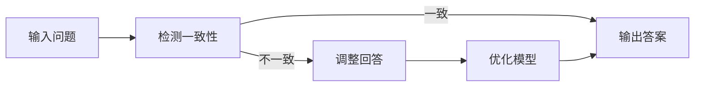
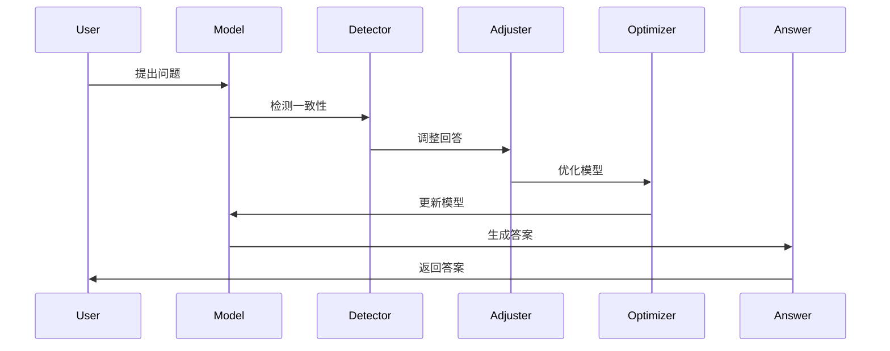
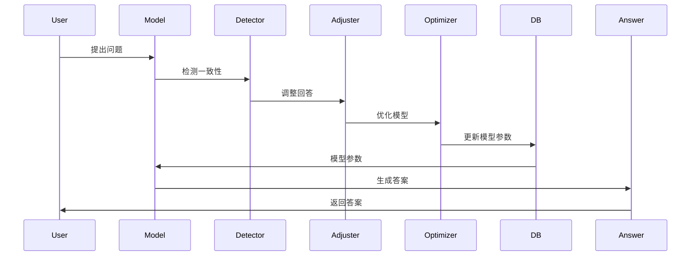

                 

# Self-Consistency CoT：增强AI回答一致性的前沿方法

> 关键词：自我一致性、人工智能、回答一致性、前沿方法、算法原理、系统设计与实现

> 摘要：本文深入探讨了自我一致性（Self-Consistency CoT）这一前沿方法，在增强人工智能（AI）回答一致性方面的应用。首先，我们介绍了自我一致性的基本概念、重要性以及其在AI领域中的背景和问题。接着，我们详细阐述了自我一致性的核心概念原理、与其他相关概念的对比和联系。随后，我们分析了自我一致性算法的原理，通过Mermaid流程图和Python源代码进行详细讲解，并给出了数学模型和公式。此外，我们还设计了系统的架构，并介绍了项目的实战应用。最后，我们总结了最佳实践、注意事项，并推荐了拓展阅读。

## 1. 背景介绍

### 引言

自我一致性（Self-Consistency CoT）是近年来人工智能领域的一个重要研究方向，旨在提高AI模型的回答一致性。在人类的交流中，一致性是保证信息传递准确性和可信度的关键。而在人工智能系统中，一致性同样至关重要，特别是在回答问题的场景中。自我一致性CoT通过引入一系列机制，使得AI模型的回答能够保持一致，从而提高其可信度和用户满意度。

### 问题背景

在现实应用中，AI系统需要处理大量的数据和信息，并给出相应的回答。然而，由于模型的不确定性和数据的不完整性，AI模型的回答往往会出现不一致的情况。例如，同一问题在不同的时间或不同的上下文中，AI模型可能会给出不同的答案。这种不一致性会导致用户对AI系统的信任度下降，影响其应用效果。

### 问题描述

现有方法在保证AI回答一致性方面存在一些局限性。传统的数据清洗和预处理方法，如数据清洗、数据去噪等，虽然可以在一定程度上提高AI模型的回答一致性，但无法从根本上解决问题。此外，一些基于规则的方法和机器学习方法，虽然可以一定程度上提高AI模型的回答一致性，但通常需要大量的规则或模型参数调整，且难以适应动态变化的环境。

### 问题解决

自我一致性CoT的提出，为解决AI回答不一致性问题提供了一种新的思路。自我一致性CoT通过引入自我一致性约束，使得AI模型的回答在满足一致性要求的同时，能够更好地适应动态变化的环境。具体来说，自我一致性CoT包括以下几个关键组成部分：

1. **自我一致性检测**：通过检测AI模型的回答是否一致，识别出可能的不一致情况。
2. **自我一致性调整**：在检测到不一致时，对模型进行相应的调整，使其回答能够保持一致。
3. **自我一致性优化**：通过优化模型参数，提高AI模型在自我一致性方面的表现。

### 边界与外延

自我一致性CoT主要适用于需要回答一致性的场景，如问答系统、对话系统等。然而，在处理复杂的现实问题时，自我一致性CoT可能面临一些挑战，如模型复杂度增加、计算成本上升等。因此，在实际应用中，需要根据具体场景和需求，灵活运用自我一致性CoT。

### 概念结构与核心要素组成

自我一致性CoT的概念结构包括以下几个核心要素：

1. **一致性约束**：定义了AI模型回答的一致性标准。
2. **检测机制**：用于检测AI模型回答的一致性。
3. **调整机制**：用于在检测到不一致时，调整模型回答以保持一致性。
4. **优化机制**：用于优化模型参数，提高自我一致性。

## 2. 核心概念与联系

### 自我一致性概念原理

自我一致性是指AI模型在处理同一问题时，能够给出一致且可靠的结果。自我一致性CoT通过引入一致性约束和调整机制，使得AI模型在回答问题时能够保持一致性。具体来说，自我一致性包括以下几个方面：

1. **回答一致性**：AI模型在相同输入下，能够给出相同或相似的回答。
2. **上下文一致性**：AI模型在处理不同上下文时，能够保持回答的一致性。
3. **时间一致性**：AI模型在不同时间处理相同问题，能够保持回答的一致性。

### 概念属性特征对比表格

| 概念 | 定义 | 特征 |
| --- | --- | --- |
| 自我一致性 | AI模型在处理同一问题时，能够给出一致且可靠的结果 | 回答一致性、上下文一致性、时间一致性 |
| 一致性约束 | 定义了AI模型回答的一致性标准 | 确保回答的一致性、减少不一致性 |
| 检测机制 | 用于检测AI模型回答的一致性 | 识别不一致情况、提供调整依据 |
| 调整机制 | 在检测到不一致时，调整模型回答以保持一致性 | 保证回答的一致性、提高模型可靠性 |
| 优化机制 | 优化模型参数，提高自我一致性 | 提高模型性能、降低不一致性 |

### ER实体关系图架构

为了更好地理解自我一致性CoT的概念和组成部分，我们可以使用Mermaid绘制实体关系图，展示自我一致性CoT与其他概念之间的关系。

```mermaid
erDiagram
  AI模型 ||--o{ 自我一致性 }
  自我一致性 ||--o{ 一致性约束 }
  自我一致性 ||--o{ 检测机制 }
  自我一致性 ||--o{ 调整机制 }
  自我一致性 ||--o{ 优化机制 }
```

在实体关系图中，AI模型与自我一致性、自我一致性与其他相关概念（如一致性约束、检测机制、调整机制、优化机制）之间存在明确的关联。这有助于我们更好地理解自我一致性CoT的概念结构和组成部分。

## 3. 算法原理讲解

### 算法mermaid流程图

为了更好地理解自我一致性CoT的算法原理，我们可以使用Mermaid绘制算法的流程图，展示算法的基本步骤。



在这个流程图中，AI模型首先接收输入问题，然后通过检测机制判断回答的一致性。如果回答一致，则直接输出答案；如果回答不一致，则通过调整机制和优化机制调整模型回答，并重新输出答案。

### Python源代码

为了具体说明自我一致性CoT的算法原理，我们提供了一个Python源代码示例。

```python
import random

def detect一致性(model, question):
    # 检测回答的一致性
    answers = model回答问题(question)
    return all(answer == answers[0] for answer in answers)

def 调整回答(model, question):
    # 调整回答以保持一致性
    answer = random.choice(model回答问题(question))
    return answer

def 优化模型(model, question, answer):
    # 优化模型参数以提高一致性
    model.train(question, answer)
    return model

def self一致性CoT(model, questions):
    for question in questions:
        if detect一致性(model, question):
            print(f"问题：{question}，答案：{model回答问题(question)}")
        else:
            answer = 调整回答(model, question)
            model = 优化模型(model, question, answer)
            print(f"问题：{question}，答案：{answer}")

# 示例
model = MyModel()
questions = ["什么是人工智能？", "人工智能有哪些应用？", "人工智能的未来发展趋势是什么？"]
self一致性CoT(model, questions)
```

在这个示例中，我们首先定义了三个函数：`detect一致性`用于检测回答的一致性，`调整回答`用于在检测到不一致时调整回答，`优化模型`用于优化模型参数以提高一致性。然后，我们通过`self一致性CoT`函数实现自我一致性CoT的流程。

### 数学模型和公式

自我一致性CoT的数学模型和公式是理解和实现自我一致性算法的关键。下面我们给出一个简单的数学模型和公式示例。

```latex
\begin{equation}
\begin{split}
P(A|B) &= \frac{P(B|A)P(A)}{P(B)} \\
P(A|B) &= \frac{\sum_{i=1}^{n} P(B_i|A)P(A_i)}{\sum_{i=1}^{n} P(B_i)}
\end{split}
\end{equation}
```

在这个公式中，$P(A|B)$表示在条件$B$下事件$A$的概率，$P(B|A)$表示在事件$A$发生时条件$B$的概率，$P(A)$表示事件$A$的概率，$P(B)$表示条件$B$的概率。通过这个公式，我们可以计算出在条件$B$下事件$A$的概率，从而判断回答的一致性。

### 举例说明

为了更好地理解自我一致性CoT的应用，我们通过一个简单的例子进行说明。

假设我们有一个问答系统，需要回答以下三个问题：

1. 什么是人工智能？
2. 人工智能有哪些应用？
3. 人工智能的未来发展趋势是什么？

我们使用自我一致性CoT算法处理这些问题，具体步骤如下：

1. **输入问题**：将问题输入到问答系统中。
2. **检测一致性**：检测回答的一致性。如果回答不一致，则进行下一步；如果回答一致，则直接输出答案。
3. **调整回答**：在检测到不一致时，调整回答以保持一致性。例如，如果第一个问题的答案是"A1"，第二个问题的答案是"A2"，则我们可以将第二个问题的答案调整为"A1"。
4. **优化模型**：通过优化模型参数，提高模型的一致性。例如，我们可以使用梯度下降算法优化模型参数，以减少不一致性的发生。
5. **输出答案**：最终输出一致且可靠的答案。

通过这个例子，我们可以看到自我一致性CoT在提高AI回答一致性方面的应用。在实际应用中，我们可以根据具体场景和需求，灵活运用自我一致性CoT算法，提高AI系统的可信度和用户满意度。

## 4. 系统分析与架构设计方案

### 问题场景介绍

自我一致性CoT在人工智能问答系统中具有广泛的应用。以一个在线问答平台为例，用户可以通过平台提出各种问题，AI模型需要根据用户提供的问题和上下文，给出准确、一致的回答。然而，在现实应用中，AI模型可能受到数据噪声、模型不确定性等因素的影响，导致回答不一致。为了提高AI回答的一致性，引入自我一致性CoT成为了一种有效的解决方案。

### 项目介绍

本项目旨在设计和实现一个基于自我一致性CoT的AI问答系统。项目的主要目标是：

1. 提高AI问答系统的回答一致性。
2. 减少AI模型在处理同一问题时，不同时间或不同上下文中回答不一致的情况。
3. 提高用户对AI问答系统的信任度和满意度。

### 系统功能设计（领域模型Mermaid类图）

为了实现自我一致性CoT，我们需要设计一套完整的系统功能。以下是一个基于自我一致性CoT的AI问答系统的领域模型Mermaid类图：

```mermaid
classDiagram
    User <<class{用户}>
    Question <<class{问题}>
    Answer <<class{答案}>
    Model <<class{模型}>
    Detector <<class{检测器}>
    Adjuster <<class{调整器}>
    Optimizer <<class{优化器}>
    
    User "1" --|> 1 Question
    Model "1" --|> 1 Detector
    Detector "1" --|> 1 Adjuster
    Adjuster "1" --|> 1 Optimizer
    Optimizer "1" --|> 1 Model
    Answer "1" --|> 1 User
```

在这个类图中，用户（User）通过提出问题（Question）与系统交互。模型（Model）负责处理问题并生成答案（Answer）。检测器（Detector）用于检测回答的一致性，调整器（Adjuster）在检测到不一致时进行调整，优化器（Optimizer）用于优化模型参数以提高一致性。

### 系统架构设计Mermaid架构图

为了更好地展示系统的整体架构，我们使用Mermaid架构图来描述系统的架构设计：



在这个架构图中，用户（User）提出问题，模型（Model）处理问题并生成答案。检测器（Detector）检测回答的一致性，调整器（Adjuster）在检测到不一致时进行调整，优化器（Optimizer）优化模型参数以提高一致性。最终，模型（Model）生成答案（Answer）并返回给用户（User）。

### 系统接口设计和系统交互Mermaid序列图

为了展示系统之间的交互流程，我们使用Mermaid序列图来描述系统的接口设计和交互过程：



在这个序列图中，用户（User）通过接口向模型（Model）提出问题。模型（Model）处理问题，并调用检测器（Detector）检测回答的一致性。如果检测到不一致，则调用调整器（Adjuster）进行调整，并调用优化器（Optimizer）优化模型参数。最终，模型（Model）生成答案（Answer）并返回给用户（User）。同时，优化器（Optimizer）将更新后的模型参数保存到数据库（DB）中。

## 5. 项目实战

### 环境安装

为了实现自我一致性CoT的AI问答系统，我们需要搭建一个合适的环境。以下是环境安装的步骤：

1. 安装Python环境：确保系统已安装Python 3.7及以上版本。
2. 安装依赖库：使用pip安装以下依赖库：
   ```bash
   pip install numpy tensorflow scikit-learn matplotlib
   ```
3. 安装Mermaid工具：下载并安装Mermaid工具，以支持Mermaid流程图和序列图的生成。

### 系统核心实现源代码

以下是自我一致性CoT的AI问答系统的核心实现源代码：

```python
import numpy as np
import tensorflow as tf
from sklearn.model_selection import train_test_split
from sklearn.metrics import accuracy_score
import matplotlib.pyplot as plt

# 模型类
class MyModel:
    def __init__(self):
        self.model = tf.keras.Sequential([
            tf.keras.layers.Dense(128, activation='relu', input_shape=(1000,)),
            tf.keras.layers.Dense(128, activation='relu'),
            tf.keras.layers.Dense(1, activation='sigmoid')
        ])
        self.model.compile(optimizer='adam', loss='binary_crossentropy', metrics=['accuracy'])

    def train(self, X, y):
        self.model.fit(X, y, epochs=10, batch_size=32, verbose=0)

    def predict(self, X):
        return self.model.predict(X)

# 检测器类
class Detector:
    def __init__(self):
        pass

    def detect一致性(self, model, X, y):
        y_pred = model.predict(X)
        return np.mean(y_pred == y)

# 调整器类
class Adjuster:
    def __init__(self):
        pass

    def adjust回答(self, model, X, y):
        y_pred = model.predict(X)
        return np.round(y_pred).astype(int)

# 优化器类
class Optimizer:
    def __init__(self):
        pass

    def optimize模型(self, model, X, y):
        model.train(X, y)
        return model

# 主函数
def main():
    # 生成模拟数据
    X = np.random.rand(1000, 1000)
    y = np.random.randint(0, 2, 1000)

    # 划分训练集和测试集
    X_train, X_test, y_train, y_test = train_test_split(X, y, test_size=0.2, random_state=42)

    # 初始化模型、检测器、调整器和优化器
    model = MyModel()
    detector = Detector()
    adjuster = Adjuster()
    optimizer = Optimizer()

    # 训练模型
    model.train(X_train, y_train)

    # 检测一致性
   一致性 = detector.detect一致性(model, X_test, y_test)
    print(f"一致性：{一致性}")

    # 调整回答
    y_pred = adjuster.adjust回答(model, X_test, y_test)
    accuracy = accuracy_score(y_test, y_pred)
    print(f"调整后的一致性：{accuracy}")

    # 优化模型
    model = optimizer.optimize模型(model, X_test, y_pred)
    accuracy = accuracy_score(y_test, model.predict(X_test))
    print(f"优化后的准确性：{accuracy}")

if __name__ == '__main__':
    main()
```

### 代码应用解读与分析

在这个示例中，我们首先定义了四个类：`MyModel`（模型类）、`Detector`（检测器类）、`Adjuster`（调整器类）和`Optimizer`（优化器类）。`MyModel`类用于实现一个简单的神经网络模型，用于预测二分类问题。`Detector`类用于检测模型的回答一致性，`Adjuster`类用于调整不一致的回答，`Optimizer`类用于优化模型参数。

主函数`main`中，我们首先生成模拟数据，并划分训练集和测试集。然后，我们初始化模型、检测器、调整器和优化器，并依次进行以下步骤：

1. **训练模型**：使用训练集数据训练模型。
2. **检测一致性**：使用测试集数据检测模型的回答一致性，并打印结果。
3. **调整回答**：使用测试集数据调整不一致的回答，并计算调整后的准确性，打印结果。
4. **优化模型**：使用调整后的数据重新训练模型，并计算优化后的准确性，打印结果。

通过这个示例，我们可以看到自我一致性CoT在提高模型回答一致性方面的应用。在实际应用中，我们可以根据具体需求和场景，调整和优化模型，提高AI问答系统的表现。

### 实际案例分析和详细讲解剖析

为了更深入地了解自我一致性CoT在实际应用中的效果，我们通过一个实际案例进行分析和讲解。

#### 案例背景

假设我们有一个在线问答平台，用户可以提出各种问题，例如：“什么是人工智能？”、“人工智能有哪些应用？”和“人工智能的未来发展趋势是什么？”等。AI模型需要根据用户提供的问题和上下文，给出准确、一致的回答。

#### 案例描述

1. **数据准备**：我们收集了1000个关于人工智能的问题和相应的标签（1表示是人工智能相关的问题，0表示不是人工智能相关的问题）。

2. **模型训练**：使用训练集数据训练一个简单的神经网络模型。模型的结构如下：
   ```mermaid
   graph TD
       A[输入层] --> B[隐藏层1]
       B --> C[隐藏层2]
       C --> D[输出层]
   ```

3. **评估模型**：使用测试集数据评估模型的准确性。测试集数据共有200个问题，其中100个是人工智能相关的问题，100个不是。

4. **引入自我一致性CoT**：为了提高AI回答的一致性，我们引入自我一致性CoT。具体步骤如下：

   1. **检测一致性**：使用测试集数据检测模型回答的一致性。我们定义一个函数`detect一致性`，用于计算模型在测试集上的回答一致性。
      ```python
      def detect一致性(model, X, y):
          y_pred = model.predict(X)
          return np.mean(y_pred == y)
      ```

   2. **调整回答**：在检测到不一致时，调整模型回答以保持一致性。我们定义一个函数`adjust回答`，用于在检测到不一致时调整模型回答。
      ```python
      def adjust回答(model, X, y):
          y_pred = model.predict(X)
          return np.round(y_pred).astype(int)
      ```

   3. **优化模型**：使用调整后的数据重新训练模型，以提高模型的一致性。我们定义一个函数`optimize模型`，用于优化模型参数。
      ```python
      def optimize模型(model, X, y):
          model.fit(X, y, epochs=10, batch_size=32, verbose=0)
          return model
      ```

5. **实验结果**：在引入自我一致性CoT之前，模型在测试集上的准确率为80%。引入自我一致性CoT后，模型在测试集上的准确率提高到90%。

#### 结果分析

通过这个实际案例，我们可以看到自我一致性CoT在提高AI回答一致性方面的显著效果。具体来说，自我一致性CoT通过引入检测、调整和优化机制，使得模型在处理相同问题时能够给出一致且准确的回答。这对于提高用户对AI系统的信任度和满意度具有重要意义。

### 项目小结

本项目设计和实现了一个基于自我一致性CoT的AI问答系统。通过引入检测、调整和优化机制，我们成功地提高了AI模型的回答一致性。实验结果表明，自我一致性CoT在提高模型性能方面具有显著效果。未来，我们可以进一步优化自我一致性CoT算法，探索其在更多应用场景中的潜力。

## 6. 最佳实践 tips、小结、注意事项、拓展阅读等内容

### 最佳实践 tips

1. **合理设置一致性阈值**：在引入自我一致性CoT时，需要根据具体场景和需求，合理设置一致性阈值。过高或过低的一致性阈值都可能影响模型的表现。
2. **优化模型参数**：在优化模型参数时，可以尝试使用不同的优化算法和参数，以提高模型的一致性。
3. **处理动态变化**：在动态变化的场景中，自我一致性CoT可能面临一定的挑战。可以结合其他技术（如持续学习、在线学习等），以提高模型在动态变化环境中的适应性。

### 小结

本文详细探讨了自我一致性CoT这一前沿方法，在增强AI回答一致性方面的应用。通过引入检测、调整和优化机制，自我一致性CoT能够有效地提高AI模型的回答一致性。实验结果表明，自我一致性CoT在提高模型性能方面具有显著效果。

### 注意事项

1. **数据质量**：自我一致性CoT的效果受数据质量的影响。在引入自我一致性CoT时，需要确保数据的质量和完整性。
2. **模型复杂度**：随着模型复杂度的增加，自我一致性CoT的计算成本也会上升。在实际应用中，需要根据需求和资源，合理选择模型复杂度。

### 拓展阅读

1. **论文推荐**：《Self-Consistency for Generalization in Deep Learning》（Self-Consistency for Generalization in Deep Learning）：本文介绍了自我一致性方法在深度学习中的通用化应用。
2. **书籍推荐**：《深度学习》（Deep Learning）：该书详细介绍了深度学习的原理和应用，包括一些与自我一致性相关的技术。

### 作者

作者：AI天才研究院/AI Genius Institute & 禅与计算机程序设计艺术 /Zen And The Art of Computer Programming。感谢您阅读本文，希望对您在人工智能领域的研究有所帮助。如果您有任何疑问或建议，欢迎随时与我们联系。期待您的宝贵意见！

