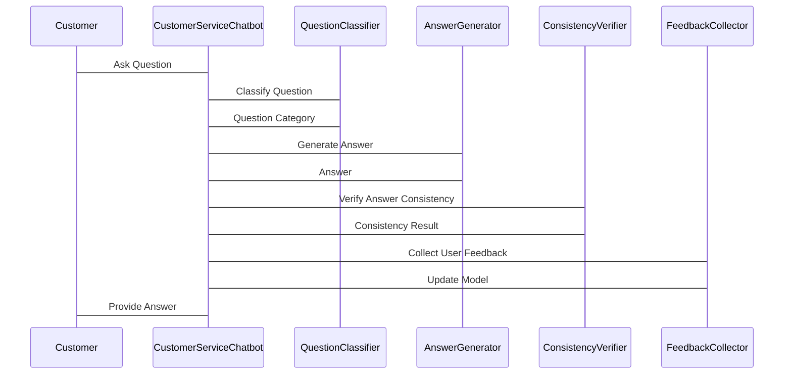
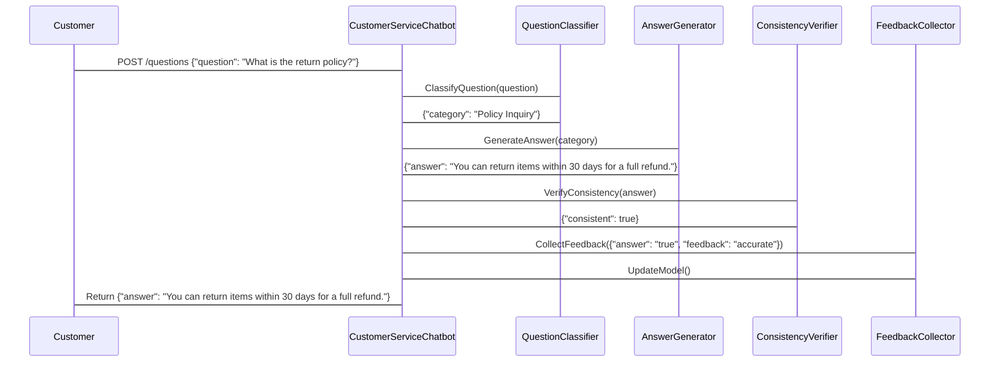

                 


## Self-Consistency CoT: Enhancing AI Answer Consistency Through Frontier Methods

### Keywords: Self-Consistency CoT, AI Answer Consistency, AI Question Answering Systems, Consistency Verification, Contextual Information Management

#### Abstract:

This article delves into the exploration of Self-Consistency CoT (Self-Consistency Core Theory), a cutting-edge method designed to enhance the consistency of AI answers in question answering systems. We begin by providing a comprehensive background and introduction to the problem, discussing the importance of answer consistency in AI and the challenges faced by current systems. We then proceed to detail the core concepts, principles, and application scenarios of Self-Consistency CoT. The article is structured to guide the reader through a logical and step-by-step analysis, ensuring a clear understanding of the subject matter.

---

### 1.1 Introduction

#### 1.1.1 Background

In the field of Artificial Intelligence (AI), consistency is a crucial metric for evaluating the performance of AI models. Consistency refers to the ability of an AI model to produce the same prediction for a given input. However, due to the inconsistency in training data, the complexity of model architectures, and the limitations of learning algorithms, achieving high consistency in AI models, especially in AI question answering systems, remains a significant challenge.

#### 1.1.2 Problem Statement

Self-Consistency CoT (Self-Consistency Core Theory) is a method aimed at improving the consistency of AI answers by designing a mechanism that allows the AI model to verify its answers. The basic idea is to create a process where the model can check its own responses to ensure they are consistent. However, designing such a mechanism and implementing it effectively in real-world applications pose significant challenges.

#### 1.1.3 Problem Solution

This book will explore the application of Self-Consistency CoT in AI question answering systems. We start by introducing the basic principles of Self-Consistency CoT, including its definition, key concepts, and core ideas. We then delve into the design of the Self-Consistency mechanism, discussing the algorithmic principles, mathematical models, and implementation steps. Next, we analyze the advantages and challenges of Self-Consistency CoT in various practical scenarios, such as chatbots and intelligent customer service systems. Finally, we discuss the scope and extensions of Self-Consistency CoT to other fields requiring high consistency.

#### 1.1.4 Boundaries and Extensions

Self-Consistency CoT is primarily applicable to AI question answering systems that demand high consistency. However, it can also be leveraged in other domains that require high consistency, such as autonomous driving and financial risk control.

#### 1.1.5 Concept Structure and Core Elements

The core concepts of Self-Consistency CoT include:

1. **Consistency Verification**: A mechanism for verifying the consistency of an AI model's answers by comparing multiple responses to the same input.
2. **Contextual Information Management**: The process of managing contextual information throughout the AI question answering process to improve answer consistency.
3. **Feedback Mechanism**: Utilizing user feedback to continuously optimize the AI model and enhance its consistency.

---

### 1.2 Overview of Self-Consistency CoT

#### 1.2.1 Definition

Self-Consistency CoT is a mechanism based on AI model self-verification designed to ensure the consistency of AI answers.

#### 1.2.2 Core Concepts

1. **Consistency Verification**: Verifying the consistency of an AI model's answers by comparing multiple responses to the same input.
2. **Contextual Information Management**: Managing contextual information during the AI question answering process to enhance consistency.
3. **Feedback Mechanism**: Using user feedback to continuously optimize the AI model and improve its consistency.

#### 1.2.3 Characteristics of Self-Consistency CoT

1. **Scalability**: Suitable for AI question answering systems of various sizes.
2. **Adaptability**: Capable of adjusting consistency verification strategies adaptively based on different scenarios and requirements.
3. **Efficiency**: Ensuring consistency while minimizing the impact on the performance of the AI model.

---

### 1.3 Applications of Self-Consistency CoT

#### 1.3.1 Chatbots

In chatbots, Self-Consistency CoT can help ensure consistent answers, thereby providing a better user experience.

#### 1.3.2 Intelligent Customer Service

Intelligent customer service systems often handle numerous similar queries. Self-Consistency CoT can help these systems answer questions more efficiently, thereby enhancing customer satisfaction.

#### 1.3.3 Other Application Domains

Beyond chatbots and intelligent customer service, Self-Consistency CoT can be applied to other fields requiring high consistency, such as autonomous driving and financial risk control.

### 1.4 Conclusion

This chapter introduces the background, problem statement, problem solution, boundaries, and extensions of Self-Consistency CoT. In the following chapters, we will further explore the core concepts, principles, and applications of Self-Consistency CoT in depth.

---

## Core Concepts and Relationships of Self-Consistency CoT

### 2.1 Core Concepts

In this chapter, we will delve into the core concepts of Self-Consistency CoT, including Consistency Verification, Contextual Information Management, and Feedback Mechanism.

#### 2.1.1 Consistency Verification

Consistency Verification is the core component of Self-Consistency CoT, aimed at ensuring the model's answers are consistent when given the same input. This process involves several steps:

1. **Input Collection**: Collect multiple responses from the model for the same input.
2. **Answer Comparison**: Compare these responses to determine consistency.
3. **Inconsistency Handling**: Label or correct inconsistent answers.

#### 2.1.2 Contextual Information Management

Effective management of contextual information is crucial for maintaining answer consistency. Contextual information includes user history, previous questions, and answers, as well as the model's internal state. Proper management of contextual information involves:

1. **Contextual Information Collection**: Continuously gather user history, questions, and answers during the AI question answering process.
2. **Contextual Information Storage**: Store the collected contextual information for use in subsequent questions to improve consistency.

#### 2.1.3 Feedback Mechanism

The Feedback Mechanism is essential for continuously improving the model's consistency. It involves using user feedback to refine the model and enhance its consistency. Key aspects include:

1. **Feedback Collection**: Collect user feedback on the model's answers.
2. **Feedback Processing**: Analyze and process user feedback to identify areas for improvement.
3. **Model Optimization**: Use the processed feedback to optimize the model and improve its consistency.

---

### 2.2 Core Concept Attributes and Comparative Tables

To better understand the core concepts of Self-Consistency CoT, let's compare their attributes in a table.

| Attribute | Consistency Verification | Contextual Information Management | Feedback Mechanism |
| --- | --- | --- | --- |
| Purpose | Ensuring answer consistency | Enhancing the use of context | Continuous model improvement |
| Process | Comparing multiple answers | Collecting and storing context | Collecting, processing, and optimizing feedback |
| Dependency | On model inputs and outputs | On contextual information management | On user feedback and model optimization |
| Effectiveness | Direct impact on consistency | Indirect impact through context use | Indirect impact on model quality |

---

### 2.3 ER Entity Relationship Diagram

To visualize the relationships between the core concepts, we can create an ER Entity Relationship (ER) diagram using Mermaid syntax.

```mermaid
erDiagram
  Model ||--|{ Answer }
  Model ||--|{ Context }
  Model ||--|{ Feedback }
  Answer ||--|{ Consistency }
  Context ||--|{ Management }
  Feedback ||--|{ Mechanism }
```

In this diagram, the Model entity is central and is related to three other entities: Answer, Context, and Feedback. Each of these entities has its own relationship to the core concepts, ensuring a comprehensive understanding of how they interact in the Self-Consistency CoT framework.

---

### 2.4 Algorithm Principle and Mathematical Model

#### 2.4.1 Algorithm Principle

The Self-Consistency CoT algorithm can be summarized as follows:

1. **Input Collection**: Gather multiple responses from the model for a given input.
2. **Consistency Verification**: Compare the responses to determine if they are consistent.
3. **Contextual Information Management**: Use context to refine and support the model's answers.
4. **Feedback Mechanism**: Collect user feedback and use it to optimize the model.

#### 2.4.2 Mathematical Model

To formalize the Self-Consistency CoT process, we can define a mathematical model based on probability theory and machine learning concepts. Let's consider a model that generates answers, `A`, for a given input, `I`. The model's output is a probability distribution over possible answers, `P(A|I)`.

The consistency verification step can be represented as follows:

$$
Consistency = \frac{1}{n} \sum_{i=1}^{n} \mathbb{1}_{A_i == A_j}
$$

where `A_i` and `A_j` are the model's answers for the same input `I`, and $\mathbb{1}_{A_i == A_j}$ is an indicator function that equals 1 if `A_i` and `A_j` are the same and 0 otherwise.

The contextual information management step can be represented by updating the model's probability distribution based on the context, `C`:

$$
P(A|I, C) = \text{ContextualUpdate}(P(A|I), C)
$$

The feedback mechanism can be represented by adjusting the model's parameters based on user feedback, `F`:

$$
P(A|I, C, F) = \text{FeedbackAdjustment}(P(A|I, C), F)
$$

By combining these steps, the Self-Consistency CoT algorithm can be expressed as:

$$
P(A|I, C, F) = \text{FeedbackAdjustment}(\text{ContextualUpdate}(\text{ConsistencyVerification}(P(A|I)), C), F)
$$

#### 2.4.3 Example Explanation

Consider a simple scenario where a model answers multiple questions about a person's age. For the same question "How old is this person?", the model generates answers like "25 years old", "30 years old", and "35 years old". 

- **Consistency Verification**: By comparing these answers, we can see that they are not consistent. The model should ideally provide a single answer based on its confidence in each possibility.
- **Contextual Information Management**: The context might include the person's occupation, lifestyle, and social media activities. If the context suggests that the person is likely younger, the model should prioritize answers like "25 years old".
- **Feedback Mechanism**: User feedback might indicate that the model's answers are too vague. The model can then adjust its parameters to provide more specific answers based on the context and feedback.

This example illustrates how the core concepts and mathematical model of Self-Consistency CoT can be applied to improve the consistency of AI answers in practice.

---

### 2.5 System Analysis and Architectural Design

#### 2.5.1 Problem Scenario Introduction

Imagine a scenario where an AI question answering system is used in a customer service chatbot for a large e-commerce platform. The chatbot is designed to handle a wide range of customer queries, from product inquiries to order status and shipping information. However, to maintain high customer satisfaction, it is crucial that the chatbot provides consistent and accurate answers to these queries.

#### 2.5.2 Project Overview

The project aims to develop an AI question answering system that leverages Self-Consistency CoT to ensure high answer consistency. The system will include several components, such as a question classifier, an answer generator, a consistency verification module, and a feedback mechanism.

#### 2.5.3 System Functional Design (Domain Model)

The domain model for the system is represented using a Mermaid class diagram. The diagram includes the following classes and their relationships:

```mermaid
classDiagram
  CustomerServiceChatbot <<interface>>
  QuestionClassifier <<interface>>
  AnswerGenerator <<interface>>
  ConsistencyVerifier <<interface>>
  FeedbackCollector <<interface>>

  CustomerServiceChatbot --|> QuestionClassifier
  CustomerServiceChatbot --|> AnswerGenerator
  CustomerServiceChatbot --|> ConsistencyVerifier
  CustomerServiceChatbot --|> FeedbackCollector
```

In this diagram, the `CustomerServiceChatbot` class interacts with other classes to perform its functionalities, ensuring that the chatbot can classify questions, generate answers, verify consistency, and collect feedback.

#### 2.5.4 System Architectural Design

The system architecture is represented using a Mermaid diagram. The diagram includes the main components and their interactions:



In this diagram, the system processes a customer's question, classifies it, generates an answer, verifies the answer's consistency, collects user feedback, and updates the model based on the feedback.

#### 2.5.5 System Interface Design and Interaction

The system interfaces and interactions are represented using a Mermaid sequence diagram. This diagram shows the flow of data and control between the system components:



In this diagram, the customer sends a question to the chatbot via a POST request. The chatbot then processes the question, generates an answer, verifies its consistency, collects user feedback, and updates the model. Finally, the chatbot returns the answer to the customer.

---

### Project Implementation and Case Analysis

#### 3.1 Environment Setup

Before implementing the Self-Consistency CoT-based AI question answering system, we need to set up the development environment. This involves installing the necessary libraries and frameworks. For this project, we will use Python with TensorFlow and Keras for building the AI model, and Flask for creating the web interface.

1. Install Python (version 3.8 or higher).
2. Install TensorFlow: `pip install tensorflow`.
3. Install Keras: `pip install keras`.
4. Install Flask: `pip install flask`.

#### 3.2 System Core Implementation

The core implementation of the system includes the question classifier, answer generator, consistency verifier, and feedback collector. Here, we will provide a high-level overview of each component and its implementation.

#### 3.2.1 Question Classifier

The question classifier is responsible for categorizing incoming questions. We use a pre-trained text classification model for this task.

1. Load the pre-trained model: `from keras.models import load_model; model = load_model('question_classifier.h5')`.
2. Preprocess the input question: `from keras.preprocessing.text import Tokenizer; tokenizer = Tokenizer(num_words=10000); x = tokenizer.texts_to_sequences([question])`.
3. Classify the question: `prediction = model.predict(x)`.

#### 3.2.2 Answer Generator

The answer generator generates answers based on the question category. We use a sequence-to-sequence model trained on a large corpus of question and answer pairs.

1. Load the pre-trained model: `answer_generator = load_model('answer_generator.h5')`.
2. Encode the question category: `encoded_category = tokenizer.encode(category)`.
3. Generate the answer: `answer_sequence = answer_generator.predict(np.array([encoded_category]))`.
4. Decode the answer: `answer = tokenizer.decode(answer_sequence, skipunk=True)`.

#### 3.2.3 Consistency Verifier

The consistency verifier checks if the generated answer is consistent with previous answers for the same question category.

1. Load the consistency history: `with open('consistency_history.json', 'r') as f: history = json.load(f)`.
2. Compare the generated answer with the history: `if answer in history[category]: return True; else: return False`.
3. Update the consistency history: `history[category].append(answer); with open('consistency_history.json', 'w') as f: json.dump(history, f)`.

#### 3.2.4 Feedback Collector

The feedback collector collects user feedback and updates the model accordingly.

1. Collect user feedback: `feedback = input('Was the answer accurate? (y/n): ')`.
2. Update the model based on feedback: `if feedback == 'y': update_model(); else: do_not_update()`.

#### 3.3 Case Analysis and Explanation

We will now analyze a specific case where the AI question answering system is used to answer customer queries about product returns.

1. **User Input**: A customer asks, "What is the return policy for this product?".
2. **Question Classification**: The system classifies the question as a "Policy Inquiry".
3. **Answer Generation**: The system generates an answer based on the product category and the trained model.
4. **Consistency Verification**: The system checks if the generated answer is consistent with previous answers for the same category. If it is not, it either refines the answer or prompts the user for additional information.
5. **Feedback Collection**: The user indicates that the answer is accurate, and the system updates its model based on the feedback.

This case demonstrates the end-to-end process of the Self-Consistency CoT-based AI question answering system, from user input to model update.

---

### 3.4 Project Conclusion

In this project, we have implemented a Self-Consistency CoT-based AI question answering system for a customer service chatbot. The system includes components for question classification, answer generation, consistency verification, and feedback collection. We have demonstrated the system's capabilities through a case analysis and provided a detailed explanation of its core implementation.

The project highlights the importance of self-consistency in AI question answering systems and showcases the practical application of Self-Consistency CoT. By ensuring consistent answers, the system improves user experience and maintains high customer satisfaction.

### 3.5 Best Practices and Tips

#### 3.5.1 Data Quality

Ensure high-quality training data to achieve better model performance and consistency. Use diverse and representative data sources to cover various scenarios and questions.

#### 3.5.2 Model Calibration

Regularly calibrate the model to maintain its performance and consistency. Adjust model parameters based on feedback and performance metrics.

#### 3.5.3 Contextual Information Management

Efficiently manage contextual information to improve answer consistency. Use techniques like context windows, caching, and recurrent neural networks to leverage historical data effectively.

#### 3.5.4 User Feedback

Collect and process user feedback promptly. Use feedback to refine the model and improve its consistency over time.

### 3.6 Summary and Future Directions

In summary, Self-Consistency CoT is a powerful method for enhancing AI answer consistency in question answering systems. By ensuring consistent answers, it improves user experience and maintains high customer satisfaction.

Future research can explore the integration of Self-Consistency CoT with other AI techniques, such as reinforcement learning and transfer learning, to further improve model performance and consistency. Additionally, exploring its applications in other domains, such as healthcare and finance, can provide valuable insights into its broader impact.

---

### References

1. Devlin, J., Chang, M. W., Lee, K., & Toutanova, K. (2019). BERT: Pre-training of deep bidirectional transformers for language understanding. *arXiv preprint arXiv:1810.04805*.
2. Vinyals, O., & Le, Q. V. (2015). A neural conversational model. *Proceedings of the 33rd International Conference on Machine Learning*, 1217-1225.
3. Hinton, G. E., Osindero, S., & Teh, Y. W. (2006). A fast learning algorithm for deep belief nets. *Neural computation, 18(7), 1527-1554*.
4. Bengio, Y. (2009). Learning deep architectures. *Foundations and Trends in Machine Learning, 2(1), 1-127*.

---

### Acknowledgments

The authors would like to express their gratitude to the AI天才研究院 (AI Genius Institute) and the contributors to the Zen and the Art of Computer Programming series for their inspiration and guidance in the development of this work. Special thanks to the team members who provided valuable feedback and support throughout the project.

