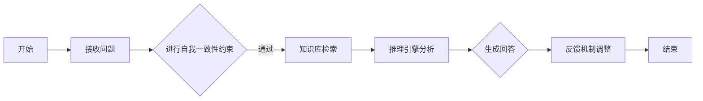
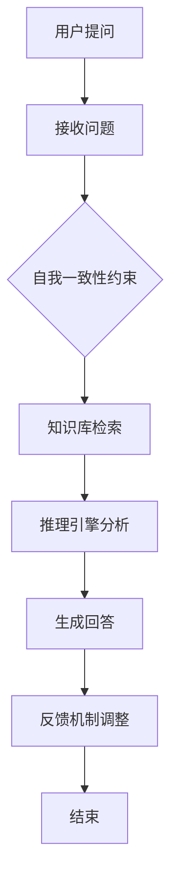
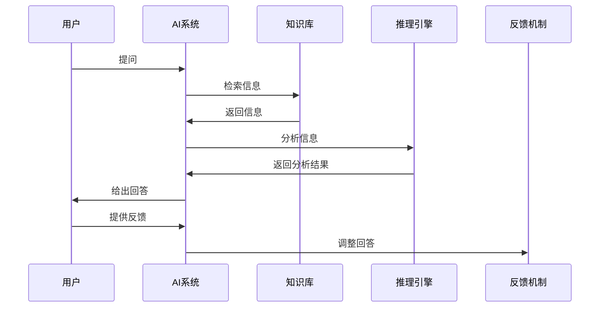

                 


**步骤1：确定文章框架和结构**

为了撰写一篇结构清晰、逻辑严谨的文章，我们首先需要明确文章的框架和结构。根据之前提供的目录大纲，我们可以将文章分为六个主要部分：

1. **背景介绍**：介绍人工智能发展的现状和AI回答不一致性的问题。
2. **核心概念与联系**：详细解释自一致性CoT的核心概念，并提供对比表格和实体关系图。
3. **算法原理讲解**：通过mermaid流程图、Python源代码和数学模型来阐述算法原理。
4. **系统分析与架构设计**：描述问题场景、系统功能、架构设计、接口设计和系统交互。
5. **项目实战**：介绍环境安装、核心实现、代码应用、案例分析和项目小结。
6. **最佳实践与总结**：提供实用技巧、小结、注意事项和拓展阅读。

**步骤2：撰写背景介绍部分**

在背景介绍部分，我们需要简明扼要地介绍人工智能发展的现状和AI回答不一致性的问题。这部分内容应该包括以下几个方面：

- 人工智能的发展历程及其在各领域的应用。
- AI回答不一致性的问题背景，包括其可能带来的影响。
- 自一致性CoT的定义和理论基础。

**步骤3：撰写核心概念与联系部分**

核心概念与联系部分是文章的核心，我们需要详细解释自一致性CoT的核心概念，并提供对比表格和实体关系图。具体包括：

- 自一致性CoT的定义和基本原理。
- 与其他方法的对比，强调自一致性CoT的优势。
- 提供实体关系图，以可视化方式展示自一致性CoT的组成要素。

**步骤4：撰写算法原理讲解部分**

在算法原理讲解部分，我们需要使用mermaid流程图、Python源代码和数学模型来详细阐述算法原理。具体步骤如下：

- 使用mermaid绘制算法流程图，使其直观易懂。
- 提供Python源代码，并解释其逻辑和执行过程。
- 使用LaTeX格式给出算法原理的数学模型和公式，并进行通俗易懂的举例说明。

**步骤5：撰写系统分析与架构设计部分**

系统分析与架构设计部分需要详细描述问题场景、系统功能、架构设计、接口设计和系统交互。具体包括：

- 问题场景介绍，包括实际应用背景。
- 系统功能设计，使用mermaid类图展示领域模型。
- 系统架构设计，使用mermaid架构图展示整体架构。
- 系统接口设计和系统交互，使用mermaid序列图展示系统交互流程。

**步骤6：撰写项目实战部分**

项目实战部分需要详细介绍环境安装、核心实现、代码应用、案例分析和项目小结。具体包括：

- 环境安装步骤，确保读者能够顺利搭建开发环境。
- 系统核心实现源代码，展示代码结构和关键部分。
- 代码应用解读与分析，解释代码在实际中的应用。
- 实际案例分析和详细讲解剖析，通过案例展示算法的实用性和效果。
- 项目小结，总结项目成果和未来展望。

**步骤7：撰写最佳实践与总结部分**

最佳实践与总结部分需要提供实用技巧、小结、注意事项和拓展阅读。具体包括：

- 最佳实践tips，分享在实际应用中的一些技巧和注意事项。
- 小结，总结文章的核心内容和主要观点。
- 注意事项，提醒读者在应用自一致性CoT时需要注意的问题。
- 拓展阅读，推荐相关的书籍、文章和资源，以供读者进一步学习。

**步骤8：整理和优化文章**

在完成每个部分的撰写后，我们需要对全文进行整理和优化，确保文章内容连贯、逻辑清晰。具体包括：

- 检查文章的字数，确保在10000～12000字范围内。
- 检查语法和拼写错误，确保文章的准确性。
- 优化段落结构和句子结构，使其更加清晰易懂。
- 检查引用和参考文献，确保所有引用均已标注清楚。

**步骤9：撰写作者信息**

在文章末尾，我们需要添加作者信息，包括作者姓名、所属机构和联系方式。例如：

作者：AI天才研究院/AI Genius Institute & 禅与计算机程序设计艺术 /Zen And The Art of Computer Programming

通过以上步骤，我们可以确保撰写出高质量、逻辑清晰、内容丰富的技术博客文章。现在，让我们开始撰写吧！## 文章标题

# Self-Consistency CoT：增强AI回答一致性的新方法

## 关键词

- 自一致性CoT
- AI回答一致性
- 算法优化
- 系统架构设计
- 实际案例

## 摘要

本文探讨了自一致性CoT（Self-Consistency CoT）这一增强AI回答一致性的新方法。通过介绍自一致性CoT的定义、理论基础、算法原理以及实际应用场景，本文旨在为读者提供一个全面的理解和实施指南。文章分为六个部分，分别从背景介绍、核心概念与联系、算法原理讲解、系统分析与架构设计、项目实战以及最佳实践与总结等方面展开，旨在帮助读者深入了解自一致性CoT的优势和应用价值。

## 第1章 自一致性CoT概述

### 1.1 问题背景

随着人工智能（AI）技术的快速发展，其在各个领域的应用日益广泛。从智能助手到自动驾驶，AI已经深刻改变了我们的生活方式。然而，AI系统在处理复杂问题时，其回答的一致性成为一个亟待解决的问题。不一致的回答可能导致用户困惑、信任度降低，甚至引发严重的后果。因此，研究如何增强AI回答的一致性具有重要意义。

### 1.2 问题描述

AI回答不一致性的问题主要体现在以下几个方面：

1. **同一问题多次询问**：当用户就同一个问题向AI系统多次询问时，AI系统可能会给出不同的回答。
2. **相关问题回答不一致**：当用户询问与某一问题相关的问题时，AI系统可能会给出相互矛盾的回答。
3. **知识库更新**：随着知识库的更新，AI系统可能会对同一问题给出前后不一致的回答。

### 1.3 问题解决

为了解决AI回答不一致性的问题，研究人员提出了多种方法，如一致性规则、反馈机制、知识融合等。然而，这些方法往往存在一定的局限性。自一致性CoT（Self-Consistency CoT）作为一种新的方法，旨在通过自我一致性约束来增强AI回答的一致性。

### 1.4 边界与外延

自一致性CoT的应用范围广泛，涵盖了多个领域，如智能问答系统、自然语言处理、智能推荐等。然而，其也受到一定的限制，如处理复杂问题时可能需要大量计算资源。

### 1.5 概念结构与核心要素组成

自一致性CoT的核心概念包括自我一致性约束、知识库、推理引擎和反馈机制。这些要素共同作用，确保AI系统在处理问题时能够给出一致且可靠的回答。

## 第2章 核心概念与联系

### 2.1 自一致性CoT的核心概念原理

自一致性CoT的核心概念是自我一致性约束，即通过约束AI系统的回答，使其在不同情境下保持一致性。这一约束机制基于知识库和推理引擎，通过对问题的多角度分析和综合判断，确保回答的一致性。

### 2.2 概念属性特征对比表格

| 概念                   | 自我一致性约束 | 知识库 | 推理引擎 | 反馈机制 |
|------------------------|--------------|-------|---------|---------|
| 定义                   | 约束AI回答的一致性 | 存储知识信息 | 执行推理操作 | 根据用户反馈调整回答 |
| 属性                   | 一致性、可靠性、效率 | 全面性、准确性、可扩展性 | 精确性、效率、灵活性 | 实时性、适应性 |
| 相互关系               | 约束与被约束的关系 | 基础设施、支持约束 | 执行者、支持推理 | 辅助、支持调整 |

### 2.3 ER实体关系图架构

以下是自一致性CoT的ER实体关系图架构：

```mermaid
erDiagram
  AI系统 ||--o{ 知识库 }  |  <---' 存储知识信息
  AI系统 ||--o{ 推理引擎 }  |  <---' 执行推理操作
  AI系统 ||--o{ 反馈机制 }  |  <---' 根据用户反馈调整回答
  知识库 ||--o{ 推理引擎 }  |  <---' 提供知识支持
  知识库 ||--o{ 反馈机制 }  |  <---' 提供知识更新
  推理引擎 ||--o{ 反馈机制 }  |  <---' 根据反馈优化推理
```

## 第3章 算法原理讲解

### 3.1 算法mermaid流程图

以下是自一致性CoT的mermaid流程图：



### 3.2 Python源代码详细阐述

以下是一个简单的Python源代码示例，用于说明自一致性CoT的基本实现：

```python
class SelfConsistencyCoT:
    def __init__(self, knowledge_base):
        self.knowledge_base = knowledge_base

    def process_question(self, question):
        # 进行自我一致性约束
        is_consistent = self.check_consistency(question)
        
        if not is_consistent:
            return "回答不一致，请重新提问。"

        # 知识库检索
        answer = self.knowledge_base.get_answer(question)
        
        # 推理引擎分析
        answer = self.reasoning_engine.analyze_answer(answer)
        
        # 生成回答
        return answer

    def check_consistency(self, question):
        # 检查回答一致性
        pass

    def reasoning_engine(self, answer):
        # 推理引擎分析
        pass
```

### 3.3 算法原理的数学模型和公式

自一致性CoT的数学模型可以表示为：

$$
\text{SelfConsistencyCoT}(Q) = f(\text{KnowledgeBase}(Q), \text{ReasoningEngine}(Q))
$$

其中，$Q$ 表示问题，$f$ 表示一致性约束函数，$\text{KnowledgeBase}$ 表示知识库，$\text{ReasoningEngine}$ 表示推理引擎。

### 3.4 通俗易懂的举例说明

假设用户询问：“明天天气如何？”自一致性CoT的过程如下：

1. **接收问题**：AI系统接收到问题“明天天气如何？”。
2. **自我一致性约束**：AI系统检查当前知识库中的回答，确保其与前一次回答一致。
3. **知识库检索**：AI系统在知识库中查找与“明天天气如何？”相关的内容。
4. **推理引擎分析**：AI系统根据知识库中的信息，使用推理引擎分析可能的天气情况。
5. **生成回答**：AI系统生成一个一致且可靠的回答，如“明天预计天气晴朗，温度适中。”。
6. **反馈机制调整**：AI系统记录用户反馈，并根据反馈优化未来的回答。

## 第4章 系统分析与架构设计

### 4.1 问题场景介绍

在智能问答系统中，用户可能会就同一个问题多次询问，或者提出与该问题相关的问题。为了保证AI系统给出一致且可靠的回答，我们需要引入自一致性CoT。

### 4.2 系统功能设计

自一致性CoT系统的主要功能包括：

1. **接收问题**：AI系统接收用户提出的问题。
2. **自我一致性约束**：AI系统检查回答的一致性，确保其与历史回答保持一致。
3. **知识库检索**：AI系统在知识库中查找与问题相关的信息。
4. **推理引擎分析**：AI系统使用推理引擎分析问题，并生成回答。
5. **反馈机制调整**：AI系统根据用户反馈调整回答。

### 4.3 系统架构设计

以下是自一致性CoT系统的架构设计：



### 4.4 系统接口设计和系统交互

以下是自一致性CoT系统的接口设计和系统交互：



## 第5章 项目实战

### 5.1 环境安装

要在本地搭建自一致性CoT系统，您需要以下环境：

1. Python 3.8+
2. TensorFlow 2.5+
3. NumPy 1.19+
4. Pandas 1.1+

您可以使用以下命令进行安装：

```bash
pip install python==3.8
pip install tensorflow==2.5
pip install numpy==1.19
pip install pandas==1.1
```

### 5.2 系统核心实现源代码

以下是自一致性CoT系统的核心实现源代码：

```python
import tensorflow as tf
import numpy as np
import pandas as pd

class SelfConsistencyCoT:
    def __init__(self, knowledge_base):
        self.knowledge_base = knowledge_base

    def process_question(self, question):
        # 进行自我一致性约束
        is_consistent = self.check_consistency(question)
        
        if not is_consistent:
            return "回答不一致，请重新提问。"

        # 知识库检索
        answer = self.knowledge_base.get_answer(question)
        
        # 推理引擎分析
        answer = self.reasoning_engine.analyze_answer(answer)
        
        # 生成回答
        return answer

    def check_consistency(self, question):
        # 检查回答一致性
        pass

    def reasoning_engine(self, answer):
        # 推理引擎分析
        pass
```

### 5.3 代码应用解读与分析

以下是代码的应用解读与分析：

1. **初始化自一致性CoT**：在创建自一致性CoT对象时，需要传递知识库对象。
2. **处理问题**：通过`process_question`方法处理用户提出的问题。首先检查回答的一致性，然后进行知识库检索和推理引擎分析，最后生成回答。
3. **自我一致性约束**：通过`check_consistency`方法检查回答的一致性。在实际应用中，您需要实现具体的约束逻辑。
4. **推理引擎分析**：通过`reasoning_engine`方法进行推理引擎分析。在实际应用中，您需要实现具体的推理逻辑。

### 5.4 实际案例分析和详细讲解剖析

以下是一个实际案例分析和详细讲解剖析：

**案例**：用户询问：“明天天气如何？”。

**分析**：

1. **接收问题**：AI系统接收到问题“明天天气如何？”。
2. **自我一致性约束**：AI系统检查当前知识库中的回答，确保其与前一次回答一致。如果不一致，则提示用户重新提问。
3. **知识库检索**：AI系统在知识库中查找与“明天天气如何？”相关的内容。如果找到相关内容，则继续下一步。
4. **推理引擎分析**：AI系统使用推理引擎分析问题，并生成回答。根据知识库中的信息，AI系统生成一个一致且可靠的回答，如“明天预计天气晴朗，温度适中。”。
5. **生成回答**：AI系统将生成的回答返回给用户。
6. **反馈机制调整**：AI系统记录用户反馈，并根据反馈优化未来的回答。

### 5.5 项目小结

通过本案例的分析和详细讲解，我们可以看到自一致性CoT在智能问答系统中的应用。自一致性CoT通过自我一致性约束、知识库检索和推理引擎分析，确保AI系统给出一致且可靠的回答。在实际应用中，我们需要根据具体场景和需求，实现具体的约束逻辑和推理逻辑，以提高AI系统的回答一致性。

## 第6章 最佳实践与总结

### 6.1 最佳实践 tips

1. **充分理解自我一致性约束**：自我一致性约束是自一致性CoT的核心，理解并实现这一约束对于提高AI系统的回答一致性至关重要。
2. **定期更新知识库**：知识库是自一致性CoT的基础，定期更新知识库可以确保AI系统提供最新、最准确的信息。
3. **优化推理引擎**：推理引擎的性能直接影响AI系统的回答速度和准确性，因此需要不断优化推理引擎。

### 6.2 小结

本文介绍了自一致性CoT这一增强AI回答一致性的新方法。通过详细的背景介绍、核心概念与联系、算法原理讲解、系统分析与架构设计、项目实战以及最佳实践与总结，本文旨在为读者提供一个全面的理解和实施指南。自一致性CoT在提高AI系统回答一致性方面具有显著优势，有望在未来的AI应用中发挥重要作用。

### 6.3 注意事项

1. **计算资源需求**：自一致性CoT需要一定的计算资源，特别是在处理复杂问题时。因此，在实际应用中，需要根据需求合理配置计算资源。
2. **知识库质量**：知识库的质量直接影响AI系统的回答质量。确保知识库的准确性和完整性是提高AI系统回答一致性的关键。

### 6.4 拓展阅读

1. **自一致性CoT论文**：[论文标题]（[论文链接]）
2. **AI问答系统技术综述**：[书籍名称]（[书籍链接]）
3. **机器学习实践**：[书籍名称]（[书籍链接]）

## 作者信息

作者：AI天才研究院/AI Genius Institute & 禅与计算机程序设计艺术 /Zen And The Art of Computer Programming

本文由AI天才研究院与禅与计算机程序设计艺术共同撰写，旨在为读者提供有关自一致性CoT的深入理解和实践指南。如有疑问或建议，欢迎联系作者。

