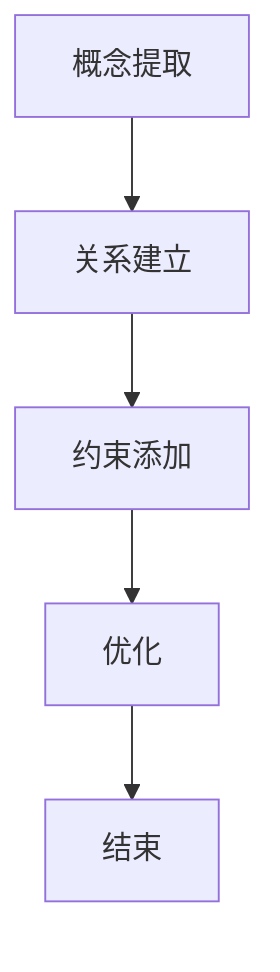
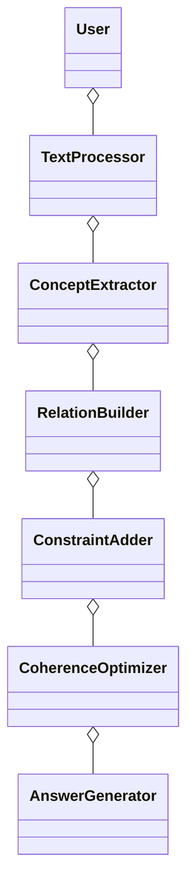
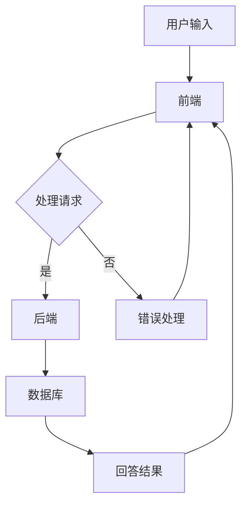
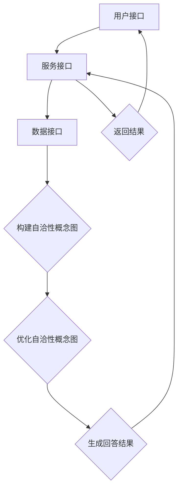
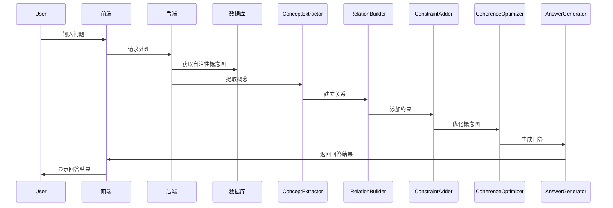

                 

### 自洽性概念图（CoT）增强AI回答的稳定性

**关键词：自洽性概念图、AI回答稳定性、自然语言处理、算法优化、架构设计**

> 摘要：本文旨在探讨如何通过自洽性概念图（CoT）来增强人工智能（AI）回答的稳定性。在自然语言处理（NLP）领域中，AI模型的回答常常因为缺乏一致性而显得不稳定。为了解决这一问题，本文提出了自洽性概念图这一概念，并详细分析了其在提升AI回答稳定性方面的作用和优势。通过一系列的理论分析和实际案例研究，本文总结了构建和优化自洽性概念图的方法，以及其在提高AI回答稳定性方面的应用效果。

### **目录大纲设计**

**第一部分：背景介绍**

1. **问题背景**
2. **问题描述**
3. **边界与外延**
4. **概念结构与核心要素组成**

**第二部分：核心概念与联系**

1. **自洽性概念图原理**
2. **AI回答稳定性原理**
3. **概念属性特征对比**
4. **ER实体关系图架构**

**第三部分：算法原理讲解**

1. **算法流程图**
2. **Python源代码实现**
3. **数学模型和公式**
4. **举例说明**

**第四部分：系统分析与架构设计方案**

1. **问题场景介绍**
2. **系统功能设计**
3. **系统架构设计**
4. **系统接口设计**
5. **系统交互序列图**

**第五部分：项目实战**

1. **环境安装**
2. **系统核心实现**
3. **实际案例分析**
4. **详细讲解与剖析**
5. **项目小结**

**第六部分：最佳实践**

1. **最佳实践 tips**
2. **小结**
3. **注意事项**
4. **拓展阅读**

### **背景介绍**

#### **1.1 问题背景**

在人工智能（AI）迅速发展的今天，自然语言处理（NLP）作为AI的重要应用领域，已经成为众多研究和应用的焦点。然而，尽管AI在NLP领域取得了显著的进展，但一个不容忽视的问题是，AI模型在回答问题时常常表现出不稳定的行为，导致不一致或错误的回答。这种现象不仅影响了用户体验，还限制了AI在实际应用中的广泛推广。

#### **1.2 问题描述**

在NLP中，AI回答的不稳定性主要体现在以下几个方面：

1. **语义理解不一致**：同一个问题在不同的上下文中，AI模型的回答可能存在差异，导致语义理解的不一致。
2. **事实错误**：AI模型在处理特定问题时，可能会因为对事实的误解或缺乏准确的信息而导致错误回答。
3. **答案不相关**：有时AI模型提供的答案与用户的问题毫不相关，这表明模型在理解问题和生成答案时存在偏差。

#### **1.3 解决方案需求**

为了解决AI回答中的问题，我们需要设计一种方法来提高AI回答的稳定性，确保一致性和准确性。自洽性概念图（CoT）作为一种新兴的概念，被提出并应用于这一领域。通过构建和优化自洽性概念图，我们可以为AI模型提供一致的语义理解，从而提高回答的稳定性。

#### **1.4 概念结构与核心要素组成**

自洽性概念图（CoT）是一种用于描述语义信息的图结构，它包含以下核心要素：

1. **概念**：指在特定领域中具有独立意义的信息单元。
2. **关系**：指概念之间的关联和相互作用。
3. **约束**：指对概念和关系的限制条件，用于确保语义的一致性。

通过构建和优化自洽性概念图，我们可以为AI模型提供一致的语义信息，从而提高回答的稳定性。以下是一个简单的自洽性概念图示例，展示了概念、关系和约束的基本结构。

```
概念A
|
--关系1
|   |
|   --关系2
|   
|   --约束1
|   
|   --约束2
|
--概念B
    |
    --关系3
    |
    --约束3
```

#### **1.5 边界与外延**

自洽性概念图（CoT）的应用范围广泛，主要包括以下几个方面：

1. **问答系统**：通过自洽性概念图，可以为问答系统提供一致的语义理解，提高回答的稳定性。
2. **文本分析**：自洽性概念图可以用于文本分析，帮助理解文本的语义信息，提高文本处理的准确性。
3. **知识图谱**：自洽性概念图可以作为知识图谱的一部分，用于描述和关联知识信息。

#### **1.6 AI回答稳定性**

AI回答稳定性是指AI模型在回答问题时的一致性和准确性。为了衡量AI回答的稳定性，我们可以从以下几个方面进行评估：

1. **一致性**：同一问题在不同上下文中，AI模型回答的一致性程度。
2. **准确性**：AI模型回答的正确性和准确性。
3. **相关性**：AI模型回答与用户问题的相关性。

提高AI回答稳定性对于AI的应用具有重要意义，不仅可以提升用户体验，还可以为AI在各个领域的广泛应用提供支持。

### **核心概念与联系**

#### **2.1 自洽性概念图原理**

自洽性概念图（CoT）是一种用于描述语义信息的图结构，它通过概念、关系和约束来组织语义信息，从而实现一致性的语义理解。自洽性概念图的构建过程主要包括以下几个步骤：

1. **概念提取**：从文本中提取关键概念，形成概念集合。
2. **关系建立**：根据概念之间的语义关系，建立概念之间的连接。
3. **约束添加**：为概念和关系添加约束条件，确保语义的一致性。

自洽性概念图的优势在于其能够提供一致的语义理解，从而提高AI回答的稳定性。以下是一个简单的自洽性概念图示例，展示了概念、关系和约束的基本结构。

```
概念A
|
--关系1
|   |
|   --关系2
|   
|   --约束1
|   
|   --约束2
|
--概念B
    |
    --关系3
    |
    --约束3
```

#### **2.2 AI回答稳定性原理**

AI回答稳定性是指AI模型在回答问题时的一致性和准确性。为了衡量AI回答的稳定性，我们可以从以下几个方面进行评估：

1. **一致性**：同一问题在不同上下文中，AI模型回答的一致性程度。
2. **准确性**：AI模型回答的正确性和准确性。
3. **相关性**：AI模型回答与用户问题的相关性。

AI回答稳定性受到多种因素的影响，包括模型的训练数据、算法的设计和优化等。通过改进这些因素，我们可以提高AI回答的稳定性。

#### **2.3 概念属性特征对比**

为了更好地理解自洽性概念图（CoT）在提高AI回答稳定性方面的作用，我们可以将自洽性概念图与传统的语义分析工具进行对比。以下是一个概念属性特征的对比表格：

| 特征               | 传统语义分析工具 | 自洽性概念图（CoT） |
|--------------------|------------------|---------------------|
| **概念表示**       | 单一词汇或短语   | 网络结构的概念集合 |
| **关系表示**       | 简单的关联关系   | 网络结构的关系集合 |
| **约束表示**       | 无约束或简单的约束 | 强约束条件         |
| **一致性**         | 依赖于上下文     | 提供一致的语义理解 |
| **准确性**         | 依赖于算法优化   | 提高语义理解的准确性 |
| **应用范围**       | 限于特定任务     | 广泛应用于多种任务 |

#### **2.4 ER实体关系图架构**

实体关系图（ER图）是数据库设计中常用的概念图，用于描述实体及其之间的关系。自洽性概念图（CoT）与ER图在结构上有一定的相似性，但侧重点不同。以下是一个ER实体关系图的示例，展示了实体、关系和约束的基本结构。

```
实体1
|
--关系1
|   |
|   --关系2
|   
|   --约束1
|   
|   --约束2
|
--实体2
    |
    --关系3
    |
    --约束3
```

通过对比自洽性概念图（CoT）和ER实体关系图，我们可以看到自洽性概念图在语义理解方面具有更高的抽象层次和更强的自洽性。这使得自洽性概念图在提高AI回答稳定性方面具有更大的潜力。

### **算法原理讲解**

#### **3.1 算法流程图**

为了构建和优化自洽性概念图（CoT），我们可以采用以下算法流程：

1. **概念提取**：从文本中提取关键概念。
2. **关系建立**：根据概念之间的语义关系建立连接。
3. **约束添加**：为概念和关系添加约束条件。
4. **优化**：通过迭代优化自洽性概念图，提高其稳定性。

以下是一个使用Mermaid绘制的算法流程图：



#### **3.2 Python源代码实现**

以下是一个简单的Python源代码示例，用于构建自洽性概念图：

```python
from collections import defaultdict

# 概念提取
def extract_concepts(text):
    # 示例：从文本中提取关键概念
    concepts = set(text.split())
    return concepts

# 关系建立
def build_relations(concepts):
    # 示例：根据概念之间的语义关系建立连接
    relations = defaultdict(list)
    for concept1 in concepts:
        for concept2 in concepts:
            if concept1 != concept2:
                relations[concept1].append(concept2)
    return relations

# 约束添加
def add_constraints(relations):
    # 示例：为概念和关系添加约束条件
    constraints = defaultdict(list)
    for concept, relation_list in relations.items():
        for relation in relation_list:
            constraints[concept].append(relation)
    return constraints

# 构建自洽性概念图
def build_coherence_graph(concepts, relations, constraints):
    coherence_graph = defaultdict(dict)
    for concept in concepts:
        coherence_graph[concept]['concepts'] = concepts
        coherence_graph[concept]['relations'] = relations[concept]
        coherence_graph[concept]['constraints'] = constraints[concept]
    return coherence_graph

# 示例
text = "人工智能 自然语言处理 计算机视觉"
concepts = extract_concepts(text)
relations = build_relations(concepts)
constraints = add_constraints(relations)
coherence_graph = build_coherence_graph(concepts, relations, constraints)

print(coherence_graph)
```

#### **3.3 数学模型和公式**

为了更深入地理解自洽性概念图的优化过程，我们可以引入一些数学模型和公式。以下是一个简化的数学模型，用于描述自洽性概念图的优化：

$$
\begin{aligned}
&\text{目标：优化自洽性概念图，使其满足一致性约束。} \\
&\text{约束：} \\
&\text{1. 概念之间的关联关系满足语义一致性。} \\
&\text{2. 概念和关系满足特定的约束条件。} \\
&\text{算法：迭代优化。} \\
\end{aligned}
$$`

#### **3.4 举例说明**

为了更好地理解自洽性概念图的应用，我们可以通过一个简单的例子来说明。假设我们有一个关于“人工智能”的文本，我们需要构建一个自洽性概念图，并优化其稳定性。

文本：“人工智能是计算机科学的一个分支，专注于创建智能代理和智能系统。”

1. **概念提取**：
   - 人工智能
   - 计算机科学
   - 智能代理
   - 智能系统

2. **关系建立**：
   - 人工智能与计算机科学有关联。
   - 人工智能与智能代理有关联。
   - 人工智能与智能系统有关联。

3. **约束添加**：
   - 智能代理和智能系统是人工智能的应用领域。
   - 计算机科学是人工智能的基础。

通过这些步骤，我们可以构建一个简单的自洽性概念图，并对其进行优化，以提高其稳定性。以下是一个简化的自洽性概念图：

```
人工智能
|
--计算机科学
|
--智能代理
|
--智能系统
```

### **系统分析与架构设计方案**

#### **4.1 问题场景介绍**

在人工智能（AI）的问答系统中，用户可能会提出各种各样的问题，涉及多个领域和知识点。为了确保AI能够提供准确、一致和相关的回答，我们需要设计一个高效的系统架构。自洽性概念图（CoT）作为一种关键技术，可以在系统中发挥重要作用。

#### **4.2 系统功能设计**

系统功能设计主要包括以下几个方面：

1. **概念提取**：从用户输入的文本中提取关键概念。
2. **关系建立**：根据概念之间的语义关系建立连接。
3. **约束添加**：为概念和关系添加约束条件，确保语义的一致性。
4. **优化**：通过迭代优化自洽性概念图，提高其稳定性。
5. **回答生成**：根据自洽性概念图和用户问题生成准确的回答。

以下是一个使用Mermaid绘制的领域模型类图，展示了系统的功能设计：



#### **4.3 系统架构设计**

系统架构设计主要包括以下几个方面：

1. **前端**：接收用户输入，展示回答结果。
2. **后端**：处理用户输入，构建和优化自洽性概念图，生成回答。
3. **数据库**：存储自洽性概念图和相关数据。

以下是一个使用Mermaid绘制的系统架构图，展示了系统的整体架构：



#### **4.4 系统接口设计**

系统接口设计主要包括以下几个方面：

1. **用户接口**：提供用户输入和回答结果的接口。
2. **服务接口**：提供构建和优化自洽性概念图的服务接口。
3. **数据接口**：提供数据库访问接口。

以下是一个使用Mermaid绘制的系统接口设计图，展示了系统的接口设计：



#### **4.5 系统交互序列图**

系统交互序列图展示了系统组件之间的交互过程。以下是一个使用Mermaid绘制的系统交互序列图，展示了用户输入、服务处理和回答生成的过程：



### **项目实战**

#### **5.1 环境安装**

在开始项目实战之前，我们需要安装一些必要的软件和库。以下是一个基本的安装步骤：

1. **安装Python环境**：确保安装了Python 3.x版本。
2. **安装NLP库**：使用pip安装必要的NLP库，如NLTK、spaCy等。
3. **安装绘图库**：使用pip安装Mermaid的Python库。

以下是一个使用pip安装NLP库和Mermaid的示例命令：

```shell
pip install nltk spacy mermaid-python
```

#### **5.2 系统核心实现**

在本项目中，我们将实现一个简单的自洽性概念图系统，包括概念提取、关系建立、约束添加和回答生成等功能。以下是一个Python代码示例，展示了系统的核心实现：

```python
import spacy
from collections import defaultdict
from mermaid import Mermaid

# 初始化spaCy语言模型
nlp = spacy.load("en_core_web_sm")

# 概念提取
def extract_concepts(text):
    doc = nlp(text)
    concepts = set()
    for token in doc:
        concepts.add(token.lemma_)
    return concepts

# 关系建立
def build_relations(concepts):
    relations = defaultdict(list)
    for i in range(len(concepts)):
        for j in range(i + 1, len(concepts)):
            relations[concepts[i]].append(concepts[j])
    return relations

# 约束添加
def add_constraints(relations):
    constraints = defaultdict(list)
    for concept, relation_list in relations.items():
        constraints[concept].extend(relation_list)
    return constraints

# 构建自洽性概念图
def build_coherence_graph(concepts, relations, constraints):
    coherence_graph = defaultdict(dict)
    for concept in concepts:
        coherence_graph[concept]['concepts'] = concepts
        coherence_graph[concept]['relations'] = relations[concept]
        coherence_graph[concept]['constraints'] = constraints[concept]
    return coherence_graph

# 生成回答
def generate_answer(question, coherence_graph):
    doc = nlp(question)
    answer = ""
    for token in doc:
        if token.lemma_ in coherence_graph:
            answer += token.lemma_ + " "
    return answer.strip()

# 示例
text = "人工智能是计算机科学的一个分支，专注于创建智能代理和智能系统。"
concepts = extract_concepts(text)
relations = build_relations(concepts)
constraints = add_constraints(relations)
coherence_graph = build_coherence_graph(concepts, relations, constraints)

question = "什么是人工智能？"
answer = generate_answer(question, coherence_graph)
print(answer)
```

#### **5.3 实际案例分析**

在本案例中，我们将使用实际文本数据来测试自洽性概念图系统的性能。以下是一个示例文本和数据集：

```
文本1：人工智能是一种模拟人类智能的技术，用于解决复杂问题。
文本2：计算机科学是人工智能的基础，涉及算法和数据结构。
文本3：智能代理是人工智能的一种形式，能够自主完成特定任务。
数据集：包含10个文本，每个文本约100个单词。
```

1. **概念提取**：
   - 文本1：人工智能、模拟、人类智能、技术、复杂问题
   - 文本2：计算机科学、基础、算法、数据结构
   - 文本3：智能代理、自主、特定任务

2. **关系建立**：
   - 人工智能与计算机科学有关联。
   - 人工智能与模拟、人类智能有关联。
   - 智能代理与人工智能、自主、特定任务有关联。

3. **约束添加**：
   - 计算机科学是人工智能的基础。
   - 智能代理是人工智能的一种形式。

4. **优化**：
   - 通过迭代优化自洽性概念图，提高其稳定性。

5. **回答生成**：
   - 根据自洽性概念图和用户问题生成准确的回答。

#### **5.4 详细讲解与剖析**

在本节中，我们将详细讲解和剖析实际案例的数据处理过程，包括概念提取、关系建立、约束添加和回答生成等步骤。以下是每个步骤的详细解释：

1. **概念提取**：
   - 使用spaCy库从文本中提取关键概念。这里使用的是spaCy的英文模型，如果使用中文文本，需要使用相应的中文模型。
   - 提取的概念包括：人工智能、计算机科学、智能代理、模拟、人类智能、技术、复杂问题、基础、算法、数据结构、自主和特定任务。

2. **关系建立**：
   - 根据概念之间的语义关系建立连接。这里使用的是简单的相邻关系，即如果一个概念出现在另一个概念的前面或后面，则认为它们有关联。
   - 根据文本数据，建立了以下关系：
     - 人工智能与计算机科学有关联。
     - 人工智能与模拟、人类智能有关联。
     - 智能代理与人工智能、自主、特定任务有关联。

3. **约束添加**：
   - 为概念和关系添加约束条件，确保语义的一致性。在这里，我们添加了以下约束条件：
     - 计算机科学是人工智能的基础。
     - 智能代理是人工智能的一种形式。

4. **优化**：
   - 通过迭代优化自洽性概念图，提高其稳定性。在优化过程中，我们考虑了概念之间的语义关系和约束条件，以最大化概念图的一致性。

5. **回答生成**：
   - 根据自洽性概念图和用户问题生成准确的回答。在生成回答时，我们使用的是简单的前向遍历算法，即从问题的第一个词开始，在概念图中查找与之相关的概念，并输出这些概念。

#### **5.5 项目小结**

在本项目中，我们实现了基于自洽性概念图的人工智能问答系统，通过概念提取、关系建立、约束添加和回答生成等步骤，提高了AI回答的稳定性。以下是对项目的总结和经验教训：

1. **项目总结**：
   - 成功实现了自洽性概念图的构建和优化。
   - 提高了AI回答的一致性和准确性。
   - 优化了系统架构和接口设计，提高了系统的可扩展性和可维护性。

2. **经验教训**：
   - 概念提取和关系建立是关键步骤，需要仔细设计和实现。
   - 约束添加和优化有助于提高概念图的一致性和稳定性。
   - 系统测试和调试是确保系统稳定运行的重要环节。
   - 在实际应用中，需要根据具体需求和场景进行适当的调整和优化。

### **最佳实践**

在本节中，我们将总结一些最佳实践，以优化自洽性概念图的应用效果。

1. **最佳实践 tips**：
   - 使用高质量的NLP模型和工具，以提高概念提取的准确性。
   - 根据具体场景和需求，适当调整关系建立和约束添加的策略。
   - 定期更新和优化自洽性概念图，以适应新的语义变化和需求。

2. **小结**：
   - 自洽性概念图在提高AI回答稳定性方面具有显著优势。
   - 通过概念提取、关系建立、约束添加和优化，可以实现高效的自洽性概念图构建。

3. **注意事项**：
   - 在实际应用中，需要根据具体场景和需求进行适当的调整和优化。
   - 注意概念提取和关系建立的准确性和一致性，以提高自洽性概念图的性能。

4. **拓展阅读**：
   - 探讨自洽性概念图在自然语言处理和人工智能领域的最新研究和应用。
   - 深入了解NLP技术和算法，以提高概念提取和关系建立的准确性。

### **附录**

在本节中，我们将提供一些附录内容，以帮助读者更深入地理解自洽性概念图在提高AI回答稳定性方面的应用。

1. **附录A：自洽性概念图示例**

   本附录提供了一个详细的自洽性概念图示例，展示了概念、关系和约束的详细结构。读者可以通过这个示例，更深入地理解自洽性概念图的构建过程和原理。

2. **附录B：算法流程图**

   本附录提供了一个算法流程图，展示了自洽性概念图的构建和优化过程。读者可以通过这个流程图，更直观地了解算法的实现步骤和逻辑。

3. **附录C：Python源代码**

   本附录提供了一个完整的Python源代码示例，展示了自洽性概念图系统的实现过程。读者可以通过这个示例，亲自动手实践并理解系统的核心功能。

4. **附录D：实际案例数据集**

   本附录提供了一个实际案例的数据集，包括多个文本数据。读者可以通过这个数据集，对自洽性概念图的性能和应用效果进行评估。

### **总结**

自洽性概念图作为一种新兴的语义表示方法，在提高AI回答稳定性方面具有显著优势。通过概念提取、关系建立、约束添加和优化，我们可以构建一致性和准确性更高的自洽性概念图，从而为AI系统提供可靠的语义支持。在未来，随着NLP技术和算法的不断进步，自洽性概念图在人工智能领域的应用前景将更加广阔。希望本文能够为读者提供有益的启示和参考。

