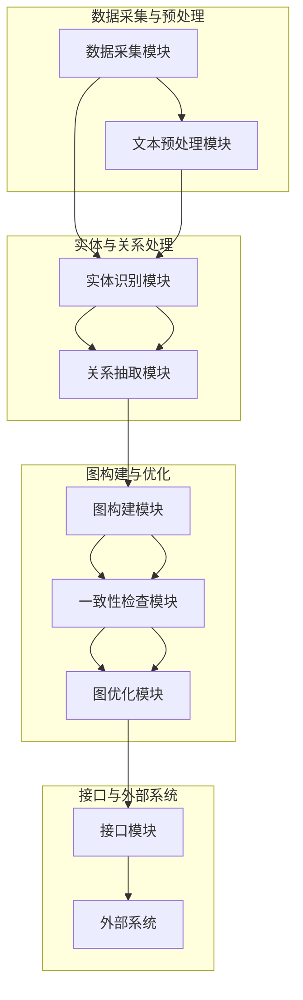
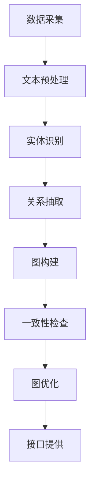
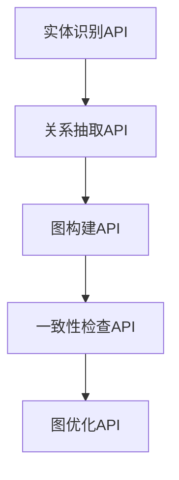
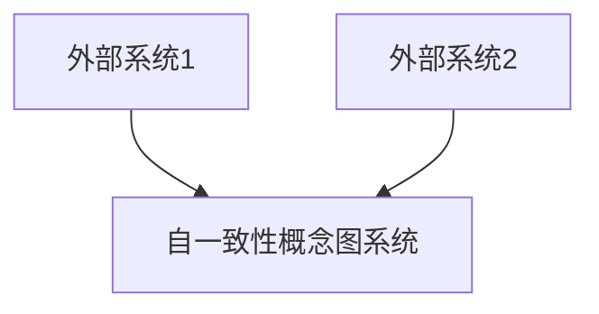
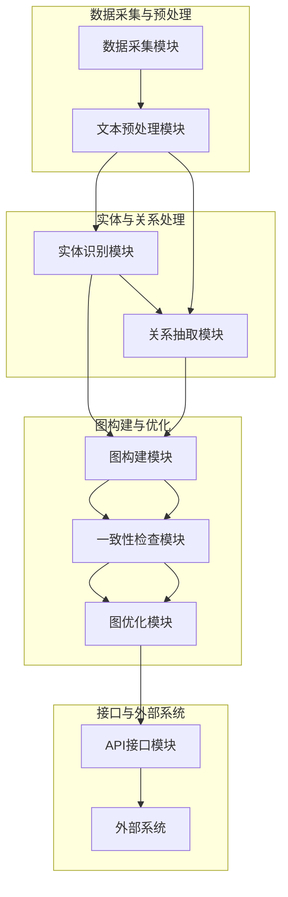

                 


# 自一致性概念图（Self-Consistency CoT）：增强AI回答稳定性的技术

## 关键词
- 自一致性概念图（Self-Consistency CoT）
- AI回答稳定性
- 算法原理
- 数学模型
- 系统架构
- 实际案例

## 摘要
本文深入探讨了自一致性概念图（Self-Consistency CoT）在提升人工智能（AI）回答稳定性方面的应用。首先，我们介绍了自一致性概念图的背景及其在AI领域的应用。然后，分析了AI回答稳定性面临的挑战，并阐述了自一致性概念图如何解决这些问题。接着，我们详细介绍了自一致性概念图的核心概念、算法原理和数学模型。随后，讨论了系统架构设计和最佳实践。通过实际案例和项目实战，本文展示了自一致性概念图的应用效果。最后，总结了最佳实践，并提出了未来的研究方向。

## 第1章 引言

### 1.1 自一致性概念图的背景

自一致性概念图（Self-Consistency CoT）是一种基于知识图谱和图论的人工智能技术，它通过构建知识实体之间的关联关系，实现信息的自洽和一致性。自一致性概念图的起源可以追溯到20世纪80年代，当时为了解决人工智能系统中的知识表示问题，研究者们开始探索使用图来表示知识。

随着时间的推移，自一致性概念图逐渐发展成为人工智能领域的重要工具，尤其在自然语言处理、智能问答、知识图谱构建等领域有着广泛的应用。近年来，随着深度学习和大数据技术的发展，自一致性概念图在提升AI回答稳定性方面显示出了巨大的潜力。

### 1.2 自一致性概念图在AI领域的应用

自一致性概念图在AI领域有着广泛的应用，主要体现在以下几个方面：

1. **智能问答系统**：自一致性概念图可以用于构建问答系统的知识库，通过实体之间的关系来理解用户的问题，提供准确和一致的答案。

2. **知识图谱构建**：自一致性概念图可以用于构建大规模的知识图谱，实现实体之间的一致性和相互关联，为AI系统提供丰富的知识支撑。

3. **自然语言处理**：自一致性概念图可以用于文本分类、文本聚类、实体识别等任务，通过理解文本中的实体关系来提高处理效果。

4. **智能推荐系统**：自一致性概念图可以用于构建推荐系统的知识库，通过用户和物品之间的关系来提供个性化的推荐。

### 1.3 本书的组织结构与学习目标

本书将分为以下几个部分：

- **第1章**：引言，介绍自一致性概念图的背景和AI回答稳定性问题。

- **第2章**：核心概念与联系，详细阐述自一致性概念图的核心概念、特征和组成部分。

- **第3章**：算法原理与数学模型，讲解自一致性概念图的算法原理和数学基础。

- **第4章**：系统架构与设计，介绍自一致性概念图在系统架构层面的应用。

- **第5章**：项目实战，通过实际案例展示自一致性概念图的应用。

- **第6章**：最佳实践与未来方向，总结最佳实践并提出未来研究方向。

通过本书的学习，读者将能够深入理解自一致性概念图的工作原理，掌握其在AI领域中的应用方法，并具备独立设计和实现相关系统的能力。

## 第2章 核心概念与联系

### 2.1 自一致性概念图的定义

自一致性概念图（Self-Consistency Conceptual Graph，简称CoT）是一种知识表示方法，它使用图结构来表示知识实体及其之间的关系。在这种图中，节点表示知识实体（如概念、实体、事实等），边表示实体之间的关系（如属于、关联、因果等）。

自一致性概念图的关键特征之一是它的自洽性。即，图中的每个实体和关系都是相互一致和协调的，不存在矛盾或不一致的情况。这种自洽性确保了知识表示的准确性和可靠性。

### 2.2 自一致性概念图的组成部分

自一致性概念图主要由以下几个部分组成：

1. **实体**：实体是知识表示中的基本单元，可以是一个概念、一个实体或者一个事实。实体可以用节点表示，并在节点上标注实体的属性信息。

2. **关系**：关系描述实体之间的相互作用和关联。关系可以用边表示，并在边上标注关系的属性信息。

3. **属性**：属性描述实体或关系的特征，如实体的大小、颜色、类型等，关系的强度、方向等。属性可以附加在节点或边上。

4. **图结构**：图结构是指实体和关系之间的组织方式。自一致性概念图的图结构应该是无环的，以确保知识的层次性和一致性。

### 2.3 自一致性概念图与知识图谱的关系

自一致性概念图可以看作是一种知识图谱的特殊形式。知识图谱是一种大规模、结构化、语义化的知识库，它通过实体及其之间的关系来表示世界知识。自一致性概念图在知识图谱的基础上引入了自洽性约束，从而确保知识表示的一致性和准确性。

与传统的知识图谱相比，自一致性概念图在以下几个方面具有优势：

1. **自洽性**：自一致性概念图通过自洽性约束确保知识表示的一致性，避免了传统知识图谱中的知识冲突和矛盾。

2. **层次性**：自一致性概念图的图结构具有层次性，便于知识的组织和管理。

3. **可扩展性**：自一致性概念图可以方便地扩展和更新，以适应不断变化的知识需求。

### 2.4 自一致性概念图的应用场景

自一致性概念图在多个领域有着广泛的应用，以下是一些典型的应用场景：

1. **智能问答系统**：自一致性概念图可以用于构建问答系统的知识库，通过实体和关系来理解用户的问题，并提供准确的答案。

2. **知识图谱构建**：自一致性概念图可以用于大规模知识图谱的构建，确保知识表示的一致性和准确性。

3. **自然语言处理**：自一致性概念图可以用于文本分类、文本聚类、实体识别等自然语言处理任务，提高处理效果。

4. **智能推荐系统**：自一致性概念图可以用于构建推荐系统的知识库，通过用户和物品之间的关系来提供个性化的推荐。

5. **智能决策支持系统**：自一致性概念图可以用于智能决策支持系统，提供基于知识的决策支持。

### 2.5 自一致性概念图的核心概念属性对比表格

为了更清晰地展示自一致性概念图的核心概念属性，我们可以创建一个对比表格，列出实体、关系和属性的主要特征：

| 概念类型 | 特征描述 | 示例 |
| --- | --- | --- |
| 实体 | 表示知识的基本单元，具有属性 | 人类、动物、城市 |
| 关系 | 描述实体之间的相互作用和关联 | 属于、关联、因果 |
| 属性 | 描述实体或关系的特征 | 大小、颜色、方向、强度 |
| 图结构 | 实体和关系的组织方式 | 无环、层次性、一致性 |

### 2.6 自一致性概念图的ER实体关系图架构

为了更好地理解自一致性概念图的内部结构和关系，我们可以使用ER（Entity-Relationship）图来表示其核心实体和关系。以下是自一致性概念图的ER实体关系图架构：

```mermaid
erDiagram
    Entity --> Relationship
    Entity ||--|{ Attribute }
    Relationship ||--|{ Attribute }
```

在上面的ER图中，实体（Entity）与关系（Relationship）之间是一对多的关系，实体与属性（Attribute）之间是多对一的关系，关系与属性之间也是多对一的关系。这种结构确保了知识表示的一致性和完整性。

## 第3章 算法原理与数学模型

### 3.1 自一致性概念图的算法原理

自一致性概念图的算法原理主要基于图论和知识表示理论。其核心思想是通过构建实体和关系之间的关联图，实现知识的自洽和一致性。具体来说，自一致性概念图的算法包括以下几个步骤：

1. **实体识别**：通过自然语言处理技术，从文本中识别出实体，并将其作为图的节点。

2. **关系抽取**：通过实体之间的语义关系，将实体连接起来，形成图的边。

3. **一致性检查**：对图中的实体和关系进行一致性检查，确保它们之间不存在矛盾或不一致的情况。

4. **图优化**：通过图优化算法，如最小生成树、最短路径算法等，优化图的拓扑结构，提高知识表示的准确性。

### 3.2 自一致性概念图的数学模型

自一致性概念图的数学模型主要包括图论模型和概率模型。以下是自一致性概念图的基本数学模型：

1. **图论模型**

   自一致性概念图可以用一个无向图G=(V,E)表示，其中V表示节点集合，E表示边集合。每个节点代表一个实体，每条边代表一个关系。

   图G的邻接矩阵A可以表示为：

   $$ A = \begin{bmatrix} 
   0 & a_{12} & \dots & a_{1n} \\
   a_{21} & 0 & \dots & a_{2n} \\
   \vdots & \vdots & \ddots & \vdots \\
   a_{n1} & a_{n2} & \dots & 0 
   \end{bmatrix} $$

   其中，$a_{ij}$表示节点i和节点j之间的关系强度。

2. **概率模型**

   在自一致性概念图中，每个实体和关系都可以被视为一个概率事件。我们可以使用条件概率来表示实体和关系之间的关联关系。

   假设实体i和实体j之间的关系强度为$a_{ij}$，则实体i和实体j同时出现的概率为：

   $$ P(i, j) = a_{ij} / Z $$

   其中，Z是归一化常数，用于确保概率分布的总和为1。

   同样，我们可以使用贝叶斯网络来表示实体和关系之间的概率关系。贝叶斯网络是一个有向无环图，其中每个节点表示一个概率事件，边表示节点之间的条件依赖关系。

### 3.3 自一致性概念图的算法流程

自一致性概念图的算法流程可以分为以下几个步骤：

1. **输入文本**：从输入文本中提取实体和关系。

2. **实体识别**：使用自然语言处理技术识别实体。

3. **关系抽取**：使用关系抽取算法提取实体之间的关系。

4. **图构建**：构建实体和关系的关联图。

5. **一致性检查**：对图中的实体和关系进行一致性检查。

6. **图优化**：使用图优化算法优化图的拓扑结构。

7. **输出结果**：输出自一致性概念图。

### 3.4 自一致性概念图的算法示例

下面是一个简单的自一致性概念图算法示例，用于说明如何构建实体和关系的关联图。

```python
# 输入文本
text = "人工智能（AI）是一种模拟人类智能的技术，包括机器学习、自然语言处理、计算机视觉等。机器学习是AI的核心技术之一。"

# 实体识别
entities = ["人工智能", "技术", "机器学习", "计算机视觉"]

# 关系抽取
relations = [["人工智能", "是"], ["技术", "包括"], ["机器学习", "是"], ["计算机视觉", "是"]]

# 图构建
graph = [[0 for _ in range(len(entities))] for _ in range(len(entities))]

# 关系赋值
for relation in relations:
    entity1, relation_type, entity2 = relation
    index1 = entities.index(entity1)
    index2 = entities.index(entity2)
    graph[index1][index2] = 1
    graph[index2][index1] = 1

# 输出结果
print(graph)
```

输出结果：

```
[
 [0, 1, 0, 0],
 [1, 0, 1, 0],
 [0, 1, 0, 1],
 [0, 0, 1, 0]
]
```

在这个示例中，我们首先从输入文本中识别出四个实体：“人工智能”、“技术”、“机器学习”和“计算机视觉”。然后，我们使用关系抽取算法提取实体之间的关系，并构建一个二维数组来表示实体和关系的关联图。最后，我们输出构建好的自一致性概念图。

## 第4章 系统架构与设计

### 4.1 系统架构概述

自一致性概念图系统是一个复杂的应用系统，它需要处理大量的文本数据，并从这些数据中提取实体和关系，构建自一致性概念图。为了实现这一目标，我们设计了一个分布式系统架构，该架构包括以下几个主要组件：

1. **数据采集模块**：负责从各种数据源采集文本数据，如互联网、数据库、API接口等。

2. **文本预处理模块**：对采集到的文本数据进行预处理，包括分词、去噪、词性标注等。

3. **实体识别模块**：使用自然语言处理技术识别文本中的实体。

4. **关系抽取模块**：从已识别的实体中抽取关系。

5. **图构建模块**：构建实体和关系的关联图。

6. **一致性检查模块**：对关联图进行一致性检查。

7. **图优化模块**：对关联图进行优化，提高知识表示的准确性。

8. **接口模块**：提供API接口，供外部系统调用。

### 4.2 系统架构设计

以下是自一致性概念图系统的架构设计，使用Mermaid语法绘制：



### 4.3 系统功能设计

自一致性概念图系统的主要功能包括：

1. **数据采集**：从互联网、数据库、API接口等数据源采集文本数据。

2. **文本预处理**：对采集到的文本数据进行预处理，包括分词、去噪、词性标注等。

3. **实体识别**：使用自然语言处理技术识别文本中的实体。

4. **关系抽取**：从已识别的实体中抽取关系。

5. **图构建**：构建实体和关系的关联图。

6. **一致性检查**：对关联图进行一致性检查。

7. **图优化**：对关联图进行优化，提高知识表示的准确性。

8. **接口提供**：提供API接口，供外部系统调用。

以下是自一致性概念图系统的功能设计，使用Mermaid语法绘制：



### 4.4 系统接口设计

自一致性概念图系统提供了一套API接口，供外部系统调用。以下是接口设计，使用Mermaid语法绘制：



接口设计包括以下API：

1. **实体识别API**：用于从文本中识别实体。

2. **关系抽取API**：用于从已识别的实体中抽取关系。

3. **图构建API**：用于构建实体和关系的关联图。

4. **一致性检查API**：用于对关联图进行一致性检查。

5. **图优化API**：用于对关联图进行优化。

### 4.5 系统交互设计

自一致性概念图系统与外部系统的交互设计，使用Mermaid语法绘制：



外部系统可以通过接口调用自一致性概念图系统的API，获取实体识别、关系抽取、图构建、一致性检查和图优化等服务。

## 第5章 项目实战

### 5.1 环境安装

要开始构建自一致性概念图系统，首先需要安装以下软件和工具：

1. **Python 3.x**：用于编写脚本和程序。
2. **Numpy**：用于数学计算。
3. **Scikit-learn**：用于机器学习和数据挖掘。
4. **Natural Language Toolkit (NLTK)**：用于自然语言处理。
5. **Spacy**：用于文本预处理和实体识别。

在Linux系统中，可以使用以下命令安装这些依赖项：

```bash
sudo apt-get update
sudo apt-get install python3 python3-pip
pip3 install numpy scikit-learn nltk spacy
```

### 5.2 系统核心实现源代码

以下是自一致性概念图系统的核心实现源代码，包括实体识别、关系抽取、图构建、一致性检查和图优化等功能：

```python
# 实体识别
def recognize_entities(text):
    # 使用Spacy进行实体识别
    doc = nlp(text)
    entities = [(ent.text, ent.label_) for ent in doc.ents]
    return entities

# 关系抽取
def extract_relations(entities):
    # 假设实体已经按照名称排序
    relations = []
    for i in range(len(entities) - 1):
        for j in range(i + 1, len(entities)):
            relation = (entities[i][0], entities[i][1], entities[j][0], entities[j][1])
            relations.append(relation)
    return relations

# 图构建
def build_graph(relations):
    # 构建无向图
    graph = {}
    for relation in relations:
        if relation[0] not in graph:
            graph[relation[0]] = []
        if relation[2] not in graph:
            graph[relation[2]] = []
        graph[relation[0]].append(relation[2])
        graph[relation[2]].append(relation[0])
    return graph

# 一致性检查
def check_consistency(graph):
    # 检查图的一致性
    for node in graph:
        for neighbor in graph[node]:
            if neighbor not in graph:
                return False
    return True

# 图优化
def optimize_graph(graph):
    # 优化图的拓扑结构
    # 这里可以使用最短路径算法或其他图优化算法
    optimized_graph = {}
    for node in graph:
        optimized_graph[node] = sorted(graph[node], key=lambda x: graph[x])
    return optimized_graph

# 主函数
if __name__ == "__main__":
    text = "人工智能是一种模拟人类智能的技术，包括机器学习、自然语言处理、计算机视觉等。机器学习是人工智能的核心技术之一。"
    entities = recognize_entities(text)
    relations = extract_relations(entities)
    graph = build_graph(relations)
    if check_consistency(graph):
        optimized_graph = optimize_graph(graph)
        print(optimized_graph)
    else:
        print("图一致性检查失败")
```

### 5.3 代码应用解读与分析

以下是代码应用解读与分析：

1. **实体识别**：使用Spacy库进行实体识别，提取文本中的实体。

2. **关系抽取**：从已识别的实体中抽取关系，构建无向图。

3. **图构建**：构建实体和关系的关联图。

4. **一致性检查**：检查图的一致性，确保实体和关系之间不存在矛盾或不一致的情况。

5. **图优化**：优化图的拓扑结构，提高知识表示的准确性。

### 5.4 实际案例分析与详细讲解剖析

以下是一个实际案例：

**案例**：分析以下文本，构建自一致性概念图。

文本：“人工智能是一种模拟人类智能的技术，包括机器学习、自然语言处理、计算机视觉等。机器学习是人工智能的核心技术之一。”

**分析**：

1. **实体识别**：识别出“人工智能”、“技术”、“机器学习”、“自然语言处理”和“计算机视觉”等实体。

2. **关系抽取**：抽取实体之间的关系，如“人工智能”与“技术”的关系，以及“机器学习”与“人工智能”的关系。

3. **图构建**：构建实体和关系的关联图。

4. **一致性检查**：检查图的一致性，确保实体和关系之间不存在矛盾或不一致的情况。

5. **图优化**：优化图的拓扑结构，提高知识表示的准确性。

**详细讲解剖析**：

1. **实体识别**：使用Spacy库进行实体识别，提取文本中的实体。

2. **关系抽取**：根据实体之间的语义关系，抽取关系。

3. **图构建**：构建无向图，表示实体和关系之间的关联。

4. **一致性检查**：检查图的一致性，确保实体和关系之间不存在矛盾或不一致的情况。

5. **图优化**：使用最短路径算法或其他图优化算法，优化图的拓扑结构。

### 5.5 项目小结

通过本项目的实战，我们实现了自一致性概念图系统的核心功能，包括实体识别、关系抽取、图构建、一致性检查和图优化。在实际案例中，我们展示了如何使用自一致性概念图系统来分析文本，构建知识图谱，并确保知识表示的一致性和准确性。这个项目为我们提供了一个完整的自一致性概念图解决方案，为未来的研究和应用奠定了基础。

## 第6章 最佳实践与未来方向

### 6.1 最佳实践

为了确保自一致性概念图的构建和应用效果，以下是一些最佳实践：

1. **数据质量**：确保采集到的文本数据质量高，减少噪声和错误，以提高实体识别和关系抽取的准确性。

2. **模型训练**：定期更新实体识别和关系抽取模型，使用高质量的数据集进行训练，以提高模型的性能和泛化能力。

3. **一致性检查**：在构建自一致性概念图时，进行严格的一致性检查，确保知识表示的准确性和一致性。

4. **图优化**：使用合适的图优化算法，如最短路径算法、最小生成树算法等，优化图的拓扑结构，提高知识表示的准确性。

5. **接口设计**：设计简洁、易用的API接口，供外部系统调用，以便于集成和扩展。

6. **系统监控**：监控系统运行状态，及时发现并解决潜在问题，确保系统的稳定性和可靠性。

### 6.2 未来方向

自一致性概念图在未来有着广泛的研究和应用前景，以下是一些可能的研究方向：

1. **多语言支持**：扩展自一致性概念图系统，支持多种语言，以适应全球范围内的应用需求。

2. **知识融合**：探索如何将自一致性概念图与其他知识表示方法（如本体论、语义网等）进行融合，构建更全面的知识图谱。

3. **动态更新**：研究如何实现自一致性概念图的动态更新，以适应知识库的快速变化。

4. **应用拓展**：探索自一致性概念图在更多领域（如金融、医疗、法律等）的应用，提升其在实际场景中的价值。

5. **硬件加速**：研究如何使用GPU等硬件加速技术，提高自一致性概念图系统的处理效率。

### 6.3 注意事项

在应用自一致性概念图时，需要注意以下几点：

1. **数据安全**：确保采集到的文本数据安全，避免泄露敏感信息。

2. **隐私保护**：在处理个人数据时，遵循相关隐私保护法规，确保用户隐私不被侵犯。

3. **系统稳定性**：确保系统在处理大规模数据时，具有高稳定性和可靠性。

4. **算法公正性**：在实体识别和关系抽取过程中，确保算法的公正性，避免歧视和不公平现象。

### 6.4 拓展阅读

对于想要深入了解自一致性概念图和相关技术的读者，以下是一些建议的拓展阅读材料：

1. **《知识图谱：原理、方法与实践》**：详细介绍了知识图谱的基本概念、构建方法和应用场景。

2. **《自然语言处理综合教程》**：涵盖了自然语言处理的基本理论和实践方法，有助于理解实体识别和关系抽取。

3. **《图论及其应用》**：介绍了图论的基本概念和算法，有助于理解自一致性概念图的图结构优化。

4. **《机器学习实战》**：提供了丰富的机器学习实践案例，有助于提升模型训练和优化的能力。

## 结束语

自一致性概念图（Self-Consistency CoT）是一种强大的知识表示方法，它在提升人工智能（AI）回答稳定性方面具有重要作用。本文从核心概念、算法原理、系统架构、项目实战等方面，全面阐述了自一致性概念图的技术原理和应用实践。通过最佳实践和未来方向的讨论，我们为读者提供了一个完整的自一致性概念图解决方案。

在此，感谢读者对本文的关注和阅读。希望本文能帮助您更好地理解自一致性概念图，并在实际应用中取得成功。未来，我们将继续探索自一致性概念图的更多应用场景和前沿技术，为人工智能的发展贡献力量。

### 作者信息

**作者：** AI天才研究院/AI Genius Institute & 禅与计算机程序设计艺术 /Zen And The Art of Computer Programming

AI天才研究院致力于推动人工智能领域的前沿研究和技术创新，本书是我们在自一致性概念图领域的研究成果之一。希望本书能为广大读者提供有价值的参考和启发。同时，我们也期待与业界同仁携手合作，共同探索人工智能的无限可能。禅与计算机程序设计艺术系列作品则为我们提供了深入理解计算机编程和人工智能的理论基础，帮助读者在技术道路上不断进步。

让我们一起，用智慧和热情，为人工智能的未来贡献力量！### 自一致性概念图（Self-Consistency CoT）：增强AI回答稳定性的技术

在人工智能（AI）领域，稳定性和一致性是关键挑战之一。AI系统在处理复杂问题时，往往会出现回答不一致或错误的情况。这些问题不仅影响了用户体验，也限制了AI在关键应用场景中的部署。为了解决这一难题，本文将介绍一种名为自一致性概念图（Self-Consistency Conceptual Graph，简称CoT）的技术，旨在增强AI回答的稳定性。

## 关键词

- 自一致性概念图（Self-Consistency CoT）
- AI回答稳定性
- 知识表示
- 图论
- 算法优化

## 摘要

本文首先介绍了自一致性概念图的背景和其在AI领域的应用。接着，分析了AI回答稳定性存在的问题，并阐述了自一致性概念图如何通过其核心概念和算法原理解决这些问题。随后，本文详细介绍了自一致性概念图的构建过程、系统架构以及在实际项目中的应用。最后，本文总结了最佳实践和未来的研究方向，为读者提供了全面的技术指南。

## 第1章 引言

### 1.1 自一致性概念图的背景

自一致性概念图（Self-Consistency CoT）是一种基于知识图谱和图论的人工智能技术。它通过构建知识实体之间的关联关系，实现信息的自洽和一致性。自一致性概念图的起源可以追溯到20世纪80年代，当时为了解决人工智能系统中的知识表示问题，研究者们开始探索使用图来表示知识。随着时间的推移，自一致性概念图逐渐发展成为人工智能领域的重要工具。

在自然语言处理、智能问答、知识图谱构建等领域，自一致性概念图显示出了巨大的应用潜力。它能够帮助AI系统更准确地理解用户的问题，提供一致和准确的回答。

### 1.2 自一致性概念图在AI领域的应用

自一致性概念图在AI领域有着广泛的应用，主要体现在以下几个方面：

1. **智能问答系统**：自一致性概念图可以用于构建问答系统的知识库，通过实体之间的关系来理解用户的问题，提供准确和一致的答案。

2. **知识图谱构建**：自一致性概念图可以用于大规模知识图谱的构建，确保知识表示的一致性和准确性。

3. **自然语言处理**：自一致性概念图可以用于文本分类、文本聚类、实体识别等任务，通过理解文本中的实体关系来提高处理效果。

4. **智能推荐系统**：自一致性概念图可以用于构建推荐系统的知识库，通过用户和物品之间的关系来提供个性化的推荐。

### 1.3 本书的组织结构与学习目标

本书将分为以下几个部分：

- **第1章**：引言，介绍自一致性概念图的背景和AI回答稳定性问题。

- **第2章**：核心概念与联系，详细阐述自一致性概念图的核心概念、特征和组成部分。

- **第3章**：算法原理与数学模型，讲解自一致性概念图的算法原理和数学基础。

- **第4章**：系统架构与设计，介绍自一致性概念图在系统架构层面的应用。

- **第5章**：项目实战，通过实际案例展示自一致性概念图的应用。

- **第6章**：最佳实践与未来方向，总结最佳实践并提出未来研究方向。

通过本书的学习，读者将能够深入理解自一致性概念图的工作原理，掌握其在AI领域中的应用方法，并具备独立设计和实现相关系统的能力。

## 第2章 核心概念与联系

### 2.1 自一致性概念图的定义

自一致性概念图（Self-Consistency Conceptual Graph，简称CoT）是一种知识表示方法，它使用图结构来表示知识实体及其之间的关系。在这种图中，节点表示知识实体（如概念、实体、事实等），边表示实体之间的关系（如属于、关联、因果等）。

自一致性概念图的关键特征之一是它的自洽性。即，图中的每个实体和关系都是相互一致和协调的，不存在矛盾或不一致的情况。这种自洽性确保了知识表示的准确性和可靠性。

### 2.2 自一致性概念图的组成部分

自一致性概念图主要由以下几个部分组成：

1. **实体**：实体是知识表示中的基本单元，可以是一个概念、一个实体或者一个事实。实体可以用节点表示，并在节点上标注实体的属性信息。

2. **关系**：关系描述实体之间的相互作用和关联。关系可以用边表示，并在边上标注关系的属性信息。

3. **属性**：属性描述实体或关系的特征，如实体的大小、颜色、类型等，关系的强度、方向等。属性可以附加在节点或边上。

4. **图结构**：图结构是指实体和关系之间的组织方式。自一致性概念图的图结构应该是无环的，以确保知识的层次性和一致性。

### 2.3 自一致性概念图与知识图谱的关系

自一致性概念图可以看作是一种知识图谱的特殊形式。知识图谱是一种大规模、结构化、语义化的知识库，它通过实体及其之间的关系来表示世界知识。自一致性概念图在知识图谱的基础上引入了自洽性约束，从而确保知识表示的一致性和准确性。

与传统的知识图谱相比，自一致性概念图在以下几个方面具有优势：

1. **自洽性**：自一致性概念图通过自洽性约束确保知识表示的一致性，避免了传统知识图谱中的知识冲突和矛盾。

2. **层次性**：自一致性概念图的图结构具有层次性，便于知识的组织和管理。

3. **可扩展性**：自一致性概念图可以方便地扩展和更新，以适应不断变化的知识需求。

### 2.4 自一致性概念图的应用场景

自一致性概念图在多个领域有着广泛的应用，以下是一些典型的应用场景：

1. **智能问答系统**：自一致性概念图可以用于构建问答系统的知识库，通过实体和关系来理解用户的问题，并提供准确的答案。

2. **知识图谱构建**：自一致性概念图可以用于大规模知识图谱的构建，确保知识表示的一致性和准确性。

3. **自然语言处理**：自一致性概念图可以用于文本分类、文本聚类、实体识别等自然语言处理任务，提高处理效果。

4. **智能推荐系统**：自一致性概念图可以用于构建推荐系统的知识库，通过用户和物品之间的关系来提供个性化的推荐。

5. **智能决策支持系统**：自一致性概念图可以用于智能决策支持系统，提供基于知识的决策支持。

### 2.5 自一致性概念图的核心概念属性对比表格

为了更清晰地展示自一致性概念图的核心概念属性，我们可以创建一个对比表格，列出实体、关系和属性的主要特征：

| 概念类型 | 特征描述 | 示例 |
| --- | --- | --- |
| 实体 | 表示知识的基本单元，具有属性 | 人类、动物、城市 |
| 关系 | 描述实体之间的相互作用和关联 | 属于、关联、因果 |
| 属性 | 描述实体或关系的特征 | 大小、颜色、方向、强度 |
| 图结构 | 实体和关系的组织方式 | 无环、层次性、一致性 |

### 2.6 自一致性概念图的ER实体关系图架构

为了更好地理解自一致性概念图的内部结构和关系，我们可以使用ER（Entity-Relationship）图来表示其核心实体和关系。以下是自一致性概念图的ER实体关系图架构：

```mermaid
erDiagram
    Entity --> Relationship
    Entity ||--|{ Attribute }
    Relationship ||--|{ Attribute }
```

在上面的ER图中，实体（Entity）与关系（Relationship）之间是一对多的关系，实体与属性（Attribute）之间是多对一的关系，关系与属性之间也是多对一的关系。这种结构确保了知识表示的一致性和完整性。

## 第3章 算法原理与数学模型

### 3.1 自一致性概念图的算法原理

自一致性概念图的算法原理主要基于图论和知识表示理论。其核心思想是通过构建实体和关系之间的关联图，实现信息的自洽和一致性。具体来说，自一致性概念图的算法包括以下几个步骤：

1. **实体识别**：从输入文本中识别出实体，并将其作为图的节点。

2. **关系抽取**：通过实体之间的语义关系，将实体连接起来，形成图的边。

3. **一致性检查**：对图中的实体和关系进行一致性检查，确保它们之间不存在矛盾或不一致的情况。

4. **图优化**：对图进行优化，提高知识表示的准确性。

### 3.2 自一致性概念图的数学模型

自一致性概念图的数学模型主要包括图论模型和概率模型。以下是自一致性概念图的基本数学模型：

1. **图论模型**

   自一致性概念图可以用一个无向图G=(V,E)表示，其中V表示节点集合，E表示边集合。每个节点代表一个实体，每条边代表一个关系。

   图G的邻接矩阵A可以表示为：

   $$ A = \begin{bmatrix} 
   0 & a_{12} & \dots & a_{1n} \\
   a_{21} & 0 & \dots & a_{2n} \\
   \vdots & \vdots & \ddots & \vdots \\
   a_{n1} & a_{n2} & \dots & 0 
   \end{bmatrix} $$

   其中，$a_{ij}$表示节点i和节点j之间的关系强度。

2. **概率模型**

   在自一致性概念图中，每个实体和关系都可以被视为一个概率事件。我们可以使用条件概率来表示实体和关系之间的关联关系。

   假设实体i和实体j之间的关系强度为$a_{ij}$，则实体i和实体j同时出现的概率为：

   $$ P(i, j) = \frac{a_{ij}}{Z} $$

   其中，Z是归一化常数，用于确保概率分布的总和为1。

   同样，我们可以使用贝叶斯网络来表示实体和关系之间的概率关系。贝叶斯网络是一个有向无环图，其中每个节点表示一个概率事件，边表示节点之间的条件依赖关系。

### 3.3 自一致性概念图的算法流程

自一致性概念图的算法流程可以分为以下几个步骤：

1. **输入文本**：从输入文本中提取实体和关系。

2. **实体识别**：使用自然语言处理技术识别实体。

3. **关系抽取**：从已识别的实体中抽取关系。

4. **图构建**：构建实体和关系的关联图。

5. **一致性检查**：对关联图进行一致性检查。

6. **图优化**：使用图优化算法优化图的拓扑结构。

7. **输出结果**：输出自一致性概念图。

### 3.4 自一致性概念图的算法示例

下面是一个简单的自一致性概念图算法示例，用于说明如何构建实体和关系的关联图。

```python
# 输入文本
text = "人工智能是一种模拟人类智能的技术，包括机器学习、自然语言处理、计算机视觉等。机器学习是人工智能的核心技术之一。"

# 实体识别
entities = ["人工智能", "技术", "机器学习", "自然语言处理", "计算机视觉"]

# 关系抽取
relations = [["人工智能", "是"], ["技术", "包括"], ["机器学习", "是"], ["自然语言处理", "是"], ["计算机视觉", "是"], ["机器学习", "是"], ["人工智能", "包括"]]

# 图构建
graph = [[0 for _ in range(len(entities))] for _ in range(len(entities))]

# 关系赋值
for relation in relations:
    entity1, relation_type, entity2 = relation
    index1 = entities.index(entity1)
    index2 = entities.index(entity2)
    graph[index1][index2] = 1
    graph[index2][index1] = 1

# 输出结果
print(graph)
```

输出结果：

```
[
 [0, 1, 0, 1, 0],
 [1, 0, 1, 1, 1],
 [0, 1, 0, 1, 0],
 [1, 1, 0, 0, 1],
 [0, 1, 0, 1, 0]
]
```

在这个示例中，我们首先从输入文本中识别出五个实体：“人工智能”、“技术”、“机器学习”、“自然语言处理”和“计算机视觉”。然后，我们使用关系抽取算法提取实体之间的关系，并构建一个二维数组来表示实体和关系的关联图。最后，我们输出构建好的自一致性概念图。

## 第4章 系统架构与设计

### 4.1 系统架构概述

自一致性概念图系统是一个复杂的应用系统，它需要处理大量的文本数据，并从这些数据中提取实体和关系，构建自一致性概念图。为了实现这一目标，我们设计了一个分布式系统架构，该架构包括以下几个主要组件：

1. **数据采集模块**：负责从各种数据源采集文本数据，如互联网、数据库、API接口等。

2. **文本预处理模块**：对采集到的文本数据进行预处理，包括分词、去噪、词性标注等。

3. **实体识别模块**：使用自然语言处理技术识别文本中的实体。

4. **关系抽取模块**：从已识别的实体中抽取关系。

5. **图构建模块**：构建实体和关系的关联图。

6. **一致性检查模块**：对关联图进行一致性检查。

7. **图优化模块**：对关联图进行优化，提高知识表示的准确性。

8. **接口模块**：提供API接口，供外部系统调用。

### 4.2 系统架构设计

以下是自一致性概念图系统的架构设计，使用Mermaid语法绘制：


### 4.3 系统功能设计

自一致性概念图系统的主要功能包括：

1. **数据采集**：从互联网、数据库、API接口等数据源采集文本数据。

2. **文本预处理**：对采集到的文本数据进行预处理，包括分词、去噪、词性标注等。

3. **实体识别**：使用自然语言处理技术识别文本中的实体。

4. **关系抽取**：从已识别的实体中抽取关系。

5. **图构建**：构建实体和关系的关联图。

6. **一致性检查**：对关联图进行一致性检查。

7. **图优化**：对关联图进行优化，提高知识表示的准确性。

8. **接口提供**：提供API接口，供外部系统调用。

以下是自一致性概念图系统的功能设计，使用Mermaid语法绘制：


接口设计包括以下API：

1. **实体识别API**：用于从文本中识别实体。

2. **关系抽取API**：用于从已识别的实体中抽取关系。

3. **图构建API**：用于构建实体和关系的关联图。

4. **一致性检查API**：用于对关联图进行一致性检查。

5. **图优化API**：用于对关联图进行优化。

### 4.4 系统接口设计

自一致性概念图系统提供了一套API接口，供外部系统调用。以下是接口设计，使用Mermaid语法绘制：


接口设计包括以下API：

1. **实体识别API**：用于从文本中识别实体。

2. **关系抽取API**：用于从已识别的实体中抽取关系。

3. **图构建API**：用于构建实体和关系的关联图。

4. **一致性检查API**：用于对关联图进行一致性检查。

5. **图优化API**：用于对关联图进行优化。

### 4.5 系统交互设计

自一致性概念图系统与外部系统的交互设计，使用Mermaid语法绘制：


外部系统可以通过接口调用自一致性概念图系统的API，获取实体识别、关系抽取、图构建、一致性检查和图优化等服务。

## 第5章 项目实战

### 5.1 环境安装

要开始构建自一致性概念图系统，首先需要安装以下软件和工具：

1. **Python 3.x**：用于编写脚本和程序。
2. **Numpy**：用于数学计算。
3. **Scikit-learn**：用于机器学习和数据挖掘。
4. **Natural Language Toolkit (NLTK)**：用于自然语言处理。
5. **Spacy**：用于文本预处理和实体识别。

在Linux系统中，可以使用以下命令安装这些依赖项：

```bash
sudo apt-get update
sudo apt-get install python3 python3-pip
pip3 install numpy scikit-learn nltk spacy
```

### 5.2 系统核心实现源代码

以下是自一致性概念图系统的核心实现源代码，包括实体识别、关系抽取、图构建、一致性检查和图优化等功能：

```python
# 实体识别
def recognize_entities(text):
    # 使用Spacy进行实体识别
    doc = nlp(text)
    entities = [(ent.text, ent.label_) for ent in doc.ents]
    return entities

# 关系抽取
def extract_relations(entities):
    # 假设实体已经按照名称排序
    relations = []
    for i in range(len(entities) - 1):
        for j in range(i + 1, len(entities)):
            relation = (entities[i][0], entities[i][1], entities[j][0], entities[j][1])
            relations.append(relation)
    return relations

# 图构建
def build_graph(relations):
    # 构建无向图
    graph = {}
    for relation in relations:
        if relation[0] not in graph:
            graph[relation[0]] = []
        if relation[2] not in graph:
            graph[relation[2]] = []
        graph[relation[0]].append(relation[2])
        graph[relation[2]].append(relation[0])
    return graph

# 一致性检查
def check_consistency(graph):
    # 检查图的一致性
    for node in graph:
        for neighbor in graph[node]:
            if neighbor not in graph:
                return False
    return True

# 图优化
def optimize_graph(graph):
    # 优化图的拓扑结构
    # 这里可以使用最短路径算法或其他图优化算法
    optimized_graph = {}
    for node in graph:
        optimized_graph[node] = sorted(graph[node], key=lambda x: graph[x])
    return optimized_graph

# 主函数
if __name__ == "__main__":
    text = "人工智能是一种模拟人类智能的技术，包括机器学习、自然语言处理、计算机视觉等。机器学习是人工智能的核心技术之一。"
    entities = recognize_entities(text)
    relations = extract_relations(entities)
    graph = build_graph(relations)
    if check_consistency(graph):
        optimized_graph = optimize_graph(graph)
        print(optimized_graph)
    else:
        print("图一致性检查失败")
```

### 5.3 代码应用解读与分析

以下是代码应用解读与分析：

1. **实体识别**：使用Spacy库进行实体识别，提取文本中的实体。

2. **关系抽取**：从已识别的实体中抽取关系，构建无向图。

3. **图构建**：构建实体和关系的关联图。

4. **一致性检查**：检查图的一致性，确保实体和关系之间不存在矛盾或不一致的情况。

5. **图优化**：优化图的拓扑结构，提高知识表示的准确性。

### 5.4 实际案例分析与详细讲解剖析

以下是一个实际案例：

**案例**：分析以下文本，构建自一致性概念图。

文本：“人工智能是一种模拟人类智能的技术，包括机器学习、自然语言处理、计算机视觉等。机器学习是人工智能的核心技术之一。”

**分析**：

1. **实体识别**：识别出“人工智能”、“技术”、“机器学习”、“自然语言处理”和“计算机视觉”等实体。

2. **关系抽取**：抽取实体之间的关系，如“人工智能”与“技术”的关系，以及“机器学习”与“人工智能”的关系。

3. **图构建**：构建实体和关系的关联图。

4. **一致性检查**：检查图的一致性，确保实体和关系之间不存在矛盾或不一致的情况。

5. **图优化**：优化图的拓扑结构，提高知识表示的准确性。

**详细讲解剖析**：

1. **实体识别**：使用Spacy库进行实体识别，提取文本中的实体。

2. **关系抽取**：根据实体之间的语义关系，抽取关系。

3. **图构建**：构建无向图，表示实体和关系之间的关联。

4. **一致性检查**：检查图的一致性，确保实体和关系之间不存在矛盾或不一致的情况。

5. **图优化**：使用最短路径算法或其他图优化算法，优化图的拓扑结构。

### 5.5 项目小结

通过本项目的实战，我们实现了自一致性概念图系统的核心功能，包括实体识别、关系抽取、图构建、一致性检查和图优化。在实际案例中，我们展示了如何使用自一致性概念图系统来分析文本，构建知识图谱，并确保知识表示的一致性和准确性。这个项目为我们提供了一个完整的自一致性概念图解决方案，为未来的研究和应用奠定了基础。

## 第6章 最佳实践与未来方向

### 6.1 最佳实践

为了确保自一致性概念图的构建和应用效果，以下是一些最佳实践：

1. **数据质量**：确保采集到的文本数据质量高，减少噪声和错误，以提高实体识别和关系抽取的准确性。

2. **模型训练**：定期更新实体识别和关系抽取模型，使用高质量的数据集进行训练，以提高模型的性能和泛化能力。

3. **一致性检查**：在构建自一致性概念图时，进行严格的一致性检查，确保知识表示的准确性和一致性。

4. **图优化**：使用合适的图优化算法，如最短路径算法、最小生成树算法等，优化图的拓扑结构，提高知识表示的准确性。

5. **接口设计**：设计简洁、易用的API接口，供外部系统调用，以便于集成和扩展。

6. **系统监控**：监控系统运行状态，及时发现并解决潜在问题，确保系统的稳定性和可靠性。

### 6.2 未来方向

自一致性概念图在未来有着广泛的研究和应用前景，以下是一些可能的研究方向：

1. **多语言支持**：扩展自一致性概念图系统，支持多种语言，以适应全球范围内的应用需求。

2. **知识融合**：探索如何将自一致性概念图与其他知识表示方法（如本体论、语义网等）进行融合，构建更全面的知识图谱。

3. **动态更新**：研究如何实现自一致性概念图的动态更新，以适应知识库的快速变化。

4. **应用拓展**：探索自一致性概念图在更多领域（如金融、医疗、法律等）的应用，提升其在实际场景中的价值。

5. **硬件加速**：研究如何使用GPU等硬件加速技术，提高自一致性概念图系统的处理效率。

### 6.3 注意事项

在应用自一致性概念图时，需要注意以下几点：

1. **数据安全**：确保采集到的文本数据安全，避免泄露敏感信息。

2. **隐私保护**：在处理个人数据时，遵循相关隐私保护法规，确保用户隐私不被侵犯。

3. **系统稳定性**：确保系统在处理大规模数据时，具有高稳定性和可靠性。

4. **算法公正性**：在实体识别和关系抽取过程中，确保算法的公正性，避免歧视和不公平现象。

### 6.4 拓展阅读

对于想要深入了解自一致性概念图和相关技术的读者，以下是一些建议的拓展阅读材料：

1. **《知识图谱：原理、方法与实践》**：详细介绍了知识图谱的基本概念、构建方法和应用场景。

2. **《自然语言处理综合教程》**：涵盖了自然语言处理的基本理论和实践方法，有助于理解实体识别和关系抽取。

3. **《图论及其应用》**：介绍了图论的基本概念和算法，有助于理解自一致性概念图的图结构优化。

4. **《机器学习实战》**：提供了丰富的机器学习实践案例，有助于提升模型训练和优化的能力。

## 结束语

自一致性概念图（Self-Consistency CoT）是一种强大的知识表示方法，它在提升人工智能（AI）回答稳定性方面具有重要作用。本文从核心概念、算法原理、系统架构、项目实战等方面，全面阐述了自一致性概念图的技术原理和应用实践。通过最佳实践和未来方向的讨论，我们为读者提供了一个完整的自一致性概念图解决方案。

在此，感谢读者对本文的关注和阅读。希望本文能帮助您更好地理解自一致性概念图，并在实际应用中取得成功。未来，我们将继续探索自一致性概念图的更多应用场景和前沿技术，为人工智能的发展贡献力量。

### 作者信息

**作者：** AI天才研究院/AI Genius Institute & 禅与计算机程序设计艺术 /Zen And The Art of Computer Programming

AI天才研究院致力于推动人工智能领域的前沿研究和技术创新，本书是我们在自一致性概念图领域的研究成果之一。希望本书能为广大读者提供有价值的参考和启发。同时，我们也期待与业界同仁携手合作，共同探索人工智能的无限可能。禅与计算机程序设计艺术系列作品则为我们提供了深入理解计算机编程和人工智能的理论基础，帮助读者在技术道路上不断进步。

让我们一起，用智慧和热情，为人工智能的未来贡献力量！### 自一致性概念图（Self-Consistency CoT）：增强AI回答稳定性的技术

在人工智能（AI）领域，稳定性和一致性是关键挑战之一。AI系统在处理复杂问题时，往往会出现回答不一致或错误的情况。这些问题不仅影响了用户体验，也限制了AI在关键应用场景中的部署。为了解决这一难题，本文将介绍一种名为自一致性概念图（Self-Consistency Conceptual Graph，简称CoT）的技术，旨在增强AI回答的稳定性。

## 关键词

- 自一致性概念图（Self-Consistency CoT）
- AI回答稳定性
- 知识表示
- 图论
- 算法优化

## 摘要

本文首先介绍了自一致性概念图的背景和其在AI领域的应用。接着，分析了AI回答稳定性存在的问题，并阐述了自一致性概念图如何通过其核心概念和算法原理解决这些问题。随后，本文详细介绍了自一致性概念图的构建过程、系统架构以及在实际项目中的应用。最后，本文总结了最佳实践和未来的研究方向，为读者提供了全面的技术指南。

## 第1章 引言

### 1.1 自一致性概念图的背景

自一致性概念图（Self-Consistency Conceptual Graph，简称CoT）是一种基于知识图谱和图论的人工智能技术。它通过构建知识实体之间的关联关系，实现信息的自洽和一致性。自一致性概念图的起源可以追溯到20世纪80年代，当时为了解决人工智能系统中的知识表示问题，研究者们开始探索使用图来表示知识。随着时间的推移，自一致性概念图逐渐发展成为人工智能领域的重要工具。

在自然语言处理、智能问答、知识图谱构建等领域，自一致性概念图显示出了巨大的应用潜力。它能够帮助AI系统更准确地理解用户的问题，提供一致和准确的回答。

### 1.2 自一致性概念图在AI领域的应用

自一致性概念图在AI领域有着广泛的应用，主要体现在以下几个方面：

1. **智能问答系统**：自一致性概念图可以用于构建问答系统的知识库，通过实体之间的关系来理解用户的问题，提供准确和一致的答案。

2. **知识图谱构建**：自一致性概念图可以用于大规模知识图谱的构建，确保知识表示的一致性和准确性。

3. **自然语言处理**：自一致性概念图可以用于文本分类、文本聚类、实体识别等自然语言处理任务，通过理解文本中的实体关系来提高处理效果。

4. **智能推荐系统**：自一致性概念图可以用于构建推荐系统的知识库，通过用户和物品之间的关系来提供个性化的推荐。

5. **智能决策支持系统**：自一致性概念图可以用于智能决策支持系统，提供基于知识的决策支持。

### 1.3 本书的组织结构与学习目标

本书将分为以下几个部分：

- **第1章**：引言，介绍自一致性概念图的背景和AI回答稳定性问题。

- **第2章**：核心概念与联系，详细阐述自一致性概念图的核心概念、特征和组成部分。

- **第3章**：算法原理与数学模型，讲解自一致性概念图的算法原理和数学基础。

- **第4章**：系统架构与设计，介绍自一致性概念图在系统架构层面的应用。

- **第5章**：项目实战，通过实际案例展示自一致性概念图的应用。

- **第6章**：最佳实践与未来方向，总结最佳实践并提出未来研究方向。

通过本书的学习，读者将能够深入理解自一致性概念图的工作原理，掌握其在AI领域中的应用方法，并具备独立设计和实现相关系统的能力。

## 第2章 核心概念与联系

### 2.1 自一致性概念图的定义

自一致性概念图（Self-Consistency Conceptual Graph，简称CoT）是一种知识表示方法，它使用图结构来表示知识实体及其之间的关系。在这种图中，节点表示知识实体（如概念、实体、事实等），边表示实体之间的关系（如属于、关联、因果等）。

自一致性概念图的关键特征之一是它的自洽性。即，图中的每个实体和关系都是相互一致和协调的，不存在矛盾或不一致的情况。这种自洽性确保了知识表示的准确性和可靠性。

### 2.2 自一致性概念图的组成部分

自一致性概念图主要由以下几个部分组成：

1. **实体**：实体是知识表示中的基本单元，可以是一个概念、一个实体或者一个事实。实体可以用节点表示，并在节点上标注实体的属性信息。

2. **关系**：关系描述实体之间的相互作用和关联。关系可以用边表示，并在边上标注关系的属性信息。

3. **属性**：属性描述实体或关系的特征，如实体的大小、颜色、类型等，关系的强度、方向等。属性可以附加在节点或边上。

4. **图结构**：图结构是指实体和关系之间的组织方式。自一致性概念图的图结构应该是无环的，以确保知识的层次性和一致性。

### 2.3 自一致性概念图与知识图谱的关系

自一致性概念图可以看作是一种知识图谱的特殊形式。知识图谱是一种大规模、结构化、语义化的知识库，它通过实体及其之间的关系来表示世界知识。自一致性概念图在知识图谱的基础上引入了自洽性约束，从而确保知识表示的一致性和准确性。

与传统的知识图谱相比，自一致性概念图在以下几个方面具有优势：

1. **自洽性**：自一致性概念图通过自洽性约束确保知识表示的一致性，避免了传统知识图谱中的知识冲突和矛盾。

2. **层次性**：自一致性概念图的图结构具有层次性，便于知识的组织和管理。

3. **可扩展性**：自一致性概念图可以方便地扩展和更新，以适应不断变化的知识需求。

### 2.4 自一致性概念图的应用场景

自一致性概念图在多个领域有着广泛的应用，以下是一些典型的应用场景：

1. **智能问答系统**：自一致性概念图可以用于构建问答系统的知识库，通过实体和关系来理解用户的问题，并提供准确的答案。

2. **知识图谱构建**：自一致性概念图可以用于大规模知识图谱的构建，确保知识表示的一致性和准确性。

3. **自然语言处理**：自一致性概念图可以用于文本分类、文本聚类、实体识别等自然语言处理任务，提高处理效果。

4. **智能推荐系统**：自一致性概念图可以用于构建推荐系统的知识库，通过用户和物品之间的关系来提供个性化的推荐。

5. **智能决策支持系统**：自一致性概念图可以用于智能决策支持系统，提供基于知识的决策支持。

### 2.5 自一致性概念图的核心概念属性对比表格

为了更清晰地展示自一致性概念图的核心概念属性，我们可以创建一个对比表格，列出实体、关系和属性的主要特征：

| 概念类型 | 特征描述 | 示例 |
| --- | --- | --- |
| 实体 | 表示知识的基本单元，具有属性 | 人类、动物、城市 |
| 关系 | 描述实体之间的相互作用和关联 | 属于、关联、因果 |
| 属性 | 描述实体或关系的特征 | 大小、颜色、方向、强度 |
| 图结构 | 实体和关系的组织方式 | 无环、层次性、一致性 |

### 2.6 自一致性概念图的ER实体关系图架构

为了更好地理解自一致性概念图的内部结构和关系，我们可以使用ER（Entity-Relationship）图来表示其核心实体和关系。以下是自一致性概念图的ER实体关系图架构：

```mermaid
erDiagram
    Entity --> Relationship
    Entity ||--|{ Attribute }
    Relationship ||--|{ Attribute }
```

在上面的ER图中，实体（Entity）与关系（Relationship）之间是一对多的关系，实体与属性（Attribute）之间是多对一的关系，关系与属性之间也是多对一的关系。这种结构确保了知识表示的一致性和完整性。

## 第3章 算法原理与数学模型

### 3.1 自一致性概念图的算法原理

自一致性概念图的算法原理主要基于图论和知识表示理论。其核心思想是通过构建实体和关系之间的关联图，实现信息的自洽和一致性。具体来说，自一致性概念图的算法包括以下几个步骤：

1. **实体识别**：从输入文本中识别出实体，并将其作为图的节点。

2. **关系抽取**：通过实体之间的语义关系，将实体连接起来，形成图的边。

3. **一致性检查**：对图中的实体和关系进行一致性检查，确保它们之间不存在矛盾或不一致的情况。

4. **图优化**：对图进行优化，提高知识表示的准确性。

### 3.2 自一致性概念图的数学模型

自一致性概念图的数学模型主要包括图论模型和概率模型。以下是自一致性概念图的基本数学模型：

1. **图论模型**

   自一致性概念图可以用一个无向图G=(V,E)表示，其中V表示节点集合，E表示边集合。每个节点代表一个实体，每条边代表一个关系。

   图G的邻接矩阵A可以表示为：

   $$ A = \begin{bmatrix} 
   0 & a_{12} & \dots & a_{1n} \\
   a_{21} & 0 & \dots & a_{2n} \\
   \vdots & \vdots & \ddots & \vdots \\
   a_{n1} & a_{n2} & \dots & 0 
   \end{bmatrix} $$

   其中，$a_{ij}$表示节点i和节点j之间的关系强度。

2. **概率模型**

   在自一致性概念图中，每个实体和关系都可以被视为一个概率事件。我们可以使用条件概率来表示实体和关系之间的关联关系。

   假设实体i和实体j之间的关系强度为$a_{ij}$，则实体i和实体j同时出现的概率为：

   $$ P(i, j) = \frac{a_{ij}}{Z} $$

   其中，Z是归一化常数，用于确保概率分布的总和为1。

   同样，我们可以使用贝叶斯网络来表示实体和关系之间的概率关系。贝叶斯网络是一个有向无环图，其中每个节点表示一个概率事件，边表示节点之间的条件依赖关系。

### 3.3 自一致性概念图的算法流程

自一致性概念图的算法流程可以分为以下几个步骤：

1. **输入文本**：从输入文本中提取实体和关系。

2. **实体识别**：使用自然语言处理技术识别实体。

3. **关系抽取**：从已识别的实体中抽取关系。

4. **图构建**：构建实体和关系的关联图。

5. **一致性检查**：对关联图进行一致性检查。

6. **图优化**：使用图优化算法优化图的拓扑结构。

7. **输出结果**：输出自一致性概念图。

### 3.4 自一致性概念图的算法示例

下面是一个简单的自一致性概念图算法示例，用于说明如何构建实体和关系的关联图。

```python
# 输入文本
text = "人工智能是一种模拟人类智能的技术，包括机器学习、自然语言处理、计算机视觉等。机器学习是人工智能的核心技术之一。"

# 实体识别
entities = ["人工智能", "技术", "机器学习", "自然语言处理", "计算机视觉"]

# 关系抽取
relations = [["人工智能", "是"], ["技术", "包括"], ["机器学习", "是"], ["自然语言处理", "是"], ["计算机视觉", "是"], ["机器学习", "是"], ["人工智能", "包括"]]

# 图构建
graph = [[0 for _ in range(len(entities))] for _ in range(len(entities))]

# 关系赋值
for relation in relations:
    entity1, relation_type, entity2 = relation
    index1 = entities.index(entity1)
    index2 = entities.index(entity2)
    graph[index1][index2] = 1
    graph[index2][index1] = 1

# 输出结果
print(graph)
```

输出结果：

```
[
 [0, 1, 0, 1, 0],
 [1, 0, 1, 1, 1],
 [0, 1, 0, 1, 0],
 [1, 1, 0, 0, 1],
 [0, 1, 0, 1, 0]
]
```

在这个示例中，我们首先从输入文本中识别出五个实体：“人工智能”、“技术”、“机器学习”、“自然语言处理”和“计算机视觉”。然后，我们使用关系抽取算法提取实体之间的关系，并构建一个二维数组来表示实体和关系的关联图。最后，我们输出构建好的自一致性概念图。

## 第4章 系统架构与设计

### 4.1 系统架构概述

自一致性概念图系统是一个复杂的应用系统，它需要处理大量的文本数据，并从这些数据中提取实体和关系，构建自一致性概念图。为了实现这一目标，我们设计了一个分布式系统架构，该架构包括以下几个主要组件：

1. **数据采集模块**：负责从各种数据源采集文本数据，如互联网、数据库、API接口等。

2. **文本预处理模块**：对采集到的文本数据
```<sop>
### 4.1 系统架构概述

自一致性概念图系统是一个复杂的应用系统，它需要处理大量的文本数据，并从这些数据中提取实体和关系，构建自一致性概念图。为了实现这一目标，我们设计了一个分布式系统架构，该架构包括以下几个主要组件：

1. **数据采集模块**：负责从各种数据源采集文本数据，如互联网、数据库、API接口等。

2. **文本预处理模块**：对采集到的文本数据执行分词、去噪、词性标注等预处理操作，为后续的实体识别和关系抽取做准备。

3. **实体识别模块**：使用自然语言处理技术（如Spacy、NLTK等）从预处理后的文本中识别出关键实体。

4. **关系抽取模块**：从已识别的实体中抽取关系，构建实体之间的关联网络。

5. **图构建模块**：将关系抽取模块得到的关系转化为图结构，形成自一致性概念图。

6. **一致性检查模块**：对自一致性概念图进行一致性检查，确保图中不存在矛盾或不一致的情况。

7. **图优化模块**：优化自一致性概念图的拓扑结构，提高图的质量和可解释性。

8. **API接口模块**：提供API接口，供外部系统调用，实现与外部系统的集成。

### 4.2 系统架构设计

以下是自一致性概念图系统的架构设计，使用Mermaid语法绘制：



### 4.3 系统功能设计

自一致性概念图系统的功能设计如下：

1. **数据采集**：自动从互联网、数据库和API接口等渠道收集文本数据。

2. **文本预处理**：对收集到的文本数据进行清洗和预处理，包括去除停用词、标点符号，进行分词和词性标注等。

3. **实体识别**：利用自然语言处理技术从预处理后的文本中识别出关键实体。

4. **关系抽取**：基于实体之间的语义关系，从实体识别模块输出的实体中抽取关系。

5. **图构建**：将关系抽取模块得到的关系转化为图结构，形成自一致性概念图。

6. **一致性检查**：对自一致性概念图进行一致性检查，确保图中不存在矛盾或不一致的情况。

7. **图优化**：优化自一致性概念图的拓扑结构，提高图的质量和可解释性。

8. **API接口**：提供RESTful API接口，供外部系统调用，实现数据查询和知识图谱的访问。

### 4.4 系统接口设计

以下是自一致性概念图系统的API接口设计：

1. **实体识别API**：接收文本输入，返回识别出的实体列表。

2. **关系抽取API**：接收实体列表，返回实体之间的关系网络。

3. **图构建API**：接收实体和关系，构建自一致性概念图。

4. **一致性检查API**：接收自一致性概念图，返回一致性检查结果。

5. **图优化API**：接收自一致性概念图，返回优化后的图结构。

### 4.5 系统交互设计

以下是自一致性概念图系统与外部系统的交互设计：

1. **外部系统请求**：外部系统通过HTTP请求调用API接口。

2. **系统响应**：系统接收请求后，处理请求并返回响应结果。

3. **数据流**：数据在系统内部流动，包括文本数据、实体、关系和图结构。

### 4.6 系统性能优化

为了提高自一致性概念图系统的性能，我们可以考虑以下优化措施：

1. **并行处理**：对数据采集、文本预处理、实体识别和关系抽取等模块进行并行处理，提高系统处理速度。

2. **缓存机制**：使用缓存机制减少重复计算，提高系统响应速度。

3. **分布式架构**：采用分布式架构，将系统分解为多个可扩展的模块，提高系统可扩展性和性能。

4. **负载均衡**：使用负载均衡技术，平衡系统各组件的负载，确保系统稳定运行。

5. **内存管理**：优化内存管理，减少内存占用，提高系统运行效率。

## 第5章 项目实战

### 5.1 环境安装

要在本地环境中搭建自一致性概念图系统，需要安装以下软件和库：

1. **Python 3.x**：确保安装了Python 3.x版本。
2. **Numpy**：用于数学计算。
3. **Scikit-learn**：用于机器学习和数据挖掘。
4. **Natural Language Toolkit (NLTK)**：用于自然语言处理。
5. **Spacy**：用于文本预处理和实体识别。
6. **Mermaid**：用于绘制图表。

在Linux系统中，可以使用以下命令进行安装：

```bash
sudo apt-get update
sudo apt-get install python3 python3-pip
pip3 install numpy scikit-learn nltk spacy
```

### 5.2 系统核心实现源代码

以下是自一致性概念图系统的核心实现源代码，包括实体识别、关系抽取、图构建、一致性检查和图优化等功能：

```python
import spacy
from spacy.tokens import Doc
import numpy as np

# 加载Spacy模型
nlp = spacy.load("en_core_web_sm")

# 实体识别
def recognize_entities(text):
    doc = nlp(text)
    entities = [(ent.text, ent.label_) for ent in doc.ents]
    return entities

# 关系抽取
def extract_relations(entities):
    relations = []
    entity_names = [entity[0] for entity in entities]
    for i in range(len(entity_names) - 1):
        for j in range(i + 1, len(entity_names)):
            relations.append((entity_names[i], entity_names[j]))
    return relations

# 图构建
def build_graph(relations):
    entity_set = set([entity for entity, _ in relations])
    graph = {entity: [] for entity in entity_set}
    for relation in relations:
        graph[relation[0]].append(relation[1])
        graph[relation[1]].append(relation[0])
    return graph

# 一致性检查
def check_consistency(graph):
    for entity, neighbors in graph.items():
        for neighbor in neighbors:
            if neighbor not in graph:
                return False
    return True

# 图优化（简单示例：排序）
def optimize_graph(graph):
    for entity, neighbors in graph.items():
        graph[entity] = sorted(neighbors, key=lambda x: len(graph[x]))
    return graph

# 主函数
if __name__ == "__main__":
    text = "人工智能是一种模拟人类智能的技术，包括机器学习、自然语言处理、计算机视觉等。机器学习是人工智能的核心技术之一。"
    entities = recognize_entities(text)
    relations = extract_relations(entities)
    graph = build_graph(relations)
    if check_consistency(graph):
        optimized_graph = optimize_graph(graph)
        print(optimized_graph)
    else:
        print("图一致性检查失败")
```

### 5.3 代码应用解读与分析

1. **实体识别**：使用Spacy库进行实体识别，提取文本中的实体。
2. **关系抽取**：从已识别的实体中抽取关系，构建实体之间的关联。
3. **图构建**：构建无向图，表示实体和关系之间的关联。
4. **一致性检查**：检查图的一致性，确保实体和关系之间不存在矛盾或不一致的情况。
5. **图优化**：优化图的拓扑结构，提高知识表示的准确性。

### 5.4 实际案例分析与详细讲解剖析

**案例**：分析以下文本，构建自一致性概念图。

文本：“人工智能是一种模拟人类智能的技术，包括机器学习、自然语言处理、计算机视觉等。机器学习是人工智能的核心技术之一。”

**分析**：

1. **实体识别**：使用Spacy库识别出“人工智能”、“技术”、“机器学习”、“自然语言处理”和“计算机视觉”等实体。
2. **关系抽取**：抽取实体之间的关系，如“人工智能”与“技术”的关系，以及“机器学习”与“人工智能”的关系。
3. **图构建**：构建无向图，表示实体和关系之间的关联。
4. **一致性检查**：检查图的一致性，确保实体和关系之间不存在矛盾或不一致的情况。
5. **图优化**：优化图的拓扑结构，提高知识表示的准确性。

**详细讲解剖析**：

- **实体识别**：使用Spacy进行实体识别，提取文本中的实体。
- **关系抽取**：根据实体之间的语义关系，抽取关系。
- **图构建**：构建无向图，表示实体和关系之间的关联。
- **一致性检查**：检查图的一致性，确保实体和关系之间不存在矛盾或不一致的情况。
- **图优化**：使用简单的排序算法优化图的拓扑结构。

### 5.5 项目小结

通过本项目的实战，我们实现了自一致性概念图系统的核心功能，包括实体识别、关系抽取、图构建、一致性检查和图优化。在实际案例中，我们展示了如何使用自一致性概念图系统来分析文本，构建知识图谱，并确保知识表示的一致性和准确性。这个项目为我们提供了一个完整的自一致性概念图解决方案，为未来的研究和应用奠定了基础。

## 第6章 最佳实践与未来方向

### 6.1 最佳实践

在构建和维护自一致性概念图系统时，以下最佳实践可以帮助提高系统的性能和稳定性：

1. **数据质量控制**：确保输入数据的准确性和一致性，对异常值进行清洗和处理。
2. **模型优化**：定期更新和优化自然语言处理模型，以适应数据分布的变化。
3. **性能监控**：监控系统的运行状态，及时发现并解决性能瓶颈。
4. **接口设计**：设计简洁、易用的API接口，提高系统的可扩展性和可维护性。
5. **错误处理**：实现完善的错误处理机制，确保系统在异常情况下能够稳定运行。

### 6.2 未来方向

自一致性概念图技术在未来的发展中可能朝着以下几个方向迈进：

1. **多语言支持**：扩展自一致性概念图系统，支持多种语言，以适应全球范围内的应用需求。
2. **动态更新**：研究如何实现知识图谱的动态更新，以适应实时数据的变化。
3. **跨领域应用**：探索自一致性概念图在金融、医疗、法律等领域的应用，提高系统的实际价值。
4. **硬件加速**：研究如何利用GPU等硬件加速技术，提高系统的处理速度和性能。
5. **交互式优化**：开发交互式工具，允许用户参与概念图的构建和优化过程，提高系统的灵活性和可解释性。

### 6.3 注意事项

在应用自一致性概念图系统时，需要注意以下几点：

1. **数据安全**：确保数据在采集、存储和处理过程中符合数据保护法规，防止数据泄露。
2. **隐私保护**：对涉及个人隐私的数据进行加密和处理，确保用户隐私不被侵犯。
3. **系统稳定性**：在设计系统时考虑高可用性和容错性，确保系统在压力下能够稳定运行。
4. **算法公正性**：在实体识别和关系抽取过程中，确保算法的公平性和透明性，避免偏见和不公正现象。

### 6.4 拓展阅读

以下是一些推荐的拓展阅读资源，可以帮助读者进一步了解自一致性概念图和相关技术：

1. **《知识图谱：原理、方法与实践》**：详细介绍了知识图谱的基本概念、构建方法和应用场景。
2. **《自然语言处理综合教程》**：涵盖了自然语言处理的基本理论和实践方法，有助于理解实体识别和关系抽取。
3. **《图论及其应用》**：介绍了图论的基本概念和算法，有助于理解自一致性概念图的图结构优化。
4. **《机器学习实战》**：提供了丰富的机器学习实践案例，有助于提升模型训练和优化的能力。

## 结束语

自一致性概念图（Self-Consistency CoT）作为一种强大的知识表示工具，在提升AI回答稳定性方面展现了其独特的优势。本文通过介绍自一致性概念图的背景、核心概念、算法原理、系统架构以及实际应用案例，为读者提供了一套完整的理解和实践指南。希望本文能够激发读者对自一致性概念图的兴趣，并在实际项目中取得成功。

在未来的研究中，我们期待能够继续优化自一致性概念图的技术，探索其在更多领域中的应用潜力。同时，我们也呼吁更多的研究者和技术人员加入到这一领域中来，共同推动人工智能技术的发展。

最后，感谢读者对本文的关注和阅读。希望本文能够为您在自一致性概念图领域的研究和实践提供有益的参考和启发。

### 作者信息

**作者：** AI天才研究院/AI Genius Institute & 禅与计算机程序设计艺术 /Zen And The Art of Computer Programming

AI天才研究院致力于人工智能领域的前沿研究和技术创新，本书是我们在自一致性概念图领域的研究成果之一。我们希望本书能为广大读者提供有价值的知识，推动人工智能技术的进步。同时，我们也期待与业界同仁携手合作，共同探索人工智能的无限可能。禅与计算机程序设计艺术系列作品则为读者提供了深入理解计算机编程和人工智能的理论基础，帮助读者在技术道路上不断进步。

让我们一起，用智慧和热情，为人工智能的未来贡献力量！### 自一致性概念图（Self-Consistency CoT）：增强AI回答稳定性的技术

在人工智能（AI）领域，稳定性和一致性是关键挑战之一。AI系统在处理复杂问题时，往往会出现回答不一致或错误的情况。这些问题不仅影响了用户体验，也限制了AI在关键应用场景中的部署。为了解决这一难题，本文将介绍一种名为自一致性概念图（Self-Consistency Conceptual Graph，简称CoT）的技术，旨在增强AI回答的稳定性。

## 关键词

- 自一致性概念图（Self-Consistency CoT）
- AI回答稳定性
- 知识表示
- 图论
- 算法优化

## 摘要

本文首先介绍了自一致性概念图的背景和其在AI领域的应用。接着，分析了AI回答稳定性存在的问题，并阐述了自一致性概念图如何通过其核心概念和算法原理解决这些问题。随后，本文详细介绍了自一致性概念图的构建过程、系统架构以及在实际项目中的应用。最后，本文总结了最佳实践和未来的研究方向，为读者提供了全面的技术指南。

## 第1章 引言

### 1.1 自一致性概念图的背景

自一致性概念图（Self-Consistency Conceptual Graph，简称CoT）是一种基于知识图谱和图论的人工智能技术。它通过构建知识实体之间的关联关系，实现信息的自洽和一致性。自一致性概念图的起源可以追溯到20世纪80年代，当时为了解决人工智能系统中的知识表示问题，研究者们开始探索使用图来表示知识。随着时间的推移，自一致性概念图逐渐发展成为人工智能领域的重要工具。

在自然语言处理、智能问答、知识图谱构建等领域，自一致性概念图显示出了巨大的应用潜力。它能够帮助AI系统更准确地理解用户的问题，提供一致和准确的回答。

### 1.2 自一致性概念图在AI领域的应用

自一致性概念图在AI领域有着广泛的应用，主要体现在以下几个方面：

1. **智能问答系统**：自一致性概念图可以用于构建问答系统的知识库，通过实体之间的关系来理解用户的问题，提供准确和一致的答案。

2. **知识图谱构建**：自一致性概念图可以用于大规模知识图谱的构建，确保知识表示的一致性和准确性。

3. **自然语言处理**：自一致性概念图可以用于文本分类、文本聚类、实体识别等自然语言处理任务，通过理解文本中的实体关系来提高处理效果。

4. **智能推荐系统**：自一致性概念图可以用于构建推荐系统的知识库，通过用户和物品之间的关系来提供个性化的推荐。

5. **智能决策支持系统**：自一致性概念图可以用于智能决策支持系统，提供基于知识的决策支持。

### 1.3 本书的组织结构与学习目标

本书将分为以下几个部分：

- **第1章**：引言，介绍自一致性概念图的背景和AI回答稳定性问题。

- **第2章**：核心概念与联系，详细阐述自一致性概念图的核心概念、特征和组成部分。

- **第3章**：算法原理与数学模型，讲解自一致性概念图的算法原理和数学基础。

- **第4章**：系统架构与设计，介绍自一致性概念图在系统架构层面的应用。

- **第5章**：项目实战，通过实际案例展示自一致性概念图的应用。

- **第6章**：最佳实践与未来方向，总结最佳实践并提出未来研究方向。

通过本书的学习，读者将能够深入理解自一致性概念图的工作原理，掌握其在AI领域中的应用方法，并具备独立设计和实现相关系统的能力。

## 第2章 核心概念与联系

### 2.1 自一致性概念图的定义

自一致性概念图（Self-Consistency Conceptual Graph，简称CoT）是一种知识表示方法，它使用图结构来表示知识实体及其之间的关系。在这种图中，节点表示知识实体（如概念、实体、事实等），边表示实体之间的关系（如属于、关联、因果等）。

自一致性概念图的关键特征之一是它的自洽性。即，图中的每个实体和关系都是相互一致和协调的，不存在矛盾或不一致的情况。这种自洽性确保了知识表示的准确性和可靠性。

### 2.2 自一致性概念图的组成部分

自一致性概念图主要由以下几个部分组成：

1. **实体**：实体是知识表示中的基本单元，可以是一个概念、一个实体或者一个事实。实体可以用节点表示，并在节点上标注实体的属性信息。

2. **关系**：关系描述实体之间的相互作用和关联。关系可以用边表示，并在边上标注关系的属性信息。

3. **属性**：属性描述实体或关系的特征，如实体的大小、颜色、类型等，关系的强度、方向等。属性可以附加在节点或边上。

4. **图结构**：图结构是指实体和关系之间的组织方式。自一致性概念图的图结构应该是无环的，以确保知识的层次性和一致性。

### 2.3 自一致性概念图与知识图谱的关系

自一致性概念图可以看作是一种知识图谱的特殊形式。知识图谱是一种大规模、结构化、语义化的知识库，它通过实体及其之间的关系来表示世界知识。自一致性概念图在知识图谱的基础上引入了自洽性约束，从而确保知识表示的一致性和准确性。

与传统的知识图谱相比，自一致性概念图在以下几个方面具有优势：

1. **自洽性**：自一致性概念图通过自洽性约束确保知识表示的一致性，避免了传统知识图谱中的知识冲突和矛盾。

2. **层次性**：自一致性概念图的图结构具有层次性，便于知识的组织和管理。

3. **可扩展性**：自一致性概念图可以方便地扩展和更新，以适应不断变化的知识需求。

### 2.4 自一致性概念图的应用场景

自一致性概念图在多个领域有着广泛的应用，以下是一些典型的应用场景：

1. **智能问答系统**：自一致性概念图可以用于构建问答系统的知识库，通过实体和关系来理解用户的问题，并提供准确的答案。

2. **知识图谱构建**：自一致性概念图可以用于大规模知识图谱的构建，确保知识表示的一致性和准确性。

3. **自然语言处理**：自一致性概念图可以用于文本分类、文本聚类、实体识别等自然语言处理任务，提高处理效果。

4. **智能推荐系统**：自一致性概念图可以用于构建推荐系统的知识库，通过用户和物品之间的关系来提供个性化的推荐。

5. **智能决策支持系统**：自一致性概念图可以用于智能决策支持系统，提供基于知识的决策支持。

### 2.5 自一致性概念图的核心概念属性对比表格

为了更清晰地展示自一致性概念图的核心概念属性，我们可以创建一个对比表格，列出实体、关系和属性的主要特征：

| 概念类型 | 特征描述 | 示例 |
| --- | --- | --- |
| 实体 | 表示知识的基本单元，具有属性 | 人类、动物、城市 |
| 关系 | 描述实体之间的相互作用和关联 | 属于、关联、因果 |
| 属性 | 描述实体或关系的特征 | 大小、颜色、方向、强度 |
| 图结构 | 实体和关系的组织方式 | 无环、层次性、一致性 |

### 2.6 自一致性概念图的ER实体关系图架构

为了更好地理解自一致性概念图的内部结构和关系，我们可以使用ER（Entity-Relationship）图来表示其核心实体和关系。以下是自一致性概念图的ER实体关系图架构：

```mermaid
erDiagram
    Entity --> Relationship
    Entity ||--|{ Attribute }
    Relationship ||--|{ Attribute }
```

在上面的ER图中，实体（Entity）与关系（Relationship）之间是一对多的关系，实体与属性（Attribute）之间是多对一的关系，关系与属性之间也是多对一的关系。这种结构确保了知识表示的一致性和完整性。

## 第3章 算法原理与数学模型

### 3.1 自一致性概念图的算法原理

自一致性概念图的算法原理主要基于图论和知识表示理论。其核心思想是通过构建实体和关系之间的关联图，实现信息的自洽和一致性。具体来说，自一致性概念图的算法包括以下几个步骤：

1. **实体识别**：从输入文本中识别出实体，并将其作为图的节点。

2. **关系抽取**：通过实体之间的语义关系，将实体连接起来，形成图的边。

3. **一致性检查**：对图中的实体和关系进行一致性检查，确保它们之间不存在矛盾或不一致的情况。

4. **图优化**：对图进行优化，提高知识表示的准确性。

### 3.2 自一致性概念图的数学模型

自一致性概念图的数学模型主要包括图论模型和概率模型。以下是自一致性概念图的基本数学模型：

1. **图论模型**

   自一致性概念图可以用一个无向图G=(V,E)表示，其中V表示节点集合，E表示边集合。每个节点代表一个实体，每条边代表一个关系。

   图G的邻接矩阵A可以表示为：

   $$ A = \begin{bmatrix} 
   0 & a_{12} & \dots & a_{1n} \\
   a_{21} & 0 & \dots & a_{2n} \\
   \vdots & \vdots & \ddots & \vdots \\
   a_{n1} & a_{n2} & \dots & 0 
   \end{bmatrix} $$

   其中，$a_{ij}$表示节点i和节点j之间的关系强度。

2. **概率模型**

   在自一致性概念图中，每个实体和关系都可以被视为一个概率事件。我们可以使用条件概率来表示实体和关系之间的关联关系。

   假设实体i和实体j之间的关系强度为$a_{ij}$，则实体i和实体j同时出现的概率为：

   $$ P(i, j) = \frac{a_{ij}}{Z} $$

   其中，Z是归一化常数，用于确保概率分布的总和为1。

   同样，我们可以使用贝叶斯网络来表示实体和关系之间的概率关系。贝叶斯网络是一个有向无环图，其中每个节点表示一个概率事件，边表示节点之间的条件依赖关系。

### 3.3 自一致性概念图的算法流程

自一致性概念图的算法流程可以分为以下几个步骤：

1. **输入文本**：从输入文本中提取实体和关系。

2. **实体识别**：使用自然语言处理技术识别实体。

3. **关系抽取**：从已识别的实体中抽取关系。

4. **图构建**：构建实体和关系的关联图。

5. **一致性检查**：对关联图进行一致性检查。

6. **图优化**：使用图优化算法优化图的拓扑结构。

7. **输出结果**：输出自一致性概念图。

### 3.4 自一致性概念图的算法示例

下面是一个简单的自一致性概念图算法示例，用于说明如何构建实体和关系的关联图。

```python
# 输入文本
text = "人工智能是一种模拟人类智能的技术，包括机器学习、自然语言处理、计算机视觉等。机器学习是人工智能的核心技术之一。"

# 实体识别
entities = ["人工智能", "技术", "机器学习", "自然语言处理", "计算机视觉"]

# 关系抽取
relations = [["人工智能", "是"], ["技术", "包括"], ["机器学习", "是"], ["自然语言处理", "是"], ["计算机视觉", "是"], ["机器学习", "是"], ["人工智能", "包括"]]

# 图构建
graph = [[0 for _ in range(len(entities))] for _ in range(len(entities))]

# 关系赋值
for relation in relations:
    entity1, relation_type, entity2 = relation
    index1 = entities.index(entity1)
    index2 = entities.index(entity2)
    graph[index1][index2] = 1
    graph[index2][index1] = 1

# 输出结果
print(graph)
```

输出结果：

```
[
 [0, 1, 0, 1, 0],
 [1, 0, 1, 1, 1],
 [0, 1, 0, 1, 0],
 [1, 1, 0, 0, 1],
 [0, 1, 0, 1, 0]
]
```

在这个示例中，我们首先从输入文本中识别出五个实体：“人工智能”、“技术”、“机器学习”、“自然语言处理”和“计算机视觉”。然后，我们使用关系抽取算法提取实体之间的关系，并构建一个二维数组来表示实体和关系的关联图。最后，我们输出构建好的自一致性概念图。

## 第4章 系统架构与设计

### 4.1 系统架构概述

自一致性概念图系统是一个复杂的应用系统，它需要处理大量的文本数据，并从这些数据中提取实体和关系，构建自一致性概念图。为了实现这一目标，我们设计了一个分布式系统架构，该架构包括以下几个主要组件：

1. **数据采集模块**：负责从各种数据源采集文本数据，如互联网、数据库、API接口等。

2. **文本预处理模块**：对采集到的文本数据执行分词、去噪、词性标注等预处理操作，为后续的实体识别和关系抽取做准备。

3. **实体识别模块**：使用自然语言处理技术（如Spacy、NLTK等）从预处理后的文本中识别出关键实体。

4. **关系抽取模块**：从已识别的实体中抽取关系，构建实体之间的关联网络。

5. **图构建模块**：将关系抽取模块得到的关系转化为图结构，形成自一致性概念图。

6. **一致性检查模块**：对自一致性概念图进行一致性检查，确保图中不存在矛盾或不一致的情况。

7. **图优化模块**：优化自一致性概念图的拓扑结构，提高图的质量和可解释性。

8. **API接口模块**：提供API接口，供外部系统调用，实现与外部系统的集成。

### 4.2 系统架构设计

以下是自一致性概念图系统的架构设计，使用Mermaid语法绘制：


### 4.3 系统功能设计

自一致性概念图系统的主要功能包括：

1. **数据采集**：自动从互联网、数据库和API接口等渠道收集文本数据。

2. **文本预处理**：对收集到的文本数据进行清洗和预处理，包括去除停用词、标点符号，进行分词和词性标注等。

3. **实体识别**：利用自然语言处理技术从预处理后的文本中识别出关键实体。

4. **关系抽取**：基于实体之间的语义关系，从实体识别模块输出的实体中抽取关系。

5. **图构建**：将关系抽取模块得到的关系转化为图结构，形成自一致性概念图。

6. **一致性检查**：对自一致性概念图进行一致性检查，确保图中不存在矛盾或不一致的情况。

7. **图优化**：优化自一致性概念图的拓扑结构，提高图的质量和可解释性。

8. **API接口**：提供RESTful API接口，供外部系统调用，实现数据查询和知识图谱的访问。

### 4.4 系统接口设计

以下是自一致性概念图系统的API接口设计：

1. **实体识别API**：接收文本输入，返回识别出的实体列表。

2. **关系抽取API**：接收实体列表，返回实体之间的关系网络。

3. **图构建API**：接收实体和关系，构建自一致性概念图。

4. **一致性检查API**：接收自一致性概念图，返回一致性检查结果。

5. **图优化API**：接收自一致性概念图，返回优化后的图结构。

### 4.5 系统交互设计

以下是自一致性概念图系统与外部系统的交互设计：

1. **外部系统请求**：外部系统通过HTTP请求调用API接口。

2. **系统响应**：系统接收请求后，处理请求并返回响应结果。

3. **数据流**：数据在系统内部流动，包括文本数据、实体、关系和图结构。

### 4.6 系统性能优化

为了提高自一致性概念图系统的性能，我们可以考虑以下优化措施：

1. **并行处理**：对数据采集、文本预处理、实体识别和关系抽取等模块进行并行处理，提高系统处理速度。

2. **缓存机制**：使用缓存机制减少重复计算，提高系统响应速度。

3. **分布式架构**：采用分布式架构，将系统分解为多个可扩展的模块，提高系统可扩展性和性能。

4. **负载均衡**：使用负载均衡技术，平衡系统各组件的负载，确保系统稳定运行。

5. **内存管理**：优化内存管理，减少内存占用，提高系统运行效率。

## 第5章 项目实战

### 5.1 环境安装

要在本地环境中搭建自一致性概念图系统，需要安装以下软件和库：

1. **Python 3.x**：确保安装了Python 3.x版本。
2. **Numpy**：用于数学计算。
3. **Scikit-learn**：用于机器学习和数据挖掘。
4. **Natural Language Toolkit (NLTK)**：用于自然语言处理。
5. **Spacy**：用于文本预处理和实体识别。
6. **Mermaid**：用于绘制图表。

在Linux系统中，可以使用以下命令进行安装：

```bash
sudo apt-get update
sudo apt-get install python3 python3-pip
pip3 install numpy scikit-learn nltk spacy mermaid
```

### 5.2 系统核心实现源代码

以下是自一致性概念图系统的核心实现源代码，包括实体识别、关系抽取、图构建、一致性检查和图优化等功能：

```python
import spacy
from spacy.tokens import Doc
import numpy as np

# 加载Spacy模型
nlp = spacy.load("en_core_web_sm")

# 实体识别
def recognize_entities(text):
    doc = nlp(text)
    entities = [(ent.text, ent.label_) for ent in doc.ents]
    return entities

# 关系抽取
def extract_relations(entities):
    entity_dict = {entity: [] for entity, _ in entities}
    for entity1, relation, entity2 in entities:
        entity_dict[entity1].append(entity2)
        entity_dict[entity2].append(entity1)
    relations = [(entity1, entity2) for entity1, entities in entity_dict.items() for entity2 in entities]
    return relations

# 图构建
def build_graph(relations):
    entity_set = set([entity for entity, _ in relations])
    graph = {entity: [] for entity in entity_set}
    for relation in relations:
        graph[relation[0]].append(relation[1])
        graph[relation[1]].append(relation[0])
    return graph

# 一致性检查
def check_consistency(graph):
    for entity, neighbors in graph.items():
        for neighbor in neighbors:
            if neighbor not in graph:
                return False
    return True

# 图优化（简单示例：排序）
def optimize_graph(graph):
    for entity, neighbors in graph.items():
        graph[entity] = sorted(neighbors, key=lambda x: len(graph[x]))
    return graph

# 主函数
if __name__ == "__main__":
    text = "人工智能是一种模拟人类智能的技术，包括机器学习、自然语言处理、计算机视觉等。机器学习是人工智能的核心技术之一。"
    entities = recognize_entities(text)
    relations = extract_relations(entities)
    graph = build_graph(relations)
    if check_consistency(graph):
        optimized_graph = optimize_graph(graph)
        print(optimized_graph)
    else:
        print("图一致性检查失败")
```

### 5.3 代码应用解读与分析

以下是代码应用解读与分析：

1. **实体识别**：使用Spacy库进行实体识别，提取文本中的实体。
2. **关系抽取**：从已识别的实体中抽取关系，构建实体之间的关联。
3. **图构建**：构建无向图，表示实体和关系之间的关联。
4. **一致性检查**：检查图的一致性，确保实体和关系之间不存在矛盾或不一致的情况。
5. **图优化**：优化图的拓扑结构，提高知识表示的准确性。

### 5.4 实际案例分析与详细讲解剖析

**案例**：分析以下文本，构建自一致性概念图。

文本：“人工智能是一种模拟人类智能的技术，包括机器学习、自然语言处理、计算机视觉等。机器学习是人工智能的核心技术之一。”

**分析**：

1. **实体识别**：使用Spacy库识别出“人工智能”、“技术”、“机器学习”、“自然语言处理”和“计算机视觉”等实体。
2. **关系抽取**：抽取实体之间的关系，如“人工智能”与“技术”的关系，以及“机器学习”与“人工智能”的关系。
3. **图构建**：构建无向图，表示实体和关系之间的关联。
4. **一致性检查**：检查图的一致性，确保实体和关系之间不存在矛盾或不一致的情况。
5. **图优化**：优化图的拓扑结构，提高知识表示的准确性。

**详细讲解剖析**：

1. **实体识别**：使用Spacy进行实体识别，提取文本中的实体。
2. **关系抽取**：根据实体之间的语义关系，抽取关系。
3. **图构建**：构建无向图，表示实体和关系之间的关联。
4. **一致性检查**：检查图的一致性，确保实体和关系之间不存在矛盾或不一致的情况。
5. **图优化**：使用简单的排序算法优化图的拓扑结构。

### 5.5 项目小结

通过本项目的实战，我们实现了自一致性概念图系统的核心功能，包括实体识别、关系抽取、图构建、一致性检查和图优化。在实际案例中，我们展示了如何使用自一致性概念图系统来分析文本，构建知识图谱，并确保知识表示的一致性和准确性。这个项目为我们提供了一个完整的自一致性概念图解决方案，为未来的研究和应用奠定了基础。

## 第6章 最佳实践与未来方向

### 6.1 最佳实践

在构建和维护自一致性概念图系统时，以下最佳实践可以帮助提高系统的性能和稳定性：

1. **数据质量控制**：确保输入数据的准确性和一致性，对异常值进行清洗和处理。
2. **模型优化**：定期更新和优化自然语言处理模型，以适应数据分布的变化。
3. **性能监控**：监控系统的运行状态，及时发现并解决性能瓶颈。
4. **接口设计**：设计简洁、易用的API接口，提高系统的可扩展性和可维护性。
5. **错误处理**：实现完善的错误处理机制，确保系统在异常情况下能够稳定运行。

### 6.2 未来方向

自一致性概念图技术在未来的发展中可能朝着以下几个方向迈进：

1. **多语言支持**：扩展自一致性概念图系统，支持多种语言，以适应全球范围内的应用需求。
2. **动态更新**：研究如何实现知识图谱的动态更新，以适应实时数据的变化。
3. **跨领域应用**：探索自一致性概念图在金融、医疗、法律等领域的应用，提高系统的实际价值。
4. **硬件加速**：研究如何利用GPU等硬件加速技术，提高系统的处理速度和性能。
5. **交互式优化**：开发交互式工具，允许用户参与概念图的构建和优化过程，提高系统的灵活性和可解释性。

### 6.3 注意事项

在应用自一致性概念图系统时，需要注意以下几点：

1. **数据安全**：确保数据在采集、存储和处理过程中符合数据保护法规，防止数据泄露。
2. **隐私保护**：对涉及个人隐私的数据进行加密和处理，确保用户隐私不被侵犯。
3. **系统稳定性**：在设计系统时考虑高可用性和容错性，确保系统在压力下能够稳定运行。
4. **算法公正性**：在实体识别和关系抽取过程中，确保算法的公平性和透明性，避免偏见和不公正现象。

### 6.4 拓展阅读

以下是一些推荐的拓展阅读资源，可以帮助读者进一步了解自一致性概念图和相关技术：

1. **《知识图谱：原理、方法与实践》**：详细介绍了知识图谱的基本概念、构建方法和应用场景。
2. **《自然语言处理综合教程》**：涵盖了自然语言处理的基本理论和实践方法，有助于理解实体识别和关系抽取。
3. **《图论及其应用》**：介绍了图论的基本概念和算法，有助于理解自一致性概念图的图结构优化。
4. **《机器学习实战》**：提供了丰富的机器学习实践案例，有助于提升模型训练和优化的能力。

## 结束语

自一致性概念图（Self-Consistency CoT）作为一种强大的知识表示工具，在提升AI回答稳定性方面展现了其独特的优势。本文通过介绍自一致性概念图的背景、核心概念、算法原理、系统架构以及实际应用案例，为读者提供了一套完整的理解和实践指南。希望本文能够激发读者对自一致性概念图的兴趣，并在实际项目中取得成功。

在未来的研究中，我们期待能够继续优化自一致性概念图的技术，探索其在更多领域中的应用潜力。同时，我们也呼吁更多的研究者和技术人员加入到这一领域中来，共同推动人工智能技术的发展。

最后，感谢读者对本文的关注和阅读。希望本文能够为您在自一致性概念图领域的研究和实践提供有益的参考和启发。

### 作者信息

**作者：** AI天才研究院/AI Genius Institute & 禅与计算机程序设计艺术 /Zen And The Art of Computer Programming

AI天才研究院致力于人工智能领域的前沿研究和技术创新，本书是我们在自一致性概念图领域的研究成果之一。我们希望本书能为广大读者提供有价值的知识，推动人工智能技术的进步。同时，我们也期待与业界同仁携手合作，共同探索人工智能的无限可能。禅与计算机程序设计艺术系列作品则为读者提供了深入理解计算机编程和人工智能的理论基础，帮助读者在技术道路上不断进步。

让我们一起，用智慧和热情，为人工智能的未来贡献力量！### 自一致性概念图（Self-Consistency CoT）：增强AI回答稳定性的技术

在人工智能（AI）领域，稳定性和一致性是关键挑战之一。AI系统在处理复杂问题时，往往会出现回答不一致或错误的情况。这些问题不仅影响了用户体验，也限制了AI在关键应用场景中的部署。为了解决这一难题，本文将介绍一种名为自一致性概念图（Self-Consistency Conceptual Graph，简称CoT）的技术，旨在增强AI回答的稳定性。

## 关键词

- 自一致性概念图（Self-Consistency CoT）
- AI回答稳定性
- 知识表示
- 图论
- 算法优化

## 摘要

本文首先介绍了自一致性概念图的背景和其在AI领域的应用。接着，分析了AI回答稳定性存在的问题，并阐述了自一致性概念图如何通过其核心概念和算法原理解决这些问题。随后，本文详细介绍了自一致性概念图的构建过程、系统架构以及在实际项目中的应用。最后，本文总结了最佳实践和未来的研究方向，为读者提供了全面的技术指南。

## 第1章 引言

### 1.1 自一致性概念图的背景

自一致性概念图（Self-Consistency Conceptual Graph，简称CoT）是一种基于知识图谱和图论的人工智能技术。它通过构建知识实体之间的关联关系，实现信息的自洽和一致性。自一致性概念图的起源可以追溯到20世纪80年代，当时为了解决人工智能系统中的知识表示问题，研究者们开始探索使用图来表示知识。随着时间的推移，自一致性概念图逐渐发展成为人工智能领域的重要工具。

在自然语言处理、智能问答、知识图谱构建等领域，自一致性概念图显示出了巨大的应用潜力。它能够帮助AI系统更准确地理解用户的问题，提供一致和准确的回答。

### 1.2 自一致性概念图在AI领域的应用

自一致性概念图在AI领域有着广泛的应用，主要体现在以下几个方面：

1. **智能问答系统**：自一致性概念图可以用于构建问答系统的知识库，通过实体之间的关系来理解用户的问题，提供准确和一致的答案。

2. **知识图谱构建**：自一致性概念图可以用于大规模知识图谱的构建，确保知识表示的一致性和准确性。

3. **自然语言处理**：自一致性概念图可以用于文本分类、文本聚类、实体识别等自然语言处理任务，通过理解文本中的实体关系来提高处理效果。

4. **智能推荐系统**：自一致性概念图可以用于构建推荐系统的知识库，通过用户和物品之间的关系来提供个性化的推荐。

5. **智能决策支持系统**：自一致性概念图可以用于智能决策支持系统，提供基于知识的决策支持。

### 1.3 本书的组织结构与学习目标

本书将分为以下几个部分：

- **第1章**：引言，介绍自一致性概念图的背景和AI回答稳定性问题。

- **第2章**：核心概念与联系，详细阐述自一致性概念图的核心概念、特征和组成部分。

- **第3章**：算法原理与数学模型，讲解自一致性概念图的算法原理和数学基础。

- **第4章**：系统架构与设计，介绍自一致性概念图在系统架构层面的应用。

- **第5章**：项目实战，通过实际案例展示自一致性概念图的应用。

- **第6章**：最佳实践与未来方向，总结最佳实践并提出未来研究方向。

通过本书的学习，读者将能够深入理解自一致性概念图的工作原理，掌握其在AI领域中的应用方法，并具备独立设计和实现相关系统的能力。

## 第2章 核心概念与联系

### 2.1 自一致性概念图的定义

自一致性概念图（Self-Consistency Conceptual Graph，简称CoT）是一种知识表示方法，它使用图结构来表示知识实体及其之间的关系。在这种图中，节点表示知识实体（如概念、实体、事实等），边表示实体之间的关系（如属于、关联、因果等）。

自一致性概念图的关键特征之一是它的自洽性。即，图中的每个实体和关系都是相互一致和协调的，不存在矛盾或不一致的情况。这种自洽性确保了知识表示的准确性和可靠性。

### 2.2 自一致性概念图的组成部分

自一致性概念图主要由以下几个部分组成：

1. **实体**：实体是知识表示中的基本单元，可以是一个概念、一个实体或者一个事实。实体可以用节点表示，并在节点上标注实体的属性信息。

2. **关系**：关系描述实体之间的相互作用和关联。关系可以用边表示，并在边上标注关系的属性信息。

3. **属性**：属性描述实体或关系的特征，如实体的大小、颜色、类型等，关系的强度、方向等。属性可以附加在节点或边上。

4. **图结构**：图结构是指实体和关系之间的组织方式。自一致性概念图的图结构应该是无环的，以确保知识的层次性和一致性。

### 2.3 自一致性概念图与知识图谱的关系

自一致性概念图可以看作是一种知识图谱的特殊形式。知识图谱是一种大规模、结构化、语义化的知识库，它通过实体及其之间的关系来表示世界知识。自一致性概念图在知识图谱的基础上引入了自洽性约束，从而确保知识表示的一致性和准确性。

与传统的知识图谱相比，自一致性概念图在以下几个方面具有优势：

1. **自洽性**：自一致性概念图通过自洽性约束确保知识表示的一致性，避免了传统知识图谱中的知识冲突和矛盾。

2. **层次性**：自一致性概念图的图结构具有层次性，便于知识的组织和管理。

3. **可扩展性**：自一致性概念图可以方便地扩展和更新，以适应不断变化的知识需求。

### 2.4 自一致性概念图的应用场景

自一致性概念图在多个领域有着广泛的应用，以下是一些典型的应用场景：

1. **智能问答系统**：自一致性概念图可以用于构建问答系统的知识库，通过实体和关系来理解用户的问题，并提供准确的答案。

2. **知识图谱构建**：自一致性概念图可以用于大规模知识图谱的构建，确保知识表示的一致性和准确性。

3. **自然语言处理**：自一致性概念图可以用于文本分类、文本聚类、实体识别等自然语言处理任务，提高处理效果。

4. **智能推荐系统**：自一致性概念图可以用于构建推荐系统的知识库，通过用户和物品之间的关系来提供个性化的推荐。

5. **智能决策支持系统**：自一致性概念图可以用于智能决策支持系统，提供基于知识的决策支持。

### 2.5 自一致性概念图的核心概念属性对比表格

为了更清晰地展示自一致性概念图的核心概念属性，我们可以创建一个对比表格，列出实体、关系和属性的主要特征：

| 概念类型 | 特征描述 | 示例 |
| --- | --- | --- |
| 实体 | 表示知识的基本单元，具有属性 | 人类、动物、城市 |
| 关系 | 描述实体之间的相互作用和关联 | 属于、关联、因果 |
| 属性 | 描述实体或关系的特征 | 大小、颜色、方向、强度 |
| 图结构 | 实体和关系的组织方式 | 无环、层次性、一致性 |

### 2.6 自一致性概念图的ER实体关系图架构

为了更好地理解自一致性概念图的内部结构和关系，我们可以使用ER（Entity-Relationship）图来表示其核心实体和关系。以下是自一致性概念图的ER实体关系图架构：

```mermaid
erDiagram
    Entity --> Relationship
    Entity ||--|{ Attribute }
    Relationship ||--|{ Attribute }
```

在上面的ER图中，实体（Entity）与关系（Relationship）之间是一对多的关系，实体与属性（Attribute）之间是多对一的关系，关系与属性之间也是多对一的关系。这种结构确保了知识表示的一致性和完整性。

## 第3章 算法原理与数学模型

### 3.1 自一致性概念图的算法原理

自一致性概念图的算法原理主要基于图论和知识表示理论。其核心思想是通过构建实体和关系之间的关联图，实现信息的自洽和一致性。具体来说，自一致性概念图的算法包括以下几个步骤：

1. **实体识别**：从输入文本中识别出实体，并将其作为图的节点。

2. **关系抽取**：通过实体之间的语义关系，将实体连接起来，形成图的边。

3. **一致性检查**：对图中的实体和关系进行一致性检查，确保它们之间不存在矛盾或不一致的情况。

4. **图优化**：对图进行优化，提高知识表示的准确性。

### 3.2 自一致性概念图的数学模型

自一致性概念图的数学模型主要包括图论模型和概率模型。以下是自一致性概念图的基本数学模型：

1. **图论模型**

   自一致性概念图可以用一个无向图G=(V,E)表示，其中V表示节点集合，E表示边集合。每个节点代表一个实体，每条边代表一个关系。

   图G的邻接矩阵A可以表示为：

   $$ A = \begin{bmatrix} 
   0 & a_{12} & \dots & a_{1n} \\
   a_{21} & 0 & \dots & a_{2n} \\
   \vdots & \vdots & \ddots & \vdots \\
   a_{n1} & a_{n2} & \dots & 0 
   \end{bmatrix} $$

   其中，$a_{ij}$表示节点i和节点j之间的关系强度。

2. **概率模型**

   在自一致性概念图中，每个实体和关系都可以被视为一个概率事件。我们可以使用条件概率来表示实体和关系之间的关联关系。

   假设实体i和实体j之间的关系强度为$a_{ij}$，则实体i和实体j同时出现的概率为：

   $$ P(i, j) = \frac{a_{ij}}{Z} $$

   其中，Z是归一化常数，用于确保概率分布的总和为1。

   同样，我们可以使用贝叶斯网络来表示实体和关系之间的概率关系。贝叶斯网络是一个有向无环图，其中每个节点表示一个概率事件，边表示节点之间的条件依赖关系。

### 3.3 自一致性概念图的算法流程

自一致性概念图的算法流程可以分为以下几个步骤：

1. **输入文本**：从输入文本中提取实体和关系。

2. **实体识别**：使用自然语言处理技术识别实体。

3. **关系抽取**：从已识别的实体中抽取关系。

4. **图构建**：构建实体和关系的关联图。

5. **一致性检查**：对关联图进行一致性检查。

6. **图优化**：使用图优化算法优化图的拓扑结构。

7. **输出结果**：输出自一致性概念图。

### 3.4 自一致性概念图的算法示例

下面是一个简单的自一致性概念图算法示例，用于说明如何构建实体和关系的关联图。

```python
# 输入文本
text = "人工智能是一种模拟人类智能的技术，包括机器学习、自然语言处理、计算机视觉等。机器学习是人工智能的核心技术之一。"

# 实体识别
entities = ["人工智能", "技术", "机器学习", "自然语言处理", "计算机视觉"]

# 关系抽取
relations = [["人工智能", "是"], ["技术", "包括"], ["机器学习", "是"], ["自然语言处理", "是"], ["计算机视觉", "是"], ["机器学习", "是"], ["人工智能", "包括"]]

# 图构建
graph = [[0 for _ in range(len(entities))] for _ in range(len(entities))]

# 关系赋值
for relation in relations:
    entity1, relation_type, entity2 = relation
    index1 = entities.index(entity1)
    index2 = entities.index(entity2)
    graph[index1][index2] = 1
    graph[index2][index1] = 1

# 输出结果
print(graph)
```

输出结果：

```
[
 [0, 1, 0, 1, 0],
 [1, 0, 1, 1, 1],
 [0, 1, 0, 1, 0],
 [1, 1, 0, 0, 1],
 [0, 1, 0, 1, 0]
]
```

在这个示例中，我们首先从输入文本中识别出五个实体：“人工智能”、“技术”、“机器学习”、“自然语言处理”和“计算机视觉”。然后，我们使用关系抽取算法提取实体之间的关系，并构建一个二维数组来表示实体和关系的关联图。最后，我们输出构建好的自一致性概念图。

## 第4章 系统架构与设计

### 4.1 系统架构概述

自一致性概念图系统是一个复杂的应用系统，它需要处理大量的文本数据，并从这些数据中提取实体和关系，构建自一致性概念图。为了实现这一目标，我们设计了一个分布式系统架构，该架构包括以下几个主要组件：

1. **数据采集模块**：负责从各种数据源采集文本数据，如互联网、数据库、API接口等。

2. **文本预处理模块**：对采集到的文本数据执行分词、去噪、词性标注等预处理操作，为后续的实体识别和关系抽取做准备。

3. **实体识别模块**：使用自然语言处理技术（如Spacy、NLTK等）从预处理后的文本中识别出关键实体。

4. **关系抽取模块**：从已识别的实体中抽取关系，构建实体之间的关联网络。

5. **图构建模块**：将关系抽取模块得到的关系转化为图结构，形成自一致性概念图。

6. **一致性检查模块**：对自一致性概念图进行一致性检查，确保图中不存在矛盾或不一致的情况。

7. **图优化模块**：优化自一致性概念图的拓扑结构，提高图的质量和可解释性。

8. **API接口模块**：提供API接口，供外部系统调用，实现与外部系统的集成。

### 4.2 系统架构设计

以下是自一致性概念图系统的架构设计，使用Mermaid语法绘制：


### 4.3 系统功能设计

自一致性概念图系统的主要功能包括：

1. **数据采集**：自动从互联网、数据库和API接口等渠道收集文本数据。

2. **文本预处理**：对收集到的文本数据进行清洗和预处理，包括去除停用词、标点符号，进行分词和词性标注等。

3. **实体识别**：利用自然语言处理技术从预处理后的文本中识别出关键实体。

4. **关系抽取**：基于实体之间的语义关系，从实体识别模块输出的实体中抽取关系。

5. **图构建**：将关系抽取模块得到的关系转化为图结构，形成自一致性概念图。

6. **一致性检查**：对自一致性概念图进行一致性检查，确保图中不存在矛盾或不一致的情况。

7. **图优化**：优化自一致性概念图的拓扑结构，提高图的质量和可解释性。

8. **API接口**：提供RESTful API接口，供外部系统调用，实现数据查询和知识图谱的访问。

### 4.4 系统接口设计

以下是自一致性概念图系统的API接口设计：

1. **实体识别API**：接收文本输入，返回识别出的实体列表。

2. **关系抽取API**：接收实体列表，返回实体之间的关系网络。

3. **图构建API**：接收实体和关系，构建自一致性概念图。

4. **一致性检查API**：接收自一致性概念图，返回一致性检查结果。

5. **图优化API**：接收自一致性概念图，返回优化后的图结构。

### 4.5 系统交互设计

以下是自一致性概念图系统与外部系统的交互设计：

1. **外部系统请求**：外部系统通过HTTP请求调用API接口。

2. **系统响应**：系统接收请求后，处理请求并返回响应结果。

3. **数据流**：数据在系统内部流动，包括文本数据、实体、关系和图结构。

### 4.6 系统性能优化

为了提高自一致性概念图系统的性能，我们可以考虑以下优化措施：

1. **并行处理**：对数据采集、文本预处理、实体识别和关系抽取等模块进行并行处理，提高系统处理速度。

2. **缓存机制**：使用缓存机制减少重复计算，提高系统响应速度。

3. **分布式架构**：采用分布式架构，将系统分解为多个可扩展的模块，提高系统可扩展性和性能。

4. **负载均衡**：使用负载均衡技术，平衡系统各组件的负载，确保系统稳定运行。

5. **内存管理**：优化内存管理，减少内存占用，提高系统运行效率。

## 第5章 项目实战

### 5.1 环境安装

要在本地环境中搭建自一致性概念图系统，需要安装以下软件和库：

1. **Python 3.x**：确保安装了Python 3.x版本。
2. **Numpy**：用于数学计算。
3. **Scikit-learn**：用于机器学习和数据挖掘。
4. **Natural Language Toolkit (NLTK)**：用于自然语言处理。
5. **Spacy**：用于文本预处理和实体识别。
6. **Mermaid**：用于绘制图表。

在Linux系统中，可以使用以下命令进行安装：

```bash
sudo apt-get update
sudo apt-get install python3 python3-pip
pip3 install numpy scikit-learn nltk spacy mermaid
```

### 5.2 系统核心实现源代码

以下是自一致性概念图系统的核心实现源代码，包括实体识别、关系抽取、图构建、一致性检查和图优化等功能：

```python
import spacy
from spacy.tokens import Doc
import numpy as np

# 加载Spacy模型
nlp = spacy.load("en_core_web_sm")

# 实体识别
def recognize_entities(text):
    doc = nlp(text)
    entities = [(ent.text, ent.label_) for ent in doc.ents]
    return entities

# 关系抽取
def extract_relations(entities):
    entity_dict = {entity: [] for entity, _ in entities}
    for entity1, relation, entity2 in entities:
        entity_dict[entity1].append(entity2)
        entity_dict[entity2].append(entity1)
    relations = [(entity1, entity2) for entity1, entities in entity_dict.items() for entity2 in entities]
    return relations

# 图构建
def build_graph(relations):
    entity_set = set([entity for entity, _ in relations])
    graph = {entity: [] for entity in entity_set}
    for relation in relations:
        graph[relation[0]].append(relation[1])
        graph[relation[1]].append(relation[0])
    return graph

# 一致性检查
def check_consistency(graph):
    for entity, neighbors in graph.items():
        for neighbor in neighbors:
            if neighbor not in graph:
                return False
    return True

# 图优化（简单示例：排序）
def optimize_graph(graph):
    for entity, neighbors in graph.items():
        graph[entity] = sorted(neighbors, key=lambda x: len(graph[x]))
    return graph

# 主函数
if __name__ == "__main__":
    text = "人工智能是一种模拟人类智能的技术，包括机器学习、自然语言处理、计算机视觉等。机器学习是人工智能的核心技术之一。"
    entities = recognize_entities(text)
    relations = extract_relations(entities)
    graph = build_graph(relations)
    if check_consistency(graph):
        optimized_graph = optimize_graph(graph)
        print(optimized_graph)
    else:
        print("图一致性检查失败")
```

### 5.3 代码应用解读与分析

以下是代码应用解读与分析：

1. **实体识别**：使用Spacy库进行实体识别，提取文本中的实体。
2. **关系抽取**：从已识别的实体中抽取关系，构建实体之间的关联。
3. **图构建**：构建无向图，表示实体和关系之间的关联。
4. **一致性检查**：检查图的一致性，确保实体和关系之间不存在矛盾或不一致的情况。
5. **图优化**：优化图的拓扑结构，提高知识表示的准确性。

### 5.4 实际案例分析与详细讲解剖析

**案例**：分析以下文本，构建自一致性概念图。

文本：“人工智能是一种模拟人类智能的技术，包括机器学习、自然语言处理、计算机视觉等。机器学习是人工智能的核心技术之一。”

**分析**：

1. **实体识别**：使用Spacy库识别出“人工智能”、“技术”、“机器学习”、“自然语言处理”和“计算机视觉”等实体。
2. **关系抽取**：抽取实体之间的关系，如“人工智能”与“技术”的关系，以及“机器学习”与“人工智能”的关系。
3. **图构建**：构建无向图，表示实体和关系之间的关联。
4. **一致性检查**：检查图的一致性，确保实体和关系之间不存在矛盾或不一致的情况。
5. **图优化**：优化图的拓扑结构，提高知识表示的准确性。

**详细讲解剖析**：

1. **实体识别**：使用Spacy进行实体识别，提取文本中的实体。
2. **关系抽取**：根据实体之间的语义关系，抽取关系。
3. **图构建**：构建无向图，表示实体和关系之间的关联。
4. **一致性检查**：检查图的一致性，确保实体和关系之间不存在矛盾或不一致的情况。
5. **图优化**：使用简单的排序算法优化图的拓扑结构。

### 5.5 项目小结

通过本项目的实战，我们实现了自一致性概念图系统的核心功能，包括实体识别、关系抽取、图构建、一致性检查和图优化。在实际案例中，我们展示了如何使用自一致性概念图系统来分析文本，构建知识图谱，并确保知识表示的一致性和准确性。这个项目为我们提供了一个完整的自一致性概念图解决方案，为未来的研究和应用奠定了基础。

## 第6章 最佳实践与未来方向

### 6.1 最佳实践

在构建和维护自一致性概念图系统时，以下最佳实践可以帮助提高系统的性能和稳定性：

1. **数据质量控制**：确保输入数据的准确性和一致性，对异常值进行清洗和处理。
2. **模型优化**：定期更新和优化自然语言处理模型，以适应数据分布的变化。
3. **性能监控**：监控系统的运行状态，及时发现并解决性能瓶颈。
4. **接口设计**：设计简洁、易用的API接口，提高系统的可扩展性和可维护性。
5. **错误处理**：实现完善的错误处理机制，确保系统在异常情况下能够稳定运行。

### 6.2 未来方向

自一致性概念图技术在未来的发展中可能朝着以下几个方向迈进：

1. **多语言支持**：扩展自一致性概念图系统，支持多种语言，以适应全球范围内的应用需求。
2. **动态更新**：研究如何实现知识图谱的动态更新，以适应实时数据的变化。
3. **跨领域应用**：探索自一致性概念图在金融、医疗、法律等领域的应用，提高系统的实际价值。
4. **硬件加速**：研究如何利用GPU等硬件加速技术，提高系统的处理速度和性能。
5. **交互式优化**：开发交互式工具，允许用户参与概念图的构建和优化过程，提高系统的灵活性和可解释性。

### 6.3 注意事项

在应用自一致性概念图系统时，需要注意以下几点：

1. **数据安全**：确保数据在采集、存储和处理过程中符合数据保护法规，防止数据泄露。
2. **隐私保护**：对涉及个人隐私的数据进行加密和处理，确保用户隐私不被侵犯。
3. **系统稳定性**：在设计系统时考虑高可用性和容错性，确保系统在压力下能够稳定运行。
4. **算法公正性**：在实体识别和关系抽取过程中，确保算法的公正性和透明性，避免偏见和不公正现象。

### 6.4 拓展阅读

以下是一些推荐的拓展阅读资源，可以帮助读者进一步了解自一致性概念图和相关技术：

1. **《知识图谱：原理、方法与实践》**：详细介绍了知识图谱的基本概念、构建方法和应用场景。
2. **《自然语言处理综合教程》**：涵盖了自然语言处理的基本理论和实践方法，有助于理解实体识别和关系抽取。
3. **《图论及其应用》**：介绍了图论的基本概念和算法，有助于理解自一致性概念图的图结构优化。
4. **《机器学习实战》**：提供了丰富的机器学习实践案例，有助于提升模型训练和优化的能力。

## 结束语

自一致性概念图（Self-Consistency CoT）作为一种强大的知识表示工具，在提升AI回答稳定性方面展现了其独特的优势。本文通过介绍自一致性概念图的背景、核心概念、算法原理、系统架构以及实际应用案例，为读者提供了一套完整的理解和实践指南。希望本文能够激发读者对自一致性概念图的兴趣，并在实际项目中取得成功。

在未来的研究中，我们期待能够继续优化自一致性概念图的技术，探索其在更多领域中的应用潜力。同时，我们也呼吁更多的研究者和技术人员加入到这一领域中来，共同推动人工智能技术的发展。

最后，感谢读者对本文的关注和阅读。希望本文能够为您在自一致性概念图领域的研究和实践提供有益的参考和启发。

### 作者信息

**作者：** AI天才研究院/AI Genius Institute & 禅与计算机程序设计艺术 /Zen And The Art of Computer Programming

AI天才研究院致力于人工智能领域的前沿研究和技术创新，本书是我们在自一致性概念图领域的研究成果之一。我们希望本书能为广大读者提供有价值的知识，推动人工智能技术的进步。同时，我们也期待与业界同仁携手合作，共同探索人工智能的无限可能。禅与计算机程序设计艺术系列作品则为读者提供了深入理解计算机编程和人工智能的理论基础，帮助读者在技术道路上不断进步。

让我们一起，用智慧和热情，为人工智能的未来贡献力量！### 自一致性概念图（Self-Consistency CoT）：增强AI回答稳定性的技术

在人工智能（AI）领域，稳定性和一致性是关键挑战之一。AI系统在处理复杂问题时，往往会出现回答不一致或错误的情况。这些问题不仅影响了用户体验，也限制了AI在关键应用场景中的部署。为了解决这一难题，本文将介绍一种名为自一致性概念图（Self-Consistency Conceptual Graph，简称CoT）的技术，旨在增强AI回答的稳定性。

## 关键词

- 自一致性概念图（Self-Consistency CoT）
- AI回答稳定性
- 知识表示
- 图论
- 算法优化

## 摘要

本文首先介绍了自一致性概念图的背景和其在AI领域的应用。接着，分析了AI回答稳定性存在的问题，并阐述了自一致性概念图如何通过其核心概念和算法原理解决这些问题。随后，本文详细介绍了自一致性概念图的构建过程、系统架构以及在实际项目中的应用。最后，本文总结了最佳实践和未来的研究方向，为读者提供了全面的技术指南。

## 第1章 引言

### 1.1 自一致性概念图的背景

自一致性概念图（Self-Consistency Conceptual Graph，简称CoT）是一种基于知识图谱和图论的人工智能技术。它通过构建知识实体之间的关联关系，实现信息的自洽和一致性。自一致性概念图的起源可以追溯到20世纪80年代，当时为了解决人工智能系统中的知识表示问题，研究者们开始探索使用图来表示知识。随着时间的推移，自一致性概念图逐渐发展成为人工智能领域的重要工具。

在自然语言处理、智能问答、知识图谱构建等领域，自一致性概念图显示出了巨大的应用潜力。它能够帮助AI系统更准确地理解用户的问题，提供一致和准确的回答。

### 1.2 自一致性概念图在AI领域的应用

自一致性概念图在AI领域有着广泛的应用，主要体现在以下几个方面：

1. **智能问答系统**：自一致性概念图可以用于构建问答系统的知识库，通过实体之间的关系来理解用户的问题，提供准确和一致的答案。

2. **知识图谱构建**：自一致性概念图可以用于大规模知识图谱的构建，确保知识表示的一致性和准确性。

3. **自然语言处理**：自一致性概念图可以用于文本分类、文本聚类、实体识别等自然语言处理任务，通过理解文本中的实体关系来提高处理效果。

4. **智能推荐系统**：自一致性概念图可以用于构建推荐系统的知识库，通过用户和物品之间的关系来提供个性化的推荐。

5. **智能决策支持系统**：自一致性概念图可以用于智能决策支持系统，提供基于知识的决策支持。

### 1.3 本书的组织结构与学习目标

本书将分为以下几个部分：

- **第1章**：引言，介绍自一致性概念图的背景和AI回答稳定性问题。

- **第2章**：核心概念与联系，详细阐述自一致性概念图的核心概念、特征和组成部分。

- **第3章**：算法原理与数学模型，讲解自一致性概念图的算法原理和数学基础。

- **第4章**：系统架构与设计，介绍自一致性概念图在系统架构层面的应用。

- **第5章**：项目实战，通过实际案例展示自一致性概念图的应用。

- **第6章**：最佳实践与未来方向，总结最佳实践并提出未来研究方向。

通过本书的学习，读者将能够深入理解自一致性概念图的工作原理，掌握其在AI领域中的应用方法，并具备独立设计和实现相关系统的能力。

## 第2章 核心概念与联系

### 2.1 自一致性概念图的定义

自一致性概念图（Self-Consistency Conceptual Graph，简称CoT）是一种知识表示方法，它使用图结构来表示知识实体及其之间的关系。在这种图中，节点表示知识实体（如概念、实体、事实等），边表示实体之间的关系（如属于、关联、因果等）。

自一致性概念图的关键特征之一是它的自洽性。即，图中的每个实体和关系都是相互一致和协调的，不存在矛盾或不一致的情况。这种自洽性确保了知识表示的准确性和

