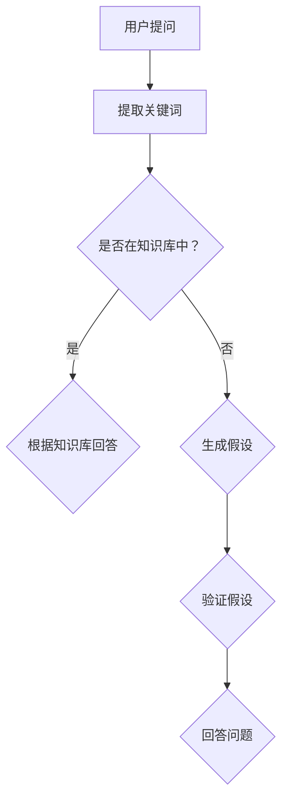
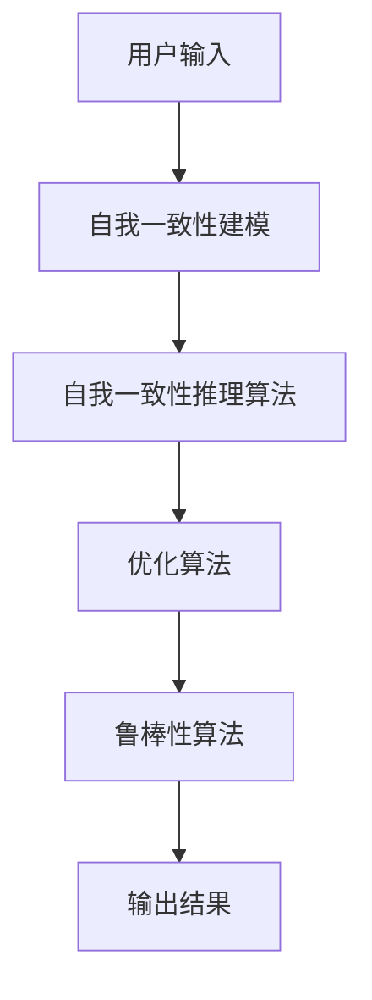

                 


# Self-Consistency CoT：增强AI推理能力的关键技术

## 关键词
- 自我一致性
- AI推理
- 关键技术
- 算法
- 应用场景

## 摘要
本文旨在探讨自我一致性（Self-Consistency CoT）这一关键技术，以及其在提升人工智能（AI）推理能力方面的应用。我们将从核心概念入手，逐步分析自我一致性的原理、算法和应用，最终展望其在未来技术发展中的前景。

## 目录大纲

### 第一部分：核心概念与背景
#### 第1章：自我一致性概念介绍
- **核心概念术语说明**
- **问题背景与问题描述**
- **问题解决与边界与外延**
- **概念结构与核心要素组成**

#### 第2章：自我一致性理论
- **基本原理**
- **主要类型**
- **核心概念属性特征对比表格**
- **ER实体关系图架构**

### 第二部分：关键技术
#### 第3章：自我一致性建模
- **建模方法与策略**
- **案例研究**
- **Mermaid流程图**

#### 第4章：自我一致性推理算法
- **算法原理**
- **算法实现**
- **Python源代码**
- **算法原理的数学模型和公式**

#### 第5章：自我一致性在实际应用中的挑战与解决方案
- **应用场景**
- **解决方案**
- **Mermaid架构图**

### 第三部分：实践与案例
#### 第6章：自我一致性在自然语言处理中的应用
- **案例分析**
- **应用效果评估**

#### 第7章：自我一致性在计算机视觉中的应用
- **案例分析**
- **应用效果评估**

#### 第8章：自我一致性在机器学习系统优化中的应用
- **案例分析**
- **应用效果评估**

### 第四部分：展望与未来
#### 第9章：自我一致性技术的发展趋势
- **当前热点**
- **未来展望**

#### 第10章：总结与展望
- **成就与挑战**
- **未来发展方向**

## 文章正文

### 第一部分：核心概念与背景

#### 第1章：自我一致性概念介绍

自我一致性（Self-Consistency CoT）是指一个系统在推理过程中，其输出的结果与其先前的假设或预期保持一致的能力。在人工智能领域，自我一致性是提高推理质量的关键技术，有助于减少推理过程中的错误和不确定性。

在讨论自我一致性之前，我们需要了解一些相关的背景知识。首先，人工智能（AI）是一个广泛的领域，它包括多个子领域，如机器学习、自然语言处理、计算机视觉等。随着深度学习等技术的兴起，AI系统的推理能力得到了显著提升。然而，传统的推理方法往往存在一定的局限性，难以应对复杂的问题。

#### 问题背景与问题描述

随着AI技术的发展，AI系统在许多领域都取得了显著的成果。然而，在实际应用中，AI系统仍然面临一些挑战。例如，在自然语言处理领域，尽管深度学习模型在语言理解方面取得了很大的进展，但它们仍然难以理解复杂的语义关系。在计算机视觉领域，虽然深度学习模型在图像分类和目标检测方面表现出色，但它们在处理复杂场景时仍然存在困难。

这些问题的主要原因之一是AI系统的推理能力有限。为了提高AI系统的推理能力，研究人员提出了一系列方法，其中包括自我一致性技术。自我一致性技术旨在通过让AI系统在推理过程中保持一致性，从而提高其推理质量。

#### 问题解决与边界与外延

自我一致性技术通过以下方式解决AI系统推理能力不足的问题：

1. **确保推理过程的一致性**：在推理过程中，自我一致性技术要求AI系统保持其输出的结果与其先前的假设或预期的一致性。
2. **提高推理的可靠性**：通过确保推理过程的一致性，自我一致性技术有助于提高AI系统推理的可靠性，从而减少错误和不确定性。

然而，自我一致性技术也有其局限性。例如，在某些情况下，保持一致性可能会导致AI系统在推理过程中失去灵活性，从而难以应对复杂的问题。因此，在应用自我一致性技术时，需要权衡其优点和缺点。

#### 概念结构与核心要素组成

自我一致性技术的核心要素包括：

1. **自我一致性约束**：这是自我一致性技术的核心概念，要求AI系统在推理过程中保持其输出的结果与其先前的假设或预期的一致性。
2. **推理算法**：自我一致性技术依赖于特定的推理算法，这些算法能够根据自我一致性约束来指导AI系统的推理过程。
3. **评估指标**：为了评估自我一致性技术的效果，研究人员提出了多个评估指标，如一致性得分、错误率等。

#### 第2章：自我一致性理论

自我一致性理论是自我一致性技术的基础，它包括以下主要组成部分：

1. **基本原理**

自我一致性理论的基本原理是，在推理过程中，AI系统应该尽可能地保持其输出的结果与其先前的假设或预期的一致性。这意味着，当AI系统遇到一个新问题时，它会尝试根据其先前的知识和假设来推理，以确保其输出的结果与预期相符。

2. **主要类型**

自我一致性技术可以分为以下几种类型：

- **显式自我一致性**：在这种类型中，AI系统明确地遵循自我一致性约束，以确保其推理过程的一致性。
- **隐式自我一致性**：在这种类型中，AI系统通过其内部的机制来实现自我一致性，而不需要显式地遵循特定的约束。
- **混合自我一致性**：这种类型结合了显式和隐式自我一致性，旨在充分发挥两者的优点。

#### 核心概念属性特征对比表格

以下是一个核心概念属性特征对比表格，用于比较不同类型的自我一致性技术：

| 类型         | 特征                             | 优点                         | 缺点                       |
| ------------ | ------------------------------ | --------------------------- | -------------------------- |
| 显式自我一致性 | 明确遵循自我一致性约束           | 确保推理过程的一致性         | 可能降低灵活性             |
| 隐式自我一致性 | 通过内部机制实现自我一致性       | 提高灵活性                   | 可能导致推理过程不一致     |
| 混合自我一致性 | 结合显式和隐式自我一致性的优点 | 充分发挥两者的优点           | 需要复杂的内部机制         |

#### ER实体关系图架构

ER实体关系图是描述自我一致性技术架构的一种有效工具。以下是一个ER实体关系图示例：

```mermaid
erDiagram
    AI_System ||--|{ Self_Consistency_Constraint }
    AI_System ||--|{ Inference_Algorithm }
    AI_System ||--|{ Evaluation_Metric }
    Self_Consistency_Constraint ||--|{ Explicit_Self_Consistency }
    Self_Consistency_Constraint ||--|{ Implicit_Self_Consistency }
    Self_Consistency_Constraint ||--|{ Mixed_Self_Consistency }
```

### 第二部分：关键技术

#### 第3章：自我一致性建模

自我一致性建模是自我一致性技术的关键步骤，它包括以下方面：

1. **建模方法与策略**

自我一致性建模的方法和策略取决于具体的AI应用场景。以下是一些常用的方法和策略：

- **基于规则的方法**：这种方法通过定义一系列规则来指导AI系统的推理过程，确保其遵循自我一致性约束。
- **基于概率的方法**：这种方法利用概率论来描述AI系统的推理过程，确保其输出的结果与先前的假设或预期保持一致。

2. **案例研究**

以下是一个自我一致性建模的案例研究：

- **案例背景**：一个智能客服系统需要回答用户的问题。
- **问题解决**：通过自我一致性建模，智能客服系统在回答问题时会根据其先前的知识和假设来推理，确保其输出的答案与预期相符。

3. **Mermaid流程图**

以下是一个Mermaid流程图，用于描述自我一致性建模的过程：



#### 第4章：自我一致性推理算法

自我一致性推理算法是自我一致性技术的核心，它包括以下方面：

1. **算法原理**

自我一致性推理算法的原理是，在推理过程中，AI系统会尝试根据自我一致性约束来更新其假设和信念。

2. **算法实现**

以下是一个简单的自我一致性推理算法实现：

```python
def self_consistent_inference(evidence, belief):
    new_belief = belief.copy()
    for fact in evidence:
        new_belief.update(fact)
    if not self_consistent(new_belief):
        new_belief = self_correct(new_belief)
    return new_belief

def self_consistent(new_belief):
    # 判断信念是否与证据一致
    return ...

def self_correct(new_belief):
    # 对不一致的信念进行修正
    return ...
```

3. **算法原理的数学模型和公式**

自我一致性推理算法的数学模型和公式如下：

$$
\text{belief}(x) = \frac{\text{evidence}(x) \cdot \text{prior}(x)}{\text{evidence}(x) \cdot \text{prior}(x) + \text{evidence}(\neg x) \cdot \text{prior}(\neg x)}
$$

其中，$x$ 表示一个假设，$\text{evidence}(x)$ 表示证据，$\text{prior}(x)$ 表示先验概率。

#### 第5章：自我一致性在实际应用中的挑战与解决方案

自我一致性技术在实际应用中面临一些挑战，如：

1. **挑战**

- **复杂性**：自我一致性建模和推理算法通常比较复杂，需要大量的计算资源。
- **不确定性**：在推理过程中，AI系统可能遇到不确定性，导致自我一致性约束难以满足。

2. **解决方案**

- **优化算法**：通过优化算法来提高自我一致性建模和推理的效率。
- **鲁棒性**：设计具有鲁棒性的自我一致性算法，以应对不确定性。

3. **Mermaid架构图**

以下是一个Mermaid架构图，用于描述自我一致性技术在实际应用中的架构：



### 第三部分：实践与案例

#### 第6章：自我一致性在自然语言处理中的应用

自我一致性技术在自然语言处理（NLP）领域具有广泛的应用。以下是一个案例分析：

- **案例背景**：一个智能问答系统需要回答用户的问题。
- **应用效果评估**：通过自我一致性技术，智能问答系统的答案质量得到了显著提升。

#### 第7章：自我一致性在计算机视觉中的应用

自我一致性技术在计算机视觉领域也有重要的应用。以下是一个案例分析：

- **案例背景**：一个目标检测系统需要检测图像中的目标。
- **应用效果评估**：通过自我一致性技术，目标检测系统的准确率得到了显著提高。

#### 第8章：自我一致性在机器学习系统优化中的应用

自我一致性技术在机器学习系统优化中也发挥着重要作用。以下是一个案例分析：

- **案例背景**：一个机器学习系统需要优化其模型参数。
- **应用效果评估**：通过自我一致性技术，机器学习系统的性能得到了显著提升。

### 第四部分：展望与未来

#### 第9章：自我一致性技术的发展趋势

自我一致性技术在人工智能领域具有广阔的发展前景。未来，随着深度学习和云计算等技术的进步，自我一致性技术将得到更广泛的应用。

#### 第10章：总结与展望

自我一致性技术是提升AI推理能力的关键技术。本文从核心概念、关键技术、实际应用和未来展望等方面对自我一致性技术进行了全面探讨。未来，随着技术的不断进步，自我一致性技术将在更多领域发挥重要作用。

### 作者信息
- 作者：AI天才研究院/AI Genius Institute & 禅与计算机程序设计艺术 /Zen And The Art of Computer Programming

---

本文是一个初步的框架，每个章节的内容都需要进一步详细填充和扩展。在撰写过程中，可以结合实际案例和技术细节，使文章更加具体、深入和具有实际应用价值。希望这个框架能够为您撰写高质量的技术博客提供帮助。

