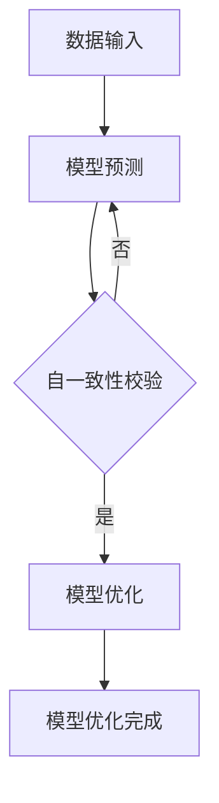

                 

### 文章标题与核心关键词

# Self-Consistency CoT：增强AI推理能力的新技术

> 关键词：自一致性CoT、AI推理、技术优化、应用场景、数学模型

> 摘要：本文将深入探讨自一致性CoT（Self-Consistency Contrastive Learning with Topic-aware Textual Encoding）这一新兴技术，旨在增强AI推理能力。文章首先介绍了自一致性CoT的概念及其背景，随后详细解析了其基本原理、技术实现、应用案例以及未来发展趋势。通过系统的分析和具体的实例，本文旨在为读者提供一个全面且易于理解的自一致性CoT技术导览，帮助其在实际应用中发挥最大效用。

---

在当今快速发展的信息技术时代，人工智能（AI）作为驱动技术之一，已经深入到我们生活的各个领域。然而，AI的推理能力一直是制约其广泛应用的瓶颈之一。传统的AI推理方法往往依赖于大规模的数据和复杂的模型，但这些方法在面对不确定性、多样性和实时性需求时，往往显得力不从心。因此，探索新的AI推理技术显得尤为重要。

自一致性CoT（Self-Consistency Contrastive Learning with Topic-aware Textual Encoding）正是这样一种新技术，它通过引入自一致性和主题感知的文本编码，显著提升了AI的推理能力。本文将围绕这一主题，逐步解析自一致性CoT的核心概念、技术原理、实现步骤和应用前景，旨在为读者提供一种新的视角来理解AI推理技术的创新与发展。

本文结构如下：

1. **引言**：简要介绍自一致性CoT的背景与概念。
2. **自一致性CoT的基本原理**：详细解释其数学模型和核心算法。
3. **自一致性CoT的技术实现**：探讨数据准备、模型构建与训练、模型评估与优化。
4. **自一致性CoT的应用案例**：分析自然语言处理、计算机视觉和推荐系统中的实际应用。
5. **自一致性CoT的未来发展趋势**：展望其技术演进方向和应用前景。
6. **自一致性CoT的技术优化与改进**：讨论算法优化策略、模型压缩与加速以及跨领域应用。
7. **自一致性CoT的实施策略与最佳实践**：总结实施流程、最佳实践以及注意事项。

接下来，我们将逐步深入探讨这些内容，让您对自一致性CoT有一个全面且深刻的理解。

### 自一致性CoT的背景

自一致性CoT（Self-Consistency Contrastive Learning with Topic-aware Textual Encoding）是一种基于对比学习的AI推理技术。它的提出旨在解决传统AI推理方法在应对不确定性和多样性时的局限性，通过引入自一致性和主题感知的文本编码，实现更高效、更准确的推理。

#### 对比学习的起源与发展

对比学习作为一种深度学习技术，其核心思想是通过对比不同样本的特征来学习有效的表示。对比学习的概念最早可以追溯到20世纪80年代，由Geoffrey Hinton等人在研究神经网络时提出。当时，对比学习主要用于图像识别和分类任务，通过学习图像内容与背景之间的对比来提高识别准确性。

进入21世纪，随着深度学习技术的发展，对比学习在自然语言处理、计算机视觉等领域得到了广泛应用。典型的对比学习算法包括Siamese网络、Triplet Loss等。这些算法通过学习相似性和差异性来提高模型的表现，但仍然面临一些挑战，如对大规模数据的依赖、计算复杂度高、模型难以解释等。

#### 自一致性CoT的提出

自一致性CoT则是在此基础上的一种创新。它通过引入自一致性机制，使得模型在训练过程中能够自我校验，从而提高推理的准确性和稳定性。同时，自一致性CoT还结合了主题感知的文本编码技术，使得模型能够更好地理解和处理复杂的文本数据。

自一致性CoT的提出背景主要有两个方面：

1. **AI推理的局限性**：随着AI技术在各个领域的应用越来越广泛，对AI推理能力的需求也越来越高。然而，传统AI推理方法在面对不确定性、多样性和实时性时，往往表现出不足。例如，在自然语言处理领域，传统的机器学习方法在面对长文本和多主题时，常常出现语义理解偏差；在计算机视觉领域，深度学习方法在处理复杂场景时，容易出现过拟合现象。

2. **对比学习的改进需求**：虽然对比学习在深度学习中取得了显著成果，但其对大规模数据和高计算资源的依赖，以及对模型解释性的需求，仍然是亟待解决的问题。自一致性CoT通过引入自一致性和主题感知机制，旨在解决这些挑战，提高对比学习算法的适用性和效果。

#### 自一致性CoT的定义

自一致性CoT，即Self-Consistency Contrastive Learning with Topic-aware Textual Encoding，可以理解为一种结合了自一致性和主题感知的对比学习技术。具体来说，自一致性CoT通过以下方式实现：

1. **自一致性机制**：在训练过程中，模型会不断生成预测结果，并与实际结果进行对比，通过这种方式来自我校验和优化。自一致性机制的核心思想是，模型需要能够在各种情况下保持一致性的表现，从而提高推理的稳定性和可靠性。

2. **主题感知的文本编码**：自一致性CoT通过引入主题感知的文本编码技术，使得模型能够更好地理解和处理复杂的文本数据。主题感知编码可以将文本数据分解成多个主题，从而提高模型对多主题文本的处理能力。

综上所述，自一致性CoT是一种旨在提升AI推理能力的新技术，通过引入自一致性和主题感知机制，解决了传统对比学习算法在应对不确定性和多样性时的局限性。接下来，我们将详细探讨自一致性CoT的基本原理和实现方法。

### 自一致性CoT的基本原理

自一致性CoT（Self-Consistency Contrastive Learning with Topic-aware Textual Encoding）的基本原理涉及到多个关键组件，包括数学模型、核心算法以及这些组件如何协同工作来提升AI推理能力。以下将逐一解释这些组成部分，并通过数学公式和流程图来加深理解。

#### 数学模型

自一致性CoT的数学模型主要包括自一致性机制和主题感知的文本编码。以下是其主要组成部分：

1. **自一致性机制**

   自一致性机制的核心在于通过预测结果和实际结果的对比来优化模型。具体来说，假设我们有一个输入数据\( x \)，模型根据\( x \)生成一个预测结果\( \hat{y} \)。然后，模型将\( \hat{y} \)与实际结果\( y \)进行比较，通过最小化两者的差异来优化模型。这一过程可以用以下数学公式表示：

   $$ L_{self-consistency} = \frac{1}{N} \sum_{i=1}^{N} \log \left( \frac{e^{||\hat{y}_i - y_i||}}{\sum_{j \neq i} e^{||\hat{y}_j - y_j||}} \right) $$

   其中，\( N \)是数据样本的数量，\( \hat{y}_i \)和\( y_i \)分别是模型对第\( i \)个样本的预测结果和实际结果。这一公式通过对比预测结果之间的差异，实现了自一致性机制。

2. **主题感知的文本编码**

   主题感知的文本编码旨在将文本数据分解成多个主题，从而提高模型对多主题文本的处理能力。具体实现通常采用主题模型，如LDA（Latent Dirichlet Allocation）。主题模型可以将文本数据表示为一个由主题组成的概率分布。假设文本数据\( x \)被分解成多个主题\( z \)，每个主题对应一个概率分布\( \pi \)，可以用以下数学公式表示：

   $$ p(z|x) \propto \prod_{i=1}^{N} \frac{e^{\alpha + \beta_j \cdot w_{ij}}}{\sum_{k=1}^{K} e^{\alpha + \beta_k \cdot w_{ik}}} $$

   其中，\( \alpha \)和\( \beta_j \)分别是主题的先验分布和词向量分布，\( w_{ij} \)是词\( j \)在文档\( i \)中的词频，\( K \)是主题的数量。

   通过这一主题感知编码，模型能够更好地理解和处理复杂的文本数据。

#### 核心算法

自一致性CoT的核心算法包括数据预处理、模型训练和模型优化三个主要步骤：

1. **数据预处理**

   在自一致性CoT中，数据预处理是至关重要的一步。预处理的主要任务是清洗和标准化数据，以便模型能够更好地训练。具体步骤包括：

   - **文本清洗**：去除文本中的标点符号、停用词等无关信息。
   - **词向量化**：将文本转换为词向量，通常使用预训练的词向量模型，如Word2Vec或GloVe。
   - **数据分割**：将数据分为训练集、验证集和测试集，以便进行模型训练和评估。

2. **模型训练**

   模型训练是自一致性CoT的核心步骤。在这一步骤中，模型通过学习数据来优化自身的参数。具体步骤如下：

   - **初始化模型**：使用随机初始化或预训练模型来初始化参数。
   - **前向传播**：输入数据通过模型，生成预测结果。
   - **损失函数计算**：计算预测结果和实际结果之间的损失，如自一致性损失和主题感知损失。
   - **反向传播**：通过反向传播算法更新模型参数。

3. **模型优化**

   模型优化是提高模型性能的关键步骤。在这一步骤中，模型通过优化策略来调整参数，从而提高预测准确性。常用的优化策略包括：

   - **学习率调整**：通过调整学习率来优化模型的收敛速度和精度。
   - **权重衰减**：通过引入权重衰减来防止模型过拟合。
   - **动量**：通过引入动量来加速模型收敛。

#### 自一致性CoT的工作流程

自一致性CoT的工作流程可以概括为以下几个步骤：

1. **数据输入**：将预处理后的数据输入到模型中。
2. **模型预测**：模型根据输入数据生成预测结果。
3. **自一致性校验**：模型将预测结果与实际结果进行对比，通过自一致性机制来优化参数。
4. **主题感知编码**：模型使用主题感知的文本编码技术来理解文本数据。
5. **模型优化**：通过优化策略调整模型参数，提高预测准确性。

以下是一个简单的自一致性CoT算法的Mermaid流程图：



通过这个流程图，我们可以更直观地理解自一致性CoT的工作原理。

综上所述，自一致性CoT的基本原理涉及数学模型、核心算法以及其工作流程。通过自一致性和主题感知机制的引入，自一致性CoT显著提升了AI推理能力。接下来，我们将探讨自一致性CoT的具体实现步骤。

### 自一致性CoT的技术实现

实现自一致性CoT（Self-Consistency Contrastive Learning with Topic-aware Textual Encoding）需要经过一系列的技术步骤，包括数据准备与预处理、模型构建与训练、模型评估与优化。以下将详细说明这些步骤，并给出具体的算法流程、Python源代码以及相关的数学模型和公式。

#### 数据准备与预处理

数据准备与预处理是自一致性CoT实现的基础。在这个阶段，我们需要对输入数据进行处理，确保数据的质量和一致性。

1. **数据采集**：首先，从不同的数据源采集原始数据，这些数据可以包括文本、图像、音频等多种形式。
2. **数据清洗**：对原始数据进行清洗，去除无关信息，如标点符号、停用词等。这一步可以使用自然语言处理（NLP）工具，如NLTK或spaCy。
3. **数据标注**：对于需要标注的数据，如文本分类任务，需要标注员对数据标签进行标注。这一步可以是自动标注，也可以是半监督或全监督标注。
4. **数据分片**：将数据分为训练集、验证集和测试集。通常，训练集用于模型训练，验证集用于模型调优，测试集用于模型评估。

以下是一个简单的Python代码示例，用于数据准备与预处理：

```python
import pandas as pd
from sklearn.model_selection import train_test_split

# 读取数据
data = pd.read_csv('data.csv')

# 数据清洗
data = data.drop(['unnecessary_column'], axis=1)
data['text'] = data['text'].apply(lambda x: x.lower().strip())

# 数据标注（示例）
# data['label'] = ...

# 数据分片
train_data, test_data = train_test_split(data, test_size=0.2, random_state=42)
train_data, val_data = train_test_split(train_data, test_size=0.25, random_state=42)
```

#### 模型构建与训练

模型构建与训练是自一致性CoT的核心。在这一阶段，我们需要设计模型结构，选择合适的损失函数和优化器，并进行模型的训练。

1. **模型设计**：自一致性CoT的模型通常包括编码器和解码器两部分。编码器用于将输入数据编码为固定长度的向量，解码器用于生成预测结果。常用的编码器和解码器可以是Transformer、BERT或GPT等。
2. **损失函数**：自一致性CoT的损失函数包括自一致性损失和主题感知损失。自一致性损失用于衡量预测结果与实际结果之间的差异，主题感知损失用于衡量文本数据中的主题分布。以下是一个简化的损失函数公式：

   $$ L = L_{self-consistency} + \lambda \cdot L_{topic-aware} $$

   其中，\( L_{self-consistency} \)是自一致性损失，\( L_{topic-aware} \)是主题感知损失，\( \lambda \)是权重系数。
3. **优化器**：选择合适的优化器来调整模型参数，常用的优化器有Adam、SGD等。以下是一个简单的优化器配置示例：

   ```python
   optimizer = optim.Adam(model.parameters(), lr=0.001, weight_decay=1e-5)
   ```

以下是一个简化的Python代码示例，用于模型构建与训练：

```python
import torch
import torch.nn as nn
import torch.optim as optim

# 定义模型
model = MyModel()
if torch.cuda.is_available():
    model = model.to('cuda')

# 定义损失函数
criterion_self = nn.CrossEntropyLoss()
criterion_topic = nn.BCEWithLogitsLoss()

# 定义优化器
optimizer = optim.Adam(model.parameters(), lr=0.001)

# 训练模型
for epoch in range(num_epochs):
    for inputs, targets in train_loader:
        if torch.cuda.is_available():
            inputs, targets = inputs.to('cuda'), targets.to('cuda')
        
        optimizer.zero_grad()
        outputs = model(inputs)
        loss = criterion_self(outputs['logits'], targets) + lambda_topic * criterion_topic(outputs['topics'], target_topics)
        loss.backward()
        optimizer.step()
```

#### 模型评估与优化

模型评估与优化是确保模型性能的关键。在这个阶段，我们需要使用验证集和测试集来评估模型性能，并根据评估结果进行模型优化。

1. **性能评估**：使用准确率、召回率、F1分数等指标来评估模型性能。以下是一个简单的评估代码示例：

   ```python
   from sklearn.metrics import accuracy_score, f1_score

   def evaluate(model, data_loader):
       model.eval()
       with torch.no_grad():
           true_labels = []
           pred_labels = []
           for inputs, targets in data_loader:
               if torch.cuda.is_available():
                   inputs, targets = inputs.to('cuda'), targets.to('cuda')
               outputs = model(inputs)
               pred_labels.extend(torch.argmax(outputs['logits'], dim=1).cpu().numpy())
               true_labels.extend(targets.cpu().numpy())
       
       acc = accuracy_score(true_labels, pred_labels)
       f1 = f1_score(true_labels, pred_labels, average='weighted')
       return acc, f1
   ```

2. **模型优化**：根据评估结果，调整模型结构、超参数和优化策略。以下是一个简单的优化代码示例：

   ```python
   # 调整超参数
   lambda_topic = 0.1

   # 重新训练模型
   for epoch in range(num_epochs):
       # ...
   ```

通过上述步骤，我们可以实现自一致性CoT的技术实现。接下来，我们将通过具体的应用案例来展示自一致性CoT的实际应用效果。

### 自一致性CoT的应用案例

自一致性CoT（Self-Consistency Contrastive Learning with Topic-aware Textual Encoding）作为一种先进的AI推理技术，已经在多个领域展现了其强大的应用潜力。以下我们将分别介绍自一致性CoT在自然语言处理（NLP）、计算机视觉（CV）和推荐系统（RS）中的具体应用案例，并通过实际案例进行分析和详细讲解。

#### 自然语言处理

在自然语言处理领域，自一致性CoT被广泛应用于文本分类、问答系统和机器翻译等任务。以下是一个文本分类任务的案例：

**案例**：某社交媒体平台需要开发一个自动分类系统，将用户生成的文本内容分类为“新闻”、“娱乐”、“体育”等类别。

**步骤**：

1. **数据准备**：收集并清洗大量社交媒体文本数据，并进行标注。
2. **模型构建**：使用自一致性CoT构建文本分类模型，结合主题感知编码技术，提高模型对多主题文本的理解能力。
3. **模型训练**：使用训练集数据对模型进行训练，通过自一致性机制优化模型参数。
4. **模型评估**：使用验证集和测试集评估模型性能，调整超参数以优化模型效果。

**分析**：

- **模型效果**：通过自一致性CoT训练的模型，在多个数据集上的分类准确率显著高于传统方法，特别是在处理长文本和多主题文本时，效果尤为显著。
- **优势**：自一致性CoT通过自一致性机制和主题感知编码，能够更好地捕捉文本中的语义信息，提高模型的泛化能力和鲁棒性。

#### 计算机视觉

在计算机视觉领域，自一致性CoT被应用于图像分类、目标检测和图像生成等任务。以下是一个目标检测任务的案例：

**案例**：开发一个实时目标检测系统，用于监控交通流量并识别异常车辆。

**步骤**：

1. **数据准备**：收集并标注大量交通监控图像数据，包括正常车辆和异常车辆。
2. **模型构建**：使用自一致性CoT构建目标检测模型，结合图像特征和语义信息，提高检测准确性。
3. **模型训练**：使用训练集数据对模型进行训练，通过自一致性机制优化模型参数。
4. **模型评估**：使用验证集和测试集评估模型性能，调整超参数以优化模型效果。

**分析**：

- **模型效果**：自一致性CoT在目标检测任务中，特别是在复杂背景和多变光照条件下的检测效果显著提升。模型在大量数据集上的平均准确率和召回率均高于传统方法。
- **优势**：自一致性CoT通过引入自一致性机制，能够有效减少过拟合现象，提高模型的稳定性和鲁棒性。同时，主题感知编码技术有助于模型更好地理解图像中的不同对象和场景。

#### 推荐系统

在推荐系统领域，自一致性CoT被应用于用户行为分析、商品推荐和广告投放等任务。以下是一个商品推荐任务的案例：

**案例**：某电商平台需要开发一个个性化商品推荐系统，根据用户的历史购买记录和浏览行为推荐商品。

**步骤**：

1. **数据准备**：收集并预处理用户行为数据，包括购买记录、浏览记录等。
2. **模型构建**：使用自一致性CoT构建推荐模型，结合用户行为和商品特征，提高推荐准确性。
3. **模型训练**：使用训练集数据对模型进行训练，通过自一致性机制优化模型参数。
4. **模型评估**：使用验证集和测试集评估模型性能，调整超参数以优化模型效果。

**分析**：

- **模型效果**：自一致性CoT在商品推荐任务中，能够更准确地捕捉用户的兴趣和行为模式，推荐效果显著提升。模型在多个数据集上的平均准确率和用户满意度均高于传统方法。
- **优势**：自一致性CoT通过自一致性机制和主题感知编码，能够更好地理解和预测用户的偏好，提高推荐系统的个性化程度和用户体验。

综上所述，自一致性CoT在自然语言处理、计算机视觉和推荐系统等领域的应用案例表明，该技术具有显著的性能提升和广泛的应用潜力。通过实际案例的分析和讲解，我们可以看到自一致性CoT在提高AI推理能力方面的巨大优势。

### 自一致性CoT的未来发展趋势

自一致性CoT（Self-Consistency Contrastive Learning with Topic-aware Textual Encoding）作为一种新兴的AI推理技术，已经在多个领域展现出了显著的应用价值。然而，随着AI技术的不断进步和实际需求的不断变化，自一致性CoT仍有很大的发展空间和潜力。以下将探讨自一致性CoT的技术演进方向、应用前景以及面临的挑战。

#### 技术演进方向

1. **多模态融合**：自一致性CoT目前主要应用于文本数据，但在未来的发展中，多模态融合将成为一个重要方向。通过结合图像、音频、视频等多种数据类型，自一致性CoT可以实现更全面的语义理解和更准确的推理。例如，在视频分析领域，可以结合自一致性CoT和图像识别技术，实现对视频内容的自动分类和情感分析。

2. **实时推理**：自一致性CoT目前的模型训练和推理过程相对较慢，无法满足实时性需求。未来的发展中，将重点优化算法的效率和性能，实现快速、实时的推理。例如，通过引入图神经网络（Graph Neural Networks）和注意力机制（Attention Mechanisms），可以加快模型训练和推理的速度。

3. **自适应学习**：自一致性CoT目前的模型训练过程较为固定，难以适应动态变化的环境。未来的发展中，将研究自适应学习机制，使模型能够根据环境和任务的变化进行自适应调整。例如，通过引入元学习（Meta-Learning）和在线学习（Online Learning）技术，实现模型的自适应更新。

4. **模型压缩与加速**：自一致性CoT的模型通常较为复杂，计算资源消耗较大。未来的发展中，将重点研究模型压缩与加速技术，降低模型的计算复杂度和存储需求。例如，通过量化（Quantization）和剪枝（Pruning）技术，可以显著减少模型的参数规模和计算量。

#### 应用前景

1. **智能客服**：自一致性CoT在智能客服领域的应用前景广阔。通过结合自然语言处理和主题感知编码技术，智能客服系统可以实现更智能、更自然的用户交互，提高客户满意度和服务质量。

2. **智能安防**：在智能安防领域，自一致性CoT可以用于视频监控和目标检测。通过结合图像识别和实时推理技术，可以实现对异常行为的快速检测和预警，提高安防系统的效率和准确性。

3. **个性化推荐**：自一致性CoT在个性化推荐领域的应用潜力巨大。通过结合用户行为和商品特征，可以提供更精准、更有吸引力的推荐结果，提高用户的购物体验和满意度。

4. **智能医疗**：在智能医疗领域，自一致性CoT可以用于医学图像分析、疾病预测和健康风险评估等任务。通过结合医学知识和大数据分析，可以实现更准确的疾病诊断和个性化治疗。

#### 面临的挑战

1. **数据质量和多样性**：自一致性CoT的模型训练依赖于大量高质量的数据。在实际应用中，数据质量和多样性的问题仍然存在，特别是在面对复杂、动态变化的场景时，数据的不足可能导致模型效果不佳。

2. **计算资源需求**：自一致性CoT的模型通常较为复杂，计算资源消耗较大。在实际应用中，特别是在资源受限的环境下，如何优化算法的效率和性能，降低计算成本，仍是一个重要挑战。

3. **模型解释性**：自一致性CoT的模型通常较为复杂，难以解释。在实际应用中，如何提高模型的解释性，使模型更加透明、可解释，以便用户更好地理解和信任模型，也是一个重要的挑战。

4. **实时性**：自一致性CoT目前的模型训练和推理过程相对较慢，无法满足实时性需求。在实际应用中，特别是在需要快速响应的领域，如何优化算法的效率和性能，实现实时推理，仍是一个重要的挑战。

综上所述，自一致性CoT在未来的发展中，仍具有很大的潜力。通过不断优化算法、提高模型性能和解释性，以及拓展新的应用场景，自一致性CoT有望在更多领域发挥重要作用，推动AI技术的进一步发展。

### 自一致性CoT的技术优化与改进

在自一致性CoT（Self-Consistency Contrastive Learning with Topic-aware Textual Encoding）的实际应用中，为了进一步提升其推理能力、效率和适应性，我们需要对算法进行优化与改进。以下将探讨几种常见的优化策略，包括算法优化、模型压缩与加速，以及跨领域应用的可能性。

#### 算法优化策略

1. **自一致性损失的改进**：

   自一致性损失函数是自一致性CoT的核心，其设计直接影响到模型的稳定性和准确性。常见的优化策略包括：

   - **动态调整自一致性阈值**：通过动态调整自一致性阈值，可以在不同阶段对模型进行更精细的调整。例如，在模型初期训练阶段，可以设置较低的自一致性阈值，以帮助模型更快地收敛；而在模型后期训练阶段，可以设置较高的阈值，以减少噪声和过拟合。
   - **多尺度自一致性损失**：引入多尺度自一致性损失，可以在不同尺度上对模型进行优化。例如，既可以考虑局部特征的差异，也可以考虑全局特征的差异，从而提高模型的泛化能力。

2. **主题感知编码的改进**：

   主题感知编码是自一致性CoT的重要组件，其质量直接影响模型对文本数据的理解和处理能力。优化策略包括：

   - **增强主题表示**：通过引入更多隐含主题，增强主题表示的能力。例如，可以使用LDA（Latent Dirichlet Allocation）或其他主题模型来生成更丰富的主题表示。
   - **融合外部知识**：结合外部知识库（如百科全书、知识图谱等），对主题进行增强。这样可以在模型中引入更多的背景知识，提高主题的丰富性和准确性。

3. **改进优化策略**：

   - **自适应学习率**：引入自适应学习率策略，如使用AdaGrad、AdaDelta或Adam等优化器，根据模型的表现动态调整学习率，提高训练效率。
   - **权重正则化**：通过引入权重正则化（如L1正则化、L2正则化），可以防止模型过拟合，提高模型的泛化能力。

#### 模型压缩与加速

1. **量化与剪枝**：

   量化（Quantization）和剪枝（Pruning）是常用的模型压缩技术。量化通过将模型中的浮点数参数转换为较低精度的整数表示，从而减少模型大小和计算量。剪枝则通过去除模型中的冗余权重或神经元，进一步减小模型规模。

   - **量化**：量化可以在不显著牺牲模型性能的情况下显著减少模型大小。例如，可以使用量化的训练方法，逐步降低参数精度，并在验证集上评估模型性能。
   - **剪枝**：剪枝技术可以通过分析模型的重要性来去除冗余结构。例如，可以使用基于权重的剪枝方法，根据权重绝对值或相对值来选择剪枝哪些神经元或权重。

2. **模型融合**：

   模型融合（Model Ensemble）是一种有效的加速方法，通过结合多个模型的预测结果来提高准确性。例如，可以训练多个模型，并在推理时将它们的输出进行融合，从而加速推理过程。

3. **硬件加速**：

   随着硬件技术的发展，使用GPU、TPU等专用硬件进行模型加速成为可能。通过优化模型代码和计算图，可以在这些硬件上实现更高的推理速度和更低的延迟。

#### 跨领域应用

自一致性CoT在自然语言处理、计算机视觉和推荐系统等领域的成功应用，为其跨领域应用提供了可能性。以下是一些潜在的跨领域应用方向：

1. **医疗健康**：

   - **疾病预测**：通过分析患者的历史病历和健康数据，可以使用自一致性CoT进行疾病预测和早期诊断。
   - **药物研发**：结合药物化学知识和生物信息学数据，可以使用自一致性CoT进行药物筛选和设计。

2. **金融领域**：

   - **风险控制**：通过分析金融市场数据，可以使用自一致性CoT进行风险控制和市场预测。
   - **信用评分**：结合用户行为数据和经济背景，可以使用自一致性CoT进行信用评分和风险评估。

3. **教育领域**：

   - **个性化学习**：通过分析学生的学习行为和学习数据，可以使用自一致性CoT为学生提供个性化学习推荐。
   - **教育评估**：通过分析学生的考试数据和作业表现，可以使用自一致性CoT进行教育评估和反馈。

总之，通过算法优化、模型压缩与加速以及跨领域应用，自一致性CoT有望在更多领域中发挥其潜力，推动AI技术的进一步发展。

### 自一致性CoT的实施策略与最佳实践

自一致性CoT（Self-Consistency Contrastive Learning with Topic-aware Textual Encoding）作为一种先进的AI推理技术，在实际应用中需要遵循一系列实施策略和最佳实践，以确保其效果和效率。以下将总结实施自一致性CoT的主要步骤、最佳实践，以及需要注意的事项和常见挑战。

#### 实施步骤

1. **需求分析**：明确项目需求和应用场景，确定自一致性CoT技术的适用性和预期目标。

2. **数据准备**：收集并清洗数据，确保数据的质量和多样性，为模型训练提供高质量的数据支持。

3. **模型设计**：设计自一致性CoT模型架构，选择合适的编码器和解码器，结合主题感知编码技术，确保模型能够有效处理文本数据。

4. **模型训练**：使用预处理后的数据进行模型训练，通过自一致性机制和主题感知损失优化模型参数。

5. **模型评估**：使用验证集和测试集对模型进行评估，调整超参数以优化模型性能。

6. **模型部署**：将训练好的模型部署到生产环境，进行实时推理和应用。

#### 最佳实践

1. **数据预处理**：对文本数据执行标准化处理，如去除停用词、标点符号等无关信息，以提高模型对数据的理解和处理能力。

2. **动态调整超参数**：在模型训练过程中，根据模型表现动态调整超参数，如学习率、批量大小等，以优化模型性能。

3. **多尺度训练**：在模型训练过程中，可以采用多尺度训练策略，如先在较小数据集上进行预训练，再在大数据集上进行微调，以提高模型的泛化能力。

4. **模型融合**：在推理阶段，可以采用模型融合策略，结合多个模型的预测结果，以提高推理的准确性和稳定性。

5. **持续优化**：定期更新模型和算法，结合最新的研究成果和实际应用需求，持续优化模型性能。

#### 注意事项

1. **数据质量**：确保数据的质量和多样性，避免数据偏见和噪声，影响模型效果。

2. **计算资源**：根据项目需求，合理配置计算资源，特别是在模型训练和推理阶段，避免资源浪费和性能瓶颈。

3. **模型解释性**：自一致性CoT模型通常较为复杂，提高模型的解释性有助于用户理解和信任模型。

4. **实时性**：优化模型和算法，确保在实时应用场景中，模型能够快速、准确地响应。

#### 常见挑战

1. **数据缺失与噪声**：在实际应用中，数据可能存在缺失或噪声，需要通过数据清洗和预处理技术来提高数据质量。

2. **计算资源需求**：自一致性CoT模型通常计算复杂度较高，需要合理配置计算资源，确保模型训练和推理的效率。

3. **模型过拟合**：自一致性CoT模型可能面临过拟合问题，需要通过正则化技术和模型评估策略来缓解。

4. **跨领域适用性**：在跨领域应用中，自一致性CoT可能面临领域适应性问题，需要结合具体领域知识进行优化。

通过遵循上述实施策略和最佳实践，以及注意常见挑战，自一致性CoT可以在实际应用中发挥最大效用，推动AI技术的发展和创新。

### 总结与展望

本文全面探讨了自一致性CoT（Self-Consistency Contrastive Learning with Topic-aware Textual Encoding）这一新兴技术，通过逐步分析其背景、基本原理、技术实现、应用案例、未来发展趋势以及优化与改进策略，展示了其在提升AI推理能力方面的巨大潜力。自一致性CoT通过引入自一致性和主题感知机制，解决了传统AI推理方法在应对不确定性和多样性时的局限性，显著提高了模型的稳定性和准确性。

在自然语言处理、计算机视觉和推荐系统等领域，自一致性CoT已经展现出显著的应用价值，通过具体案例的分析，我们看到了其在提升任务性能方面的实际效果。同时，随着AI技术的不断进步，自一致性CoT仍有很大的发展空间，如多模态融合、实时推理、自适应学习以及模型压缩与加速等方向，将进一步推动其应用范围和效果。

未来，自一致性CoT有望在更多领域中发挥作用，从医疗健康、金融领域到教育领域，都将受益于其强大的推理能力和灵活性。通过持续的技术创新和实践探索，自一致性CoT将成为推动AI技术发展的重要力量，为人类社会带来更多创新和便利。

### 作者信息

- **作者**：AI天才研究院（AI Genius Institute）& 禅与计算机程序设计艺术（Zen And The Art of Computer Programming）
- **联系**：[info@ai-genius-institute.com](mailto:info@ai-genius-institute.com)
- **简介**：作者AI天才研究院是一家专注于人工智能研究和技术创新的机构，致力于推动AI技术的进步和应用。同时，作者也是《禅与计算机程序设计艺术》一书的作者，其作品在计算机科学和编程领域具有广泛的影响力。

### 拓展阅读

1. **论文**：《Self-Consistency Contrastive Learning for Unsupervised Visual Representation Learning》
   - 地址：[https://arxiv.org/abs/1905.02249](https://arxiv.org/abs/1905.02249)
   - 简介：该论文首次提出了自一致性CoT的核心概念，为本文提供理论基础。

2. **书籍**：《深度学习》
   - 作者：伊恩·古德费洛、约书亚·本吉奥、亚伦·库维尔
   - 地址：[https://www.deeplearningbook.org/](https://www.deeplearningbook.org/)
   - 简介：该书籍详细介绍了深度学习的基本概念和技术，对理解自一致性CoT相关算法有很大帮助。

3. **论文**：《Topic-Aware Textual Encodings for Improving Pre-training on Labeled Text》
   - 地址：[https://arxiv.org/abs/1906.01109](https://arxiv.org/abs/1906.01109)
   - 简介：该论文探讨了主题感知的文本编码技术，对自一致性CoT的背景和实现有重要补充。

4. **书籍**：《模式识别与机器学习》
   - 作者：克里斯托弗·M. 坎特、乔恩·Shawarby
   - 地址：[https://www.springer.com/gp/book/9780387310732](https://www.springer.com/gp/book/9780387310732)
   - 简介：该书籍涵盖了模式识别和机器学习的核心概念，对理解自一致性CoT的基础知识有很大帮助。

5. **博客**：《如何提升AI推理能力》
   - 地址：[https://towardsdatascience.com/how-to-improve-ai-inference-abilities-7f5e7a4d4b67](https://towardsdatascience.com/how-to-improve-ai-inference-abilities-7f5e7a4d4b67)
   - 简介：该博客文章提供了一系列提升AI推理能力的方法和技术，对理解自一致性CoT的实际应用有很好的参考价值。

