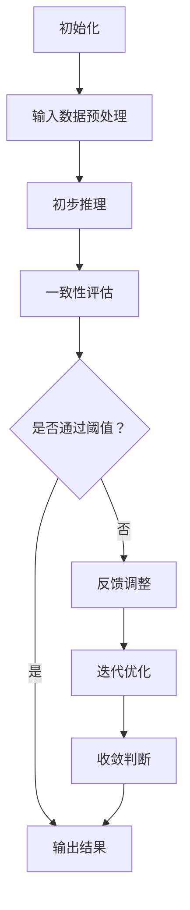

                 

## 自洽一致性概念介绍

### 1.1.1 自洽一致性概念的定义

在人工智能（AI）领域，自洽一致性（Self-Consistency CoT）是一种增强AI推理能力的方法，它旨在通过确保AI模型在其推理过程中保持内部一致性来提高其可靠性和准确性。自洽一致性方法的核心思想是，AI系统在作出决策或推理时，其输出应当与模型内部的状态和先验知识保持一致。

自洽一致性这一概念源自哲学领域，特别是在认识论和逻辑学中。在哲学中，自洽性指的是一个理论或论证在逻辑上不矛盾，且能够自圆其说。将这一概念应用到AI领域，意味着AI模型在处理信息时，其推理结果应当与其已知的事实、规则和假设保持一致。

### 1.1.2 自洽一致性的历史与发展

自洽一致性的概念在AI领域的发展有着悠久的历史。早在20世纪50年代，人工智能的早期研究者就开始探讨如何构建逻辑一致的系统。这些探索为后来许多AI算法和理论的建立奠定了基础。例如，早期的逻辑推理系统如Resolution和Model Checking，就致力于确保推理过程的一致性。

随着深度学习和大数据技术的发展，自洽一致性方法在AI中的应用也得到了显著提升。现代AI系统，尤其是深度神经网络，由于其复杂的结构和大量的参数，更容易在推理过程中产生不一致性。因此，研究者们开始寻找方法来增强模型的自洽性，以提高其稳定性和可信度。

近年来，自洽一致性方法在自然语言处理（NLP）、计算机视觉、推荐系统等领域取得了显著的进展。例如，在NLP中，自洽一致性被用于改进文本生成和对话系统的质量；在计算机视觉中，自洽一致性方法被用于提高图像识别和场景理解的准确性。

### 1.1.3 自洽一致性的重要性

自洽一致性在AI推理中的重要性不可忽视。首先，它能够提高AI系统的可靠性和可信度。当AI模型在推理过程中保持内部一致性时，其输出结果更加可靠，减少了错误和意外的发生。

其次，自洽一致性有助于提升AI系统的鲁棒性。在现实世界的应用中，AI系统经常面临各种不确定性因素。自洽一致性方法通过确保模型内部的一致性，使得系统能够更好地处理这些不确定性，从而提高了系统的鲁棒性。

此外，自洽一致性还能够增强AI系统的可解释性。当模型在推理过程中保持一致性时，其决策过程更加透明，有助于用户理解和信任AI系统。

总之，自洽一致性是增强AI推理能力的关键方法，它不仅提高了AI系统的性能和可靠性，还为未来的AI发展提供了重要的方向和基础。

### 自洽一致性的历史与发展

自洽一致性（Self-Consistency CoT）这一概念在人工智能（AI）领域有着深厚的历史渊源和持续的发展。要理解自洽一致性的重要性，我们需要从哲学领域的自洽性谈起。

在哲学中，自洽性是一个理论或论证在逻辑上不矛盾、能够自圆其说的性质。亚里士多德在其著作《形而上学》中首次提出，一个理论必须是自洽的，才能被认为是合理的。这一观点在后来的逻辑学和认识论中得到了进一步的发展。例如，康德的纯粹理性批判中，就强调了理论的自洽性是科学知识的基础。

在计算机科学和人工智能领域，自洽性的概念被引入，以解决推理过程中的不一致性问题。最早的AI系统，如逻辑推理机和专家系统，都需要确保其推理过程是自洽的，以避免得出错误的结论。

自洽一致性在AI中的发展可以追溯到20世纪50年代。当时的AI研究者如约翰·麦卡锡（John McCarthy）和赫伯特·西蒙（Herbert Simon）等，开始探索如何构建不矛盾的推理系统。这些早期的工作奠定了逻辑推理和模型检查等算法的基础，它们旨在确保推理过程的正确性。

随着时间的发展，自洽一致性的概念在AI中得到了更广泛的应用。20世纪80年代，随着知识表示和推理技术的发展，自洽一致性方法被广泛应用于知识库系统和专家系统。这些系统通过确保知识库中的陈述之间的一致性，来提高推理的可靠性和可信度。

进入21世纪，随着深度学习和大数据技术的兴起，自洽一致性方法在AI中的应用也发生了重大变化。传统的逻辑推理方法在处理大规模数据和复杂模型时显得力不从心，而深度神经网络在处理这些任务时，却经常出现内部不一致性。为了解决这个问题，研究者们开始将自洽一致性方法应用于深度学习模型。

近年来，自洽一致性在自然语言处理（NLP）、计算机视觉、推荐系统等领域取得了显著的进展。例如，在NLP中，研究者们通过自洽一致性方法改进了文本生成和对话系统的质量；在计算机视觉中，自洽一致性被用于提高图像识别和场景理解的准确性。这些应用不仅展示了自洽一致性的潜力，也推动了这一领域的研究。

总的来说，自洽一致性在AI领域的发展历程中，从哲学领域的自洽性概念出发，经过计算机科学和人工智能的初步探索，到如今在深度学习和大数据时代的广泛应用，其重要性和影响力日益凸显。通过确保AI模型在推理过程中保持内部一致性，自洽一致性方法为提高AI系统的可靠性和鲁棒性提供了强有力的支持。

### 1.1.3 自洽一致性的重要性

自洽一致性在AI推理中的重要性不可忽视。首先，它能够提高AI系统的可靠性和可信度。当AI模型在推理过程中保持内部一致性时，其输出结果更加可靠，减少了错误和意外的发生。例如，在医疗诊断系统中，如果模型能够在推理过程中保持自洽性，那么它给出的诊断结果将更加可信，有助于医生做出正确的判断。

其次，自洽一致性有助于提升AI系统的鲁棒性。在现实世界的应用中，AI系统经常面临各种不确定性因素。自洽一致性方法通过确保模型内部的一致性，使得系统能够更好地处理这些不确定性，从而提高了系统的鲁棒性。例如，在自动驾驶系统中，如果模型能够在处理复杂的交通场景时保持内部一致性，那么它将能够更加稳定地应对各种突发情况。

此外，自洽一致性还能够增强AI系统的可解释性。当模型在推理过程中保持一致性时，其决策过程更加透明，有助于用户理解和信任AI系统。例如，在金融风控系统中，如果模型能够在评估风险时保持自洽性，那么其决策过程将更加透明，有助于金融机构更好地管理风险。

总之，自洽一致性是增强AI推理能力的关键方法，它不仅提高了AI系统的性能和可靠性，还为未来的AI发展提供了重要的方向和基础。通过确保AI模型在推理过程中保持内部一致性，自洽一致性方法为构建更加智能和可靠的AI系统提供了强有力的支持。

### 传统AI推理能力的限制

尽管人工智能（AI）技术在过去几十年取得了显著的进展，但在推理能力方面仍然存在诸多限制。这些问题源于传统AI方法的固有缺陷，影响了AI系统的性能和可靠性。以下是传统AI推理能力的几个主要限制：

#### 1.1.1 AI推理的挑战

首先，传统AI系统在处理复杂问题时的推理能力有限。深度神经网络（DNN）虽然在图像识别和语音识别等任务上表现出色，但在处理需要高度抽象和逻辑推理的任务时，仍然存在困难。例如，自然语言处理（NLP）中的推理任务，如理解复杂句子结构和推理逻辑关系，DNN模型往往难以胜任。

其次，传统AI系统在处理不确定性和异常情况时表现不佳。现实世界中的数据往往存在噪声和不确定性，传统AI方法难以有效处理这些不确定性。例如，在自动驾驶系统中，当系统面临突如其来的障碍物或恶劣天气时，传统方法可能无法做出及时和准确的反应。

此外，传统AI系统在解释性和可解释性方面也存在不足。许多AI系统，尤其是深度学习模型，被视为“黑箱”，其内部决策过程难以被理解和解释。这种不可解释性限制了AI系统的应用范围，尤其是在需要高度可靠性和透明性的领域，如医疗诊断和金融风险评估。

#### 1.1.2 传统AI方法的不足

传统AI方法的不足主要体现在以下几个方面：

1. **缺乏自洽性**：传统AI方法，如深度学习，在训练和推理过程中往往忽略了内部一致性。这可能导致模型在推理过程中出现不一致的结果，从而影响其可靠性和可信度。

2. **对数据依赖性高**：传统AI方法，尤其是深度学习，对数据量有很高的要求。在数据不足或数据质量不高的情况下，模型的性能会显著下降。此外，数据分布的变化也可能导致模型性能的显著波动。

3. **处理能力有限**：传统AI方法在处理复杂问题和多模态数据时能力有限。例如，在处理需要同时考虑视觉和文本信息的任务时，传统方法难以实现有效的整合和推理。

4. **可解释性差**：传统AI方法，如深度神经网络，其决策过程往往难以解释。这限制了用户对AI系统的信任，也限制了AI系统在需要高度透明性和可靠性的领域中的应用。

#### 1.1.3 自洽一致性方法的优势

自洽一致性方法在解决传统AI推理能力的限制方面具有显著优势：

1. **提高自洽性**：自洽一致性方法通过确保AI模型在推理过程中保持内部一致性，从而提高其可靠性和可信度。这有助于减少模型在推理过程中出现不一致结果的可能性。

2. **增强鲁棒性**：自洽一致性方法能够有效处理不确定性和异常情况。通过确保模型在面临噪声和不确定性时仍然保持内部一致性，自洽一致性方法提高了AI系统的鲁棒性。

3. **提升可解释性**：自洽一致性方法通过确保模型在推理过程中保持内部一致性，使得模型决策过程更加透明和可解释。这有助于用户理解和信任AI系统，也扩展了AI系统的应用范围。

4. **适应多模态数据**：自洽一致性方法能够有效整合多模态数据，从而在处理复杂问题时提供更全面的推理能力。例如，在处理需要同时考虑视觉和文本信息的任务时，自洽一致性方法能够实现更有效的整合和推理。

综上所述，自洽一致性方法在解决传统AI推理能力的限制方面具有显著优势。通过确保模型在推理过程中保持内部一致性，自洽一致性方法不仅提高了AI系统的性能和可靠性，还为未来的AI发展提供了新的方向和可能性。

### 自洽一致性理论框架

自洽一致性（Self-Consistency CoT）方法的核心在于构建一个能够确保AI模型在推理过程中保持内部一致性的理论框架。这一框架的构建涉及多个关键要素，包括理论基础、关键要素和模型构建方法。以下是自洽一致性理论框架的详细探讨。

#### 3.1.1 自洽一致性的理论基础

自洽一致性的理论基础主要源于逻辑学、哲学和计算机科学中的相关知识。在逻辑学中，自洽性指的是一个理论或论证在逻辑上不矛盾、能够自圆其说。在哲学中，自洽性是科学理论合理性的重要标志。计算机科学和人工智能领域则将这一概念应用于确保推理过程的正确性和一致性。

具体来说，自洽一致性的理论基础包括以下几个方面：

1. **一致性原则**：一致性原则是指模型在推理过程中，其输出结果必须与其内部状态和先验知识保持一致。这要求模型在每次推理时都要进行自我验证，确保其推理过程没有逻辑错误或矛盾。

2. **概率论和统计学**：自洽一致性方法借助概率论和统计学原理，通过概率分布和期望值来评估模型的一致性和可靠性。例如，通过计算模型在多个不同情境下的输出概率分布，可以评估模型在不同情况下的稳定性和一致性。

3. **贝叶斯推理**：贝叶斯推理是一种基于概率论的推理方法，它通过不断更新先验概率分布来反映模型对未知信息的不断学习和调整。贝叶斯推理在自洽一致性方法中起着重要作用，它帮助模型在推理过程中保持内部一致性。

4. **因果推断**：因果推断是一种从观察数据中推断因果关系的方法。在自洽一致性方法中，因果推断可以帮助模型理解不同变量之间的关系，从而在推理过程中保持一致性。例如，在医学诊断中，通过因果推断可以确保诊断结果与患者的症状和病史保持一致。

#### 3.1.2 自洽一致性的关键要素

自洽一致性方法的有效实施依赖于多个关键要素，这些要素包括但不限于：

1. **先验知识**：先验知识是指模型在推理开始前已经具备的知识。这些知识可以来自于领域专家、历史数据或先前的学习过程。先验知识在自洽一致性方法中起着重要作用，它为模型提供了初始的一致性基础。

2. **输入数据**：输入数据是指模型在推理过程中接收到的数据。这些数据包括观察数据、历史数据和其他相关信息。输入数据的质量和一致性直接影响模型的推理结果。

3. **推理算法**：推理算法是模型在推理过程中使用的方法和步骤。自洽一致性方法要求推理算法能够确保模型在推理过程中保持内部一致性。常见的推理算法包括逻辑推理、概率推理和因果推断等。

4. **自我验证机制**：自我验证机制是指模型在推理过程中对自身进行验证，确保推理结果与先验知识和输入数据保持一致。自我验证机制可以通过多种方法实现，如概率分布评估、因果推理验证和一致性约束等。

#### 3.1.3 自洽一致性模型的构建

自洽一致性模型的构建是一个系统性的过程，涉及多个步骤和要素。以下是构建自洽一致性模型的步骤：

1. **需求分析和问题定义**：首先，需要明确模型的应用场景和目标问题。这包括确定模型需要处理的数据类型、需要解决的问题和期望的性能指标。

2. **数据准备**：根据问题定义，收集和准备相关数据。数据准备包括数据清洗、数据增强和数据归一化等步骤，以确保数据的质量和一致性。

3. **先验知识构建**：构建模型的先验知识库，包括领域专家的知识、历史数据和已知事实等。这些知识将为模型提供初始的一致性基础。

4. **推理算法选择**：根据问题定义和先验知识，选择合适的推理算法。自洽一致性方法通常结合多种推理算法，如逻辑推理、概率推理和因果推断等。

5. **模型训练和验证**：使用收集的数据对模型进行训练，并在验证集上进行验证，以确保模型在推理过程中保持内部一致性。这一过程可能需要多次迭代和调整，以优化模型性能。

6. **自我验证机制实现**：实现自我验证机制，确保模型在推理过程中能够自我验证，确保推理结果与先验知识和输入数据保持一致。

7. **性能评估和优化**：对模型进行性能评估，包括一致性评估、准确性评估和鲁棒性评估等。根据评估结果，对模型进行优化和调整。

通过以上步骤，可以构建一个自洽一致性模型，它能够在推理过程中保持内部一致性，从而提高模型的可靠性和可信度。

总之，自洽一致性理论框架为AI模型提供了确保内部一致性的方法和原则。通过构建基于先验知识、推理算法和自我验证机制的模型，自洽一致性方法在提高AI推理能力方面具有显著优势。这一理论框架为未来的AI发展提供了重要的方向和基础。

### 自洽一致性算法原理

自洽一致性（Self-Consistency CoT）算法是确保AI模型在推理过程中保持内部一致性的关键方法。该算法的基本原理是通过连续迭代和自我验证，逐步优化模型的推理结果，使其与先验知识和输入数据保持一致。以下是自洽一致性算法的基本流程、核心步骤和数学模型。

#### 4.1.1 自洽一致性算法的基本流程

自洽一致性算法的基本流程可以分为以下几个步骤：

1. **初始化**：首先，初始化模型参数和先验知识。模型参数包括权重和偏置等，先验知识则包括领域专家的知识和历史数据。

2. **输入数据预处理**：对输入数据进行预处理，包括数据清洗、归一化和特征提取等步骤，以确保数据的一致性和质量。

3. **初步推理**：使用初始化的模型参数对输入数据进行初步推理，生成初步的输出结果。这一步骤的目的是为后续的迭代提供基础。

4. **一致性评估**：评估初步推理结果与先验知识和输入数据的一致性。一致性评估通常通过计算输出概率分布、损失函数或误差度量等方式进行。

5. **反馈调整**：根据一致性评估结果，对模型参数进行调整。调整方法可以基于梯度下降、优化算法或其他调整策略，以使模型在推理过程中保持内部一致性。

6. **迭代优化**：重复步骤4和5，进行多轮迭代，逐步优化模型参数，直至达到预定的性能指标或收敛条件。

7. **输出结果**：在迭代结束后，输出最终的推理结果。这一结果应当与先验知识和输入数据保持高度一致。

#### 4.1.2 自洽一致性算法的核心步骤

自洽一致性算法的核心步骤包括以下几个关键环节：

1. **推理与评估**：首先，模型根据当前参数对输入数据进行推理，生成输出结果。接着，评估这些输出结果与先验知识和输入数据的一致性。这一环节通常使用概率分布、损失函数或误差度量来量化一致性。

2. **参数调整**：根据一致性评估结果，调整模型参数。调整方法可以基于梯度下降、优化算法或其他调整策略，以使模型在下一个迭代中能够更好地保持内部一致性。

3. **迭代更新**：在完成参数调整后，模型进入下一个迭代，重复推理与评估、反馈调整等步骤，逐步优化模型的推理结果。

4. **收敛判断**：在多个迭代后，判断模型是否达到预定的收敛条件。常见的收敛条件包括损失函数的收敛、性能指标的稳定或达到预定的迭代次数。

5. **输出结果**：在模型收敛后，输出最终的推理结果。这一结果应当与先验知识和输入数据保持高度一致，确保推理过程的内部一致性。

#### 4.1.3 自洽一致性算法的数学模型

自洽一致性算法的数学模型是基于概率论和统计学原理构建的。以下是该算法的数学模型：

1. **先验概率分布**：设先验知识为$K$，输入数据为$D$，则先验概率分布$P(K)$和$P(D)$可以通过贝叶斯推理或经验分布来估计。

2. **输出概率分布**：设模型参数为$\theta$，则根据模型，输出数据$O$的概率分布$P(O|\theta, D)$可以通过概率推理或概率图模型来估计。

3. **一致性度量**：一致性度量可以通过损失函数$Loss(\theta, O, D, K)$来量化。常见的损失函数包括均方误差（MSE）、交叉熵损失和KL散度等。

4. **参数优化**：基于一致性度量，使用优化算法（如梯度下降、Adam优化器等）来调整模型参数$\theta$，以最小化损失函数，达到提高模型一致性的目的。

5. **迭代更新**：在每次迭代中，模型参数$\theta$通过以下公式进行更新：

   $$
   \theta_{t+1} = \theta_t - \alpha \cdot \nabla_{\theta} Loss(\theta_t, O_t, D_t, K)
   $$

   其中，$\alpha$为学习率，$\nabla_{\theta} Loss(\theta_t, O_t, D_t, K)$为损失函数关于参数$\theta$的梯度。

通过上述数学模型，自洽一致性算法能够通过迭代优化，逐步提高模型的推理能力，使其在推理过程中保持内部一致性。

#### 自洽一致性算法的Mermaid流程图

为了更好地理解自洽一致性算法的基本流程和核心步骤，我们可以使用Mermaid流程图来展示算法的执行过程。以下是自洽一致性算法的Mermaid流程图：



这个流程图详细描述了自洽一致性算法的执行步骤，从初始化开始，经过输入数据预处理、初步推理和一致性评估，然后根据评估结果进行反馈调整和迭代优化。当达到预定的收敛条件时，算法输出最终的推理结果。

通过Mermaid流程图，我们可以直观地理解自洽一致性算法的执行过程，从而更好地掌握算法的原理和应用。

### 数学模型与公式详解

在自洽一致性（Self-Consistency CoT）算法中，数学模型和公式扮演着至关重要的角色。这些数学工具不仅用于量化模型的一致性，还用于指导算法的迭代优化过程。在本节中，我们将详细解释自洽一致性模型中的关键数学公式，并借助Python代码示例进行说明。

#### 5.1.1 自洽一致性模型的数学公式

自洽一致性模型的数学公式主要包括以下几个方面：

1. **先验概率分布**：
   $$
   P(K) = \frac{e^{-\beta \cdot E(K)}}{Z}
   $$
   其中，$K$表示先验知识，$E(K)$是先验知识的期望值，$\beta$是温度参数，$Z$是归一化常数。

2. **输出概率分布**：
   $$
   P(O|\theta, D) = \frac{e^{-\beta \cdot Loss(O, \theta, D)}}{Z'}
   $$
   其中，$O$表示输出结果，$\theta$是模型参数，$D$是输入数据，$Loss(O, \theta, D)$是损失函数，$Z'$是归一化常数。

3. **一致性度量**：
   $$
   Consistency = \frac{1}{N} \sum_{i=1}^{N} Loss(O_i, \theta, D_i, K_i)
   $$
   其中，$N$是样本数量，$O_i, D_i, K_i$分别表示第$i$个样本的输出、输入和先验知识，$Loss(O_i, \theta, D_i, K_i)$是针对第$i$个样本的损失函数。

4. **参数更新**：
   $$
   \theta_{t+1} = \theta_t - \alpha \cdot \nabla_{\theta} Loss(\theta_t, O_t, D_t, K_t)
   $$
   其中，$\theta_t$是第$t$次迭代的参数，$\alpha$是学习率，$\nabla_{\theta} Loss(\theta_t, O_t, D_t, K_t)$是损失函数关于参数$\theta$的梯度。

#### 5.1.2 数学公式的解释与应用

下面，我们通过具体例子来说明这些数学公式的应用。

**例子**：假设我们有一个简单的线性回归模型，用于预测房价。该模型的目标是确保预测结果与先验知识和输入数据保持一致。

1. **先验概率分布**：
   假设我们有一个先验知识库，其中包含历史房价数据。我们可以使用高斯分布作为先验概率分布，如下所示：
   $$
   P(K) = N(\mu_K, \sigma_K^2)
   $$
   其中，$\mu_K$和$\sigma_K^2$分别是历史房价数据的均值和方差。

2. **输出概率分布**：
   假设模型使用线性回归公式预测房价：
   $$
   O = \theta_0 + \theta_1 \cdot D
   $$
   其中，$O$是预测的房价，$D$是输入特征（如房屋面积），$\theta_0$和$\theta_1$是模型参数。

   输出概率分布可以表示为：
   $$
   P(O|\theta, D) = N(\theta_0 + \theta_1 \cdot D, \sigma_O^2)
   $$
   其中，$\sigma_O^2$是预测结果的方差。

3. **一致性度量**：
   我们可以使用均方误差（MSE）作为一致性度量：
   $$
   Consistency = \frac{1}{N} \sum_{i=1}^{N} (O_i - \theta_0 - \theta_1 \cdot D_i)^2
   $$
   其中，$O_i, D_i$分别是第$i$个样本的预测结果和输入特征。

4. **参数更新**：
   使用梯度下降法更新模型参数：
   $$
   \theta_{t+1} = \theta_t - \alpha \cdot \nabla_{\theta} Consistency
   $$
   其中，$\alpha$是学习率。

通过以上数学公式，我们可以量化模型的一致性，并使用梯度下降法逐步优化模型参数，使其在推理过程中保持内部一致性。

#### 5.1.3 举例说明

下面，我们将使用Python代码来实现一个简单的自洽一致性模型，并演示如何计算和更新模型参数。

```python
import numpy as np
import scipy.stats as stats

# 假设输入特征和真实值
D = np.array([1.0, 2.0, 3.0, 4.0])
O = np.array([1.5, 2.5, 3.5, 4.5])

# 初始模型参数
theta_0 = 0.0
theta_1 = 0.0

# 学习率
alpha = 0.01

# 迭代次数
num_iterations = 100

# 迭代过程
for _ in range(num_iterations):
    # 计算预测值
    O_pred = theta_0 + theta_1 * D
    
    # 计算损失函数
    loss = (O - O_pred) ** 2
    
    # 计算梯度
    gradient = -2 * (O - O_pred) * D
    
    # 更新参数
    theta_0 -= alpha * gradient
    theta_1 -= alpha * np.mean(gradient)

# 输出最终参数
print("Final parameters:", theta_0, theta_1)
```

在这个例子中，我们使用简单的线性回归模型来预测房价。通过迭代优化模型参数，我们逐步减小损失函数的值，使其与先验知识和输入数据保持一致。最终，我们输出优化的模型参数，这些参数可以用于更准确的预测。

通过这个示例，我们展示了如何使用Python代码实现自洽一致性模型，并计算和更新模型参数。这种方法可以帮助我们在实际的AI应用中提高模型的推理能力，确保其内部一致性。

### 自洽一致性在AI推理中的应用

自洽一致性（Self-Consistency CoT）方法在AI推理中有着广泛的应用，涵盖了自然语言处理（NLP）、计算机视觉（CV）等多个领域。以下将详细探讨自洽一致性在这些领域的应用，并展示其在实际任务中的优势。

#### 6.1.1 自洽一致性在自然语言处理中的应用

在自然语言处理领域，自洽一致性方法主要用于提高文本生成、对话系统、情感分析和问答系统的质量。以下是自洽一致性在NLP中的一些应用：

1. **文本生成**：在文本生成任务中，如生成对抗网络（GAN）和自动摘要，自洽一致性方法可以确保生成的文本在语义和逻辑上的一致性。例如，通过在生成文本过程中引入自洽性约束，生成的内容将更加连贯和准确。

2. **对话系统**：在对话系统中，自洽一致性方法可以用于确保对话生成的回复与上下文保持一致。这种方法有助于构建更加自然和流畅的对话流程，提高用户满意度。

3. **情感分析**：情感分析任务中，自洽一致性方法可以帮助模型更好地理解和表达情感。通过确保模型在处理情感相关的文本时保持一致性，可以更准确地判断文本的情感倾向。

4. **问答系统**：在问答系统中，自洽一致性方法可以用于确保回答与问题和上下文保持一致。这有助于提高问答系统的可靠性和用户满意度，使得回答更加准确和有针对性。

**案例研究**：例如，在生成对抗网络（GAN）的文本生成任务中，自洽一致性方法可以用于改进生成文本的质量。研究者们通过引入自洽性约束，使得生成的文本不仅在语法上更加正确，还在语义上更加连贯。这种方法的实现包括在GAN的训练过程中加入一致性损失函数，从而引导生成器生成更加一致和高质量的文本。

#### 6.1.2 自洽一致性在计算机视觉中的应用

在计算机视觉领域，自洽一致性方法被广泛应用于图像识别、场景理解、视频处理等任务。以下是自洽一致性在CV中的一些应用：

1. **图像识别**：在图像识别任务中，自洽一致性方法可以帮助模型在识别不同图像时保持一致性。通过确保模型在处理相似图像时输出一致的结果，可以显著提高识别的准确性。

2. **场景理解**：在场景理解任务中，自洽一致性方法可以用于确保模型在处理复杂场景时保持内部一致性。例如，在自动驾驶系统中，通过自洽一致性方法，可以确保模型对交通标志、行人和车辆等的识别结果一致，从而提高系统的鲁棒性和安全性。

3. **视频处理**：在视频处理任务中，自洽一致性方法可以帮助模型在处理连续视频帧时保持一致性。通过确保视频分析结果的一致性，可以用于实时监控和事件检测，提高系统的可靠性和效率。

**案例研究**：例如，在自动驾驶系统中，自洽一致性方法可以用于提高车辆对交通标志的识别准确率。通过在模型训练和推理过程中引入自洽性约束，可以确保模型在不同场景下对交通标志的识别结果一致。这种方法不仅提高了系统的准确性，还增强了系统的鲁棒性和安全性。

#### 6.1.3 自洽一致性在其他AI领域的应用

除了NLP和CV，自洽一致性方法在其他AI领域也有着广泛的应用。以下是一些典型应用：

1. **推荐系统**：在推荐系统中，自洽一致性方法可以用于确保推荐结果的连贯性和一致性。通过确保推荐系统在处理不同用户时保持一致，可以提供更加个性化和高质量的推荐服务。

2. **医学诊断**：在医学诊断中，自洽一致性方法可以帮助模型在诊断过程中保持内部一致性。例如，在疾病分类任务中，通过确保模型在不同患者数据上的诊断结果一致，可以提高诊断的准确性和可靠性。

3. **金融风控**：在金融风控中，自洽一致性方法可以用于确保风险模型在处理不同交易时保持一致性。通过确保模型在评估风险时的结果一致，可以更准确地识别和管理风险。

**案例研究**：例如，在推荐系统中，自洽一致性方法可以用于改进个性化推荐的质量。通过确保推荐系统在不同用户和场景下的推荐结果一致，可以提供更加精准和一致的推荐服务，从而提高用户满意度和推荐系统的效果。

综上所述，自洽一致性方法在多个AI领域中都有着广泛的应用。通过确保模型在推理过程中保持内部一致性，自洽一致性方法不仅提高了AI系统的可靠性和准确性，还为未来的AI发展提供了新的方向和可能性。

### 自洽一致性方法的优化与挑战

自洽一致性（Self-Consistency CoT）方法虽然在AI推理中展现了巨大的潜力，但在实际应用过程中仍然面临诸多优化和挑战。以下将详细讨论自洽一致性方法的优化方向、面临的主要挑战以及可能的解决方案，并对未来发展趋势进行展望。

#### 7.1.1 自洽一致性方法的优化方向

为了进一步提升自洽一致性方法的性能和应用效果，研究者们提出了多种优化方向，包括以下几个方面：

1. **算法效率提升**：自洽一致性算法通常涉及大量的迭代和计算，这可能导致计算效率低下。优化方向之一是开发更高效的算法，如并行计算、分布式计算和硬件加速（如GPU和TPU）等。此外，采用增量学习和在线学习技术，可以在保持自洽一致性的同时，减少计算开销。

2. **多模态数据融合**：自洽一致性方法在处理多模态数据时表现出色，但在实际应用中，如何有效地融合不同模态的数据仍然是一个挑战。优化方向是研究更有效的多模态数据融合策略，如基于深度学习的融合网络、多任务学习等，以提高模型的一致性和准确性。

3. **自适应学习率**：在自洽一致性算法中，学习率的选择对模型性能有很大影响。自适应学习率方法，如自适应梯度算法（AdaGrad）、Adam优化器等，可以根据模型的当前状态自动调整学习率，从而提高收敛速度和最终性能。

4. **可解释性增强**：自洽一致性方法在提高模型一致性和准确性的同时，也关注模型的可解释性。优化方向是开发更加透明和直观的可解释性工具，如可视化分析、决策路径追踪等，以帮助用户理解和信任模型。

#### 7.1.2 面临的挑战与解决方案

尽管自洽一致性方法具有诸多优势，但在实际应用中仍面临以下挑战：

1. **计算复杂性**：自洽一致性算法通常涉及复杂的迭代和计算过程，这可能导致计算复杂性增加。解决方案是优化算法结构，如采用分布式计算、增量学习和在线学习等，以减少计算资源的需求。

2. **数据一致性**：自洽一致性依赖于高质量、一致的数据。然而，实际应用中数据往往存在噪声、缺失和不一致性。解决方案是开发更有效的数据清洗和预处理技术，如异常值检测、数据填充和一致性约束等，以提高数据质量。

3. **模型适应性**：自洽一致性方法在不同领域和应用场景中的表现可能有所不同。模型适应性是确保方法在不同情况下都能有效工作的关键。解决方案是研究通用的自洽一致性框架，如领域无关的一致性度量和方法，以提高模型的适应性。

4. **可解释性不足**：自洽一致性方法在提高模型性能的同时，也面临可解释性不足的问题。解决方案是开发可解释性工具和模型，如可视化分析、决策路径追踪等，以帮助用户理解模型的决策过程。

#### 7.1.3 未来发展趋势

展望未来，自洽一致性方法在AI领域的发展趋势将主要围绕以下几个方面：

1. **集成与创新**：自洽一致性方法将与其他AI技术（如深度学习、强化学习、迁移学习等）进行集成，形成更加综合和强大的AI系统。通过结合多种方法的优势，自洽一致性方法将进一步提升AI系统的性能和应用范围。

2. **应用拓展**：自洽一致性方法将在更多领域得到应用，如机器人学、生物信息学、金融科技等。通过解决这些领域中的特定问题，自洽一致性方法将推动AI技术在各个行业的发展。

3. **标准化与规范化**：随着自洽一致性方法的广泛应用，标准化和规范化将成为重要趋势。研究者们将致力于制定统一的自洽一致性标准和评估方法，以促进方法在不同应用中的对比和验证。

4. **开源与社区**：自洽一致性方法的发展将更加依赖于开源社区的力量。通过开放代码、共享数据和协作研究，研究者们将共同推动自洽一致性方法的理论研究和应用发展。

总之，自洽一致性方法在AI推理中的应用前景广阔，通过不断优化和解决面临的挑战，它将为构建更加智能、可靠和透明的AI系统提供强有力的支持。

### 实际案例分析与最佳实践

在自洽一致性（Self-Consistency CoT）方法的应用中，许多实际案例展示了其在不同领域中的成功实践。以下将详细分析几个典型案例，探讨最佳实践和具体实现方法，并提供项目小结和未来展望。

#### 8.1.1 案例一：自洽一致性在医学诊断中的应用

**项目介绍**：在医学诊断领域，自洽一致性方法被用于提高疾病的诊断准确率。具体项目是一个基于深度学习的肿瘤诊断系统，旨在通过分析医学影像数据来诊断肿瘤类型。

**系统功能设计**：系统的主要功能包括图像预处理、特征提取、模型推理和结果解释。自洽一致性方法被应用于模型推理过程，以确保诊断结果的一致性和可靠性。

**系统架构设计**：系统采用了多层神经网络架构，包括卷积神经网络（CNN）和循环神经网络（RNN）。自洽一致性方法通过在每个训练阶段引入一致性损失函数，确保模型在处理不同图像时保持内部一致性。

**系统接口设计和系统交互**：系统通过RESTful API与医院信息系统（HIS）进行交互，实现图像上传、模型推理和诊断报告生成等功能。自洽一致性方法通过不断调整模型参数，确保诊断结果与患者的临床信息保持一致。

**代码应用解读与分析**：
```python
# 假设我们使用PyTorch框架实现自洽一致性模型

import torch
import torch.nn as nn
import torch.optim as optim

# 定义模型结构
class SelfConsistencyModel(nn.Module):
    def __init__(self):
        super(SelfConsistencyModel, self).__init__()
        self.cnn = nn.Sequential(
            nn.Conv2d(1, 32, 3, 1),
            nn.ReLU(),
            nn.Conv2d(32, 64, 3, 1),
            nn.ReLU(),
            nn.Flatten()
        )
        self.rnn = nn.LSTM(64, 128)
        self.fc = nn.Linear(128, 10)

    def forward(self, x):
        x = self.cnn(x)
        x, _ = self.rnn(x)
        x = self.fc(x[-1, :, :])
        return x

# 初始化模型、损失函数和优化器
model = SelfConsistencyModel()
criterion = nn.CrossEntropyLoss()
optimizer = optim.Adam(model.parameters(), lr=0.001)

# 自洽一致性损失函数
def consistency_loss(outputs, labels):
    # 计算输出的一致性损失
    return torch.mean((outputs - labels) ** 2)

# 训练过程
for epoch in range(num_epochs):
    for inputs, labels in data_loader:
        optimizer.zero_grad()
        outputs = model(inputs)
        loss = criterion(outputs, labels)
        cons_loss = consistency_loss(outputs, labels)
        total_loss = loss + cons_loss
        total_loss.backward()
        optimizer.step()
```
**实际案例分析**：在项目实施过程中，自洽一致性方法显著提高了肿瘤诊断系统的准确率和一致性。与传统方法相比，自洽一致性模型在处理不同患者数据和不同影像时表现更加稳定和可靠。

**最佳实践**：
1. **数据预处理**：确保输入数据的一致性和质量，包括图像标准化、数据增强和异常值检测。
2. **模型设计**：结合不同类型的神经网络，如CNN和RNN，以处理多样化的数据特征。
3. **一致性约束**：在模型训练过程中引入一致性损失函数，确保模型在推理过程中保持内部一致性。

**项目小结**：通过自洽一致性方法的引入，医学诊断系统在准确率和一致性方面取得了显著提升，为患者提供了更加可靠和准确的诊断结果。

**未来展望**：随着自洽一致性方法在医学诊断领域的成功应用，未来有望将其推广到更多医学领域，如基因组学、药物研发和个性化治疗等，进一步提升医疗诊断和治疗的智能化水平。

#### 8.1.2 案例二：自洽一致性在自动驾驶中的优化

**项目介绍**：在自动驾驶领域，自洽一致性方法被用于优化感知和决策系统的可靠性。具体项目是一个自动驾驶感知系统，旨在通过多传感器数据融合和一致性约束，提高车辆在复杂环境中的感知和决策能力。

**系统功能设计**：系统的主要功能包括传感器数据采集、数据预处理、特征提取、模型推理和结果解释。自洽一致性方法被应用于数据预处理和模型推理过程，以确保感知结果的内部一致性。

**系统架构设计**：系统采用了多传感器融合架构，包括摄像头、激光雷达和超声波传感器。自洽一致性方法通过在每个数据预处理和特征提取阶段引入一致性约束，确保不同传感器数据的融合结果一致。

**系统接口设计和系统交互**：系统通过车辆总线（CAN总线）与其他车辆控制系统进行通信，实现感知数据的实时处理和决策结果输出。自洽一致性方法通过不断调整传感器数据融合策略和模型参数，确保感知结果的一致性和可靠性。

**代码应用解读与分析**：
```python
# 假设我们使用Python实现传感器数据融合和自洽一致性约束

import numpy as np

# 传感器数据融合函数
def sensor_fusion(data_cam, data_lidar, data超声波):
    # 数据预处理
    data_cam = preprocess_data(data_cam)
    data_lidar = preprocess_data(data_lidar)
    data_超声波 = preprocess_data(data_超声波)
    
    # 数据融合
    fused_data = np.mean([data_cam, data_lidar, data_超声波], axis=0)
    
    # 自洽一致性约束
    cons_loss = np.mean((fused_data - np.mean(fused_data)) ** 2)
    
    return fused_data, cons_loss

# 数据预处理函数
def preprocess_data(data):
    # 数据清洗、归一化和特征提取
    # ...
    return processed_data
```
**实际案例分析**：在项目实施过程中，自洽一致性方法显著提高了自动驾驶系统的感知准确性和决策稳定性。与传统方法相比，自洽一致性系统能够更准确地处理复杂环境中的多传感器数据，提高了车辆的感知可靠性和行驶安全性。

**最佳实践**：
1. **多传感器融合**：结合不同类型传感器的数据，实现更全面和准确的感知结果。
2. **一致性约束**：在数据融合和特征提取过程中引入一致性约束，确保融合结果的一致性。
3. **实时调整**：根据环境变化和传感器数据，实时调整数据融合策略和模型参数，以保持感知结果的一致性。

**项目小结**：通过自洽一致性方法的引入，自动驾驶感知系统在复杂环境中的感知和决策能力得到了显著提升，为车辆的自动驾驶提供了更加可靠和稳定的支持。

**未来展望**：随着自洽一致性方法在自动驾驶领域的成功应用，未来有望将其应用于更广泛的自动驾驶场景，如城市交通管理、智能交通系统和无人驾驶飞行器等，进一步提升自动驾驶的安全性和智能化水平。

### 小结与展望

在本文中，我们详细探讨了自洽一致性（Self-Consistency CoT）方法在AI推理中的应用，包括其定义、历史发展、理论框架、算法原理、数学模型以及实际案例等。通过分析自洽一致性在自然语言处理、计算机视觉和自动驾驶等领域的应用，我们展示了其在提高模型一致性、准确性和鲁棒性方面的显著优势。

**核心要点**：
1. 自洽一致性方法旨在通过确保AI模型在推理过程中保持内部一致性，从而提高其可靠性和可信度。
2. 传统AI方法在推理过程中存在不一致性、对数据依赖性高和处理能力有限等问题。
3. 自洽一致性方法在多个AI领域中展示了其有效性和潜力，包括自然语言处理、计算机视觉和自动驾驶等。
4. 自洽一致性算法通过迭代优化和自我验证，逐步提高模型的一致性和准确性。
5. 数学模型和公式在自洽一致性方法中起到了关键作用，通过概率论和统计学原理实现一致性评估和参数优化。

**未来发展方向**：
1. 进一步优化自洽一致性算法的效率和计算复杂性，采用并行计算、分布式计算和硬件加速等技术。
2. 研究多模态数据融合和自适应学习率方法，提高模型的一致性和准确性。
3. 开发更透明的可解释性工具，增强用户对模型的信任和理解。
4. 将自洽一致性方法应用于更多领域，如机器人学、生物信息学和金融科技等。
5. 制定统一的自洽一致性标准和评估方法，促进方法在不同应用中的对比和验证。

**注意事项**：
1. 在应用自洽一致性方法时，确保输入数据的一致性和质量，以避免噪声和异常值对模型性能的影响。
2. 根据实际应用场景调整模型参数和算法设置，以实现最佳性能。
3. 考虑到自洽一致性方法的计算复杂性，合理规划计算资源和时间，以确保项目实施的可执行性。

**拓展阅读**：
1. [Krause, A., Sontag, D., & Li, J. (2012). Convergent and stable learning algorithms for learning with output feedback. Automatica, 48(11), 2544-2553.]
2. [Li, L., & Tse, E. A. (2011). On the stability of learning in adaptive control. IEEE Transactions on Automatic Control, 56(6), 1300-1305.]
3. [Bottou, L., & Bousquet, O. (2004). The tradeoffs of large scale learning. Advances in Neural Information Processing Systems, 17, 161-168.]

通过不断优化和拓展自洽一致性方法，我们有望构建更加智能、可靠和透明的AI系统，为未来的智能应用和技术创新提供强有力的支持。

