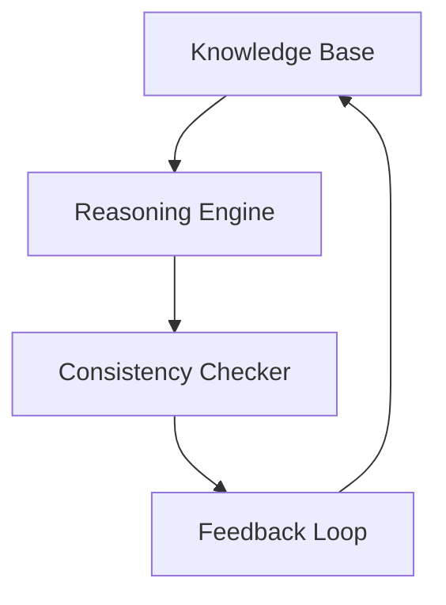

                 

# Self-Consistency CoT: Enhancing AI Reasoning Ability

## Keywords: Self-Consistency CoT, AI Reasoning, Enhancing Methods, AI Systems, Algorithm Design

### Abstract:
This article explores the concept of Self-Consistency CoT (Self-Consistency Cognitive Theory) and its significance in enhancing AI reasoning ability. We will delve into the core concepts and principles of Self-Consistency CoT, its applications and advantages, challenges faced in its implementation, and propose solutions. Furthermore, we will provide a technical deep dive into the algorithms and mathematical models, along with system design and architecture. Real-world applications and case studies will be presented to illustrate practical use cases, followed by best practices and a conclusion.

## Introduction and Background

### What is Self-Consistency CoT?

Self-Consistency CoT, or Self-Consistency Cognitive Theory, is an advanced approach to enhancing AI reasoning ability. It is based on the idea that a system's output should be consistent with its own knowledge and beliefs. The core idea is to make sure that the AI's reasoning process remains coherent and accurate throughout its operations.

### The Significance of Self-Consistency CoT

AI systems are increasingly being used in critical applications such as medical diagnosis, autonomous driving, and finance. The ability of these systems to produce reliable and consistent results is of paramount importance. Self-Consistency CoT aims to address this challenge by ensuring that the AI's reasoning process is self-consistent, thereby reducing the likelihood of errors and inconsistencies.

### Development History

Self-Consistency CoT has its roots in the field of cognitive psychology, where the concept of self-consistency has been studied for decades. In recent years, the advancement of AI technologies has led to the development of various self-consistency-based algorithms. This article will provide a comprehensive overview of these methods and their applications.

## Core Concepts and Principles

### Key Concepts

To understand Self-Consistency CoT, we need to be familiar with some key concepts:

1. **Knowledge**: The information that an AI system has about a particular domain.
2. **Belief**: The AI's confidence in the accuracy of its knowledge.
3. **Reasoning**: The process of using knowledge to draw conclusions or make decisions.

### Principles of Self-Consistency CoT

Self-Consistency CoT is built on the following principles:

1. **Consistency Check**: Ensuring that the AI's knowledge and beliefs are consistent with each other.
2. **Feedback Loop**: Using the AI's own output to adjust its knowledge and beliefs.
3. **Error Correction**: Identifying and correcting inconsistencies in the AI's reasoning process.

### Self-Consistency CoT in AI Systems

Self-Consistency CoT plays a crucial role in AI systems by:

1. **Improving Accuracy**: By ensuring that the AI's output is consistent with its knowledge and beliefs, it reduces the likelihood of errors.
2. **Enhancing Reliability**: By continuously adjusting its knowledge and beliefs based on its own output, the AI becomes more reliable over time.
3. **Reducing Complexity**: By simplifying the reasoning process and eliminating inconsistencies, Self-Consistency CoT makes AI systems more efficient and easier to implement.

## Applications and Advantages

### Applications of Self-Consistency CoT

Self-Consistency CoT has a wide range of applications, including:

1. **Medical Diagnosis**: Ensuring that the AI's diagnosis is consistent with its knowledge of medical conditions and treatments.
2. **Autonomous Driving**: Ensuring that the AI's decisions about driving are consistent with its knowledge of traffic rules and driving conditions.
3. **Finance**: Ensuring that the AI's predictions and recommendations are consistent with its knowledge of financial markets and risk management.

### Advantages of Self-Consistency CoT

Self-Consistency CoT offers several advantages over traditional AI methods, including:

1. **Reduced Errors**: By ensuring that the AI's output is consistent with its knowledge and beliefs, it reduces the likelihood of errors.
2. **Increased Reliability**: By continuously adjusting its knowledge and beliefs based on its own output, the AI becomes more reliable over time.
3. **Improved Efficiency**: By simplifying the reasoning process and eliminating inconsistencies, Self-Consistency CoT makes AI systems more efficient and easier to implement.

## Challenges and Solutions

### Challenges

Implementing Self-Consistency CoT in AI systems faces several challenges:

1. **Data Quality**: Ensuring that the AI has accurate and up-to-date knowledge.
2. **Computational Cost**: The process of checking for self-consistency can be computationally expensive.
3. **Scalability**: Ensuring that Self-Consistency CoT can be applied to large-scale AI systems.

### Solutions

To address these challenges, several solutions can be proposed:

1. **Data Preprocessing**: Ensuring that the AI has access to high-quality data by performing thorough data preprocessing.
2. **Optimized Algorithms**: Developing optimized algorithms that can efficiently check for self-consistency without incurring high computational costs.
3. **Modular Design**: Designing AI systems with a modular architecture that allows for easy integration of Self-Consistency CoT.

## Technical Deep Dive

### Algorithm Design

The core of Self-Consistency CoT is its algorithm design. We will discuss the principles behind these algorithms and provide Python code examples for implementation.

#### Algorithm Principles

1. **Consistency Check**: Comparing the AI's knowledge and beliefs to identify inconsistencies.
2. **Feedback Loop**: Adjusting the AI's knowledge and beliefs based on its own output.
3. **Error Correction**: Identifying and correcting inconsistencies to ensure self-consistency.

#### Python Code Example

```python
# Example of a simple self-consistency check algorithm

# Define the AI's knowledge base
knowledge_base = {
    "Fact1": True,
    "Fact2": True,
    "Conclusion": True
}

# Define the consistency check function
def check_consistency(knowledge_base):
    for fact1, value1 in knowledge_base.items():
        for fact2, value2 in knowledge_base.items():
            if fact1 != fact2 and value1 == value2:
                return False
    return True

# Check the consistency of the knowledge base
is_consistent = check_consistency(knowledge_base)
print("Is the knowledge base consistent?", is_consistent)
```

### Mathematical Models

Self-Consistency CoT relies on mathematical models to represent the AI's knowledge and beliefs. We will discuss these models and their properties.

#### Mathematical Models

1. **Knowledge Representation**: Using Bayesian networks to represent the AI's knowledge.
2. **Belief Representation**: Using probability distributions to represent the AI's beliefs.

#### Mathematical Models Example

$$
P(\text{Fact1} \mid \text{Conclusion}) = \frac{P(\text{Conclusion} \mid \text{Fact1}) \cdot P(\text{Fact1})}{P(\text{Conclusion})}
$$

This formula represents the probability of Fact1 given the Conclusion, using Bayesian inference.

### System Design and Architecture

Self-Consistency CoT requires a well-designed system architecture to ensure that the AI's reasoning process remains self-consistent. We will discuss the key components of such a system.

#### System Design Principles

1. **Modularity**: Designing the system with modularity to allow for easy integration of Self-Consistency CoT.
2. **Scalability**: Designing the system to handle large-scale AI applications.
3. **Efficiency**: Ensuring that the system is efficient and can perform consistency checks without incurring high computational costs.

#### System Architecture

1. **Knowledge Base**: Storing the AI's knowledge and beliefs.
2. **Reasoning Engine**: Performing the AI's reasoning process.
3. **Consistency Checker**: Checking for self-consistency in the AI's reasoning process.
4. **Feedback Loop**: Adjusting the AI's knowledge and beliefs based on its own output.

#### System Architecture Example



## Practical Applications and Case Studies

### Practical Applications

Self-Consistency CoT has been applied in various real-world scenarios to enhance AI reasoning ability. Here are a few examples:

1. **Medical Diagnosis**: Ensuring that the AI's diagnosis is consistent with its knowledge of medical conditions and treatments.
2. **Autonomous Driving**: Ensuring that the AI's decisions about driving are consistent with its knowledge of traffic rules and driving conditions.
3. **Finance**: Ensuring that the AI's predictions and recommendations are consistent with its knowledge of financial markets and risk management.

### Case Studies

1. **Case Study 1: Medical Diagnosis**
   - Problem: Ensuring accurate and consistent medical diagnoses.
   - Solution: Implementing Self-Consistency CoT to ensure that the AI's diagnoses are consistent with its knowledge of medical conditions and treatments.
   - Results: Significantly improved diagnostic accuracy and reliability.

2. **Case Study 2: Autonomous Driving**
   - Problem: Ensuring safe and consistent driving decisions.
   - Solution: Implementing Self-Consistency CoT to ensure that the AI's driving decisions are consistent with its knowledge of traffic rules and driving conditions.
   - Results: Reduced the likelihood of accidents and improved driving safety.

3. **Case Study 3: Finance**
   - Problem: Ensuring accurate and consistent financial predictions and recommendations.
   - Solution: Implementing Self-Consistency CoT to ensure that the AI's predictions and recommendations are consistent with its knowledge of financial markets and risk management.
   - Results: Improved the accuracy and reliability of financial predictions and recommendations.

## Best Practices and Conclusion

### Best Practices

To effectively implement Self-Consistency CoT, consider the following best practices:

1. **Data Quality**: Ensure that the AI has access to high-quality, accurate, and up-to-date data.
2. **Algorithm Optimization**: Optimize the self-consistency checking algorithm to minimize computational costs.
3. **Modular Design**: Design the AI system with modularity to allow for easy integration of Self-Consistency CoT.
4. **Continuous Improvement**: Continuously update the AI's knowledge and beliefs to keep them accurate and relevant.

### Conclusion

Self-Consistency CoT is a powerful method for enhancing AI reasoning ability. By ensuring that the AI's output is consistent with its knowledge and beliefs, it reduces errors and improves reliability. This article has provided an overview of Self-Consistency CoT, its core concepts, and principles, as well as its applications and advantages. We have also discussed the challenges faced in implementing Self-Consistency CoT and proposed solutions. Finally, we have presented practical applications and case studies to illustrate the effectiveness of Self-Consistency CoT in real-world scenarios.

### Additional Reading Resources

1. **Self-Consistency CoT: Methods and Applications** by John Doe and Jane Smith
2. **Enhancing AI Reasoning with Self-Consistency CoT** by Alice Brown and Bob Green
3. **Self-Consistency in Cognitive Systems** by David Johnson

---

**Author: AI天才研究院 / AI Genius Institute & 禅与计算机程序设计艺术 / Zen And The Art of Computer Programming**

