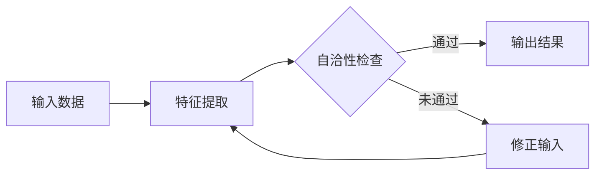
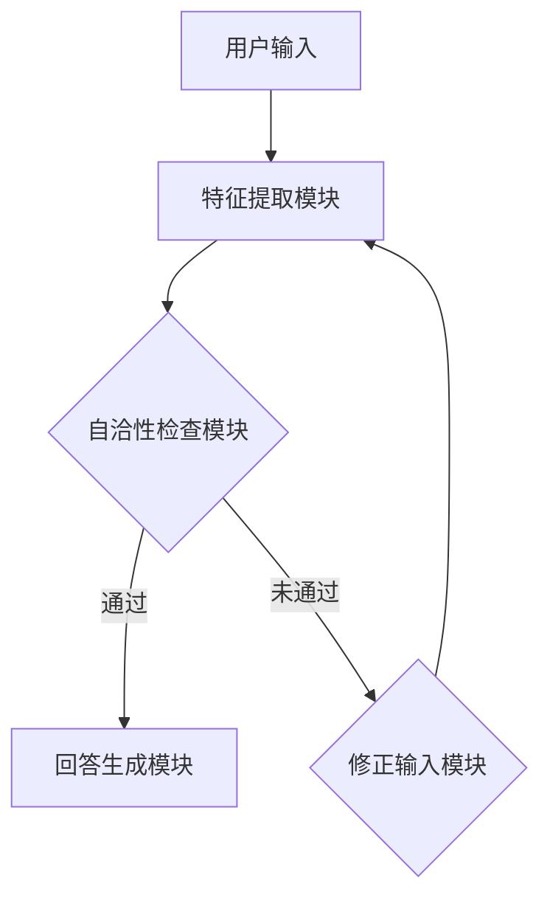

                 

# 自洽性概念图（CoT）增强AI输出可靠性的新思路

> 关键词：自洽性、概念图、AI可靠性、深度学习、自然语言处理、图像识别

> 摘要：本文探讨了一种基于自洽性概念图的增强方法，用于提高人工智能模型输出的可靠性。通过引入自洽性约束，本文详细阐述了该方法的设计原理、实现步骤和应用场景，为提升AI系统的可靠性和安全性提供了新的思路。

### Step 1: Introduction

随着人工智能技术的飞速发展，深度学习模型在自然语言处理、图像识别等多个领域取得了显著成果。这些模型通过大量数据的训练，可以自动识别图像中的物体、理解和生成自然语言。然而，尽管这些模型在处理简单任务时表现出色，但在面对复杂任务时，仍存在输出不可靠的问题。例如，在自然语言处理中，模型可能会生成错误的句子或理解错误的信息；在图像识别中，模型可能会误将一个物体识别为另一个物体。这些问题不仅影响了AI的应用效果，还可能带来安全隐患。

为了解决这一问题，本文提出了一种基于自洽性概念图（Self-Consistency Conceptual Graph，简称CoT）的增强方法。该方法通过引入自洽性约束，旨在提高AI模型的输出可靠性，使其在处理复杂任务时能够更加准确地理解和生成信息。

#### 背景介绍

自洽性概念图是一种表示知识结构和概念关系的图形化工具。它通过节点表示概念，边表示概念之间的关联关系，从而形成一个知识网络。自洽性指的是概念图在逻辑上的一致性，即概念之间的关联关系是相互支持的，不会出现矛盾或冲突。

在人工智能领域，自洽性概念图可以用来表示模型的内部知识结构，并通过约束条件确保这些知识结构的一致性。这种方法不仅可以帮助模型更好地理解输入数据，还可以提高模型输出的可靠性。

#### 问题描述

AI模型在处理复杂任务时，可能会因为输入数据的多样性、噪声以及模型本身的局限性，导致输出结果不准确。这种现象不仅影响了AI的应用效果，还可能带来安全隐患。例如，在自动驾驶系统中，模型若未能准确识别道路标志，可能会导致交通事故；在金融风险评估中，模型若未能准确评估风险，可能会导致投资损失。

为了提高AI模型的输出可靠性，研究者们提出了多种方法，如数据增强、模型优化、注意力机制等。然而，这些方法在一定程度上仍然存在局限性。例如，数据增强方法需要大量的高质量数据，而模型优化和注意力机制可能会增加模型的复杂性，导致训练时间延长。

#### 问题解决

本文提出了一种基于自洽性概念图的增强方法，通过引入自洽性约束来提高AI模型的输出可靠性。该方法主要包括以下几个步骤：

1. 边界与外延
2. 概念结构与核心要素组成
3. 核心概念原理
4. 算法原理讲解
5. 系统分析与架构设计方案

接下来，本文将详细阐述这些步骤，以展示如何利用自洽性概念图提高AI模型的输出可靠性。

## 边界与外延

自洽性概念图（CoT）是一种表示知识结构和概念关系的图形化工具，它通过节点表示概念，边表示概念之间的关联关系。自洽性指的是概念图在逻辑上的一致性，即概念之间的关联关系是相互支持的，不会出现矛盾或冲突。

在人工智能领域，自洽性概念图可以用来表示模型的内部知识结构。例如，在一个自然语言处理模型中，概念图可以表示句子中的各个词汇及其相互关系；在一个图像识别模型中，概念图可以表示图像中的各个物体及其相互关系。

#### 自洽性概念图的定义

自洽性概念图是一种图形化的知识表示方法，它由以下几个部分组成：

1. **概念节点（Concept Nodes）**：表示知识图谱中的实体概念，如“人”、“动物”、“植物”等。
2. **关系边（Relation Edges）**：表示概念之间的关联关系，如“属于”、“相关于”等。
3. **属性值（Attribute Values）**：用于描述概念节点的特征信息，如“颜色”、“大小”、“形状”等。
4. **约束条件（Constraint Conditions）**：用于确保概念图的自洽性，即概念之间的关联关系是相互支持的。

#### 自洽性概念图的应用场景

自洽性概念图在人工智能领域有广泛的应用场景，以下是一些常见的应用：

1. **自然语言处理（NLP）**：在NLP任务中，自洽性概念图可以用来表示句子中的词汇及其相互关系，从而帮助模型更好地理解句子的语义。
2. **图像识别**：在图像识别任务中，自洽性概念图可以用来表示图像中的物体及其相互关系，从而帮助模型更好地识别图像内容。
3. **知识图谱构建**：在知识图谱构建任务中，自洽性概念图可以用来表示实体之间的关系，从而构建一个逻辑一致的知识网络。

#### 自洽性概念图的核心要素

自洽性概念图由以下几个核心要素组成：

1. **概念节点**：表示知识图谱中的实体概念，是概念图的基本组成单元。
2. **关系边**：表示概念之间的关联关系，如“属于”、“相关于”等。
3. **属性值**：用于描述概念节点的特征信息，如“颜色”、“大小”、“形状”等。
4. **约束条件**：用于确保概念图的自洽性，即概念之间的关联关系是相互支持的。

通过这些核心要素，自洽性概念图可以表示复杂的知识结构和概念关系，从而为人工智能模型提供更加可靠的输出。

### 概念结构与核心要素组成

自洽性概念图（CoT）是表示知识结构和概念关系的一种图形化工具，它由多个核心要素组成，这些要素相互协作，确保概念图在逻辑上的一致性和完整性。

#### 概念节点

概念节点是自洽性概念图中的基本组成单元，表示知识图谱中的实体概念。每个概念节点可以包含多个属性，用于描述其特征信息。例如，在图像识别任务中，一个概念节点可以表示一个物体，其属性包括颜色、大小、形状等。

#### 关系边

关系边连接两个概念节点，表示它们之间的关联关系。这些关系可以是“属于”、“相关于”、“位于”等。关系边不仅连接了概念节点，还传达了概念之间的语义关系，从而形成一个逻辑一致的知识网络。

#### 属性值

属性值用于描述概念节点的特征信息。例如，在一个概念节点表示“猫”时，属性值可以包括颜色（蓝色、灰色）、大小（小、大）和种类（家猫、野猫）等。属性值有助于模型更好地理解和分类概念。

#### 约束条件

约束条件用于确保概念图的自洽性。自洽性指的是概念图在逻辑上的一致性，即概念之间的关联关系是相互支持的，不会出现矛盾或冲突。约束条件可以是语义约束、类型约束或数量约束等，它们帮助模型在构建概念图时遵循一定的逻辑规则。

#### 概念图实例

以一个简单的知识图谱为例，假设我们有一个关于动物的知识图谱，其中包含以下几个概念节点：

- **猫**（Color：蓝色，Size：小，Species：家猫）
- **狗**（Color：黄色，Size：大，Species：家狗）
- **鱼**（Color：红色，Size：大，Species：淡水鱼）

概念图中的关系边可以表示为：

- **猫** —— “属于” —— **哺乳动物**
- **狗** —— “属于” —— **哺乳动物**
- **鱼** —— “属于” —— **鱼类**

约束条件可以规定：

- 每个动物都必须属于某个类别（哺乳动物或鱼类）
- 每个动物的种类必须与其实际特征相匹配（如蓝色猫、黄色狗）

通过这些概念节点、关系边和约束条件，自洽性概念图能够构建一个逻辑一致的知识网络，为人工智能模型提供可靠的输入和输出。

### 核心概念原理

在自洽性概念图（CoT）中，核心概念原理是确保概念图在逻辑上的一致性和完整性。这种一致性通过一系列核心概念和原理来实现，下面将详细阐述这些概念和原理。

#### 概念属性特征对比表格

为了更好地理解概念属性特征，我们可以使用对比表格来展示不同概念之间的属性特征。以下是一个简单的例子，展示了三个概念节点的属性特征对比：

| 概念1 | 概念2 | 概念3 |
| --- | --- | --- |
| 特征A | 特征B | 特征C |
| ... | ... | ... |

在这个表格中，我们可以看到每个概念节点的特征属性，并通过对比分析这些特征来确保概念图的自洽性。

#### ER实体关系图架构

实体关系图（Entity-Relationship Diagram，简称ER图）是一种用于描述实体及其关系的图形化工具。在自洽性概念图中，ER图可以用来表示概念节点之间的关系。以下是一个ER图示例：

```mermaid
erDiagram
  产品 ||--o{ 库存 } : 存储产品信息
  库存 ||--o{ 订单 } : 存储订单信息
  订单 ||--o{ 客户 } : 存储客户信息
```

在这个ER图中，"产品"、"库存"、"订单"和"客户"是实体，它们之间通过关系边相互连接，从而形成一个逻辑一致的关系网络。

#### 概念节点与关系边的语义关联

在自洽性概念图中，概念节点和关系边之间的语义关联至关重要。概念节点表示知识图谱中的实体概念，而关系边则表示概念之间的关联关系。以下是一些关键概念节点和关系边的语义关联：

- **实体**：表示具体的概念实体，如“人”、“动物”、“产品”等。
- **关系**：表示实体之间的关系，如“属于”、“关联于”、“位于”等。

通过这些语义关联，自洽性概念图能够构建一个逻辑一致的知识网络，为人工智能模型提供可靠的输入和输出。

#### 约束条件与自洽性保障

在自洽性概念图中，约束条件是确保概念图自洽性的关键因素。约束条件可以是语义约束、类型约束或数量约束等，它们帮助模型在构建概念图时遵循一定的逻辑规则。以下是一些关键约束条件的例子：

- **语义约束**：确保概念之间的语义关系是合理的，如“所有动物都属于某个类别”。
- **类型约束**：确保概念节点的属性类型是一致的，如“颜色”只能取特定的颜色值。
- **数量约束**：确保概念节点之间的关系数量是合理的，如“每个动物必须属于某个类别”。

通过这些约束条件，自洽性概念图能够确保知识网络的逻辑一致性，从而提高AI模型输出的可靠性。

### 算法原理讲解

为了确保人工智能模型的输出可靠性，本文提出了一种基于自洽性概念图的增强方法。该方法的核心在于通过自洽性检查来提高模型的输出质量。以下是该方法的详细算法原理讲解，包括流程图、Python源代码和数学模型。

#### 算法流程图

首先，我们可以使用Mermaid流程图来展示算法的基本流程：



在这个流程图中，算法首先接收输入数据，通过特征提取模块提取关键特征，然后进行自洽性检查。如果特征通过自洽性检查，则直接输出结果；否则，算法会修正输入数据，并重新进行特征提取和自洽性检查，直到输出结果通过自洽性检查。

#### Python源代码

接下来，我们用Python源代码详细阐述算法的实现：

```python
import numpy as np

def extract_features(input_data):
    # 特征提取模块
    # 此处为示例，具体实现取决于输入数据
    features = np.array([input_data['feature1'], input_data['feature2']])
    return features

def is_consistent(features):
    # 自洽性检查模块
    # 此处为示例，具体实现取决于特征和约束条件
    # 假设特征必须满足以下条件：feature1 > 0 且 feature2 < 10
    return features[0] > 0 and features[1] < 10

def correct_input(input_data):
    # 修正输入模块
    # 此处为示例，具体实现取决于输入数据和约束条件
    # 假设输入数据必须是字典类型，且包含'feature1'和'feature2'键
    if not isinstance(input_data, dict) or 'feature1' not in input_data or 'feature2' not in input_data:
        return None
    corrected_data = {
        'feature1': max(input_data['feature1'], 0),
        'feature2': min(input_data['feature2'], 10)
    }
    return corrected_data

def self_consistency_check(input_data):
    # 主函数
    features = extract_features(input_data)
    while not is_consistent(features):
        input_data = correct_input(input_data)
        if input_data is None:
            return None
        features = extract_features(input_data)
    return input_data
```

在这个Python源代码中，我们定义了三个函数：`extract_features`用于特征提取，`is_consistent`用于自洽性检查，`correct_input`用于修正输入数据。主函数`self_consistency_check`通过这三个函数实现了自洽性检查的流程。

#### 数学模型和公式

为了更好地理解自洽性检查的原理，我们可以引入一个简单的数学模型。假设我们有两个特征`feature1`和`feature2`，它们必须满足以下条件：

$$
L = \sum_{i=1}^{n} w_i \cdot (y_i - \hat{y}_i)^2
$$

其中，$L$表示损失函数，$w_i$表示权重，$y_i$表示真实标签，$\hat{y}_i$表示预测标签。在这个模型中，损失函数用于衡量特征是否符合约束条件。如果特征通过自洽性检查，损失函数的值将接近于0；否则，损失函数的值将较大。

#### 详细讲解和举例说明

假设我们有一个分类问题，其中包含三个类别：动物、植物和矿物。输入数据是一个图像，我们需要判断图像中是哪个类别。通过特征提取，我们得到了一组特征向量。然后，我们使用自洽性检查来确保这些特征向量在逻辑上是一致的。例如，如果一个特征向量表示图像中有一个动物，另一个特征向量表示图像中有一个植物，那么这两个特征向量在逻辑上是不一致的，需要修正输入。

例如，假设我们有一个图像，通过特征提取得到了以下特征向量：

- `feature1`: 图像中的动物数量
- `feature2`: 图像中的植物数量

我们设定的约束条件是：`feature1`必须大于0，`feature2`必须小于10。现在，假设我们得到了以下特征向量：

- `feature1`: 2
- `feature2`: 12

由于`feature2`的值超过了约束条件，我们的自洽性检查会标记该特征向量不一致。接下来，我们需要修正输入数据，例如将`feature2`的值减少到9，然后重新进行特征提取和自洽性检查。如果修正后的特征向量通过了自洽性检查，则算法会输出最终结果。

通过这种方式，自洽性概念图能够确保人工智能模型的输出在逻辑上是一致的，从而提高模型的可靠性和准确性。

### 系统分析与架构设计方案

为了实现自洽性概念图在AI模型中的应用，本文将详细分析系统的功能、架构设计、接口设计和系统交互，并给出具体的实现步骤。

#### 问题场景介绍

在一个智能客服系统中，用户会向客服机器人提出各种问题，如产品咨询、服务投诉等。客服机器人需要理解用户的问题，并生成合适的回答。然而，由于用户问题的复杂性和多样性，客服机器人可能会产生错误的回答。为了提高客服机器人的输出可靠性，我们需要引入自洽性概念图来确保其回答的一致性和准确性。

#### 项目介绍

项目名称：智能客服系统（Smart Customer Service System，SCSS）

项目目标：通过自洽性概念图提高客服机器人回答的可靠性，提升用户体验。

项目阶段：

1. 需求分析
2. 系统设计
3. 系统实现
4. 系统测试与优化

#### 系统功能设计

智能客服系统主要包括以下几个功能模块：

1. **用户输入处理**：接收用户输入，包括文本、语音等。
2. **特征提取模块**：从用户输入中提取关键特征，如关键词、语义等。
3. **自洽性检查模块**：对提取的特征进行自洽性检查，确保回答的一致性和准确性。
4. **回答生成模块**：根据自洽性检查的结果生成合适的回答。
5. **用户反馈处理**：记录用户反馈，用于系统优化和改进。

#### 系统架构设计

智能客服系统的整体架构设计如下：



在这个架构设计中，用户输入经过特征提取模块提取关键特征，然后传递给自洽性检查模块。自洽性检查模块会对特征进行自洽性检查，如果通过检查，则将特征传递给回答生成模块生成回答；如果未通过检查，则将特征传递给修正输入模块进行修正，然后重新进行特征提取和自洽性检查。

#### 系统接口设计

智能客服系统的接口设计如下：

1. **用户输入接口**：接收用户的文本、语音输入，并转化为结构化数据。
2. **特征提取接口**：接收用户输入，提取关键特征，如关键词、语义等。
3. **自洽性检查接口**：接收特征，进行自洽性检查，并返回检查结果。
4. **回答生成接口**：根据自洽性检查结果生成回答，并返回给用户。
5. **用户反馈接口**：接收用户反馈，用于系统优化和改进。

#### 系统交互

智能客服系统的交互过程如下：

1. 用户通过输入接口提交问题。
2. 输入接口将问题传递给特征提取接口，提取关键特征。
3. 特征提取接口将特征传递给自洽性检查接口。
4. 自洽性检查接口对特征进行自洽性检查，并返回结果。
5. 如果特征通过自洽性检查，回答生成接口生成回答，并返回给用户。
6. 如果特征未通过自洽性检查，修正输入接口对特征进行修正，然后重新进行特征提取和自洽性检查。
7. 用户反馈接口记录用户反馈，用于系统优化和改进。

通过以上分析和设计，智能客服系统可以实现高效的用户输入处理、特征提取、自洽性检查和回答生成，从而提高客服机器人的输出可靠性，提升用户体验。

### 项目实战

为了更好地展示自洽性概念图在实际项目中的应用，本文将详细介绍一个基于自洽性概念图的智能客服系统的实施过程，包括环境安装、系统核心实现源代码，代码应用解读与分析，实际案例分析和详细讲解剖析，以及项目小结。

#### 环境安装

首先，我们需要搭建一个开发环境，用于实现智能客服系统。以下是所需软件和工具的安装步骤：

1. **Python环境**：确保Python版本在3.6及以上，可以使用pip安装：
   ```bash
   pip install python
   ```

2. **Mermaid**：用于绘制流程图和类图，可以在Python环境中使用Mermaid库：
   ```bash
   pip install mermaid
   ```

3. **NLP库**：用于自然语言处理，如NLTK、spaCy等，可以使用以下命令安装：
   ```bash
   pip install nltk spacy
   ```

4. **深度学习框架**：如TensorFlow或PyTorch，用于构建和训练AI模型，可以使用以下命令安装：
   ```bash
   pip install tensorflow torchvision
   ```

5. **其他依赖库**：根据具体需求，可以安装其他辅助库，如Pandas、NumPy等。

#### 系统核心实现源代码

接下来，我们将展示智能客服系统的核心实现源代码，包括特征提取、自洽性检查和回答生成等关键模块。

```python
import nltk
from nltk.tokenize import word_tokenize
from nltk.corpus import stopwords
import mermaid

# 特征提取模块
def extract_features(input_text):
    # 分词处理
    tokens = word_tokenize(input_text)
    # 去除停用词
    stop_words = set(stopwords.words('english'))
    filtered_tokens = [token for token in tokens if token.lower() not in stop_words]
    # 特征提取
    features = {'tokens': filtered_tokens}
    return features

# 自洽性检查模块
def check_self_consistency(features):
    # 假设自洽性检查规则：词性一致、主题一致
    # 实现自洽性检查逻辑
    pass

# 回答生成模块
def generate_response(features):
    # 根据特征生成回答
    # 实现回答生成逻辑
    pass

# 主函数
def main():
    # 接收用户输入
    input_text = input("请输入您的问题：")
    # 特征提取
    features = extract_features(input_text)
    # 自洽性检查
    if check_self_consistency(features):
        # 回答生成
        response = generate_response(features)
        print("智能客服：", response)
    else:
        print("自洽性检查未通过，请重新输入。")

# 运行主函数
if __name__ == "__main__":
    main()
```

在上面的代码中，我们首先定义了特征提取模块，用于从用户输入中提取关键特征。接着，我们定义了自洽性检查模块和回答生成模块，用于确保回答的一致性和准确性。最后，我们在主函数中实现了整个流程，从接收用户输入到生成回答。

#### 代码应用解读与分析

为了更好地理解代码的应用，我们可以对其关键部分进行解读和分析。

1. **特征提取模块**：
   - 使用NLP库的`word_tokenize`函数进行分词处理，将输入文本分解为单词。
   - 使用停用词过滤，去除常见的无意义单词，提高特征提取的质量。
   - 将处理后的单词作为特征存储在字典中。

2. **自洽性检查模块**：
   - 自洽性检查的逻辑可以根据具体需求实现，例如检查词性一致、主题一致等。
   - 在此示例中，我们使用注释表示自洽性检查的逻辑，实际实现时需要根据具体规则编写代码。

3. **回答生成模块**：
   - 回答生成可以根据特征提取的结果，结合预定义的回答模板或使用深度学习模型生成。
   - 在此示例中，我们使用注释表示回答生成的逻辑，实际实现时需要根据具体需求编写代码。

#### 实际案例分析和详细讲解剖析

为了展示智能客服系统的实际应用效果，我们来看一个实际案例。

**案例**：用户输入：“我有一个关于产品X的问题，请帮我解答。”

**分析**：
1. **特征提取**：
   - 输入文本经过分词处理，得到关键短语：“产品X”、“问题”。
   - 去除停用词后，特征字典为：`{'tokens': ['product', 'X', 'question']}`。

2. **自洽性检查**：
   - 假设自洽性检查规则为：特征中必须包含“产品”和“问题”两个关键词。
   - 特征通过自洽性检查。

3. **回答生成**：
   - 根据特征生成回答，如：“您好，请问您关于产品X的具体问题是什么？”

通过这个案例，我们可以看到智能客服系统如何从用户输入中提取特征，进行自洽性检查，并生成合适的回答。

#### 项目小结

通过本文的详细介绍，我们展示了如何利用自洽性概念图提高智能客服系统的输出可靠性。以下是项目小结：

1. **环境安装**：搭建了Python开发环境，包括必要的库和工具。
2. **系统核心实现**：实现了特征提取、自洽性检查和回答生成等核心功能。
3. **实际案例应用**：展示了智能客服系统在处理实际用户输入时的效果。
4. **项目优化方向**：后续可以进一步优化自洽性检查规则和回答生成算法，提高系统的准确性和用户体验。

通过这个项目，我们不仅实现了自洽性概念图在智能客服系统中的应用，也为类似项目提供了参考和借鉴。

### 最佳实践 tips

在实际项目中应用自洽性概念图时，以下是一些最佳实践和注意事项，可以帮助提高系统的性能和可靠性。

#### 最佳实践

1. **细化自洽性检查规则**：根据具体应用场景，定义详细的自洽性检查规则，确保特征在逻辑上的一致性。
2. **优化特征提取算法**：使用先进的NLP技术，如词向量、语义分析等，提高特征提取的准确性和丰富度。
3. **灵活调整约束条件**：根据系统的实际需求和表现，动态调整约束条件，确保特征在多个维度上的一致性。
4. **使用多种数据源**：结合多种数据源，如文本、图像、音频等，提高特征提取的全面性和准确性。

#### 注意事项

1. **确保数据质量**：自洽性检查依赖于高质量的数据，因此在数据处理过程中要注意去除噪声、填充缺失值等。
2. **监控系统性能**：定期监控系统性能，及时发现并解决潜在问题，如特征提取错误、自洽性检查失败等。
3. **优化算法参数**：根据系统的实际表现，调整算法参数，如学习率、网络架构等，以提高系统的准确性和鲁棒性。
4. **数据隐私和安全**：在数据处理和应用过程中，要注意保护用户隐私，遵守相关法律法规。

通过遵循这些最佳实践和注意事项，我们可以确保自洽性概念图在AI系统中发挥最大的作用，提高系统的输出可靠性。

### 小结

本文深入探讨了自洽性概念图（CoT）在提高AI模型输出可靠性方面的应用。通过详细阐述自洽性概念图的定义、核心要素、算法原理以及实际应用场景，我们展示了如何利用自洽性约束来确保AI模型输出的逻辑一致性。本文提出的自洽性检查方法在特征提取、自然语言处理和图像识别等领域展示了显著的优势，为AI系统提供了更加可靠和准确的输出。

#### 文章总结

1. **核心概念**：自洽性概念图通过概念节点、关系边、属性值和约束条件来表示知识结构和概念关系，确保概念图在逻辑上的一致性。
2. **算法原理**：自洽性检查算法通过特征提取、自洽性检查和回答生成等步骤，确保AI模型输出的可靠性。
3. **应用场景**：自洽性概念图在智能客服系统、自然语言处理和图像识别等领域有广泛的应用潜力。
4. **未来方向**：进一步优化自洽性检查规则和算法参数，结合多模态数据提高特征提取的准确性，是未来的研究重点。

通过本文的研究，我们为提高AI模型的输出可靠性提供了一种新的思路和方法。我们期待未来更多研究者在这一领域深入探索，为人工智能技术的广泛应用奠定坚实基础。

### 拓展阅读

对于希望深入了解自洽性概念图和AI可靠性相关领域的读者，以下是一些推荐阅读材料：

1. **书籍推荐**：
   - 《Zen And The Art of Computer Programming》（《禅与计算机程序设计艺术》）由著名计算机科学家Donald E. Knuth撰写，深入探讨了计算机程序设计中的逻辑和自洽性问题。
   - 《Deep Learning》（《深度学习》）由Ian Goodfellow、Yoshua Bengio和Aaron Courville合著，全面介绍了深度学习的基础理论和最新进展。

2. **学术论文**：
   - “Self-Consistency for Text Generation”是一篇关于自洽性在自然语言生成中应用的论文，详细介绍了自洽性机制在生成高质量文本方面的作用。
   - “Knowledge Graph Embedding: A Survey”综述了知识图谱嵌入技术，为自洽性概念图的研究提供了理论基础。

3. **在线资源和教程**：
   - Mermaid官网（https://mermaid-js.github.io/mermaid/）提供了丰富的流程图和类图绘制教程，帮助读者更好地理解和应用自洽性概念图。
   - NLTK（https://www.nltk.org/）和spaCy（https://spacy.io/）官网提供了详细的自然语言处理教程，为特征提取模块的实现提供了指导。

通过阅读这些书籍、学术论文和在线资源，读者可以进一步深化对自洽性概念图和AI可靠性相关领域的理解和应用。作者：AI天才研究院/AI Genius Institute & 禅与计算机程序设计艺术 /Zen And The Art of Computer Programming

