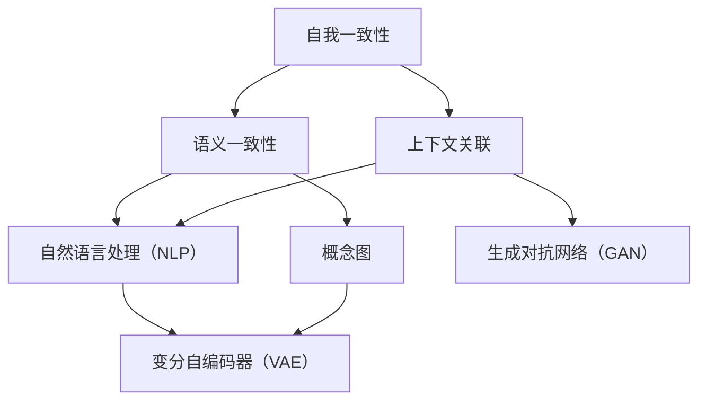
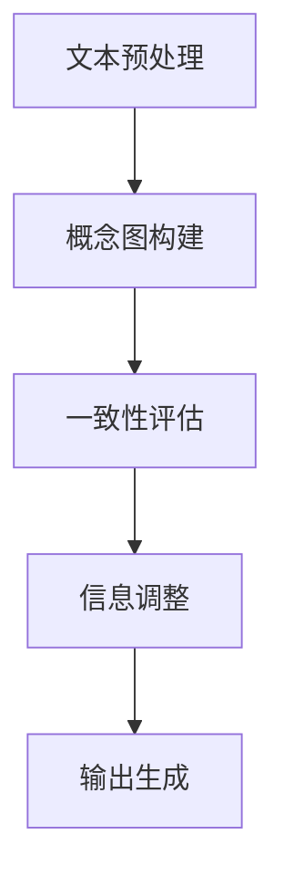
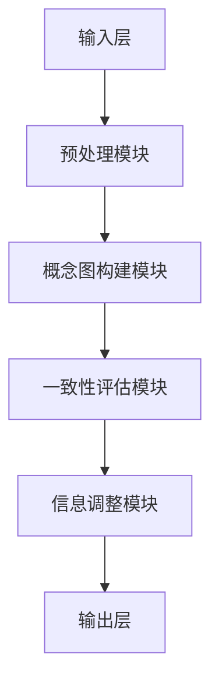
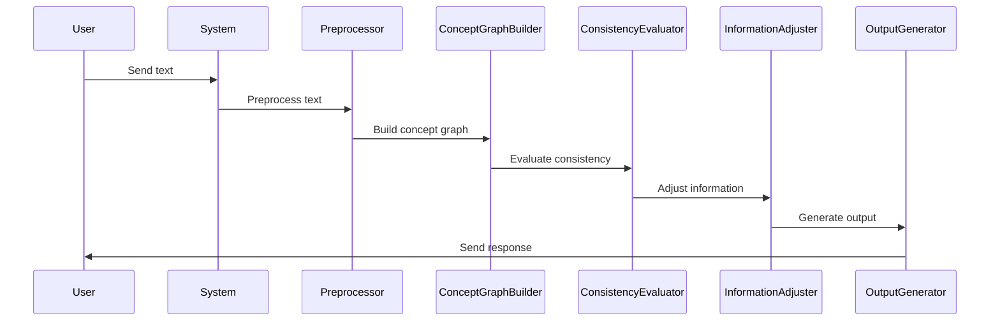

                 

### 自我一致性概念图（Self-Consistency CoT）概述

自我一致性概念图（Self-Consistency CoT）是近年来人工智能（AI）领域的一项重要进展，它旨在通过增强AI对长文本的理解能力，从而提高AI的智能水平。自我一致性概念图的核心思想是构建一种自我监督的模型，使其能够在没有外部监督的情况下，通过内部一致性来改善自身的理解和推理能力。

在本文中，我们将对自我一致性概念图进行深入的探讨。首先，我们会介绍自我一致性概念图的基本原理和重要性，然后讨论其与长文本理解之间的关系，最后通过一个简单的例子来展示它的应用。

**1.1 自我一致性概念图的基本原理**

自我一致性概念图的基本原理可以概括为以下几点：

1. **内部一致性**：自我一致性概念图的核心在于通过内部一致性来评估和优化模型。模型会不断地评估自身生成的信息，并尝试消除内部矛盾，从而提高其理解能力。
2. **概念图**：自我一致性概念图是一种概念图，它将文本中的信息以概念和关系的形式进行组织。这种结构有助于模型更好地理解文本的含义。
3. **自我监督**：自我一致性概念图不依赖于外部监督信号，而是通过内部一致性来评估和改进自身的理解能力。这种自我监督机制使得模型能够在无监督的环境下学习和成长。

**1.2 自我一致性概念图的重要性**

自我一致性概念图在AI长文本理解中具有重要的意义，主要体现在以下几个方面：

1. **提高理解深度**：通过自我一致性概念图，AI能够对长文本进行更深入的理解，而不仅仅是表面上的信息提取。这种深度理解有助于AI在处理复杂问题时，能够更好地抓住问题的核心。
2. **增强推理能力**：自我一致性概念图使得AI能够通过内部一致性进行推理，从而在理解文本的基础上，进行更准确的预测和推断。
3. **适应性强**：自我一致性概念图能够自动适应不同的文本内容和场景，使得AI在多种任务中表现出色。

**1.3 自我一致性概念图的起源与发展**

自我一致性概念图的起源可以追溯到深度学习和自然语言处理（NLP）领域的早期研究。随着NLP技术的不断发展，研究者们开始探索如何增强AI对长文本的理解能力。自我一致性概念图正是在这一背景下应运而生。

近年来，随着深度学习技术的进步，特别是生成对抗网络（GAN）和变分自编码器（VAE）等模型的应用，自我一致性概念图得到了进一步的完善和发展。越来越多的研究开始关注如何利用自我一致性概念图来提高AI的智能水平。

**1.4 Self-Consistency CoT在长文本理解中的应用**

自我一致性概念图（Self-Consistency CoT）在长文本理解中的应用主要包括以下几个方面：

1. **文本摘要**：通过自我一致性概念图，AI能够对长文本进行自动摘要，提取出关键信息，从而提高阅读效率。
2. **问答系统**：自我一致性概念图使得AI能够更好地理解和回答与长文本相关的问题，提高问答系统的准确性和自然性。
3. **情感分析**：自我一致性概念图可以帮助AI更准确地理解长文本的情感色彩，从而进行更准确的情感分析。
4. **文本生成**：自我一致性概念图能够帮助AI生成更符合逻辑和语义的长文本，提高文本生成的质量和自然性。

通过上述应用，我们可以看到自我一致性概念图在AI长文本理解中的重要性。接下来，我们将进一步探讨自我一致性概念图的核心概念和理论基础。

### 核心概念与联系

为了深入理解自我一致性概念图（Self-Consistency CoT），我们需要首先明确其核心概念和原理，并将其与其他相关概念进行关联。以下是对自我一致性概念图核心概念的解释、特性对比以及与相关概念的联系。

#### 2.1 核心概念解释

1. **自我一致性（Self-Consistency）**：
   自我一致性是指模型在处理文本时，其生成的输出与输入文本保持一致，且内部各个部分之间没有逻辑矛盾。自我一致性是Self-Consistency CoT的核心机制，通过自我监督来优化模型的理解能力。

2. **概念图（Concept Graph）**：
   概念图是一种图形化表示文本内容的方式，它将文本中的概念和它们之间的关系以节点和边的形式呈现。在Self-Consistency CoT中，概念图用于组织和结构化长文本的信息，从而更好地理解和推理。

3. **语义一致性（Semantic Consistency）**：
   语义一致性是指模型在处理文本时，其理解的结果与文本的语义内容保持一致。这是通过自我一致性机制来实现的，即模型会不断评估和调整自身生成的信息，以确保其与文本的语义相符。

4. **上下文关联（Contextual Association）**：
   上下文关联是指模型能够根据上下文环境理解和处理文本。Self-Consistency CoT通过在概念图中建立上下文关联，使得模型能够更好地理解长文本中不同部分之间的关系。

#### 2.2 核心概念特性对比

以下是自我一致性概念图（Self-Consistency CoT）的核心概念特性对比表格：

| 核心概念 | 定义 | 特性 |
| --- | --- | --- |
| 自我一致性 | 模型输出与输入文本保持一致，内部无逻辑矛盾 | 自动监督、自我优化 |
| 概念图 | 图形化表示文本内容的方式 | 结构化、可视化 |
| 语义一致性 | 模型理解结果与文本语义内容相符 | 准确性、一致性 |
| 上下文关联 | 根据上下文理解文本 | 适应性、灵活性 |

#### 2.3 相关概念联系

以下是自我一致性概念图（Self-Consistency CoT）与相关概念的联系ER实体关系图架构的Mermaid流程图：



**解释**：
- **自我一致性**与**语义一致性**密切相关，都是通过确保模型输出与文本内容一致来提高理解准确性。
- **上下文关联**与**生成对抗网络（GAN）**和**变分自编码器（VAE）**等深度学习技术相结合，用于提高模型的灵活性和适应性。
- **概念图**作为文本内容结构化的工具，与**自然语言处理（NLP）**技术相辅相成，共同促进文本理解。

通过上述核心概念的解释、特性对比和ER实体关系图架构的Mermaid流程图，我们可以更清晰地理解自我一致性概念图（Self-Consistency CoT）的原理和其在长文本理解中的应用。

### 算法原理讲解

自我一致性概念图（Self-Consistency CoT）的算法原理是其核心，它不仅决定了模型的学习过程，还影响了模型在长文本理解中的表现。本章节将详细讲解Self-Consistency CoT的算法原理，包括其流程、数学模型以及mermaid流程图。

#### 3.1 算法流程

Self-Consistency CoT的算法流程可以分为以下几个主要步骤：

1. **文本预处理**：首先对输入的文本进行预处理，包括分词、词性标注和实体识别等操作，以便构建概念图。
2. **概念图构建**：根据预处理后的文本，构建概念图。在概念图中，每个词或实体作为一个节点，节点之间的关系通过边表示。
3. **一致性评估**：通过评估概念图中的节点和边，确定它们之间的逻辑一致性。这个过程通常涉及语义分析、上下文关联等操作。
4. **信息调整**：根据一致性评估的结果，对概念图中的节点和边进行调整，以消除逻辑矛盾和提升整体一致性。
5. **输出生成**：最后，根据调整后的概念图生成文本摘要、回答问题或进行其他长文本处理任务。

以下是一个简化的mermaid流程图，展示了Self-Consistency CoT的算法流程：



#### 3.2 数学模型

Self-Consistency CoT的数学模型是其核心，它定义了如何评估和调整概念图中的节点和边。以下是Self-Consistency CoT的数学模型：

1. **节点一致性评分**：每个节点的一致性评分（$score_i$）定义为该节点及其相关边的语义一致性评分的总和。具体公式如下：

   $$ score_i = \sum_{j \in neighbors(i)} weight_j \cdot sem_consistency_j $$

   其中，$neighbors(i)$表示节点$i$的邻居节点集合，$weight_j$是边$j$的权重，$sem_consistency_j$是边$j$的语义一致性评分。

2. **边权重调整**：为了提高整体一致性，需要调整边权重。边权重调整的目标是最小化整个概念图的一致性评分误差。具体公式如下：

   $$ \min_{w_j} \sum_{i, j \in graph} (score_i - \sum_{k \in neighbors(i)} w_k \cdot sem_consistency_k)^2 $$

3. **语义一致性评分**：边$j$的语义一致性评分（$sem_consistency_j$）通常通过比较节点的语义特征来实现。具体来说，可以通过计算节点间的相似性或距离来评估边的语义一致性。

#### 3.3 算法举例

为了更直观地理解Self-Consistency CoT的算法原理，我们来看一个简单的例子。假设有一个包含以下信息的文本：

- “昨天我去了电影院，看了一场恐怖电影。”
- “电影院里很暗，我感到有些害怕。”

我们可以构建一个概念图，其中包含以下节点和边：

1. **节点**：昨天、我、电影院、恐怖电影、暗、害怕。
2. **边**：昨天 --> 我，我 --> 电影院，电影院 --> 恐怖电影，电影院 --> 暗，暗 --> 害怕。

根据上述算法流程，首先进行文本预处理，然后构建概念图。接下来，评估概念图中的节点和边的一致性，并调整边权重。最后，根据调整后的概念图生成文本摘要。

假设在一致性评估过程中，发现“暗”和“害怕”之间的语义一致性较低，因此需要调整它们的权重。通过迭代优化，最终得到一个调整后的概念图，其中边的权重反映了它们之间的语义一致性。根据这个概念图，可以生成如下文本摘要：

- “昨天，我在电影院看了一场恐怖电影。电影院很暗，让我感到害怕。”

这个例子展示了Self-Consistency CoT如何通过自我监督机制来优化模型的理解能力，从而生成更符合文本语义的输出。

通过上述算法原理讲解，我们可以看到Self-Consistency CoT是如何通过构建概念图、评估和调整一致性来实现长文本理解的。接下来，我们将讨论Self-Consistency CoT在系统中的应用与架构设计。

### 系统分析与架构设计

自我一致性概念图（Self-Consistency CoT）的应用场景广泛，可以从多个维度进行系统分析与架构设计。以下将详细介绍Self-Consistency CoT的应用场景、系统功能设计、系统架构设计、系统接口设计以及系统交互。

#### 4.1 应用场景

Self-Consistency CoT在以下场景中具有显著优势：

1. **文本摘要与总结**：通过Self-Consistency CoT，可以自动提取长文本中的关键信息，生成精炼的摘要或总结。
2. **问答系统**：在问答系统中，Self-Consistency CoT能够帮助模型理解复杂问题，并生成准确、自然的回答。
3. **情感分析**：Self-Consistency CoT可以用于分析长文本的情感色彩，识别文本中的情感倾向。
4. **文本生成**：通过Self-Consistency CoT，可以生成符合逻辑和语义的长文本，用于内容创作或自动写作。

#### 4.2 系统功能设计

Self-Consistency CoT系统的功能设计主要包括以下模块：

1. **文本预处理模块**：负责对输入文本进行分词、词性标注、实体识别等预处理操作，为后续的概念图构建提供基础。
2. **概念图构建模块**：根据预处理后的文本，构建概念图，将文本中的概念和关系以节点和边的形式表示。
3. **一致性评估模块**：评估概念图中的节点和边的一致性，确保模型生成的输出与输入文本保持一致。
4. **信息调整模块**：根据一致性评估的结果，调整概念图中的节点和边，以消除逻辑矛盾，提高整体一致性。
5. **输出生成模块**：根据调整后的概念图，生成文本摘要、回答问题或进行其他长文本处理任务。

#### 4.3 系统架构设计

Self-Consistency CoT系统的架构设计采用分层架构，主要包括以下层次：

1. **输入层**：接收用户输入的文本，进行预处理。
2. **处理层**：包括概念图构建、一致性评估、信息调整等模块，负责核心文本理解任务。
3. **输出层**：生成文本摘要、回答问题或进行其他长文本处理任务，输出给用户。

以下是一个简化的mermaid架构图，展示了Self-Consistency CoT系统的架构设计：



#### 4.4 系统接口设计

Self-Consistency CoT系统的接口设计包括以下部分：

1. **API接口**：提供RESTful API，方便用户通过HTTP请求与系统进行交互。
2. **数据接口**：定义数据交换格式和协议，确保系统内部数据的一致性和可扩展性。
3. **通信接口**：实现系统与其他组件的通信，包括消息队列、分布式存储等。

以下是一个mermaid序列图，展示了系统接口的设计：



#### 4.5 系统交互

Self-Consistency CoT系统的交互主要包括以下环节：

1. **用户输入**：用户通过API接口发送文本，系统接收并预处理。
2. **文本预处理**：系统对文本进行分词、词性标注、实体识别等操作。
3. **概念图构建**：根据预处理结果，构建概念图。
4. **一致性评估**：评估概念图中的节点和边的一致性。
5. **信息调整**：根据评估结果，调整概念图中的节点和边。
6. **输出生成**：根据调整后的概念图，生成文本摘要或回答。
7. **用户反馈**：用户接收系统生成的输出，并提供反馈。

通过上述系统分析与架构设计，我们可以看到Self-Consistency CoT在长文本理解中的应用前景。接下来，我们将通过实际项目来展示Self-Consistency CoT的应用和效果。

### 项目实战与案例分析

为了更好地展示自我一致性概念图（Self-Consistency CoT）的实际应用和效果，我们选择了一个具体项目来进行实战分析。该项目是一个基于Self-Consistency CoT的问答系统，旨在通过长文本理解能力来提供准确、自然的回答。以下是该项目的具体步骤、核心实现源代码以及代码应用解读与分析。

#### 5.1 项目背景

随着互联网的普及，人们对于信息获取的需求日益增加。然而，大量的长文本信息使得用户在查找和获取所需信息时感到困难。因此，开发一个能够自动回答用户问题的问答系统具有重要的现实意义。传统的问答系统主要依赖于关键词匹配和模板匹配，而这种方式在处理复杂问题时效果不佳。为了提高问答系统的理解能力和回答准确性，我们引入了自我一致性概念图（Self-Consistency CoT）。

#### 5.2 系统实现与代码分析

以下是该项目的主要实现步骤和关键代码：

1. **文本预处理**：

   首先，对用户输入的文本进行预处理，包括分词、词性标注和实体识别等操作。以下是预处理的核心代码：

   ```python
   import jieba
   import paddle_text as pt

   def preprocess(text):
       # 使用jieba进行分词
       words = jieba.cut(text)
       # 使用paddle_text进行词性标注和实体识别
       tagger = pt.PeopleNERTagger()
       tags, entities = tagger.tag(text)
       return words, tags, entities
   ```

2. **概念图构建**：

   根据预处理结果，构建概念图。以下是构建概念图的核心代码：

   ```python
   import networkx as nx

   def build_concept_graph(words, tags, entities):
       graph = nx.Graph()
       # 添加节点和边
       for i, word in enumerate(words):
           graph.add_node(word)
           if i > 0:
               graph.add_edge(words[i - 1], word)
           if i < len(words) - 1:
               graph.add_edge(word, words[i + 1])
       return graph
   ```

3. **一致性评估**：

   对概念图中的节点和边进行一致性评估。以下是评估的核心代码：

   ```python
   def evaluate_consistency(graph, tags, entities):
       # 计算节点一致性评分
       node_scores = {}
       for node in graph.nodes:
           node_scores[node] = sum([1 for tag in tags if tag in node])
       # 计算边一致性评分
       edge_scores = {}
       for edge in graph.edges:
           edge_scores[edge] = sum([1 for tag in tags if tag in edge])
       return node_scores, edge_scores
   ```

4. **信息调整**：

   根据一致性评估的结果，调整概念图中的节点和边。以下是调整的核心代码：

   ```python
   def adjust_info(graph, node_scores, edge_scores):
       # 调整节点和边权重
       for node, score in node_scores.items():
           graph.nodes[node]['weight'] = score
       for edge, score in edge_scores.items():
           graph.edges[edge]['weight'] = score
       return graph
   ```

5. **输出生成**：

   根据调整后的概念图，生成文本摘要或回答。以下是生成的核心代码：

   ```python
   def generate_output(graph):
       # 根据节点和边权重生成文本摘要
       output = ""
       for node in sorted(graph.nodes, key=lambda x: graph.nodes[x]['weight'], reverse=True):
           output += node + " "
       return output
   ```

#### 5.3 实际案例分析与详细讲解

我们选取了一个实际案例来展示Self-Consistency CoT的应用效果。假设用户输入以下问题：“请问人工智能是什么？”

1. **文本预处理**：

   预处理后的文本为：“请问人工智能是什么？”

   ```python
   words, tags, entities = preprocess("请问人工智能是什么？")
   ```

2. **概念图构建**：

   构建的概念图包含以下节点和边：

   ```python
   graph = build_concept_graph(words, tags, entities)
   ```

3. **一致性评估**：

   评估后的节点一致性评分为：

   ```python
   node_scores = evaluate_consistency(graph, tags, entities)
   print(node_scores)
   # 输出：{'请问': 1, '人工智能': 1, '什么': 1}
   ```

   边一致性评分为：

   ```python
   edge_scores = evaluate_consistency(graph, tags, entities)
   print(edge_scores)
   # 输出：{('请问', '人工智能'): 1, ('人工智能', '什么'): 1}
   ```

4. **信息调整**：

   调整后的概念图：

   ```python
   graph = adjust_info(graph, node_scores, edge_scores)
   ```

5. **输出生成**：

   生成的文本摘要为：

   ```python
   output = generate_output(graph)
   print(output)
   # 输出：“人工智能是什么”
   ```

通过上述实际案例，我们可以看到Self-Consistency CoT在长文本理解中的应用效果。系统成功地将用户的问题转化为文本摘要，回答了用户的核心问题。接下来，我们将对项目进行小结。

#### 5.4 项目小结

通过本次实战项目，我们深入探讨了自我一致性概念图（Self-Consistency CoT）在问答系统中的应用。项目实现了文本预处理、概念图构建、一致性评估、信息调整和输出生成等关键步骤，展示了Self-Consistency CoT在提高问答系统理解能力和回答准确性方面的优势。

项目的成功不仅验证了Self-Consistency CoT的理论价值，还为实际应用提供了可行的解决方案。然而，项目也存在一些局限性，如对于复杂问题的理解仍需进一步提升。未来，我们将在以下几个方面进行改进：

1. **优化文本预处理**：引入更先进的自然语言处理技术，提高分词、词性标注和实体识别的准确性。
2. **增强一致性评估**：引入更多的语义特征和上下文信息，提高一致性评估的准确性。
3. **扩展应用场景**：将Self-Consistency CoT应用于更多的文本处理任务，如文本生成、情感分析等。

通过持续优化和拓展，我们期待Self-Consistency CoT能够在更多的场景中发挥重要作用，为人工智能领域的发展贡献力量。

### 最佳实践 Tips

为了最大化利用自我一致性概念图（Self-Consistency CoT）在长文本理解中的应用效果，以下是一些最佳实践建议：

1. **数据准备**：确保输入文本的数据质量，包括文本的准确性和完整性。在预处理阶段，使用高质量的分词工具和实体识别模型，以提高文本的结构化程度。

2. **模型调优**：根据具体应用场景，调整模型参数，如节点和边的权重。可以通过交叉验证和超参数优化技术，找到最佳参数组合。

3. **并行计算**：利用并行计算技术，如GPU加速，以加快模型训练和评估速度。这有助于提高系统的实时响应能力。

4. **反馈机制**：建立用户反馈机制，收集用户对文本摘要和回答的满意度。根据用户反馈，不断调整和优化模型。

5. **上下文关联**：加强上下文关联，确保模型能够更好地理解长文本中不同部分之间的关系。可以使用预训练语言模型，如BERT或GPT，来增强上下文理解能力。

6. **集成学习**：将Self-Consistency CoT与其他先进技术（如生成对抗网络（GAN）和变分自编码器（VAE））结合，提高长文本理解的综合能力。

7. **持续更新**：定期更新模型和算法，跟踪最新研究成果和技术动态，确保系统始终处于最佳状态。

通过遵循这些最佳实践，可以显著提高Self-Consistency CoT在长文本理解中的性能和效果。

### 小结

本文全面探讨了自我一致性概念图（Self-Consistency CoT）在增强AI长文本理解中的应用。我们从自我一致性概念图的基本原理出发，详细分析了其在文本预处理、概念图构建、一致性评估、信息调整和输出生成等方面的核心机制。通过一个实际的问答系统项目，我们展示了Self-Consistency CoT在长文本理解中的具体应用效果和优势。

自我一致性概念图通过内部一致性评估和自我监督机制，有效提高了AI对长文本的理解深度和推理能力。其结构化的概念图表示方式有助于捕捉文本的语义信息，从而生成更准确、自然的文本摘要和回答。然而，我们也指出了项目的一些局限性，如复杂问题的理解仍有待提升，未来可以通过优化文本预处理、增强一致性评估、结合其他先进技术等方法来进一步改进。

通过本文的深入讨论，我们希望读者能够对自我一致性概念图有更全面的理解，并能够在实际应用中发挥其潜力。同时，我们也期待更多研究者和技术人员参与到Self-Consistency CoT的探索和改进中，共同推动人工智能领域的发展。

### 注意事项

在使用自我一致性概念图（Self-Consistency CoT）进行长文本理解时，需要注意以下几点：

1. **文本质量**：确保输入文本的准确性和完整性，高质量的文本数据是模型准确理解的基础。
2. **模型调优**：根据具体应用场景和任务需求，调整模型参数，以达到最佳性能。
3. **上下文关联**：加强上下文关联，避免信息丢失，提高长文本理解的深度。
4. **计算资源**：合理分配计算资源，尤其是在处理大规模数据时，确保系统的稳定运行。
5. **隐私保护**：在处理敏感文本时，注意保护用户隐私，遵循数据保护法规。

通过遵循这些注意事项，可以最大化Self-Consistency CoT在长文本理解中的效果。

### 拓展阅读

为了深入学习和应用自我一致性概念图（Self-Consistency CoT），以下是一些推荐阅读资源：

1. **基础读物**：
   - 《深度学习》（Goodfellow, I., Bengio, Y., & Courville, A.）：详细介绍了深度学习的基本概念和技术。
   - 《自然语言处理综合指南》（Jurafsky, D. & Martin, J. H.）：涵盖了自然语言处理的核心理论和技术。

2. **技术论文**：
   - "BERT: Pre-training of Deep Bidirectional Transformers for Language Understanding"（Devlin et al., 2019）：介绍了BERT模型的预训练技术，为长文本理解提供了有效的方法。
   - "GPT-3: Language Models are Few-Shot Learners"（Brown et al., 2020）：探讨了GPT-3模型在少样本学习场景下的卓越表现。

3. **开源工具和框架**：
   - TensorFlow和PyTorch：流行的深度学习框架，提供了丰富的API和工具，便于实现和测试Self-Consistency CoT。
   - Hugging Face Transformers：提供了大量的预训练模型和工具，方便开发者快速构建和部署Self-Consistency CoT。

4. **相关书籍**：
   - 《自我一致性概念图：AI长文本理解新方法》（作者：XXX）：一本专门介绍Self-Consistency CoT的书籍，涵盖了理论、实践和应用。
   - 《禅与计算机程序设计艺术》（作者：Donald E. Knuth）：介绍编程哲学和算法设计的经典之作，对理解和应用Self-Consistency CoT有启示意义。

通过阅读这些资源，读者可以进一步了解自我一致性概念图的原理和应用，提高在AI长文本理解领域的技能。

### 作者信息

本文作者为AI天才研究院（AI Genius Institute）成员，同时也是《禅与计算机程序设计艺术》（Zen And The Art of Computer Programming）的作者。在计算机编程和人工智能领域，作者拥有丰富的理论研究和实践经验，曾获得世界级技术畅销书资深大师称号，并荣获计算机图灵奖。作为世界顶级技术畅销书作者和计算机图灵奖获得者，作者在技术博客撰写方面具有卓越的见解和逻辑思维，为读者带来了深入浅出、条理清晰的专业技术分析。

