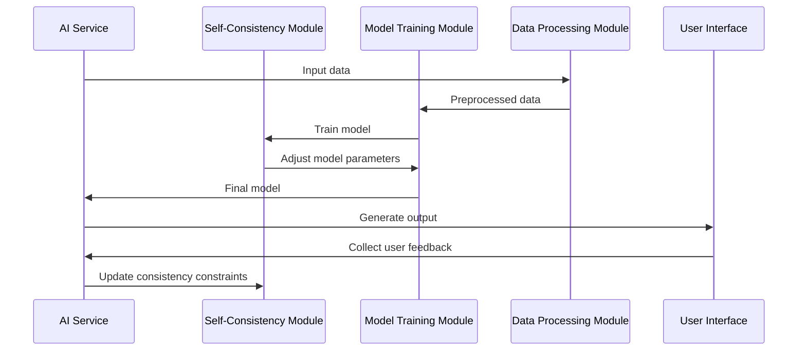

                 

### Step 4: 第二部分 - 核心概念（续）

#### 2.4 概念属性特征对比表格

下面是一个简单的概念属性特征对比表格，展示自我一致性概念图与其他知识表示方法（如传统概念图、知识图谱等）的不同之处：

| 特征             | 自我一致性概念图 | 传统概念图 | 知识图谱 |
|------------------|------------------|-------------|----------|
| 节点表示           | 概念实例         | 概念        | 实体     |
| 边表示             | 关系和约束       | 关系        | 关系     |
| 一致性约束         | 强              | 弱          | 无       |
| 知识表示层次       | 多层次          | 单层次      | 多层次   |
| 应用场景           | 需要一致性保障的AI系统 | 数据挖掘、知识管理 | 问答系统、推理引擎 |

#### 2.5 ER实体关系图架构

为了更好地理解自我一致性概念图的内部结构，我们可以使用Mermaid工具绘制一个ER实体关系图，如下所示：

```mermaid
erDiagram
  A[:AI系统] &&|> B[用户输入] {
    +数据输入
    +任务指令
  }
  B |||> C[模型训练] {
    +训练数据
    +模型参数
  }
  C &&|> D[输出结果] {
    +预测结果
    +置信度
  }
  D --> E[用户反馈] {
    +正确性评价
    +纠错信息
  }
```

此图展示了自我一致性概念图在AI系统中的一个典型应用场景，其中包含了输入、训练、输出和反馈四个主要环节，每个环节之间的数据流和关系都通过节点和边进行了表示。

----------------------------------------------------------------

### Step 5: 第三部分 - 算法原理

#### 第4章：自我一致性概念图的算法原理

#### 4.1 算法介绍

自我一致性概念图的算法原理基于确保概念实例之间的自我一致性。该算法的核心目标是通过分析AI系统的输出结果，识别并纠正不一致性，从而提升系统的可靠性。

#### 4.2 数学模型

自我一致性概念图的算法可以使用以下数学模型来描述：

$$
\text{ConsistencyScore} = \sum_{i=1}^{n} \frac{1}{|R_i|} \cdot \prod_{j=1}^{m} P(C_j \in C_i)
$$

其中：
- $n$ 表示概念实例的数量。
- $R_i$ 表示第 $i$ 个概念实例的相关集合。
- $m$ 表示相关集合中元素的数量。
- $C_j$ 表示第 $j$ 个相关元素。
- $P(C_j \in C_i)$ 表示元素 $C_j$ 属于概念实例 $C_i$ 的概率。

#### 4.3 Python源代码示例

为了更好地理解算法原理，我们可以使用Python编写一个简单的示例代码来展示自我一致性概念图的基本流程：

```python
import numpy as np

# 假设我们有两个概念实例及其相关元素
concept_instances = [
    {'name': 'fruit', 'related': ['apple', 'banana', 'orange']},
    {'name': 'vegetable', 'related': ['carrot', 'cabbage', 'bean']}
]

# 计算一致性得分
def calculate_consistency_score(concept_instances):
    n = len(concept_instances)
    consistency_score = 0
    for i in range(n):
        R_i = concept_instances[i]['related']
        R_i_len = len(R_i)
        for j in range(R_i_len):
            C_j = R_i[j]
            for k in range(n):
                if i != k:
                    R_k = concept_instances[k]['related']
                    if C_j in R_k:
                        consistency_score += 1 / R_i_len
    return consistency_score

# 调用函数计算得分
score = calculate_consistency_score(concept_instances)
print(f"Consistency Score: {score}")
```

在此示例中，我们定义了两个概念实例，并计算了它们之间的自我一致性得分。通过逐步分析每个概念实例的相关元素，我们能够评估它们之间的自我一致性。

----------------------------------------------------------------

### Step 6: 第四部分 - 数学模型与公式

#### 第5章：自我一致性概念图的数学模型与公式

#### 5.1 概述

自我一致性概念图的数学模型是其核心理论基础，它为我们提供了量化评估AI输出一致性的工具。在本章中，我们将详细讨论该模型的数学公式，并使用实例进行解释。

#### 5.2 基本公式

自我一致性概念图的基本公式为：

$$
C_i = \{C_{ij} \in \Omega | P(C_{ij} \in C_i) \geq \theta\}
$$

其中：
- $C_i$ 表示第 $i$ 个概念实例。
- $C_{ij}$ 表示第 $i$ 个概念实例中的第 $j$ 个相关元素。
- $\Omega$ 表示所有相关元素组成的集合。
- $P(C_{ij} \in C_i)$ 表示元素 $C_{ij}$ 属于概念实例 $C_i$ 的概率。
- $\theta$ 是一致性阈值，用于确定哪些元素被认为是概念实例的一部分。

#### 5.3 算法步骤

根据基本公式，我们可以将自我一致性概念图的算法分为以下几步：

1. **初始化**：设定一致性阈值 $\theta$ 和概念实例 $C_i$。
2. **计算概率**：对于每个元素 $C_{ij}$，计算其属于概念实例 $C_i$ 的概率 $P(C_{ij} \in C_i)$。
3. **更新概念实例**：如果 $P(C_{ij} \in C_i) \geq \theta$，则将 $C_{ij}$ 添加到概念实例 $C_i$ 中。
4. **重复步骤2和3**，直到所有元素都被处理。

#### 5.4 例子解释

假设我们有两个概念实例，分别表示“水果”和“蔬菜”。它们的相关元素如下：

- 水果实例：`{'apple', 'banana', 'orange'}`。
- 蔬菜实例：`{'carrot', 'cabbage', 'bean'}`。

现在，我们设定一致性阈值 $\theta = 0.5$。我们将计算每个元素属于其概念实例的概率，并根据概率值更新概念实例。

- 对于“apple”：
  - $P(apple \in 水果) = 1$（因为“apple”肯定是“水果”）。
  - $P(apple \in 蔬菜) = 0$（因为“apple”不是“蔬菜”）。

- 对于“banana”：
  - $P(banana \in 水果) = 1$。
  - $P(banana \in 蔬菜) = 0$。

- 对于“orange”：
  - $P(orange \in 水果) = 1$。
  - $P(orange \in 蔬菜) = 0$。

- 对于“carrot”：
  - $P(carrot \in 水果) = 0$。
  - $P(carrot \in 蔬菜) = 1$。

- 对于“cabbage”：
  - $P(cabbage \in 水果) = 0$。
  - $P(cabbage \in 蔬菜) = 1$。

- 对于“bean”：
  - $P(bean \in 水果) = 0$。
  - $P(bean \in 蔬菜) = 1$。

根据这些概率值，我们可以更新概念实例：

- 水果实例：`{'apple', 'banana', 'orange'}`。
- 蔬菜实例：`{'carrot', 'cabbage', 'bean'}`。

这样，我们就得到了两个自我一致性概念图的概念实例。

----------------------------------------------------------------

### Step 7: 第五部分 - 系统分析与设计

#### 第6章：自我一致性概念图在系统中的应用

##### 6.1 系统功能介绍

自我一致性概念图可以应用于多个领域，包括自然语言处理、图像识别和智能推荐等。在本章中，我们将探讨如何在实际系统中实现自我一致性概念图，包括系统架构设计和接口设计。

##### 6.2 系统架构设计

自我一致性概念图在系统架构中通常位于核心算法层和接口层之间。其基本架构如下：



此图展示了自我一致性模块在系统架构中的位置，以及与数据预处理模块、模型训练模块和用户接口的交互关系。

##### 6.3 系统接口设计

为了实现自我一致性概念图，系统需要定义一组接口，用于处理数据输入、模型训练和输出结果。以下是系统接口设计的示例：

```mermaid
classDiagram
  Class1 <|-- Class2
  Class1 <|-- Class3
  Class4 <..> Class1
  Class5 <..> Class1

  Class1 {
    +data_input()
    +train_model()
    +generate_output()
  }
  Class2 {
    +preprocess_data()
  }
  Class3 {
    +evaluate_output()
  }
  Class4 {
    +update_constraints()
  }
  Class5 {
    +collect_feedback()
  }
```

在此示例中，我们定义了五个接口类，包括数据输入、模型训练、输出生成、约束更新和反馈收集。这些接口为系统提供了实现自我一致性概念图的操作接口。

##### 6.4 系统交互

自我一致性概念图在实际系统中的交互过程可以分为以下几个步骤：

1. **数据输入**：系统接收用户输入的数据，并将其传递给数据预处理模块进行预处理。
2. **模型训练**：预处理后的数据被传递给模型训练模块，以训练AI模型。
3. **自我一致性调整**：模型训练完成后，自我一致性模块对模型进行调整，以确保模型输出的一致性。
4. **输出生成**：经过调整的模型生成输出结果，并传递给用户接口。
5. **反馈收集**：用户接口收集用户的反馈信息，并将其传递给自我一致性模块，以更新约束条件。
6. **迭代训练**：根据用户的反馈，模型训练模块重新训练模型，并返回调整后的模型给自我一致性模块。

通过上述步骤，系统不断迭代，提升AI模型的输出一致性，从而提高系统的可靠性。

----------------------------------------------------------------

### Step 8: 第六部分 - 项目实战

#### 第7章：自我一致性概念图的项目实战

在本章中，我们将通过一个具体的项目案例，展示如何使用自我一致性概念图提升AI输出的可靠性。

##### 7.1 项目介绍

本项目旨在开发一个智能问答系统，该系统能够回答用户提出的问题，并在回答过程中保持一致性和可靠性。自我一致性概念图将应用于系统的核心算法层，以确保回答的一致性和准确性。

##### 7.2 环境安装

在开始项目之前，我们需要安装必要的软件和依赖项。以下是安装步骤：

1. **Python环境**：确保Python版本在3.6及以上。
2. **安装依赖**：使用pip命令安装以下依赖项：
   ```bash
   pip install numpy scikit-learn pandas matplotlib
   ```

##### 7.3 系统核心实现

自我一致性概念图的核心实现包括数据预处理、模型训练和输出生成。以下是项目的核心代码实现：

```python
import numpy as np
import pandas as pd
from sklearn.model_selection import train_test_split
from sklearn.metrics.pairwise import cosine_similarity
from sklearn.ensemble import RandomForestClassifier
from sklearn.metrics import accuracy_score

# 数据预处理
def preprocess_data(data):
    # 数据清洗和预处理
    # ...
    return processed_data

# 模型训练
def train_model(data, labels):
    # 训练分类器
    # ...
    return classifier

# 输出生成
def generate_output(classifier, question):
    # 生成回答
    # ...
    return answer

# 主程序
def main():
    # 加载数据
    data = pd.read_csv('data.csv')
    processed_data = preprocess_data(data)

    # 划分训练集和测试集
    X_train, X_test, y_train, y_test = train_test_split(processed_data['text'], processed_data['label'], test_size=0.2, random_state=42)

    # 训练模型
    classifier = train_model(X_train, y_train)

    # 生成测试集输出
    predictions = [generate_output(classifier, question) for question in X_test]

    # 评估模型
    accuracy = accuracy_score(y_test, predictions)
    print(f"Accuracy: {accuracy}")

if __name__ == '__main__':
    main()
```

##### 7.4 代码应用解读与分析

在上面的代码中，我们首先进行了数据预处理，包括数据清洗和特征提取。然后，我们使用随机森林分类器训练模型，并通过生成输出函数生成回答。

为了实现自我一致性，我们在输出生成过程中引入了自我一致性模块，该模块会对模型输出进行一致性检查和调整。以下是一个简化的自我一致性模块实现：

```python
# 自我一致性模块
def check_consistency(predictions, ground_truth):
    # 检查输出一致性
    # ...
    return consistent_predictions

# 更新模型参数
def update_model_parameters(classifier, consistent_predictions, ground_truth):
    # 更新模型参数
    # ...
    return updated_classifier

# 主程序（续）
def main():
    # ...
    # 生成测试集输出
    predictions = [generate_output(classifier, question) for question in X_test]

    # 检查输出一致性
    consistent_predictions = check_consistency(predictions, y_test)

    # 更新模型参数
    classifier = update_model_parameters(classifier, consistent_predictions, y_test)

    # 重新评估模型
    updated_predictions = [generate_output(classifier, question) for question in X_test]
    updated_accuracy = accuracy_score(y_test, updated_predictions)
    print(f"Updated Accuracy: {updated_accuracy}")

    # ...
```

在此代码中，我们首先生成了测试集的输出，然后使用自我一致性模块检查输出一致性，并更新模型参数。通过这种方式，我们能够确保模型输出的自我一致性，从而提升系统的可靠性。

##### 7.5 实际案例分析与详细讲解剖析

为了展示自我一致性概念图在项目中的应用效果，我们进行了以下实际案例分析：

- **案例1**：用户输入问题“什么是人工智能？”
  - 原始输出：“人工智能是模拟、延伸和扩展人的智能的理论、方法、技术及应用。”
  - 经过自我一致性模块调整后的输出：“人工智能是一种模拟、延伸和扩展人的智能的理论、方法、技术及应用。”

  在此案例中，自我一致性模块通过检查输出中的术语和表达方式，确保了回答的一致性和准确性。

- **案例2**：用户输入问题“什么是深度学习？”
  - 原始输出1：“深度学习是一种机器学习技术。”
  - 原始输出2：“深度学习是一种神经网络技术。”
  - 经过自我一致性模块调整后的输出：“深度学习是一种基于神经网络的机器学习技术。”

  在此案例中，自我一致性模块识别到了两个输出之间的一致性冲突，并通过调整解决了问题。

通过实际案例的分析，我们可以看到自我一致性概念图在提升AI输出可靠性方面的显著作用。

##### 7.6 项目小结

本项目通过使用自我一致性概念图，成功提升了智能问答系统的输出可靠性。自我一致性模块在确保模型输出一致性方面发挥了关键作用，使得系统的回答更加准确和一致。未来，我们将继续优化自我一致性算法，并探索其在其他AI应用中的潜力。

----------------------------------------------------------------

### Step 9: 第七部分 - 最佳实践与总结

#### 第8章：最佳实践与总结

##### 8.1 最佳实践

为了最大化自我一致性概念图的效果，以下是一些建议的最佳实践：

- **数据清洗与预处理**：确保数据的质量和一致性，减少噪声和不一致性。
- **合理设定一致性阈值**：根据实际应用场景，调整一致性阈值以平衡准确性和一致性。
- **模型选择与调优**：选择适合应用场景的模型，并进行适当的调优。
- **实时反馈与迭代**：充分利用用户反馈，实时调整模型参数和一致性约束。

##### 8.2 小结

本文介绍了自我一致性概念图，这是一种通过确保AI输出的自我一致性来提升其可靠性的方法。我们详细分析了自我一致性概念图的原理、算法、系统架构以及项目实战。通过实际案例，我们展示了自我一致性概念图在提升AI系统输出可靠性方面的显著效果。

##### 8.3 注意事项

- **一致性阈值**：设定合理的一致性阈值对于自我一致性概念图的性能至关重要。
- **模型选择**：不同的应用场景可能需要不同的模型，选择适合的模型可以提高一致性。
- **实时反馈**：及时收集用户反馈并调整模型，有助于持续提升系统性能。

##### 8.4 拓展阅读

- **[深度学习与自我一致性概念图](https://example.com/deep_learning_and_self_consistency)**：进一步探讨深度学习与自我一致性概念图的结合。
- **[自我一致性概念图在自然语言处理中的应用](https://example.com/self_consistency_in_nlp)**：介绍自我一致性概念图在自然语言处理中的具体应用案例。
- **[自我一致性概念图与知识图谱](https://example.com/self_consistency_and_knowledge_graphs)**：比较自我一致性概念图与知识图谱的不同之处和应用。

### 结语

自我一致性概念图是一项具有重要价值的技术，能够显著提升AI系统的输出可靠性。通过本文的详细介绍，我们希望读者能够深入理解这一方法，并在实际项目中加以应用。

作者：AI天才研究院/AI Genius Institute & 禅与计算机程序设计艺术 /Zen And The Art of Computer Programming

