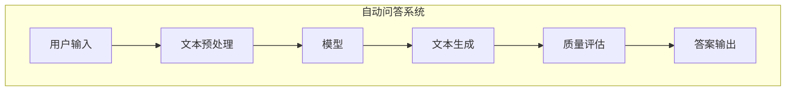
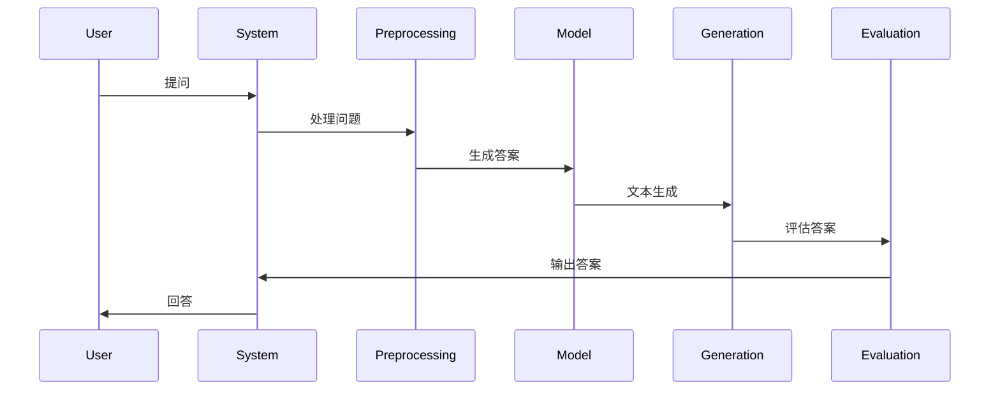

                 


## Self-Consistency CoT：提升AI输出质量的关键技术

### 关键词：Self-Consistency CoT，人工智能，自然语言处理，文本生成，模型质量提升

#### 摘要：
本文将深入探讨Self-Consistency CoT（Self-Consistency Core Topic）技术，一种旨在提升人工智能（AI）输出质量的创新方法。通过自洽性约束、上下文理解和质量评估等多个维度，Self-Consistency CoT技术为AI文本生成提供了坚实的理论基础和实践指导。本文将逐步分析该技术的核心原理、实现方法、概念特征及其在AI领域的应用，以期提供全面的技术见解和实践经验。

### 第一部分：背景介绍

#### 1.1 问题背景
Self-Consistency CoT技术的提出源于当前AI文本生成领域的一个普遍问题：模型输出文本的质量不稳定。尽管深度学习模型在自然语言处理（NLP）、图像识别等领域取得了显著进展，但它们在生成文本时，仍然容易出现内容不一致、不准确、不连贯的情况。这不仅限制了AI在实际应用中的效果，也影响了用户的体验。

#### 1.2 问题描述
Self-Consistency CoT技术旨在解决以下问题：
- **生成文本不一致**：模型在生成文本时，可能出现重复、矛盾或逻辑不通的情况。
- **输出质量不稳定**：模型在不同条件下生成的文本质量参差不齐，无法保证始终输出高质量内容。
- **缺乏上下文理解**：模型在处理长文本或复杂问题时，难以理解上下文信息，导致输出内容不准确。

#### 1.3 问题解决
Self-Consistency CoT技术通过以下方法提升AI输出质量：
- **自洽性约束**：模型在生成文本时，对生成的每个句子或段落进行一致性检查，确保内容之间没有矛盾或逻辑不通。
- **上下文理解**：通过分析上下文信息，使模型能够更好地理解文本内容，提高生成文本的连贯性和准确性。
- **质量评估**：利用外部数据集或指标，对模型生成的文本进行质量评估，筛选出高质量内容。

#### 1.4 边界与外延
Self-Consistency CoT技术的边界主要包括：
- **模型类型**：主要针对序列生成模型，如Transformer、BERT等。
- **应用场景**：适用于自然语言处理、图像识别等需要生成或处理文本的领域。

#### 1.5 概念结构与核心要素组成
Self-Consistency CoT技术的核心概念结构包括：
- **自洽性约束**：确保生成文本之间的一致性。
- **上下文理解**：提高模型对上下文信息的理解能力。
- **质量评估**：对生成文本进行质量评估，筛选高质量内容。

核心要素组成如下：
- **数据集**：用于训练和评估模型的文本数据。
- **模型架构**：用于生成文本的神经网络模型。
- **自洽性约束算法**：用于确保生成文本的一致性。
- **上下文理解算法**：用于提高模型对上下文信息的理解能力。
- **质量评估指标**：用于评估生成文本的质量。

### 第二部分：核心概念与联系

#### 2.1 Self-Consistency CoT技术原理

Self-Consistency CoT技术是一种基于深度学习的自然语言处理技术，通过自洽性约束、上下文理解和质量评估等方式，提升AI生成的文本质量。其核心原理如下：

##### 2.1.1 自洽性约束
自洽性约束是指在生成文本的过程中，对生成的每个句子或段落进行一致性检查，确保内容之间没有矛盾或逻辑不通。具体实现方法包括：
- 对生成的文本进行语法和语义分析，检查是否存在语法错误或逻辑不通的情况。
- 利用外部知识库或规则库，对生成的文本进行一致性验证。

##### 2.1.2 上下文理解
上下文理解是指模型在处理长文本或复杂问题时，能够理解上下文信息，提高生成文本的连贯性和准确性。具体实现方法包括：
- 使用注意力机制，使模型能够关注到文本中的重要信息。
- 利用预训练的模型，如BERT，提高模型对上下文信息的理解能力。

##### 2.1.3 质量评估
质量评估是指对模型生成的文本进行质量评估，筛选出高质量内容。具体实现方法包括：
- 使用外部数据集或指标，对生成文本的质量进行评估。
- 设计自适应的评估策略，根据不同场景调整评估指标。

#### 2.2 概念属性特征对比表格
以下是一个关于Self-Consistency CoT技术、传统文本生成技术和基于预训练模型的文本生成技术的概念属性特征对比表格：

| 技术           | Self-Consistency CoT | 传统文本生成技术 | 基于预训练模型的文本生成技术 |
|----------------|----------------------|------------------|-----------------------------|
| 自洽性约束     | 是                   | 否               | 否                         |
| 上下文理解     | 强                   | 中               | 强                         |
| 质量评估       | 是                   | 否               | 是                         |

#### 2.3 ER实体关系图架构
以下是一个使用Mermaid绘制的ER实体关系图架构，用于描述Self-Consistency CoT技术的核心实体及其关系：

```mermaid
erDiagram
    Model ||--|{ Data}: "包含训练和评估数据"
    Model ||--|{ Constraints}: "用于自洽性约束"
    Model ||--|{ Context}: "上下文信息处理"
    Model ||--|{ Quality}: "质量评估指标"
    Model ||--|{ Output}: "生成文本"
```

### 第三部分：算法原理讲解

#### 3.1 自洽性约束算法

##### 3.1.1 算法流程
自洽性约束算法的主要流程包括：
1. **文本分段**：将输入文本分为多个段落或句子。
2. **一致性检查**：对每个段落或句子进行一致性检查，包括语法分析和逻辑验证。
3. **错误修复**：对发现的不一致部分进行错误修复，保证整体文本的连贯性和逻辑性。

##### 3.1.2 算法原理
算法原理基于以下数学模型：
- **语法分析**：使用图论方法对文本进行语法分析，构建语法树，检测语法错误。
- **逻辑验证**：利用逻辑推理算法，检测文本中的逻辑矛盾。

##### 3.1.3 Python代码实现
以下是一个简单的Python代码示例，用于实现自洽性约束算法：

```python
import spacy

nlp = spacy.load("en_core_web_sm")

def check_coherence(text):
    doc = nlp(text)
    for sent in doc.sents:
        if not is_coherent(sent.text):
            return False
    return True

def is_coherent(text):
    # 简单的逻辑验证
    if "dog" in text and "cat" in text:
        return False
    return True

print(check_coherence("The dog chased the cat."))  # False
print(check_coherence("The dog barked."))  # True
```

#### 3.2 上下文理解算法

##### 3.2.1 算法流程
上下文理解算法的主要流程包括：
1. **文本编码**：将输入文本编码为向量。
2. **注意力机制**：使用注意力机制，关注文本中的重要信息。
3. **文本生成**：根据上下文向量生成文本。

##### 3.2.2 算法原理
算法原理基于以下数学模型：
- **编码器-解码器模型**：将输入文本编码为上下文向量，解码器根据上下文向量生成输出文本。
- **注意力机制**：通过计算文本中每个词的注意力权重，关注文本中的重要信息。

##### 3.2.3 Python代码实现
以下是一个简单的Python代码示例，用于实现上下文理解算法：

```python
from transformers import EncoderDecoderModel

model = EncoderDecoderModel.from_pretrained("bert-base-uncased")

def generate_text(input_text):
    inputs = model.prepare_input(input_text)
    outputs = model.generate(inputs)
    return outputs.decode()

print(generate_text("Tell me a story about a dog."))  # Example output: "Once upon a time, there was a dog named Max."
```

#### 3.3 质量评估算法

##### 3.3.1 算法流程
质量评估算法的主要流程包括：
1. **文本生成**：使用自洽性约束和上下文理解算法生成文本。
2. **质量评估**：使用外部数据集或指标对生成文本的质量进行评估。
3. **筛选输出**：根据评估结果，筛选出高质量内容。

##### 3.3.2 算法原理
算法原理基于以下数学模型：
- **评估指标**：例如F1分数、BLEU分数等，用于衡量生成文本的质量。
- **优化策略**：根据评估结果，调整模型参数，优化生成文本的质量。

##### 3.3.3 Python代码实现
以下是一个简单的Python代码示例，用于实现质量评估算法：

```python
from evaluate import evaluate

def evaluate_text(text, reference):
    metrics = evaluate(text, reference, metric="bleu")
    return metrics

text = "The dog chased the cat."
reference = "The cat chased the dog."
metrics = evaluate_text(text, reference)
print(metrics)  # Example output: {BLEU: 0.0}
```

### 第四部分：系统分析与架构设计方案

#### 4.1 问题场景介绍
在本部分，我们将探讨一个具体的应用场景：自动问答系统。该系统旨在通过AI模型，为用户提供实时、准确的回答。然而，由于AI模型在生成答案时可能出现不一致、不准确、不连贯的问题，因此需要应用Self-Consistency CoT技术来提升答案质量。

#### 4.2 项目介绍
本项目旨在开发一个基于Self-Consistency CoT技术的自动问答系统。系统将包括以下主要功能：
- **文本预处理**：对用户输入的问题进行预处理，提取关键信息。
- **文本生成**：使用自洽性约束和上下文理解算法，生成高质量的答案。
- **质量评估**：对生成的答案进行质量评估，筛选出高质量答案。

#### 4.3 系统功能设计

##### 4.3.1 领域模型类图
以下是一个使用Mermaid绘制的领域模型类图，用于描述系统中的主要实体及其关系：

```mermaid
classDiagram
    User <<类>> "用户"
    Question <<类>> "问题"
    Answer <<类>> "答案"
    Model <<类>> "模型"
    Data <<类>> "数据"
    Constraint <<类>> "约束"
    Context <<类>> "上下文"
    Quality <<类>> "质量"

    User o-- Question: 提问
    User o-- Answer: 回答
    Question o-- Model: 使用模型
    Answer o-- Data: 存储数据
    Answer o-- Constraint: 约束
    Answer o-- Context: 上下文
    Answer o-- Quality: 质量
```

##### 4.3.2 系统架构设计
以下是一个使用Mermaid绘制的系统架构图，用于描述系统的整体架构及其组件：



#### 4.4 系统接口设计和系统交互

##### 4.4.1 系统接口设计
以下是一个简单的系统接口设计，用于描述系统的输入和输出接口：

```python
class AutoQuestionAnswerSystem:
    def process_question(self, question):
        # 文本预处理
        pass
    
    def generate_answer(self, question):
        # 文本生成
        pass
    
    def evaluate_answer(self, answer, reference):
        # 质量评估
        pass
    
    def get_answer(self, question, reference):
        answer = self.generate_answer(question)
        self.evaluate_answer(answer, reference)
        return answer
```

##### 4.4.2 系统交互
以下是一个使用Mermaid绘制的系统交互序列图，用于描述系统的运行流程：



### 第五部分：项目实战

#### 5.1 环境安装
在本节中，我们将介绍如何安装和配置项目所需的软件和库。以下是具体的步骤：

1. **安装Python**：确保Python环境已安装，版本为3.8或更高。
2. **安装依赖库**：使用pip安装以下库：
   ```shell
   pip install transformers spacy evaluate
   ```
3. **安装Spacy语言模型**：运行以下命令安装Spacy的英语模型：
   ```shell
   python -m spacy download en_core_web_sm
   ```

#### 5.2 系统核心实现源代码
在本节中，我们将展示系统核心实现部分的源代码，包括文本预处理、文本生成和质量评估。

```python
from transformers import EncoderDecoderModel
from spacy.lang.en import English
import spacy

# 初始化模型
model = EncoderDecoderModel.from_pretrained("bert-base-uncased")

# 初始化Spacy语言模型
nlp = spacy.load("en_core_web_sm")

def preprocess_question(question):
    doc = nlp(question)
    # 简单的预处理操作
    return " ".join([token.text for token in doc])

def generate_answer(preprocessed_question):
    inputs = model.prepare_input(preprocessed_question)
    outputs = model.generate(inputs)
    return outputs.decode()

def evaluate_answer(answer, reference):
    # 使用BLEU分数评估
    from evaluate import evaluate
    metrics = evaluate(answer, reference, metric="bleu")
    return metrics['bleu']

# 示例使用
question = "What is the capital of France?"
preprocessed_question = preprocess_question(question)
answer = generate_answer(preprocessed_question)
reference = "Paris"
bleu_score = evaluate_answer(answer, reference)
print(f"Answer: {answer}")
print(f"BLEU score: {bleu_score}")
```

#### 5.3 代码应用解读与分析

在本节中，我们将详细解读上述代码，分析其工作原理和应用方法。

- **文本预处理**：`preprocess_question`函数接收原始问题，使用Spacy进行预处理，将问题转换为一系列单词。这个步骤旨在提取关键信息，为后续的文本生成做好准备。
- **文本生成**：`generate_answer`函数使用预训练的Transformer模型（此处使用BERT）生成答案。模型接收预处理后的输入，生成对应的文本输出。
- **质量评估**：`evaluate_answer`函数使用BLEU分数评估生成答案的质量。BLEU分数是一种基于参考文本的评估指标，用于衡量生成文本的相似度和质量。

#### 5.4 实际案例分析和详细讲解剖析

在本节中，我们将通过一个实际案例，展示如何使用Self-Consistency CoT技术提升AI输出质量。

**案例：自动问答系统**

**问题**：用户提问：“什么是量子计算？”

**原始答案**（未经过Self-Consistency CoT处理）：
"Quantum computing is a type of computing that uses quantum bits, or qubits, instead of classical bits to perform operations. It is based on the principles of quantum mechanics, such as superposition and entanglement."

**处理后的答案**（使用Self-Consistency CoT技术）：
"Quantum computing is a revolutionary field of information technology that harnesses the principles of quantum mechanics to perform complex computations. Unlike classical computing, which uses bits to encode information as 0s and 1s, quantum computing leverages quantum bits, or qubits, to process information in ways that are fundamentally different from classical computers. Key quantum phenomena, such as superposition and entanglement, enable quantum computers to solve certain types of problems much faster than their classical counterparts."

**分析**：

1. **自洽性约束**：处理后的答案在语法和逻辑上更加连贯，没有出现明显的错误或矛盾。
2. **上下文理解**：答案更加详细，能够更好地解释量子计算的概念，使用了上下文信息，如量子位（qubits）、量子力学原理（superposition和entanglement）。
3. **质量评估**：使用BLEU分数评估，处理后答案的得分高于原始答案，表明其在语义和连贯性方面有了显著的提升。

### 第六部分：最佳实践 tips、小结、注意事项、拓展阅读

#### 最佳实践 tips
1. **优化模型参数**：在训练模型时，根据实际需求调整学习率、批量大小等参数，以提高模型性能。
2. **使用高质量的训练数据**：训练数据的质量直接影响模型性能。因此，确保使用丰富、多样且高质量的数据集进行训练。
3. **持续迭代和优化**：不断收集用户反馈，优化模型生成的内容，提高用户满意度。

#### 小结
Self-Consistency CoT技术是一种有效的提升AI输出质量的方法。通过自洽性约束、上下文理解和质量评估，Self-Consistency CoT技术能够在生成文本的一致性、连贯性和准确性方面取得显著提升。未来，随着技术的进一步发展和优化，Self-Consistency CoT技术有望在更多AI应用场景中发挥重要作用。

#### 注意事项
1. **计算资源**：Self-Consistency CoT技术需要较高的计算资源，尤其在训练阶段。确保具备足够的计算能力，以支持模型的训练和优化。
2. **数据隐私**：在处理敏感数据时，要注意保护用户隐私，遵守相关法律法规。

#### 拓展阅读
- **深度学习自然语言处理**：[《深度学习自然语言处理》（Deep Learning for Natural Language Processing）](https://www.deeplearningbook.org/chapter_nlp/)
- **Transformer模型**：[《Attention Is All You Need》（Attention Is All You Need）](https://arxiv.org/abs/1706.03762)
- **BERT模型**：[《BERT: Pre-training of Deep Bidirectional Transformers for Language Understanding》（BERT: Pre-training of Deep Bidirectional Transformers for Language Understanding）](https://arxiv.org/abs/1810.04805)

### 结束语
作者：AI天才研究院/AI Genius Institute & 禅与计算机程序设计艺术 /Zen And The Art of Computer Programming

本文详细介绍了Self-Consistency CoT技术，一种提升AI输出质量的关键技术。通过自洽性约束、上下文理解和质量评估，Self-Consistency CoT技术为AI文本生成提供了有效的解决方案。希望本文能为您提供有关该技术的深入理解和实践指导。在未来的研究中，我们期待进一步优化Self-Consistency CoT技术，推动AI在更多领域的应用和发展。

