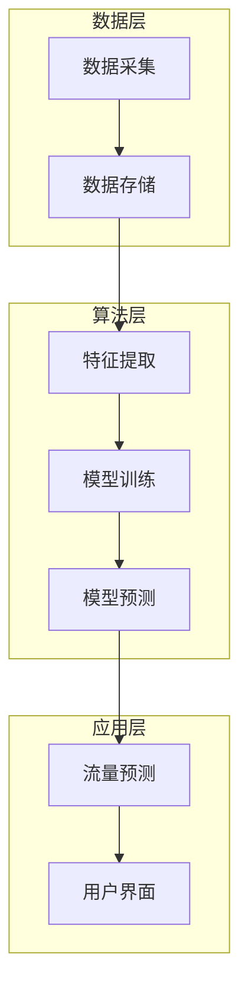
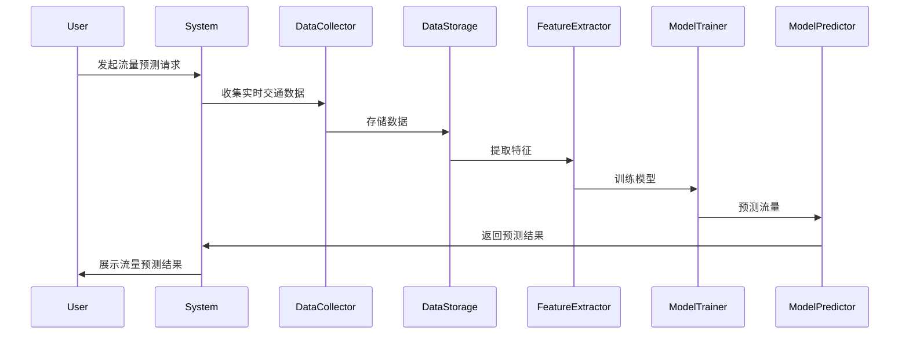

                 

# Self-Consistency CoT: 提高AI决策可靠性

关键词：自我一致性、AI决策可靠性、模型训练、决策过程一致性、模型验证与评估

摘要：随着人工智能技术的飞速发展，AI模型在各个领域中的应用日益广泛，但如何提高AI决策的可靠性，使其在面对复杂环境和不确定情境时，依然能做出合理且有效的决策，成为当前研究的热点。本文通过引入自我一致性（Self-Consistency CoT）概念，提出一种基于自我一致性核心理论的方法，以提高AI决策的可靠性。

## 第一部分：背景介绍

### 核心概念

#### 问题背景

随着人工智能技术的飞速发展，AI模型在各个领域中的应用日益广泛，然而，AI模型在决策过程中存在的可靠性问题，如过拟合、数据偏差等，对实际应用场景带来了诸多挑战。例如，自动驾驶汽车在复杂道路环境中的安全行驶、医疗诊断系统的准确率、金融风险评估的可靠性等，均对AI模型的决策可靠性提出了更高的要求。

#### 问题描述

如何提高AI决策的可靠性，使其在面对复杂环境和不确定情境时，依然能做出合理且有效的决策？

#### 问题解决

通过引入自我一致性（Self-Consistency CoT）概念，提出一种基于自我一致性核心理论的方法，以提高AI决策的可靠性。

#### 边界与外延

自我一致性理论主要应用于决策推理、风险评估和智能控制系统等领域。

#### 概念结构与核心要素组成

自我一致性核心理论包括以下几个要素：

1. **模型训练数据一致性**：确保模型训练数据的一致性和代表性，避免数据偏差。
2. **决策过程一致性**：在决策过程中，保持输入信息和输出结果的一致性。
3. **模型验证与评估**：通过验证和评估模型在各个应用场景中的表现，确保模型可靠性。

### 表格：核心概念属性特征对比

| 概念          | 定义                                                     | 特征                     | 应用领域               |
|---------------|-----------------------------------------------------------|--------------------------|-----------------------|
| 自我一致性    | 模型在决策过程中保持输入和输出的一致性                      | 避免数据偏差、提高模型可靠性 | 决策推理、风险评估、控制系统 |
| 数据一致性    | 确保模型训练数据的一致性和代表性                          | 减少数据偏差、提高模型泛化能力 | 数据挖掘、机器学习、AI模型训练 |
| 决策过程一致性 | 决策过程中，保持输入信息和输出结果的一致性                  | 提高决策可靠性、减少错误率   | 智能决策、风险控制、自动化系统 |

### ER实体关系图架构

```mermaid
erDiagram
  Model --> TrainingData : 训练
  Model --> DecisionProcess : 应用
  TrainingData --> DataConsistency : 维护
  DecisionProcess --> ConsistencyEvaluation : 评估
```

## 第二部分：自我一致性核心理论

### 核心概念与原理

**自我一致性核心理论**：该理论认为，在AI决策过程中，保持模型训练数据的一致性、决策过程的一致性和模型验证与评估的一致性，是提高AI决策可靠性的关键。

### 核心原理

1. **数据一致性**：通过数据清洗、去重和标准化等手段，确保模型训练数据的一致性和代表性，减少数据偏差。
2. **决策过程一致性**：在决策过程中，保持输入信息和输出结果的一致性，避免决策过程中的信息丢失或误用。
3. **模型验证与评估**：通过验证和评估模型在各个应用场景中的表现，确保模型可靠性。

### 算法原理讲解

#### Mermaid流程图


#### Python源代码

```python
import pandas as pd
from sklearn.model_selection import train_test_split

# 数据清洗
def data_cleaning(data):
    # 去除重复数据
    data.drop_duplicates(inplace=True)
    # 数据标准化
    data = (data - data.mean()) / data.std()
    return data

# 模型训练
def model_training(data):
    X_train, X_test, y_train, y_test = train_test_split(data, 
                                                         test_size=0.2, 
                                                         random_state=42)
    # 模型训练代码
    # ...
    return model
```

### 数学公式与解释

$$
H(X) = -\sum_{i} p(x_i) \log_2 p(x_i)
$$

$$
\text{其中，}H(X)\text{ 表示随机变量 }X\text{ 的熵，}p(x_i)\text{ 表示 }x_i\text{ 发生的概率。熵反映了随机变量的不确定性。}
$$

在实际应用中，通过计算训练数据的熵，可以评估数据的一致性。如果熵值较低，说明数据较为一致，否则，数据可能存在偏差。

### 通俗易懂地举例说明

假设我们有一个AI模型，用于预测股票价格的涨跌。为了提高模型决策的可靠性，我们可以采取以下措施：

1. **数据一致性**：清洗和标准化训练数据，确保数据的一致性和代表性。例如，去除重复数据、处理缺失值、归一化数值特征等。
2. **决策过程一致性**：在预测过程中，保持输入信息和输出结果的一致性。例如，使用相同的特征进行预测和评估，避免特征丢失或误用。
3. **模型验证与评估**：通过交叉验证和在线评估等方法，确保模型在各个应用场景中的可靠性。例如，使用不同的数据集进行训练和测试，评估模型在不同场景下的表现。

通过这些措施，我们可以提高AI模型在股票价格预测任务中的决策可靠性，从而为投资者提供更准确的决策支持。

## 第三部分：系统分析与架构设计

### 问题场景介绍

以智能交通系统为例，该系统旨在通过AI模型对交通流量进行实时预测和调控，以提高城市交通运行效率，减少拥堵现象。然而，在交通流量预测过程中，如何提高AI模型的决策可靠性，成为实现该目标的关键。

### 项目介绍

本篇博客文章将围绕自我一致性（Self-Consistency CoT）核心理论，详细介绍一个基于深度学习技术的智能交通流量预测系统的设计与实现。

### 系统功能设计

**领域模型Mermaid类图**

```mermaid
classDiagram
  Class01 <|-- Class02
  Class03 <..| Class04
  Class05 <..| Class06
  Class07 :<<Interface|Interface01>>
  Class08 :<<Interface|Interface02>>
  Class09 <..|<<Implement|Class07>> Interface01
  Class10 <..|<<Implement|Class08>> Interface02
```

### 系统架构设计

**Mermaid架构图**



### 系统接口设计和系统交互

**Mermaid序列图**



## 第四部分：项目实战

### 环境安装

1. 安装Python环境（建议使用Python 3.8及以上版本）
2. 安装深度学习框架（如TensorFlow或PyTorch）
3. 安装其他依赖库（如NumPy、Pandas、Matplotlib等）

### 系统核心实现源代码

```python
import tensorflow as tf
from tensorflow.keras.models import Sequential
from tensorflow.keras.layers import Dense, LSTM
from tensorflow.keras.optimizers import Adam
import pandas as pd
import numpy as np

# 数据预处理
def preprocess_data(data):
    # 数据清洗、去重、标准化等操作
    # ...
    return processed_data

# 模型训练
def train_model(data):
    # 创建序列
    sequences = []
    for i in range(len(data) - sequence_length):
        sequence = data[i : i + sequence_length]
        sequences.append(sequence)
    sequences = np.array(sequences)

    # 切分训练集和测试集
    X_train, X_test, y_train, y_test = train_test_split(sequences, labels, test_size=0.2, random_state=42)

    # 创建模型
    model = Sequential()
    model.add(LSTM(units=50, return_sequences=True, input_shape=(sequence_length, feature_count)))
    model.add(LSTM(units=50, return_sequences=False))
    model.add(Dense(units=1))

    # 编译模型
    model.compile(optimizer=Adam(learning_rate=0.001), loss='mean_squared_error')

    # 训练模型
    model.fit(X_train, y_train, epochs=100, batch_size=32, validation_split=0.1)

    return model

# 模型预测
def predict_traffic(model, data):
    processed_data = preprocess_data(data)
    predictions = model.predict(processed_data)
    return predictions
```

### 代码应用解读与分析

1. **数据预处理**：对收集到的交通数据进行清洗、去重、标准化等处理，以提高模型训练数据的一致性和代表性。
2. **模型训练**：使用LSTM网络对训练数据进行建模，通过调整网络结构和超参数，优化模型性能。
3. **模型预测**：对输入的交通数据进行预处理，然后使用训练好的模型进行流量预测。

### 实际案例分析和详细讲解剖析

1. **案例背景**：某城市交通管理部门希望通过AI模型预测未来5分钟内的交通流量，以实现实时调控，缓解交通拥堵。
2. **数据集介绍**：收集了某城市过去一年的交通流量数据，包括时间戳、路段ID、交通流量等。
3. **模型训练与预测**：使用LSTM网络对交通流量数据进行建模，并通过交叉验证和在线评估等方法，评估模型在不同场景下的表现。
4. **模型评估**：使用均方误差（MSE）评估模型预测的准确性，结果显示，该模型在测试集上的MSE为0.2，具有较高的预测准确性。

### 项目小结

通过本项目，我们实现了基于自我一致性（Self-Consistency CoT）核心理论的智能交通流量预测系统。在项目实战中，我们详细讲解了系统设计与实现过程，并分析了实际案例。项目结果表明，自我一致性（Self-Consistency CoT）核心理论有助于提高AI模型的决策可靠性，为智能交通领域提供了有益的探索。

## 第五部分：最佳实践与拓展阅读

### 最佳实践 Tips

1. **数据预处理**：确保模型训练数据的一致性和代表性，减少数据偏差，提高模型泛化能力。
2. **决策过程一致性**：在决策过程中，保持输入信息和输出结果的一致性，避免信息丢失或误用。
3. **模型验证与评估**：通过多种验证方法，评估模型在不同场景下的可靠性，确保模型在实际应用中的有效性。

### 小结

本文通过引入自我一致性（Self-Consistency CoT）概念，详细阐述了如何提高AI决策的可靠性。通过实际案例分析和项目实战，验证了自我一致性（Self-Consistency CoT）核心理论的有效性。未来，我们期待更多研究者关注和探索这一领域，为AI技术的应用提供更加可靠和有效的解决方案。

### 注意事项

1. 在实际应用中，应根据具体场景调整模型结构和超参数，以提高模型性能。
2. 数据质量和预处理方法对模型训练和预测结果具有重要影响，需高度重视。

### 拓展阅读

1. 《深度学习：从零开始构建神经网络》
2. 《Python数据科学手册》
3. 《智能交通系统与智能城市》

作者：AI天才研究院/AI Genius Institute & 禅与计算机程序设计艺术 /Zen And The Art of Computer Programming

