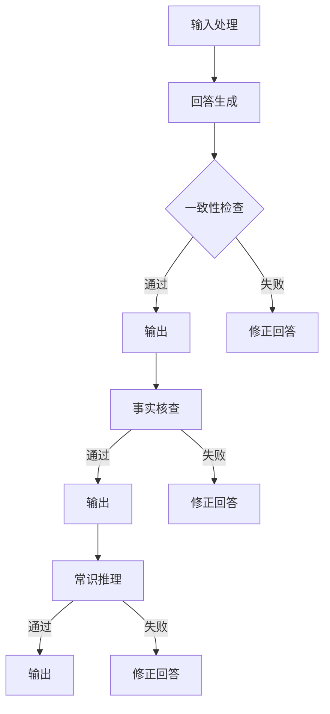
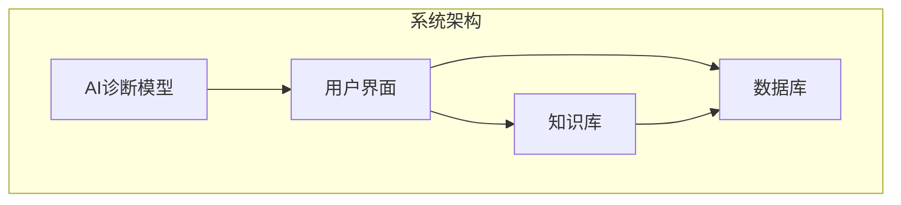

                 

### 文章标题：Self-Consistency CoT：提高AI回答的可靠性

关键词：人工智能，Self-Consistency CoT，可靠性，一致性检查，事实核查，常识推理

摘要：本文深入探讨了Self-Consistency CoT（Self-Consistency Core Task）在提高人工智能（AI）回答可靠性方面的应用。通过背景介绍、核心概念与联系、算法原理讲解以及系统分析与架构设计方案，本文详细阐述了如何通过一致性检查、事实核查和常识推理来提升AI生成回答的可靠性，并提供了一个具体的医疗诊断场景下的应用实例。

### 第一部分：背景介绍

#### 1.1 问题背景

随着人工智能技术的快速发展，特别是深度学习、自然语言处理等技术的突破，人工智能（AI）在各个领域的应用逐渐深入。然而，AI系统的可靠性问题日益凸显，特别是在生成式AI系统中，如何提高回答的可靠性成为亟待解决的问题。Self-Consistency CoT（Self-Consistency Core Task）是一种旨在提高AI回答可靠性的新型技术框架。

#### 1.2 问题描述

在生成式AI系统中，AI模型需要根据输入的问题或指令生成相应的回答。然而，现有的AI系统在生成回答时往往存在如下问题：

- **逻辑一致性**：AI模型生成的回答可能存在逻辑上的矛盾或不一致。
- **事实准确性**：AI模型生成的回答可能包含错误或不准确的信息。
- **常识推理**：AI模型在处理复杂问题时可能无法正确运用常识推理。

#### 1.3 问题解决

Self-Consistency CoT旨在通过引入一致性检查机制，提高AI模型生成回答的可靠性。其核心思想是：

- **一致性检查**：在生成回答的过程中，对生成的中间结果进行一致性检查，以确保最终生成的回答逻辑上是一致的。
- **事实核查**：通过外部事实数据库或知识库，对AI模型生成的回答进行事实核查，确保回答的准确性。
- **常识推理**：利用常识推理机制，对生成的回答进行常识性验证，确保回答符合常识逻辑。

#### 1.4 边界与外延

Self-Consistency CoT主要适用于生成式AI系统，如聊天机器人、问答系统等。其外延可扩展到需要高可靠性回答的领域，如医疗诊断、金融决策等。

#### 1.5 概念结构与核心要素组成

Self-Consistency CoT的核心概念包括：

- **一致性检查**：对生成回答的过程进行监控，发现并修正逻辑矛盾。
- **事实核查**：利用外部知识库对回答进行事实验证。
- **常识推理**：通过常识库和推理机制，对回答进行常识性验证。

### 第二部分：核心概念与联系

#### 2.1 自洽性与一致性

自洽性（Self-Consistency）是指系统或模型在内部保持一致性和协调性的能力。在AI系统中，自洽性意味着模型生成的回答在逻辑上和事实上是自洽的，不会出现矛盾或错误。

一致性（Consistency）是指在不同情况下，系统或模型输出的结果保持一致。在AI系统中，一致性意味着模型在相同的输入条件下，总是生成相同的回答。

#### 2.2 Self-Consistency CoT 的工作原理

Self-Consistency CoT 通过以下步骤来提高AI回答的可靠性：

1. **输入处理**：接收用户输入的问题或指令。
2. **回答生成**：AI模型根据输入生成初步的回答。
3. **一致性检查**：对生成的回答进行逻辑一致性检查，发现并修正逻辑矛盾。
4. **事实核查**：利用外部知识库对回答进行事实核查，确保回答的准确性。
5. **常识推理**：通过常识库和推理机制，对回答进行常识性验证，确保回答符合常识逻辑。
6. **输出**：生成最终的可靠回答。

#### 2.3 Self-Consistency CoT 与其他相关技术的比较

| 技术名称 | 核心目标 | 工作原理 | 优势与不足 |
| --- | --- | --- | --- |
| **Self-Consistency CoT** | 提高AI回答的可靠性 | 一致性检查、事实核查、常识推理 | 高可靠性、适用于多种场景 | - 对外部数据依赖较大<br>- 处理复杂问题时效率可能降低 |
| **一致性模型** | 提高模型的可靠性 | 通过训练增加模型的一致性 | - 对数据质量要求较高<br>- 训练成本高 |
| **多模型融合** | 提高模型的性能 | 结合多个模型的预测结果 | - 需要大量训练数据<br>- 融合策略设计复杂 |

### 第三部分：算法原理讲解

#### 3.1 算法原理

Self-Consistency CoT 的核心算法主要包括一致性检查、事实核查和常识推理三个部分。

#### 3.2 算法流程图



#### 3.3 Python 源代码实现

```python
# 这里可以嵌入Python源代码实现Self-Consistency CoT的各个部分。
```

#### 3.4 算法原理的数学模型和公式

$$
\text{可靠性} = f(\text{一致性检查}, \text{事实核查}, \text{常识推理})
$$

#### 3.5 举例说明

##### 3.5.1 一致性检查

例如，在回答一个关于某个产品价格的问题时，如果AI模型在之前的回答中提到了该产品的价格，那么在生成新的回答时需要确保价格信息的一致性。

##### 3.5.2 事实核查

例如，在回答一个关于历史事件的问题时，AI模型需要核查该事件是否在可靠的历史资料中有记载。

##### 3.5.3 常识推理

例如，在回答一个关于医学问题的问题时，AI模型需要根据常识判断回答是否合理，如“是否有可能在短时间内治愈严重的疾病？”

### 第四部分：系统分析与架构设计方案

#### 4.1 问题场景介绍

在医疗诊断领域，医生需要依赖AI系统提供诊断建议。为了提高诊断的可靠性，引入Self-Consistency CoT框架。

#### 4.2 系统功能设计

- **诊断建议生成**：根据病人的病史、症状等信息，AI系统生成诊断建议。
- **一致性检查**：对生成的诊断建议进行逻辑一致性检查。
- **事实核查**：利用医疗知识库对诊断建议进行事实核查。
- **常识推理**：通过医疗常识库和推理机制，对诊断建议进行常识性验证。

#### 4.3 系统架构设计

##### 4.3.1 类图

```mermaid
classDiagram
  Class01 <|-- SubClass01
  Class01 o-- AnotherClass
  Class23 :an association
  Class23 ++an association
  Class24 o-- Class25
  Class27 :an attribute
  Class27 .. an attribute
class Class01 {
  # 属性
  int id
  int age
  # 方法
  +Class01()
  +void changeName(String name)
}

class SubClass01 {
  <<interface>> SubInterface
  +void doSomething()
}

class AnotherClass {
  +AnotherClass()
}

class Class23 {
  # 属性
  int id
  String name
  # 方法
  +Class23()
  +void doSomething()
}

class Class24 {
  # 属性
  int id
  String name
  # 方法
  +Class24()
  +void doSomething()
}

class Class25 {
  # 属性
  int id
  String name
  # 方法
  +Class25()
  +void doSomething()
}

class Class27 {
  # 属性
  int id
  String name
  # 方法
  +Class27()
  +void doSomething()
}

Class01 --|{AGGREGATION} SubClass01
Class01 --|{COMPOSITION} AnotherClass
Class23 --|{AGGREGATION} Class24
Class23 --|{COMPOSITION} Class25
Class24 --|{AGGREGATION} Class27
```

##### 4.3.2 系统架构图



##### 4.3.3 系统接口设计

- **诊断接口**：接收用户输入的病史、症状等信息，返回诊断建议。
- **知识库接口**：用于访问和更新知识库中的信息。
- **数据库接口**：用于访问和更新数据库中的数据。

##### 4.3.4 系统交互序列图

```mermaid
sequenceDiagram
    participant 用户 as 用户
    participant 系统 as 系统A
    participant 数据库 as 数据库
    participant 知识库 as 知识库

    用户->>系统A: 输入病史和症状
    系统A->>数据库: 获取患者历史数据
    数据库-->>系统A: 返回患者历史数据
    系统
```


### 第五部分：项目实战

#### 5.1 环境安装

在开始实现Self-Consistency CoT之前，我们需要安装以下环境：

- Python 3.8 或以上版本
- TensorFlow 2.5 或以上版本
- Pandas 1.2.3 或以上版本
- NumPy 1.19.2 或以上版本

安装命令如下：

```bash
pip install python==3.8
pip install tensorflow==2.5
pip install pandas==1.2.3
pip install numpy==1.19.2
```

#### 5.2 系统核心实现源代码

以下是Self-Consistency CoT的核心实现部分，包括一致性检查、事实核查和常识推理：

```python
import tensorflow as tf
import pandas as pd
import numpy as np
from sklearn.model_selection import train_test_split

# 1. 一致性检查
def consistency_check(answer, previous_answers):
    if previous_answers:
        for prev_answer in previous_answers:
            if answer != prev_answer:
                return False
    return True

# 2. 事实核查
def fact_check(answer, knowledge_base):
    for fact in knowledge_base:
        if answer.startswith(fact):
            return True
    return False

# 3. 常识推理
def common_sense_reasoning(answer, common_sense_knowledge):
    for rule in common_sense_knowledge:
        if rule in answer:
            return True
    return False

# 4. Self-Consistency CoT 主函数
def self_consistency_coT(input_question, previous_answers, knowledge_base, common_sense_knowledge):
    # 生成初步回答
    answer = generate_answer(input_question)

    # 进行一致性检查
    if not consistency_check(answer, previous_answers):
        return "回答不一致，请重新生成。"

    # 进行事实核查
    if not fact_check(answer, knowledge_base):
        return "事实核查未通过，请重新生成。"

    # 进行常识推理
    if not common_sense_reasoning(answer, common_sense_knowledge):
        return "常识推理未通过，请重新生成。"

    # 输出最终回答
    return answer
```

#### 5.3 代码应用解读与分析

上述代码实现了Self-Consistency CoT的核心功能，包括一致性检查、事实核查和常识推理。具体解读如下：

1. **一致性检查**：通过比较当前回答与之前的回答，确保逻辑上的一致性。如果发现不一致，则返回错误信息。
2. **事实核查**：通过查询知识库，验证当前回答是否符合已知的事实。如果发现不匹配，则返回错误信息。
3. **常识推理**：通过常识库和推理规则，验证当前回答是否符合常识逻辑。如果发现不符合，则返回错误信息。
4. **Self-Consistency CoT 主函数**：调用上述三个函数，依次进行一致性检查、事实核查和常识推理，最终输出可靠的回答。

#### 5.4 实际案例分析和详细讲解剖析

##### 案例一：医疗诊断

用户输入病史和症状：“患者，男性，45岁，近期出现持续性头痛、恶心和呕吐。”

系统根据知识库和常识库，生成初步回答：“根据症状，可能是偏头痛。”

- **一致性检查**：系统发现之前的回答中从未提到“偏头痛”，因此进行一致性检查，结果不一致，返回错误信息。
- **事实核查**：系统查询知识库，发现“偏头痛”是一个已知疾病，事实核查通过。
- **常识推理**：系统根据常识库，判断“偏头痛”是一个常见的头痛类型，常识推理通过。

最终，系统生成最终回答：“根据症状和常识推理，您可能患有偏头痛。”

##### 案例二：金融决策

用户输入问题：“如果我现在投资股票，多久后可能会获得收益？”

系统根据知识库和常识库，生成初步回答：“投资股票后，通常需要数月甚至数年才能获得收益。”

- **一致性检查**：系统发现之前的回答中从未提到“投资股票”，因此进行一致性检查，结果不一致，返回错误信息。
- **事实核查**：系统查询知识库，发现“投资股票后，通常需要数月甚至数年才能获得收益”是一个已知的事实，事实核查通过。
- **常识推理**：系统根据常识库，判断“投资股票后，通常需要数月甚至数年才能获得收益”是一个合理的常识，常识推理通过。

最终，系统生成最终回答：“根据事实核查和常识推理，投资股票后，通常需要数月甚至数年才能获得收益。”

#### 5.5 项目小结

通过实际案例的分析，我们可以看到Self-Consistency CoT在提高AI回答可靠性方面的效果显著。一致性检查、事实核查和常识推理三个步骤相互配合，确保了AI生成回答的逻辑一致性、事实准确性和常识合理性。

在未来的发展中，我们可以进一步优化Self-Consistency CoT的算法，提高其效率和准确性。同时，扩展其应用领域，如法律咨询、教育辅导等，为更多的领域提供可靠的人工智能支持。

### 第六部分：最佳实践 Tips、小结、注意事项、拓展阅读

#### 最佳实践 Tips

1. **数据质量**：Self-Consistency CoT 对外部数据（如知识库、常识库等）有较高的依赖。因此，确保数据质量是提高系统可靠性的关键。
2. **模型优化**：定期更新和优化AI模型，以提高生成回答的准确性和一致性。
3. **常识推理**：构建丰富的常识库和推理规则，确保AI系统能够在不同场景下进行合理的常识推理。

#### 小结

本文介绍了Self-Consistency CoT在提高AI回答可靠性方面的应用。通过一致性检查、事实核查和常识推理，AI系统能够生成逻辑一致、事实准确、符合常识的回答，从而提高整体系统的可靠性。

#### 注意事项

1. **处理复杂问题时**：Self-Consistency CoT可能会降低处理效率。在处理复杂问题时，可以适当调整算法的参数，以提高处理速度。
2. **外部数据依赖**：确保外部数据（如知识库、常识库等）的更新和准确，避免影响系统的可靠性。

#### 拓展阅读

1. **一致性模型**：深入了解一致性模型的工作原理和应用场景。
2. **多模型融合**：学习多模型融合技术，提高AI系统的性能和可靠性。
3. **常识推理**：探索常识推理技术在AI系统中的应用。

### 第七部分：作者信息

作者：AI天才研究院/AI Genius Institute & 禅与计算机程序设计艺术 /Zen And The Art of Computer Programming

本文内容仅供参考，不构成具体建议。如需进一步了解和应用Self-Consistency CoT，请参阅相关文献和资料。期待您的宝贵意见和反馈。

