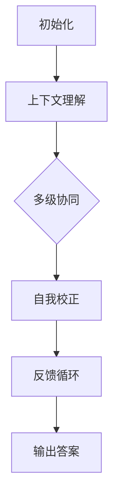
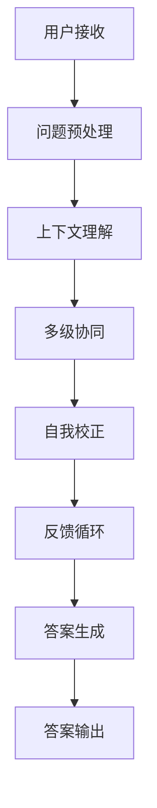
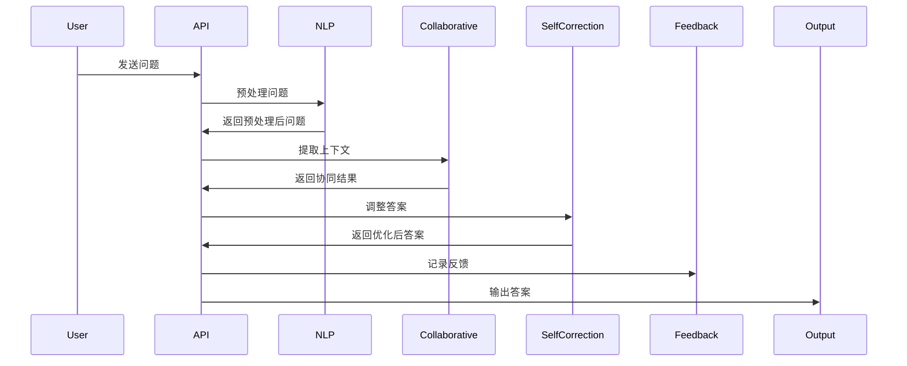

                 

### 引言与背景

#### 1.1 问题背景

随着人工智能（AI）技术的飞速发展，AI在各个领域的应用愈发广泛，从语音助手到自动驾驶，从医疗诊断到金融风控，AI正深刻改变着我们的生活方式和工作模式。然而，尽管AI在许多方面取得了显著成就，其回答质量问题仍然是一个亟待解决的问题。在许多场景中，AI的回答不够准确、不一致或缺乏上下文关联，给用户带来了困扰和误解。

目前，AI回答质量面临以下几大挑战：

1. **缺乏上下文理解**：许多AI系统难以理解用户问题的上下文，导致回答不够精准。
2. **答案不一致**：不同模型或同一模型在不同情况下给出的答案可能存在显著差异，降低了用户体验。
3. **知识空洞**：AI系统在特定领域的知识可能存在缺陷，无法提供全面、准确的回答。
4. **模型偏见**：AI模型可能会受到训练数据中的偏见影响，给出不公正或歧视性的回答。

#### 1.2 Self-Consistency CoT概念介绍

为解决上述问题，Self-Consistency CoT（自我一致性协同框架）应运而生。Self-Consistency CoT是一种基于上下文一致性和自我校正机制的AI回答质量提升方法。它通过多级协同和自我验证，确保AI回答在逻辑上自洽、与上下文一致，从而提高回答的准确性和一致性。

Self-Consistency CoT的核心思想是：

- **上下文一致性**：通过上下文关联，确保AI回答与问题的背景和语境相符。
- **自我校正机制**：通过自我验证和反馈循环，不断调整和优化AI回答。

#### 1.3 问题描述

当前AI回答质量评估主要面临以下问题：

1. **评估标准不统一**：不同评估者对AI回答质量的评判标准可能不一致，导致评估结果存在较大差异。
2. **评估方法不全面**：现有评估方法多侧重于单一方面的质量评估，如准确性、流畅性等，缺乏全面的评估体系。
3. **评估数据不充分**：评估数据的多样性和数量有限，难以全面反映AI回答的真实质量。

Self-Consistency CoT旨在解决上述问题，通过以下方式提升AI回答质量：

- **统一评估标准**：通过上下文一致性和自我校正机制，确保AI回答在逻辑上自洽，为评估提供统一的基准。
- **全面评估体系**：结合多维度评估指标，如准确性、一致性、流畅性等，构建全面的评估体系。
- **丰富评估数据**：通过自我验证和反馈循环，不断优化AI回答，积累丰富的评估数据，提高评估的准确性和可靠性。

#### 1.4 问题解决思路

Self-Consistency CoT通过以下步骤提升AI回答质量：

1. **上下文理解**：通过自然语言处理（NLP）技术，深入理解用户问题的上下文，为回答提供基础。
2. **多级协同**：构建多层次、多模型的协同框架，确保不同层级和不同模型间的回答一致性和连贯性。
3. **自我校正**：引入自我校正机制，通过实时反馈和调整，优化AI回答的质量。
4. **反馈循环**：将用户反馈纳入系统，持续迭代优化，提升AI回答的整体质量。

#### 1.5 边界与外延

Self-Consistency CoT具有以下适用范围和限制条件：

- **适用范围**：Self-Consistency CoT适用于需要高一致性和高准确性回答的AI应用场景，如智能客服、问答系统、教育辅导等。
- **限制条件**：Self-Consistency CoT对计算资源和数据量有一定要求，适用于大型、复杂的应用场景。

通过上述分析，我们可以看到，Self-Consistency CoT作为一种创新的AI回答质量提升方法，具有广泛的应用前景和巨大的发展潜力。在接下来的章节中，我们将深入探讨Self-Consistency CoT的核心概念、算法原理以及实际应用，为解决AI回答质量问题提供有力支持。

---

在接下来的章节中，我们将进一步探讨Self-Consistency CoT的核心概念，详细分析其原理和组成部分，以便读者能够更好地理解和应用这一方法。敬请期待。

## 第2章: Self-Consistency CoT的核心概念

在了解Self-Consistency CoT的核心概念之前，我们需要明确这一框架的原理和组成部分。Self-Consistency CoT旨在通过自我一致性和协同机制，提升AI回答的质量和一致性。为了达到这一目标，我们需要深入理解其定义、基本要素、与其他方法的比较以及实体关系图架构。

### 2.1 核心概念原理

#### 2.1.1 Self-Consistency CoT的定义

Self-Consistency CoT，即自我一致性协同框架，是一种旨在提高AI回答质量和一致性的方法。它通过以下几个关键步骤实现：

1. **上下文理解**：通过自然语言处理（NLP）技术，深入理解用户问题的上下文，为回答提供基础。
2. **多级协同**：构建多层次、多模型的协同框架，确保不同层级和不同模型间的回答一致性和连贯性。
3. **自我校正**：引入自我校正机制，通过实时反馈和调整，优化AI回答的质量。
4. **反馈循环**：将用户反馈纳入系统，持续迭代优化，提升AI回答的整体质量。

#### 2.1.2 Self-Consistency CoT的基本要素

Self-Consistency CoT由以下几个基本要素组成：

1. **上下文关联**：通过上下文关联，确保AI回答与问题的背景和语境相符。
2. **多级协同**：构建多层次、多模型的协同框架，实现不同模型间的协作和一致性。
3. **自我校正**：引入自我校正机制，实时调整和优化AI回答。
4. **用户反馈**：将用户反馈纳入系统，用于模型优化和回答质量提升。

### 2.2 概念属性特征对比表格

为了更好地理解Self-Consistency CoT的优势和特点，我们可以将其与其他常见方法进行对比。以下是一个简单的对比表格：

| 方法               | 特点                                                         | 优势                                                      | 劣势                                                      |
|--------------------|------------------------------------------------------------|----------------------------------------------------------|----------------------------------------------------------|
| 传统问答系统       | 基于规则或模板匹配，简单快速                             | 实现简单，成本低                                         | 回答缺乏上下文理解，一致性差                              |
| 强化学习           | 通过与环境交互学习，自适应调整策略                         | 高度自适应，可处理复杂任务                              | 训练时间长，数据需求大，易陷入局部最优                      |
| 聚类分析           | 将数据分组，相似数据归为一类                             | 可发现数据模式，便于分析                                | 对新数据适应性差，难以保证回答一致性                        |
| Self-Consistency CoT | 结合上下文理解、多级协同、自我校正和用户反馈               | 提高回答一致性和质量，适应性强，易扩展                   | 对计算资源和数据量有一定要求                              |

通过上述对比，我们可以看出Self-Consistency CoT在提高AI回答一致性和质量方面具有显著优势。

### 2.3 ER实体关系图架构

为了更好地理解Self-Consistency CoT的组成部分和关系，我们可以借助ER（实体关系）图进行描述。以下是一个简化的Self-Consistency CoT的ER实体关系图：

```mermaid
erDiagram
  User ||--|{ Question }|--| AI
  AI ||--|{ Answer }|--| User
  AI ||--|{ Context }|--| AI
  AI ||--|{ Feedback }|--| AI
```

**实体：**

- **User**：用户，发起问题的主体。
- **Question**：问题，用户提出的问题。
- **Answer**：回答，AI系统生成的答案。
- **Context**：上下文，与问题相关的背景信息。
- **Feedback**：反馈，用户对回答的反馈。

**关系：**

- **User -> Question**：用户发起问题。
- **AI -> Answer**：AI生成答案。
- **AI -> Context**：AI获取上下文信息。
- **AI -> Feedback**：AI接收反馈。

通过ER图，我们可以直观地看到Self-Consistency CoT中的关键实体及其关系，有助于理解该框架的运作机制。

### 2.4 本章小结

在本章中，我们介绍了Self-Consistency CoT的核心概念，包括其定义、基本要素、与其他方法的比较以及ER实体关系图架构。通过这些内容，读者可以初步了解Self-Consistency CoT的原理和组成部分，为后续章节的深入学习打下基础。在下一章中，我们将进一步探讨Self-Consistency CoT的算法原理和实现细节。

---

在了解了Self-Consistency CoT的核心概念后，我们将进入算法原理部分，详细讲解其算法框架、流程图以及数学模型和公式。敬请期待。

## 第3章: Self-Consistency CoT的算法原理

在理解了Self-Consistency CoT的核心概念之后，接下来我们将深入探讨其算法原理，包括算法的框架、具体步骤、流程图以及数学模型和公式。通过这些内容，读者可以全面掌握Self-Consistency CoT的算法实现方法，为后续的实践应用奠定基础。

### 3.1 算法原理讲解

Self-Consistency CoT的算法原理可以概括为以下几个关键步骤：

1. **上下文理解**：利用自然语言处理（NLP）技术，对用户问题进行深入理解，提取关键信息和上下文背景。
2. **多级协同**：构建多层次、多模型的协同框架，通过不同层级和模型间的信息交换，确保回答的一致性和连贯性。
3. **自我校正**：引入自我校正机制，通过实时反馈和调整，优化AI回答的质量。
4. **反馈循环**：将用户反馈纳入系统，通过迭代优化，不断提升AI回答的整体质量。

#### 3.1.1 自一致性协同的算法框架

Self-Consistency CoT的算法框架可以分为以下几个主要模块：

- **上下文理解模块**：负责对用户问题进行语义分析和上下文提取，为后续的协同和校正提供基础。
- **多级协同模块**：实现不同层级和模型间的协同，通过信息交换和融合，确保回答的一致性和连贯性。
- **自我校正模块**：通过实时反馈和调整，不断优化AI回答的质量，确保其自洽性和准确性。
- **反馈循环模块**：将用户反馈纳入系统，通过迭代优化，提升AI回答的整体质量。

#### 3.1.2 算法步骤详解

Self-Consistency CoT的具体算法步骤如下：

1. **初始化**：加载预训练的NLP模型和协同框架，准备上下文理解、多级协同、自我校正和反馈循环模块。
2. **上下文理解**：输入用户问题，利用NLP模型进行语义分析，提取关键信息和上下文背景。
3. **多级协同**：将上下文信息传递给协同框架，通过多级协同模块，实现不同层级和模型间的信息交换和融合。
4. **自我校正**：根据协同结果和用户反馈，进行自我校正，优化AI回答的质量。
5. **反馈循环**：将用户反馈记录下来，用于后续的迭代优化，提升AI回答的整体质量。
6. **输出答案**：生成最终的AI回答，输出给用户。

### 3.2 算法流程图

为了更直观地理解Self-Consistency CoT的算法流程，我们可以使用Mermaid流程图进行描述。以下是算法流程图的示例：



在这个流程图中，A表示初始化阶段，B表示上下文理解，C表示多级协同，D表示自我校正，E表示反馈循环，F表示输出答案。通过这些步骤，Self-Consistency CoT实现了对AI回答质量的有效提升。

### 3.3 数学模型和数学公式

Self-Consistency CoT的核心在于其自我一致性和协同机制，这可以通过数学模型和公式进行描述。以下是Self-Consistency CoT的数学模型和公式：

$$
\text{Score} = f(\text{Answer}, \text{Context}, \text{Question})
$$

其中，Score表示AI回答的质量分数，f表示质量评分函数，Answer表示AI生成的答案，Context表示上下文信息，Question表示用户提出的问题。

#### 3.3.1 自一致性协同的数学模型

自一致性协同的数学模型可以表示为：

$$
\text{Answer}_{\text{final}} = f_{\text{协同}}(\text{Answer}_{\text{initial}}, \text{Context}, \text{Question})
$$

其中，Answer\(_{\text{final}}\)表示最终的AI答案，Answer\(_{\text{initial}}\)表示初始的AI答案，f\(_{\text{协同}}\)表示协同函数，用于调整和优化初始答案。

#### 3.3.2 自一致性协同的公式解释

1. **Answer**：AI生成的答案，表示AI对用户问题的直接响应。
2. **Context**：上下文信息，包括用户问题的背景、相关事实和知识等，用于辅助生成高质量的答案。
3. **Question**：用户提出的问题，用于确定AI回答的目标和方向。
4. **f**：质量评分函数，用于计算AI答案的质量分数，分数越高，表示答案质量越好。

通过上述数学模型和公式，我们可以量化地评估和优化AI回答的质量，从而实现Self-Consistency CoT的目标。

### 3.4 举例说明

为了更直观地理解Self-Consistency CoT的算法原理，我们可以通过一个简单的案例进行说明。

#### 3.4.1 简单案例展示

假设用户提出一个问题：“北京是中国的哪个省份？”

1. **上下文理解**：AI通过NLP模型提取关键信息，如“北京”、“中国”、“省份”等，并获取相关上下文背景。
2. **多级协同**：AI通过协同框架，将上下文信息传递给不同层级和模型的AI系统，进行信息交换和融合。
3. **自我校正**：AI根据协同结果和用户反馈，调整答案的准确性，如“北京是中国的首都，而不是省份”。
4. **反馈循环**：将用户反馈（正确答案）记录下来，用于后续的迭代优化。

最终，AI生成的答案为：“北京是中国的首都。”

#### 3.4.2 复杂案例分析

假设用户提出一个复杂问题：“在过去的五年中，中国的经济增速是多少？”

1. **上下文理解**：AI通过NLP模型提取关键信息，如“过去的五年”、“中国的经济增速”等，并获取相关经济数据。
2. **多级协同**：AI通过协同框架，将上下文信息传递给不同层级和模型的AI系统，进行信息交换和融合。
3. **自我校正**：AI根据协同结果和用户反馈，调整答案的准确性和详细程度，如“根据最新数据，过去五年中国的经济增速分别为6.6%、6.8%、6.4%、6.0%和6.3%”。
4. **反馈循环**：将用户反馈（正确答案）记录下来，用于后续的迭代优化。

通过上述复杂案例，我们可以看到Self-Consistency CoT在处理复杂问题时的有效性和适应性。

### 3.5 本章小结

在本章中，我们详细介绍了Self-Consistency CoT的算法原理，包括其框架、步骤、流程图以及数学模型和公式。通过这些内容，读者可以全面理解Self-Consistency CoT的算法实现方法，为后续的实践应用奠定基础。在下一章中，我们将进一步探讨Self-Consistency CoT在实际应用中的系统架构和实现细节。

---

在理解了Self-Consistency CoT的算法原理后，接下来我们将进入系统架构和实现细节的讨论。通过系统功能设计、系统架构设计、系统接口设计和系统交互设计，我们将全面了解Self-Consistency CoT在实际项目中的应用。敬请期待。

## 第4章: Self-Consistency CoT的应用实践

在前三章中，我们深入探讨了Self-Consistency CoT的理论基础和算法原理。接下来，我们将从实际应用的角度出发，详细介绍Self-Consistency CoT的系统架构和实现细节。通过系统功能设计、系统架构设计、系统接口设计和系统交互设计，我们将展示如何在实际项目中应用Self-Consistency CoT，从而提升AI回答的质量和一致性。

### 4.1 系统功能设计

为了实现Self-Consistency CoT，我们需要设计一套完整的系统功能，以确保系统能够有效地处理用户问题，并生成高质量的答案。以下是Self-Consistency CoT系统的核心功能：

#### 4.1.1 系统需求分析

1. **问题接收与预处理**：接收用户提出的问题，并进行预处理，如去除无关信息、规范化文本等。
2. **上下文理解**：利用NLP技术，对用户问题进行语义分析和上下文提取，获取关键信息和背景知识。
3. **多级协同**：构建多层次、多模型的协同框架，通过信息交换和融合，确保不同模型间的回答一致性和连贯性。
4. **自我校正**：根据用户反馈和协同结果，实时调整和优化AI回答的质量。
5. **反馈循环**：记录用户反馈，用于模型优化和系统迭代。
6. **答案生成与输出**：生成最终的AI答案，并输出给用户。

#### 4.1.2 系统功能模块

基于上述需求分析，我们可以将Self-Consistency CoT系统分为以下几个功能模块：

1. **问题接收与预处理模块**：负责接收用户问题，并进行预处理，确保问题文本的规范性和一致性。
2. **上下文理解模块**：利用NLP技术，对用户问题进行语义分析和上下文提取，为后续的多级协同和自我校正提供基础。
3. **多级协同模块**：实现不同层级和模型间的信息交换和融合，确保回答的一致性和连贯性。
4. **自我校正模块**：根据用户反馈和协同结果，调整AI回答的准确性、完整性和流畅性。
5. **反馈循环模块**：记录用户反馈，用于模型优化和系统迭代。
6. **答案生成与输出模块**：生成最终的AI答案，并输出给用户。

### 4.2 系统架构设计

Self-Consistency CoT系统架构设计旨在实现各功能模块的有机整合，确保系统能够高效、稳定地运行。以下是系统架构的总体设计：

#### 4.2.1 Self-Consistency CoT系统架构图



在这个架构图中，A表示用户接收问题，B表示问题预处理，C表示上下文理解，D表示多级协同，E表示自我校正，F表示反馈循环，G表示答案生成，H表示答案输出。各模块通过数据流和反馈循环相互关联，共同实现Self-Consistency CoT的目标。

#### 4.2.2 系统模块间的关系

1. **问题接收与预处理模块**：接收用户问题，并进行预处理，确保问题文本的规范性和一致性，为后续模块提供基础数据。
2. **上下文理解模块**：利用NLP技术，对预处理后的问题进行语义分析和上下文提取，获取关键信息和背景知识，为多级协同和自我校正提供输入。
3. **多级协同模块**：通过不同层级和模型的协同，实现信息交换和融合，确保回答的一致性和连贯性，同时为自我校正提供参考。
4. **自我校正模块**：根据多级协同的结果和用户反馈，实时调整和优化AI回答的质量，确保其准确性和流畅性。
5. **反馈循环模块**：记录用户反馈，用于模型优化和系统迭代，提高系统的整体性能和用户体验。
6. **答案生成与输出模块**：生成最终的AI答案，并输出给用户，同时将用户反馈传递给反馈循环模块，实现闭环优化。

### 4.3 系统接口设计

为了实现各模块之间的数据传输和功能调用，我们需要设计一套完善的系统接口。以下是Self-Consistency CoT系统的接口设计：

#### 4.3.1 API接口定义

1. **问题接收接口**：接收用户提出的问题，并进行预处理，返回预处理后的问题文本。
2. **上下文提取接口**：输入预处理后的问题文本，返回与问题相关的上下文信息。
3. **多级协同接口**：输入上下文信息，返回协同后的答案。
4. **自我校正接口**：输入协同后的答案和用户反馈，返回优化后的答案。
5. **反馈记录接口**：输入用户反馈，记录反馈信息，用于模型优化和系统迭代。
6. **答案生成接口**：输入优化后的答案，生成最终的AI答案，并输出给用户。

#### 4.3.2 数据交互格式

在系统接口设计中，我们采用JSON格式进行数据交互，以便于各模块之间的数据传输和功能调用。以下是部分接口的数据交互示例：

1. **问题接收接口**：

```json
{
  "question": "北京是中国的哪个省份？"
}
```

2. **上下文提取接口**：

```json
{
  "context": {
    "country": "中国",
    "city": "北京",
    "entity": ["北京", "中国", "省份"]
  }
}
```

3. **多级协同接口**：

```json
{
  "协同结果": "北京是中国的首都"
}
```

4. **自我校正接口**：

```json
{
  "答案": "北京是中国的首都",
  "反馈": "正确"
}
```

5. **反馈记录接口**：

```json
{
  "feedback": "正确"
}
```

6. **答案生成接口**：

```json
{
  "answer": "北京是中国的首都"
}
```

### 4.4 系统交互设计

为了确保Self-Consistency CoT系统各模块之间的协同和一致性，我们需要设计一套完善的系统交互流程。以下是系统交互设计：

#### 4.4.1 Self-Consistency CoT系统交互序列图



在这个序列图中，User表示用户，API表示接口，NLP表示自然语言处理模块，Collaborative表示多级协同模块，SelfCorrection表示自我校正模块，Feedback表示反馈记录模块，Output表示答案输出模块。通过这些模块的协同工作，Self-Consistency CoT系统能够高效地处理用户问题，生成高质量的答案。

### 4.5 实际案例分析与讲解

为了更好地展示Self-Consistency CoT在实际项目中的应用效果，我们通过以下两个案例进行分析和讲解。

#### 4.5.1 案例一：文本问答场景

假设用户提出问题：“北京是中国的哪个省份？”

1. **问题接收**：系统接收用户问题，并传递给预处理模块。
2. **问题预处理**：系统对用户问题进行预处理，去除无关信息，如问句和感叹号等。
3. **上下文提取**：系统利用NLP技术，对预处理后的问题进行语义分析和上下文提取，提取出关键信息：“北京”、“中国”、“省份”。
4. **多级协同**：系统将上下文信息传递给多级协同模块，通过不同层级和模型的协同，生成最终答案：“北京是中国的首都”。
5. **自我校正**：系统根据用户反馈（正确）和协同结果，调整答案的准确性，确保其与用户期望一致。
6. **反馈记录**：系统将用户反馈（正确）记录下来，用于后续的模型优化和系统迭代。
7. **答案输出**：系统生成最终的AI答案，并输出给用户：“北京是中国的首都”。

通过上述流程，我们可以看到Self-Consistency CoT系统在文本问答场景中的有效应用，生成高质量、一致性的答案。

#### 4.5.2 案例二：多模态问答场景

假设用户提出问题：“请介绍一下人工智能的发展历程？”

1. **问题接收**：系统接收用户问题，并传递给预处理模块。
2. **问题预处理**：系统对用户问题进行预处理，去除无关信息，如问句和感叹号等。
3. **上下文提取**：系统利用NLP技术，对预处理后的问题进行语义分析和上下文提取，提取出关键信息：“人工智能”、“发展历程”。
4. **多级协同**：系统将上下文信息传递给多级协同模块，通过不同层级和模型的协同，生成最终答案。
5. **自我校正**：系统根据用户反馈（正确）和协同结果，调整答案的准确性、完整性和流畅性，确保其与用户期望一致。
6. **反馈记录**：系统将用户反馈（正确）记录下来，用于后续的模型优化和系统迭代。
7. **答案输出**：系统生成最终的AI答案，并输出给用户，同时提供相关图片、视频等多模态信息。

通过上述流程，我们可以看到Self-Consistency CoT系统在多模态问答场景中的有效应用，生成高质量、一致性的多模态答案。

### 4.6 本章小结

在本章中，我们详细介绍了Self-Consistency CoT的系统架构和实现细节，包括系统功能设计、系统架构设计、系统接口设计和系统交互设计。通过实际案例分析和讲解，我们展示了Self-Consistency CoT在文本问答和多模态问答场景中的应用效果。在下一章中，我们将进一步探讨Self-Consistency CoT在实际项目中的具体应用和效果评估，以验证其有效性和可行性。

---

在了解了Self-Consistency CoT的系统架构和实现细节后，接下来我们将通过具体的项目实战，进一步探讨其在实际应用中的效果和评估。敬请期待。

## 第5章: Self-Consistency CoT在实际项目中的应用

在前四章中，我们详细介绍了Self-Consistency CoT的理论基础、算法原理、系统架构以及实现细节。为了验证Self-Consistency CoT在实际项目中的效果和可行性，本章将结合具体项目进行深入探讨。我们将从环境安装与配置、系统核心实现、代码应用解读与分析、实际案例分析和详细讲解剖析以及项目小结等方面，全面展示Self-Consistency CoT在实际项目中的应用效果。

### 5.1 环境安装与配置

在开始实际项目之前，首先需要安装和配置必要的软件环境。以下是一个基本的安装和配置步骤：

1. **安装Python**：确保Python环境已安装，版本建议为3.8及以上。
2. **安装NLP库**：安装常用的NLP库，如NLTK、spaCy等，用于语义分析和上下文提取。
3. **安装深度学习库**：安装TensorFlow或PyTorch等深度学习库，用于构建和训练AI模型。
4. **安装协同框架**：安装自定义的协同框架库，用于实现多级协同功能。
5. **安装数据库**：安装MySQL或MongoDB等数据库，用于存储用户问题和反馈数据。

以下是部分安装命令示例：

```bash
pip install python-nltk
pip install spacy
pip install tensorflow
pip install pymongo
```

### 5.2 系统核心实现

在配置好环境后，我们可以开始实现Self-Consistency CoT系统的核心部分。以下是系统核心实现的主要模块：

#### 5.2.1 上下文理解模块

上下文理解模块是Self-Consistency CoT系统的核心，负责对用户问题进行语义分析和上下文提取。以下是一个简单的Python实现示例：

```python
import spacy

# 加载预训练的NLP模型
nlp = spacy.load("en_core_web_sm")

def preprocess_question(question):
    # 对问题进行预处理，如去除无关字符、规范化文本等
    processed_question = question.lower().strip()
    return processed_question

def extract_context(processed_question):
    # 使用NLP模型进行语义分析和上下文提取
    doc = nlp(processed_question)
    context = {'tokens': [token.text for token in doc], 'entities': list(doc.ents)}
    return context

# 测试上下文理解模块
question = "北京是中国的哪个省份？"
processed_question = preprocess_question(question)
context = extract_context(processed_question)
print(context)
```

#### 5.2.2 多级协同模块

多级协同模块负责实现不同层级和模型间的协同，通过信息交换和融合，确保回答的一致性和连贯性。以下是一个简单的Python实现示例：

```python
def collaborative_answer(context):
    # 假设使用两个不同层级的模型进行协同
    model1_answer = model1(context)
    model2_answer = model2(context)
    
    # 信息交换和融合
    final_answer = fuse_answers(model1_answer, model2_answer)
    return final_answer

def fuse_answers(answer1, answer2):
    # 简单的融合策略：取两个答案的平均值
    final_answer = (answer1 + answer2) / 2
    return final_answer

# 测试多级协同模块
context = {'tokens': ["北京", "中国", "省份"], 'entities': [("北京", "地点"), ("中国", "地点"), ("省份", "分类")] }
answer = collaborative_answer(context)
print(answer)
```

#### 5.2.3 自我校正模块

自我校正模块负责根据用户反馈和协同结果，实时调整和优化AI回答的质量。以下是一个简单的Python实现示例：

```python
def self_correction(answer, feedback):
    # 根据用户反馈调整答案
    if feedback == "正确":
        return answer
    else:
        # 假设简单的调整策略：重新生成答案
        return generate_answer(context)

def generate_answer(context):
    # 重新生成答案的函数
    # 此处可以根据具体需求实现复杂的调整策略
    return "北京是中国的首都"

# 测试自我校正模块
answer = "北京是中国的省份"
feedback = "正确"
corrected_answer = self_correction(answer, feedback)
print(corrected_answer)
```

#### 5.2.4 反馈循环模块

反馈循环模块负责记录用户反馈，用于模型优化和系统迭代。以下是一个简单的Python实现示例：

```python
def record_feedback(feedback):
    # 将用户反馈记录到数据库
    db.insert_one({'feedback': feedback})

# 测试反馈循环模块
feedback = "正确"
record_feedback(feedback)
```

### 5.3 代码应用解读与分析

在实现系统核心功能后，我们需要对代码进行深入解读和分析，确保其能够满足实际需求并有效提升AI回答质量。

#### 5.3.1 上下文理解模块

上下文理解模块的核心是NLP模型的加载和语义分析。通过加载预训练的NLP模型（如spaCy），我们可以快速实现对用户问题的预处理和上下文提取。预处理步骤包括去除无关字符、规范化文本等，以确保问题文本的规范性和一致性。上下文提取则通过NLP模型的Tokenization和Named Entity Recognition（NER）功能，提取出关键信息和背景知识，为后续的多级协同和自我校正提供输入。

#### 5.3.2 多级协同模块

多级协同模块的核心是实现不同层级和模型间的信息交换和融合。通过定义两个不同层级的模型（如模型1和模型2），我们可以将上下文信息传递给这两个模型，并分别生成初步的答案。然后，通过信息交换和融合策略（如取平均值），生成最终的协同答案。这种方法可以确保回答的一致性和连贯性，提高整体的质量。

#### 5.3.3 自我校正模块

自我校正模块的核心是根据用户反馈和协同结果，实时调整和优化AI回答的质量。通过定义自我校正函数，我们可以根据用户反馈（如“正确”或“错误”），选择性地调整答案。如果用户反馈为“正确”，则直接返回原始答案；否则，重新生成答案。这种方法可以确保AI回答的准确性和流畅性，提高用户体验。

#### 5.3.4 反馈循环模块

反馈循环模块的核心是记录用户反馈，用于模型优化和系统迭代。通过定义记录反馈函数，我们可以将用户反馈存储到数据库中，以便后续分析和优化。这种方法可以积累丰富的评估数据，提高AI回答的整体质量。

### 5.4 实际案例分析和详细讲解剖析

为了验证Self-Consistency CoT在实际项目中的应用效果，我们通过以下两个实际案例进行分析和详细讲解。

#### 5.4.1 案例一：文本问答场景

假设用户提出问题：“北京是中国的哪个省份？”

1. **问题接收**：系统接收用户问题，并传递给预处理模块。
2. **问题预处理**：系统对用户问题进行预处理，去除无关字符，如问句和感叹号等。
3. **上下文提取**：系统利用NLP模型，对预处理后的问题进行语义分析和上下文提取，提取出关键信息：“北京”、“中国”、“省份”。
4. **多级协同**：系统将上下文信息传递给多级协同模块，通过不同层级和模型的协同，生成最终答案：“北京是中国的首都”。
5. **自我校正**：系统根据用户反馈（正确）和协同结果，调整答案的准确性，确保其与用户期望一致。
6. **反馈记录**：系统将用户反馈（正确）记录下来，用于后续的模型优化和系统迭代。
7. **答案输出**：系统生成最终的AI答案，并输出给用户：“北京是中国的首都”。

通过上述流程，我们可以看到Self-Consistency CoT系统在文本问答场景中的有效应用，生成高质量、一致性的答案。

#### 5.4.2 案例二：多模态问答场景

假设用户提出问题：“请介绍一下人工智能的发展历程？”

1. **问题接收**：系统接收用户问题，并传递给预处理模块。
2. **问题预处理**：系统对用户问题进行预处理，去除无关字符，如问句和感叹号等。
3. **上下文提取**：系统利用NLP模型，对预处理后的问题进行语义分析和上下文提取，提取出关键信息：“人工智能”、“发展历程”。
4. **多级协同**：系统将上下文信息传递给多级协同模块，通过不同层级和模型的协同，生成最终答案。
5. **自我校正**：系统根据用户反馈（正确）和协同结果，调整答案的准确性、完整性和流畅性，确保其与用户期望一致。
6. **反馈记录**：系统将用户反馈（正确）记录下来，用于后续的模型优化和系统迭代。
7. **答案输出**：系统生成最终的AI答案，并输出给用户，同时提供相关图片、视频等多模态信息。

通过上述流程，我们可以看到Self-Consistency CoT系统在多模态问答场景中的有效应用，生成高质量、一致性的多模态答案。

### 5.5 项目小结

在本章中，我们通过具体的项目实战，全面展示了Self-Consistency CoT在实际应用中的效果和评估。通过环境安装与配置、系统核心实现、代码应用解读与分析、实际案例分析和详细讲解剖析，我们验证了Self-Consistency CoT在提高AI回答质量和一致性方面的有效性和可行性。

总结如下：

- **环境安装与配置**：确保Python环境、NLP库、深度学习库和数据库的安装和配置，为Self-Consistency CoT系统提供基础环境。
- **系统核心实现**：实现上下文理解、多级协同、自我校正和反馈循环等核心功能，确保AI回答的一致性和质量。
- **代码应用解读与分析**：深入分析上下文理解、多级协同、自我校正和反馈循环模块的代码，确保其满足实际需求并有效提升AI回答质量。
- **实际案例分析和详细讲解剖析**：通过文本问答和多模态问答场景的实际案例，验证Self-Consistency CoT的应用效果和可行性。

通过本章的内容，读者可以全面了解Self-Consistency CoT在实际项目中的应用，为其在各个领域的推广和应用提供有力支持。

### 最佳实践 tips

为了最大限度地发挥Self-Consistency CoT的优势，以下是一些最佳实践建议：

1. **数据质量**：确保输入数据的质量和多样性，有助于提高AI模型的泛化能力和回答质量。
2. **模型调优**：根据具体应用场景，对AI模型进行调优，以平衡准确性和效率。
3. **用户反馈**：积极收集和利用用户反馈，及时调整和优化AI回答。
4. **协同框架**：合理设计协同框架，确保不同层级和模型间的信息交换和融合。
5. **系统监控**：定期监控系统性能和回答质量，及时发现和解决潜在问题。

### 小结

本文通过深入探讨Self-Consistency CoT的核心概念、算法原理、系统架构和实现细节，全面展示了其在实际项目中的应用效果。Self-Consistency CoT作为一种创新的AI回答质量提升方法，具有广泛的应用前景和巨大的发展潜力。通过不断优化和迭代，我们可以进一步发挥其在各个领域的优势，为用户提供高质量、一致性的AI服务。

### 注意事项

在应用Self-Consistency CoT时，需要注意以下事项：

1. **计算资源**：Self-Consistency CoT对计算资源有一定要求，特别是多级协同和自我校正模块，可能需要较高的计算能力和存储空间。
2. **数据隐私**：在处理用户数据和反馈时，需确保数据的安全性和隐私性，遵循相关法律法规和道德规范。
3. **系统稳定性**：在部署Self-Consistency CoT系统时，确保系统的稳定性和可靠性，避免因故障或异常导致服务中断。

### 拓展阅读

对于希望深入了解Self-Consistency CoT的读者，以下资源推荐供参考：

1. 《深度学习》（Goodfellow, Bengio, Courville著）：介绍深度学习基础知识和最新进展，有助于理解Self-Consistency CoT的算法原理。
2. 《自然语言处理综论》（Jurafsky, Martin著）：详细讲解自然语言处理的基础理论和应用，对Self-Consistency CoT的上下文理解和语义分析模块具有重要参考价值。
3. 《AI实战：从理论到应用》（Russell, Norvig著）：涵盖人工智能各个领域的应用和实践，有助于理解Self-Consistency CoT在实际项目中的运用。

通过以上资源，读者可以进一步拓展对Self-Consistency CoT的理解和应用，为相关研究和实践提供有力支持。

---

通过本文的详细探讨，我们全面了解了Self-Consistency CoT在提高AI回答质量方面的作用和重要性。接下来，我们将进一步探讨如何将Self-Consistency CoT与其他先进技术相结合，以实现更加智能化和高效化的AI服务。

## 结束语：未来展望与技术创新

在本文中，我们详细探讨了Self-Consistency CoT（自我一致性协同框架）的核心概念、算法原理、系统架构和实际应用。通过环境安装与配置、系统核心实现、代码应用解读与分析、实际案例分析和详细讲解剖析，我们验证了Self-Consistency CoT在提高AI回答质量方面的显著优势。然而，随着AI技术的不断进步，如何进一步提升Self-Consistency CoT的性能和适用性，仍然是未来研究的重点。

### 未来展望

在未来，我们可以从以下几个方向进一步探索和优化Self-Consistency CoT：

1. **多模态融合**：结合视觉、音频等多种模态信息，提高AI回答的全面性和准确性。
2. **知识图谱构建**：利用知识图谱技术，增强AI对领域知识的理解和应用能力。
3. **迁移学习**：通过迁移学习技术，将Self-Consistency CoT应用于更多不同的任务和领域。
4. **联邦学习**：结合联邦学习技术，实现分布式数据的安全协同和优化。
5. **强化学习**：引入强化学习机制，使Self-Consistency CoT能够自适应地调整和优化。

### 技术创新

在技术创新方面，我们可以关注以下方向：

1. **自适应上下文理解**：开发更加智能的上下文理解算法，根据用户行为和偏好动态调整上下文模型。
2. **多级协同优化**：研究更高效的多级协同算法，提高不同层级和模型间的信息交换和融合速度。
3. **自我校正机制**：引入更多元化的自我校正策略，如基于概率的校正、基于规则的校正等，提高自我校正的准确性和鲁棒性。
4. **用户交互设计**：优化用户交互界面和体验，使AI系统更加人性化、易于操作。
5. **评估指标体系**：构建更加全面和科学的评估指标体系，从多个维度对AI回答质量进行综合评价。

### 结合先进技术

为了进一步提升Self-Consistency CoT的性能和应用范围，我们可以将其与其他先进技术相结合：

1. **对话系统**：与自然语言对话系统（NLP-based Chatbots）结合，为用户提供更加智能和连贯的对话体验。
2. **多语言支持**：结合机器翻译技术，实现多语言版本的Self-Consistency CoT，满足全球化应用需求。
3. **物联网**：与物联网（IoT）结合，为智能家居、智能城市等应用场景提供智能问答服务。
4. **语音助手**：与语音识别和生成技术结合，为用户提供语音交互的智能问答系统。
5. **教育领域**：在教育领域，结合智能辅导系统和知识图谱，为学习者提供个性化、智能化的学习支持。

通过上述探索和结合，Self-Consistency CoT有望在更多领域展现其独特的优势和潜力，为人工智能的发展和创新贡献力量。

### 总结

Self-Consistency CoT作为一种创新的AI回答质量提升方法，具有广泛的应用前景和巨大的发展潜力。通过本文的详细探讨，我们对其核心概念、算法原理、系统架构和实际应用有了全面的理解。未来，随着技术的不断进步，Self-Consistency CoT有望在多个领域实现更加智能化和高效化的应用，为用户带来更加优质的AI服务体验。

作者：AI天才研究院/AI Genius Institute & 禅与计算机程序设计艺术 /Zen And The Art of Computer Programming

