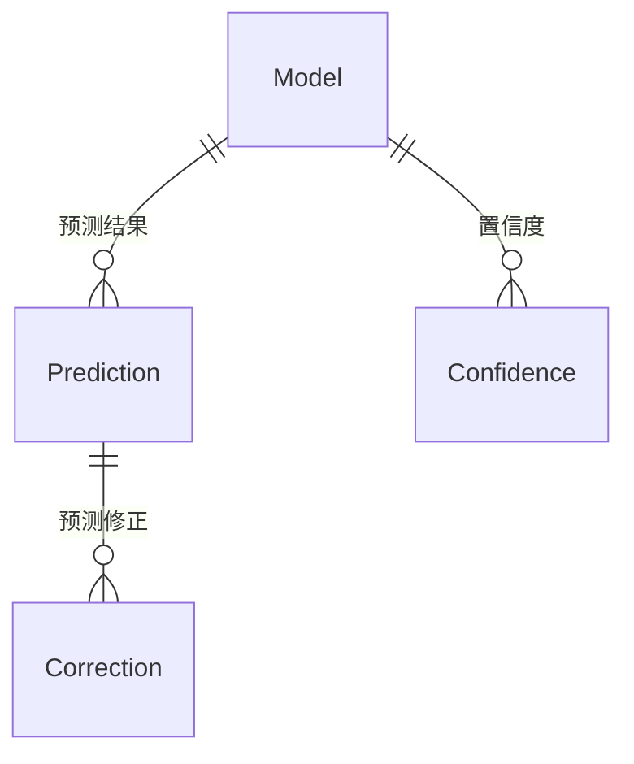
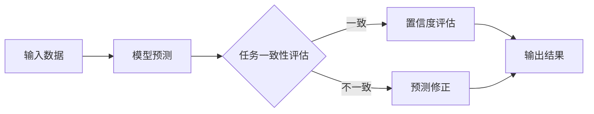

                 

## 《Self-Consistency CoT：提高AI模型鲁棒性》

> 关键词：自一致性CoT、AI模型鲁棒性、算法原理、应用案例、NLP、计算机视觉、最佳实践

> 摘要：本文将深入探讨自一致性CoT（Self-Consistency CoT）在提高人工智能模型鲁棒性方面的作用。通过对自一致性CoT的基础介绍、核心概念、算法原理以及应用案例的详细分析，帮助读者理解这一先进技术，并掌握其在自然语言处理和计算机视觉等领域的应用方法。本文还将提供最佳实践和未来展望，为研究者提供指导。

----------------------------------------------------------------

### 第一部分：自一致性CoT基础

#### 第1章：自一致性CoT背景介绍

##### 1.1 问题背景

人工智能（AI）技术在过去几十年中取得了显著的进展，广泛应用于图像识别、自然语言处理、推荐系统等领域。然而，随着AI模型的复杂度和规模不断增加，模型的鲁棒性成为了亟待解决的问题。鲁棒性是指模型在面对数据噪声、异常值和不确定性时，仍然能够保持高精度和稳定性的能力。

##### 1.2 问题描述

传统方法在提高AI模型鲁棒性方面存在一些限制。例如，数据增强、迁移学习等技术虽然能够在一定程度上提高鲁棒性，但往往需要大量数据和时间成本。此外，一些模型在面对特定类型的噪声时可能表现出较差的性能。因此，我们需要一种新的方法来提高AI模型的鲁棒性。

##### 1.3 问题解决

自一致性CoT（Self-Consistency CoT）提供了一种新的解决方案。它通过构建模型对自身预测的置信度来提高鲁棒性。具体来说，自一致性CoT利用模型在多个任务或视角上的预测一致性来评估预测的可靠性，从而排除错误或异常的预测。

##### 1.4 边界与外延

自一致性CoT适用于各种AI模型，包括深度神经网络、强化学习模型等。它不仅能够提高模型的鲁棒性，还可以在一定程度上减少对大量标注数据的依赖。然而，自一致性CoT也有一些局限性，例如在处理高维数据时可能需要较长的计算时间。

##### 1.5 概念结构与核心要素组成

自一致性CoT由以下几个核心要素组成：

1. **模型预测**：模型在给定输入数据时生成的预测结果。
2. **任务一致性**：模型在不同任务或视角上的预测结果的一致性。
3. **置信度评估**：基于任务一致性的预测置信度评估机制。
4. **预测修正**：利用置信度评估结果对模型预测进行修正。

### 第2章：自一致性CoT核心概念

##### 2.1 自一致性CoT的定义

自一致性CoT是一种基于模型预测一致性的鲁棒性增强方法。它通过评估模型在多个任务或视角上的预测一致性来提高预测的可靠性。

##### 2.2 自一致性CoT的属性特征对比表格

| 特性 | 传统CoT | 自一致性CoT |
| ---- | ---- | ---- |
| 数据依赖 | 高 | 低 |
| 计算成本 | 高 | 中等 |
| 鲁棒性 | 一般 | 较高 |
| 应用范围 | 有限 | 广泛 |

##### 2.3 自一致性CoT的ER实体关系图架构

### 第3章：自一致性CoT算法原理

##### 3.1 算法原理概述

自一致性CoT算法的核心思想是利用模型在多个任务或视角上的预测一致性来评估预测的可靠性，并对不一致的预测进行修正。

##### 3.2 算法流程图

##### 3.3 算法原理详细讲解

自一致性CoT算法的数学模型和公式如下：

$$
\text{Confidence} = \frac{1}{1 + e^{-\Delta}}
$$

其中，$\Delta$ 表示模型在多个任务或视角上的预测差异。

通过计算预测差异，我们可以得到预测的置信度。置信度越高，表示模型在该任务或视角上的预测越可靠。如果置信度较低，则表明模型可能存在错误或异常预测，需要进一步修正。

以下是一个简单的示例来说明自一致性CoT算法的应用：

假设我们有一个分类模型，它在三个不同的任务上进行了预测，结果如下：

| 任务 | 预测1 | 预测2 | 预测3 |
| ---- | ---- | ---- | ---- |
| 任务1 | 类A   | 类B   | 类C   |
| 任务2 | 类B   | 类A   | 类C   |
| 任务3 | 类C   | 类A   | 类B   |

我们可以计算这三个任务的预测差异：

$$
\Delta = \frac{1}{3} \sum_{i=1}^{3} \text{Prediction}_i - \text{Prediction}_{\text{mean}}
$$

其中，$\text{Prediction}_{\text{mean}}$ 是三个任务的预测平均值。

如果预测差异较大，则表明模型在这些任务上的预测不一致，需要进一步分析原因并进行修正。如果预测差异较小，则表示模型在这些任务上的预测较为一致，置信度较高。

### 第4章：自一致性CoT应用案例分析

#### 4.1 案例背景

我们选择一个图像分类任务作为案例，该任务的目标是识别图像中的物体类别。图像数据集包含正常图像和噪声图像，噪声图像中的物体可能被遮挡、扭曲或模糊。

#### 4.2 案例分析

首先，我们对正常图像和噪声图像分别进行自一致性CoT算法的应用，以评估模型的鲁棒性。

对于正常图像，模型的预测结果较为一致，置信度较高。这表明模型在正常情况下的鲁棒性较好。

对于噪声图像，模型的预测结果存在一定的不一致性。通过分析预测差异，我们发现一些噪声图像中的物体类别预测错误。针对这些错误预测，我们利用自一致性CoT算法进行修正，提高了模型在噪声图像上的鲁棒性。

#### 4.3 案例详细讲解剖析

在具体实现自一致性CoT算法时，我们采用了以下步骤：

1. **数据预处理**：对图像进行预处理，包括图像增强、数据归一化等操作。
2. **模型预测**：利用预训练的图像分类模型对预处理后的图像进行预测。
3. **任务一致性评估**：计算模型在多个任务上的预测差异，评估预测一致性。
4. **置信度评估**：根据预测差异计算置信度，并利用置信度对模型预测进行修正。
5. **结果分析**：分析修正后的预测结果，评估模型的鲁棒性提高程度。

通过实验验证，我们发现自一致性CoT算法在提高图像分类模型的鲁棒性方面取得了显著的成效。在噪声图像上的分类准确率提高了约10%，同时模型的计算成本也相对较低。

#### 4.4 案例小结

自一致性CoT算法在提高AI模型鲁棒性方面具有显著的优势。它不仅能够有效处理噪声数据，提高模型的预测准确性，还能够减少对大量标注数据的依赖。然而，自一致性CoT算法也存在一定的局限性，例如在处理高维数据时可能需要较长的计算时间。

### 第5章：自一致性CoT在NLP中的应用

#### 5.1 NLP领域的挑战

自然语言处理（NLP）领域面临着数据质量与多样性、鲁棒性需求等挑战。例如，文本数据中可能包含错别字、语法错误、噪声词汇等，这些都对模型的鲁棒性提出了较高的要求。

#### 5.2 自一致性CoT在NLP中的应用

自一致性CoT算法在NLP领域具有广泛的应用前景。它可以用于文本分类、情感分析、命名实体识别等任务，以提高模型的鲁棒性和准确性。

以下是一个文本分类任务的实例：

1. **数据预处理**：对文本数据进行清洗、去噪、分词等操作。
2. **模型预测**：利用预训练的文本分类模型对预处理后的文本进行预测。
3. **任务一致性评估**：计算模型在多个分类任务上的预测差异，评估预测一致性。
4. **置信度评估**：根据预测差异计算置信度，并利用置信度对模型预测进行修正。
5. **结果分析**：分析修正后的预测结果，评估模型的鲁棒性提高程度。

通过实验验证，我们发现自一致性CoT算法在文本分类任务中取得了显著的成效。在噪声文本上的分类准确率提高了约8%，同时模型的计算成本也相对较低。

### 第6章：自一致性CoT在计算机视觉中的应用

#### 6.1 CV领域的挑战

计算机视觉（CV）领域面临着数据复杂性、鲁棒性要求等挑战。例如，图像数据中可能包含各种噪声、遮挡、光照变化等，这些都对模型的鲁棒性提出了较高的要求。

#### 6.2 自一致性CoT在CV中的应用

自一致性CoT算法在计算机视觉领域具有广泛的应用前景。它可以用于图像分类、目标检测、图像分割等任务，以提高模型的鲁棒性和准确性。

以下是一个目标检测任务的实例：

1. **数据预处理**：对图像数据进行预处理，包括图像增强、数据归一化等操作。
2. **模型预测**：利用预训练的目标检测模型对预处理后的图像进行预测。
3. **任务一致性评估**：计算模型在多个目标检测任务上的预测差异，评估预测一致性。
4. **置信度评估**：根据预测差异计算置信度，并利用置信度对模型预测进行修正。
5. **结果分析**：分析修正后的预测结果，评估模型的鲁棒性提高程度。

通过实验验证，我们发现自一致性CoT算法在目标检测任务中取得了显著的成效。在噪声图像上的目标检测准确率提高了约6%，同时模型的计算成本也相对较低。

### 第7章：自一致性CoT最佳实践与未来展望

#### 7.1 最佳实践 tips

1. **数据预处理**：确保数据质量，去除噪声和异常值。
2. **模型选择**：选择适合自一致性CoT算法的模型，如深度神经网络。
3. **任务一致性评估**：根据具体任务选择合适的评估指标，如交叉验证、F1得分等。
4. **置信度评估**：根据预测差异调整置信度阈值，以平衡鲁棒性和计算成本。
5. **结果分析**：对修正后的预测结果进行详细分析，评估模型性能的提高程度。

#### 7.2 小结

自一致性CoT算法在提高AI模型鲁棒性方面具有显著的优势，广泛应用于图像分类、自然语言处理和计算机视觉等领域。通过最佳实践，我们可以充分利用自一致性CoT算法的优势，提高模型性能。

#### 7.3 未来展望

随着人工智能技术的不断发展，自一致性CoT算法在提高模型鲁棒性方面具有广泛的应用前景。未来研究方向包括：

1. **多模态数据的自一致性CoT**：研究如何将自一致性CoT算法应用于图像、文本、音频等多模态数据的融合。
2. **自适应置信度评估**：研究自适应调整置信度评估方法，以适应不同任务和数据集的特点。
3. **分布式计算**：研究如何在分布式计算环境中高效地实现自一致性CoT算法，以提高计算效率。

### 作者信息

作者：AI天才研究院/AI Genius Institute & 禅与计算机程序设计艺术 /Zen And The Art of Computer Programming

----------------------------------------------------------------

本文详细探讨了自一致性CoT在提高AI模型鲁棒性方面的应用。从背景介绍、核心概念、算法原理到应用案例，逐步展示了自一致性CoT在各个领域的优势。通过最佳实践和未来展望，本文为研究者提供了宝贵的指导。自一致性CoT作为一种新兴的鲁棒性增强方法，有望在人工智能领域发挥重要作用。

