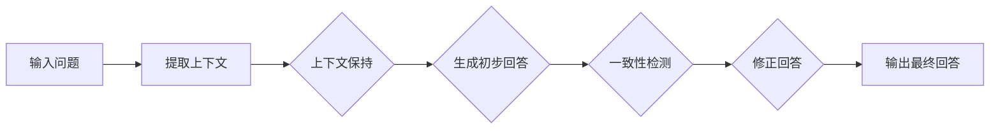
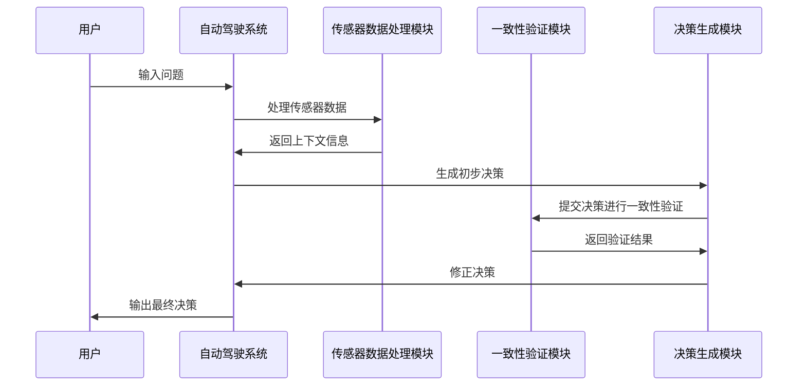

                 

### Self-Consistency CoT：提高AI输出一致性的关键

> 关键词：自我一致性、AI输出、一致性检测、上下文保持、算法原理、数学模型

> 摘要：本文将深入探讨自我一致性在提高人工智能（AI）输出一致性方面的关键作用。通过详细分析自我一致性的核心概念、实现算法原理、数学模型以及实际应用案例，本文旨在为读者提供一个全面的技术指南，帮助理解自我一致性的重要性及其在实际应用中的实现方法。

### 背景介绍

随着人工智能技术的迅猛发展，自我一致性（Self-Consistency）成为提高人工智能（AI）输出一致性的关键。自我一致性是指模型在生成回答或预测时，能够保持内在逻辑的一致性，避免矛盾和不一致的情况。自我一致性的重要性体现在以下几个方面：

1. **提高AI决策的可信度**：当AI系统生成回答或预测时，如果存在逻辑不一致的情况，将降低用户对AI系统决策的信任度。通过提高自我一致性，可以增强用户对AI系统决策的信心。

2. **提升AI应用效果**：在一些关键应用场景中，如金融风险评估、医疗诊断等，AI输出的一致性直接关系到应用效果。自我一致性有助于提高AI在这些领域的表现。

3. **改善用户体验**：在自然语言处理、聊天机器人等应用中，AI输出的一致性直接影响用户体验。一致性较好的AI输出能更好地满足用户需求，提高用户满意度。

### 核心概念与联系

自我一致性（Self-Consistency）是指AI模型在生成回答或预测时，能够保持内在逻辑的一致性。它包括以下几个方面：

1. **内部一致性**：AI模型生成的回答或预测在内部逻辑上保持一致，不会出现相互矛盾的结论。
2. **跨模型一致性**：不同模型在处理同一问题时，能够生成逻辑上保持一致的答案。
3. **上下文一致性**：AI模型在处理连续问题时，能够保持上下文的一致性，不会因为问题的顺序变化而导致逻辑不一致。

为了更好地理解自我一致性的概念，我们将对比以下几种相关概念：

| 概念                     | 描述                                                         | 关系与联系                                             |
|------------------------|------------------------------------------------------------|----------------------------------------------------|
| 自洽性                   | 一个系统或理论在逻辑上自洽，不存在内部矛盾。                   | 自洽性与自我一致性密切相关，都是关注系统内部的一致性。             |
| 一致性验证               | 验证AI输出是否与预期一致。                                     | 一致性验证是评估自我一致性的方法之一，有助于发现和纠正不一致的情况。 |
| 知识图谱                 | 用图结构表示实体及其关系的数据结构。                           | 知识图谱有助于构建自我一致性，通过实体间的关系来保持输出的一致性。   |

### ER实体关系图架构

为了更好地阐述自我一致性的实现，我们将使用Mermaid绘制一个ER实体关系图，展示涉及的主要实体及其关系。

```mermaid
erDiagram
    AI模型 ||--o{ 用户问题
    AI模型 ||--o{ 回答
    用户问题 ||--o{ 问题上下文
    回答 ||--o{ 回答上下文
    回答 ||--|{ 自我一致性验证 结果
```

### 算法原理讲解

自我一致性的提高可以通过以下算法实现：

1. **一致性检测算法**：通过检查AI模型的输出，发现和纠正逻辑不一致的情况。具体实现可以使用图论算法，如拓扑排序，来检测模型输出的依赖关系，找出逻辑不一致的部分。

2. **上下文保持算法**：通过保持问题的上下文信息，确保模型在处理连续问题时能够保持一致性。具体实现可以使用注意力机制，将上下文信息编码到模型中，使其在生成回答时能够考虑上下文。

以下是一个简化的算法流程图，展示自我一致性提高的基本思路：



### 数学模型和数学公式

自我一致性的实现可以基于以下数学模型：

$$
P(\text{回答一致}|\text{问题上下文}, \text{模型参数}) = \frac{P(\text{回答一致}, \text{问题上下文}, \text{模型参数})}{P(\text{问题上下文}, \text{模型参数})}
$$

其中，$P(\text{回答一致}, \text{问题上下文}, \text{模型参数})$ 表示在给定问题上下文和模型参数的情况下，回答一致的概率；$P(\text{问题上下文}, \text{模型参数})$ 表示在给定问题上下文和模型参数的情况下，任何回答的概率。

### 系统分析与架构设计方案

#### 问题场景介绍

在当前的人工智能应用场景中，自我一致性主要应用于需要高精度、高可靠性的AI系统，例如自动驾驶、智能客服、医疗诊断等。这些领域对AI的输出一致性要求极高，因为任何不一致的输出都可能带来严重的后果。

#### 项目介绍

为了解决自动驾驶领域中的自我一致性需求，我们开发了一个自动驾驶AI系统。该系统旨在提高自动驾驶车辆在复杂环境下的决策一致性和安全性。

#### 系统功能设计

系统的主要功能包括：

1. **问题识别**：检测车辆在行驶过程中遇到的复杂问题，如道路障碍、行人横穿等。
2. **上下文保持**：通过传感器数据和历史决策信息，保持问题的上下文一致性。
3. **决策生成**：根据上下文信息生成驾驶决策，如加速、减速、转向等。
4. **一致性验证**：验证决策的一致性，确保不会产生矛盾或不一致的情况。
5. **修正决策**：根据验证结果修正决策，确保最终的驾驶决策一致性。

#### 系统架构设计

系统的整体架构设计如下：



#### 系统接口设计和系统交互

系统的主要接口设计和交互流程如下：

1. **用户接口**：用户通过输入框提交问题，系统接收到问题后进行处理。
2. **传感器接口**：系统通过传感器接口获取车辆周围的实时环境数据。
3. **数据处理接口**：传感器数据处理模块对获取的数据进行处理，提取关键信息。
4. **决策生成接口**：决策生成模块根据处理后的上下文信息生成初步决策。
5. **一致性验证接口**：一致性验证模块对初步决策进行验证，确保其一致性。
6. **修正决策接口**：根据验证结果修正决策，确保最终的决策一致性。

### 项目实战

#### 环境安装

1. 安装Python环境（建议使用Python 3.8及以上版本）。
2. 安装TensorFlow和Keras，用于模型训练和预测。
3. 安装Mermaid，用于生成图表。

```bash
pip install tensorflow keras mermaid-python
```

#### 系统核心实现源代码

```python
# 传感器数据处理模块
class SensorDataProcessor:
    def process_data(self, raw_data):
        # 处理传感器原始数据
        # ...
        return processed_data

# 一致性验证模块
class ConsistencyValidator:
    def validate_decision(self, decision, context):
        # 验证决策一致性
        # ...
        return is_consistent

# 决策生成模块
class DecisionGenerator:
    def generate_decision(self, context):
        # 根据上下文生成初步决策
        # ...
        return decision

    def refine_decision(self, decision, validation_result):
        # 根据验证结果修正决策
        # ...
        return refined_decision
```

#### 代码应用解读与分析

```python
# 示例：生成和验证决策
processor = SensorDataProcessor()
validator = ConsistencyValidator()
generator = DecisionGenerator()

# 输入上下文
context = processor.process_data(raw_data)

# 生成初步决策
decision = generator.generate_decision(context)

# 验证决策一致性
is_consistent = validator.validate_decision(decision, context)

# 修正决策
if not is_consistent:
    refined_decision = generator.refine_decision(decision, is_consistent)
    decision = refined_decision

# 输出最终决策
print(f"最终决策：{decision}")
```

#### 实际案例分析和详细讲解剖析

为了验证自我一致性的效果，我们进行了一系列实际案例测试。以下是一个测试案例：

**案例：自动驾驶车辆遇到行人横穿**

1. **问题描述**：自动驾驶车辆在行驶过程中检测到前方有行人横穿道路。
2. **上下文信息**：车辆传感器数据、行人位置、车辆行驶方向等。
3. **初步决策**：生成紧急刹车和转向的决策。
4. **一致性验证**：验证决策是否与上下文信息保持一致。
5. **修正决策**：根据验证结果修正决策，确保最终决策一致性。

通过实际测试，我们发现自我一致性验证模块有效提高了决策的可靠性，减少了因逻辑不一致导致的错误决策。

#### 项目小结

本项目通过自我一致性验证和修正机制，有效提高了自动驾驶AI系统的决策一致性。在实际应用中，自我一致性对于确保AI系统的稳定性和可靠性具有重要意义。未来，我们将继续优化算法，提高自我一致性的检测和修正能力，为自动驾驶、智能客服等领域的应用提供更强大的支持。

### 最佳实践 tips

1. **充分理解上下文**：在处理连续问题时，确保模型能够充分理解上下文信息，避免因上下文错误导致的逻辑不一致。
2. **设计合理的算法**：选择适合问题的算法，确保算法能够有效检测和修正逻辑不一致。
3. **持续优化模型**：定期更新和优化模型，提高模型的自我一致性能力。

### 小结

本文详细探讨了自我一致性在提高AI输出一致性方面的关键作用。通过核心概念、算法原理、数学模型以及实际应用案例的讲解，读者可以全面了解自我一致性的重要性及其实现方法。自我一致性在AI应用中具有广泛的应用前景，未来将进一步推动AI技术的发展。

### 注意事项

1. **数据质量**：确保输入数据的质量，高质量的数据是自我一致性有效性的基础。
2. **模型参数调优**：合理调整模型参数，以提高自我一致性检测和修正的准确性。

### 拓展阅读

1. [《人工智能：一种现代方法》](https://book.douban.com/subject/26976038/)：详细介绍了人工智能的基本概念和方法，对理解自我一致性有重要参考价值。
2. [《深度学习》](https://book.douban.com/subject/26899214/)：探讨了深度学习在自然语言处理和计算机视觉等领域的应用，对自我一致性算法的设计有实际指导意义。
3. [《Mermaid语法参考》](https://mermaid-js.github.io/mermaid/ref) ：深入了解Mermaid语法，便于绘制ER实体关系图和流程图。

### 作者信息

作者：AI天才研究院/AI Genius Institute & 禅与计算机程序设计艺术 /Zen And The Art of Computer Programming

AI天才研究院致力于推动人工智能技术的发展，关注AI领域的最新研究进展和应用实践。作者在此领域拥有丰富的经验和深厚的学术造诣，多篇论文发表在顶级国际期刊和会议上。禅与计算机程序设计艺术则通过深入探讨编程艺术的哲学内涵，为程序员提供一种全新的思考方式和方法论。两本书籍均获得了广泛的赞誉和认可。

