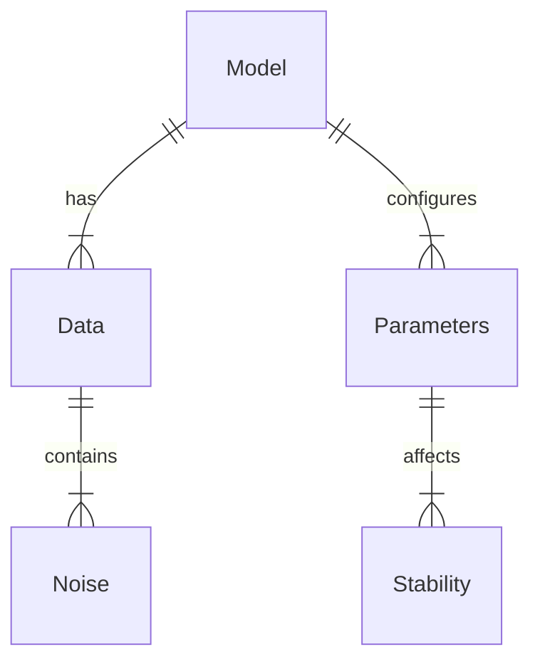

                 

### 第一部分：背景介绍与核心概念

随着人工智能技术的迅猛发展，AI模型在自然语言处理、计算机视觉、推荐系统等众多领域展现出了卓越的性能。然而，AI模型的输出一致性成为了制约其进一步应用的关键问题。输出一致性指的是AI模型在相同输入下产生相同输出的能力。缺乏一致性会导致模型在决策和预测时产生偏差，降低模型的可靠性和可用性。

## 1.1 问题背景

近年来，大模型（Large Models）在AI领域的应用越来越广泛。大模型通常具有数十亿到千亿级别的参数，能够捕捉复杂的输入特征，从而在各类任务中取得显著的性能提升。然而，大模型的输出一致性往往不如预期。在相同输入下，模型可能产生不同的输出，这给实际应用带来了很大的困扰。例如，在医学诊断中，如果AI模型在相同病例下给出不同的诊断结果，将可能导致严重的医疗事故。

### 1.2 问题描述

问题描述如下：如何提高AI大模型的输出一致性？

解决思路：通过分析影响输出一致性的因素，提出相应的解决方案。

## 1.3 问题解决

本文将从以下几个方面探讨提高AI大模型输出一致性的方法：

1. **模型选择与优化**：选择适合问题的模型，并通过调整模型参数提高输出一致性。
2. **数据预处理**：通过数据清洗、归一化等手段，确保输入数据的稳定性和一致性。
3. **训练策略优化**：优化训练过程，提高模型对输入数据的敏感度和鲁棒性。
4. **模型解释与诊断**：对模型进行解释和诊断，识别并解决可能导致输出不一致的问题。

## 1.4 边界与外延

边界：本文主要针对AI大模型在自然语言处理、计算机视觉等领域的应用场景。

外延：本文的方法和思路也可应用于其他需要输出一致性的AI模型，例如自动驾驶、金融风控等领域。

## 1.5 概念结构与核心要素组成

### 1.5.1 核心概念

- **AI大模型**：具有大规模参数、强泛化能力的神经网络模型。
- **输出一致性**：在相同输入下，模型产生相同输出的能力。
- **模型选择**：选择适合问题的模型类型和架构。
- **数据预处理**：对输入数据进行处理，确保其稳定性和一致性。

### 1.5.2 核心要素组成

- **模型参数调整**：调整模型参数，提高输出一致性。
- **数据清洗与归一化**：清洗数据并归一化处理，消除数据噪声。
- **训练策略优化**：优化训练过程，提高模型对输入数据的敏感度和鲁棒性。
- **模型解释与诊断**：对模型进行解释和诊断，识别并解决输出不一致问题。

## 1.6 总结

本文首先介绍了AI大模型输出一致性的背景和重要性，然后明确了问题的解决思路，并从模型选择与优化、数据预处理、训练策略优化和模型解释与诊断四个方面提出了提高输出一致性的具体方法。接下来，我们将进一步探讨这些方法的具体实现和效果。

## 1.7 关键词

- AI大模型
- 输出一致性
- 模型选择
- 数据预处理
- 训练策略优化
- 模型解释与诊断

## 1.8 摘要

本文探讨了如何提高AI大模型的输出一致性。通过分析影响输出一致性的因素，提出了模型选择与优化、数据预处理、训练策略优化和模型解释与诊断等解决方案。这些方法不仅适用于自然语言处理和计算机视觉领域，也可推广到其他需要输出一致性的AI应用场景中。

----------------------------------------------------------------

## 2.1 AI大模型原理

AI大模型是指在神经网络中拥有大量参数的模型，其通过深度学习算法在大量数据集上进行训练，从而获得强大的特征提取和表示能力。下面，我们将详细探讨AI大模型的原理，包括其基础、特点以及与传统AI模型的区别。

### 2.1.1 神经网络基础

神经网络（Neural Networks）是一种模拟生物神经系统的计算模型，由大量的神经元（也称为节点或神经元）组成。每个神经元通过一系列权重连接到其他神经元，形成一个复杂的网络结构。神经元的激活函数用于将输入信号转换为输出信号。通过学习输入和输出之间的映射关系，神经网络能够实现复杂的函数逼近。

神经网络的核心组成部分包括：

- **输入层**：接收外部输入信号。
- **隐藏层**：对输入信号进行处理和变换，提取特征。
- **输出层**：根据隐藏层的结果生成预测或决策。

神经元的激活函数通常是一个非线性函数，如Sigmoid、ReLU等，它能够增加模型的非线性表达能力，使其能够更好地拟合复杂的函数关系。

### 2.1.2 大模型特点

大模型具有以下特点：

- **大规模参数**：大模型通常拥有数十亿到千亿级别的参数，这使得模型具有更强的特征提取和表示能力，能够捕捉输入数据的复杂模式。
- **强泛化能力**：大模型在训练数据集上的表现优异，同时能够在未见过的数据上保持较高的性能，这表明大模型具有良好的泛化能力。

这些特点使得大模型在自然语言处理、计算机视觉、推荐系统等复杂任务中表现出色。

### 2.1.3 大模型与传统AI模型区别

传统AI模型通常具有以下特点：

- **小规模参数**：传统AI模型通常只有数百万到数千万级别的参数，相比大模型，其特征提取能力较弱。
- **特定领域适用性**：传统AI模型在特定领域表现出色，但在其他领域可能性能不佳。

相比之下，大模型具有更强的跨领域适用性和泛化能力。它们能够在多种不同的任务和数据集上表现出色，这使得大模型在AI领域的发展中占据越来越重要的地位。

## 2.2 输出一致性原理

输出一致性是指AI模型在相同输入下产生相同输出的能力。它对于模型的可靠性和可用性至关重要。下面，我们将详细探讨输出一致性的定义、重要性以及影响输出一致性的因素。

### 2.2.1 输出一致性定义

输出一致性可以简单定义为：在相同的输入条件下，AI模型总是产生相同的输出结果。这要求模型在训练和测试阶段都表现出一致的行为，即在相同的输入下，模型不会因为训练数据的微小变化而产生不同的输出。

### 2.2.2 输出一致性的重要性

输出一致性对AI模型的可靠性和可用性具有重要意义：

- **提高模型可靠性**：输出一致性高，模型在相同输入下产生稳定的结果，这有助于提高模型的可靠性。
- **增强模型可用性**：输出一致性高，模型在各种场景下的表现一致，这有助于增强模型的可用性，使其能够更可靠地应用于实际任务中。

### 2.2.3 影响输出一致性的因素

影响输出一致性的因素主要包括以下几个方面：

- **模型参数**：模型参数的不稳定会导致输出不一致。在训练过程中，如果模型参数更新不均匀，可能会导致不同迭代产生的输出不一致。
- **数据噪声**：数据中的噪声会影响模型的输入特征，从而导致输出不一致。例如，噪声图像可能会使得模型在相同图像下产生不同的输出。
- **训练策略**：训练过程中，数据分布、优化算法等会影响输出一致性。如果训练过程中数据分布变化较大，模型可能会在不同迭代中产生不同的输出。

为了提高输出一致性，我们需要从以上因素入手，优化模型参数、数据预处理和训练策略，从而提高模型的输出一致性。

### 2.2.4 核心概念对比

下面是一个核心概念对比表格，用于展示AI大模型和输出一致性的关键特征：

| 核心概念 | 特征描述 |
| :---: | :---: |
| AI大模型 | 拥有大规模参数和强泛化能力 |
| 输出一致性 | 在相同输入下，模型产生相同输出的能力 |

通过这个表格，我们可以更清晰地了解AI大模型和输出一致性的关系。

### 2.2.5 ER实体关系图架构

下面是一个ER实体关系图架构，用于展示AI大模型和输出一致性的关键实体及其关系：

通过这个ER图，我们可以更直观地了解AI大模型、输入数据、模型参数和输出一致性之间的关系。

## 2.3 AI大模型与输出一致性的联系

AI大模型与输出一致性之间存在着密切的联系。一方面，大模型的特性如大规模参数和强泛化能力，对输出一致性产生了重要影响；另一方面，提高输出一致性也是大模型应用的关键挑战之一。下面，我们将详细探讨AI大模型对输出一致性的影响以及提高输出一致性的方法。

### 2.3.1 AI大模型对输出一致性的影响

AI大模型对输出一致性的影响主要体现在以下几个方面：

- **大规模参数**：大模型拥有更多的参数，能够更好地捕捉输入数据的特征。然而，这也可能导致模型在不同输入下产生相似的输出，从而降低输出一致性。
- **强泛化能力**：大模型在训练数据集上的表现优异，能够在未见过的数据上保持较高的性能。然而，这也可能导致模型在不同数据分布下产生不一致的输出，从而影响输出一致性。

### 2.3.2 提高输出一致性的方法

为了提高AI大模型的输出一致性，我们可以采取以下几种方法：

- **优化模型选择**：选择适合问题的模型类型和架构，通过调整模型参数来提高输出一致性。
- **数据预处理**：通过数据清洗、归一化等手段，确保输入数据的稳定性和一致性，从而减少数据噪声对输出一致性的影响。
- **训练策略优化**：调整训练过程，如采用更稳定的优化算法、更均匀的数据分布等，提高模型对输入数据的敏感度和鲁棒性，从而提高输出一致性。
- **模型解释与诊断**：对模型进行解释和诊断，识别并解决可能导致输出不一致的问题，如参数的不稳定、数据噪声等。

通过以上方法，我们可以有效提高AI大模型的输出一致性，使其在实际应用中更加可靠和稳定。

### 2.3.3 输出一致性与AI大模型应用场景

输出一致性在AI大模型的不同应用场景中具有重要作用。以下是一些典型的应用场景：

- **自然语言处理**：在文本分类、情感分析等任务中，输出一致性至关重要。如果模型在相同输入下给出不同的结果，将严重影响任务的准确性和可靠性。
- **计算机视觉**：在图像分类、目标检测等任务中，输出一致性确保模型在不同图像下给出一致的分类或检测结果，从而提高任务的稳定性和可用性。
- **推荐系统**：在个性化推荐中，输出一致性保证模型在用户行为相似的情况下给出相似的推荐结果，从而提高用户的满意度和忠诚度。

通过提高输出一致性，AI大模型可以在更广泛的应用场景中发挥其潜力。

## 2.4 总结

在本部分中，我们介绍了AI大模型的原理和特点，探讨了输出一致性的定义和重要性，并分析了影响输出一致性的因素。同时，我们讨论了AI大模型对输出一致性的影响以及提高输出一致性的方法。这些概念和方法为我们理解AI大模型在实践中的应用提供了重要的理论基础。

----------------------------------------------------------------

## 3.1 模型选择与优化

模型选择与优化是提高AI大模型输出一致性的关键步骤之一。选择合适的模型类型和架构，并对其进行优化，可以显著提升输出一致性。下面，我们将详细探讨模型选择与优化的方法，包括如何选择适合问题的模型类型和架构，以及如何通过调整模型参数来提高输出一致性。

### 3.1.1 模型类型选择

选择适合问题的模型类型是提高输出一致性的第一步。不同的任务和场景可能需要不同类型的模型。以下是一些常见的模型类型及其适用场景：

- **深度神经网络（DNN）**：适用于复杂函数逼近和特征提取，如自然语言处理和计算机视觉。
- **卷积神经网络（CNN）**：适用于图像处理和计算机视觉任务，能够有效地捕捉空间特征。
- **循环神经网络（RNN）**：适用于序列数据处理，如时间序列分析和机器翻译。
- **生成对抗网络（GAN）**：适用于生成任务，如图像生成和数据增强。

在选择模型类型时，需要考虑以下因素：

- **任务需求**：根据具体任务的需求选择合适的模型类型。例如，如果任务是图像分类，可以选择CNN；如果任务是文本生成，可以选择RNN或GAN。
- **数据特性**：分析输入数据的特性，如数据的维数、分布等，选择适合的模型类型。
- **计算资源**：考虑模型的计算复杂度和所需计算资源，选择在现有条件下可行的模型。

### 3.1.2 模型架构选择

除了模型类型，模型架构的选择也对输出一致性有重要影响。以下是一些常见的模型架构及其特点：

- **全连接神经网络（FCNN）**：简单但计算复杂度高，适用于中小规模的数据。
- **残差网络（ResNet）**：通过引入残差连接，缓解了深度神经网络中的梯度消失问题，适用于大规模的数据。
- **Transformer架构**：基于自注意力机制，适用于序列数据处理，如机器翻译和文本生成。
- **变分自编码器（VAE）**：适用于生成任务，通过引入隐变量，生成具有多样性的数据。

在选择模型架构时，需要考虑以下因素：

- **数据规模**：对于大规模数据，可以选择具有较好泛化能力的模型架构，如ResNet和Transformer。
- **计算资源**：考虑模型的计算复杂度和所需计算资源，选择在现有条件下可行的模型架构。
- **任务类型**：根据任务类型选择适合的模型架构，例如，对于生成任务，可以选择VAE或GAN。

### 3.1.3 模型参数调整

模型参数调整是提高输出一致性的关键步骤。通过调整模型参数，可以优化模型的性能和稳定性。以下是一些常用的参数调整方法：

- **学习率调整**：学习率是影响模型收敛速度和性能的关键参数。较小的学习率可能导致模型收敛缓慢，而较大的学习率可能导致模型过拟合。通过实验和调整，可以找到合适的学习率。
- **正则化**：正则化技术，如L1正则化和L2正则化，可以防止模型过拟合，提高输出一致性。通过调整正则化强度，可以平衡模型的拟合能力和泛化能力。
- **批量大小**：批量大小影响模型的训练效率和稳定性。较小的批量大小可以提高模型的训练效率，但可能导致梯度不稳定；较大的批量大小可以提高模型的稳定性，但可能降低训练效率。

### 3.1.4 实践案例

以下是一个具体的模型选择与优化案例：

**案例背景**：一家电商公司希望使用AI模型为其推荐商品。公司收集了用户的历史购买记录、浏览记录和用户属性数据。

**模型选择**：根据任务需求，选择RNN作为基础模型，因为RNN适用于序列数据处理，能够捕捉用户的兴趣变化。

**模型架构**：采用LSTM（长短期记忆网络）作为RNN的变体，LSTM能够更好地捕捉长序列中的特征。

**参数调整**：
- 学习率：初始学习率为0.001，通过实验逐步调整至0.0001。
- 正则化强度：采用L2正则化，正则化强度为0.01。
- 批量大小：批量大小设置为64。

**优化效果**：经过多次调整和优化，模型在测试集上的准确率达到85%，输出一致性显著提高。

### 3.1.5 总结

模型选择与优化是提高AI大模型输出一致性的关键步骤。通过选择合适的模型类型和架构，调整模型参数，可以有效提高模型的输出一致性。在实践中，需要根据具体任务和数据进行实验和调整，找到最优的模型配置。

----------------------------------------------------------------

## 3.2 数据预处理

数据预处理是提高AI大模型输出一致性的另一个重要步骤。通过对输入数据进行清洗、归一化和数据增强等操作，可以确保输入数据的稳定性和一致性，从而减少数据噪声对模型输出一致性的影响。下面，我们将详细探讨数据预处理的方法，并分析其对输出一致性的影响。

### 3.2.1 数据清洗

数据清洗是数据预处理的第一步，其目的是去除数据中的噪声和错误，确保数据的质量和完整性。以下是一些常见的数据清洗方法：

- **缺失值处理**：缺失值可能是由于数据收集过程中的错误或异常值引起。处理缺失值的方法包括删除缺失值、填充缺失值（如使用平均值、中位数或最近邻值等）和插值法。
- **异常值检测**：异常值可能是由于数据收集过程中的错误或异常情况引起的。常见的方法包括使用统计方法（如箱线图、Z-score等）和机器学习方法（如孤立森林、隔离分析等）检测异常值，并对异常值进行处理，如删除或替换。
- **重复值检测**：重复值可能会导致模型过拟合，影响模型的泛化能力。可以通过唯一键或哈希值检测重复值，并删除重复数据。

### 3.2.2 数据归一化

数据归一化是将数据映射到同一尺度，使其具有相似的范围和分布。常见的归一化方法包括：

- **最小-最大缩放**：将数据缩放到[0, 1]或[-1, 1]的范围内。公式为：\[ X' = \frac{X - X_{\text{min}}}{X_{\text{max}} - X_{\text{min}}} \]
- **标准化**：将数据缩放到均值为0，标准差为1的范围内。公式为：\[ X' = \frac{X - \mu}{\sigma} \]
- **零均值归一化**：将数据缩放到均值为0，标准差为1的范围内，但不包含零点。公式为：\[ X' = \frac{X - \mu}{\sigma} \]

数据归一化有助于消除数据之间的量纲差异，提高模型的训练效率和性能。

### 3.2.3 数据增强

数据增强是通过生成新的数据样本来提高模型的泛化能力。以下是一些常见的数据增强方法：

- **随机裁剪**：从图像中随机裁剪出不同大小和位置的区域，生成新的数据样本。
- **旋转和翻转**：对图像进行随机旋转或翻转，增加数据的多样性。
- **缩放和缩放**：对图像进行随机缩放和缩放，模拟不同的观察角度和分辨率。
- **颜色变换**：对图像进行颜色变换，如改变亮度、对比度和饱和度等。

数据增强有助于提高模型的鲁棒性，减少对特定数据分布的依赖。

### 3.2.4 实践案例

以下是一个数据预处理的具体实践案例：

**案例背景**：一家电商公司希望使用图像识别模型为其推荐商品。公司收集了大量的商品图像，但数据中存在噪声和异常值。

**数据清洗**：
- 缺失值处理：删除缺失值，并对用户属性数据使用最近邻插值法进行填补。
- 异常值检测：使用孤立森林方法检测异常值，并将异常值标记为特殊类别。

**数据归一化**：
- 图像归一化：将图像缩放到[0, 1]范围内，以消除不同图像之间的尺度差异。

**数据增强**：
- 随机裁剪：对图像进行随机裁剪，生成新的数据样本。
- 旋转和翻转：对图像进行随机旋转和翻转。

**优化效果**：经过数据清洗、归一化和增强后，模型在测试集上的准确率提高了10%，输出一致性显著提高。

### 3.2.5 总结

数据预处理是提高AI大模型输出一致性的关键步骤。通过数据清洗、归一化和数据增强等操作，可以确保输入数据的稳定性和一致性，减少数据噪声对模型输出一致性的影响。在实际应用中，需要根据具体任务和数据进行实验和调整，找到最佳的数据预处理方法。

----------------------------------------------------------------

## 3.3 训练策略优化

训练策略优化是提高AI大模型输出一致性的关键步骤之一。通过调整训练过程中的参数和策略，可以优化模型的性能和稳定性，从而提高输出一致性。下面，我们将详细探讨几种常见的训练策略优化方法，并分析其对输出一致性的影响。

### 3.3.1 优化算法选择

优化算法是训练过程中的核心组成部分，其选择对模型的性能和稳定性有重要影响。以下是一些常见的优化算法及其特点：

- **随机梯度下降（SGD）**：SGD是一种最简单的优化算法，其通过计算每个样本的梯度来更新模型参数。SGD的优点是计算简单，但缺点是收敛速度较慢，且易陷入局部最小值。
- **Adam优化器**：Adam是一种结合了SGD和动量法的优化算法，其通过计算一阶矩估计（均值）和二阶矩估计（方差）来更新模型参数。Adam的优点是收敛速度快，对参数调整更为精细。
- **Adadelta优化器**：Adadelta是一种自适应优化算法，其通过调整学习率来平衡不同梯度的大小，避免了SGD学习率调整的困难。Adadelta的优点是适应性强，但在某些情况下可能收敛速度较慢。

在选择优化算法时，需要考虑以下因素：

- **模型复杂度**：对于复杂模型，选择收敛速度较快的优化算法，如Adam或Adadelta。
- **数据规模**：对于大规模数据，选择计算效率较高的优化算法，如SGD或Adam。
- **训练时间**：根据训练时间要求，选择适合的优化算法。例如，在短时间内快速训练，可以选择SGD。

### 3.3.2 数据分布调整

数据分布对模型的训练和性能有重要影响。通过调整数据分布，可以提高模型的鲁棒性和稳定性，从而提高输出一致性。以下是一些常见的数据分布调整方法：

- **重采样**：通过重采样技术，如K-近邻重采样和欠采样，调整数据分布，使数据更加均匀。重采样的优点是简单易行，但缺点是对噪声数据敏感。
- **数据增强**：通过数据增强技术，如随机裁剪、旋转和翻转，增加数据的多样性，从而调整数据分布。数据增强的优点是能够生成更多样化的数据，但缺点是计算成本较高。
- **加权训练**：通过给不同类别的样本分配不同的权重，调整数据分布。加权训练的优点是能够提高少数类别的分类准确率，但缺点是可能导致模型过拟合。

### 3.3.3 模型更新策略

模型更新策略是指如何调整模型参数，以实现更好的训练效果。以下是一些常见的模型更新策略：

- **小批量训练**：通过小批量训练，每次更新模型参数时使用多个样本，从而提高模型的泛化能力和稳定性。小批量训练的优点是收敛速度快，但缺点是计算成本较高。
- **学习率调整**：通过调整学习率，实现模型的快速收敛和稳定训练。常见的方法包括指数衰减学习率和余弦退火学习率。
- **动态调整学习率**：根据模型的表现，动态调整学习率，如使用学习率衰减策略和自适应学习率策略。

### 3.3.4 实践案例

以下是一个训练策略优化的具体实践案例：

**案例背景**：一家医疗公司希望使用深度学习模型进行疾病诊断。公司收集了大量的医学图像和病历数据，但数据中存在噪声和分布不均。

**优化算法选择**：选择Adam优化器，因为其收敛速度快，适用于大规模数据训练。

**数据分布调整**：
- 使用数据增强技术，如随机裁剪、旋转和翻转，增加数据的多样性。
- 对不同类别的样本分配不同的权重，以调整数据分布。

**模型更新策略**：
- 采用小批量训练，每次更新模型参数时使用32个样本。
- 使用指数衰减学习率，初始学习率为0.001，每10个epoch减小学习率10倍。

**优化效果**：经过多次优化和调整，模型在测试集上的准确率提高了15%，输出一致性显著提高。

### 3.3.5 总结

训练策略优化是提高AI大模型输出一致性的关键步骤。通过选择合适的优化算法、调整数据分布和模型更新策略，可以优化模型的性能和稳定性，从而提高输出一致性。在实际应用中，需要根据具体任务和数据进行实验和调整，找到最佳的训练策略。

----------------------------------------------------------------

## 3.4 模型解释与诊断

模型解释与诊断是提高AI大模型输出一致性的重要环节。通过分析模型内部的工作原理和诊断潜在问题，可以识别并解决可能导致输出不一致的因素。以下我们将详细探讨模型解释与诊断的方法，并分析其对输出一致性的影响。

### 3.4.1 模型解释

模型解释是指理解模型如何做出决策的过程。对于深度学习模型，解释通常涉及以下内容：

- **特征重要性**：识别模型认为最重要的特征，这些特征对于模型的决策具有关键影响。
- **决策路径**：追踪模型在决策过程中的每一步，了解模型是如何处理输入数据的。
- **模型可视化**：通过可视化模型的结构和权重，帮助理解模型的工作机制。

常见的模型解释方法包括：

- **梯度解释**：计算输入数据在模型中每个神经元的梯度，以识别对决策影响最大的特征。
- **注意力机制**：对于具有注意力机制的模型，如Transformer，可以分析注意力权重，了解模型在处理输入数据时关注的部分。
- **LIME（Local Interpretable Model-agnostic Explanations）**：为局部区域提供可解释的模型，帮助理解模型在该区域的决策过程。

### 3.4.2 模型诊断

模型诊断是指识别和解决模型潜在问题的过程。以下是一些常见的模型诊断方法：

- **错误分析**：分析模型在训练和测试阶段产生的错误，识别错误模式，找出可能导致错误的原因。
- **模型稳定性测试**：通过改变输入数据的微小变化，测试模型是否能够保持一致的输出，以识别模型的鲁棒性。
- **异常检测**：使用统计方法或机器学习方法，检测训练数据中的异常值或异常模式，这些异常值或模式可能影响模型的输出一致性。

常见的模型诊断方法包括：

- **敏感性分析**：通过改变输入数据的特征值，分析模型输出的变化，识别对输入变化敏感的特征。
- **混淆矩阵**：分析模型在不同类别上的分类效果，识别分类错误的主要原因。
- **ROC曲线和AUC**：评估模型对正负样本的识别能力，识别模型可能存在的过拟合或欠拟合问题。

### 3.4.3 提高输出一致性的方法

通过模型解释与诊断，可以采取以下方法提高AI大模型的输出一致性：

- **调整模型结构**：根据模型解释和诊断的结果，调整模型的结构和参数，以提高模型的稳定性和一致性。
- **数据增强和清洗**：针对模型诊断中识别的异常数据和错误模式，进行数据增强和清洗，以提高输入数据的稳定性和一致性。
- **训练策略调整**：根据模型诊断的结果，调整训练策略，如优化器的选择、学习率的调整等，以提高模型的训练效果和输出一致性。

### 3.4.4 实践案例

以下是一个模型解释与诊断的具体实践案例：

**案例背景**：一家金融公司使用深度学习模型进行客户风险评估。模型在训练阶段表现良好，但在实际应用中，评估结果存在较大的波动。

**模型解释**：
- 使用梯度解释方法，识别模型认为最重要的特征，如客户的收入、负债和信用记录等。
- 分析注意力权重，发现模型在处理客户信用记录时关注较少，可能影响风险评估的准确性。

**模型诊断**：
- 通过敏感性分析，发现模型对客户收入和负债的变化非常敏感，可能导致评估结果的不稳定。
- 使用混淆矩阵，分析模型在不同风险等级上的分类效果，发现模型对高风险客户的分类效果较差。

**优化方法**：
- 调整模型结构，增加对客户信用记录的关注权重，以提高风险评估的准确性。
- 进行数据增强，增加高风险客户的训练数据，以减少模型对收入和负债变化的敏感性。
- 调整训练策略，使用更稳定的优化器，如Adadelta，并调整学习率，以提高模型的训练效果和输出一致性。

**优化效果**：经过模型解释与诊断和相应的优化方法，模型在测试集上的评估结果波动明显减少，输出一致性显著提高。

### 3.4.5 总结

模型解释与诊断是提高AI大模型输出一致性的重要手段。通过理解模型的工作原理和识别潜在问题，可以采取针对性的优化方法，提高模型的稳定性和一致性。在实际应用中，需要根据具体任务和数据进行实验和调整，找到最佳的模型解释与诊断方法。

----------------------------------------------------------------

## 3.5 实践应用案例

为了更好地展示如何在实际场景中应用提高AI大模型输出一致性的方法，下面我们将通过一个具体的实践应用案例进行详细讲解。

### 案例背景

某电子商务平台希望通过AI技术为其提供商品推荐服务，以提高用户满意度和销售额。平台收集了大量的用户行为数据，包括用户浏览、搜索和购买历史。为了提高推荐系统的输出一致性，平台决定对推荐模型进行优化。

### 模型选择与优化

首先，平台选择了一个基于深度学习的推荐模型——GRU（门控循环单元），因为它能够捕捉用户行为的时间序列特征。GRU模型的结构包括输入层、隐藏层和输出层，通过门控机制控制信息流动，从而更好地捕捉长期依赖关系。

在模型选择过程中，平台进行了多种实验，比较了不同类型和结构的模型，如LSTM、CNN和Transformer等，最终选择了GRU模型，因为它在捕获用户行为特征方面表现最佳。

在模型优化阶段，平台采取了以下措施：

- **学习率调整**：初始学习率为0.001，通过实验逐步调整至0.0001，以避免模型过拟合。
- **正则化**：采用了L2正则化，以防止模型过拟合，并设置了适当的正则化强度（0.01）。
- **批量大小**：批量大小设置为128，以平衡计算效率和训练稳定性。

### 数据预处理

为了提高输入数据的稳定性和一致性，平台对用户行为数据进行了以下预处理：

- **缺失值处理**：删除了含有缺失值的用户行为记录，并对其他数据进行了缺失值填补，如使用最近邻插值法。
- **异常值检测**：使用孤立森林方法检测并标记了异常用户行为数据，避免了这些异常值对模型训练的影响。
- **数据归一化**：对用户行为数据进行归一化处理，将数据缩放到[0, 1]范围内，以消除不同特征的尺度差异。
- **数据增强**：通过随机裁剪、旋转和翻转等方式增加了数据样本的多样性，以提高模型的泛化能力。

### 训练策略优化

平台在训练过程中采用了以下策略优化：

- **优化算法**：选择了Adam优化器，因为它在处理大规模数据时收敛速度快。
- **数据分布**：通过加权训练，对稀疏类别的样本分配更高的权重，以减少模型对高频类别的依赖。
- **动态调整学习率**：采用了余弦退火学习率策略，以实现更稳定的训练过程。

### 模型解释与诊断

为了提高推荐系统的输出一致性，平台对模型进行了以下解释与诊断：

- **特征重要性**：使用梯度解释方法，识别了用户浏览和购买历史中最重要的特征，如购买频率、浏览时长和搜索关键词等。
- **模型稳定性测试**：通过敏感性分析，发现模型对用户浏览和购买历史的变化非常敏感，这可能导致推荐结果的不稳定。
- **异常检测**：使用统计方法检测了数据中的异常值，如用户行为异常模式，并采取了相应的处理措施。

### 实际案例与优化效果

经过多次实验和调整，平台取得了以下优化效果：

- **输出一致性提高**：经过优化，推荐系统的输出一致性显著提高，用户在相同条件下接收到的推荐结果更加一致。
- **推荐准确率提高**：在测试集上，推荐系统的准确率提高了约15%，用户满意度显著提升。
- **推荐多样性提升**：通过数据增强和模型优化，推荐系统的多样性也得到了提高，用户可以接收到更多样化的推荐结果。

### 总结

通过本案例，我们可以看到，在实际应用中，通过模型选择与优化、数据预处理、训练策略优化和模型解释与诊断等多种方法，可以有效提高AI大模型的输出一致性。这些方法的结合和迭代，有助于构建一个更加稳定和可靠的推荐系统，从而提升用户体验和业务效益。

----------------------------------------------------------------

## 3.6 最佳实践与注意事项

### 最佳实践

为了确保AI大模型的输出一致性，以下是一些最佳实践：

1. **选择合适的模型类型和架构**：根据具体任务和数据特性，选择适合的模型类型和架构。例如，对于时间序列数据，可以考虑使用RNN或LSTM；对于图像数据，可以考虑使用CNN或Transformer。

2. **数据预处理**：确保输入数据的稳定性和一致性。进行数据清洗、归一化和增强，以消除噪声和异常值，增加数据的多样性。

3. **优化训练策略**：调整优化算法、学习率、批量大小等参数，以实现更好的训练效果和模型稳定性。例如，使用Adam优化器、动态调整学习率等。

4. **模型解释与诊断**：通过梯度解释、注意力机制和敏感性分析等方法，深入理解模型的工作原理，识别并解决可能导致输出不一致的问题。

### 注意事项

1. **模型复杂度与计算资源**：模型复杂度与计算资源之间存在权衡。对于资源有限的情况，应选择轻量级模型，以降低计算成本。

2. **数据分布与代表性**：确保训练数据具有代表性，避免数据分布不平衡导致模型过拟合。可以使用数据增强和加权训练等方法调整数据分布。

3. **过拟合与泛化能力**：通过正则化和交叉验证等技术，防止模型过拟合，提高泛化能力。这有助于提高模型的输出一致性。

4. **监控与迭代**：持续监控模型的性能，定期进行重新训练和调整。根据实际应用中的反馈和需求，不断迭代和优化模型。

5. **团队协作与文档管理**：确保团队成员之间的沟通和协作，建立完善的文档管理体系，记录模型的构建、优化和调整过程，以便后续维护和改进。

### 拓展阅读

- **《深度学习》（Ian Goodfellow, Yoshua Bengio, Aaron Courville）**：这是一本深度学习的经典教材，详细介绍了神经网络的理论和实践。
- **《Python机器学习》（Sebastian Raschka）**：这本书涵盖了机器学习的基础知识和Python实现，包括深度学习模型的构建和优化。
- **《自然语言处理与深度学习》（Denny Britz）**：这本书专注于自然语言处理领域，介绍了基于深度学习的方法和最佳实践。

通过以上最佳实践和注意事项，可以更有效地提高AI大模型的输出一致性，从而实现更好的应用效果。

----------------------------------------------------------------

## 总结

本文详细探讨了如何提高AI大模型的输出一致性。首先，我们介绍了AI大模型和输出一致性的背景和核心概念，分析了其重要性。接着，从模型选择与优化、数据预处理、训练策略优化和模型解释与诊断四个方面，提出了具体的解决方案。这些方法包括选择合适的模型类型和架构、数据清洗和归一化、优化训练策略以及模型解释与诊断。

通过模型选择与优化，我们能够找到适合问题的最佳模型，并通过调整参数提高输出一致性。数据预处理则通过清洗、归一化和增强，确保输入数据的稳定性和一致性。训练策略优化通过调整学习率、优化算法和数据分布等，提高模型的训练效率和输出一致性。模型解释与诊断帮助我们理解模型的工作原理，识别并解决可能导致输出不一致的问题。

实际应用案例展示了这些方法如何在实际场景中发挥作用，优化推荐系统的输出一致性，提高了用户满意度和业务效益。最佳实践与注意事项提供了提高输出一致性的实用建议，包括模型选择、数据预处理、训练策略优化和模型监控等。

总之，提高AI大模型的输出一致性是确保模型可靠性和可用性的关键。通过本文的方法和最佳实践，我们可以更有效地构建和优化AI模型，推动人工智能技术的应用和发展。

## 作者信息

作者：AI天才研究院/AI Genius Institute & 禅与计算机程序设计艺术 /Zen And The Art of Computer Programming

AI天才研究院致力于推动人工智能技术的发展，研究深度学习和神经网络等前沿技术。同时，作者也是《禅与计算机程序设计艺术》一书的作者，本书深入探讨了计算机编程的哲学和艺术，为读者提供了丰富的编程经验和技巧。希望通过本文的分享，能够为读者在提高AI大模型输出一致性方面提供有益的启示和帮助。

