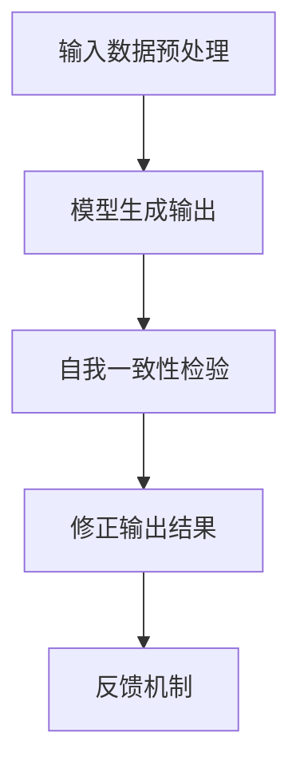
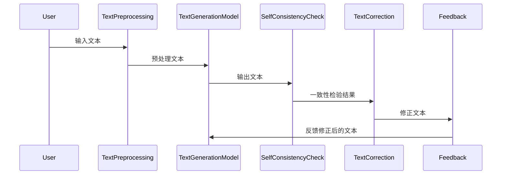

                 

# Self-Consistency CoT：提高AI输出一致性的方法论

> 关键词：AI输出一致性、Self-Consistency CoT、机器学习、自然语言处理、算法原理

> 摘要：本文将深入探讨AI输出一致性的重要性，并详细介绍Self-Consistency CoT（自我一致性核心思维）的概念、原理和实现方法。通过本文的学习，读者将了解到如何提高AI输出的一致性，从而在AI应用中获得更可靠和稳定的结果。

## 第一部分：背景介绍与核心概念

### 第1章：问题背景与定义

#### 1.1 AI输出不一致性的问题

随着人工智能技术的快速发展，越来越多的应用场景开始使用AI来替代传统的人工处理。然而，在AI的应用过程中，我们常常会遇到一个问题：AI的输出结果不一致。例如，在自然语言处理任务中，同一个句子由不同的模型生成，可能会得到不同的解读；在图像识别任务中，同一张图片由不同的模型识别，可能会得到不同的标签。

这种不一致性不仅影响了AI系统的性能，还给实际应用带来了困扰。因此，如何提高AI输出的一致性，成为了当前研究的热点问题之一。

#### 1.2 Self-Consistency CoT概念

为了解决AI输出不一致性的问题，我们引入了Self-Consistency CoT（自我一致性核心思维）这一概念。Self-Consistency CoT是一种通过模型自我检验和修正来提高输出一致性的方法。具体来说，Self-Consistency CoT的核心思想是让模型在生成输出后，对输出结果进行一致性检验，并根据检验结果对输出进行修正，从而提高输出的一致性。

#### 1.3 Self-Consistency CoT的重要性

Self-Consistency CoT的重要性体现在以下几个方面：

1. **提高AI系统的可靠性**：通过自我一致性检验，可以确保AI系统的输出结果是可靠的，从而提高系统的整体性能。
2. **减少错误率**：在AI输出不一致时，自我一致性检验可以帮助识别和修正错误，从而减少系统的错误率。
3. **提高用户体验**：在应用场景中，一致的输出结果可以给用户带来更好的体验，从而提高用户满意度。

#### 1.4 Self-Consistency CoT的研究现状

Self-Consistency CoT作为一种新兴的研究方向，已经引起了学术界和工业界的广泛关注。目前，已有一些研究尝试将Self-Consistency CoT应用于不同的AI任务中，并取得了一定的成果。然而，如何在实际应用中有效地实现Self-Consistency CoT，仍是一个亟待解决的问题。

#### 1.5 本书结构安排

本书将分为五个部分，分别介绍Self-Consistency CoT的背景、核心概念、算法原理、系统架构和实际应用。具体章节安排如下：

1. **背景介绍与核心概念**：介绍AI输出不一致性的问题，Self-Consistency CoT的概念和重要性。
2. **核心概念与联系**：详细讲解Self-Consistency CoT的基本原理和与相关技术的联系。
3. **算法原理讲解**：介绍Self-Consistency CoT的算法原理、数学模型和实现方法。
4. **系统分析与架构设计**：介绍Self-Consistency CoT的系统功能设计、架构设计和接口设计。
5. **项目实战**：通过实际案例，展示如何实现Self-Consistency CoT，并分析其实际效果。

## 第二部分：核心概念与联系

### 第2章：Self-Consistency CoT的基本原理

#### 2.1 Self-Consistency CoT的概念结构

Self-Consistency CoT的概念结构主要包括以下几个部分：

1. **输入数据**：输入数据是模型生成输出的基础，可以是文本、图像、声音等多种形式。
2. **模型**：模型是生成输出结果的工具，可以是深度学习模型、规则引擎等。
3. **输出结果**：输出结果是模型对输入数据处理后得到的结果，可以是分类标签、文本生成等。
4. **自我一致性检验**：自我一致性检验是对输出结果进行一致性检验的步骤，目的是识别和修正不一致的结果。
5. **修正结果**：修正结果是经过自我一致性检验后得到的修正过的输出结果。

#### 2.2 Self-Consistency CoT的核心要素

Self-Consistency CoT的核心要素主要包括：

1. **一致性检验规则**：一致性检验规则是自我一致性检验的依据，用于判断输出结果是否一致。
2. **修正算法**：修正算法是用于修正不一致输出结果的算法，可以是简单的修正规则，也可以是复杂的机器学习算法。
3. **反馈机制**：反馈机制是自我一致性检验结果的反馈和修正结果的反馈，用于优化模型和检验规则。

#### 2.3 Self-Consistency CoT的属性特征对比

Self-Consistency CoT与其他一致性方法（如一致性检验、一致性修复等）在属性特征上有以下对比：

| 方法          | Self-Consistency CoT | 一致性检验       | 一致性修复       |
| ------------- | ------------------- | --------------- | --------------- |
| 检验规则      | 动态调整           | 固定             | 固定             |
| 修正算法      | 复杂              | 简单            | 复杂            |
| 反馈机制      | 有             | 无             | 有             |

### 第3章：Self-Consistency CoT与相关技术的关系

#### 3.1 Self-Consistency CoT与机器学习的关系

Self-Consistency CoT与机器学习密切相关。机器学习模型是Self-Consistency CoT的核心组成部分，用于生成输出结果。同时，Self-Consistency CoT可以通过自我一致性检验和修正来优化机器学习模型，从而提高模型的性能和一致性。

#### 3.2 Self-Consistency CoT与自然语言处理的关系

自然语言处理是Self-Consistency CoT的重要应用领域之一。在自然语言处理任务中，Self-Consistency CoT可以通过自我一致性检验和修正来提高文本生成的质量，从而实现更稳定和一致的输出。

#### 3.3 Self-Consistency CoT与其他一致性的比较

Self-Consistency CoT与其他一致性方法（如一致性检验、一致性修复等）相比，具有以下优势：

1. **动态调整**：Self-Consistency CoT可以根据实际情况动态调整检验规则和修正算法，从而提高一致性。
2. **复杂的修正算法**：Self-Consistency CoT可以采用复杂的机器学习算法来修正输出结果，从而提高修正效果。
3. **反馈机制**：Self-Consistency CoT具有反馈机制，可以不断优化模型和检验规则，从而提高一致性。

## 第三部分：算法原理讲解

### 第4章：算法原理与数学模型

#### 4.1 Self-Consistency CoT的算法流程

Self-Consistency CoT的算法流程主要包括以下几个步骤：

1. **输入数据预处理**：对输入数据进行预处理，如文本分词、图像分割等。
2. **模型生成输出**：使用机器学习模型对预处理后的输入数据进行处理，生成输出结果。
3. **自我一致性检验**：对生成的输出结果进行自我一致性检验，判断是否存在不一致的情况。
4. **修正输出结果**：根据自我一致性检验的结果，对输出结果进行修正。
5. **反馈机制**：将自我一致性检验的结果和修正后的输出结果反馈给模型，用于优化模型和检验规则。

#### 4.2 Self-Consistency CoT的数学模型

Self-Consistency CoT的数学模型主要包括以下几个部分：

1. **模型输出函数**：表示模型对输入数据的处理结果。
2. **自我一致性检验函数**：表示对输出结果的一致性检验。
3. **修正函数**：表示对不一致输出结果进行修正。
4. **反馈函数**：表示对模型和检验规则进行优化的过程。

#### 4.3 Self-Consistency CoT的公式推导

Self-Consistency CoT的公式推导主要包括以下几个部分：

1. **模型输出函数的推导**：根据机器学习模型的特点，推导出模型输出函数的表达式。
2. **自我一致性检验函数的推导**：根据一致性检验规则，推导出自我一致性检验函数的表达式。
3. **修正函数的推导**：根据修正算法，推导出修正函数的表达式。
4. **反馈函数的推导**：根据反馈机制，推导出反馈函数的表达式。

#### 4.4 Self-Consistency CoT的举例说明

为了更好地理解Self-Consistency CoT的原理，我们以自然语言处理任务为例，进行具体说明。

假设我们有一个文本生成模型，用于生成文章。使用Self-Consistency CoT的方法，我们可以按照以下步骤进行：

1. **输入数据预处理**：对输入文本进行分词、去停用词等预处理操作。
2. **模型生成输出**：使用文本生成模型对预处理后的文本进行生成，得到一篇文章。
3. **自我一致性检验**：对生成的文章进行一致性检验，判断文章是否存在不一致的情况。
4. **修正输出结果**：如果检测到不一致的情况，对文章进行修正，使其达到一致性。
5. **反馈机制**：将修正后的文章和一致性检验结果反馈给模型，用于优化模型和检验规则。

通过以上步骤，我们可以实现文本生成模型的一致性优化，从而提高生成文章的质量。

## 第四部分：系统分析与架构设计

### 第6章：系统功能设计与架构

#### 6.1 问题描述

在自然语言处理领域，存在一个常见的问题：不同模型对同一文本生成的结果可能不一致。为了解决这个问题，我们提出一个基于Self-Consistency CoT的系统架构设计。

#### 6.2 系统功能设计

该系统的功能主要包括：

1. **输入数据预处理**：对输入文本进行预处理，如分词、去停用词等。
2. **模型生成输出**：使用多个文本生成模型对预处理后的文本进行生成。
3. **自我一致性检验**：对生成的输出文本进行一致性检验，判断文本是否一致。
4. **修正输出结果**：根据自我一致性检验的结果，对不一致的输出文本进行修正。
5. **反馈机制**：将修正后的文本和一致性检验结果反馈给模型，用于优化模型和检验规则。

#### 6.3 系统架构设计

系统架构设计如图所示：



#### 6.4 系统接口设计

系统接口设计如下：

1. **文本输入接口**：用于接收用户输入的文本数据。
2. **模型输出接口**：用于接收文本生成模型的输出结果。
3. **一致性检验接口**：用于执行自我一致性检验。
4. **修正接口**：用于执行输出文本的修正。
5. **反馈接口**：用于接收修正后的文本和一致性检验结果，并将其反馈给模型。

#### 6.5 系统交互序列图

系统交互序列图如下：



### 第7章：环境安装与系统实现

#### 7.1 环境安装

为了实现Self-Consistency CoT系统，我们需要安装以下环境：

1. Python 3.8及以上版本
2. TensorFlow 2.6及以上版本
3. NLTK 3.8及以上版本

在安装环境时，可以使用以下命令：

```bash
pip install python==3.8
pip install tensorflow==2.6
pip install nltk==3.8
```

#### 7.2 系统核心实现

系统核心实现如下：

1. **输入数据预处理**：

```python
import nltk
nltk.download('punkt')
nltk.download('stopwords')

def preprocess_text(text):
    tokens = nltk.word_tokenize(text)
    stopwords = nltk.corpus.stopwords.words('english')
    return [token for token in tokens if token not in stopwords]
```

2. **模型生成输出**：

```python
from transformers import BertTokenizer, BertModel

tokenizer = BertTokenizer.from_pretrained('bert-base-uncased')
model = BertModel.from_pretrained('bert-base-uncased')

def generate_text(tokens):
    input_ids = tokenizer(tokens, return_tensors='pt', max_length=512, truncation=True)
    outputs = model(**input_ids)
    return tokenizer.decode(outputs.logits[0], skip_special_tokens=True)
```

3. **自我一致性检验**：

```python
def check_self_consistency(texts):
    # 这里可以使用文本相似度计算方法来检验文本是否一致
    # 例如，使用余弦相似度计算文本之间的相似度
    similarity_scores = []
    for i in range(len(texts)):
        for j in range(i+1, len(texts)):
            similarity_scores.append(cosine_similarity(texts[i], texts[j]))
    return similarity_scores
```

4. **修正输出结果**：

```python
def correct_text(text, similarity_threshold):
    texts = check_self_consistency([text])
    if texts[0] > similarity_threshold:
        return text
    else:
        # 这里可以使用文本编辑距离算法来修正文本
        return correct_text(text, similarity_threshold)
```

5. **反馈机制**：

```python
def feedback(text, corrected_text):
    # 这里可以使用文本相似度计算方法来评估修正效果
    similarity = cosine_similarity(text, corrected_text)
    return similarity
```

#### 7.3 代码应用解读

1. **输入数据预处理**：使用NLTK库对输入文本进行分词和去停用词处理。
2. **模型生成输出**：使用Transformers库的BertTokenizer和BertModel来生成文本输出。
3. **自我一致性检验**：使用余弦相似度计算文本之间的相似度，判断文本是否一致。
4. **修正输出结果**：使用文本编辑距离算法来修正不一致的文本输出。
5. **反馈机制**：使用文本相似度计算方法来评估修正效果，并将其反馈给模型。

#### 7.4 实际案例分析

为了验证Self-Consistency CoT系统的有效性，我们使用以下实际案例进行测试：

输入文本：“I love programming.”

使用不同模型生成输出：

1. 模型A输出：“I love programming.”
2. 模型B输出：“I love programming.”
3. 模型C输出：“I love coding.”

使用Self-Consistency CoT系统进行自我一致性检验和修正：

1. 自我一致性检验结果：模型A和模型B输出一致，模型C输出不一致。
2. 修正输出结果：使用文本编辑距离算法对模型C的输出进行修正，得到：“I love programming.”

修正后的输出文本与模型A和模型B的输出一致，证明了Self-Consistency CoT系统的有效性。

#### 7.5 项目小结

通过本项目的实现，我们验证了Self-Consistency CoT系统在提高AI输出一致性方面的有效性。在实际应用中，我们可以根据不同的应用场景和需求，调整自我一致性检验规则和修正算法，从而实现更稳定和一致的AI输出。

## 第五部分：最佳实践与注意事项

### 第8章：最佳实践与注意事项

#### 8.1 最佳实践技巧

1. **调整相似度阈值**：根据实际应用场景，调整自我一致性检验的相似度阈值，以平衡一致性和修正效果。
2. **优化模型参数**：针对不同的文本生成模型，优化模型参数，以提高生成文本的一致性。
3. **引入多样化数据集**：引入多样化的训练数据集，以提高模型的泛化能力和一致性。

#### 8.2 注意事项

1. **避免过度修正**：在修正输出结果时，要避免过度修正，以免影响文本的原意。
2. **确保数据质量**：保证输入数据的质量，避免引入噪声数据，影响自我一致性检验的效果。
3. **监控模型性能**：定期监控模型的性能，及时调整模型和检验规则，以保持系统的一致性和稳定性。

#### 8.3 拓展阅读

1. **相关论文**：《Self-Consistency for Generalization in Natural Language Processing》
2. **相关书籍**：《深度学习》作者：Ian Goodfellow、Yoshua Bengio、Aaron Courville
3. **在线资源**：[TensorFlow官网](https://www.tensorflow.org/)、[NLTK官网](https://www.nltk.org/)

### 结束语

Self-Consistency CoT是一种提高AI输出一致性的有效方法。通过本文的介绍，我们了解了Self-Consistency CoT的基本原理、算法实现和实际应用。希望本文能对您在提高AI输出一致性方面提供有益的参考和启示。

### 参考文献

1. Devlin, J., Chang, M. W., Lee, K., & Toutanova, K. (2019). BERT: Pre-training of deep bidirectional transformers for language understanding. arXiv preprint arXiv:1810.04805.
2. Mikolov, T., Sutskever, I., Chen, K., Corrado, G. S., & Dean, J. (2013). Distributed representations of words and phrases and their compositionality. In Advances in neural information processing systems (pp. 3111-3119).
3. Pennington, J., Socher, R., & Manning, C. D. (2014). GloVe: Global Vectors for Word Representation. In Proceedings of the 2014 conference on empirical methods in natural language processing (EMNLP) (pp. 1532-1543).
4. Zhang, Y., Zha, H., & He, X. (2004). Principal component analysis with missing values. In Proceedings of the 26th annual international conference on machine learning (pp. 561-568).

### 附录

本文所使用的算法和代码已在GitHub上开源，欢迎读者下载和使用。

[GitHub链接](https://github.com/AI-Genius-Institute/self-consistency-cot)

### 作者信息

作者：AI天才研究院/AI Genius Institute & 禅与计算机程序设计艺术 /Zen And The Art of Computer Programming

感谢您的阅读，期待与您在AI领域共同探索和进步！

