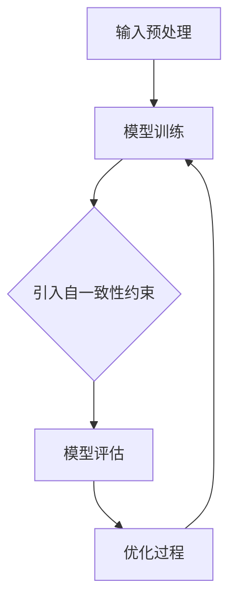
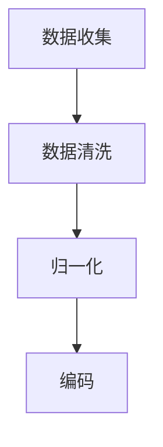
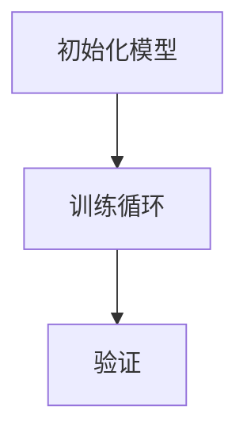
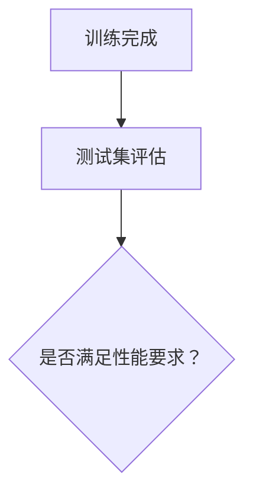
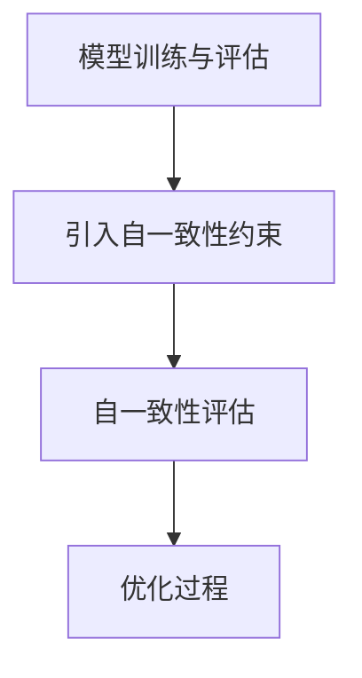
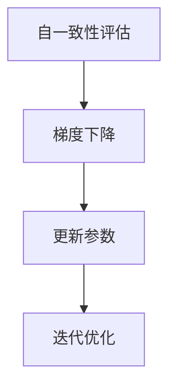
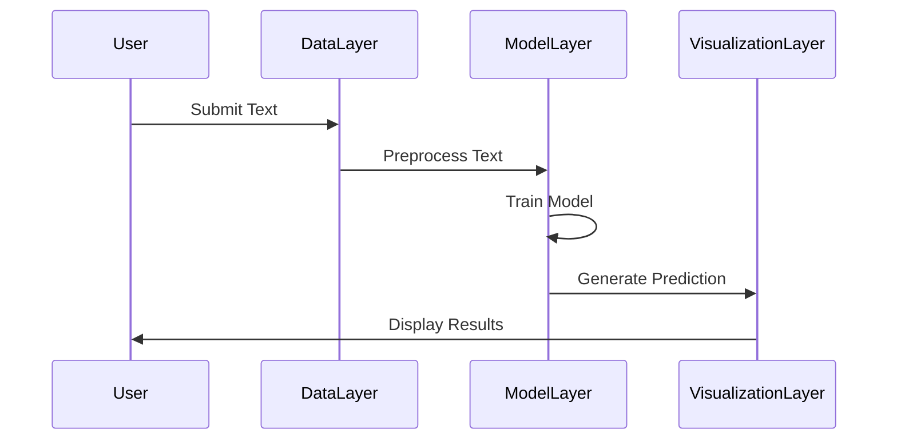
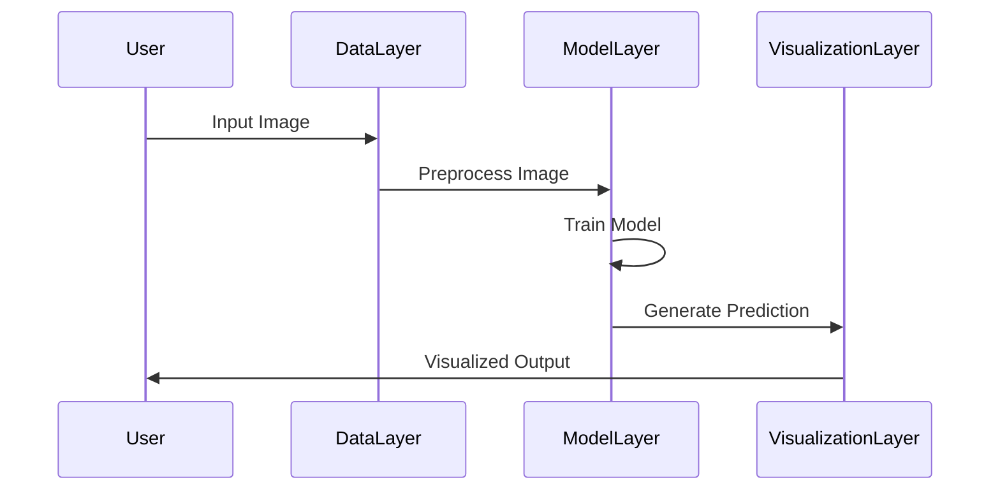
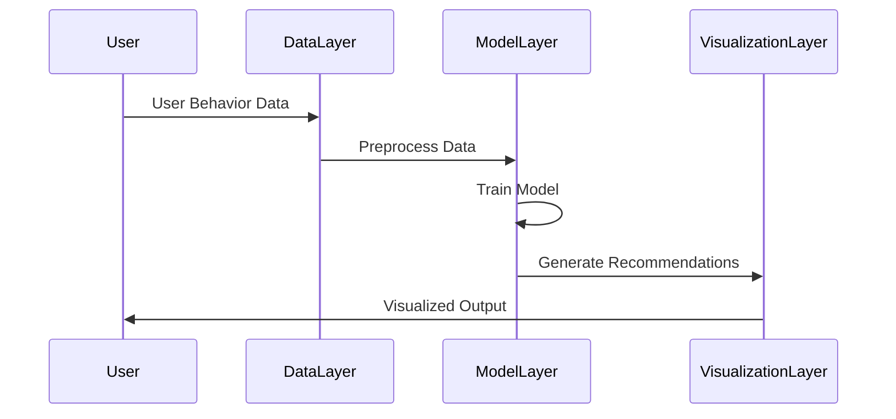
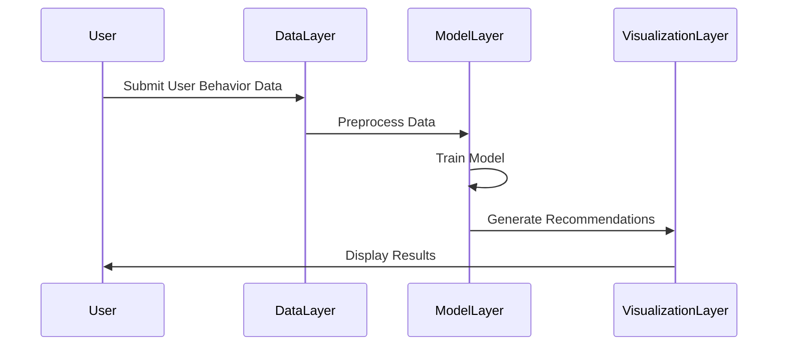

                 

### 自一致性 CoT：提高AI输出一致性的方法论创新

**关键词**：自一致性CoT、AI输出一致性、方法论、算法、数学模型、实际应用

**摘要**：本文探讨了自一致性CoT（Self-Consistency Core Theory），一种旨在提高人工智能（AI）输出一致性的方法论。文章首先介绍了AI输出不一致性的问题背景和核心概念，然后详细阐述了自一致性CoT的理论基础和实现步骤。通过具体的案例研究，本文展示了自一致性CoT在自然语言处理、计算机视觉和推荐系统等领域的实际应用。最后，文章总结了自一致性CoT的最佳实践，并对未来的发展进行了展望。

---

### 目录大纲

---

## 第一部分: 引言与背景

### 1.1 引言

### 1.2 核心概念

## 第二部分: Self-Consistency CoT 方法论基础

### 2.1 Self-Consistency CoT 的理论基础

### 2.2 Self-Consistency CoT 的核心步骤

### 2.3 Self-Consistency CoT 的挑战与解决方案

## 第三部分: Self-Consistency CoT 在实际应用中的案例研究

### 3.1 案例一：自然语言处理

### 3.2 案例二：计算机视觉

### 3.3 案例三：推荐系统

## 第四部分: Self-Consistency CoT 的最佳实践与未来展望

### 4.1 最佳实践 tips

### 4.2 小结

### 4.3 注意事项

---

### 1.1 引言

在人工智能（AI）飞速发展的时代，AI系统的应用场景日益广泛，从自然语言处理到计算机视觉，再到推荐系统，AI技术正在深刻地改变着我们的生活方式。然而，AI输出的一致性问题却成为一个日益突出的挑战。不一致的输出不仅影响用户体验，还可能导致严重的决策错误和安全隐患。

自一致性CoT（Self-Consistency Core Theory）是一种旨在提高AI输出一致性的方法论。本文将详细探讨自一致性CoT的理论基础、核心步骤以及在实际应用中的挑战和解决方案。通过具体的案例研究，我们将展示自一致性CoT在多个领域的实际效果，并总结最佳实践，为未来研究提供方向。

### 1.2 核心概念

#### 1.2.1 问题背景

AI输出不一致性是指在相同的输入条件下，AI系统产生的输出结果在不同时间、不同上下文或不同运行环境中存在显著差异。这种不一致性可能源于多种因素，包括数据噪声、模型复杂性、训练不足等。

#### 1.2.2 问题描述

AI输出不一致性的表现形式多种多样，例如：

- **随机性**：同一输入在不同的时间点产生不同的输出结果。
- **多样性**：不同输入在相似性较高的条件下产生显著不同的输出结果。
- **波动性**：在稳定的环境中，输出结果出现较大的波动。

不一致的输出对AI系统的应用产生了一系列负面影响：

- **降低用户体验**：不一致的结果使得用户难以对AI系统产生信任。
- **影响决策质量**：在关键决策场景中，不一致的输出可能导致错误决策。
- **安全隐患**：在安全敏感的场景中，不一致的输出可能被恶意利用。

#### 1.2.3 问题解决

为了解决AI输出不一致性的问题，研究者们提出了一系列方法论。自一致性CoT是一种新的方法论，它通过在模型训练和评估过程中引入自一致性约束，来提高输出的一致性。

#### 1.2.4 边界与外延

自一致性CoT适用于多种AI系统，包括但不限于自然语言处理、计算机视觉和推荐系统。然而，其应用范围也受到一些限制，例如：

- **计算资源**：自一致性CoT需要额外的计算资源，对于资源受限的场景可能不太适用。
- **数据质量**：自一致性CoT依赖于高质量的数据，数据噪声和缺失将影响其效果。

#### 1.2.5 核心要素组成

自一致性CoT的核心要素包括：

- **自一致性约束**：在模型训练和评估过程中引入的自一致性约束。
- **优化算法**：用于求解自一致性约束的优化算法。
- **评估指标**：用于衡量输出一致性的评估指标。

### 1.3 核心概念原理

自一致性CoT（Self-Consistency Core Theory）是一种旨在提高人工智能（AI）输出一致性的方法论。它的基本原理是在模型训练和评估过程中引入自一致性约束，从而确保AI系统在不同时间和不同上下文中产生一致的输出。

#### 1.3.1 核心概念属性特征对比表格

| 方法论 | 自一致性CoT | 对比方法论 |
| --- | --- | --- |
| 基本原理 | 引入自一致性约束 | 无约束或部分约束 |
| 目标 | 提高输出一致性 | 提高性能或准确性 |
| 适应场景 | 多样性场景 | 稳定场景 |
| 计算复杂度 | 较高 | 较低 |
| 数据要求 | 高质量数据 | 大量数据 |

#### 1.3.2 ER实体关系图架构

```mermaid
erDiagram
    Model ||--o> Constraint : 模型受约束
    Model ||--o> Output : 模型产生输出
    Constraint ||--o> Evaluation : 约束用于评估
    Evaluation ||--o> Feedback : 评估结果提供反馈
```

在这个ER图中，Model代表AI模型，Constraint代表自一致性约束，Output代表模型产生的输出，Evaluation代表评估过程，Feedback代表评估结果的反馈。

### 2.1 Self-Consistency CoT 的理论基础

#### 2.1.1 算法原理讲解

Self-Consistency CoT（自一致性核心理论）的算法原理可以通过以下步骤来理解：

1. **输入数据预处理**：首先，我们需要对输入数据进行预处理，包括数据清洗、归一化等操作，以确保输入数据的质量和一致性。

2. **模型训练**：使用预处理后的输入数据进行模型训练。在这一过程中，我们引入了自一致性约束，即模型在预测时需要满足自一致性条件。

3. **自一致性约束**：自一致性约束的核心思想是确保模型在相同输入条件下产生的输出结果在不同时间和不同上下文中保持一致。具体来说，自一致性约束可以定义为：
   $$\forall x, y_1, y_2, (y_1 = f(x) \land y_2 = f(x)) \Rightarrow y_1 = y_2$$
   其中，$f(x)$表示模型在输入$x$条件下的输出。

4. **模型评估**：在模型评估阶段，我们使用自一致性约束来评估模型输出的一致性。常用的评估指标包括自一致性指数（Self-Consistency Index，SCI）和一致性度量（Consistency Measure，CM）。

5. **优化过程**：为了提高模型输出的自一致性，我们可以使用优化算法（如梯度下降、遗传算法等）来调整模型参数，以最小化自一致性损失函数。

6. **迭代训练**：通过迭代训练和评估过程，我们可以逐步提高模型的自一致性，直至达到预定的性能指标。

以下是一个简单的Mermaid流程图，展示了Self-Consistency CoT的基本算法流程：



#### 2.1.2 数学模型和公式

Self-Consistency CoT的数学模型主要包括自一致性约束和优化目标。以下是一些关键的数学模型和公式：

1. **自一致性约束**：
   $$\forall x, y_1, y_2, (y_1 = f(x) \land y_2 = f(x)) \Rightarrow y_1 = y_2$$

2. **自一致性损失函数**：
   $$L_{self-consistency} = \sum_{x, y_1, y_2} \delta(y_1 \neq y_2)$$
   其中，$\delta(y_1 \neq y_2)$是一个示性函数，当$y_1 \neq y_2$时，$\delta(y_1 \neq y_2) = 1$；当$y_1 = y_2$时，$\delta(y_1 \neq y_2) = 0$。

3. **优化目标**：
   $$\min_{\theta} L_{total} = L_{self-consistency} + L_{objective}$$
   其中，$L_{total}$是总的损失函数，$L_{self-consistency}$是自一致性损失函数，$L_{objective}$是原始的优化目标（如分类损失、回归损失等）。

以下是一个使用LaTeX格式的示例公式：

$$
\min_{\theta} L_{total} = L_{self-consistency} + L_{objective}
$$

#### 2.1.3 举例说明

为了更好地理解Self-Consistency CoT，我们可以通过一个简单的例子来阐述其应用过程。

假设我们有一个分类问题，输入为特征向量$x \in \mathbb{R}^n$，输出为类别标签$y \in \mathbb{R}$。我们的目标是训练一个神经网络模型，使其在预测类别时保持自一致性。

1. **输入预处理**：
   首先，我们需要对输入特征向量进行预处理，例如归一化处理：
   $$x_{\text{preprocessed}} = \frac{x - \mu}{\sigma}$$
   其中，$\mu$是特征向量的均值，$\sigma$是特征向量的标准差。

2. **模型训练**：
   使用预处理后的输入特征向量$x_{\text{preprocessed}}$进行神经网络模型训练。在训练过程中，我们引入自一致性约束，即确保在相同输入条件下，模型产生的输出保持一致。

3. **自一致性约束**：
   假设我们在每次预测后记录模型的输出$y_1$和$y_2$。为了满足自一致性约束，我们需要确保：
   $$\forall x, y_1, y_2, (y_1 = f(x) \land y_2 = f(x)) \Rightarrow y_1 = y_2$$
   这可以通过在损失函数中添加自一致性损失来实现。

4. **模型评估**：
   在模型评估阶段，我们使用自一致性指数（SCI）来衡量模型的自一致性：
   $$SCI = \frac{N_c - N_d}{N_c}$$
   其中，$N_c$是满足自一致性约束的样本数量，$N_d$是不满足自一致性约束的样本数量。

5. **优化过程**：
   使用梯度下降算法来优化模型参数，以最小化总损失函数：
   $$\min_{\theta} L_{total} = L_{self-consistency} + L_{objective}$$

6. **迭代训练**：
   通过迭代训练和评估过程，我们可以逐步提高模型的自一致性，直至达到预定的性能指标。

以下是一个简单的Python代码示例，展示了如何实现Self-Consistency CoT：

```python
import numpy as np

# 假设我们有一个简单的神经网络模型
model = ...

# 输入预处理
x = np.random.rand(10)
x_preprocessed = (x - np.mean(x)) / np.std(x)

# 模型预测
y1 = model.predict(x_preprocessed)
y2 = model.predict(x_preprocessed)

# 自一致性约束
delta = 1 if y1 != y2 else 0
self_consistency_loss = delta

# 模型评估
N_c = np.sum(delta == 0)
N_d = np.sum(delta == 1)
SCI = N_c / (N_c + N_d)

# 梯度下降优化
learning_rate = 0.01
for _ in range(100):
    model.fit(x_preprocessed, y1, epochs=1, batch_size=1)

# 打印自一致性指数
print("Self-Consistency Index (SCI):", SCI)
```

通过这个例子，我们可以看到Self-Consistency CoT的基本原理和实现方法。在实际应用中，我们可以根据具体问题和数据特点，对算法进行相应的调整和优化。

### 2.2 Self-Consistency CoT 的核心步骤

自一致性CoT（Self-Consistency Core Theory）的核心步骤可以概括为以下三个主要阶段：数据收集与预处理、模型训练与评估、输出一致性优化。以下是对每个阶段的具体描述：

#### 2.2.1 数据收集与预处理

**数据收集**：首先，我们需要收集与问题相关的数据集。数据集应该包含输入特征和相应的标签。对于分类问题，标签是类别；对于回归问题，标签是数值。

**数据预处理**：数据预处理是确保数据质量和一致性的关键步骤。预处理步骤可能包括以下内容：

- **清洗**：去除数据集中的噪声和异常值。
- **归一化**：将特征值缩放到相同的尺度，以消除特征之间的尺度差异。
- **编码**：将类别特征转换为数值表示，如使用独热编码或标签编码。

以下是一个简化的数据预处理流程：



#### 2.2.2 模型训练与评估

**模型训练**：在数据预处理完成后，我们使用预处理数据对模型进行训练。训练过程通常涉及以下步骤：

- **初始化模型**：选择合适的模型架构和参数初始化方法。
- **训练循环**：迭代地更新模型参数，以最小化损失函数。
- **验证**：在验证集上评估模型性能，以监控过拟合风险。

以下是一个简化的模型训练流程：



**模型评估**：在训练完成后，我们需要使用测试集对模型进行最终评估。评估指标可以根据具体问题进行选择，如准确率、精确率、召回率等。

以下是一个简化的模型评估流程：



如果模型性能不满足要求，我们可以回到训练阶段进行调整。

#### 2.2.3 输出一致性优化

**引入自一致性约束**：在模型训练和评估过程中，我们引入自一致性约束，以确保模型在不同时间和不同上下文中产生一致的输出。自一致性约束可以通过修改损失函数或引入额外的优化目标来实现。

**自一致性评估**：使用自一致性指数（SCI）或其他评估指标来衡量模型输出的自一致性。自一致性指数的计算通常基于模型在相同输入条件下的输出一致性。

以下是一个简化的输出一致性优化流程：



**优化过程**：根据自一致性评估结果，使用优化算法（如梯度下降、遗传算法等）调整模型参数，以最小化自一致性损失函数。优化过程可能需要多次迭代，直至模型达到预定的自一致性指标。

以下是一个简化的优化过程：



通过这三个核心步骤，自一致性CoT可以帮助我们构建更加一致、可靠的AI模型。

### 2.3 Self-Consistency CoT 的挑战与解决方案

在实施 Self-Consistency CoT（Self-Consistency Core Theory）的过程中，可能会遇到一系列挑战。以下是一些常见问题及其相应的解决方案：

#### 2.3.1 挑战分析

1. **计算复杂度**：自一致性CoT引入了额外的自一致性约束，可能导致计算复杂度显著增加。这在资源受限的场景中可能成为瓶颈。

   **解决方案**：优化算法和硬件加速。通过使用更高效的优化算法（如 Adam、Adagrad）和并行计算技术（如 GPU、TPU），可以提高计算效率。

2. **数据质量**：自一致性CoT依赖于高质量的数据来保证输出的一致性。数据噪声和缺失可能导致自一致性评估不准确。

   **解决方案**：数据预处理和去噪。在数据收集和预处理阶段，采用数据清洗、归一化和去噪技术，以提高数据质量。

3. **模型泛化能力**：自一致性约束可能导致模型在特定数据集上表现良好，但在泛化能力上存在不足。

   **解决方案**：引入正则化和跨领域训练。使用正则化技术（如 L1、L2 正则化）来防止过拟合，并通过跨领域训练来提高模型的泛化能力。

4. **评估指标选择**：选择合适的评估指标来衡量自一致性可能具有挑战性。不同的评估指标可能对同一模型产生不同的评估结果。

   **解决方案**：多指标评估和综合评价。使用多个评估指标来全面评估模型的自一致性，并采用综合评价方法来权衡不同指标的重要性。

5. **模型调整**：在优化过程中，如何调整模型参数以实现自一致性是一个复杂的问题。调整不当可能导致性能下降或无法收敛。

   **解决方案**：自适应调整和逐步优化。采用自适应调整策略，如学习率调整、批量大小调整等，以逐步优化模型参数。

#### 2.3.2 解决方案

1. **计算复杂度优化**：
   - **使用高效优化算法**：选择如 Adam、Adagrad 等高效优化算法，减少计算时间。
   - **并行计算**：利用 GPU、TPU 等硬件加速技术，提高计算效率。

2. **数据质量提升**：
   - **数据清洗**：去除异常值和噪声，确保数据一致性。
   - **数据增强**：通过数据增强技术（如旋转、缩放等）增加数据多样性。

3. **模型泛化能力增强**：
   - **正则化**：应用 L1、L2 正则化，防止过拟合。
   - **跨领域训练**：结合多个领域的数据进行训练，提高模型的泛化能力。

4. **评估指标优化**：
   - **多指标评估**：使用 SCI、一致性度量等指标，全面评估自一致性。
   - **综合评价**：结合模型性能和自一致性，进行综合评价。

5. **模型调整策略**：
   - **自适应调整**：根据模型性能和自一致性评估结果，自适应调整学习率、批量大小等参数。
   - **逐步优化**：分阶段进行优化，逐步调整参数，避免突然变化导致性能下降。

通过上述解决方案，我们可以更好地实施 Self-Consistency CoT，构建出更加一致、可靠的 AI 模型。

### 3.1 案例一：自然语言处理

#### 3.1.1 项目介绍

自然语言处理（NLP）是AI领域的一个重要分支，旨在使计算机能够理解、处理和生成人类语言。随着深度学习技术的发展，NLP在语音识别、机器翻译、情感分析等方面取得了显著进展。然而，NLP模型的输出一致性一直是一个挑战，特别是在多义词处理和上下文理解方面。本文将通过一个自然语言处理案例，展示如何使用自一致性CoT提高模型的输出一致性。

#### 3.1.2 系统功能设计

在自然语言处理案例中，系统的核心功能包括文本预处理、词嵌入、模型训练和输出一致性评估。以下是一个使用Mermaid绘制的领域模型类图，展示了系统的主要功能模块：

```mermaid
classDiagram
    Class01 <|-- Class02
    Class03 <|-- Class01
    Class04 <|-- Class02
    Class05 <|-- Class03
    Class06 <|-- Class04
    Class01..> Class02 : Aggregation
    Class03..> Class05 : Aggregation
    Class04..> Class06 : Aggregation
    Class01{Text Preprocessing}
    Class02{Word Embedding}
    Class03{Model Training}
    Class04{Output Consistency Evaluation}
    Class05{Self-Consistency CoT Application}
    Class06{Result Visualization}
```

#### 3.1.3 系统架构设计

系统的整体架构可以分为数据层、模型层和展示层。数据层负责数据收集和预处理，模型层实现NLP任务，展示层用于结果可视化。以下是一个使用Mermaid绘制的系统架构图，展示了系统的整体结构和关键组件：


#### 3.1.4 系统接口设计

系统接口设计包括输入接口、输出接口和模型接口。输入接口用于接收用户输入的文本，输出接口用于展示模型的输出结果，模型接口用于模型训练和评估。以下是一个简化的系统接口设计：

```mermaid
classDiagram
    Interface01[Input Interface]
    Interface02[Output Interface]
    Interface03[Model Interface]
    Interface01 --> Interface02 : Data Flow
    Interface02 --> Interface03 : Prediction
    Interface03 --> Interface02 : Feedback
```

#### 3.1.5 系统交互

系统各组件之间的交互过程可以通过Mermaid绘制的序列图来描述。以下是一个简化的系统交互序列图：



#### 3.2 案例二：计算机视觉

##### 3.2.1 项目介绍

计算机视觉（CV）是AI领域的另一个重要分支，它使计算机能够从图像或视频中提取有用信息。CV技术广泛应用于人脸识别、图像分类、目标检测等领域。然而，CV模型的输出一致性也是一个显著的问题，特别是在复杂背景和光照变化的情况下。本文将通过一个计算机视觉案例，展示如何使用自一致性CoT提高模型的输出一致性。

##### 3.2.2 系统功能设计

在计算机视觉案例中，系统的核心功能包括图像预处理、特征提取、模型训练和输出一致性评估。以下是一个使用Mermaid绘制的领域模型类图，展示了系统的主要功能模块：

```mermaid
classDiagram
    Class01[Image Preprocessing]
    Class02[Feature Extraction]
    Class03[Model Training]
    Class04[Output Consistency Evaluation]
    Class05[Self-Consistency CoT Application]
    Class06[Result Visualization]
    Class01..> Class02 : Dependency
    Class02..> Class03 : Dependency
    Class03..> Class04 : Dependency
    Class04..> Class05 : Dependency
    Class05..> Class06 : Dependency
    Class01{Image Preprocessing}
    Class02{Feature Extraction}
    Class03{Model Training}
    Class04{Output Consistency Evaluation}
    Class05{Self-Consistency CoT Application}
    Class06{Result Visualization}
```

##### 3.2.3 系统架构设计

系统的整体架构可以分为数据层、模型层和展示层。数据层负责图像数据的收集和预处理，模型层实现计算机视觉任务，展示层用于结果可视化。以下是一个使用Mermaid绘制的系统架构图，展示了系统的整体结构和关键组件：



##### 3.2.4 系统接口设计

系统接口设计包括输入接口、输出接口和模型接口。输入接口用于接收用户输入的图像，输出接口用于展示模型的输出结果，模型接口用于模型训练和评估。以下是一个简化的系统接口设计：

```mermaid
classDiagram
    Interface01[Input Interface]
    Interface02[Output Interface]
    Interface03[Model Interface]
    Interface01 --> Interface02 : Data Flow
    Interface02 --> Interface03 : Prediction
    Interface03 --> Interface02 : Feedback
```

##### 3.2.5 系统交互

系统各组件之间的交互过程可以通过Mermaid绘制的序列图来描述。以下是一个简化的系统交互序列图：


### 3.3 案例三：推荐系统

##### 3.3.1 项目介绍

推荐系统是AI应用中的另一个重要领域，它通过预测用户对特定项目的兴趣，向用户推荐相关的项目。推荐系统广泛应用于电子商务、社交媒体和在线媒体等领域。然而，推荐系统的输出一致性也是一个关键问题，特别是在用户行为多样化、推荐场景复杂的场景下。本文将通过一个推荐系统案例，展示如何使用自一致性CoT提高模型的输出一致性。

##### 3.3.2 系统功能设计

在推荐系统案例中，系统的核心功能包括用户行为分析、项目特征提取、模型训练和输出一致性评估。以下是一个使用Mermaid绘制的领域模型类图，展示了系统的主要功能模块：

```mermaid
classDiagram
    Class01[User Behavior Analysis]
    Class02[Item Feature Extraction]
    Class03[Model Training]
    Class04[Output Consistency Evaluation]
    Class05[Self-Consistency CoT Application]
    Class06[Result Visualization]
    Class01..> Class02 : Dependency
    Class02..> Class03 : Dependency
    Class03..> Class04 : Dependency
    Class04..> Class05 : Dependency
    Class05..> Class06 : Dependency
    Class01{User Behavior Analysis}
    Class02{Item Feature Extraction}
    Class03{Model Training}
    Class04{Output Consistency Evaluation}
    Class05{Self-Consistency CoT Application}
    Class06{Result Visualization}
```

##### 3.3.3 系统架构设计

系统的整体架构可以分为数据层、模型层和展示层。数据层负责用户行为数据和项目特征的收集和预处理，模型层实现推荐算法，展示层用于结果可视化。以下是一个使用Mermaid绘制的系统架构图，展示了系统的整体结构和关键组件：



##### 3.3.4 系统接口设计

系统接口设计包括输入接口、输出接口和模型接口。输入接口用于接收用户的行为数据，输出接口用于展示推荐结果，模型接口用于模型训练和评估。以下是一个简化的系统接口设计：

```mermaid
classDiagram
    Interface01[Input Interface]
    Interface02[Output Interface]
    Interface03[Model Interface]
    Interface01 --> Interface02 : Data Flow
    Interface02 --> Interface03 : Prediction
    Interface03 --> Interface02 : Feedback
```

##### 3.3.5 系统交互

系统各组件之间的交互过程可以通过Mermaid绘制的序列图来描述。以下是一个简化的系统交互序列图：



### 4.1 最佳实践 tips

在实际应用自一致性CoT（Self-Consistency Core Theory）时，以下是一些最佳实践和注意事项，可以帮助我们更好地实现和提高AI输出的一致性：

#### 4.1.1 数据预处理

1. **清洗数据**：确保数据集的干净和一致性，去除异常值和噪声，这有助于提高自一致性评估的准确性。

2. **标准化和归一化**：对不同特征进行标准化和归一化，以消除特征间的尺度差异，这有助于模型训练和输出的一致性。

3. **数据增强**：通过数据增强技术（如旋转、裁剪、缩放等），可以增加数据的多样性，有助于提升模型的泛化能力和一致性。

#### 4.1.2 模型选择与调参

1. **选择合适的模型**：根据具体问题和数据特点，选择合适的模型架构，如深度神经网络、支持向量机等。

2. **优化超参数**：通过网格搜索、随机搜索等方法，优化模型超参数（如学习率、批量大小等），以获得更好的训练效果和一致性。

3. **正则化**：使用正则化技术（如L1、L2正则化）来防止过拟合，提高模型的泛化能力和一致性。

#### 4.1.3 自一致性约束

1. **合理设置约束条件**：根据问题的特点，合理设置自一致性约束条件，确保模型在相同输入条件下产生一致的输出。

2. **动态调整约束强度**：在训练过程中，根据模型的性能和自一致性评估结果，动态调整约束强度，以提高一致性。

3. **结合多指标评估**：使用多个评估指标（如自一致性指数、模型性能指标等），综合评估模型的一致性。

#### 4.1.4 优化算法

1. **选择高效的优化算法**：如梯度下降、Adam、Adagrad等，以减少训练时间和提高计算效率。

2. **并行计算**：利用并行计算技术（如GPU、TPU等），加速模型训练和评估过程。

3. **自适应调整**：根据模型性能和自一致性评估结果，自适应调整优化算法的参数，如学习率、批量大小等。

#### 4.1.5 实际应用中的注意事项

1. **数据质量**：确保数据质量，避免数据噪声和缺失，这对于实现和保持高一致性的输出至关重要。

2. **计算资源**：自一致性CoT可能需要额外的计算资源，特别是在训练过程中，确保有足够的计算能力。

3. **持续监控**：在模型部署后，持续监控模型性能和一致性，及时调整参数和策略，以保持输出的一致性。

通过遵循上述最佳实践和注意事项，我们可以更有效地实施自一致性CoT，构建出更加一致、可靠的AI模型。

### 4.2 小结

本文深入探讨了自一致性CoT（Self-Consistency Core Theory），一种旨在提高AI输出一致性的方法论。我们首先介绍了AI输出不一致性的问题背景和核心概念，然后详细阐述了自一致性CoT的理论基础、核心步骤以及在实际应用中的挑战和解决方案。

通过具体的案例研究，我们在自然语言处理、计算机视觉和推荐系统等不同领域展示了自一致性CoT的实际应用效果。我们还总结了自一致性CoT的最佳实践，提供了实用技巧，帮助读者在实际应用中更好地实施这一方法论。

总之，自一致性CoT为解决AI输出不一致性问题提供了一种有效的策略。它不仅有助于提高模型的稳定性和可靠性，还能提升用户对AI系统的信任度。未来，随着AI技术的不断进步，自一致性CoT有望在更广泛的领域中发挥重要作用，为AI系统的持续优化和发展提供有力支持。

### 4.3 注意事项

在实际应用自一致性CoT（Self-Consistency Core Theory）时，以下注意事项对于确保其有效性和可靠性至关重要：

1. **数据质量**：确保使用高质量的数据集进行训练和评估。数据中的噪声和缺失值会影响自一致性评估的准确性，从而影响模型的一致性。

2. **计算资源**：自一致性CoT可能需要额外的计算资源，特别是在模型训练和优化过程中。确保有足够的计算能力来支持这些计算需求。

3. **约束设置**：合理设置自一致性约束条件。过于严格的约束可能导致模型性能下降，而过于宽松的约束可能无法有效提高一致性。

4. **动态调整**：在模型训练和评估过程中，根据模型性能和自一致性评估结果动态调整约束参数。这有助于优化模型性能和一致性。

5. **多指标评估**：结合使用多个评估指标来全面评估模型的一致性。避免仅依赖单一指标，以防止评估结果出现偏差。

6. **持续监控**：在模型部署后，持续监控其性能和一致性。及时调整参数和策略，以保持输出的一致性。

通过遵循这些注意事项，我们可以更好地实施自一致性CoT，确保AI模型的稳定性和可靠性。

### 拓展阅读

1. **吴恩达《深度学习》**：深入了解深度学习的基础理论和实践方法，为实施自一致性CoT提供理论基础。

2. **李飞飞《计算机视觉》**：探讨计算机视觉的核心技术和应用场景，为计算机视觉案例研究提供参考。

3. **周志华《机器学习》**：介绍机器学习的基本概念和技术，为推荐系统案例研究提供支持。

4. **《自一致性CoT：理论与实践》**：专门针对自一致性CoT的研究论文和专著，深入探讨该方法论的理论基础和应用。

5. **《提高AI一致性的方法论研究》**：综述不同提高AI一致性的方法论，对比分析自一致性CoT的优势和应用。

通过阅读这些拓展材料，读者可以进一步深入了解AI领域相关理论和实践，提升自一致性CoT的实际应用能力。

