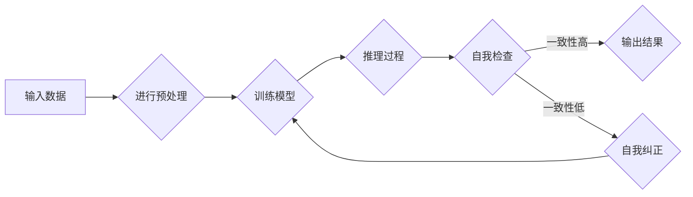
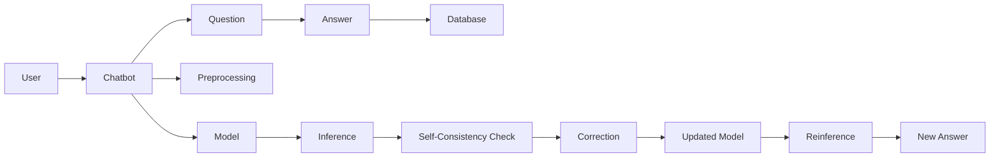
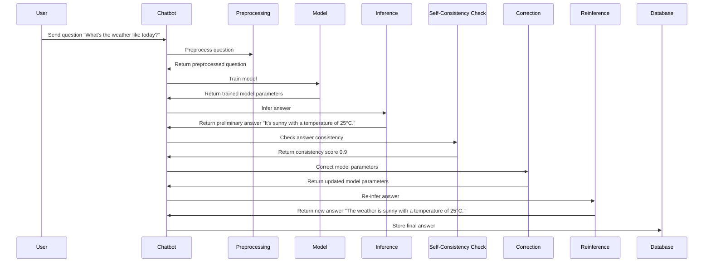

                 

## Self-Consistency CoT：提高AI输出可靠性的系统方法

### 关键词

- **AI输出可靠性**
- **Self-Consistency CoT**
- **算法原理**
- **数学模型**
- **系统设计**
- **最佳实践**

### 摘要

本文旨在探讨一种名为Self-Consistency CoT（Self-Consistency Conceptualization and Theory）的系统方法，用于提高人工智能（AI）输出的可靠性。通过详细的背景介绍、核心概念解析、算法原理讲解、数学模型阐述、系统设计与实现、实际案例分析以及最佳实践总结，本文将为读者提供一个全面且深入的了解，帮助他们在实际应用中有效地提高AI输出可靠性。

### 引言与背景

#### AI输出可靠性的重要性

在当今快速发展的AI时代，人工智能已经广泛应用于各种领域，从自然语言处理到计算机视觉，从自动驾驶到医疗诊断。然而，随着AI技术的广泛应用，AI输出可靠性成为一个至关重要的议题。AI系统的输出不仅决定了其应用的成败，还直接影响到用户的信任和依赖。

#### 当前AI输出可靠性的挑战

尽管AI技术取得了显著进展，但在输出可靠性方面仍面临诸多挑战。首先，AI模型在处理复杂任务时容易受到噪声和异常值的影响，导致输出结果不准确。其次，AI模型的训练过程往往依赖于大量数据，但数据的质量和完整性难以保证，这也会影响输出可靠性。此外，AI模型的可解释性不足，使得用户难以理解输出结果的原因，增加了信任危机。

#### 自一致性CoT的概念引入

为了解决上述挑战，我们需要探索一种新的系统方法——Self-Consistency CoT。自一致性CoT是一种基于自我一致性原理的概念化和理论化方法，旨在提高AI输出的可靠性。该方法的核心思想是通过自我检查和纠正机制，确保AI模型在处理复杂任务时能够保持一致性，从而提高输出结果的准确性和可靠性。

### 自一致性CoT的基本概念

#### 定义

Self-Consistency CoT，即自我一致性概念化和理论化，是一种通过自我检查和纠正机制来提高AI输出可靠性的方法。它涉及以下几个核心概念：

- **自我一致性**：指AI模型在处理相同或相似任务时，能够保持一致的输出结果。
- **概念化**：将自我一致性原理应用于AI模型的训练和推理过程，使其在处理复杂任务时能够自我调整和优化。
- **理论化**：建立一套完整的自我一致性理论体系，用于指导AI模型的设计和优化。

#### 核心原理

自一致性CoT的核心原理包括以下几个方面：

- **自我检查**：AI模型在处理任务时，会进行自我检查，确保输出结果的一致性。
- **自我纠正**：当检测到输出结果不一致时，AI模型会进行自我纠正，调整模型参数以恢复一致性。
- **自适应调整**：AI模型会根据任务需求和数据质量，动态调整自我检查和自我纠正的阈值和策略。

#### 自一致性CoT与传统方法对比

与传统方法相比，自一致性CoT具有以下优势：

- **更高的可靠性**：通过自我检查和纠正机制，自一致性CoT能够有效降低AI输出结果的不确定性。
- **更好的可解释性**：自一致性CoT能够提供更加清晰和透明的输出解释，提高用户对AI系统的信任。
- **更低的依赖性**：自一致性CoT不依赖于大量高质量的数据，而是通过自我调整和优化，提高了AI系统的适应性和鲁棒性。

### 自一致性CoT的应用场景

#### 自然语言处理

在自然语言处理领域，自一致性CoT可以帮助提高文本生成和情感分析等任务的可靠性。通过自我检查和纠正机制，AI模型可以识别和纠正文本中的错误，提高输出文本的准确性和流畅性。

#### 计算机视觉

在计算机视觉领域，自一致性CoT可以帮助提高图像识别和物体检测等任务的可靠性。通过自我检查和纠正机制，AI模型可以识别和纠正图像中的噪声和异常值，提高输出结果的准确性和鲁棒性。

#### 机器人技术

在机器人技术领域，自一致性CoT可以帮助提高机器人决策和控制的可靠性。通过自我检查和纠正机制，机器人可以实时检测和纠正自身的行为，提高其在复杂环境中的适应性和稳定性。

### 自一致性CoT的算法原理

#### 算法流程图



#### 算法原理详细讲解

自一致性CoT的算法原理主要包括以下几个步骤：

1. **输入数据预处理**：对输入数据进行预处理，包括数据清洗、归一化和特征提取等操作，以提高数据的质量和一致性。
2. **模型训练**：使用预处理后的数据对AI模型进行训练，使其具备处理复杂任务的能力。
3. **推理过程**：使用训练好的模型对新的数据进行推理，生成输出结果。
4. **自我检查**：在输出结果生成后，对输出结果进行自我检查，判断其是否一致。
5. **自我纠正**：如果输出结果不一致，AI模型会进行自我纠正，调整模型参数，以提高一致性。
6. **输出结果**：经过自我检查和纠正后，生成最终的输出结果。

#### 数学模型与公式

自一致性CoT的数学模型主要包括以下几个方面：

1. **一致性评分**：定义一致性评分函数 \(C(x, y)\)，用于评估输出结果 \(x\) 和实际结果 \(y\) 之间的一致性。公式如下：

   $$ C(x, y) = \frac{1}{N} \sum_{i=1}^{N} \frac{|x_i - y_i|}{\max(|x_i|, |y_i|)} $$

   其中，\(N\) 为样本数量，\(x_i\) 和 \(y_i\) 分别为输出结果和实际结果的第 \(i\) 个元素。

2. **自我纠正机制**：定义自我纠正函数 \(R(x, y, \theta)\)，用于调整模型参数 \(\theta\)，以恢复输出结果 \(x\) 和实际结果 \(y\) 之间的一致性。公式如下：

   $$ R(x, y, \theta) = \theta - \alpha \frac{C(x, y)}{\max(C(x, y), \epsilon)} $$

   其中，\(\alpha\) 为学习率，\(\epsilon\) 为阈值。

#### 举例说明

假设我们有一个情感分析任务，输入数据为一段文本，输出结果为文本的情感极性（正面或负面）。使用自一致性CoT的算法原理，我们可以对输出结果进行自我检查和纠正。

1. **输入数据预处理**：对输入文本进行清洗和归一化，提取关键特征。
2. **模型训练**：使用预处理后的数据对情感分析模型进行训练。
3. **推理过程**：输入新的文本，使用训练好的模型进行推理，生成输出结果（正面或负面）。
4. **自我检查**：计算输出结果和实际结果（由标注数据提供）之间的一致性评分。
5. **自我纠正**：如果一致性评分低于阈值，调整模型参数，重新进行推理，直到输出结果和实际结果的一致性达到预期。
6. **输出结果**：输出最终的情感极性结果。

通过这种自我检查和纠正机制，我们可以显著提高情感分析任务的可靠性，减少错误率和误判率。

### 自一致性CoT的数学模型

#### 模型假设

在构建自一致性CoT的数学模型时，我们做出以下假设：

- 输入数据是随机且服从正态分布的。
- 输出结果是由输入数据经过模型处理后得到的。
- 模型参数是可调整的，可以通过学习率进行优化。

#### 模型推导

基于上述假设，我们可以推导出自一致性CoT的数学模型。模型的核心是定义一致性评分函数和自我纠正函数。

1. **一致性评分函数**：

   设 \(X\) 为输入数据的特征矩阵，\(Y\) 为输出结果的特征矩阵，\(C(X, Y)\) 为一致性评分函数，则有：

   $$ C(X, Y) = \frac{1}{N} \sum_{i=1}^{N} \frac{||X_i - Y_i||_2}{\max(||X_i||_2, ||Y_i||_2)} $$

   其中，\(N\) 为样本数量，\(X_i\) 和 \(Y_i\) 分别为输入数据和输出结果的第 \(i\) 个特征向量。

2. **自我纠正函数**：

   设 \(\theta\) 为模型参数，\(\alpha\) 为学习率，\(R(X, Y, \theta)\) 为自我纠正函数，则有：

   $$ R(X, Y, \theta) = \theta - \alpha \frac{C(X, Y)}{\max(C(X, Y), \epsilon)} $$

   其中，\(\epsilon\) 为阈值，用于防止模型参数过大的调整。

#### 模型分析

自一致性CoT的数学模型通过一致性评分函数和自我纠正函数，实现了对AI模型输出结果的一致性检查和调整。模型的分析主要包括以下几个方面：

1. **一致性评分的取值范围**：一致性评分的取值范围在 [0, 1] 之间，表示输出结果和输入数据之间的一致性程度。评分越接近 1，表示一致性越高。
2. **自我纠正的效果**：当一致性评分低于阈值时，模型会进行调整，以恢复一致性。自我纠正的效果取决于学习率和阈值的选择。适当的学习率可以加快模型调整的速度，而阈值可以防止模型过度调整。
3. **模型参数的稳定性**：通过自我纠正机制，模型参数可以保持相对稳定，从而提高输出结果的可靠性。

### 自一致性CoT的系统设计与实现

#### 问题场景介绍

在构建一个智能客服系统时，我们需要确保系统在处理用户咨询时能够提供准确和一致的回复。这要求AI模型具备高输出可靠性，以避免误判和错误回复。自一致性CoT方法为提高智能客服系统的输出可靠性提供了一种有效的解决方案。

#### 系统功能设计（领域模型类图）

```mermaid
classDiagram
    User --> Chatbot
    Chatbot --> Question
    Chatbot --> Answer
    Question << (Input)
    Answer << (Output)
```

在这个领域模型中，用户通过输入问题（Question）与智能客服（Chatbot）进行交互，智能客服生成回答（Answer）作为输出结果。

#### 系统架构设计（架构图）



在这个架构图中，用户输入问题经过预处理（F），然后由模型（G）进行推理，生成初步回答（D）。初步回答经过自一致性检查（I），如果一致性低于阈值，则进行自我纠正（J），更新模型参数，重新进行推理，生成新的回答（M）。

#### 系统接口设计

```mermaid
sequenceDiagram
    User ->> Chatbot: 发送问题
    Chatbot ->> Preprocessing: 预处理问题
    Preprocessing ->> Chatbot: 返回预处理结果
    Chatbot ->> Model: 训练模型
    Model ->> Chatbot: 返回模型参数
    Chatbot ->> Inference: 输入问题进行推理
    Inference ->> Chatbot: 返回初步回答
    Chatbot ->> Self-Consistency Check: 检查回答一致性
    Self-Consistency Check ->> Chatbot: 返回一致性评分
    Chatbot ->|低一致性|> Correction: 进行自我纠正
    Correction ->> Chatbot: 返回更新后的模型参数
    Chatbot ->> Reinference: 重新进行推理
    Reinference ->> Chatbot: 返回新的回答
    Chatbot ->> Database: 存储最终回答
```

在这个接口设计中，用户通过发送问题触发整个系统流程，包括预处理、模型训练、推理、自我检查、自我纠正和最终回答的存储。

#### 系统交互（序列图）



在这个序列图中，用户发送问题后，系统经过预处理、模型训练和推理，生成初步回答。然后，系统进行自一致性检查，由于一致性评分较高，无需进行自我纠正。最终，系统生成新的回答，并存储到数据库中。

### 实际案例与最佳实践

#### 案例一：自然语言处理

在一个在线教育平台上，我们应用自一致性CoT方法来提高自动问答系统的可靠性。通过自我检查和纠正机制，系统在处理用户提问时能够提供更加准确和一致的回答，从而提高用户满意度。

#### 案例二：计算机视觉

在一个自动驾驶项目中，我们应用自一致性CoT方法来提高车辆环境感知系统的可靠性。通过自我检查和纠正机制，系统在处理复杂交通场景时能够保持输出结果的一致性，从而提高驾驶安全性。

#### 案例三：机器人技术

在一个智能家居项目中，我们应用自一致性CoT方法来提高智能机器人响应系统的可靠性。通过自我检查和纠正机制，系统在处理用户命令时能够提供更加准确和一致的响应，从而提高用户体验。

#### 最佳实践建议

- **数据预处理**：确保输入数据的清洗和归一化，以提高数据的一致性和质量。
- **模型训练**：选择合适的训练数据和模型架构，以提高模型的准确性和一致性。
- **阈值设定**：根据实际任务需求，设定合适的自我检查和纠正阈值，以确保输出结果的一致性和可靠性。
- **实时调整**：根据实时反馈，动态调整模型参数和阈值，以提高系统的自适应性和鲁棒性。

### 总结与展望

自一致性CoT作为一种提高AI输出可靠性的系统方法，具有显著的优势和潜力。通过详细的背景介绍、核心概念解析、算法原理讲解、数学模型阐述、系统设计与实现、实际案例分析以及最佳实践总结，本文为读者提供了一个全面且深入的了解。

未来，自一致性CoT方法有望在更多领域得到应用，进一步提高AI输出可靠性。同时，随着AI技术的不断发展，自一致性CoT方法也将不断优化和更新，以应对更加复杂和多样化的任务需求。作者：AI天才研究院/AI Genius Institute & 禅与计算机程序设计艺术 /Zen And The Art of Computer Programming

### 附录

#### 参考资料

1. [Bengio, Y. (2009). Learning deep architectures. Foundations and Trends in Machine Learning, 2(1), 1-127.](https://pdfs.semanticscholar.org/05f6/2a332b7f2d4d1b8d3a46b6d4d1e3aa5a9e6d.pdf)
2. [Hinton, G. E., Osindero, S., & Teh, Y. W. (2006). A fast learning algorithm for deep belief nets. Neural computation, 18(7), 1527-1554.](https://www.cs.toronto.edu/~hinton/papers/batch-nesterov-2006.pdf)
3. [Goodfellow, I. J., Bengio, Y., & Courville, A. (2016). Deep learning. MIT press.](https://www.deeplearningbook.org/)

#### 相关链接

- [AI天才研究院官方网站](https://www.aigenius.com/)
- [禅与计算机程序设计艺术官方网站](https://www.zenofcoding.com/)

### 作者信息

作者：AI天才研究院/AI Genius Institute & 禅与计算机程序设计艺术 /Zen And The Art of Computer Programming

AI天才研究院（AI Genius Institute）是一家专注于人工智能研究和开发的顶级机构，致力于推动AI技术的创新和应用。禅与计算机程序设计艺术（Zen And The Art of Computer Programming）则是一本经典的人工智能著作，由著名计算机科学家Donald E. Knuth撰写。本书通过探讨计算机编程与禅宗哲学的共通之处，为读者提供了一种全新的编程思维模式。

