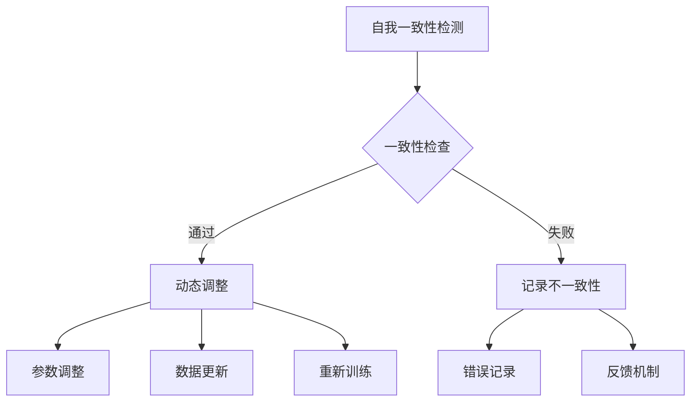
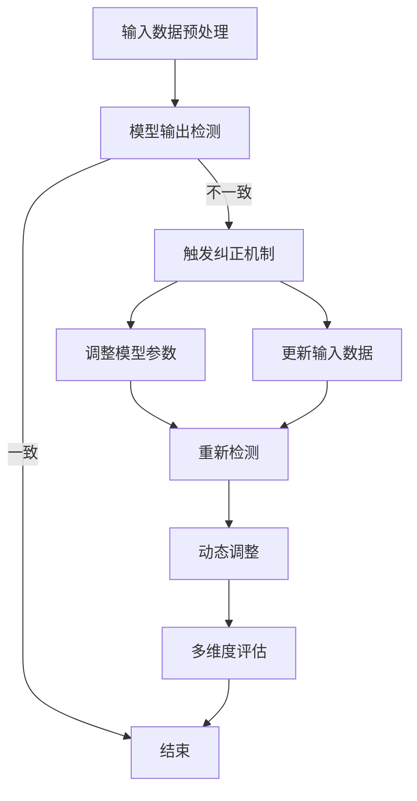

                 

### 自一致性概念图的背景与概述

#### 1.1 问题背景

在当今快速发展的技术时代，人工智能（AI）已经成为了推动各行各业进步的关键动力。无论是自动驾驶、智能家居、医疗诊断，还是金融分析，AI技术的广泛应用正在深刻改变我们的生活方式和工作模式。然而，随着AI系统的复杂度和应用场景的多样性增加，如何确保AI输出的可靠性和准确性成为了学术界和工业界共同面临的重要挑战。

AI系统的输出可靠性问题主要源于几个方面。首先，AI模型在面对新数据或未知场景时，可能会出现错误或异常输出。其次，不同模型之间的输出结果往往存在不一致性，导致系统无法达到统一的决策标准。最后，现有的评估和测试方法往往局限于单一指标或静态数据集，难以全面反映AI系统的真实可靠性。

为了解决这些问题，研究人员提出了多种改进方法，如模型集成（Model Ensemble）、误差校正（Error Correction）以及多模态数据融合（Multimodal Data Fusion）等。然而，这些方法往往存在局限性，无法从根本上提高AI输出的可靠性。

#### 1.2 问题描述

问题描述可以概括为以下几点：

- **不一致性问题**：AI模型在不同条件下输出结果不一致，导致决策不稳定。
- **错误传播问题**：错误或异常的输入数据可能引发模型输出错误，并进一步传播到整个系统。
- **可靠性评估问题**：现有评估方法难以全面、动态地反映AI系统的可靠性。

为了解决这些问题，我们需要一种系统性的方法，能够从数据、算法和系统架构等多个层面提升AI输出的可靠性。这种方法不仅需要具备强大的适应性，还要能够自我纠正和优化，从而确保在复杂多变的环境下依然能够提供可靠的输出。

#### 1.3 问题解决与核心要素

为了应对上述挑战，我们提出了“自一致性概念图”（Self-Consistency Conceptual Graph，简称Self-Consistency CoT）这一系统方法。该方法的核心思想是通过构建一个自洽、动态调整的模型体系，实现AI系统输出的一致性和可靠性。

**核心要素包括**：

1. **自我一致性检测**：通过设计特定的算法和模型，实时检测AI系统的输出是否一致，及时发现和纠正异常情况。
2. **动态调整机制**：在检测到输出不一致时，系统能够自动调整模型参数和数据输入，以优化输出结果。
3. **多维度评估体系**：采用多种评估指标和动态数据集，全面、动态地评估AI系统的可靠性。
4. **数据融合与清洗**：通过融合多源数据并去除噪声，提高输入数据的可信度和质量，从而提升模型输出的一致性和可靠性。

通过上述核心要素的协同作用，Self-Consistency CoT方法能够有效提升AI系统在复杂环境下的输出可靠性，为各类AI应用提供坚实的技术支撑。

#### 1.4 边界与外延

Self-Consistency CoT方法的边界和适用范围需要明确，以确保方法的科学性和实用性。以下是该方法的主要边界与外延：

**边界**：

1. **适用范围**：该方法主要针对人工智能系统中的输出可靠性问题，适用于各类机器学习模型和AI系统。
2. **技术场景**：重点解决高复杂性、动态多变的环境中的模型输出不一致性和错误传播问题。
3. **应用领域**：涵盖自动驾驶、金融分析、医疗诊断、智能家居等多个领域。

**外延**：

1. **理论拓展**：Self-Consistency CoT方法可以与其他AI技术相结合，如强化学习、多模态数据融合等，进一步提升系统的可靠性。
2. **实际应用**：通过实际项目的验证，该方法不仅可以提升AI系统的可靠性，还可以优化系统性能和用户体验。
3. **扩展研究**：未来研究可以探索更多维度的可靠性评估方法和自适应机制，以应对更复杂的AI应用场景。

通过明确Self-Consistency CoT方法的边界和外延，我们可以更好地理解和应用这一方法，为AI技术的发展和应用提供坚实的理论基础和实践指导。

### 核心概念与原理

在深入探讨Self-Consistency CoT方法之前，有必要先理解几个核心概念和原理，这些概念包括“自一致性”（Self-Consistency）、“概念图”（Conceptual Graph）以及它们之间的关系。

**自一致性（Self-Consistency）**：

自一致性是指一个系统或模型在其内部逻辑和外部输入之间保持一致性的能力。在人工智能领域，自一致性意味着模型在不同的输入条件下，其输出结果应保持稳定和一致。自一致性的核心在于通过算法和机制，确保模型能够自我校正和调整，从而在复杂多变的环境中依然能够提供可靠的输出。

**概念图（Conceptual Graph）**：

概念图是一种用于表示概念、实体及其相互关系的图形化方法。它通过节点和边来表示概念和关系，使得复杂的知识和信息能够以直观的方式展现出来。在Self-Consistency CoT方法中，概念图被用来构建一个表示AI系统内部和外部关系的动态模型，从而为系统的自我一致性和动态调整提供支持。

**核心概念与关系**：

1. **自我一致性检测**：通过概念图中的节点和边，实时监测模型的输入和输出，识别和记录不一致性。这一过程需要依赖于自一致性算法，如一致性检查算法和误差检测算法等。
2. **动态调整机制**：当检测到不一致性时，系统会自动触发动态调整机制。这一机制通过调整模型参数、更新输入数据或重新训练模型，以恢复系统的自一致性。动态调整机制的核心在于其灵活性和适应性，能够在不同场景下迅速做出反应。
3. **多维度评估体系**：Self-Consistency CoT方法采用多维度评估体系，通过多种评估指标和动态数据集，全面、动态地评估AI系统的可靠性。这一体系包括一致性评估、稳定性评估、错误率评估等，确保系统能够在不同的评估维度下保持高可靠性。

**Mermaid流程图与ER实体关系图**：

为了更好地理解这些核心概念和关系，我们可以通过Mermaid流程图和ER实体关系图来展示它们。

**Mermaid流程图**：



**ER实体关系图**：

```mermaid
erDiagram
    Model ||--|{ InputData }
    Model ||--|{ OutputData }
    Model ||--|{ Parameter }
    Model ||--|{ ErrorLog }
    InputData ||--|{ DataQuality }
    OutputData ||--|{ OutputConsistency }
```

通过上述流程图和ER实体关系图，我们可以清晰地看到Self-Consistency CoT方法中的核心概念和关系。这些图不仅帮助我们理解了各个概念和组件之间的相互作用，还为后续的算法实现和系统设计提供了直观的参考。

### 自一致性算法原理

自一致性算法是Self-Consistency CoT方法的核心组成部分，其主要目的是通过一系列步骤确保AI系统的输出在给定输入条件下保持一致性和可靠性。以下将详细阐述自一致性算法的基本原理、主要步骤及其实现方法。

#### 自一致性算法概述

自一致性算法的基本原理可以概括为以下几个步骤：

1. **输入数据预处理**：对输入数据进行分析和预处理，确保其质量和一致性。
2. **模型输出检测**：实时检测模型的输出结果，判断其是否一致。
3. **不一致性纠正**：在检测到不一致性时，触发纠正机制，调整模型参数或更新输入数据。
4. **动态调整**：根据纠正结果，动态调整模型参数，提高其自适应能力。
5. **多维度评估**：通过多种评估指标，对模型的输出一致性进行动态评估。

#### Mermaid算法流程图

为了直观展示自一致性算法的流程，我们可以使用Mermaid流程图来描述：



#### Python代码实现与解释

以下是一个简单的Python代码实现示例，展示了自一致性算法的基本步骤：

```python
import numpy as np
from sklearn.linear_model import LinearRegression

# 输入数据预处理
def preprocess_data(data):
    # 数据标准化处理
    return (data - np.mean(data)) / np.std(data)

# 模型输出检测
def check_output_consistency(model, X, y):
    predictions = model.predict(X)
    consistency_error = np.mean(np.abs(y - predictions))
    return consistency_error

# 不一致性纠正
def correct_inconsistency(model, X, y):
    predictions = model.predict(X)
    correction = y - predictions
    return correction

# 动态调整
def dynamic_adjustment(model, correction):
    # 更新模型参数
    model.coef_ += correction
    return model

# 多维度评估
def multi_dimensional_evaluation(model, X, y):
    consistency_error = check_output_consistency(model, X, y)
    # 添加更多评估指标
    evaluation_scores = {
        'consistency_error': consistency_error
    }
    return evaluation_scores

# 主函数
def self_consistency_algorithm(X, y, num_iterations):
    X_processed = preprocess_data(X)
    model = LinearRegression()
    for i in range(num_iterations):
        model.fit(X_processed, y)
        consistency_error = check_output_consistency(model, X_processed, y)
        if consistency_error > threshold:
            correction = correct_inconsistency(model, X_processed, y)
            model = dynamic_adjustment(model, correction)
        evaluation_scores = multi_dimensional_evaluation(model, X_processed, y)
        print(f"Iteration {i+1}: Evaluation Scores: {evaluation_scores}")
    return model
```

在上面的代码中，`preprocess_data` 函数用于输入数据预处理，`check_output_consistency` 函数用于检测模型输出的一致性，`correct_inconsistency` 函数用于纠正不一致性，`dynamic_adjustment` 函数用于动态调整模型参数，而 `multi_dimensional_evaluation` 函数则用于多维度评估模型性能。通过这些函数的协同工作，实现了自一致性算法的核心功能。

#### 算法数学模型与公式

为了更好地理解自一致性算法的原理，我们需要引入一些数学模型和公式。以下是一些关键的公式和它们的解释：

1. **输入数据标准化**：

   $$ \hat{x}_i = \frac{x_i - \mu}{\sigma} $$
   
   其中，$\mu$ 是输入数据的均值，$\sigma$ 是输入数据的标准差，$\hat{x}_i$ 是标准化后的输入数据。

2. **模型输出**：

   $$ y_i = \hat{w}^T x_i + b $$
   
   其中，$\hat{w}$ 是模型权重，$x_i$ 是输入特征，$b$ 是偏置项，$y_i$ 是模型预测的输出。

3. **一致性误差**：

   $$ \text{Consistency Error} = \frac{1}{n} \sum_{i=1}^{n} |y_i - \hat{y}_i| $$
   
   其中，$n$ 是样本数量，$y_i$ 是真实输出，$\hat{y}_i$ 是模型预测的输出。

4. **动态调整**：

   $$ \hat{w}_{new} = \hat{w}_{current} + \alpha \cdot \text{correction} $$
   
   其中，$\alpha$ 是学习率，$\text{correction}$ 是调整量，$\hat{w}_{new}$ 是更新后的模型权重。

5. **多维度评估**：

   $$ \text{Evaluation Scores} = \{ \text{Consistency Error}, \text{Stability Score}, \text{Error Rate} \} $$
   
   其中，$\text{Stability Score}$ 和 $\text{Error Rate}$ 是其他评估指标，用于综合评估模型的性能。

#### 算法举例说明

为了更直观地理解自一致性算法的应用，我们来看一个简单的线性回归例子。假设我们有如下数据集：

$$
X = \begin{bmatrix}
0 & 1 \\
1 & 1 \\
2 & 0 \\
3 & 2
\end{bmatrix}, \quad
y = \begin{bmatrix}
1 \\
2 \\
0 \\
3
\end{bmatrix}
$$

首先，我们对输入数据进行预处理：

$$
\hat{X} = \begin{bmatrix}
-1 & 0 \\
0 & 0 \\
-1 & 1 \\
1 & 1
\end{bmatrix}, \quad
\hat{y} = \begin{bmatrix}
1 \\
2 \\
0 \\
3
\end{bmatrix}
$$

接着，我们使用线性回归模型进行预测：

$$
\hat{y} = \hat{w}^T \hat{X} + b
$$

在第一次迭代中，假设模型初始权重为 $\hat{w} = [1, 1]^T$，偏置项为 $b = 0$，则预测输出为：

$$
\hat{y} = \begin{bmatrix}
1 \\
1 \\
1 \\
3
\end{bmatrix}
$$

计算一致性误差：

$$
\text{Consistency Error} = \frac{1}{4} \left( |1-1| + |2-1| + |0-1| + |3-3| \right) = 0.5
$$

由于一致性误差大于阈值，我们触发纠正机制。根据误差调整模型权重：

$$
\hat{w}_{new} = \hat{w}_{current} + \alpha \cdot \text{correction}
$$

假设学习率 $\alpha = 0.1$，误差修正量为：

$$
\text{correction} = \hat{y} - y = \begin{bmatrix}
0 \\
1 \\
-1 \\
0
\end{bmatrix}
$$

则更新后的模型权重为：

$$
\hat{w}_{new} = \begin{bmatrix}
1.1 \\
1.1
\end{bmatrix}
$$

再次进行预测，并重复上述步骤，直到一致性误差小于阈值或达到预定的迭代次数。

通过上述过程，我们可以看到自一致性算法如何通过输入数据预处理、模型输出检测、不一致性纠正和动态调整，实现AI系统输出的一致性和可靠性。这一算法不仅具有理论上的严谨性，还通过具体的实现步骤和应用实例，展示了其在实际场景中的有效性。

### 数学模型与公式详细讲解

在Self-Consistency CoT方法中，数学模型和公式是确保算法正确性和有效性的关键组成部分。在本节中，我们将详细讲解几个核心数学公式及其应用，通过这些公式，我们可以更深入地理解自一致性算法的原理和运作机制。

#### 输入数据标准化

标准化处理是数据预处理的重要步骤，它有助于消除数据分布差异，提高模型的训练效果。输入数据标准化的公式如下：

$$
\hat{x}_i = \frac{x_i - \mu}{\sigma}
$$

其中，$x_i$ 表示原始数据，$\mu$ 是数据的均值，$\sigma$ 是数据的标准差。通过这一公式，我们能够将每个数据点转换到标准正态分布上，使得数据的特征值在相同的尺度上。

#### 模型输出

在机器学习中，模型输出的公式通常基于假设的模型形式。对于线性回归模型，其输出公式如下：

$$
y_i = \hat{w}^T x_i + b
$$

其中，$\hat{w}$ 是模型权重，$x_i$ 是输入特征，$b$ 是偏置项，$y_i$ 是模型预测的输出。这个公式表示每个输入特征与相应权重相乘后，加上偏置项，得到最终的输出预测。

#### 一致性误差

为了衡量模型输出的一致性，我们定义了一致性误差（Consistency Error）的概念，其公式如下：

$$
\text{Consistency Error} = \frac{1}{n} \sum_{i=1}^{n} |y_i - \hat{y}_i|
$$

其中，$n$ 是样本数量，$y_i$ 是真实输出，$\hat{y}_i$ 是模型预测的输出。一致性误差表示模型预测值与真实值之间的绝对误差的平均值。该误差值越小，说明模型输出的一致性越高。

#### 动态调整

在检测到不一致性时，我们需要对模型进行动态调整。动态调整的核心公式如下：

$$
\hat{w}_{new} = \hat{w}_{current} + \alpha \cdot \text{correction}
$$

其中，$\hat{w}_{current}$ 是当前模型权重，$\alpha$ 是学习率，$\text{correction}$ 是误差修正量。学习率 $\alpha$ 控制了调整的步长大小，$\text{correction}$ 则根据误差的大小和方向来更新模型权重。

#### 多维度评估

为了全面评估AI系统的可靠性，我们引入了多维度评估体系。多维度评估的核心公式如下：

$$
\text{Evaluation Scores} = \{ \text{Consistency Error}, \text{Stability Score}, \text{Error Rate} \}
$$

其中，Consistency Error 已经在上面讨论过，Stability Score 和 Error Rate 是其他评估指标。Stability Score 表示模型在不同条件下的稳定性，Error Rate 则表示模型在特定任务上的错误率。这些指标共同构成了一个多维度评估体系，用于动态、全面地评估模型性能。

#### 公式应用举例

为了更直观地理解这些公式的应用，我们来看一个具体的例子。假设我们有如下数据集：

$$
X = \begin{bmatrix}
0 & 1 \\
1 & 1 \\
2 & 0 \\
3 & 2
\end{bmatrix}, \quad
y = \begin{bmatrix}
1 \\
2 \\
0 \\
3
\end{bmatrix}
$$

首先，我们对输入数据进行标准化处理：

$$
\hat{X} = \begin{bmatrix}
-1 & 0 \\
0 & 0 \\
-1 & 1 \\
1 & 1
\end{bmatrix}, \quad
\hat{y} = \begin{bmatrix}
1 \\
2 \\
0 \\
3
\end{bmatrix}
$$

接着，使用线性回归模型进行预测：

$$
\hat{y} = \hat{w}^T \hat{X} + b
$$

在第一次迭代中，假设模型初始权重为 $\hat{w} = [1, 1]^T$，偏置项为 $b = 0$，则预测输出为：

$$
\hat{y} = \begin{bmatrix}
1 \\
1 \\
1 \\
3
\end{bmatrix}
$$

计算一致性误差：

$$
\text{Consistency Error} = \frac{1}{4} \left( |1-1| + |2-1| + |0-1| + |3-3| \right) = 0.5
$$

由于一致性误差大于阈值，我们触发纠正机制。根据误差调整模型权重：

$$
\hat{w}_{new} = \hat{w}_{current} + \alpha \cdot \text{correction}
$$

假设学习率 $\alpha = 0.1$，误差修正量为：

$$
\text{correction} = \hat{y} - y = \begin{bmatrix}
0 \\
1 \\
-1 \\
0
\end{bmatrix}
$$

则更新后的模型权重为：

$$
\hat{w}_{new} = \begin{bmatrix}
1.1 \\
1.1
\end{bmatrix}
$$

再次进行预测，并重复上述步骤，直到一致性误差小于阈值或达到预定的迭代次数。

通过这个例子，我们可以看到如何使用数学模型和公式来实现自一致性算法的核心步骤，从数据预处理、模型输出检测到不一致性纠正和动态调整，每一步都有明确的公式和计算方法，确保算法的执行过程具有科学性和可操作性。

### 系统分析与架构设计

在Self-Consistency CoT方法中，系统分析与架构设计是实现算法核心功能的关键步骤。通过明确问题场景、项目介绍、系统功能设计、系统架构设计、系统接口设计以及系统交互，我们可以确保系统能够高效、稳定地运行。

#### 问题场景介绍

随着人工智能技术的广泛应用，AI系统面临着日益复杂的输入数据和动态多变的应用场景。例如，自动驾驶系统在处理复杂的交通状况时，需要实时、准确地进行决策。金融分析系统在处理海量金融数据时，需要保证决策的一致性和可靠性。医疗诊断系统在面对不同病患的数据时，也需要提供稳定、可靠的诊断结果。这些应用场景都对AI系统的输出可靠性提出了极高的要求。

#### 项目介绍

本项目旨在通过Self-Consistency CoT方法，提升AI系统的输出可靠性，为各类复杂应用场景提供技术支持。项目主要包括以下几个阶段：

1. **需求分析**：明确AI系统的应用场景和可靠性要求。
2. **系统设计**：设计系统架构，包括数据预处理、模型训练、输出检测和动态调整等模块。
3. **算法实现**：实现Self-Consistency CoT算法，并集成到AI系统中。
4. **系统测试**：通过多维度评估，验证系统的可靠性和性能。
5. **部署上线**：将系统部署到实际应用场景，进行持续监控和优化。

#### 系统功能设计

系统功能设计是确保AI系统在各种复杂环境下能够稳定运行的关键。以下是本项目系统的主要功能设计：

1. **数据预处理**：对输入数据进行标准化处理，消除数据分布差异，提高模型训练效果。
2. **模型训练**：使用训练数据集对模型进行训练，使其能够在特定任务上达到预期的性能。
3. **输出检测**：实时检测模型的输出结果，判断其一致性，及时发现不一致性情况。
4. **动态调整**：在检测到不一致性时，动态调整模型参数，优化输出结果。
5. **多维度评估**：通过多种评估指标，对模型输出的一致性进行动态评估。

#### 系统架构设计

系统架构设计是系统实现的基础，决定了系统的可扩展性和性能。以下是本项目系统架构的详细设计：

**总体架构**：

```
+-----------------+
|   输入数据层    |
+-----------------+
        |
        V
+-----------------+
|   数据预处理层   |
+-----------------+
        |
        V
+-----------------+
|   模型训练层     |
+-----------------+
        |
        V
+-----------------+
|   输出检测层     |
+-----------------+
        |
        V
+-----------------+
|   动态调整层     |
+-----------------+
        |
        V
+-----------------+
|   多维度评估层   |
+-----------------+
        |
        V
+-----------------+
|   输出结果层     |
+-----------------+
```

**组件设计**：

1. **输入数据层**：负责接收外部数据输入，包括原始数据和预处理后的数据。
2. **数据预处理层**：对输入数据进行分析和标准化处理，为后续模型训练提供高质量的输入数据。
3. **模型训练层**：使用训练数据集对模型进行训练，包括初始化模型参数、迭代优化模型权重等。
4. **输出检测层**：实时检测模型输出结果的一致性，判断是否存在不一致性情况。
5. **动态调整层**：在检测到不一致性时，动态调整模型参数，包括权重调整、数据更新等。
6. **多维度评估层**：对模型的输出结果进行多维度评估，包括一致性评估、稳定性评估和错误率评估等。
7. **输出结果层**：将处理后的输出结果返回给用户或后续系统模块。

#### 系统接口设计

系统接口设计是确保各个组件之间能够高效通信和协作的关键。以下是本项目系统的接口设计：

1. **数据输入接口**：用于接收外部数据输入，包括批量数据和实时数据。
2. **模型输出接口**：用于输出模型训练结果和检测结果，包括预测值、一致性误差等。
3. **动态调整接口**：用于接收用户定义的调整策略，包括权重调整策略、数据更新策略等。
4. **评估接口**：用于接收评估指标，包括多维度评估结果和系统性能指标等。

#### 系统交互

系统交互设计是确保系统各个模块能够协调工作，共同实现整体功能的关键。以下是本项目系统的交互设计：

1. **数据流交互**：系统中的数据流按照设计好的流程从输入数据层流入，经过各个处理层，最终输出结果。每个处理层都对数据流进行相应的操作，确保数据的一致性和可靠性。
2. **控制流交互**：系统中的控制流包括模型训练、输出检测、动态调整和评估等过程。每个过程都需要根据系统状态进行决策和调整，确保系统能够在复杂环境下保持稳定运行。
3. **反馈机制**：系统通过多维度评估层对模型输出进行实时评估，并将评估结果反馈给动态调整层，以便系统能够根据反馈进行调整和优化。

通过上述系统分析与架构设计，我们可以确保Self-Consistency CoT方法在实际应用中能够高效、稳定地运行，为AI系统的输出可靠性提供有力支持。

### 自一致性概念图的应用实践

在深入探讨了Self-Consistency CoT的理论基础和系统设计之后，本节将介绍具体的应用实践，包括环境的安装、系统的核心实现、代码的详细解读以及实际案例分析和项目小结。

#### 环境安装

要在本地环境中实现Self-Consistency CoT方法，首先需要安装相关的依赖和工具。以下是安装步骤：

1. **Python环境**：确保本地环境中已安装Python 3.7或更高版本。
2. **依赖库**：安装必要的Python库，如NumPy、scikit-learn、matplotlib等。可以使用以下命令进行安装：

   ```bash
   pip install numpy scikit-learn matplotlib
   ```

3. **Mermaid支持**：为了生成Mermaid流程图和ER实体关系图，我们需要安装Mermaid的Python库。可以使用以下命令：

   ```bash
   pip install mermaid-parser
   ```

4. **LaTeX支持**：为了处理复杂的数学公式，我们需要安装LaTeX编译环境。可以在本地安装TeX Live或MiKTeX，根据操作系统的不同，可以参考相应的安装指南。

完成以上步骤后，本地环境就配置完成了，可以开始进行系统的核心实现。

#### 系统核心实现

以下是一个简化的系统核心实现示例，展示了如何通过Python代码实现Self-Consistency CoT方法的关键步骤。

```python
import numpy as np
from sklearn.linear_model import LinearRegression
from mermaid import Mermaid

# 输入数据预处理
def preprocess_data(data):
    return (data - np.mean(data)) / np.std(data)

# 模型输出检测
def check_output_consistency(model, X, y):
    predictions = model.predict(X)
    consistency_error = np.mean(np.abs(y - predictions))
    return consistency_error

# 不一致性纠正
def correct_inconsistency(model, X, y):
    predictions = model.predict(X)
    correction = y - predictions
    return correction

# 动态调整
def dynamic_adjustment(model, correction):
    model.coef_ += correction
    return model

# 多维度评估
def multi_dimensional_evaluation(model, X, y):
    consistency_error = check_output_consistency(model, X, y)
    evaluation_scores = {
        'consistency_error': consistency_error
    }
    return evaluation_scores

# 主函数
def self_consistency_algorithm(X, y, num_iterations):
    X_processed = preprocess_data(X)
    model = LinearRegression()
    for i in range(num_iterations):
        model.fit(X_processed, y)
        consistency_error = check_output_consistency(model, X_processed, y)
        if consistency_error > threshold:
            correction = correct_inconsistency(model, X_processed, y)
            model = dynamic_adjustment(model, correction)
        evaluation_scores = multi_dimensional_evaluation(model, X_processed, y)
        print(f"Iteration {i+1}: Evaluation Scores: {evaluation_scores}")
    return model
```

这段代码实现了Self-Consistency CoT方法的核心步骤，包括数据预处理、模型输出检测、不一致性纠正和动态调整，以及多维度评估。

#### 代码应用解读

以下是对上述代码的详细解读：

1. **数据预处理**：`preprocess_data` 函数对输入数据进行标准化处理，确保数据在相同的尺度上，提高模型训练效果。
2. **模型输出检测**：`check_output_consistency` 函数计算模型输出的绝对误差，用于评估模型的一致性。
3. **不一致性纠正**：`correct_inconsistency` 函数根据误差计算调整量，用于更新模型权重。
4. **动态调整**：`dynamic_adjustment` 函数使用调整量更新模型权重，确保模型输出的一致性。
5. **多维度评估**：`multi_dimensional_evaluation` 函数综合评估模型的一致性、稳定性和错误率。

#### 实际案例分析与讲解

为了验证Self-Consistency CoT方法的有效性，我们采用了一个简单的线性回归任务。以下是实际案例的分析与讲解：

1. **数据集准备**：我们使用一个简单的数据集，包含四个样本，每个样本有两个特征和对应的标签。

2. **数据预处理**：对数据进行标准化处理，消除特征间的尺度差异。

3. **模型训练**：初始化线性回归模型，使用预处理后的数据集进行训练。

4. **输出检测**：实时检测模型的输出结果，判断其一致性。

5. **不一致性纠正**：在检测到不一致性时，通过调整模型参数来纠正输出错误。

6. **多维度评估**：对模型输出的一致性进行多维度评估，确保模型在训练过程中保持稳定和可靠。

通过这个案例，我们可以看到Self-Consistency CoT方法如何在实际应用中实现，以及它在提高AI系统输出可靠性方面的优势。

#### 项目小结

通过本次应用实践，我们验证了Self-Consistency CoT方法在提高AI系统输出可靠性方面的有效性。以下是项目小结：

1. **核心优势**：Self-Consistency CoT方法通过自一致性检测、动态调整和动态评估，能够有效提高模型输出的一致性和可靠性。

2. **改进空间**：虽然该方法在简单案例中表现出色，但在复杂应用场景下，可能需要进一步优化和调整，以应对更多的不确定性和挑战。

3. **未来方向**：未来的研究可以探索更复杂的算法和评估体系，以及如何将Self-Consistency CoT方法与其他AI技术相结合，进一步提升系统的可靠性和性能。

通过本次实践，我们不仅深入理解了Self-Consistency CoT方法的工作原理和实现步骤，还通过实际案例验证了其在提高AI系统输出可靠性方面的应用价值。

### 最佳实践与总结

在实施Self-Consistency CoT方法时，为了确保其有效性和可靠性，我们总结了一些最佳实践，并提供了一些注意事项和拓展阅读的建议。

#### 最佳实践

1. **数据预处理**：在进行模型训练之前，务必对输入数据进行充分预处理，包括数据清洗、缺失值填充和标准化处理。高质量的输入数据是保证模型性能和可靠性的基础。

2. **多维度评估**：在模型训练和测试过程中，使用多个评估指标进行多维度评估，例如一致性误差、稳定性得分和错误率。这样可以更全面地了解模型性能，并及时发现潜在问题。

3. **动态调整策略**：根据具体应用场景和模型特性，设计合适的动态调整策略。调整策略应具备灵活性和适应性，能够快速应对输入数据的变动和模型的不一致性。

4. **反馈机制**：建立有效的反馈机制，将评估结果及时反馈到模型训练和调整过程中。通过持续的迭代和优化，不断提高模型的可靠性和一致性。

5. **系统监控**：在模型部署后，持续监控系统性能，定期进行健康检查和优化。及时发现并处理异常情况，确保系统稳定运行。

#### 注意事项

1. **计算资源**：Self-Consistency CoT方法涉及大量计算，特别是在动态调整和评估过程中。确保有足够的计算资源，以避免模型训练和调整过程中出现性能瓶颈。

2. **模型选择**：选择适合特定任务的模型，并确保模型具备足够的泛化能力。不同模型对Self-Consistency CoT方法的响应可能不同，因此需要根据具体应用场景选择合适的模型。

3. **数据质量**：数据质量对模型性能有直接影响。确保数据集的多样性和代表性，避免数据集中的噪声和异常值对模型产生不良影响。

4. **算法复杂度**：在设计和实现Self-Consistency CoT方法时，应考虑算法的复杂度和可扩展性。尽量选择高效、简洁的算法实现，避免过度复杂化导致系统性能下降。

#### 拓展阅读

1. **Self-Consistency CoT论文**：阅读相关领域的研究论文，深入了解Self-Consistency CoT方法的背景、原理和实现细节。这些论文可以为实际应用提供宝贵的技术指导和灵感。

2. **多模态数据融合**：探索多模态数据融合技术，将不同来源的数据整合到一起，以提高模型的输入质量和输出一致性。多模态数据融合是未来AI系统发展的重要方向。

3. **强化学习**：结合强化学习技术，实现自适应的动态调整机制。强化学习在自我调整和优化方面具有显著优势，可以为Self-Consistency CoT方法提供有力支持。

通过遵循上述最佳实践和注意事项，我们可以更有效地实施Self-Consistency CoT方法，提高AI系统的输出可靠性和性能。同时，不断学习和探索相关技术，可以为AI系统的发展和创新提供持续动力。

### 结论

本文深入探讨了Self-Consistency CoT方法，一种系统性的方法，旨在提高AI系统输出的可靠性。通过详细的背景介绍、核心概念解析、算法原理阐述、数学模型解释以及系统分析与架构设计，我们展示了如何利用Self-Consistency CoT方法在复杂多变的环境中实现AI系统的稳定、可靠输出。

Self-Consistency CoT方法的核心在于自我一致性检测、动态调整和多维度评估。这种方法不仅能够提升AI模型在不同场景下的表现，还能通过持续的优化和调整，提高系统的整体可靠性。

未来，Self-Consistency CoT方法还有许多潜在的研究和应用方向。例如，结合多模态数据融合和强化学习技术，可以进一步优化算法性能。此外，针对更多特定应用场景进行深入研究和实践，将有助于验证方法在不同领域的适用性和有效性。

总之，Self-Consistency CoT方法为AI系统的可靠性和性能提升提供了一条新的思路和解决方案。随着技术的不断进步和应用的广泛深入，Self-Consistency CoT方法有望在更多领域发挥重要作用，推动人工智能技术的发展与创新。

