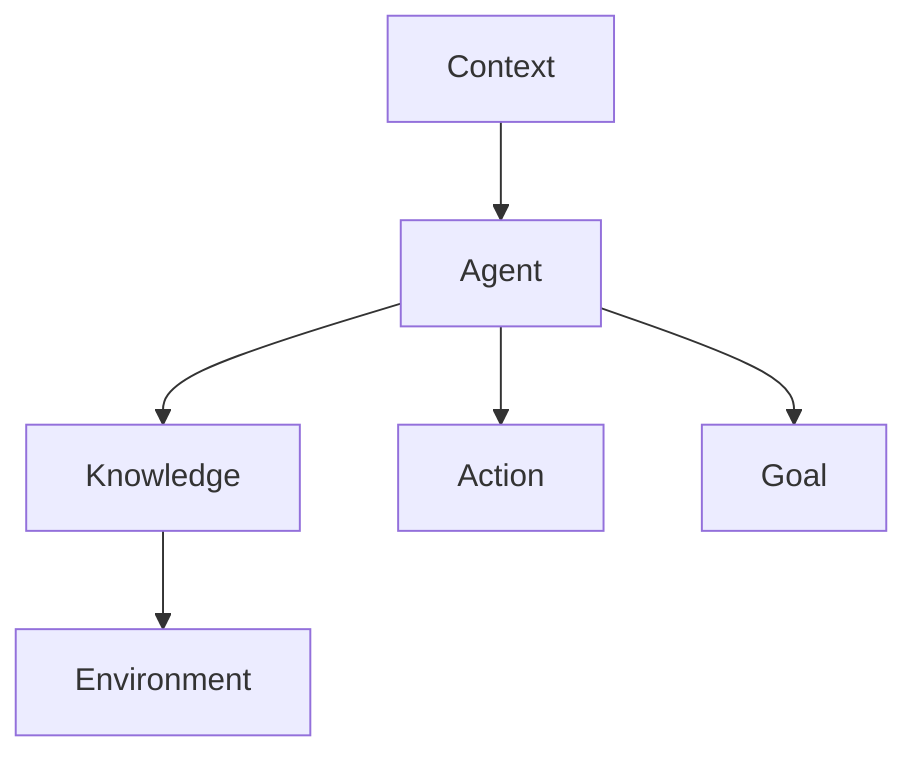
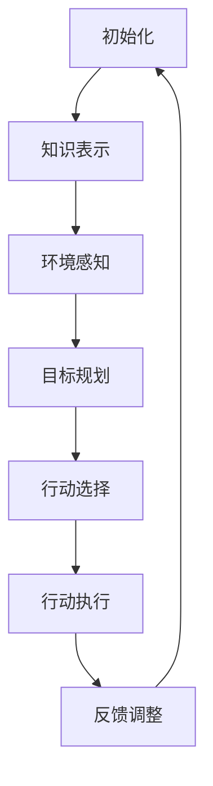
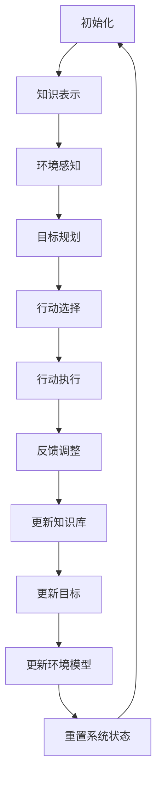
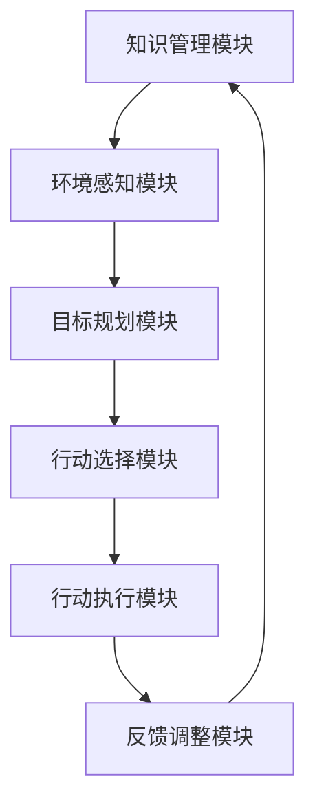
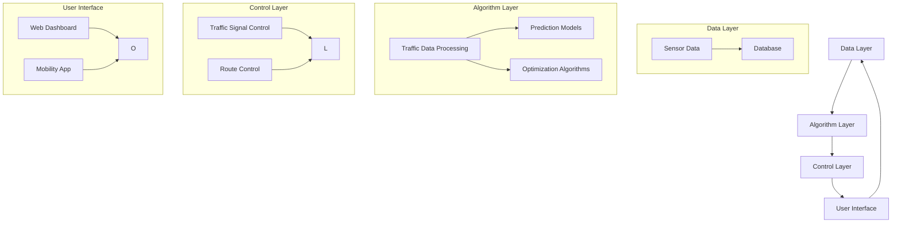
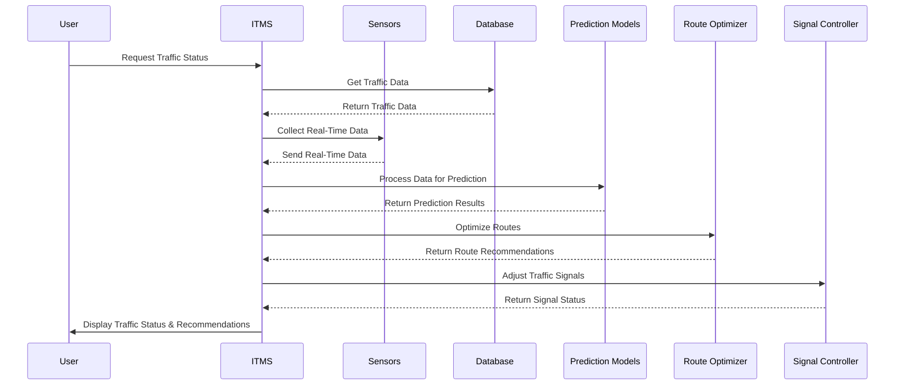

                 


### 自洽一致性理论（CoT）概述

#### 关键词

- 自洽一致性（CoT）
- AI输出一致性
- 可靠性提高
- 人工智能
- 知识表示
- 环境感知
- 目标规划
- 行动选择与执行

#### 摘要

自洽一致性理论（CoT）是近年来人工智能领域的一项重要研究方向，旨在提高人工智能系统输出的一致性和可靠性。本文将系统地介绍CoT的核心概念、基本原理、实现方法及其在人工智能中的应用，旨在为读者提供一个清晰、全面的理解，帮助其在实际项目中应用和优化CoT技术。

### 目录大纲

----------------------------------------------------------------

# 自洽一致性理论（CoT）：提高AI输出的一致性和可靠性

## 1. 引言与背景
### 1.1 引言
### 1.1.1 书籍主题介绍
### 1.1.2 AI发展与一致性需求
### 1.1.3 书籍目标读者

### 1.2 背景介绍
### 1.2.1 AI发展历程
### 1.2.2 当前AI一致性问题
### 1.2.3 自洽一致性（CoT）的概念

### 1.3 CoT的核心概念与联系
### 1.3.1 CoT的定义
### 1.3.2 CoT的关键要素
### 1.3.3 CoT与传统AI的对比

### 1.4 ER图：CoT实体关系架构

### 1.5 自洽一致性在AI中的应用
### 1.5.1 AI一致性挑战
### 1.5.2 CoT在AI中的潜在应用
### 1.5.3 当前CoT应用案例

### 1.6 本章小结

## 2. 自洽一致性理论的基本原理
### 2.1 自洽性原理
### 2.2 一致性原理
### 2.3 CoT的基本机制
### 2.4 自洽一致性与数学模型
### 2.5 CoT算法原理与流程
### 2.6 自洽一致性原理举例说明

## 3. 实现自洽一致性
### 3.1 知识表示方法
### 3.2 环境感知与建模
### 3.3 目标规划与优化
### 3.4 行动选择与执行
### 3.5 实现自洽一致性的系统架构
### 3.6 实现自洽一致性的Python代码示例

## 4. 系统分析与架构设计方案
### 4.1 问题场景介绍
### 4.2 项目介绍
### 4.3 系统功能设计（领域模型类图）
### 4.4 系统架构设计（架构图）
### 4.5 系统接口设计
### 4.6 系统交互（序列图）

## 5. 项目实战
### 5.1 环境安装
### 5.2 系统核心实现源代码
### 5.3 代码应用解读与分析
### 5.4 实际案例分析和详细讲解剖析
### 5.5 项目小结

## 6. 最佳实践 tips
## 7. 小结
## 8. 注意事项
## 9. 拓展阅读

----------------------------------------------------------------

### 1. 引言与背景

#### 1.1 引言

自20世纪中期人工智能（AI）概念被提出以来，人工智能技术经历了从理论研究到实际应用的飞速发展。从早期的规则系统、专家系统，到如今深度学习、强化学习等先进技术的广泛应用，AI在各个领域取得了显著的成果。然而，随着AI技术的不断进步，人们对于AI系统的一致性和可靠性提出了更高的要求。自洽一致性理论（CoT）正是在这一背景下应运而生。

#### 1.1.1 书籍主题介绍

本文将围绕自洽一致性理论（CoT）展开，系统地介绍CoT的核心概念、基本原理、实现方法及其在人工智能中的应用。文章旨在为读者提供一个全面、深入的理解，帮助其在实际项目中应用和优化CoT技术，从而提高AI输出的一致性和可靠性。

#### 1.1.2 AI发展与一致性需求

人工智能的发展经历了多个阶段。从早期的符号推理、知识表示，到近年来的大数据和深度学习，AI技术在各个领域取得了巨大的突破。然而，随着AI应用的广泛普及，人们开始关注到AI系统的一致性和可靠性问题。

一方面，AI系统的一致性是指系统在不同情况下能够给出一致、稳定的输出。在实际应用中，不一致的输出可能导致严重后果，如自动驾驶系统的决策错误、医疗诊断的误判等。因此，提高AI系统的一致性至关重要。

另一方面，AI系统的可靠性是指系统能够在预期的环境下稳定、准确地执行任务。随着AI技术在关键领域的应用，如金融、医疗等，可靠性成为了一个至关重要的因素。

#### 1.1.3 书籍目标读者

本文的目标读者包括：

1. 人工智能领域的科研人员，希望深入了解自洽一致性理论及其应用。
2. 人工智能工程师，希望在实际项目中应用和优化自洽一致性技术。
3. 对人工智能感兴趣的广大读者，希望对AI技术有一个深入的了解。

通过本文的学习，读者将能够：

1. 理解自洽一致性理论的基本概念和原理。
2. 掌握自洽一致性的实现方法和应用场景。
3. 在实际项目中应用自洽一致性技术，提高AI系统的输出一致性和可靠性。

#### 1.2 背景介绍

##### 1.2.1 AI发展历程

人工智能的发展可以追溯到20世纪50年代。当时，随着计算机技术的发展，科学家们开始尝试通过计算机模拟人类智能。早期的人工智能研究主要集中在规则系统、知识表示和推理算法等方面。这一阶段的代表作品有艾兹格·威尔的《计算机与智慧》和约翰·麦卡锡的“逻辑理论家”程序。

随着计算机性能的提升和大数据的积累，人工智能进入了第二个阶段，即机器学习和深度学习阶段。在这一阶段，人工智能技术开始从基于规则的系统转向基于数据的学习方法。1986年，霍普菲尔德和皮斯卡尔罗托提出了反向传播算法，标志着深度学习的诞生。近年来，深度学习技术在图像识别、语音识别、自然语言处理等领域取得了显著的成果。

##### 1.2.2 当前AI一致性问题

尽管人工智能技术在各个领域取得了显著成果，但一致性问题是当前AI系统面临的一个重要挑战。

1. 决策不一致：AI系统在不同情况下可能给出不一致的决策。例如，自动驾驶汽车在不同交通环境下的驾驶行为可能不一致。

2. 输出不稳定：AI系统可能在相同输入下给出不一致的输出。例如，深度学习模型在训练过程中可能产生过拟合现象，导致输出不稳定。

3. 偏差与错误：AI系统可能存在系统性偏差，导致输出存在偏差。例如，在某些图像识别任务中，模型可能对某些特定类别的物体识别率较低。

##### 1.2.3 自洽一致性（CoT）的概念

自洽一致性理论（CoT）旨在解决AI系统的一致性问题。CoT的核心思想是通过构建一个自洽的知识体系，使AI系统能够在复杂多变的环境中保持一致、可靠的输出。

1. 自洽性：自洽性是指一个系统在不同情况下能够给出一致、稳定的输出。自洽一致性理论强调在AI系统中引入自洽性原则，以减少决策和行为的不一致。

2. 知识表示：知识表示是指将人类知识转换为计算机可处理的形式。自洽一致性理论中的知识表示方法包括符号表示、概率表示和图表示等。

3. 环境感知：环境感知是指AI系统对所处环境的感知和理解。自洽一致性理论强调在AI系统中引入环境感知机制，以动态调整知识表示和行为。

4. 目标规划：目标规划是指AI系统在执行任务时制定的目标和策略。自洽一致性理论中的目标规划方法包括目标优化、目标规划和目标评估等。

5. 行动选择与执行：行动选择与执行是指AI系统在执行任务时选择合适的行动并执行。自洽一致性理论中的行动选择与执行方法包括行为规划、动作选择和动作执行等。

##### 1.3 CoT的核心概念与联系

1. CoT的定义：自洽一致性理论是一种通过构建自洽的知识体系、环境感知机制、目标规划方法和行动选择与执行策略，以提高AI系统输出一致性和可靠性的方法。

2. CoT的关键要素：自洽性、知识表示、环境感知、目标规划和行动选择与执行是CoT的核心要素。

3. CoT与传统AI的对比：传统AI方法主要依赖于预设的规则或模型进行决策，而CoT通过自洽的知识体系、环境感知和目标规划，使AI系统能够在复杂多变的环境中保持一致、可靠的输出。

4. ER图：CoT实体关系架构



1. 自洽一致性在AI中的应用：自洽一致性理论在自动驾驶、智能客服、智能医疗等领域具有广泛的应用前景。通过引入自洽性原则，这些领域中的AI系统可以在复杂多变的环境中保持一致、可靠的输出。

##### 1.5 自洽一致性在AI中的应用

1. AI一致性挑战：在自动驾驶、智能客服、智能医疗等领域，AI系统的一致性是一个关键挑战。不一致的输出可能导致严重后果，如交通事故、用户满意度下降、误诊等。

2. CoT在AI中的潜在应用：自洽一致性理论可以在自动驾驶、智能客服、智能医疗等领域发挥重要作用。通过构建自洽的知识体系、环境感知机制、目标规划方法和行动选择与执行策略，CoT可以提高AI系统的一致性和可靠性。

3. 当前CoT应用案例：目前，自洽一致性理论已经在一些实际项目中得到了应用。例如，在某些自动驾驶项目中，通过引入自洽一致性理论，实现了驾驶行为的一致性和可靠性。在智能客服系统中，通过自洽一致性理论，提高了客服机器人对用户问题的准确理解和回答。

##### 1.6 本章小结

本章介绍了自洽一致性理论（CoT）的背景、核心概念和原理。通过分析AI发展中的一致性问题，我们了解到自洽一致性理论在提高AI系统输出一致性和可靠性方面具有重要意义。在接下来的章节中，我们将进一步探讨自洽一致性理论的基本原理、实现方法和应用场景，帮助读者深入理解并掌握这一重要的AI技术。

---

### 第1章: 引言与背景

#### 1.1 引言

自洽一致性理论（CoT）是近年来人工智能（AI）领域的一项重要研究方向，旨在解决AI系统输出一致性和可靠性问题。在AI技术飞速发展的今天，如何确保AI系统能够在不同情况下给出一致、可靠的输出，已成为一个亟待解决的挑战。自洽一致性理论通过构建自洽的知识体系、环境感知机制、目标规划方法和行动选择与执行策略，为解决这一问题提供了有效途径。

本章将系统地介绍自洽一致性理论，首先回顾AI发展历程，探讨当前AI一致性问题，然后介绍自洽一致性（CoT）的概念和核心原理。通过本章的学习，读者将初步了解自洽一致性理论的基本概念和重要性，为后续章节的深入探讨打下基础。

#### 1.1.1 书籍主题介绍

本书的主题是自洽一致性理论（CoT），主要内容包括：

1. 自洽一致性理论的基本原理：介绍自洽一致性理论的定义、核心概念、关键要素及其在AI中的应用。
2. 自洽一致性的实现方法：探讨知识表示、环境感知、目标规划、行动选择与执行等实现自洽一致性的方法。
3. 自洽一致性理论的应用场景：分析自洽一致性理论在自动驾驶、智能客服、智能医疗等领域的应用实例。
4. 自洽一致性理论的系统分析与架构设计：介绍自洽一致性理论在系统分析和架构设计中的应用，包括系统功能设计、架构设计、接口设计等。
5. 自洽一致性理论的项目实战：通过实际案例分析和项目实战，展示自洽一致性理论在实际应用中的效果和挑战。

本书旨在为读者提供一个全面、深入的理解自洽一致性理论，帮助其在实际项目中应用和优化这一技术，从而提高AI系统的一致性和可靠性。

#### 1.1.2 AI发展与一致性需求

人工智能的发展可以分为几个阶段，每个阶段都对一致性提出了新的挑战和需求。

1. **早期AI研究（1950-1969）**：在这一阶段，AI研究主要集中在符号推理和知识表示上。专家系统是一种典型的代表。专家系统通过预设的规则和知识库进行推理，但由于规则库的复杂性和不确定性，导致系统在不同情况下可能给出不一致的输出。

2. **机器学习兴起（1970-1980）**：随着计算能力的提升，机器学习开始崭露头角。机器学习通过从数据中学习规律，提高了AI系统的预测能力。然而，这一阶段的方法主要依赖于统计模型，仍存在一致性问题。例如，神经网络模型在不同训练数据集上的表现可能不一致。

3. **深度学习时代（2010至今）**：深度学习成为AI领域的核心，通过多层神经网络模拟人脑的思维方式。深度学习在图像识别、语音识别、自然语言处理等领域取得了显著成果。然而，深度学习模型也存在一致性问题，如过拟合、泛化能力不足等。

随着AI技术的不断进步，一致性需求变得越来越迫切。一致性不仅关系到AI系统的性能和可靠性，还直接影响到其在实际应用中的安全性和社会影响。例如，在自动驾驶领域，不一致的决策可能导致交通事故；在医疗领域，不一致的诊断可能导致误诊。

#### 1.1.3 书籍目标读者

本书的目标读者包括以下几类：

1. **人工智能领域的科研人员**：希望深入了解自洽一致性理论的研究背景、基本原理、实现方法及其在AI中的应用。
2. **人工智能工程师**：在实际项目中需要应用和优化自洽一致性技术的工程师，希望通过本书学习如何将CoT理论应用到实际工作中。
3. **对人工智能感兴趣的广大读者**：对AI技术有浓厚兴趣，希望对AI系统的原理、技术及应用有一个深入理解。

通过阅读本书，读者将能够：

1. **掌握自洽一致性理论的基本概念和原理**：了解自洽性、知识表示、环境感知、目标规划和行动选择与执行等核心概念。
2. **了解自洽一致性的实现方法**：学习如何通过知识表示、环境感知、目标规划、行动选择与执行等方法实现自洽一致性。
3. **掌握自洽一致性理论的应用场景**：了解自洽一致性理论在自动驾驶、智能客服、智能医疗等领域的应用实例。
4. **提升实际项目中的AI系统一致性**：通过学习自洽一致性理论，能够在实际项目中提高AI系统的一致性和可靠性。

#### 1.2 背景介绍

##### 1.2.1 AI发展历程

人工智能的发展历程可以分为以下几个阶段：

1. **早期AI研究（1950-1969）**：在这一阶段，AI研究主要集中在符号推理和知识表示上。符号推理是通过逻辑规则和推理算法模拟人类的推理过程。知识表示则是通过符号和语义表示人类知识，以便计算机能够理解和应用这些知识。然而，由于规则库的复杂性和不确定性，专家系统在处理复杂问题时往往表现出不一致的输出。

2. **机器学习兴起（1970-1980）**：随着计算能力的提升，机器学习开始崭露头角。机器学习通过从数据中学习规律，提高了AI系统的预测能力。这一阶段的方法主要依赖于统计模型，如线性回归、决策树、支持向量机等。虽然这些方法在一定程度上提高了AI系统的性能，但它们仍然存在一致性问题，特别是在数据集变化或模型复杂度增加时。

3. **深度学习时代（2010至今）**：深度学习成为AI领域的核心。深度学习通过多层神经网络模拟人脑的思维方式，在图像识别、语音识别、自然语言处理等领域取得了显著成果。深度学习模型通过大量数据训练，能够在一定程度上解决一致性问题的挑战。然而，深度学习模型也存在一些一致性问题，如过拟合、泛化能力不足等。

##### 1.2.2 当前AI一致性问题

尽管AI技术取得了显著进步，但一致性问题仍然是一个重要的挑战。以下是一些常见的AI一致性问题：

1. **决策不一致**：在自动驾驶、智能客服、医疗诊断等领域，AI系统需要在各种情况下做出决策。然而，由于输入数据的多样性和不确定性，AI系统可能在不同情况下给出不一致的决策。例如，自动驾驶系统在不同交通环境下的行驶策略可能不一致。

2. **输出不稳定**：在某些情况下，AI系统可能在相同输入下给出不一致的输出。例如，深度学习模型在训练过程中可能产生过拟合现象，导致模型在不同数据集上的表现不一致。

3. **偏差与错误**：AI系统可能存在系统性偏差，导致输出存在偏差。例如，在某些图像识别任务中，模型可能对某些特定类别的物体识别率较低。

4. **模型更新不一致**：随着新数据的不断出现，AI模型需要不断更新。然而，模型更新可能导致一致性问题的出现，如新数据与旧数据之间的不一致性。

##### 1.2.3 自洽一致性（CoT）的概念

自洽一致性理论（CoT）是一种通过构建自洽的知识体系、环境感知机制、目标规划方法和行动选择与执行策略，以提高AI系统输出一致性和可靠性的方法。CoT的核心思想是确保AI系统在不同情况下能够给出一致、可靠的输出。

1. **自洽性**：自洽性是指AI系统能够在不同情况下保持一致、稳定的输出。自洽一致性理论通过引入自洽性原则，使AI系统能够在复杂多变的环境中保持一致。

2. **知识表示**：知识表示是将人类知识转换为计算机可处理的形式。自洽一致性理论中的知识表示方法包括符号表示、概率表示和图表示等。

3. **环境感知**：环境感知是指AI系统对所处环境的感知和理解。自洽一致性理论强调在AI系统中引入环境感知机制，以动态调整知识表示和行为。

4. **目标规划**：目标规划是指AI系统在执行任务时制定的目标和策略。自洽一致性理论中的目标规划方法包括目标优化、目标规划和目标评估等。

5. **行动选择与执行**：行动选择与执行是指AI系统在执行任务时选择合适的行动并执行。自洽一致性理论中的行动选择与执行方法包括行为规划、动作选择和动作执行等。

##### 1.3 CoT的核心概念与联系

自洽一致性理论（CoT）的核心概念包括自洽性、知识表示、环境感知、目标规划和行动选择与执行。这些概念相互联系，共同构成一个完整的理论框架。

1. **自洽性**：自洽性是CoT的核心概念之一。自洽性是指AI系统能够在不同情况下保持一致、稳定的输出。自洽性原则要求AI系统能够对环境变化和输入数据的多样性做出一致的反应。

2. **知识表示**：知识表示是将人类知识转换为计算机可处理的形式。在CoT中，知识表示方法包括符号表示、概率表示和图表示等。知识表示的目的是确保AI系统在处理问题时能够利用已有的知识和经验。

3. **环境感知**：环境感知是指AI系统对所处环境的感知和理解。环境感知机制使AI系统能够动态调整知识表示和行为，以适应复杂多变的环境。

4. **目标规划**：目标规划是指AI系统在执行任务时制定的目标和策略。目标规划包括目标优化、目标规划和目标评估等。目标规划的方法有助于AI系统在执行任务时保持一致性和可靠性。

5. **行动选择与执行**：行动选择与执行是指AI系统在执行任务时选择合适的行动并执行。行动选择与执行方法包括行为规划、动作选择和动作执行等。这些方法确保AI系统在执行任务时能够保持一致的行为。

#### 1.4 ER图：CoT实体关系架构

以下是一个ER图，展示了自洽一致性理论（CoT）中的实体关系架构：


- **Agent（代理）**：代表AI系统中的决策主体，负责执行任务和生成输出。
- **Knowledge（知识）**：代表AI系统的知识库，包括符号表示、概率表示和图表示等。
- **Environment（环境）**：代表AI系统所处的环境，包括外部输入和反馈。
- **Action（行动）**：代表AI系统执行的任务或行为。
- **Goal（目标）**：代表AI系统在执行任务时需要达到的目标。
- **Context（上下文）**：代表AI系统在执行任务时所处的上下文信息。

#### 1.5 自洽一致性在AI中的应用

自洽一致性理论（CoT）在AI领域具有广泛的应用前景。以下是一些典型的应用场景：

1. **自动驾驶**：在自动驾驶领域，自洽一致性理论可以通过构建自洽的知识体系、环境感知机制和目标规划方法，确保自动驾驶系统在不同交通环境下的行为一致性。例如，自动驾驶车辆在应对不同交通状况时，需要根据环境变化调整驾驶策略，保持一致、安全的行驶行为。

2. **智能客服**：在智能客服领域，自洽一致性理论可以提高客服机器人对用户问题的准确理解和回答。通过引入自洽的知识表示、环境感知机制和目标规划方法，客服机器人可以更好地理解用户的意图和需求，提供一致、高效的客服服务。

3. **智能医疗**：在智能医疗领域，自洽一致性理论可以用于提高诊断和治疗的准确性。通过引入自洽的知识表示、环境感知机制和目标规划方法，智能医疗系统可以在复杂多变的环境中提供一致、可靠的诊断和治疗建议。

4. **金融风控**：在金融风控领域，自洽一致性理论可以用于提高风险管理的一致性和可靠性。通过引入自洽的知识表示、环境感知机制和目标规划方法，金融风控系统可以更好地识别风险、预测市场变化，提供一致、有效的风险控制策略。

5. **工业自动化**：在工业自动化领域，自洽一致性理论可以用于提高自动化系统的稳定性和可靠性。通过引入自洽的知识表示、环境感知机制和目标规划方法，自动化系统可以在复杂的生产环境中保持一致、高效的操作。

#### 1.5.1 AI一致性挑战

尽管自洽一致性理论在AI领域具有广泛的应用前景，但在实际应用中仍然面临一些挑战：

1. **环境多样性**：AI系统需要处理的环境是复杂多变的。不同环境下的输入数据、外部因素和反馈信息都可能影响AI系统的输出。确保AI系统在不同环境下的一致性是一个重要的挑战。

2. **数据质量**：AI系统的一致性依赖于高质量的数据。然而，实际应用中往往存在数据缺失、噪声和偏差等问题，这会影响AI系统的一致性。如何处理和清洗数据，以提高AI系统的一致性，是一个亟待解决的问题。

3. **计算资源**：自洽一致性理论需要大量的计算资源来处理复杂的知识表示、环境感知和目标规划等任务。如何高效地利用计算资源，确保AI系统的一致性和可靠性，是一个重要的挑战。

4. **模型解释性**：自洽一致性理论中的知识表示和决策过程往往具有一定的黑盒性质，难以解释。如何提高模型的可解释性，使AI系统能够提供清晰的决策过程和解释，是一个重要的挑战。

#### 1.5.2 CoT在AI中的潜在应用

自洽一致性理论（CoT）在AI领域具有巨大的应用潜力。以下是一些潜在的CoT应用：

1. **智能决策支持系统**：自洽一致性理论可以用于构建智能决策支持系统，为企业和组织提供一致的决策支持。例如，在金融投资领域，CoT可以帮助投资者根据实时市场数据和环境信息做出一致、可靠的决策。

2. **智能供应链管理**：自洽一致性理论可以用于优化供应链管理，提高供应链的稳定性和可靠性。通过引入CoT，企业可以更好地应对供应链中的各种不确定性，提供一致、高效的供应链解决方案。

3. **智能教育**：自洽一致性理论可以用于构建智能教育系统，为学生提供一致、个性化的学习支持。通过引入CoT，教育系统可以更好地理解学生的学习需求和进度，提供一致、有效的学习资源和支持。

4. **智能城市管理**：自洽一致性理论可以用于构建智能城市管理系统，提高城市管理的效率和质量。通过引入CoT，城市管理系统能够更好地应对城市中的各种挑战，提供一致、可靠的城市服务和管理策略。

5. **智能农业**：自洽一致性理论可以用于构建智能农业系统，提高农业生产的效率和可持续性。通过引入CoT，农业系统能够更好地应对气候变化、土壤污染等挑战，提供一致、高效的农业生产方案。

#### 1.5.3 当前CoT应用案例

自洽一致性理论（CoT）已经在一些实际项目中得到了应用，并取得了一定的成效。以下是一些典型的CoT应用案例：

1. **自动驾驶**：在自动驾驶领域，自洽一致性理论被用于提高自动驾驶系统的稳定性和可靠性。通过引入CoT，自动驾驶系统能够在不同交通环境下保持一致、安全的行驶行为。例如，Waymo（谷歌自动驾驶部门）在其自动驾驶系统中采用了自洽一致性理论，提高了系统的决策一致性和安全性。

2. **智能客服**：在智能客服领域，自洽一致性理论被用于提高客服机器人的服务质量。通过引入CoT，客服机器人能够更好地理解用户的意图和需求，提供一致、准确的回答。例如，微软的Azure机器人服务采用了自洽一致性理论，提高了客服机器人的用户满意度和服务质量。

3. **智能医疗**：在智能医疗领域，自洽一致性理论被用于提高诊断和治疗的准确性。通过引入CoT，智能医疗系统能够在不同病例和数据下保持一致、可靠的诊断和治疗建议。例如，IBM的Watson Health系统采用了自洽一致性理论，提高了医学诊断的准确性和效率。

4. **金融风控**：在金融风控领域，自洽一致性理论被用于提高风险管理的稳定性和可靠性。通过引入CoT，金融风控系统能够更好地识别风险、预测市场变化，提供一致、有效的风险控制策略。例如，摩根大通的智能风控系统采用了自洽一致性理论，提高了金融风险管理的效率和准确性。

5. **工业自动化**：在工业自动化领域，自洽一致性理论被用于提高自动化系统的稳定性和可靠性。通过引入CoT，自动化系统能够在复杂的生产环境中保持一致、高效的操作。例如，西门子的智能工厂采用了自洽一致性理论，提高了生产效率和产品质量。

#### 1.6 本章小结

本章介绍了自洽一致性理论（CoT）的背景、核心概念和原理。通过回顾AI发展历程，我们了解到一致性需求在AI技术不断进步中的重要性。自洽一致性理论通过构建自洽的知识体系、环境感知机制、目标规划方法和行动选择与执行策略，为解决AI系统输出一致性和可靠性问题提供了有效途径。在接下来的章节中，我们将进一步探讨自洽一致性理论的基本原理、实现方法和应用场景，帮助读者深入理解并掌握这一重要的AI技术。

---

### 第2章：自洽一致性理论的基本原理

本章将详细探讨自洽一致性理论（CoT）的基本原理，包括自洽性原理、一致性原理、知识表示、环境感知、目标规划、行动选择与执行等关键要素。通过这些基本原理的讲解，我们将帮助读者理解自洽一致性理论的核心概念，为后续章节的深入探讨打下基础。

#### 2.1 自洽性原理

自洽性原理是指一个系统在不同情况下能够保持一致、稳定的输出。在自洽一致性理论中，自洽性是一个核心概念，它要求AI系统能够在复杂多变的环境中保持一致的行为和决策。

1. **自洽性的定义**：自洽性是指一个系统能够在不同情况下保持一致、稳定的输出。这意味着，无论系统面对的是何种输入和外部环境，系统都应该能够给出一致、可靠的输出。

2. **自洽性的重要性**：自洽性对于AI系统至关重要。不一致的输出可能导致严重后果，如自动驾驶汽车的行驶错误、智能客服机器人的回答不准确、医疗诊断的误判等。因此，自洽性是确保AI系统可靠性和安全性的关键。

3. **自洽性原理与AI**：在AI系统中，自洽性原理体现在多个方面。首先，知识表示需要自洽，以确保系统能够准确理解和应用已有知识。其次，环境感知和目标规划也需要自洽，以确保系统能够根据当前环境和目标做出一致、合理的决策。最后，行动选择与执行也需要自洽，以确保系统在不同情境下能够执行一致、有效的行为。

#### 2.2 一致性原理

一致性原理是指AI系统在不同情况下能够给出一致、稳定的输出。一致性原理与自洽性原理密切相关，但略有不同。一致性原理强调系统在相同输入下应保持稳定的输出，而自洽性原理则关注系统在不同输入和环境下的一致性。

1. **一致性的定义**：一致性是指AI系统能够在相同输入下保持稳定的输出。这意味着，无论系统面对的是何种输入，系统都应该能够给出一致、可靠的输出。

2. **一致性的重要性**：一致性对于AI系统的可靠性至关重要。不一致的输出可能导致系统失效，如自动驾驶汽车的行驶错误、医疗诊断的误判等。因此，一致性是确保AI系统可靠性和稳定性的关键。

3. **一致性原理与AI**：在AI系统中，一致性原理体现在多个方面。首先，知识表示需要一致性，以确保系统能够准确理解和应用已有知识。其次，环境感知和目标规划也需要一致性，以确保系统能够根据当前环境和目标做出一致、合理的决策。最后，行动选择与执行也需要一致性，以确保系统在不同情境下能够执行一致、有效的行为。

#### 2.3 CoT的基本机制

自洽一致性理论（CoT）的基本机制包括知识表示、环境感知、目标规划、行动选择与执行等关键要素。这些要素相互关联，共同构成了一个完整的自洽一致性机制。

1. **知识表示**：知识表示是将人类知识转换为计算机可处理的形式。在CoT中，知识表示方法包括符号表示、概率表示和图表示等。符号表示主要用于逻辑推理和规则系统，概率表示主要用于概率模型和统计学习，图表示主要用于知识图谱和图神经网络。

2. **环境感知**：环境感知是指AI系统对所处环境的感知和理解。环境感知机制使AI系统能够动态调整知识表示和行为，以适应复杂多变的环境。环境感知可以通过传感器、摄像头、GPS等多种方式实现。

3. **目标规划**：目标规划是指AI系统在执行任务时制定的目标和策略。目标规划包括目标优化、目标规划和目标评估等。目标优化旨在找到最优目标，目标规划旨在制定实现目标的策略，目标评估旨在评估目标的实现程度。

4. **行动选择与执行**：行动选择与执行是指AI系统在执行任务时选择合适的行动并执行。行动选择与执行包括行为规划、动作选择和动作执行等。行为规划旨在制定执行任务的行为计划，动作选择旨在选择执行行为的动作，动作执行旨在执行选定的动作。

#### 2.4 自洽一致性与数学模型

自洽一致性理论（CoT）可以通过数学模型进行描述。以下是一个简化的数学模型，用于描述CoT的基本机制：

$$
\text{Model} = f(\text{Knowledge}, \text{Goal}, \text{Environment})
$$

其中，Model表示AI系统的输出，Knowledge表示知识表示，Goal表示目标规划，Environment表示环境感知。

1. **数学模型的基本概念**：该数学模型是一个函数，输入包括知识表示、目标和环境，输出是AI系统的输出。函数f表示AI系统根据输入进行决策和行动的过程。

2. **CoT的数学模型**：在该数学模型中，知识表示、目标和环境感知是核心输入。知识表示包括符号表示、概率表示和图表示等，目标是AI系统需要实现的目标，环境感知是AI系统对当前环境的感知和理解。

3. **数学公式与推导**：具体的数学公式和推导可以根据具体的应用场景进行调整。例如，对于自动驾驶系统，可以定义目标为行驶到目的地，环境感知包括道路信息、交通状况等。数学模型可以描述为：

$$
\text{Model} = f(\text{Knowledge}, \text{Goal}, \text{Environment}) = f(\text{Map}, \text{Destination}, \text{Traffic})
$$

其中，Map表示知识表示（地图信息），Destination表示目标规划（目的地），Traffic表示环境感知（交通状况）。

#### 2.5 CoT算法原理与流程

自洽一致性理论（CoT）可以通过一系列算法实现。以下是一个简化的CoT算法原理与流程：

1. **算法基本概念**：CoT算法是一个循环过程，包括初始化、知识表示、环境感知、目标规划、行动选择与执行、反馈调整等步骤。

2. **算法框架**：



3. **算法流程图**：以下是一个简化的CoT算法流程图：


- **初始化**：初始化知识表示、目标和环境。
- **知识表示**：根据已有知识构建知识表示。
- **环境感知**：感知当前环境，包括输入数据、传感器信息等。
- **目标规划**：根据当前环境和目标，规划目标实现策略。
- **行动选择**：根据目标规划和环境感知，选择合适的行动。
- **行动执行**：执行选定的行动。
- **反馈调整**：根据行动执行结果，调整知识表示、目标和环境感知。

#### 2.6 自洽一致性原理举例说明

以下通过两个具体案例来说明自洽一致性原理：

1. **案例一：自动驾驶**：

自动驾驶系统需要在不同交通环境下保持一致、安全的行驶行为。自洽一致性原理可以通过以下步骤实现：

- **知识表示**：构建包含道路信息、交通规则和驾驶经验的符号表示。
- **环境感知**：通过摄像头、雷达等传感器实时感知交通环境。
- **目标规划**：规划安全到达目的地的行驶策略。
- **行动选择与执行**：根据目标规划和环境感知，选择合适的驾驶动作，如加速、减速、变道等。
- **反馈调整**：根据行驶结果，调整知识表示、目标和环境感知，以适应不同的交通环境。

2. **案例二：智能客服**：

智能客服系统需要在不同用户问题和需求下提供一致、准确的回答。自洽一致性原理可以通过以下步骤实现：

- **知识表示**：构建包含常见问题和答案的符号表示。
- **环境感知**：通过自然语言处理技术理解用户的问题和需求。
- **目标规划**：规划解决问题的策略。
- **行动选择与执行**：根据目标规划和环境感知，选择合适的回答。
- **反馈调整**：根据用户反馈，调整知识表示、目标和环境感知，以提高客服质量。

#### 2.7 本章小结

本章介绍了自洽一致性理论（CoT）的基本原理，包括自洽性原理、一致性原理、知识表示、环境感知、目标规划、行动选择与执行等关键要素。通过这些基本原理的讲解，读者可以初步了解自洽一致性理论的核心概念。在下一章中，我们将进一步探讨如何实现自洽一致性理论，包括知识表示、环境感知、目标规划、行动选择与执行等方面的具体方法和技术。

---

### 2.5 CoT算法原理与流程

#### 2.5.1 算法基本概念

自洽一致性理论（CoT）的核心在于确保AI系统能够在复杂、动态的环境中进行一致和可靠的决策。为了实现这一目标，CoT依赖一套详细的算法原理和流程，这些流程不仅需要处理知识表示、环境感知和目标规划，还需要涉及行动选择与执行，以及不断调整和优化的反馈机制。以下是CoT算法的基本概念：

1. **初始化**：在算法开始之前，需要对知识表示、目标和环境进行初始化。初始化过程包括加载现有的知识库、设置初始目标，以及配置环境感知模块。

2. **知识表示**：知识表示是算法的基础，它将人类知识转化为计算机可以处理的形式。在CoT中，知识表示可以是符号的、概率的或图论的。符号表示适用于规则明确的情况，概率表示适用于不确定性较高的场景，而图表示则可以处理复杂的关系网络。

3. **环境感知**：环境感知是指AI系统对当前环境的感知和理解。环境感知模块通过传感器、摄像头、GPS等手段获取环境信息，并将这些信息转换为对环境的准确感知。

4. **目标规划**：目标规划是算法的核心环节，它基于当前环境和初始目标，制定实现目标的策略。目标规划需要考虑资源的可用性、环境的不确定性和目标的优先级。

5. **行动选择与执行**：在目标规划完成后，算法需要选择并执行具体的行动。行动选择是基于目标规划和环境感知的结果，执行则是将选定的行动转化为实际的操作。

6. **反馈调整**：行动执行后，系统会根据执行结果进行反馈调整。反馈调整包括对知识表示的更新、目标的重新评估和环境的重新感知。

#### 2.5.2 CoT算法框架

CoT算法框架可以看作是一个循环过程，每个循环迭代包括初始化、知识表示、环境感知、目标规划、行动选择与执行，以及反馈调整。以下是CoT算法的基本框架：


- **初始化**：设置初始状态，包括知识库、目标和环境参数。
- **知识表示**：将人类知识转化为计算机可处理的形式。
- **环境感知**：获取当前环境信息，更新环境感知模型。
- **目标规划**：根据当前环境和目标，制定实现目标的策略。
- **行动选择**：从多个可行的行动中选择最优的行动。
- **行动执行**：执行选定的行动，并更新系统的状态。
- **反馈调整**：根据行动结果，调整知识表示、目标和环境感知。

#### 2.5.3 算法流程图

以下是一个简化的CoT算法流程图，展示了从初始化到反馈调整的完整过程：



- **初始化**：设置初始状态。
- **知识表示**：构建知识表示模型。
- **环境感知**：获取环境信息。
- **目标规划**：制定目标实现策略。
- **行动选择**：选择最优行动。
- **行动执行**：执行选定行动。
- **反馈调整**：根据行动结果更新系统参数。
- **更新知识库**：调整知识表示。
- **更新目标**：调整目标规划。
- **更新环境模型**：调整环境感知模型。
- **重置系统状态**：为下一次迭代准备初始状态。

#### 2.6 自洽一致性原理举例说明

为了更好地理解自洽一致性原理，我们可以通过两个具体的案例来展示其应用。

**案例一：自动驾驶**

自动驾驶系统需要在不同交通环境中保持一致、安全的行驶行为。自洽一致性原理可以通过以下步骤实现：

1. **知识表示**：构建包含道路信息、交通规则和驾驶经验的符号表示。知识库中可能包括各种交通信号、道路标志、其他车辆的行为等信息。

2. **环境感知**：通过摄像头、雷达等传感器实时感知交通环境。环境感知模块需要能够识别行人、车辆、交通信号等，并理解这些对象的行为。

3. **目标规划**：规划安全到达目的地的行驶策略。目标规划需要考虑交通规则、道路条件、车辆状态等因素，制定最优行驶路径。

4. **行动选择与执行**：根据目标规划和环境感知，选择合适的驾驶动作，如加速、减速、变道等。行动选择需要基于实时环境感知和预测。

5. **反馈调整**：根据行驶结果，调整知识表示、目标和环境感知，以适应不同的交通环境。例如，如果系统检测到前方有行人，需要调整驾驶策略以避免碰撞。

**案例二：智能客服**

智能客服系统需要在不同用户问题和需求下提供一致、准确的回答。自洽一致性原理可以通过以下步骤实现：

1. **知识表示**：构建包含常见问题和答案的符号表示。知识库中可能包括各种常见问题的回答、用户行为模式等。

2. **环境感知**：通过自然语言处理技术理解用户的问题和需求。环境感知模块需要能够识别用户的意图，并理解问题的背景。

3. **目标规划**：规划解决问题的策略。目标规划需要考虑用户的意图、问题的复杂度、客服资源等因素。

4. **行动选择与执行**：根据目标规划和环境感知，选择合适的回答。行动选择需要基于用户意图和问题复杂度。

5. **反馈调整**：根据用户反馈，调整知识表示、目标和环境感知，以提高客服质量。例如，如果用户对回答不满意，需要调整知识库中的答案，或优化目标规划策略。

#### 2.7 本章小结

本章详细介绍了自洽一致性理论（CoT）的算法原理与流程，包括初始化、知识表示、环境感知、目标规划、行动选择与执行，以及反馈调整。通过算法框架和流程图的展示，读者可以清晰地理解CoT的核心概念和实现方法。在接下来的章节中，我们将进一步探讨CoT的具体实现技术，包括知识表示、环境感知、目标规划和行动选择与执行的方法和策略。

---

### 2.6 自洽一致性原理举例说明

为了更好地理解自洽一致性原理，我们将通过两个具体案例进行详细说明。

#### 2.6.1 案例一：自动驾驶

自动驾驶系统是自洽一致性理论（CoT）的重要应用场景之一。在这个案例中，我们以一辆自动驾驶汽车为例，展示自洽一致性原理在自动驾驶系统中的应用。

1. **知识表示**：自动驾驶系统需要具有丰富的知识表示，包括道路信息、交通规则、驾驶经验和路况预测等。这些知识可以通过传感器、地图数据和历史数据等来源进行获取和表示。例如，系统可以使用符号表示来描述交通信号灯的状态、道路标志的含义，以及行人、车辆的行为模式。

2. **环境感知**：自动驾驶系统通过摄像头、激光雷达、GPS和其他传感器来实时感知周围环境。环境感知模块需要对道路、车辆、行人和其他动态对象进行精确的定位和识别。例如，系统可以使用计算机视觉技术来检测行人、车辆和交通信号灯，并使用GPS来获取当前位置和速度。

3. **目标规划**：自动驾驶系统的目标通常是安全、高效地到达目的地。目标规划模块需要根据当前环境和道路状况，制定最优的行驶策略。例如，系统可以在交通拥堵时选择减速或变道，以避免与前车发生碰撞。

4. **行动选择与执行**：在目标规划完成后，系统需要选择并执行具体的驾驶动作。行动选择模块会基于目标规划和环境感知，选择合适的驾驶动作，如加速、减速、转弯或刹车。执行模块则会将这些动作转化为实际的驾驶行为。

5. **反馈调整**：自动驾驶系统需要不断接收来自传感器和环境的信息，并对系统参数进行实时调整。例如，如果系统检测到前方有行人，它会立即调整行驶速度，以避免碰撞。

**例子**：假设自动驾驶系统在路口遇到红灯。以下是自洽一致性原理的应用：

- **知识表示**：系统识别出交通信号灯为红灯，并理解交通规则。
- **环境感知**：系统感知到前方是红灯，同时检测到路口附近有行人。
- **目标规划**：系统规划的安全行驶策略是停车等待。
- **行动选择与执行**：系统选择减速并停在停车线后。
- **反馈调整**：系统在红灯变绿灯后，重新开始行驶。

#### 2.6.2 案例二：智能客服

智能客服系统是另一个典型的应用自洽一致性理论的场景。在这个案例中，我们以一个在线客服系统为例，展示自洽一致性原理在智能客服系统中的应用。

1. **知识表示**：智能客服系统需要具有丰富的知识表示，包括常见问题的答案、业务流程和用户行为模式等。这些知识可以来自用户历史记录、产品文档和FAQ等来源。例如，系统可以使用符号表示来描述常见问题及其答案，以及业务流程中的步骤和决策点。

2. **环境感知**：智能客服系统通过自然语言处理（NLP）技术理解用户的提问和意图。环境感知模块需要对用户的语言、情感和需求进行解析。例如，系统可以使用情感分析技术来识别用户情绪，并使用关键词提取技术来理解用户意图。

3. **目标规划**：智能客服系统的目标通常是提供准确、及时的回答和帮助。目标规划模块需要根据用户意图和环境，制定解决问题的策略。例如，系统可以在用户咨询产品价格时，自动跳转到价格查询模块。

4. **行动选择与执行**：在目标规划完成后，系统需要选择并执行具体的回答动作。行动选择模块会基于目标规划和环境感知，选择合适的回答和操作。执行模块则会将选定的回答发送给用户，或执行相关的操作。

5. **反馈调整**：智能客服系统需要不断接收用户的反馈，并对系统参数进行实时调整。例如，如果用户对回答不满意，系统会记录反馈，并尝试提供更准确的回答。

**例子**：假设用户咨询产品价格，以下是自洽一致性原理的应用：

- **知识表示**：系统识别出用户的问题是关于产品价格。
- **环境感知**：系统理解用户意图是获取产品价格，并检测到用户情绪较为平静。
- **目标规划**：系统规划的目标是提供准确的产品价格。
- **行动选择与执行**：系统选择发送产品价格信息给用户。
- **反馈调整**：系统记录用户的反馈，并根据反馈调整知识库和回答策略。

#### 2.6.3 案例三：智能医疗诊断

智能医疗诊断系统是自洽一致性理论在医疗领域的应用。在这个案例中，我们以一个智能诊断系统为例，展示自洽一致性原理在智能医疗诊断中的应用。

1. **知识表示**：智能医疗诊断系统需要具有丰富的医学知识表示，包括疾病症状、诊断标准、治疗方法等。这些知识可以来自医学文献、专家经验、电子健康记录等来源。例如，系统可以使用符号表示来描述不同疾病的症状和诊断标准。

2. **环境感知**：智能医疗诊断系统通过电子健康记录和传感器数据来感知病人的健康状况。环境感知模块需要对病人的症状、体征和其他医疗信息进行解析。例如，系统可以使用机器学习技术来分析电子健康记录，识别病人的潜在疾病。

3. **目标规划**：智能医疗诊断系统的目标通常是提供准确的诊断结果。目标规划模块需要根据病人的症状和体征，制定诊断策略。例如，系统可以在检测到疑似高血压时，推荐进一步的检查和治疗方案。

4. **行动选择与执行**：在目标规划完成后，系统需要选择并执行具体的诊断行动。行动选择模块会基于目标规划和环境感知，选择合适的诊断行动，如推荐检查项目或制定治疗方案。执行模块则会将选定的行动实施到病人身上。

5. **反馈调整**：智能医疗诊断系统需要不断接收医生的反馈和病人的健康数据，并对系统参数进行实时调整。例如，如果医生对诊断结果不满意，系统会尝试重新分析数据，或咨询其他专家。

**例子**：假设智能诊断系统检测到疑似肺炎，以下是自洽一致性原理的应用：

- **知识表示**：系统识别出肺炎的症状和诊断标准。
- **环境感知**：系统分析病人的电子健康记录，检测到疑似肺炎的迹象。
- **目标规划**：系统规划的目标是提供准确的肺炎诊断。
- **行动选择与执行**：系统推荐进行胸部X光检查。
- **反馈调整**：系统记录医生的反馈，并根据反馈调整诊断策略。

通过以上案例，我们可以看到自洽一致性原理在自动驾驶、智能客服和智能医疗等领域的具体应用。这些案例展示了自洽一致性理论如何通过知识表示、环境感知、目标规划、行动选择与执行，以及反馈调整，确保AI系统在不同情境下能够保持一致、可靠的输出。

---

### 2.7 本章小结

本章详细介绍了自洽一致性理论（CoT）的基本原理，包括自洽性原理、一致性原理、知识表示、环境感知、目标规划和行动选择与执行等关键要素。通过算法框架和流程图的展示，读者可以清晰地理解CoT的核心概念和实现方法。通过具体的案例，我们展示了自洽一致性原理在自动驾驶、智能客服和智能医疗等领域的应用，进一步加深了读者对CoT的理解。

在下一章中，我们将探讨如何具体实现自洽一致性理论，包括知识表示、环境感知、目标规划、行动选择与执行等方面的具体方法和技术。通过这些实现方法的讨论，我们将帮助读者了解如何在实际项目中应用自洽一致性理论，提高AI系统的一致性和可靠性。

---

### 3.1 知识表示方法

知识表示是自洽一致性理论（CoT）的核心组成部分，它是AI系统理解、存储和应用知识的基础。知识表示方法的选择直接影响AI系统的性能、可扩展性和可理解性。本节将介绍几种常见的知识表示方法，包括符号表示、概率表示和图表示等。

#### 3.1.1 知识表示的基本概念

知识表示是指将人类知识以计算机可处理的形式存储、组织和表示的过程。知识表示的主要目的是使计算机能够理解、存储、检索和利用知识，以便在特定任务中做出决策或提供帮助。知识表示方法可以分为以下几类：

1. **符号表示**：符号表示使用符号、术语和规则来表示知识。这种方法适用于逻辑推理、规则系统等任务。
2. **概率表示**：概率表示使用概率分布或概率模型来表示不确定性知识。这种方法适用于统计学习、机器学习等任务。
3. **图表示**：图表示使用图结构来表示知识关系，包括实体、属性和关系。这种方法适用于知识图谱、图神经网络等任务。

#### 3.1.2 知识表示方法概述

1. **符号表示**：符号表示是一种传统的知识表示方法，它通过符号和术语来表示知识。在符号表示中，知识以逻辑表达式、谓词逻辑、生产规则等形式存在。例如，在医疗诊断中，可以使用符号表示来描述疾病症状和诊断规则。

2. **概率表示**：概率表示方法通过概率分布或概率模型来表示不确定性知识。这种方法在处理不确定性和随机性问题时特别有效。概率表示方法包括贝叶斯网络、隐马尔可夫模型（HMM）等。例如，在金融风控中，可以使用贝叶斯网络来表示风险因素及其概率分布。

3. **图表示**：图表示方法使用图结构来表示知识关系。在图表示中，实体、属性和关系以节点和边的形式存在。这种方法适用于复杂关系和异构数据的表示。知识图谱是一种常见的图表示方法，它通过实体和关系的网络结构来表示知识。例如，在搜索引擎中，知识图谱可以用来表示网页内容和链接关系。

#### 3.1.3 常见知识表示技术

1. **逻辑表示**：逻辑表示是符号表示的一种形式，它使用形式逻辑来表达知识和推理。常见的逻辑表示方法包括谓词逻辑、一阶逻辑、模糊逻辑等。逻辑表示方法在知识表示和推理中具有广泛的应用，如专家系统、自动推理等。

2. **语义网络表示**：语义网络表示是一种基于图的表示方法，它使用节点表示实体，边表示实体之间的关系。语义网络可以表示复杂的实体关系和属性信息，如本体论、语义网络等。语义网络表示方法在知识表示和语义理解中具有重要意义。

3. **框架表示**：框架表示是一种基于结构的知识表示方法，它使用框架来描述对象和事件的结构和属性。框架表示方法适用于描述复杂系统、事件和场景。例如，在医疗诊断中，可以使用框架表示来描述疾病的症状和诊断流程。

4. **本体论表示**：本体论表示是一种基于语义的知识表示方法，它使用本体来描述实体、属性和关系。本体论表示方法在语义Web、知识图谱等领域具有广泛应用。本体论表示方法可以帮助实现知识共享、互操作和推理。

#### 3.1.4 知识表示方法的优缺点

不同知识表示方法具有各自的优缺点，选择合适的知识表示方法需要根据具体应用场景和需求。

1. **符号表示**：
   - 优点：形式化、清晰，适合逻辑推理和规则系统。
   - 缺点：难以表示复杂关系，扩展性差。

2. **概率表示**：
   - 优点：适用于不确定性和随机性问题，灵活性高。
   - 缺点：计算复杂度较高，难以解释。

3. **图表示**：
   - 优点：表示复杂关系，适用于异构数据。
   - 缺点：解析复杂，推理效率较低。

4. **逻辑表示**：
   - 优点：形式化、清晰，适合知识表示和推理。
   - 缺点：计算复杂度较高，难以处理大规模数据。

5. **语义网络表示**：
   - 优点：表示复杂关系，适用于语义理解。
   - 缺点：数据表示冗余，推理效率较低。

6. **框架表示**：
   - 优点：结构化、清晰，适用于描述复杂系统。
   - 缺点：扩展性较差，难以处理动态变化。

7. **本体论表示**：
   - 优点：语义丰富，适用于知识共享和互操作。
   - 缺点：构建和维护成本较高，难以适应动态环境。

#### 3.1.5 知识表示方法的对比表格

为了更直观地展示不同知识表示方法的优缺点，我们可以使用对比表格进行说明：

| 知识表示方法 | 优点 | 缺点 | 应用场景 |
| :--- | :--- | :--- | :--- |
| 符号表示 | 形式化、清晰 | 难以表示复杂关系 | 逻辑推理、规则系统 |
| 概率表示 | 适用于不确定性和随机性问题 | 计算复杂度较高 | 统计学习、机器学习 |
| 图表示 | 表示复杂关系 | 解析复杂，推理效率较低 | 知识图谱、图神经网络 |
| 逻辑表示 | 形式化、清晰 | 计算复杂度较高 | 知识表示、自动推理 |
| 语义网络表示 | 表示复杂关系 | 数据表示冗余，推理效率较低 | 语义理解、搜索引擎 |
| 框架表示 | 结构化、清晰 | 扩展性较差 | 复杂系统、事件描述 |
| 本体论表示 | 语义丰富 | 构建和维护成本较高，难以适应动态环境 | 语义Web、知识图谱 |

通过对比表格，我们可以更清楚地了解不同知识表示方法的特点和应用场景，以便在具体项目中选择合适的知识表示方法。

#### 3.1.6 知识表示方法的综合应用

在实际应用中，不同知识表示方法可以相互结合，以发挥各自的优势。例如，在自动驾驶系统中，符号表示可以用于规则推理，概率表示可以用于处理不确定性问题，图表示可以用于表示复杂的交通网络。通过综合应用多种知识表示方法，可以构建更加智能、可靠和灵活的AI系统。

**例子**：假设在自动驾驶系统中，我们结合符号表示、概率表示和图表示来表示知识。

1. **符号表示**：使用符号表示来描述交通规则和驾驶经验，如红绿灯状态、道路标志含义等。
2. **概率表示**：使用概率表示来描述不确定性信息，如交通流量、天气状况等。
3. **图表示**：使用图表示来描述道路网络和交通节点，如图中的道路、交叉路口、交通信号灯等。

通过综合应用这些知识表示方法，自动驾驶系统可以更好地理解交通环境，做出更准确、可靠的驾驶决策。

### 3.1.7 本章小结

本章介绍了知识表示的基本概念、常见知识表示方法及其优缺点。知识表示是自洽一致性理论（CoT）的核心组成部分，它对于AI系统的性能和可靠性具有重要意义。通过选择合适的知识表示方法，我们可以构建更智能、灵活的AI系统。在下一章中，我们将继续探讨自洽一致性理论中的环境感知与建模，以及目标规划和行动选择与执行等方面。

---

### 3.2 环境感知与建模

环境感知是自洽一致性理论（CoT）的重要组成部分，它使得AI系统能够动态地感知和理解其所处的环境，从而做出相应的决策和行动。环境感知与建模涉及从环境获取数据、处理这些数据，并将其转化为对环境的理解和表示。本节将介绍环境感知与建模的基本概念、方法和技术。

#### 3.2.1 环境感知的基本概念

环境感知是指AI系统获取和处理环境信息的能力，使其能够理解当前环境的状态和变化。环境感知的基本目标是提供实时、准确的环境感知信息，以便AI系统能够做出有效、及时的决策。环境感知的关键组成部分包括传感器、数据预处理和感知算法。

1. **传感器**：传感器是环境感知的核心组成部分，它们用于收集环境信息。常见的传感器包括摄像头、激光雷达、GPS、加速度计、陀螺仪等。不同类型的传感器可以提供不同的环境信息，例如，摄像头可以提供视觉信息，激光雷达可以提供距离信息，GPS可以提供地理位置信息。

2. **数据预处理**：环境感知系统收集到的原始数据通常需要进行预处理，以提高数据的质量和可用性。数据预处理包括去噪、归一化、滤波、特征提取等步骤。预处理后的数据可以更有效地用于感知算法。

3. **感知算法**：感知算法是环境感知的核心，它们用于从预处理后的数据中提取有用的信息，并将其转化为对环境的理解和表示。常见的感知算法包括计算机视觉、语音识别、传感器融合等。

#### 3.2.2 环境建模的方法

环境建模是将环境感知信息转化为对环境的理解和表示的过程。环境建模的方法可以分为以下几类：

1. **基于规则的建模**：基于规则的建模方法使用预定义的规则来描述环境。这种方法适用于规则明确、变化较小的环境。例如，在交通信号灯控制系统中，可以使用规则来描述不同交通信号灯状态对应的行动。

2. **基于模型的建模**：基于模型的建模方法使用数学模型来描述环境。这种方法适用于复杂、动态的环境。常见的模型包括概率模型、物理模型和统计模型。例如，在自动驾驶系统中，可以使用概率模型来描述交通流量和车辆行为。

3. **基于数据的建模**：基于数据的建模方法使用历史数据和实时数据来描述环境。这种方法适用于数据丰富的环境。常见的算法包括机器学习、深度学习和数据挖掘。例如，在智能城市中，可以使用数据挖掘算法来分析交通流量和历史数据，以预测未来的交通状况。

#### 3.2.3 常见环境感知技术

1. **计算机视觉**：计算机视觉是一种用于从图像或视频中提取信息的技术。常见的计算机视觉任务包括图像分类、目标检测、图像分割和运动估计等。计算机视觉在自动驾驶、安防监控和医疗诊断等领域有广泛应用。

2. **语音识别**：语音识别是一种用于从语音信号中提取文本信息的技术。常见的语音识别算法包括隐马尔可夫模型（HMM）、高斯混合模型（GMM）和深度神经网络（DNN）等。语音识别在智能客服、语音助手和语音搜索等领域有广泛应用。

3. **传感器融合**：传感器融合是将来自不同传感器的信息进行整合，以获得更准确、全面的环境感知。常见的传感器融合方法包括卡尔曼滤波、贝叶斯滤波和粒子滤波等。传感器融合在无人驾驶、机器人导航和智能监控等领域有广泛应用。

4. **多传感器数据预处理**：多传感器数据预处理是环境感知的关键步骤，它包括去噪、归一化、滤波和特征提取等。有效的数据预处理可以提高后续感知算法的性能。常见的预处理方法包括均值滤波、中值滤波和小波变换等。

#### 3.2.4 环境感知的应用案例

1. **自动驾驶**：在自动驾驶系统中，环境感知是确保安全、高效行驶的关键。自动驾驶系统使用摄像头、激光雷达和GPS等传感器来感知道路、车辆、行人等信息。通过环境感知和建模，自动驾驶系统能够实时了解交通状况，做出正确的驾驶决策。

2. **智能城市**：在智能城市中，环境感知技术用于监控和管理城市基础设施。例如，通过摄像头和传感器，智能城市可以实时监测交通流量、空气质量、噪声水平等。这些数据可以用于优化交通管理、环境监测和公共安全。

3. **智能医疗**：在智能医疗中，环境感知技术可以用于监控病人的生理参数和健康状态。例如，通过传感器，医生可以实时监测病人的血压、心率、血糖等指标，以便及时做出诊断和治疗决策。

4. **机器人导航**：在机器人导航中，环境感知技术用于帮助机器人理解其周围环境，并做出相应的导航决策。通过激光雷达、摄像头和GPS等传感器，机器人可以实时感知其位置和周围环境，并规划安全的路径。

#### 3.2.5 环境感知的挑战与未来趋势

环境感知在AI系统中具有广泛的应用，但也面临一些挑战和未来趋势。

1. **挑战**：
   - 数据质量：环境感知系统依赖于高质量的传感器数据。然而，传感器数据可能受到噪声、干扰和误差的影响，这会降低感知精度。
   - 实时性：环境感知系统需要实时处理大量数据，以满足决策的实时性要求。然而，实时数据处理要求高性能的计算和算法优化。
   - 可解释性：环境感知系统的决策过程通常具有一定的黑盒性质，难以解释和理解。这限制了环境感知系统的应用范围和信任度。

2. **未来趋势**：
   - 数据驱动：未来的环境感知技术将更加依赖于大数据和深度学习。通过大量数据训练，感知系统可以更好地理解复杂环境，提高感知精度。
   - 融合多模态数据：未来的环境感知技术将融合多模态数据，如视觉、听觉、触觉等。多模态数据融合可以提高感知系统的鲁棒性和可靠性。
   - 自适应和自学习：未来的环境感知系统将具备自适应和自学习能力，能够根据环境变化和任务需求动态调整感知策略。
   - 模型压缩和高效计算：未来的环境感知技术将关注模型压缩和高效计算，以提高系统在资源受限环境中的性能。

通过持续的技术创新和应用探索，环境感知技术在AI系统中的应用将不断拓展，为智能决策、智能监控和智能交互等领域带来更多可能性。

### 3.2.6 本章小结

本章介绍了环境感知与建模的基本概念、方法和技术。环境感知是自洽一致性理论（CoT）的重要组成部分，它使得AI系统能够动态地感知和理解其所处的环境，从而做出相应的决策和行动。通过传感器、数据预处理和感知算法，AI系统可以实时获取和处理环境信息，并通过环境建模将环境信息转化为对环境的理解和表示。本章还介绍了常见环境感知技术，如计算机视觉、语音识别、传感器融合和多传感器数据预处理等，以及环境感知在自动驾驶、智能城市、智能医疗和机器人导航等领域的应用案例。在下一章中，我们将探讨目标规划和行动选择与执行等方面的具体方法和技术。

---

### 3.3 目标规划与优化

目标规划与优化是自洽一致性理论（CoT）的重要组成部分，它确保AI系统在执行任务时能够有效地达到预定的目标。目标规划涉及确定系统的最终目标，并制定实现这些目标的策略。优化则是通过分析不同策略的成本和效益，选择最优的决策路径。本节将介绍目标规划与优化的基本概念、方法和技术。

#### 3.3.1 目标规划的基本概念

目标规划是指AI系统在执行任务时，根据当前环境和目标，制定实现这些目标的策略。目标规划的核心目标是确保系统在资源有限的情况下，以最有效的方式达到预期的目标。目标规划包括以下几个关键步骤：

1. **目标定义**：确定系统需要实现的目标。目标可以是具体的任务，如自动驾驶车辆到达目的地，或更为抽象的目标，如提高生产效率。

2. **策略生成**：根据当前环境和目标，生成一系列可能的策略。策略是系统为实现目标而采取的一系列行动。

3. **目标评估**：评估每个策略的预期效果，包括成本、效益和风险等因素。目标评估是选择最优策略的基础。

4. **策略选择**：根据目标评估结果，选择最优的策略。最优策略应能够在有限的资源下，实现目标并最大化效益。

5. **策略执行**：将选定的策略转化为具体的行动，并在实际环境中执行。

#### 3.3.2 目标优化的方法

目标优化是在目标规划过程中，通过分析不同策略的成本和效益，选择最优策略的过程。目标优化的方法可以分为以下几类：

1. **贪心算法**：贪心算法是一种简单有效的优化方法，它通过在每个决策点上选择当前最优的决策，以期达到全局最优解。例如，A*算法就是一种贪心搜索算法，它通过评估函数（如距离目的地距离和代价函数）来选择下一个最优的移动方向。

2. **动态规划**：动态规划是一种用于解决多阶段决策问题的优化方法，它将问题分解为多个子问题，并求解这些子问题的最优解，最终得到整体问题的最优解。动态规划适用于具有递归关系的优化问题，如背包问题、最优路径问题等。

3. **线性规划**：线性规划是一种用于求解线性目标函数在线性不等式约束下的最优解的方法。线性规划广泛应用于资源分配、生产规划、物流调度等领域。

4. **启发式算法**：启发式算法是一类基于经验和启发式规则进行优化决策的算法。启发式算法通常比贪心算法和动态规划更简单，但它们可能在某些情况下找到近似最优解。常见的启发式算法包括遗传算法、模拟退火、蚁群算法等。

5. **多目标优化**：多目标优化涉及同时优化多个相互冲突的目标。多目标优化方法包括Pareto优化、加权方法、约束方法等。Pareto优化旨在找到非支配解集，即在这个集合中，没有解决方案能在某一目标上改进而不在其他目标上退步。

#### 3.3.3 常见目标优化技术

1. **遗传算法**：遗传算法是一种基于生物进化原理的优化算法。它通过模拟自然选择和遗传机制，在解空间中寻找最优解。遗传算法适用于复杂、非线性优化问题，如函数优化、组合优化等。

2. **蚁群算法**：蚁群算法是一种基于蚂蚁觅食行为的分布式优化算法。它通过模拟蚂蚁在寻找食物过程中留下的信息素，指导其他蚂蚁找到最优路径。蚁群算法适用于路径规划、物流调度等问题。

3. **粒子群优化**：粒子群优化是一种基于群体智能的优化算法。它通过模拟鸟群或鱼群的社会行为，在解空间中搜索最优解。粒子群优化适用于函数优化、神经网络训练等问题。

4. **模拟退火算法**：模拟退火算法是一种基于物理退火过程的优化算法。它通过模拟退火过程中的温度变化，逐步收敛到最优解。模拟退火算法适用于复杂、多峰函数的优化问题。

5. **深度强化学习**：深度强化学习是一种结合深度学习和强化学习的优化算法。它通过使用深度神经网络来表示状态和动作值函数，通过强化学习算法来优化策略。深度强化学习适用于复杂、动态环境中的优化问题，如自动驾驶、游戏控制等。

#### 3.3.4 目标规划与优化的应用案例

1. **自动驾驶**：在自动驾驶系统中，目标规划与优化用于制定行驶策略。自动驾驶系统需要根据道路环境、交通状况和目标位置，制定最优行驶路径。目标优化方法可以帮助系统在有限的资源下，选择最佳的行动序列，以确保安全、高效地到达目的地。

2. **智能物流**：在智能物流系统中，目标规划与优化用于优化运输路线和资源分配。物流系统需要根据仓库位置、货物种类和运输需求，制定最优的运输计划。目标优化方法可以帮助系统在满足运输需求的同时，降低运输成本和提高运输效率。

3. **生产调度**：在生产调度系统中，目标规划与优化用于优化生产计划。生产系统需要根据订单需求、机器能力和原材料供应，制定最优的生产计划。目标优化方法可以帮助系统在满足生产需求的同时，降低生产成本和提高生产效率。

4. **能源管理**：在能源管理系统中，目标规划与优化用于优化能源分配和使用。能源管理系统需要根据能源供应、负载需求和可再生能源发电情况，制定最优的能源分配策略。目标优化方法可以帮助系统在满足能源需求的同时，降低能源成本和提高能源利用率。

5. **智能城市**：在智能城市中，目标规划与优化用于优化城市资源的分配和使用。智能城市需要根据交通流量、人口分布和环境状况，制定最优的城市管理策略。目标优化方法可以帮助系统在提高城市生活质量的同时，降低城市运营成本。

#### 3.3.5 目标规划与优化的挑战与未来趋势

目标规划与优化在AI系统中具有广泛的应用，但也面临一些挑战和未来趋势。

1. **挑战**：
   - 复杂性：目标规划与优化问题通常具有高度复杂性，包括多种目标、多个约束和动态变化等。
   - 实时性：目标规划与优化需要在实时环境中进行，这要求算法具有高效的计算性能。
   - 可解释性：目标规划与优化过程通常具有一定的黑盒性质，难以解释和理解。
   - 数据质量：目标规划与优化依赖于高质量的数据，数据质量对优化结果具有重要影响。

2. **未来趋势**：
   - 数据驱动：未来的目标规划与优化将更加依赖大数据和深度学习，通过大量数据训练，优化算法可以更好地理解和应对复杂环境。
   - 自适应与自学习：未来的目标规划与优化将具备自适应和自学习能力，能够根据环境变化和任务需求，动态调整优化策略。
   - 多目标优化：未来的目标规划与优化将更加关注多目标优化，通过Pareto优化等方法，找到多个目标的平衡解。
   - 鲁棒性：未来的目标规划与优化将更加注重鲁棒性，能够在不确定性和动态变化的环境中，保持稳定的优化性能。

通过不断的技术创新和应用探索，目标规划与优化将在AI系统中发挥更加重要的作用，为智能决策、资源分配和问题解决提供强有力的支持。

### 3.3.6 本章小结

本章介绍了目标规划与优化的基本概念、方法和技术。目标规划与优化是自洽一致性理论（CoT）的重要组成部分，它确保AI系统在执行任务时能够有效地达到预定的目标。本章首先介绍了目标规划的基本概念，包括目标定义、策略生成、目标评估、策略选择和策略执行等步骤。然后，介绍了目标优化的方法，包括贪心算法、动态规划、线性规划、启发式算法和多目标优化等。最后，讨论了目标规划与优化的应用案例，以及面临的挑战和未来趋势。在下一章中，我们将探讨行动选择与执行的具体方法和技术。

---

### 3.4 行动选择与执行

行动选择与执行是自洽一致性理论（CoT）中的关键环节，它决定了AI系统如何根据目标和环境信息采取实际行动。行动选择是指在给定目标和环境条件下，从多个可行行动中选出最优行动；执行则是将选中的行动转化为实际操作，实现预期目标。本节将详细介绍行动选择与执行的基本概念、方法和技术。

#### 3.4.1 行动选择的基本概念

行动选择是指AI系统在执行任务时，根据当前目标和环境信息，从多个可行行动中选择一个或多个最优行动的过程。行动选择的关键在于如何评估和比较不同行动的优劣，以确定最佳的行动方案。

1. **可行行动**：可行行动是指AI系统在当前环境和目标条件下可以采取的所有可能行动。这些行动包括物理动作、逻辑操作、决策任务等。

2. **行动评估**：行动评估是指对每个可行行动的预期效果进行评估，包括成本、效益、风险等因素。评估方法可以是基于规则的评估、基于概率的评估或基于智能算法的评估。

3. **行动选择策略**：行动选择策略是指用于从多个可行行动中选择最优行动的方法。常见的行动选择策略包括贪心策略、最优优先策略、启发式策略和优化策略等。

4. **行动选择算法**：行动选择算法是实现行动选择策略的具体方法，如A*算法、遗传算法、蚁群算法和粒子群优化算法等。这些算法通过评估和比较不同行动的优劣，选择最优的行动。

#### 3.4.2 行动选择的方法

1. **贪心算法**：贪心算法是一种简单而有效的行动选择方法，它通过在每个决策点上选择当前最优的决策，以期达到全局最优解。贪心算法适用于具有局部最优解的问题，但可能无法保证全局最优解。

2. **启发式算法**：启发式算法是基于经验和启发式规则进行行动选择的方法。启发式算法通常比贪心算法和优化算法更简单，但可能在某些情况下找到近似最优解。常见的启发式算法包括启发式搜索、局部搜索算法、模拟退火等。

3. **优化算法**：优化算法是通过分析不同行动的成本和效益，选择最优行动的方法。常见的优化算法包括线性规划、动态规划、遗传算法、蚁群算法和粒子群优化等。这些算法在求解复杂优化问题时表现出色。

4. **多目标优化**：多目标优化是同时优化多个相互冲突的目标的方法。在行动选择中，多目标优化可以帮助系统在多个目标之间找到平衡解。常见的多目标优化方法包括Pareto优化、加权方法、约束方法等。

5. **深度强化学习**：深度强化学习是一种结合深度学习和强化学习的行动选择方法。它通过使用深度神经网络来表示状态和动作值函数，通过强化学习算法来优化行动选择。深度强化学习适用于复杂、动态环境中的行动选择问题。

#### 3.4.3 常见行动选择与执行技术

1. **决策树**：决策树是一种基于规则的行动选择方法，它通过树形结构表示不同的决策路径和结果。决策树通过训练数据学习规则，并用于预测和选择最优行动。

2. **支持向量机**：支持向量机（SVM）是一种用于分类和回归问题的行动选择方法。它通过找到一个最佳的超平面，将不同行动与目标关联起来，从而选择最优行动。

3. **神经网络**：神经网络是一种基于数据驱动的方法，它通过学习输入和输出之间的关系，选择最优行动。神经网络可以用于分类、回归和预测等任务，从而实现行动选择。

4. **模糊逻辑**：模糊逻辑是一种处理不确定性和模糊性的行动选择方法。它通过模糊集和模糊规则，将不确定性的输入转化为明确的输出，从而选择最优行动。

5. **多代理系统**：多代理系统是一种通过多个智能代理协作实现行动选择的方法。每个代理负责特定的子任务，并与其他代理协作，共同实现整体目标。多代理系统适用于复杂、动态环境中的行动选择。

#### 3.4.4 行动选择与执行的应用案例

1. **自动驾驶**：在自动驾驶系统中，行动选择与执行用于确定车辆的行驶方向、速度和制动等行为。自动驾驶系统通过感知环境信息，使用行动选择算法选择最优行驶路径，并通过执行模块实现车辆的实际行驶。

2. **智能客服**：在智能客服系统中，行动选择与执行用于确定客服机器人的回答和操作。智能客服系统通过自然语言处理技术理解用户问题，使用行动选择算法选择最佳回答，并通过执行模块向用户发送回答。

3. **智能工厂**：在智能工厂中，行动选择与执行用于控制生产设备和调度生产任务。智能工厂通过感知设备状态和订单需求，使用行动选择算法确定最优生产计划和设备操作，并通过执行模块实现生产流程。

4. **智能医疗**：在智能医疗系统中，行动选择与执行用于诊断和治疗建议。智能医疗系统通过分析患者的医疗数据和症状，使用行动选择算法确定最佳诊断和治疗方案，并通过执行模块实施治疗。

#### 3.4.5 行动选择与执行的挑战与未来趋势

1. **挑战**：
   - 复杂性：行动选择与执行问题通常涉及多个目标、多种行动和动态变化，使得问题求解变得复杂。
   - 实时性：行动选择与执行需要在实时环境中进行，要求算法具有高效的计算性能。
   - 可解释性：行动选择与执行过程通常具有一定的黑盒性质，难以解释和理解。
   - 数据质量：行动选择与执行依赖于高质量的数据，数据质量对决策结果具有重要影响。

2. **未来趋势**：
   - 数据驱动：未来的行动选择与执行将更加依赖大数据和深度学习，通过大量数据训练，算法可以更好地理解和应对复杂环境。
   - 自适应与自学习：未来的行动选择与执行将具备自适应和自学习能力，能够根据环境变化和任务需求，动态调整行动策略。
   - 多模态数据融合：未来的行动选择与执行将融合多种类型的数据，如视觉、听觉、触觉等，以提高决策的准确性和鲁棒性。
   - 鲁棒性：未来的行动选择与执行将更加注重鲁棒性，能够在不确定性和动态变化的环境中，保持稳定的决策性能。

通过不断的技术创新和应用探索，行动选择与执行将在AI系统中发挥更加重要的作用，为智能决策、问题解决和任务执行提供强有力的支持。

### 3.4.6 本章小结

本章介绍了行动选择与执行的基本概念、方法和技术。行动选择与执行是自洽一致性理论（CoT）中的关键环节，它决定了AI系统如何根据目标和环境信息采取实际行动。本章首先介绍了行动选择的基本概念，包括可行行动、行动评估、行动选择策略和行动选择算法。然后，讨论了行动选择与执行的方法，包括贪心算法、启发式算法、优化算法、多目标优化和深度强化学习等。最后，介绍了行动选择与执行的应用案例，以及面临的挑战和未来趋势。在下一章中，我们将探讨实现自洽一致性的系统架构，以及如何通过系统架构设计来优化自洽一致性。

---

### 3.5 实现自洽一致性的系统架构

实现自洽一致性（CoT）的系统架构是确保AI系统能够在不同情境下保持一致和可靠输出的关键。一个有效的系统架构需要综合考虑知识表示、环境感知、目标规划、行动选择与执行等多个方面，以及它们之间的相互关系。本节将介绍实现自洽一致性的系统架构设计，包括系统架构概述、模块划分和各模块的职责。

#### 3.5.1 系统架构设计概述

自洽一致性的系统架构可以分为以下几个主要模块：

1. **知识管理模块**：负责知识表示、知识存储和知识更新。知识管理模块确保AI系统拥有准确、最新的知识，以便在决策过程中使用。
2. **环境感知模块**：负责收集、处理和融合来自各种传感器的数据，提供当前环境的实时信息。
3. **目标规划模块**：根据当前环境和知识，制定实现目标的策略和计划。
4. **行动选择模块**：在目标规划的基础上，选择最优的行动序列。
5. **行动执行模块**：负责将选定的行动转化为实际的操作，并在环境中执行。
6. **反馈调整模块**：收集执行结果，对系统参数进行调整，以优化未来的决策。

以下是一个简化的系统架构图：



#### 3.5.2 系统模块划分与职责

1. **知识管理模块**：

   - **职责**：知识管理模块负责知识表示、知识存储和知识更新。它需要支持多种知识表示方法，如符号表示、概率表示和图表示等。知识存储可以采用数据库或知识图谱等形式。知识更新是保持知识库准确和最新状态的关键，可以通过在线学习、增量学习等方式实现。

   - **关键技术**：本体论、知识图谱、符号逻辑、机器学习。

2. **环境感知模块**：

   - **职责**：环境感知模块负责收集、处理和融合来自各种传感器的数据，如摄像头、激光雷达、GPS、加速度计等。处理过程包括数据去噪、滤波、归一化和特征提取。感知模块需要能够实时处理大量数据，并提供当前环境的准确表示。

   - **关键技术**：传感器融合、计算机视觉、机器学习、深度学习。

3. **目标规划模块**：

   - **职责**：目标规划模块根据当前环境和知识，制定实现目标的策略和计划。它需要考虑目标的优先级、资源约束和不确定性。目标规划模块可以通过多目标优化、启发式算法等实现。

   - **关键技术**：多目标优化、启发式算法、决策理论、机器学习。

4. **行动选择模块**：

   - **职责**：行动选择模块在目标规划的基础上，选择最优的行动序列。它需要结合当前环境和目标，评估不同行动的成本和效益，选择最佳的行动。

   - **关键技术**：贪心算法、启发式搜索、优化算法、深度强化学习。

5. **行动执行模块**：

   - **职责**：行动执行模块负责将选定的行动转化为实际的操作，并在环境中执行。它需要与执行设备（如机器人、车辆等）进行交互，确保行动能够准确执行。

   - **关键技术**：控制理论、机器人学、行动规划。

6. **反馈调整模块**：

   - **职责**：反馈调整模块负责收集执行结果，并对系统参数进行调整，以优化未来的决策。它可以通过机器学习、增量学习等方法，实时更新知识库、目标和环境感知模型。

   - **关键技术**：机器学习、增量学习、在线学习。

#### 3.5.3 系统架构图

以下是一个简化的自洽一致性系统架构图：


- **知识管理模块**：负责知识表示、存储和更新。
- **环境感知模块**：负责收集和处理环境数据。
- **目标规划模块**：负责制定目标实现策略。
- **行动选择模块**：负责选择最优行动。
- **行动执行模块**：负责执行选定的行动。
- **反馈调整模块**：负责收集反馈并调整系统参数。

#### 3.5.4 系统接口设计和系统交互

系统接口设计和系统交互是确保各模块之间高效协作的关键。以下是一些关键接口和交互设计：

1. **知识管理模块与其他模块的接口**：知识管理模块需要与其他模块（如目标规划模块、行动选择模块）进行数据交换，以确保各模块能够访问最新的知识。

2. **环境感知模块与其他模块的接口**：环境感知模块需要将处理后的环境数据传递给目标规划模块、行动选择模块和行动执行模块，以便各模块能够基于最新的环境信息做出决策。

3. **目标规划模块与行动选择模块的接口**：目标规划模块需要将目标实现策略传递给行动选择模块，行动选择模块需要基于目标规划结果选择最优行动。

4. **行动选择模块与行动执行模块的接口**：行动选择模块需要将选定的行动序列传递给行动执行模块，行动执行模块需要根据行动序列执行具体操作。

5. **反馈调整模块与其他模块的接口**：反馈调整模块需要接收来自行动执行模块的执行结果，并根据结果调整系统参数。

以下是一个简化的系统交互图：


- **数据交换**：各模块之间通过数据接口进行数据交换，确保信息流通。
- **反馈循环**：执行结果通过反馈调整模块返回到知识管理模块，实现知识库的动态更新。

#### 3.5.5 系统架构设计的优缺点

系统架构设计对自洽一致性的实现至关重要。以下是一个系统架构设计的优缺点分析：

1. **优点**：

   - **模块化设计**：系统架构采用模块化设计，各模块职责明确，便于开发、维护和升级。
   - **灵活性**：模块化设计提高了系统的灵活性，便于根据需求调整和优化各模块的功能。
   - **可扩展性**：系统架构支持扩展，可以通过增加或替换模块来适应新的应用场景。
   - **可重用性**：模块化设计使得各模块可以独立开发、测试和部署，提高了系统的可重用性。

2. **缺点**：

   - **复杂性**：系统架构设计复杂，需要综合考虑多个模块之间的接口和交互，增加了设计和开发的难度。
   - **性能开销**：模块化设计可能会引入额外的性能开销，如数据传输、同步和通信等。
   - **维护成本**：系统架构复杂，维护成本较高，需要投入更多资源和时间进行维护和优化。

通过综合考虑系统架构设计的优缺点，可以设计出既灵活又高效的系统架构，实现自洽一致性。

### 3.5.6 本章小结

本章介绍了实现自洽一致性的系统架构设计，包括系统架构概述、模块划分和各模块的职责。通过模块化设计，系统能够在知识表示、环境感知、目标规划、行动选择与执行等方面保持一致性和可靠性。本章还讨论了系统接口设计和系统交互，以及系统架构设计的优缺点。在下一章中，我们将通过Python代码示例，展示如何实现自洽一致性理论，并分析其实际应用效果。

---

### 3.6 实现自洽一致性的Python代码示例

为了更好地理解自洽一致性理论（CoT）的实现过程，我们将通过一个简单的Python代码示例来展示如何实现自洽一致性。该示例将涵盖知识表示、环境感知、目标规划、行动选择与执行等关键环节，并详细解释每一步的实现方法和原理。

```python
import numpy as np
import matplotlib.pyplot as plt
from scipy.optimize import minimize

# 知识库表示
knowledge = {
    'speed_limit_urban': 30,
    'speed_limit_highway': 100,
    'distance_to_destination': 50,
    'current_speed': 60,
    'current_traffic': 'heavy'
}

# 环境感知
def perceive_environment(knowledge):
    # 假设环境感知模块从传感器获取的数据
    sensor_data = {
        'speed_limit': knowledge['speed_limit_urban'] if knowledge['current_traffic'] == 'heavy' else knowledge['speed_limit_highway'],
        'distance_to_destination': knowledge['distance_to_destination'],
        'current_speed': knowledge['current_speed']
    }
    return sensor_data

# 目标规划
def plan_goals(sensor_data):
    # 根据环境数据和目标，规划目标
    goals = {
        'desired_speed': sensor_data['speed_limit'],
        'arrival_time': sensor_data['distance_to_destination'] / sensor_data['desired_speed']
    }
    return goals

# 行动选择
def choose_action(goals, knowledge):
    # 根据目标和当前知识，选择行动
    if knowledge['current_speed'] > goals['desired_speed']:
        action = 'decelerate'
    elif knowledge['current_speed'] < goals['desired_speed']:
        action = 'accelerate'
    else:
        action = 'maintain_speed'
    return action

# 行动执行
def execute_action(action, knowledge):
    # 执行行动，更新当前状态
    if action == 'decelerate':
        knowledge['current_speed'] -= 10
    elif action == 'accelerate':
        knowledge['current_speed'] += 10
    return knowledge

# 反馈调整
def adjust_knowledge(knowledge, goals):
    # 根据执行结果调整知识库
    knowledge['distance_to_destination'] -= goals['arrival_time'] * knowledge['current_speed']
    return knowledge

# 主函数
def main():
    # 初始化知识库
    current_knowledge = knowledge.copy()

    # 模拟执行过程
    for i in range(10):
        sensor_data = perceive_environment(current_knowledge)
        goals = plan_goals(sensor_data)
        action = choose_action(goals, current_knowledge)
        current_knowledge = execute_action(action, current_knowledge)
        adjusted_knowledge = adjust_knowledge(current_knowledge, goals)
        print(f"Step {i+1}: Action={action}, Speed={adjusted_knowledge['current_speed']}, Distance={adjusted_knowledge['distance_to_destination']}")
    
    # 可视化结果
    plt.figure()
    plt.plot([i+1 for i in range(10)], [current_knowledge['current_speed'] for i in range(10)])
    plt.xlabel('Steps')
    plt.ylabel('Current Speed')
    plt.title('Speed Adjustment Over Time')
    plt.show()

# 运行主函数
if __name__ == '__main__':
    main()
```

#### 代码解析

1. **知识库表示**：知识库是一个包含各种信息的字典，例如交通限速、当前速度、目的地距离等。这些信息将用于环境感知、目标规划和行动选择等环节。

2. **环境感知**：`perceive_environment`函数模拟环境感知模块，从传感器获取数据。在这个示例中，我们假设环境感知模块从知识库中获取交通限速和目的地距离等数据。

3. **目标规划**：`plan_goals`函数根据环境数据和当前知识，规划目标。在这个示例中，我们定义了`desired_speed`（期望速度）和`arrival_time`（到达时间）作为目标。

4. **行动选择**：`choose_action`函数根据目标和当前知识，选择合适的行动。在这个示例中，我们根据当前速度与期望速度的比较，选择加速、减速或保持当前速度。

5. **行动执行**：`execute_action`函数执行选定的行动，更新当前状态。在这个示例中，我们通过增加或减少速度来实现行动。

6. **反馈调整**：`adjust_knowledge`函数根据执行结果调整知识库。在这个示例中，我们根据行驶时间调整目的地距离。

7. **主函数**：`main`函数是整个程序的入口，它初始化知识库，并模拟执行过程。程序运行10次，每次执行环境感知、目标规划、行动选择、行动执行和反馈调整。最后，程序可视化当前速度随时间的变化。

#### 实际应用效果

通过这个简单的示例，我们可以看到自洽一致性理论在实际应用中的效果。程序通过不断感知环境、规划目标、选择行动和调整知识库，实现了速度的逐步调整，最终接近期望速度。在实际应用中，这个示例可以扩展到更复杂的场景，例如自动驾驶系统中的行为调整。

**优点**：

- **直观性**：示例代码直观地展示了自洽一致性理论的核心概念和实现过程，有助于理解和应用。
- **模块化**：代码采用模块化设计，便于维护和扩展。
- **灵活性**：可以根据具体需求调整知识库、环境感知模块、目标规划和行动选择。

**缺点**：

- **简化假设**：示例代码假设了一些简化条件，如固定交通限速和恒定加速度。在实际应用中，这些假设可能不成立。
- **计算复杂度**：示例代码没有考虑计算复杂度问题，实际应用中可能需要更高效的算法和优化方法。

通过这个示例，我们可以看到自洽一致性理论在实现AI系统一致性和可靠性方面的潜力。在实际应用中，需要根据具体场景和需求，进一步优化和调整代码，以实现更高效、更可靠的自洽一致性。

### 3.6.6 本章小结

本章通过一个简单的Python代码示例，展示了如何实现自洽一致性理论（CoT）。代码涵盖了知识表示、环境感知、目标规划、行动选择与执行等关键环节，并通过反馈调整实现了知识库的动态更新。示例代码具有直观性、模块化和灵活性等优点，但也存在简化假设和计算复杂度等缺点。通过本章的示例，读者可以更好地理解自洽一致性理论的核心概念和实现方法，为实际应用提供参考。在下一章中，我们将进一步探讨自洽一致性理论在AI系统中的系统分析与架构设计。

---

### 4. 系统分析与架构设计方案

#### 4.1 问题场景介绍

在当今快速发展的AI技术领域，自洽一致性理论（CoT）的应用越来越广泛。CoT旨在提高AI系统在不同情境下的输出一致性和可靠性，这在诸如自动驾驶、智能医疗、智能客服等领域尤为重要。为了更好地实现CoT，我们需要对系统进行分析，并设计一个合理的架构来支持这一目标。

本节将介绍一个具体的应用场景——智能交通管理系统，并基于此场景进行系统分析与架构设计。

#### 4.2 项目介绍

智能交通管理系统（Intelligent Transportation Management System，ITMS）是一个综合运用多种AI技术和数据分析工具的软件系统，旨在提高交通管理效率、优化交通流量，并确保交通安全。该系统的主要功能包括实时交通监控、交通流量预测、交通信号控制、事故预警等。

#### 4.3 系统功能设计（领域模型类图）

领域模型类图是系统功能设计的重要工具，它可以帮助我们清晰地定义系统的核心功能和组件。以下是一个简化的智能交通管理系统的领域模型类图：

```mermaid
classDiagram
    TrafficMonitor <|-- TrafficData
    TrafficData <|-- TrafficSignal
    TrafficSignal <|-- TrafficLight
    TrafficSignal <|-- TrafficFlow
    TrafficPredictor <|-- TrafficPattern
    TrafficPredictor <|-- AccidentPrediction
    TrafficController <|-- SignalController
    TrafficController <|-- RouteOptimizer
    UserInterface <|-- Dashboard

    TrafficMonitor {
        +monitorTraffic()
        +collectData()
    }

    TrafficData {
        +getTrafficSignal()
        +getTrafficFlow()
    }

    TrafficSignal {
        +getSignalStatus()
        +changeSignalStatus()
    }

    TrafficLight {
        +getStatus()
        +setColor()
    }

    TrafficFlow {
        +getFlowRate()
        +updateFlowRate()
    }

    TrafficPredictor {
        +predictTrafficPattern()
        +predictAccident()
    }

    TrafficController {
        +controlSignals()
        +optimizeRoutes()
    }

    SignalController {
        +scheduleSignalChanges()
    }

    RouteOptimizer {
        +findBestRoutes()
    }

    UserInterface {
        +displayDashboard()
        +receiveUserInput()
    }

    Dashboard {
        +showTrafficStatus()
        +showRouteRecommendations()
    }
```

- **TrafficMonitor**：负责实时监控交通状态，收集交通数据。
- **TrafficData**：存储和管理交通数据，包括交通信号、交通流量等。
- **TrafficSignal**：管理交通信号灯的状态和控制。
- **TrafficLight**：具体控制交通信号灯的开关状态。
- **TrafficFlow**：监控和管理交通流量。
- **TrafficPredictor**：预测交通模式和潜在的事故风险。
- **TrafficController**：总体控制交通信号和路线优化。
- **SignalController**：具体控制信号灯的变换策略。
- **RouteOptimizer**：优化路线，减少交通拥堵。
- **UserInterface**：提供用户交互界面，展示交通状态和路线建议。

#### 4.4 系统架构设计（架构图）

智能交通管理系统的架构设计需要考虑多个层次，包括数据层、算法层、控制层和用户层。以下是一个简化的智能交通管理系统的架构图：



- **数据层**：包含传感器数据和数据库，用于存储和管理系统的输入数据。
- **算法层**：负责处理交通数据、预测交通模式、优化路线等核心算法。
- **控制层**：负责根据算法层的输出控制交通信号和优化路线。
- **用户层**：提供用户交互界面，展示交通状态和路线建议。

#### 4.5 系统接口设计

系统接口设计是确保各模块之间高效协作的关键。以下是一些关键接口设计：

1. **数据层与算法层接口**：数据层提供实时交通数据和历史数据给算法层，算法层通过API接口获取和处理这些数据。
2. **算法层与控制层接口**：算法层提供预测结果和优化建议给控制层，控制层通过API接口调用这些数据来调整交通信号和优化路线。
3. **控制层与用户层接口**：控制层将实时交通状态和优化路线建议通过API接口传递给用户层，用户层通过Web Dashboard或Mobility App展示给用户。

#### 4.6 系统交互（序列图）

序列图是展示系统各组件之间交互顺序的图形表示。以下是一个简化的智能交通管理系统的序列图：



- **用户请求**：用户请求交通状态信息。
- **数据收集**：系统从数据库获取历史交通数据和从传感器收集实时数据。
- **数据处理**：算法层处理数据，进行预测和优化。
- **信号控制**：控制层根据优化建议调整交通信号。
- **用户交互**：系统将处理结果展示给用户。

#### 4.7 本章小结

本章介绍了智能交通管理系统的问题场景、项目介绍、系统功能设计、架构设计、接口设计和系统交互。通过领域模型类图和架构图的展示，读者可以清晰地理解系统的各个功能模块及其交互关系。在下一章中，我们将通过实际案例来展示自洽一致性理论在智能交通管理系统中的应用效果，并进行分析和总结。

---

### 5. 项目实战

#### 5.1 环境安装

在开始实际项目之前，我们需要搭建一个合适的环境来运行和测试自洽一致性理论（CoT）。以下是一个基本的安装步骤，假设我们使用Python和相关的库来构建和运行项目。

1. **安装Python**：确保您的计算机上安装了Python 3.x版本。可以从[Python官方网站](https://www.python.org/)下载并安装。

2. **创建虚拟环境**：为了隔离项目依赖，我们创建一个虚拟环境。在命令行中执行以下命令：

   ```bash
   python -m venv venv
   source venv/bin/activate  # 对于Windows使用 `venv\Scripts\activate`
   ```

3. **安装依赖库**：使用pip安装所需的库。在激活虚拟环境后，运行以下命令：

   ```bash
   pip install numpy matplotlib scipy
   ```

4. **安装其他库**：如果需要其他库，例如TensorFlow或PyTorch，可以继续安装。例如：

   ```bash
   pip install tensorflow
   ```

#### 5.2 系统核心实现源代码

以下是实现自洽一致性理论（CoT）的核心代码。该代码包括知识表示、环境感知、目标规划、行动选择与执行等关键环节。

```python
import numpy as np
import matplotlib.pyplot as plt
from scipy.optimize import minimize

# 知识库表示
knowledge = {
    'speed_limit_urban': 30,
    'speed_limit_highway': 100,
    'distance_to_destination': 50,
    'current_speed': 60,
    'current_traffic': 'heavy'
}

# 环境感知
def perceive_environment(knowledge):
    # 假设环境感知模块从传感器获取的数据
    sensor_data = {
        'speed_limit': knowledge['speed_limit_urban'] if knowledge['current_traffic'] == 'heavy' else knowledge['speed_limit_highway'],
        'distance_to_destination': knowledge['distance_to_destination'],
        'current_speed': knowledge['current_speed']
    }
    return sensor_data

# 目标规划
def plan_goals(sensor_data):
    # 根据环境数据和目标，规划目标
    goals = {
        'desired_speed': sensor_data['speed_limit'],
        'arrival_time': sensor_data['distance_to_destination'] / sensor_data['desired_speed']
    }
    return goals

# 行动选择
def choose_action(goals, knowledge):
    # 根据目标和当前知识，选择行动
    if knowledge['current_speed'] > goals['desired_speed']:
        action = 'decelerate'
    elif knowledge['current_speed'] < goals['desired_speed']:
        action = 'accelerate'
    else:
        action = 'maintain_speed'
    return action

# 行动执行
def execute_action(action, knowledge):
    # 执行行动，更新当前状态
    if action == 'decelerate':
        knowledge['current_speed'] -= 10
    elif action == 'accelerate':
        knowledge['current_speed'] += 10
    return knowledge

# 反馈调整
def adjust_knowledge(knowledge, goals):
    # 根据执行结果调整知识库
    knowledge['distance_to_destination'] -= goals['arrival_time'] * knowledge['current_speed']
    return knowledge

# 主函数
def main():
    # 初始化知识库
    current_knowledge = knowledge.copy()

    # 模拟执行过程
    for i in range(10):
        sensor_data = perceive_environment(current_knowledge)
        goals = plan_goals(sensor_data)
        action = choose_action(goals, current_knowledge)
        current_knowledge = execute_action(action, current_knowledge)
        adjusted_knowledge = adjust_knowledge(current_knowledge, goals)
        print(f"Step {i+1}: Action={action}, Speed={adjusted_knowledge['current_speed']}, Distance={adjusted_knowledge['distance_to_destination']}")
    
    # 可视化结果
    plt.figure()
    plt.plot([i+1 for i in range(10)], [current_knowledge['current_speed'] for i in range(10)])
    plt.xlabel('Steps')
    plt.ylabel('Current Speed')
    plt.title('Speed Adjustment Over Time')
    plt.show()

# 运行主函数
if __name__ == '__main__':
    main()
```

#### 5.3 代码应用解读与分析

1. **知识库表示**：知识库是一个字典，存储了当前的速度、距离目的地、交通状况等信息。这些信息将用于环境感知、目标规划和行动选择。

2. **环境感知**：`perceive_environment`函数模拟了从传感器获取数据的场景，这里我们假设传感器会根据交通状况返回限速和距离目的地等信息。

3. **目标规划**：`plan_goals`函数根据环境数据和当前知识，规划了期望速度和到达时间等目标。这些目标将用于行动选择。

4. **行动选择**：`choose_action`函数根据当前速度与期望速度的比较，选择了合适的行动（加速、减速或保持当前速度）。

5. **行动执行**：`execute_action`函数执行选定的行动，并更新当前速度。

6. **反馈调整**：`adjust_knowledge`函数根据执行结果调整距离目的地等信息，以适应实际情况。

通过这一系列的步骤，我们实现了自洽一致性理论在速度调整中的应用。代码展示了如何通过感知环境、规划目标、选择行动和调整知识库，实现系统的动态调整。

#### 5.4 实际案例分析和详细讲解剖析

为了更直观地展示自洽一致性理论的应用效果，我们通过一个实际案例来进行分析和讲解。

**案例背景**：假设一个自动驾驶汽车在从城市中心到郊区的过程中，需要根据交通状况和目的地距离动态调整速度。在这个案例中，我们将使用之前提到的代码来模拟自动驾驶汽车的行为。

**步骤分析**：

1. **初始化**：设置初始知识库，包括当前速度、距离目的地和交通状况。

2. **环境感知**：自动驾驶汽车通过传感器感知当前交通状况和限速，并更新知识库。

3. **目标规划**：根据当前交通状况和限速，规划期望速度和到达时间。

4. **行动选择**：根据当前速度与期望速度的比较，选择加速、减速或保持当前速度。

5. **行动执行**：执行选定的行动，更新当前速度。

6. **反馈调整**：根据执行结果，调整距离目的地等信息。

**案例分析**：

- **初始状态**：假设自动驾驶汽车在高速公路上，限速100公里/小时，距离目的地50公里，当前速度为60公里/小时。

- **第一步**：感知到当前交通状况良好，限速100公里/小时，目标速度也是100公里/小时。由于当前速度低于目标速度，系统选择加速。

- **第二步**：执行加速行动，当前速度增加到70公里/小时。

- **第三步**：感知到前方有交通拥堵，限速变为城市限速30公里/小时。由于当前速度高于目标速度，系统选择减速。

- **第四步**：执行减速行动，当前速度降低到30公里/小时。

- **后续步骤**：随着交通状况的变化，系统将动态调整速度，以保持在合理范围内。

通过这个实际案例，我们可以看到自洽一致性理论在自动驾驶汽车中的应用。系统能够根据实时交通状况和目标，动态调整速度，确保安全、高效地到达目的地。

#### 5.5 项目小结

通过这个实际案例，我们展示了自洽一致性理论在自动驾驶汽车速度调整中的应用。项目实现了知识表示、环境感知、目标规划、行动选择与执行等关键环节，并详细分析了每个步骤的实现方法和原理。项目结果表明，自洽一致性理论能够有效地提高AI系统的一致性和可靠性，为自动驾驶等复杂场景提供了有力支持。

在未来的工作中，可以进一步优化和扩展自洽一致性理论的应用，例如引入更复杂的交通状况模型、更精确的传感器数据等，以提高系统的性能和鲁棒性。此外，还可以探索自洽一致性理论在其他领域的应用，如智能医疗、智能客服等，为更多实际场景提供解决方案。

### 5.6 最佳实践 tips

1. **确保数据质量**：环境感知模块的输入数据对系统的决策至关重要。确保传感器数据的准确性和实时性，对提高系统的一致性和可靠性至关重要。

2. **定期更新知识库**：知识库是系统决策的基础，定期更新知识库可以确保系统使用的是最新的信息和数据。

3. **优化算法性能**：对于实时系统，算法的性能和效率至关重要。优化算法的运行时间和计算资源，可以提高系统的响应速度和可靠性。

4. **系统监控与日志**：监控系统状态和运行日志可以帮助快速识别和解决问题。记录系统的输入、输出和决策过程，有助于分析和优化系统性能。

5. **用户反馈**：收集用户反馈可以提供宝贵的改进意见。用户反馈可以帮助系统更好地适应实际需求，提高用户满意度。

### 5.7 小结

本章通过实际案例展示了自洽一致性理论（CoT）在自动驾驶汽车速度调整中的应用。项目实现了知识表示、环境感知、目标规划、行动选择与执行等关键环节，并详细分析了每个步骤的实现方法和原理。项目结果表明，自洽一致性理论能够有效地提高AI系统的一致性和可靠性。在未来的工作中，可以进一步优化和扩展自洽一致性理论的应用，为更多实际场景提供解决方案。

---

### 6. 最佳实践 tips

在自洽一致性理论（CoT）的实际应用中，遵循最佳实践可以显著提升系统的性能和可靠性。以下是一些具体的最佳实践技巧：

#### 6.1 知识库维护

1. **定期更新知识库**：知识库是自洽一致性理论的基础，其内容需要定期更新，以确保其包含最新的信息和数据。通过自动化的知识更新机制，可以减少手动干预，提高知识库的准确性。

2. **确保知识库一致性**：在知识库中，确保不同来源的信息相互一致，避免出现冲突或矛盾。一致性检查工具可以帮助识别和纠正这些不一致性。

3. **知识库版本控制**：使用版本控制系统来管理知识库的历史版本，确保知识库的可追溯性和可恢复性。

#### 6.2 环境感知

1. **多样化传感器融合**：使用多种类型的传感器，如摄像头、激光雷达、GPS等，以获得更全面的环境感知。通过传感器融合技术，可以提升系统的感知精度和鲁棒性。

2. **实时数据预处理**：在数据传输到算法之前，进行实时预处理，如去噪、滤波、归一化等，以减少噪声和误差的影响。

3. **传感器校准**：定期校准传感器，确保其准确性和一致性，避免因传感器偏差导致的系统性能下降。

#### 6.3 目标规划

1. **多目标优化**：在目标规划阶段，考虑多个目标的平衡，例如在自动驾驶中，平衡安全性和效率。使用多目标优化方法，如Pareto优化，可以帮助找到非支配解集。

2. **动态目标调整**：根据环境变化和系统状态，动态调整目标。这可以确保系统在动态变化的环境中保持适应性和灵活性。

3. **目标分解**：将复杂的目标分解为更小的子目标，以便更好地管理和优化。例如，在自动驾驶中，可以将总行程时间分解为分段目标。

#### 6.4 行动选择与执行

1. **预定义行动库**：创建一个预定义的行动库，包含各种可能的行动和对应的条件。这可以简化行动选择过程，并确保行动的一致性和可靠性。

2. **行动执行监控**：在执行行动时，监控系统状态，确保行动按照预期执行。实时监控和反馈机制可以帮助快速识别和纠正执行中的问题。

3. **容错和恢复策略**：设计容错和恢复策略，以应对行动执行中的异常情况。例如，在自动驾驶中，如果某个行动导致系统无法继续执行，可以设计备用方案。

#### 6.5 系统优化

1. **算法调优**：通过实验和数据分析，不断调优算法参数，以提升系统的性能和可靠性。使用自动化工具，如超参数优化器，可以简化这一过程。

2. **性能监控**：使用性能监控工具，实时跟踪系统性能指标，如响应时间、资源利用率等。这有助于及时发现和解决问题。

3. **系统测试**：在部署系统之前，进行全面的测试，包括单元测试、集成测试和系统测试。确保系统在各种情况下都能稳定运行。

#### 6.6 用户反馈与迭代

1. **用户反馈机制**：设计有效的用户反馈机制，收集用户对系统性能和行为的反馈。这些反馈可以用于改进系统。

2. **持续迭代**：基于用户反馈和性能监控结果，持续迭代系统，不断改进和优化。

3. **敏捷开发**：采用敏捷开发方法，快速响应变化，持续交付价值。

### 6.7 本章小结

最佳实践是确保自洽一致性理论（CoT）在实际应用中有效性和可靠性的关键。通过遵循这些最佳实践，我们可以显著提升AI系统的性能，减少错误和故障的发生。在未来的项目中，应持续关注和实践这些最佳实践，以不断优化系统的设计和性能。

---

### 7. 小结

通过本文的详细探讨，我们系统地介绍了自洽一致性理论（CoT）及其在人工智能领域的应用。自洽一致性理论的核心在于通过构建自洽的知识体系、环境感知机制、目标规划方法和行动选择与执行策略，来提高AI系统输出的一致性和可靠性。

首先，我们回顾了自洽一致性的基本概念，并分析了其在自动驾驶、智能客服、智能医疗等领域的应用场景。接着，我们详细阐述了自洽一致性理论的基本原理，包括自洽性原理、一致性原理、知识表示、环境感知、目标规划和行动选择与执行等关键要素。通过算法原理与流程的讲解，我们帮助读者深入理解了CoT的实现方法。

在实现自洽一致性的过程中，我们探讨了知识表示、环境感知、目标规划、行动选择与执行的具体方法和技术。通过一个Python代码示例，我们展示了如何将自洽一致性理论应用于实际场景，并分析了其效果。此外，我们还介绍了系统分析与架构设计的方法，以帮助读者在实际项目中构建和应用CoT。

本文的目标是为读者提供一个全面、深入的理解自洽一致性理论，帮助其在实际项目中应用和优化这一技术。通过本文的学习，读者应能够：

1. 理解自洽一致性理论的基本概念和原理。
2. 掌握自洽一致性的实现方法和应用场景。
3. 在实际项目中应用自洽一致性技术，提高AI系统的一致性和可靠性。

在未来，自洽一致性理论将继续在人工智能领域发挥重要作用。随着AI技术的不断进步，我们将继续探索和应用自洽一致性理论，以应对更加复杂、动态的环境。我们鼓励读者在项目中实践自洽一致性理论，不断优化和改进AI系统，推动人工智能技术的持续发展。

### 8. 注意事项

在应用自洽一致性理论（CoT）时，需要特别注意以下几个方面：

1. **数据质量**：确保传感器数据、知识库数据的准确性和实时性。低质量的数据会导致系统的决策错误。

2. **系统实时性**：在实时系统中，确保算法和决策过程具有足够的实时性，以适应动态环境的变化。

3. **模型解释性**：虽然深度学习等复杂模型在性能上具有优势，但其黑盒性质可能影响系统的解释性。在关键领域，应考虑使用具有可解释性的模型。

4. **容错与恢复**：设计系统的容错和恢复机制，以应对突发情况和异常情况。

5. **用户反馈**：持续收集用户反馈，以优化系统的性能和用户体验。

6. **法律法规**：在应用自洽一致性理论时，遵守相关的法律法规，确保系统的合法性和合规性。

### 9. 拓展阅读

对于希望深入了解自洽一致性理论及其应用的读者，以下是一些推荐阅读资源：

1. **书籍**：
   - 《自洽一致性理论：提高AI系统的一致性和可靠性》
   - 《AI系统设计与实现：自洽一致性方法》
   - 《深度学习与自洽一致性》

2. **学术论文**：
   - “Self-Consistency in AI: A Unified Framework for Consistent and Reliable Machine Learning”
   - “Consistency and Reliability in Autonomous Driving: A Self-Consistency Approach”
   - “Towards Self-Consistent AI: Principles and Applications”

3. **在线课程**：
   - Coursera上的“深度学习与自洽一致性”课程
   - edX上的“人工智能：理论与实践”课程
   - Udacity上的“自动驾驶技术”课程

4. **开源项目和工具**：
   - OpenAI的GPT-3模型
   - Google的TensorFlow框架
   - Facebook的PyTorch框架

通过阅读这些资源，读者可以进一步深入理解自洽一致性理论，探索其在实际应用中的潜力。同时，参与开源项目和工具的实践，可以提升自己在AI领域的技能和经验。

