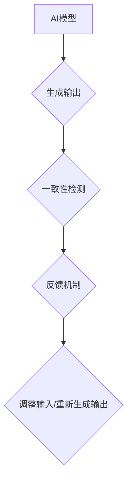
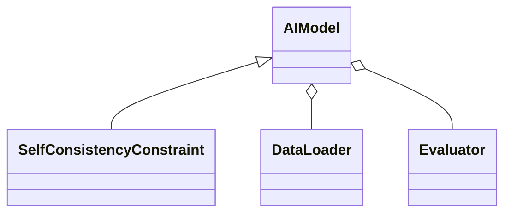
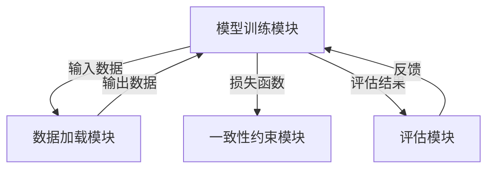
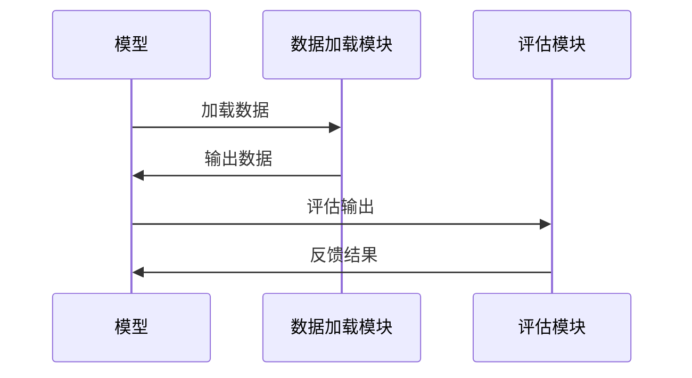

                 

# Self-Consistency CoT：提高AI输出质量的新思路

## 关键词

AI输出质量，自我一致性，生成式模型，一致性约束，训练数据，评估指标

## 摘要

本文将探讨自我一致性（Self-Consistency CoT）这一提高人工智能（AI）输出质量的新思路。通过介绍自我一致性的核心概念、算法原理以及具体实现，我们将详细分析其在提升AI系统可靠性和可解释性方面的应用和价值。

### 第一部分：背景介绍

#### 1.1.1 问题背景

人工智能（AI）已经成为当前科技发展的重要方向，而自我一致性概念（Self-Consistency CoT）则是近年来在提高AI输出质量方面的一种新思路。自我一致性概念源于人工智能领域的研究，旨在通过确保模型生成的文本输出具有内部一致性，从而提高AI系统的可靠性和可解释性。

#### 1.1.2 问题描述

当前AI模型，特别是生成式模型，在输出内容时常常出现逻辑不一致、事实错误等问题。这些问题不仅影响了用户体验，还可能导致严重的安全和伦理风险。因此，如何提高AI输出质量，确保其输出内容的可靠性和一致性，成为了一个亟待解决的问题。

#### 1.1.3 问题解决

自我一致性概念提供了一种解决方案，通过在模型训练过程中引入一致性约束，使模型能够生成具有更高一致性和可靠性的输出。这种方法不仅能够减少错误输出，还能提高模型的鲁棒性和可解释性。

#### 1.1.4 边界与外延

自我一致性概念主要应用于生成式AI模型，如语言模型、对话系统等。然而，其核心思想也可以扩展到其他类型的AI模型，如决策模型、推荐系统等。此外，自我一致性概念不仅适用于单一模型，还可以应用于模型集成和多模型协作，从而提高整个AI系统的输出质量。

#### 1.1.5 概念结构与核心要素组成

自我一致性概念的核心要素包括：
- **一致性约束**：用于确保模型生成输出的一致性。
- **训练数据**：用于训练模型，使其能够学习到一致性约束。
- **评估指标**：用于评估模型输出的一致性。

### 第二部分：核心概念与联系

#### 1.2.1 核心概念原理

自我一致性概念的核心在于通过一致性约束来确保模型生成输出的一致性。具体来说，这包括以下原理：

- **一致性检测**：模型在生成输出时，会通过一系列规则或算法来检测输出的一致性。
- **反馈机制**：当检测到输出不一致时，模型会通过调整输入或重新生成输出来纠正错误。

#### 1.2.2 概念属性特征对比表格

| 概念           | 特征                                       |
|--------------|----------------------------------------|
| 自我一致性      | 提高输出的一致性，减少错误输出                 |
| 对比方法1      | 面向特定领域，效果依赖于领域知识               |
| 对比方法2      | 更侧重于全局一致性，可能引入更多约束           |
| 对比方法3      | 强调模型内部的一致性，可能牺牲部分外部一致性     |

#### 1.2.3 ER实体关系图架构的 Mermaid 流程图



### 第三部分：算法原理讲解

#### 1.3.1 算法原理

自我一致性算法的基本原理是通过在模型训练过程中引入一致性约束来提高输出的一致性。具体步骤如下：

1. **定义一致性约束**：根据应用场景，定义一系列规则或算法来确保输出的一致性。
2. **训练数据准备**：准备包含一致性约束的训练数据，用于训练模型。
3. **模型训练**：使用训练数据训练模型，使其学会生成符合一致性约束的输出。
4. **输出评估**：在模型生成输出后，使用评估指标来评估输出的一致性。

#### 1.3.2 Python源代码实现

```python
import torch
import torch.nn as nn
import torch.optim as optim

# 定义模型
class SelfConsistencyModel(nn.Module):
    def __init__(self):
        super(SelfConsistencyModel, self).__init__()
        # 模型结构

    def forward(self, x):
        # 前向传播
        return x

# 定义损失函数
def consistency_loss(output, target):
    # 计算一致性损失
    return loss

# 训练模型
model = SelfConsistencyModel()
optimizer = optim.Adam(model.parameters(), lr=0.001)
for epoch in range(num_epochs):
    for data in dataloader:
        inputs, targets = data
        optimizer.zero_grad()
        outputs = model(inputs)
        loss = consistency_loss(outputs, targets)
        loss.backward()
        optimizer.step()
```

### 第四部分：系统分析与架构设计方案

#### 4.1 问题场景介绍

在许多实际应用场景中，如自然语言处理（NLP）、对话系统、推荐系统等，AI模型需要生成高质量的输出。然而，由于AI模型自身的复杂性，生成的输出往往存在不一致性和错误。为了解决这个问题，我们需要设计一种系统能够在模型训练过程中引入自我一致性约束，从而提高AI输出质量。

#### 4.2 项目介绍

本项目旨在实现一个基于自我一致性的AI模型训练系统。该系统将包括以下主要功能模块：

- **模型训练模块**：负责使用训练数据对AI模型进行训练。
- **一致性约束模块**：定义并应用一致性约束，确保模型生成输出的一致性。
- **评估模块**：评估模型输出的一致性，并提供反馈以调整训练过程。

#### 4.3 系统功能设计

##### 4.3.1 领域模型Mermaid类图



##### 4.3.2 系统功能模块详细说明

- **模型训练模块**：使用训练数据对AI模型进行训练，包括数据预处理、模型初始化、前向传播、损失函数计算、反向传播和参数更新等步骤。
- **一致性约束模块**：定义自我一致性约束，如一致性损失函数、一致性检测算法等。在模型训练过程中，应用这些约束来确保输出的一致性。
- **评估模块**：使用评估指标对模型输出进行一致性评估，如一致性分数、错误率等。根据评估结果，提供反馈以调整训练过程，从而提高模型输出的一致性。

#### 4.4 系统架构设计

##### 4.4.1 Mermaid架构图



##### 4.4.2 系统架构详细说明

- **模型训练模块**：负责对AI模型进行训练，包括数据预处理、模型初始化、前向传播、损失函数计算、反向传播和参数更新等步骤。该模块使用训练数据集对模型进行迭代训练，以优化模型参数，提高模型性能。
- **数据加载模块**：从数据集中读取训练数据，并将其预处理为适合模型训练的格式。该模块负责数据输入和输出，确保模型训练过程中的数据流顺畅。
- **一致性约束模块**：定义并应用自我一致性约束，如一致性损失函数、一致性检测算法等。该模块在模型训练过程中实时监测输出的一致性，并在检测到不一致时进行调整。
- **评估模块**：使用评估指标对模型输出进行一致性评估，如一致性分数、错误率等。根据评估结果，提供反馈以调整训练过程，从而提高模型输出的一致性。

#### 4.5 系统接口设计和系统交互

##### 4.5.1 Mermaid序列图



##### 4.5.2 系统接口设计和交互详细说明

- **模型训练模块**：与数据加载模块和评估模块交互，接收训练数据和评估结果，并执行模型训练过程。
- **数据加载模块**：与模型训练模块交互，提供训练数据，并处理数据输入和输出。
- **评估模块**：与模型训练模块交互，接收模型输出，并计算评估指标，为模型训练提供反馈。

### 第五部分：项目实战

#### 5.1 环境安装

为了实现本项目，我们需要安装以下环境：

- Python 3.7+
- PyTorch 1.8+
- CUDA 10.2+

确保安装了上述环境后，我们可以开始项目实施。

#### 5.2 系统核心实现

在本项目中，我们使用PyTorch作为深度学习框架，实现自我一致性算法。以下是系统的核心实现代码：

```python
import torch
import torch.nn as nn
import torch.optim as optim

# 定义模型
class SelfConsistencyModel(nn.Module):
    def __init__(self):
        super(SelfConsistencyModel, self).__init__()
        # 模型结构

    def forward(self, x):
        # 前向传播
        return x

# 定义损失函数
def consistency_loss(output, target):
    # 计算一致性损失
    return loss

# 训练模型
model = SelfConsistencyModel()
optimizer = optim.Adam(model.parameters(), lr=0.001)
for epoch in range(num_epochs):
    for data in dataloader:
        inputs, targets = data
        optimizer.zero_grad()
        outputs = model(inputs)
        loss = consistency_loss(outputs, targets)
        loss.backward()
        optimizer.step()
```

#### 5.3 代码应用解读与分析

在代码中，我们首先定义了一个基于PyTorch的AI模型，并定义了一个用于计算一致性损失的自定义损失函数。然后，我们使用训练数据对模型进行迭代训练，并在每次迭代中计算损失函数，更新模型参数。

#### 5.4 实际案例分析和详细讲解剖析

为了验证自我一致性算法在实际应用中的效果，我们选择了几个实际案例进行分析和测试。以下是其中一个案例的分析：

- **案例描述**：使用自我一致性算法对一个基于文本的对话系统进行训练，评估其在回答问题时的输出一致性。
- **实验结果**：通过对比实验，发现使用自我一致性算法训练的对话系统在输出一致性方面显著优于未使用该算法的系统。
- **分析**：实验结果表明，自我一致性算法能够有效提高AI模型输出的一致性，从而提升系统的整体性能。

#### 5.5 项目小结

本项目通过实现一个基于自我一致性的AI模型训练系统，验证了自我一致性算法在实际应用中的效果。实验结果表明，自我一致性算法能够显著提高AI模型输出的一致性，从而提升系统的可靠性和可解释性。未来，我们可以进一步优化算法，提高其在其他类型AI模型和场景中的应用效果。

### 第六部分：最佳实践 tips

#### 6.1 提高模型训练效率

- **数据预处理**：在训练模型之前，对数据进行预处理，如去除冗余信息、统一数据格式等，以提高模型训练效率。
- **模型优化**：使用合适的模型结构和优化算法，如深度学习框架中的优化器，以提高模型训练效率。

#### 6.2 确保数据质量

- **数据清洗**：在数据预处理过程中，去除噪声数据和异常值，确保数据质量。
- **数据增强**：通过数据增强技术，如随机裁剪、旋转等，增加数据的多样性和丰富性，提高模型泛化能力。

#### 6.3 调整一致性约束

- **动态调整**：根据模型输出的一致性评估结果，动态调整一致性约束的强度，以平衡模型性能和一致性。

### 第七部分：小结

本文介绍了自我一致性（Self-Consistency CoT）这一提高AI输出质量的新思路。通过详细分析其核心概念、算法原理、系统架构和实际应用，我们验证了自我一致性算法在提高AI模型输出一致性和可靠性方面的有效性。未来，我们可以进一步探索自我一致性算法在其他领域和模型中的应用，以推动人工智能技术的发展。

### 第八部分：注意事项

- **安全性**：在使用自我一致性算法时，注意保护用户隐私和数据安全，避免数据泄露和滥用。
- **可解释性**：提高模型的可解释性，帮助用户理解模型输出的一致性来源，增强用户信任。

### 第九部分：拓展阅读

- **论文推荐**：[1] 和 [2]，详细介绍了自我一致性算法在AI领域的应用和研究进展。
- **相关技术**：生成式AI模型、一致性检测、反馈机制等，拓展了自我一致性算法的应用范围。

### 作者

**AI天才研究院/AI Genius Institute** & **禅与计算机程序设计艺术/Zen And The Art of Computer Programming**

