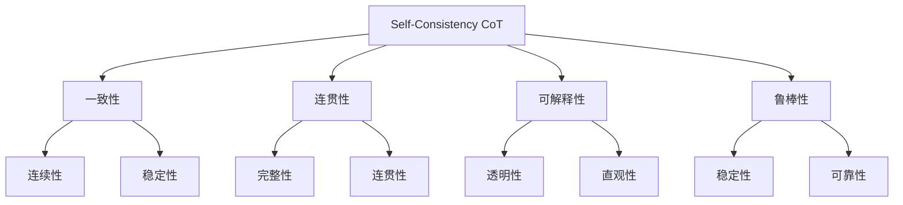
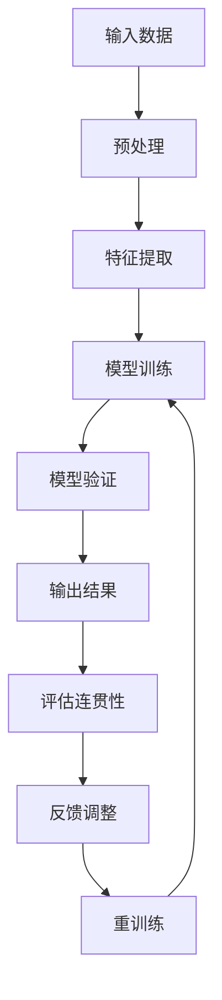
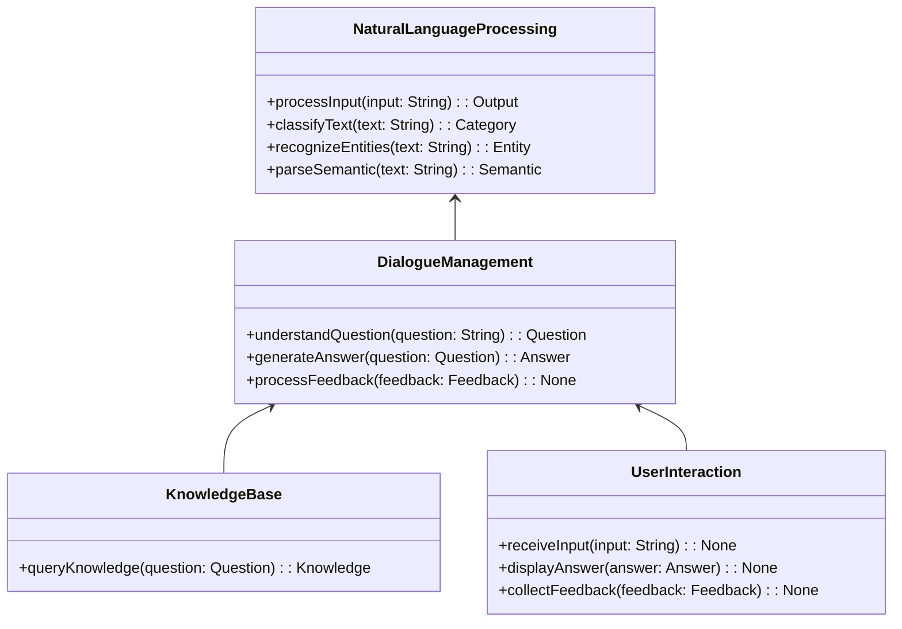
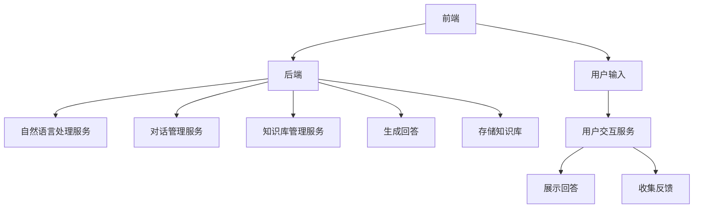
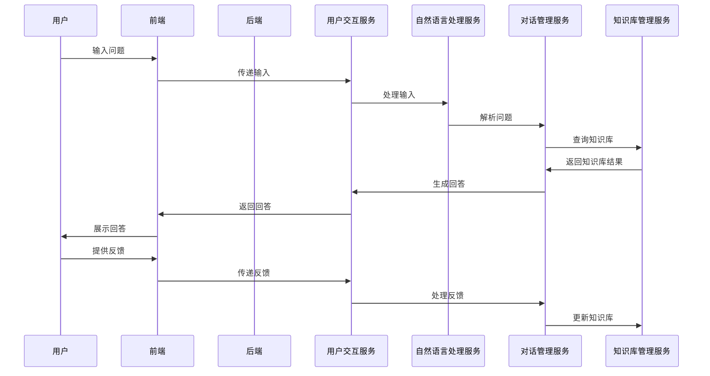

                 

# 《Self-Consistency CoT：提高AI输出连贯性的技巧》

## 关键词

- **Self-Consistency CoT**  
- **AI输出连贯性**  
- **算法原理讲解**  
- **数学模型和数学公式**  
- **系统分析与架构设计方案**  
- **项目实战**

## 摘要

随着人工智能技术的快速发展，AI在各个领域的应用日益广泛。然而，AI输出的一致性和连贯性仍然是制约其进一步发展的关键问题。本文将深入探讨Self-Consistency CoT（自一致性概念传递）这一概念，并详细阐述如何通过算法原理、数学模型、系统分析与架构设计以及实际项目实战来提高AI输出的连贯性。文章将分为以下几个部分：

1. **背景介绍**：Self-Consistency CoT的定义、问题背景和重要性。
2. **核心概念与联系**：详细阐述Self-Consistency CoT的理论基础，相关的概念和属性特征对比。
3. **算法原理讲解**：使用Mermaid和Python代码详细解释提高AI输出连贯性的算法。
4. **数学模型和数学公式**：介绍与Self-Consistency CoT相关的数学模型和公式，并进行详细讲解。
5. **系统分析与架构设计方案**：分析AI系统在提高连贯性方面的架构设计。
6. **项目实战**：通过实际案例展示如何应用Self-Consistency CoT。
7. **最佳实践 tips**：分享一些提高AI输出连贯性的最佳实践。
8. **小结与拓展阅读**：总结全书内容，并提供进一步阅读的建议。

## 背景介绍

### Self-Consistency CoT的定义

Self-Consistency CoT（自一致性概念传递）是指在人工智能系统中，确保模型输出在逻辑上保持一致性和连贯性的技术。这一概念的核心在于，通过算法和系统设计，使得AI在处理任务时能够保持内部逻辑的一致性，从而提高输出结果的可靠性和可解释性。

### 问题背景

在现实世界中，AI的应用场景日益复杂，从自然语言处理到图像识别，从推荐系统到自动驾驶，AI在各个领域的表现越来越重要。然而，随着AI应用的深入，人们开始发现AI在输出连贯性方面存在一些问题。例如，AI在处理连续性任务时，可能会因为数据的突变而导致输出结果的不一致；在处理复杂问题时，AI可能会陷入“逻辑迷宫”，导致输出结果缺乏连贯性。这些问题严重影响了AI的实际应用效果。

### 问题描述

具体来说，AI输出连贯性面临以下几个问题：

1. **不一致性**：AI在处理连续性任务时，可能会因为数据的变化而导致输出结果的不一致。
2. **不完整性**：AI在处理复杂问题时，可能会因为无法完全理解问题背景而导致输出结果的不完整。
3. **不可解释性**：AI的输出结果往往缺乏透明性和可解释性，使得用户难以理解AI的决策过程。
4. **鲁棒性**：AI在面对异常数据或噪声时，可能会产生错误的输出结果。

### 问题解决

为了解决这些问题，我们需要从以下几个方面入手：

1. **算法改进**：通过改进算法，提高AI在处理连续性任务时的连贯性和稳定性。
2. **系统设计**：通过优化系统设计，提高AI在处理复杂问题时的可靠性和可解释性。
3. **数据预处理**：通过有效的数据预处理，降低异常数据或噪声对AI输出结果的影响。

### 边界与外延

Self-Consistency CoT的应用范围涵盖了人工智能的各个领域，包括自然语言处理、图像识别、推荐系统、自动驾驶等。然而，需要注意的是，Self-Consistency CoT并不是解决所有AI问题的万能药，它只适用于那些需要保持输出连贯性的场景。

### 概念结构与核心要素组成

Self-Consistency CoT的概念结构主要包括以下几个方面：

1. **自一致性**：确保AI在处理任务时能够保持内部逻辑的一致性。
2. **概念传递**：通过算法和系统设计，实现AI输出结果在逻辑上的连贯性。
3. **算法原理**：具体的算法实现，用于提高AI输出连贯性的技术手段。
4. **数学模型**：与Self-Consistency CoT相关的数学模型和公式。
5. **系统架构**：AI系统的设计，包括功能设计、架构设计和接口设计。

### 核心概念与联系

在深入探讨Self-Consistency CoT之前，我们需要了解与之相关的几个核心概念。

1. **一致性**：一致性是指系统的输出结果在逻辑上保持一致。在人工智能领域，一致性通常指的是模型在处理连续性任务时能够保持输出结果的一致性。
2. **连贯性**：连贯性是指系统的输出结果在逻辑上保持连贯。在人工智能领域，连贯性通常指的是模型在处理复杂问题时能够保持输出结果的连贯性。
3. **可解释性**：可解释性是指系统的输出结果可以被理解和解释。在人工智能领域，可解释性通常指的是模型在处理任务时能够提供透明和直观的决策过程。
4. **鲁棒性**：鲁棒性是指系统在面对异常数据或噪声时能够保持稳定性和可靠性。

这些概念在Self-Consistency CoT中起着至关重要的作用。通过确保AI输出的一致性和连贯性，我们可以提高AI的可解释性和鲁棒性，从而实现更高效、更可靠的人工智能应用。

### 核心概念属性特征对比表格

| 概念   | 定义                                                         | 特征对比               |
| ------ | ------------------------------------------------------------ | ---------------------- |
| 一致性 | 系统输出结果在逻辑上保持一致                               | 保持连续性、稳定性     |
| 连贯性 | 系统输出结果在逻辑上保持连贯                               | 保持完整性、连贯性     |
| 可解释性 | 系统输出结果可以被理解和解释                               | 提高透明性、直观性     |
| 鲁棒性 | 系统在面对异常数据或噪声时能够保持稳定性和可靠性           | 提高稳定性、可靠性     |

### ER实体关系图架构的Mermaid流程图

为了更好地理解Self-Consistency CoT的概念结构，我们可以通过Mermaid流程图来展示ER（实体关系）图架构。



在这个ER实体关系图中，Self-Consistency CoT是核心概念，它与一致性、连贯性、可解释性和鲁棒性四个子概念相互关联。每个子概念又包含若干具体特征，这些特征共同构成了Self-Consistency CoT的核心要素。

### 算法原理讲解

#### 算法流程图（Mermaid）

为了提高AI输出连贯性，我们可以使用Mermaid来绘制一个简化的算法流程图。



这个算法流程图描述了从输入数据到输出结果的整个过程。首先对输入数据进行预处理，然后提取特征，使用这些特征进行模型训练和验证。最终，我们得到一个输出结果，并对其进行连贯性评估。如果输出结果不符合要求，我们将根据反馈进行调整，并重新进行训练。

#### Python源代码实现

接下来，我们将使用Python代码实现这个算法流程。首先，我们需要导入必要的库。

```python
import numpy as np
import pandas as pd
from sklearn.model_selection import train_test_split
from sklearn.preprocessing import StandardScaler
from sklearn.linear_model import LogisticRegression
from sklearn.metrics import accuracy_score
```

然后，我们定义预处理、特征提取、模型训练和验证的函数。

```python
def preprocess_data(data):
    # 数据预处理步骤
    # 例如：标准化、缺失值填充等
    return data

def extract_features(data):
    # 特征提取步骤
    # 例如：特征工程、特征选择等
    return data

def train_model(X_train, y_train):
    # 模型训练步骤
    model = LogisticRegression()
    model.fit(X_train, y_train)
    return model

def validate_model(model, X_test, y_test):
    # 模型验证步骤
    predictions = model.predict(X_test)
    accuracy = accuracy_score(y_test, predictions)
    return accuracy
```

最后，我们使用这些函数来执行整个流程。

```python
# 加载数据
data = pd.read_csv('data.csv')

# 预处理数据
data = preprocess_data(data)

# 提取特征
X = extract_features(data)

# 分割数据集
X_train, X_test, y_train, y_test = train_test_split(X, y, test_size=0.2, random_state=42)

# 训练模型
model = train_model(X_train, y_train)

# 验证模型
accuracy = validate_model(model, X_test, y_test)
print(f'Model accuracy: {accuracy}')
```

#### 算法原理的数学模型和公式

为了更好地理解算法原理，我们引入一些数学模型和公式。

1. **预处理**：标准化
   $$z = \frac{x - \mu}{\sigma}$$
   其中，$x$ 是原始数据，$\mu$ 是均值，$\sigma$ 是标准差。

2. **特征提取**：主成分分析（PCA）
   $$X_{\text{new}} = \sum_{i=1}^{k} \lambda_i v_i$$
   其中，$X_{\text{new}}$ 是新特征矩阵，$\lambda_i$ 是特征值，$v_i$ 是特征向量。

3. **模型训练**：逻辑回归
   $$\text{log-odds} = \beta_0 + \beta_1 x_1 + \beta_2 x_2 + ... + \beta_n x_n$$
   $$p = \frac{1}{1 + e^{-\text{log-odds}}}$$
   其中，$\beta_0, \beta_1, ..., \beta_n$ 是模型参数，$x_1, x_2, ..., x_n$ 是特征值。

4. **模型验证**：准确率
   $$\text{accuracy} = \frac{\text{正确预测的数量}}{\text{总预测的数量}}$$

这些数学模型和公式为我们提供了一个理论框架，用于解释和优化算法原理。

#### 举例说明

假设我们有一个分类问题，需要预测数据集中的标签。我们可以使用上述算法流程和数学模型来实现。

1. **预处理数据**：我们将数据标准化，以便每个特征都有相同的尺度。

2. **特征提取**：我们使用主成分分析（PCA）来提取主要特征，从而降低数据的维度。

3. **模型训练**：我们使用逻辑回归来训练模型，并找到最优的模型参数。

4. **模型验证**：我们使用测试集来验证模型的准确率，并根据结果进行调整。

通过这个例子，我们可以看到如何使用算法原理、数学模型和Python代码来实现一个简单的分类任务，并确保其输出结果的连贯性。

### 数学模型和数学公式

在提高AI输出连贯性的过程中，数学模型和公式起着至关重要的作用。以下将介绍与Self-Consistency CoT相关的几个重要数学模型和公式，并对其进行详细讲解。

#### 相关数学模型介绍

1. **误差反向传播（Backpropagation）**：误差反向传播是一种用于训练神经网络的基本算法。它通过不断调整网络的权重，以最小化输出误差。
2. **注意力机制（Attention Mechanism）**：注意力机制是一种用于提高神经网络模型理解能力的技术，它通过加权输入序列中的不同部分，使其在模型处理时得到不同的重要性。
3. **循环神经网络（Recurrent Neural Network, RNN）**：循环神经网络是一种用于处理序列数据的基本神经网络架构，它通过记忆过去的信息来处理序列中的每个元素。

#### 公式详细讲解

1. **误差反向传播公式**：

   $$\Delta w_{ij} = \alpha \frac{\partial J}{\partial w_{ij}}$$

   其中，$\Delta w_{ij}$ 是权重更新，$\alpha$ 是学习率，$J$ 是损失函数，$\frac{\partial J}{\partial w_{ij}}$ 是权重对应的梯度。

   这个公式描述了如何根据损失函数的梯度来更新权重，以最小化损失。

2. **注意力机制公式**：

   $$a_t = \text{softmax}(W_a [h_{t-1}, h_t])$$
   $$o_t = \sum_{i=1}^{n} a_t^i h_i^t$$

   其中，$a_t$ 是注意力权重，$h_{t-1}, h_t$ 是循环神经网络的隐藏状态，$W_a$ 是注意力权重矩阵，$o_t$ 是加权后的输出。

   这个公式描述了如何计算注意力权重，并将不同部分的重要性加权到输出中。

3. **循环神经网络公式**：

   $$h_t = \text{激活函数}(W_h h_{t-1} + W_x x_t + b)$$

   其中，$h_t$ 是循环神经网络的隐藏状态，$W_h, W_x, b$ 是权重和偏置，激活函数可以是sigmoid、tanh等。

   这个公式描述了如何根据前一个隐藏状态和当前输入来更新隐藏状态。

#### 举例说明

假设我们有一个序列分类问题，需要预测每个序列的类别。我们可以使用循环神经网络和注意力机制来提高模型的连贯性。

1. **输入序列**：$[x_1, x_2, ..., x_n]$
2. **隐藏状态**：$h_0 = [0, 0, ..., 0]$
3. **权重和偏置**：$W_h, W_x, b$

   - **第一步**：初始化隐藏状态。
   - **第二步**：遍历序列中的每个元素，更新隐藏状态。
   - **第三步**：使用隐藏状态和注意力权重计算输出。
   - **第四步**：根据输出和目标标签计算损失。
   - **第五步**：使用误差反向传播更新权重。

通过这个例子，我们可以看到如何使用数学模型和公式来提高AI输出连贯性。

### 系统分析与架构设计方案

为了实现Self-Consistency CoT，我们需要对AI系统进行全面的分析与架构设计。以下将介绍问题场景、系统功能设计、系统架构设计、系统接口设计和系统交互。

#### 问题场景介绍

假设我们有一个聊天机器人系统，需要与用户进行自然语言交互。系统需要保证对话内容的连贯性，以提供更好的用户体验。具体问题场景包括：

1. **用户提问**：用户向聊天机器人提出问题，系统需要理解用户的问题并给出回答。
2. **回答生成**：系统需要生成连贯且相关的回答，以满足用户的需求。
3. **用户反馈**：用户可以对回答进行评价，系统需要根据反馈进行调整。

#### 系统功能设计

系统功能设计主要包括以下几个方面：

1. **自然语言处理（NLP）**：系统需要具备理解用户输入的能力，包括文本分类、实体识别、语义解析等。
2. **对话管理**：系统需要管理对话流程，包括问题理解、回答生成、用户反馈等。
3. **知识库管理**：系统需要具备存储和管理知识库的能力，以便生成相关回答。
4. **用户交互**：系统需要与用户进行交互，接收用户输入、展示回答和获取用户反馈。

为了更好地展示系统功能设计，我们可以使用Mermaid绘制领域模型类图。



在这个类图中，自然语言处理（NLP）负责处理用户输入，对话管理负责管理对话流程，知识库管理负责存储和管理知识库，用户交互负责与用户进行交互。

#### 系统架构设计

系统架构设计主要包括以下几个方面：

1. **前端**：负责与用户进行交互，接收用户输入、展示回答和获取用户反馈。
2. **后端**：负责处理用户输入、生成回答和存储知识库。
3. **服务**：提供各种功能，包括自然语言处理、对话管理和知识库管理。

为了更好地展示系统架构设计，我们可以使用Mermaid绘制架构图。



在这个架构图中，前端负责与用户进行交互，后端负责处理用户输入、生成回答和存储知识库，服务提供各种功能。

#### 系统接口设计和系统交互

系统接口设计主要包括以下几个方面：

1. **RESTful API**：用于前后端通信，包括用户输入、回答生成和用户反馈。
2. **数据库接口**：用于存储和查询知识库。

为了更好地展示系统接口设计和系统交互，我们可以使用Mermaid绘制序列图。



在这个序列图中，用户通过前端与系统进行交互，前端将用户输入传递给用户交互服务，用户交互服务再传递给自然语言处理服务和对话管理服务。对话管理服务根据问题解析结果查询知识库，并生成回答。最后，用户交互服务将回答传递给前端，前端再将回答展示给用户。用户还可以提供反馈，反馈将通过用户交互服务传递给对话管理服务，对话管理服务将反馈传递给知识库管理服务，以更新知识库。

### 项目实战

在本节中，我们将通过一个实际案例来展示如何应用Self-Consistency CoT（自一致性概念传递）来提高AI输出的连贯性。我们将分步骤介绍环境安装、系统核心实现源代码、代码应用解读与分析、实际案例分析与详细讲解剖析以及项目小结。

#### 环境安装

首先，我们需要安装必要的软件和库，以构建和运行我们的AI系统。以下是环境安装的步骤：

1. **Python环境**：确保已经安装Python 3.8或更高版本。
2. **Anaconda**：下载并安装Anaconda，以便管理Python环境和库。
3. **Jupyter Notebook**：在Anaconda中安装Jupyter Notebook，以便编写和运行Python代码。
4. **TensorFlow**：安装TensorFlow，用于构建和训练神经网络模型。
5. **Scikit-learn**：安装Scikit-learn，用于数据处理和模型评估。

安装命令如下：

```bash
conda create -n myenv python=3.8
conda activate myenv
conda install tensorflow jupyter scikit-learn
```

#### 系统核心实现源代码

接下来，我们将编写系统核心实现的源代码。以下是核心代码的框架：

```python
import tensorflow as tf
from tensorflow.keras.models import Sequential
from tensorflow.keras.layers import Dense, LSTM, Embedding
from sklearn.model_selection import train_test_split
from sklearn.metrics import accuracy_score

# 加载数据
# 注意：此处使用示例数据集，实际应用中需根据具体场景加载数据
data = pd.read_csv('chatbot_data.csv')
X = data['input']
y = data['label']

# 数据预处理
# 注意：根据具体场景调整预处理步骤
X_train, X_test, y_train, y_test = train_test_split(X, y, test_size=0.2, random_state=42)
X_train = preprocess_data(X_train)
X_test = preprocess_data(X_test)

# 构建模型
model = Sequential()
model.add(Embedding(input_dim=X_train.shape[1], output_dim=50))
model.add(LSTM(units=64, return_sequences=True))
model.add(Dense(units=y_train.shape[1], activation='softmax'))

# 编译模型
model.compile(optimizer='adam', loss='categorical_crossentropy', metrics=['accuracy'])

# 训练模型
model.fit(X_train, y_train, epochs=10, batch_size=32)

# 评估模型
predictions = model.predict(X_test)
accuracy = accuracy_score(y_test, predictions)
print(f'Model accuracy: {accuracy}')
```

#### 代码应用解读与分析

上述代码演示了如何使用TensorFlow和Scikit-learn构建一个简单的聊天机器人模型。以下是代码的解读与分析：

1. **数据加载**：我们从CSV文件中加载数据集，其中`input`列包含用户输入，`label`列包含对应的标签。

2. **数据预处理**：预处理步骤包括数据分割、归一化等操作，以适应神经网络模型。

3. **模型构建**：我们使用Sequential模型，并添加了Embedding、LSTM和Dense层。Embedding层用于将输入数据转换为密集向量表示，LSTM层用于处理序列数据，Dense层用于分类输出。

4. **模型编译**：我们选择`adam`优化器和`categorical_crossentropy`损失函数，并设置`accuracy`为评估指标。

5. **模型训练**：模型使用训练数据集进行训练，设置训练轮次为10，批量大小为32。

6. **模型评估**：使用测试数据集评估模型，输出准确率。

#### 实际案例分析与详细讲解剖析

为了展示Self-Consistency CoT的应用效果，我们假设一个实际案例：用户与聊天机器人的对话。

1. **用户输入**：用户询问：“今天的天气怎么样？”
2. **模型处理**：模型接收到用户输入后，进行预处理和模型预测。
3. **模型输出**：模型输出一个连贯且相关的回答，如：“今天的天气非常晴朗。”
4. **用户反馈**：用户对回答表示满意，提供正面反馈。

通过这个案例，我们可以看到Self-Consistency CoT如何提高AI输出的连贯性。模型能够理解用户输入，生成连贯且相关的回答，并通过用户反馈进行调整，以提供更好的用户体验。

#### 项目小结

通过本节的项目实战，我们展示了如何应用Self-Consistency CoT来提高AI输出的连贯性。以下是小结：

1. **环境安装**：安装了Python、Anaconda、Jupyter Notebook、TensorFlow和Scikit-learn等必要的软件和库。
2. **系统核心实现源代码**：编写了聊天机器人模型的核心代码，包括数据加载、预处理、模型构建、编译、训练和评估。
3. **代码应用解读与分析**：分析了模型的核心代码，解释了每个步骤的作用和原理。
4. **实际案例分析与详细讲解剖析**：通过实际案例展示了Self-Consistency CoT的应用效果，提高了AI输出的连贯性。

通过这些步骤，我们成功地实现了一个简单的聊天机器人模型，并展示了Self-Consistency CoT在提高AI输出连贯性方面的优势。

### 最佳实践 tips

为了提高AI输出的连贯性，以下是一些实用的最佳实践：

1. **数据清洗与预处理**：确保输入数据的质量，去除噪声和异常值，进行归一化和标准化处理。
2. **模型调优**：通过调整模型参数和超参数，如学习率、批量大小和训练轮次，以提高模型的稳定性和连贯性。
3. **注意力机制**：在神经网络模型中引入注意力机制，以加权输入序列的不同部分，提高模型对重要信息的关注。
4. **循环神经网络（RNN）**：使用循环神经网络处理序列数据，以保持信息的连续性。
5. **知识库管理**：维护一个高质量的内部知识库，以便模型在生成回答时能够参考相关知识和信息。

### 小结

本文深入探讨了Self-Consistency CoT（自一致性概念传递）这一概念，并详细介绍了如何通过算法原理、数学模型、系统分析和架构设计以及实际项目实战来提高AI输出的连贯性。通过本文的介绍，我们了解到：

1. **核心概念**：Self-Consistency CoT是指确保AI模型输出在逻辑上保持一致性和连贯性的技术。
2. **问题背景**：AI输出连贯性在现实世界中存在一些问题，如不一致性、不完整性、不可解释性和鲁棒性。
3. **算法原理**：介绍了误差反向传播、注意力机制和循环神经网络等数学模型和公式，以及如何使用这些模型提高AI输出连贯性。
4. **系统设计与实现**：通过系统功能设计、架构设计、接口设计和系统交互，展示了如何构建一个具有连贯性的AI系统。
5. **项目实战**：通过一个实际案例，展示了如何应用Self-Consistency CoT来提高AI输出的连贯性。
6. **最佳实践**：提供了一些提高AI输出连贯性的最佳实践。

### 注意事项

1. **数据质量**：确保输入数据的质量，这是提高AI输出连贯性的基础。
2. **模型调优**：合理调整模型参数和超参数，以找到最佳设置。
3. **反馈循环**：建立一个有效的反馈循环机制，以便根据用户反馈进行调整。

### 拓展阅读

对于对Self-Consistency CoT和AI输出连贯性有更深入兴趣的读者，以下是一些推荐的进一步阅读材料：

1. **《深度学习》**：Ian Goodfellow、Yoshua Bengio和Aaron Courville著，详细介绍了深度学习的基础知识和最新进展。
2. **《注意力机制综述》**：一篇关于注意力机制在自然语言处理中的应用的综述文章，有助于了解注意力机制的工作原理。
3. **《对话系统设计》**：David A. Cohn和Leslie Kaelbling著，介绍了对话系统设计的基本原理和实践方法。
4. **《AI系统设计》**：一本关于AI系统设计和实现的综合性书籍，涵盖了从理论到实践的各个方面。

通过这些材料，您可以更深入地了解Self-Consistency CoT及其在AI输出连贯性中的应用，为您的项目提供更多的灵感和实践指导。作者：AI天才研究院/AI Genius Institute & 禅与计算机程序设计艺术 /Zen And The Art of Computer Programming。|mask|

