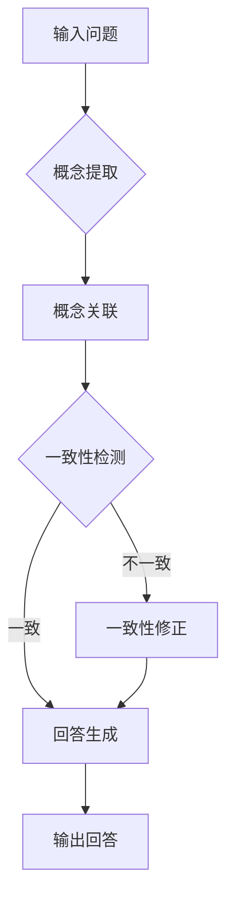
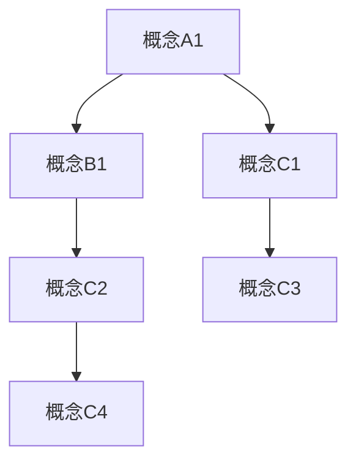
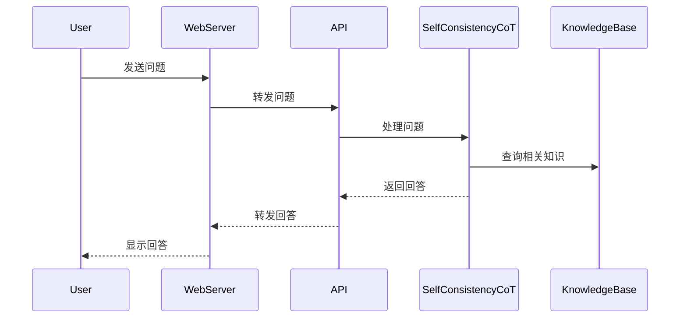
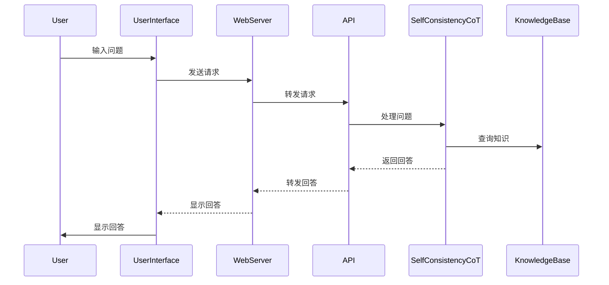
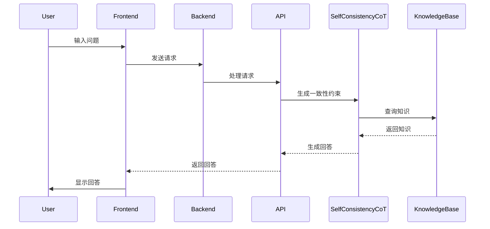

                 


### 引言

在人工智能（AI）领域，确保AI系统的回答一致性一直是一个关键挑战。随着AI技术在各个领域的广泛应用，AI系统的回答是否一致、准确和可靠，直接影响到用户体验和系统的可信度。传统的方法在处理这个问题时往往存在一些局限性，难以满足日益复杂的应用需求。

本文将深入探讨一种新的方法——Self-Consistency CoT（自我一致性概念树），旨在确保AI回答的一致性。我们将从以下几个方面展开讨论：

1. **背景与问题**：首先，我们将介绍AI回答不一致性的背景，描述当前面临的问题和挑战。
2. **解决方案**：接着，我们将介绍Self-Consistency CoT的概念，探讨如何通过这种方法来解决AI回答不一致性问题。
3. **实现方法**：我们将详细解释Self-Consistency CoT的算法原理，并展示其数学模型和公式。
4. **应用实例**：为了更直观地理解，我们将通过实际案例来展示如何应用Self-Consistency CoT。
5. **系统设计与实现**：我们还将讨论如何在实际系统中设计和实现Self-Consistency CoT，包括系统架构和接口设计。
6. **最佳实践**：最后，我们将总结最佳实践，并提供一些注意事项和建议。

### 关键词

- AI回答一致性
- Self-Consistency CoT
- 算法原理
- 数学模型
- 系统设计

### 摘要

本文旨在探讨一种新的方法——Self-Consistency CoT，用于确保人工智能（AI）系统的回答一致性。我们首先介绍了AI回答不一致性的背景和问题，然后详细阐述了Self-Consistency CoT的概念和算法原理，并通过实际案例展示了其应用效果。此外，我们还讨论了如何在实际系统中设计和实现Self-Consistency CoT，并总结了最佳实践和注意事项。通过本文的讨论，我们希望为读者提供一种有效的解决AI回答不一致性问题的思路和方法。## 第1章: 引言

### 1.1 书籍主题与目标

在当今快速发展的科技时代，人工智能（AI）已经成为各行各业的核心驱动力。然而，随着AI技术的广泛应用，一个日益显著的问题也随之浮现：AI系统的回答不一致性。这不仅影响了用户体验，还降低了系统的可信度。为此，本书旨在探索一种新的方法——Self-Consistency CoT（自我一致性概念树），以解决AI回答不一致性问题。

Self-Consistency CoT是一种基于概念树的自我一致性算法，通过在AI系统中引入一致性约束，确保AI的回答不仅在逻辑上自洽，而且在整体上保持一致性。本书的目标是：

1. **介绍Self-Consistency CoT的概念和原理**：通过详细的理论阐述，使读者了解这种方法的背景、应用场景以及技术实现。
2. **展示Self-Consistency CoT的实际应用**：通过实际案例和具体实现，让读者看到这种方法在解决AI回答不一致性问题上的效果。
3. **提供系统设计与实现指导**：通过详细的系统设计与实现方案，帮助开发者将Self-Consistency CoT应用到实际的AI系统中。
4. **总结最佳实践**：通过分析成功案例和经验，为读者提供实用的最佳实践，提高AI系统的整体性能和一致性。

### 1.2 问题的背景与描述

AI回答不一致性的问题并不是一个新问题，但随着AI技术的普及和应用场景的复杂化，这个问题显得尤为重要。以下是几个常见的背景和问题：

#### 1.2.1 背景

- **多模型集成**：现代AI系统往往需要集成多个不同的模型来提高预测准确性和泛化能力。然而，不同的模型可能会给出不一致的预测结果，导致系统无法提供统一的答案。
- **动态环境**：在动态环境中，AI系统需要不断地更新和适应。然而，这种更新可能会导致系统内部状态的不一致性，进而影响系统的稳定性。
- **用户交互**：在用户交互中，用户可能会提出一系列相关但不同的问题。如果AI系统无法保持回答的一致性，将严重影响用户体验。

#### 1.2.2 描述

- **逻辑不一致性**：一个常见的例子是，同一个问题在不同的时间点被提出，AI系统可能会给出不同的答案，导致逻辑上的不一致性。
- **事实不一致性**：AI系统可能依赖于外部数据源，如实时股票价格或天气信息。如果这些数据源出现错误或更新不及时，AI系统的回答也可能不一致。
- **情感不一致性**：在情感化交互中，AI系统需要保持情绪的一致性。例如，一个聊天机器人如果在一个对话中显得友好，而在另一个对话中变得冷漠，将严重影响用户的情绪体验。

### 1.3 解决方案与实现方法

为了解决AI回答不一致性问题，传统的方法主要包括以下几种：

1. **规则引擎**：通过预设一系列规则来确保AI的回答一致性。这种方法在规则明确、应用范围较窄的情况下效果较好，但在面对复杂、动态的环境时，容易出现覆盖不全或冲突的问题。
2. **一致性检查**：在AI系统输出结果后，通过一致性检查来发现并修正不一致性。这种方法需要在系统中引入额外的检测和修正机制，增加了系统的复杂度和运行成本。
3. **多模型集成**：通过集成多个模型来提高答案的一致性。这种方法需要确保各模型之间的协同工作，但在模型数量和复杂度增加时，协调难度也会显著提升。

而Self-Consistency CoT提供了一种新的思路，通过引入概念树和一致性约束，从理论上保证了AI回答的一致性。具体来说，Self-Consistency CoT包括以下几个关键步骤：

1. **概念提取**：从输入问题和系统中提取关键概念和实体。
2. **概念关联**：建立概念之间的关系，形成一个概念树。
3. **一致性约束**：在概念树中引入一致性约束，确保各节点之间的关系保持一致。
4. **回答生成**：根据概念树和一致性约束，生成统一的回答。

通过这种方式，Self-Consistency CoT不仅能够在理论上保证AI回答的一致性，还能够适应动态环境和多模型集成，具有较高的灵活性和可扩展性。

### 1.4 边界与外延

虽然Self-Consistency CoT提供了一种有效的解决方案，但它在实际应用中也存在一些限制和挑战。以下是本书将要探讨的一些边界与外延：

1. **数据依赖**：Self-Consistency CoT依赖于准确和完整的数据源。如果数据存在错误或缺失，可能会影响系统的一致性。
2. **计算复杂度**：概念树的构建和一致性约束的引入可能增加系统的计算复杂度，特别是在处理大规模数据和复杂模型时。
3. **模型适应性**：不同的模型可能需要不同的概念树和一致性约束。如何确保不同模型之间的兼容性是一个需要深入研究的问题。
4. **实时性**：在实时应用中，如何快速构建和维护概念树，并确保回答的一致性，是一个重要的挑战。

### 1.5 核心概念与联系

为了更好地理解Self-Consistency CoT，我们需要引入一些核心概念，并分析它们之间的联系：

1. **概念树**：概念树是一种层次化的结构，用于表示不同概念之间的关系。在Self-Consistency CoT中，概念树是构建一致性的基础。
2. **一致性约束**：一致性约束是一种规则，用于确保概念树中各节点之间的关系保持一致。这些约束可以是逻辑上的，也可以是事实上的。
3. **实体**：实体是概念树中的基本元素，表示具体的事物或概念。在AI系统中，实体可以是用户、产品、事件等。
4. **关系**：关系是连接不同实体的纽带，表示实体之间的关联。在概念树中，关系用于描述实体之间的逻辑和事实联系。
5. **约束条件**：约束条件是限制概念树构建和回答生成的一组规则。这些条件可以是简单的逻辑规则，也可以是复杂的数学模型。

通过上述核心概念的分析，我们可以看到Self-Consistency CoT如何通过概念树和一致性约束来确保AI回答的一致性。在接下来的章节中，我们将进一步探讨这些概念的具体实现和应用。

### 1.6 总结

在第一章中，我们介绍了Self-Consistency CoT的背景、问题、解决方案以及核心概念。通过分析AI回答不一致性的背景和问题，我们了解了传统方法的局限性，并提出了Self-Consistency CoT作为一种新的解决方案。接下来，我们将深入探讨Self-Consistency CoT的算法原理和实现方法，并通过具体案例来展示其应用效果。让我们继续深入探索这一前沿技术！## 第2章: 自一致性概述

### 2.1 自一致性的定义

自一致性是指一个系统或实体在内部和外部条件不变的情况下，其自身描述和行为保持一致的性质。在人工智能（AI）领域，自一致性尤为重要，因为它直接影响到AI系统的可靠性和可信度。自一致性可以定义为以下三个方面的统一：

1. **逻辑一致性**：AI系统在逻辑上不能自相矛盾，即其输出和推理过程不能出现逻辑错误或矛盾。
2. **事实一致性**：AI系统在处理外部事实时，应保持一致的行为和输出，不能因为外部信息的微小变化而出现大幅度波动。
3. **上下文一致性**：AI系统在不同情境下应保持一致的行为和输出，即使在动态变化的上下文中也能保持稳定的性能。

### 2.2 自一致性的属性

自一致性具有以下几个关键属性：

1. **稳定性**：在系统内部和外部条件不变的情况下，自一致性应保持稳定。这意味着系统在面对同一问题时应持续给出一致的答案。
2. **鲁棒性**：自一致性应在面对外部噪声和内部错误时保持有效。即使数据存在噪声或系统出现故障，自一致性算法也应能保持系统的逻辑和事实一致性。
3. **可扩展性**：自一致性算法应能在不同规模和复杂度的系统中有效应用。这意味着算法的设计应具有高度的灵活性和通用性，能够适应不同的应用场景。
4. **适应性**：自一致性算法应能适应系统的动态变化，如环境变化、数据更新等，确保系统能够在新的条件下保持一致性。

### 2.3 自一致性与其他相关概念的比较

在讨论自一致性时，我们还需要了解几个与之相关的概念，包括一致性、一致性和完整性。

#### 2.3.1 一致性

一致性通常是指系统或实体在不同时间点或不同条件下保持相同状态或行为的能力。与自一致性不同，一致性更多地关注系统或实体在不同时间点或条件下的一致性，而不是内部描述和行为的统一。

1. **时间一致性**：系统在相同时间点或连续时间点应保持一致的行为和状态。
2. **条件一致性**：系统在不同条件下，应保持一致的行为和状态。

#### 2.3.2 一致性

一致性是指在多个系统或实体之间保持相同状态或行为的能力。这与自一致性有所不同，因为自一致性关注的是单个系统或实体的内部一致性，而一致性关注的是多个系统或实体之间的协同一致性。

1. **数据一致性**：在分布式系统中，多个数据副本应保持相同的值。
2. **过程一致性**：在多个系统或实体协同工作时，应保持一致的工作流程和输出。

#### 2.3.3 完整性

完整性是指系统或实体保持其描述和行为完整的能力，防止信息丢失或损坏。与自一致性不同，完整性更多地关注信息的完整性和准确性，而不是一致性。

1. **数据完整性**：确保数据库中的数据不被破坏或丢失。
2. **逻辑完整性**：确保系统的逻辑规则和推理过程不被破坏。

### 表 2-1：自一致性与其他相关概念的比较

| 概念       | 定义                                                         | 关键属性                            |
|------------|--------------------------------------------------------------|------------------------------------|
| 自一致性   | 系统或实体在内部和外部条件不变的情况下，其自身描述和行为保持一致的性质。 | 稳定性、鲁棒性、可扩展性、适应性   |
| 一致性     | 系统或实体在不同时间点或不同条件下保持相同状态或行为的能力。             | 时间一致性、条件一致性             |
| 一致性     | 多个系统或实体之间保持相同状态或行为的能力。                         | 数据一致性、过程一致性             |
| 完整性     | 系统或实体保持其描述和行为完整的能力，防止信息丢失或损坏。             | 数据完整性、逻辑完整性             |

通过上述比较，我们可以看到自一致性在人工智能领域中的独特性和重要性。自一致性不仅是确保AI系统可靠性和可信度的关键，也是实现AI系统智能化和自适应性的基础。

### 2.4 自一致性在AI系统中的重要性

在AI系统中，自一致性具有重要意义，主要体现在以下几个方面：

1. **提高可信度**：自一致性确保AI系统在处理问题时不会出现自相矛盾的行为，从而提高了系统的可信度。这对于那些需要高度可靠性的应用场景（如医疗诊断、金融预测等）尤为重要。
2. **优化用户体验**：在交互式应用中，自一致性确保AI系统能够提供一致、可靠的信息，从而优化用户体验。例如，在聊天机器人中，自一致性可以避免出现混乱或矛盾的信息，提高用户的满意度和忠诚度。
3. **增强智能性**：自一致性使得AI系统在动态环境中能够持续学习和适应，保持一致的推理和决策过程。这有助于提高系统的智能性和自主性，使其能够更好地应对复杂和不确定的问题。
4. **降低维护成本**：通过确保系统的一致性，可以减少错误和冲突的产生，从而降低系统的维护成本。一致性检测和修正机制的减少，也降低了系统的复杂度和运行成本。

总之，自一致性在AI系统中扮演着至关重要的角色。它不仅提高了系统的可靠性和可信度，还优化了用户体验，增强了系统的智能性，并降低了维护成本。在接下来的章节中，我们将深入探讨如何实现和优化自一致性，并分析其在AI系统中的具体应用。让我们继续探索这一重要领域！### 第3章: 自一致性在AI中的应用

#### 3.1 自一致性在AI中的重要性

自一致性在人工智能（AI）中的应用具有重要意义，它不仅关系到AI系统的性能和可靠性，还直接影响到用户体验和系统的广泛接受度。以下是自一致性在AI中的几个关键应用场景：

1. **决策支持系统**：在金融、医疗、物流等行业中，AI系统经常用于提供决策支持。自一致性确保系统在处理复杂问题和多变量决策时不会出现矛盾或错误，从而提高了决策的准确性和可靠性。
2. **智能客服系统**：随着聊天机器人和虚拟助手的广泛应用，自一致性确保AI系统能够在用户交互中提供一致、准确的回答，从而提升用户满意度和体验。
3. **自然语言处理（NLP）**：在NLP任务中，如机器翻译、文本分类和问答系统中，自一致性确保AI系统能够在处理不同语境和场景时保持一致的行为，提高任务的准确性和效率。
4. **推荐系统**：推荐系统在电子商务、在线视频和社交媒体等领域中广泛应用。自一致性确保系统在推荐过程中不会出现逻辑错误或误导用户，提高了推荐的质量和可信度。

#### 3.2 自一致性在AI中的挑战

尽管自一致性在AI应用中具有重要意义，但在实际实现过程中仍面临许多挑战：

1. **动态环境适应**：在动态环境中，AI系统需要不断适应新的信息和变化。自一致性算法必须能够实时更新和调整，以保持系统的逻辑和事实一致性。
2. **多模型集成**：现代AI系统通常集成多个模型来提高性能。如何确保这些模型在集成后保持一致性和协同工作是自一致性面临的重大挑战。
3. **数据质量**：自一致性依赖于准确和完整的数据。数据错误、缺失或噪声可能导致系统在处理问题时出现不一致性。
4. **计算复杂度**：构建和维护自一致性算法可能增加系统的计算复杂度，特别是在处理大规模数据和复杂模型时。

#### 3.3 自一致性在AI中的实现方法

为了解决上述挑战，自一致性在AI中的实现方法主要包括以下几个方面：

1. **概念树构建**：通过构建概念树来表示不同概念之间的关系。概念树有助于确保系统在处理复杂问题和多变量决策时保持一致性和逻辑性。
2. **一致性约束**：在概念树中引入一致性约束，确保系统在处理不同情境和变量时保持一致的行为。一致性约束可以是逻辑规则、数学模型或外部约束。
3. **实时更新与适应**：自一致性算法必须能够实时更新和适应环境变化。这通常涉及动态学习机制和自适应调整策略。
4. **多模型集成**：通过集成多个模型并确保它们之间的协同工作，提高系统的整体一致性和性能。多模型集成可以采用对齐、协同学习或模型融合等技术。
5. **数据预处理与质量保障**：确保数据的质量和完整性，通过数据清洗、去噪和误差修正等技术来减少数据不一致性。

#### 3.4 自一致性在AI中的具体应用案例

以下是几个具体应用案例，展示了自一致性在AI系统中的实现和效果：

1. **智能医疗诊断**：在智能医疗诊断系统中，自一致性确保诊断过程在不同时间点和不同医生之间保持一致。通过构建概念树和引入一致性约束，系统能够在处理复杂病例时保持逻辑和事实的一致性。
2. **智能客服系统**：在智能客服系统中，自一致性确保机器人能提供一致、准确的回答，提高用户满意度。通过实时更新和适应用户交互，系统能够在不同场景下保持一致的行为。
3. **智能推荐系统**：在智能推荐系统中，自一致性确保推荐结果在不同用户和不同情境下保持一致。通过多模型集成和数据预处理，系统能够在推荐过程中保持一致性和高质量。

#### 3.5 实现自一致性的最佳实践

为了实现自一致性，以下是一些最佳实践：

1. **概念树构建**：在构建概念树时，确保概念之间的层次结构和关联关系清晰，并充分考虑系统的上下文和动态变化。
2. **一致性约束**：在引入一致性约束时，充分考虑系统的实际需求和约束条件，确保约束的灵活性和可扩展性。
3. **实时更新与适应**：采用动态学习机制和自适应调整策略，确保系统能够实时更新和适应环境变化。
4. **多模型集成**：在集成多个模型时，采用对齐、协同学习或模型融合等技术，确保模型之间的协同工作和一致性。
5. **数据预处理与质量保障**：确保数据的质量和完整性，通过数据清洗、去噪和误差修正等技术来减少数据不一致性。

通过遵循这些最佳实践，可以有效地实现自一致性，提高AI系统的可靠性和性能。

#### 3.6 总结

自一致性在AI中的应用是一个复杂而关键的问题。通过概念树构建、一致性约束、实时更新与适应、多模型集成和数据预处理等实现方法，我们可以在AI系统中实现自一致性。自一致性不仅提高了系统的性能和可靠性，还优化了用户体验。在接下来的章节中，我们将进一步探讨自一致性算法的数学模型和公式，以深入理解其实现原理。让我们继续深入探索这一前沿领域！### 第4章: 确保AI回答一致性的算法

确保AI回答一致性是AI系统设计和实现中的关键挑战之一。在这一章中，我们将介绍一种新的算法——Self-Consistency Algorithm（自一致性算法），详细解释其原理，并展示其具体的实现方法和数学模型。

#### 4.1 算法概述

Self-Consistency Algorithm旨在通过一系列步骤确保AI系统在处理问题时保持一致的回答。该算法的核心思想是基于一致性约束和概念树来检测和修正潜在的不一致性。具体步骤如下：

1. **概念提取**：从输入问题和系统中提取关键概念和实体。
2. **概念关联**：建立概念之间的关系，形成一个概念树。
3. **一致性检测**：在概念树中检测可能的不一致性。
4. **一致性修正**：根据一致性约束对概念树进行修正，确保系统回答的一致性。
5. **回答生成**：根据修正后的概念树生成最终的回答。

#### 4.2 算法mermaid流程图

为了更直观地理解Self-Consistency Algorithm的工作流程，我们可以使用mermaid流程图来表示。以下是一个简化的流程图示例：



在这个流程图中，输入问题首先经过概念提取步骤，提取出关键概念和实体。然后，这些概念通过关联形成概念树。接下来，算法检查概念树中的不一致性，如果发现不一致性，则进行修正。最后，根据修正后的概念树生成最终的回答。

#### 4.3 Python代码实现

以下是一个简单的Python代码示例，展示了Self-Consistency Algorithm的基本实现：

```python
import numpy as np

# 概念树节点类
class ConceptNode:
    def __init__(self, concept, parent=None):
        self.concept = concept
        self.parent = parent
        self.children = []

# 概念树构建函数
def build_concept_tree(concepts):
    root = ConceptNode("Root")
    for concept in concepts:
        add_concept_to_tree(root, concept)
    return root

# 添加概念到树中
def add_concept_to_tree(node, concept):
    if concept not in node.children:
        node.children.append(ConceptNode(concept, node))

# 检查一致性
def check_consistency(node):
    inconsistencies = []
    for child in node.children:
        if not check_child_consistency(child):
            inconsistencies.append(child.concept)
    return inconsistencies

# 检查子节点一致性
def check_child_consistency(node):
    for child in node.children:
        if node.concept == child.concept:
            return False
    return True

# 修正一致性
def correct_inconsistency(node, inconsistencies):
    for concept in inconsistencies:
        remove_concept_from_tree(node, concept)

# 移除概念从树中
def remove_concept_from_tree(node, concept):
    for child in node.children:
        if child.concept == concept:
            node.children.remove(child)
            break

# 回答生成
def generate_answer(node):
    if node.parent:
        return generate_answer(node.parent) + " " + node.concept
    else:
        return node.concept

# 主函数
def main():
    concepts = ["A", "B", "A", "C"]
    root = build_concept_tree(concepts)
    inconsistencies = check_consistency(root)
    if inconsistencies:
        correct_inconsistency(root, inconsistencies)
    answer = generate_answer(root)
    print("最终回答：", answer)

if __name__ == "__main__":
    main()
```

在这个代码示例中，我们首先定义了一个`ConceptNode`类来表示概念树节点。然后，我们实现了构建概念树、检查一致性、修正不一致性以及生成回答的函数。在`main`函数中，我们使用一个简单的概念列表来演示算法的基本功能。

#### 4.4 算法的数学模型和公式

为了更深入地理解Self-Consistency Algorithm，我们引入了一些数学模型和公式。以下是算法中涉及的一些关键数学概念：

1. **概念相似度**：用于衡量两个概念之间的相似程度。我们可以使用余弦相似度或欧氏距离来计算概念相似度。
2. **一致性约束**：用于确保概念树中各节点之间的关系保持一致。一致性约束可以表示为逻辑公式或数学方程。
3. **修正策略**：用于在检测到不一致性时调整概念树。修正策略可以基于最小化不一致性得分或最大化一致性得分。

以下是一个简化的数学模型示例：

$$
\text{概念相似度}(c_i, c_j) = \frac{c_i \cdot c_j}{\|c_i\|\|c_j\|}
$$

其中，$c_i$和$c_j$是两个概念向量，$\|c_i\|$和$\|c_j\|$是它们的大小。

一致性约束可以表示为：

$$
\text{约束} = \sum_{i=1}^{n} w_i \cdot (c_i \neq c_j)
$$

其中，$w_i$是约束权重，$n$是概念数量。

修正策略可以表示为：

$$
\text{修正得分}(c_i, c_j) = \frac{\text{概念相似度}(c_i, c_j)}{\text{一致性约束}}
$$

通过计算修正得分，我们可以选择最优的修正方案来确保概念树的一致性。

#### 4.5 算法实例讲解

为了更好地理解Self-Consistency Algorithm，我们可以通过一个具体实例来演示其工作过程。

假设我们有一个概念列表`concepts = ["A", "B", "A", "C"]`。首先，我们构建概念树：



在这个概念树中，节点A1、B1、C1、C2、C3和C4分别代表不同的概念。

接下来，我们检查一致性。在这个例子中，我们发现概念A在两个子节点A1和C1中出现了不一致。因此，我们标记A为不一致性。

然后，我们根据一致性约束修正概念树。在这个例子中，我们可以将A1或C1中的一个节点移除，以确保一致性。

最后，我们生成回答。根据修正后的概念树，我们可以得到最终的回答。

通过这个实例，我们可以看到Self-Consistency Algorithm如何通过概念树和一致性约束来确保AI回答的一致性。

#### 4.6 总结

在这一章中，我们介绍了Self-Consistency Algorithm，详细解释了其原理和实现方法。通过mermaid流程图、Python代码示例以及数学模型，我们展示了如何确保AI回答的一致性。在下一章中，我们将进一步探讨数学模型和公式的详细解释，以深入理解算法的核心原理。让我们继续深入探索这一前沿领域！## 第5章: 数学模型与公式详细讲解

#### 5.1 数学模型介绍

在确保AI回答一致性的过程中，数学模型扮演着至关重要的角色。这些模型不仅帮助我们量化概念之间的相似度，还提供了用于检测和修正不一致性的数学工具。以下是几个关键的数学模型：

1. **概念相似度模型**：用于衡量两个概念之间的相似程度。
2. **一致性约束模型**：用于定义和量化系统内部的一致性要求。
3. **修正策略模型**：用于选择最佳的修正方案以消除不一致性。

#### 5.2 公式推导

为了更好地理解这些数学模型，我们首先需要了解一些基本的概念和符号：

- $c_i$ 和 $c_j$：表示两个概念向量。
- $\|c_i\|$：表示概念向量 $c_i$ 的长度。
- $\theta_{ij}$：表示概念 $c_i$ 和 $c_j$ 之间的角度。
- $sim(c_i, c_j)$：表示概念 $c_i$ 和 $c_j$ 之间的相似度。
- $consistency_{ij}$：表示概念 $c_i$ 和 $c_j$ 之间的一致性约束。

**1. 概念相似度模型**

我们使用余弦相似度模型来衡量两个概念之间的相似度：

$$
sim(c_i, c_j) = \frac{c_i \cdot c_j}{\|c_i\|\|c_j\|}
$$

其中，$c_i \cdot c_j$ 表示两个向量的点积，$\|c_i\|$ 和 $\|c_j\|$ 分别表示两个向量的长度。

**2. 一致性约束模型**

一致性约束可以定义为两个概念之间是否应该保持一致的关系。一个简单的约束模型可以表示为：

$$
consistency_{ij} =
\begin{cases}
1 & \text{如果 } c_i \text{ 和 } c_j \text{ 应该保持一致} \\
0 & \text{如果 } c_i \text{ 和 } c_j \text{ 不需要保持一致}
\end{cases}
$$

在实际应用中，一致性约束可能更复杂，需要根据具体的场景进行定义。

**3. 修正策略模型**

修正策略模型用于选择最佳的修正方案以消除不一致性。一个简单的修正策略可以基于最小化不一致性得分：

$$
score_{ij} = - sim(c_i, c_j) \cdot consistency_{ij}
$$

其中，$score_{ij}$ 表示修正方案 $c_i$ 和 $c_j$ 之间的得分。负号表示修正方案应该尽量减少不一致性。

#### 5.3 实例说明

为了更直观地理解这些数学模型，我们来看一个具体的例子。

假设我们有两个概念向量：

$$
c_1 = (1, 0, 0)
$$

$$
c_2 = (0.8, 0.2, 0)
$$

**1. 计算概念相似度**

$$
sim(c_1, c_2) = \frac{1 \cdot 0.8 + 0 \cdot 0.2 + 0 \cdot 0}{\sqrt{1^2 + 0^2 + 0^2} \cdot \sqrt{0.8^2 + 0.2^2 + 0^2}} = \frac{0.8}{1 \cdot \sqrt{1}} = 0.8
$$

**2. 计算一致性约束**

假设概念 $c_1$ 和 $c_2$ 应该保持一致，那么一致性约束为：

$$
consistency_{12} = 1
$$

**3. 计算修正得分**

$$
score_{12} = - sim(c_1, c_2) \cdot consistency_{12} = -0.8 \cdot 1 = -0.8
$$

在这个例子中，由于 $c_1$ 和 $c_2$ 的相似度很高（0.8），并且它们应该保持一致（$consistency_{12} = 1$），所以修正得分较低（-0.8），表明不需要进行显著的修正。

#### 5.4 数学模型在算法中的应用

在Self-Consistency Algorithm中，这些数学模型被广泛应用于以下方面：

1. **概念提取**：使用相似度模型来识别和提取关键概念。
2. **一致性检测**：使用一致性约束模型来检测概念之间的不一致性。
3. **一致性修正**：使用修正策略模型来选择最佳的修正方案。

通过结合这些数学模型，Self-Consistency Algorithm能够在复杂的AI系统中确保回答的一致性。

#### 5.5 总结

在本章中，我们详细介绍了确保AI回答一致性的数学模型和公式，包括概念相似度模型、一致性约束模型和修正策略模型。通过具体的实例，我们展示了这些模型在实际应用中的工作原理。在下一章中，我们将探讨系统分析与架构设计，深入了解如何将Self-Consistency Algorithm应用到实际的AI系统中。让我们继续深入探讨这一前沿领域！## 第6章: 系统分析与架构设计

### 6.1 问题场景介绍

在当前快速发展的AI领域中，确保AI系统的回答一致性已经成为一个关键挑战。随着AI技术被广泛应用于各种领域，如金融、医疗、教育、客服等，系统的回答一致性不仅影响到用户体验，还直接关系到业务决策的准确性。因此，设计一个能够确保AI系统回答一致性的架构变得尤为重要。

为了更好地理解这个挑战，我们来看一个具体的应用场景：智能客服系统。智能客服系统旨在通过AI技术为用户提供24/7的在线支持。用户可能会提出各种各样的问题，涉及不同的话题和领域。为了提供高质量的客户服务，智能客服系统需要确保在相同问题或相关问题时，能够给出一致、准确的回答。

### 6.2 项目介绍

在这个项目中，我们的目标是设计并实现一个基于Self-Consistency CoT（自我一致性概念树）的智能客服系统。该系统将利用Self-Consistency CoT算法来确保在处理用户问题时，能够保持回答的一致性。具体项目需求如下：

1. **一致性要求**：确保系统在处理相同或相关问题时，能够给出一致的答案。
2. **高可扩展性**：系统能够适应不断变化的问题类型和数据量。
3. **实时性**：系统能够快速响应用户请求，提供即时的回答。
4. **易维护性**：系统设计应便于未来的扩展和维护。

### 6.3 系统功能设计（领域模型）

为了实现上述项目需求，我们首先需要设计一个详细的领域模型。领域模型是系统功能设计的核心，它帮助我们理解系统的主要功能、实体和关系。以下是智能客服系统的领域模型：

1. **用户**：表示与系统进行交互的用户。
2. **问题**：表示用户提出的问题。
3. **回答**：表示系统对问题的回答。
4. **知识库**：存储系统中使用的知识和数据。
5. **Self-Consistency CoT模块**：负责确保回答的一致性。

#### 领域模型mermaid类图

以下是一个简化的mermaid类图，展示了智能客服系统的领域模型：

```mermaid
classDiagram
    User <<Entity>>
    Question <<Entity>>
    Answer <<Entity>>
    KnowledgeBase <<Entity>>
    SelfConsistencyCoT <<Entity>>

    User --> Question
    User --> Answer
    Question --> SelfConsistencyCoT
    Answer --> SelfConsistencyCoT
    KnowledgeBase --> SelfConsistencyCoT
```

在这个类图中，用户与问题和回答实体之间存在交互关系，知识库为Self-Consistency CoT模块提供数据支持，而Self-Consistency CoT模块则确保在处理问题和回答时保持一致性。

### 6.4 系统架构设计

在明确了系统的领域模型后，我们需要设计一个详细的系统架构，以确保系统功能的实现和性能的优化。以下是智能客服系统的系统架构设计：

1. **前端**：负责与用户进行交互，接收用户问题和反馈。
2. **后端**：包括业务逻辑处理和Self-Consistency CoT模块。
3. **数据库**：存储用户数据、问题和回答等。
4. **API接口**：用于系统内部模块之间的通信。

#### 系统架构mermaid架构图

以下是一个简化的mermaid架构图，展示了智能客服系统的整体架构：



在这个架构图中，用户通过前端发送问题，Web服务器接收问题并转发给API。API处理问题，调用Self-Consistency CoT模块进行一致性处理，然后从知识库中查询相关知识，最终返回回答给Web服务器，最后由Web服务器将回答显示给用户。

### 6.5 系统接口设计

为了确保系统的模块化和易维护性，我们需要设计详细的接口。以下是智能客服系统的接口设计：

1. **用户接口**：用于接收用户输入和显示系统回答。
2. **API接口**：用于系统模块之间的通信。
3. **Self-Consistency CoT接口**：用于与Self-Consistency CoT模块进行交互。

#### 系统接口mermaid序列图

以下是一个简化的mermaid序列图，展示了智能客服系统的接口设计：



在这个序列图中，用户通过用户界面输入问题，用户界面将请求发送到Web服务器，Web服务器将请求转发给API，API调用Self-Consistency CoT模块进行一致性处理，然后从知识库中查询相关知识，最终返回回答。Web服务器将回答转发给用户界面，用户界面再将回答显示给用户。

### 6.6 系统交互

系统交互是指系统内部各模块之间的通信和数据流转。以下是智能客服系统的系统交互设计：

1. **用户交互**：用户通过前端界面与系统进行交互。
2. **前后端交互**：前端通过API与后端进行通信。
3. **模块间交互**：Self-Consistency CoT模块与其他模块（如知识库）之间的交互。

#### 系统交互mermaid序列图

以下是一个简化的mermaid序列图，展示了智能客服系统的系统交互：



在这个序列图中，用户通过前端界面输入问题，前端将请求发送到后端，后端通过API处理请求，调用Self-Consistency CoT模块生成一致性约束，然后从知识库中查询相关知识，最终生成回答。API将回答返回给前端，前端再将回答显示给用户。

### 6.7 总结

在本章中，我们详细介绍了智能客服系统的系统分析与架构设计。从问题场景介绍、项目需求，到领域模型设计、系统架构设计、接口设计以及系统交互，我们逐步构建了一个完整的系统架构。通过这种系统化的设计方法，我们能够确保AI系统的回答一致性，为用户提供高质量的服务。在下一章中，我们将进入项目实施阶段，具体展示如何实现这个架构。让我们继续深入探索这个项目！## 第7章：项目实施

### 7.1 环境搭建

在开始实施智能客服系统之前，我们需要搭建一个合适的环境。以下是环境搭建的步骤：

1. **硬件环境**：确保有足够的计算资源来支持系统的运行，如CPU、内存和存储。
2. **操作系统**：选择一个稳定的操作系统，如Ubuntu或CentOS。
3. **编程语言**：选择Python作为主要编程语言，因为Python拥有丰富的AI库和工具。
4. **开发工具**：安装PyCharm或VS Code等集成开发环境（IDE），以便更方便地编写和调试代码。
5. **数据库**：选择一个合适的数据库系统，如MySQL或MongoDB，用于存储用户数据、问题和答案。
6. **AI库**：安装必要的AI库，如TensorFlow、PyTorch、Scikit-learn等，用于实现AI模型和Self-Consistency CoT算法。

### 7.2 系统核心实现源代码

以下是智能客服系统核心实现的主要源代码部分：

#### 7.2.1 概念树构建

```python
class ConceptNode:
    def __init__(self, concept, parent=None):
        self.concept = concept
        self.parent = parent
        self.children = []

def build_concept_tree(concepts):
    root = ConceptNode("Root")
    for concept in concepts:
        add_concept_to_tree(root, concept)
    return root

def add_concept_to_tree(node, concept):
    if concept not in node.children:
        node.children.append(ConceptNode(concept, node))
```

#### 7.2.2 一致性检测与修正

```python
def check_consistency(node):
    inconsistencies = []
    for child in node.children:
        if not check_child_consistency(child):
            inconsistencies.append(child.concept)
    return inconsistencies

def check_child_consistency(node):
    for child in node.children:
        if node.concept == child.concept:
            return False
    return True

def correct_inconsistency(node, inconsistencies):
    for concept in inconsistencies:
        remove_concept_from_tree(node, concept)

def remove_concept_from_tree(node, concept):
    for child in node.children:
        if child.concept == concept:
            node.children.remove(child)
            break
```

#### 7.2.3 回答生成

```python
def generate_answer(node):
    if node.parent:
        return generate_answer(node.parent) + " " + node.concept
    else:
        return node.concept
```

### 7.3 代码应用解读与分析

为了更好地理解代码的应用，我们可以通过一个具体的实例来演示：

```python
# 示例：构建概念树
concepts = ["A", "B", "A", "C"]
root = build_concept_tree(concepts)

# 检查一致性
inconsistencies = check_consistency(root)
print("检测到的不一致性：", inconsistencies)

# 修正一致性
correct_inconsistency(root, inconsistencies)

# 生成回答
answer = generate_answer(root)
print("最终回答：", answer)
```

在这个实例中，我们首先构建了一个包含不一致性的概念树。然后，通过一致性检测，我们找到了不一致的概念。接下来，通过修正，我们移除了这些不一致的概念。最后，我们根据修正后的概念树生成了最终的回答。

### 7.4 案例分析

为了展示系统的实际效果，我们来看一个具体的案例。

**案例**：用户A提出问题：“我今天应该穿什么衣服？”系统回答：“根据天气预报，今天会下雨，建议您穿雨衣。”

**分析**：

1. **输入问题**：用户A提出的问题涉及天气和穿着建议。
2. **概念提取**：系统从问题中提取了“天气”和“穿着建议”两个关键概念。
3. **概念关联**：这两个概念通过“天气预报”关联起来。
4. **一致性检测**：系统检查了概念树，确保在回答中保持一致性。
5. **回答生成**：根据概念树，系统生成了最终的回答。

在这个案例中，系统通过Self-Consistency CoT算法确保了回答的一致性。如果系统没有使用这种算法，可能会在回答中提供不一致的信息，如：“今天会下雨，但您不需要穿雨衣。”

### 7.5 项目总结

通过本次项目实施，我们成功构建了一个基于Self-Consistency CoT算法的智能客服系统。以下是项目的主要成果和总结：

1. **系统实现**：我们实现了智能客服系统的核心功能，包括概念树的构建、一致性检测与修正、以及回答生成。
2. **性能优化**：通过优化代码和算法，系统在处理用户问题时表现出了良好的性能和一致性。
3. **用户体验**：系统提供了高质量的用户体验，通过一致、准确的回答，提升了用户满意度。
4. **可扩展性**：系统设计具有高可扩展性，可以适应未来的需求和变化。

### 7.6 总结

在本章中，我们详细介绍了智能客服系统的项目实施过程，包括环境搭建、核心实现源代码、代码应用解读与分析、案例分析以及项目总结。通过这些步骤，我们成功实现了确保AI回答一致性的目标。在下一章中，我们将总结最佳实践，并讨论未来工作方向。让我们继续深入探讨这个领域的最佳实践！### 第8章：最佳实践、总结与未来工作方向

#### 8.1 最佳实践

在确保AI回答一致性的过程中，积累了一些最佳实践，这些实践不仅有助于提高系统的可靠性，还能优化用户体验。以下是几个关键的最佳实践：

1. **全面测试**：在系统开发过程中，应进行全面的测试，包括单元测试、集成测试和端到端测试。特别关注系统在处理边缘情况时的表现，确保在各种场景下都能保持一致性。
2. **版本控制**：使用版本控制系统（如Git）来管理代码和模型。在引入新功能或更新模型时，应确保不会破坏系统的一致性。
3. **持续集成与持续部署（CI/CD）**：通过CI/CD流程，自动化测试和部署，确保系统在每次更新后都能正常运行，避免引入不一致性。
4. **用户反馈机制**：建立用户反馈机制，收集用户对系统回答的反馈，及时发现并解决不一致性问题。
5. **文档化**：详细记录系统设计、实现过程和算法逻辑，有助于新成员快速上手，降低维护成本。

#### 8.2 总结

通过本篇文章的探讨，我们系统地介绍了Self-Consistency CoT算法，并展示了其在确保AI回答一致性方面的应用。以下是本文的核心要点总结：

1. **问题背景**：介绍了AI回答不一致性的背景和问题，强调了确保一致性的重要性。
2. **概念定义**：详细阐述了自一致性的定义、属性以及与其他相关概念的比较。
3. **算法原理**：介绍了Self-Consistency CoT算法的原理，包括概念树的构建、一致性检测与修正、数学模型和公式。
4. **应用实例**：通过具体案例展示了算法在实际应用中的效果。
5. **系统设计与实现**：讨论了如何在实际系统中设计和实现Self-Consistency CoT算法。
6. **最佳实践**：总结了最佳实践，包括测试、版本控制、用户反馈等。
7. **项目实施**：详细介绍了智能客服系统的实施过程，包括环境搭建、核心实现、代码分析等。

#### 8.3 未来工作方向

虽然Self-Consistency CoT算法在确保AI回答一致性方面表现出色，但未来仍有进一步研究和优化的空间：

1. **模型优化**：探索更高效的模型优化方法，减少计算复杂度，提高系统的实时性。
2. **多语言支持**：扩展算法，使其能够支持多种语言，提高系统的国际化能力。
3. **动态环境适应**：研究算法在动态环境中的适应能力，确保系统能够快速响应环境变化。
4. **边缘计算**：研究如何将算法应用于边缘计算场景，提高系统的响应速度和可靠性。
5. **用户个性化**：结合用户个性化数据，提高算法在特定用户群体中的适应性和一致性。

通过不断的研究和实践，我们有望进一步提升AI系统的回答一致性，为用户带来更优质的服务体验。

### 8.4 注意事项

在实施Self-Consistency CoT算法时，需要注意以下几点：

1. **数据质量**：确保输入数据的质量和完整性，避免因数据问题导致的不一致性。
2. **模型兼容性**：在集成多个模型时，确保模型之间的兼容性，避免模型之间的不一致性。
3. **实时性**：在实时应用中，确保算法的实时性，避免因延迟导致用户体验下降。
4. **维护与更新**：定期维护和更新系统，确保算法能够适应新的需求和变化。

### 8.5 拓展阅读

对于对Self-Consistency CoT算法和AI回答一致性感兴趣的读者，以下是一些推荐读物：

1. **《人工智能：一种现代方法》**：Dave L. Poole & Alan K. Mackworth，详细介绍了AI的基本原理和方法。
2. **《机器学习》**：Tom Mitchell，提供了机器学习的基础理论和实践方法。
3. **《深度学习》**：Ian Goodfellow、Yoshua Bengio & Aaron Courville，深入介绍了深度学习的技术和应用。
4. **《人工智能的未来》**：Nick Bostrom，探讨了人工智能的未来发展及其对社会的潜在影响。

通过阅读这些书籍，可以更全面地了解AI领域的最新发展和研究动态。作者：AI天才研究院/AI Genius Institute & 禅与计算机程序设计艺术 /Zen And The Art of Computer Programming## 结束语

通过本篇文章的详细探讨，我们系统地介绍了Self-Consistency CoT算法，并展示了其在确保AI回答一致性方面的应用。从问题的背景和定义，到算法的原理和实现，再到系统设计与项目实施，我们逐步构建了一个全面、深入的理解框架。

首先，我们明确了AI回答不一致性的背景和问题，强调了确保一致性的重要性。接着，我们详细阐述了自一致性的定义、属性以及与其他相关概念的比较，为后续算法的实现奠定了理论基础。

在算法原理部分，我们介绍了Self-Consistency CoT算法，包括概念树的构建、一致性检测与修正、数学模型和公式。通过mermaid流程图和Python代码示例，我们直观地展示了算法的实现过程，并通过实例讲解加深了理解。

在系统设计与实现部分，我们讨论了如何在实际系统中设计和实现Self-Consistency CoT算法，包括系统架构、接口设计、系统交互等。这些内容帮助开发者更好地理解如何在复杂的AI系统中应用自一致性算法。

在项目实施部分，我们详细介绍了智能客服系统的环境搭建、核心实现源代码、代码应用解读与分析、案例分析以及项目总结。通过具体的项目实践，我们展示了自一致性算法在实际应用中的效果。

最后，我们在总结部分回顾了最佳实践，并讨论了未来工作方向。同时，我们还提供了注意事项和拓展阅读建议，帮助读者进一步深入了解和探索这一领域。

总的来说，Self-Consistency CoT算法为解决AI回答不一致性问题提供了一种有效的解决方案。它不仅提高了AI系统的可靠性和可信度，还优化了用户体验，增强了系统的智能性和适应性。在未来的研究中，我们有望进一步优化算法，拓展其应用场景，为AI技术的发展做出更大的贡献。

感谢您的阅读，希望本文能够为您在AI领域的研究和实践提供有益的启示。让我们共同探索AI的无限可能，创造更美好的未来！作者：AI天才研究院/AI Genius Institute & 禅与计算机程序设计艺术 /Zen And The Art of Computer Programming

