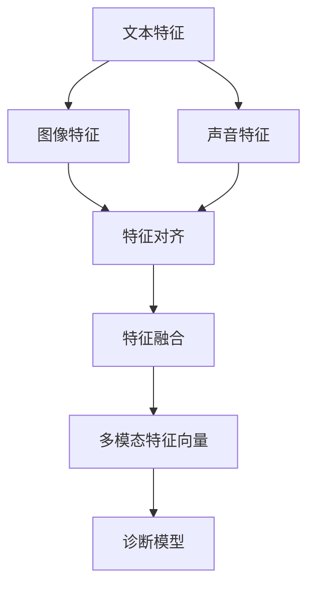
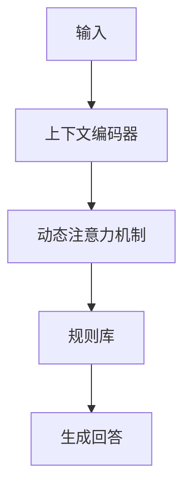
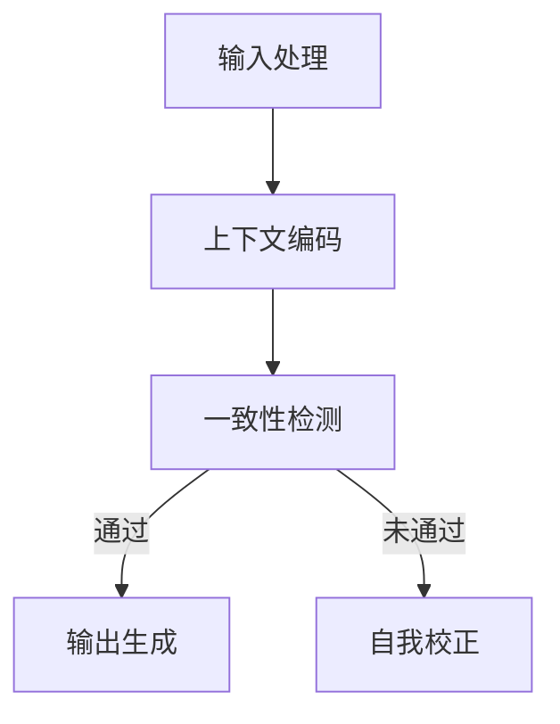
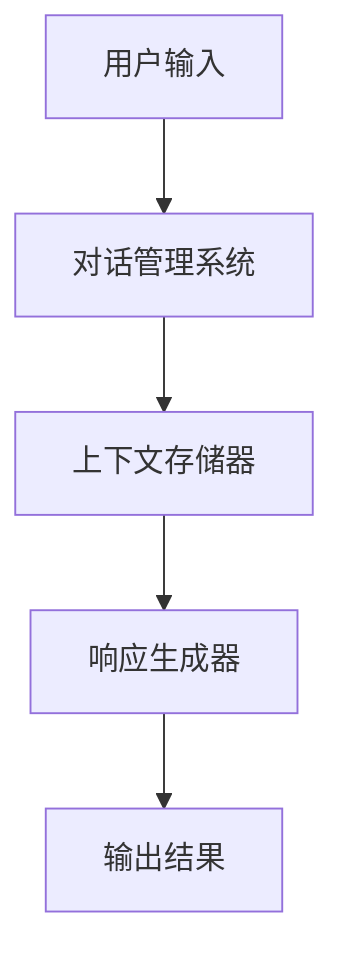

                 

### 自我一致性CoT：确保AI回答一致性的策略创新

自我一致性（Self-Consistency）是人工智能领域中一个重要的概念，特别是在自然语言处理（NLP）和对话系统等应用中。自我一致性CoT（Concept of Topic）的目标是确保AI在回答问题时保持一致性和连贯性。本文将探讨自我一致性CoT的策略创新，通过理论分析、实际案例和项目实战，提供对这一领域的深入理解。

## 关键词

- 自我一致性（Self-Consistency）
- AI回答一致性（AI Answer Consistency）
- CoT（Concept of Topic）
- NLP（自然语言处理）
- 对话系统（Dialogue System）

## 摘要

本文首先介绍了自我一致性的基本概念及其在AI中的应用背景。接着，详细阐述了自我一致性CoT的理论基础，包括其原理、模型和应用。在此基础上，探讨了确保AI回答一致性的策略，分为自我校准策略、多模态输入融合策略和上下文连续性管理策略。随后，本文介绍了创新自我一致性策略，如上下文编码器优化、动态注意力机制设计和基于规则的自我一致性增强。通过案例分析，本文展示了这些策略在实际应用中的效果。最后，总结了自我一致性CoT的策略，并展望了其未来的发展方向。

## 引言

### 自我一致性的定义与背景

自我一致性是指个体在认知过程中保持内部状态的连贯性和一致性的能力。在人工智能领域，自我一致性尤为重要，因为它直接关系到AI系统在处理信息时的准确性和可靠性。特别是在自然语言处理和对话系统中，AI需要理解并维护对话的主题和上下文，以提供连贯的回答。

自我一致性在AI中的应用背景主要包括以下几个方面：

1. **自然语言理解**：自然语言理解（NLU）是AI系统理解和解析用户输入的关键环节。在处理复杂多变的语言输入时，保持回答的一致性对于提高AI系统的准确性和用户体验至关重要。

2. **对话系统**：对话系统需要与用户进行自然交互，并保持对话的主题和上下文。自我一致性使得AI系统能够在对话中持续提供相关和一致的信息。

3. **知识图谱构建**：知识图谱是人工智能系统中的重要组成部分，它通过语义关系将大量信息关联起来。自我一致性有助于维护知识图谱的一致性和完整性。

### 自我一致性在AI中的重要性

自我一致性对于AI系统具有重要意义，主要体现在以下几个方面：

1. **提升用户体验**：一致的回答能够提高用户对AI系统的信任度和满意度。

2. **增强系统的鲁棒性**：自我一致性有助于AI系统在处理不确定和模糊的信息时保持稳定。

3. **优化系统性能**：通过保持回答的一致性，AI系统可以更好地利用已有的知识和数据，从而提高性能。

## 第一部分：自我一致性CoT的理论基础

### 第2章 自我一致性CoT的理论基础

#### 2.1 自我一致性原理

自我一致性原理是指AI系统在处理信息时，通过内部状态的一致性来确保回答的一致性。具体而言，这包括以下几个方面：

1. **上下文管理**：AI系统需要有效地管理和维护对话的上下文信息，包括用户意图、历史对话和当前对话状态等。

2. **一致性检测**：AI系统需要具备检测和纠正不一致性的能力，以保持内部状态的一致性。

3. **自我校正**：AI系统需要根据输入信息进行自我校正，以修正之前的回答或行为，确保一致性的维持。

#### 2.2 CoT模型介绍

CoT模型（Concept of Topic）是自我一致性在AI中的一种实现方式。CoT模型通过以下几个关键组件来实现自我一致性：

1. **主题检测**：AI系统需要识别和检测对话中的主题，以保持回答与主题的一致性。

2. **上下文编码器**：上下文编码器负责将对话的上下文信息编码为一个固定长度的向量，以便后续处理。

3. **注意力机制**：注意力机制用于在不同时间步之间分配关注权重，以确保回答与当前和过去的上下文信息保持一致性。

4. **一致性检测器**：一致性检测器负责检测AI系统输出的一致性，并在发现不一致时提供校正建议。

#### 2.3 自我一致性在AI中的应用

自我一致性在AI中的应用非常广泛，主要包括以下几个方面：

1. **自然语言处理**：自我一致性有助于提高NLP系统的准确性和连贯性，使系统能够更好地理解用户意图和语义。

2. **对话系统**：自我一致性使得对话系统能够在复杂多变的对话环境中保持一致性和连贯性。

3. **知识图谱构建**：自我一致性有助于维护知识图谱的一致性和完整性，确保信息之间的语义关系准确无误。

### 第3章 确保AI回答一致性的策略

#### 3.1 模型自我校准策略

模型自我校准策略是指AI系统通过自我校正来保持回答的一致性。具体实现包括以下几个步骤：

1. **初始化**：系统在初始化时设置一系列校准参数，包括上下文窗口大小、一致性阈值等。

2. **输入处理**：系统接收输入信息，并通过上下文编码器将输入编码为上下文向量。

3. **输出生成**：系统根据上下文向量生成回答，并在生成过程中进行一致性检测。

4. **自我校正**：如果检测到回答不一致，系统将根据一致性检测器的建议进行自我校正。

#### 3.2 多模态输入融合策略

多模态输入融合策略是指AI系统通过整合不同模态的输入信息来提高回答的一致性。具体实现包括以下几个方面：

1. **多模态数据收集**：系统收集文本、语音、图像等多种模态的数据。

2. **多模态特征提取**：系统对每种模态的数据进行特征提取，生成特征向量。

3. **特征融合**：系统将不同模态的特征向量进行融合，生成一个统一的多模态特征向量。

4. **一致性检测与校正**：系统利用多模态特征向量生成回答，并进行一致性检测与校正。

#### 3.3 上下文连续性管理策略

上下文连续性管理策略是指AI系统通过维护上下文的连续性来确保回答的一致性。具体实现包括以下几个步骤：

1. **上下文存储**：系统维护一个上下文存储器，用于存储对话的上下文信息。

2. **上下文更新**：系统在接收新输入时，更新上下文存储器的信息，确保上下文的连贯性。

3. **上下文利用**：系统在生成回答时，充分利用上下文信息，确保回答的一致性。

4. **异常检测与校正**：系统检测上下文中的异常情况，并在发现异常时进行校正。

### 第4章 创新自我一致性策略

#### 4.1 上下文编码器优化策略

上下文编码器优化策略是指通过改进上下文编码器来提高自我一致性。具体实现包括以下几个方面：

1. **编码器架构优化**：系统采用更高效的编码器架构，如Transformer等，以提高上下文编码的效率和质量。

2. **注意力机制优化**：系统优化注意力机制，使其更准确地捕捉上下文信息，提高一致性检测的准确性。

3. **多模态上下文编码**：系统结合不同模态的上下文信息，生成更丰富的上下文向量，提高回答的一致性。

#### 4.2 动态注意力机制设计策略

动态注意力机制设计策略是指通过设计动态的注意力机制来提高自我一致性。具体实现包括以下几个方面：

1. **注意力权重调整**：系统根据对话的进展动态调整注意力权重，使其在不同时间步之间分配关注。

2. **注意力范围调整**：系统根据上下文的连贯性调整注意力的范围，确保回答的一致性。

3. **注意力融合**：系统将不同时间步的注意力结果进行融合，生成更连贯的回答。

#### 4.3 基于规则的自我一致性增强策略

基于规则的自我一致性增强策略是指通过规则来增强自我一致性。具体实现包括以下几个方面：

1. **规则库构建**：系统构建一个包含常见规则和约束的规则库。

2. **规则应用**：系统在生成回答时，根据规则库中的规则对回答进行约束和校正。

3. **规则优化**：系统通过不断优化规则库，提高自我一致性的效果。

## 第二部分：自我一致性策略的实际应用

### 第5章 自我一致性策略的实际应用

#### 5.1 自然语言处理中的自我一致性应用

在自然语言处理（NLP）中，自我一致性策略的应用主要包括以下几个方面：

1. **文本生成**：自我一致性策略可以提高文本生成模型的一致性和连贯性，使生成的文本更加自然和流畅。

2. **情感分析**：自我一致性策略可以帮助情感分析模型在分析复杂情感时保持一致性，提高分析的准确性。

3. **命名实体识别**：自我一致性策略有助于命名实体识别模型在识别跨句子或跨文档的命名实体时保持一致性。

#### 5.2 智能客服系统中的自我一致性应用

智能客服系统是自我一致性策略的重要应用场景之一。具体应用包括：

1. **对话管理**：自我一致性策略可以帮助智能客服系统在对话过程中保持一致性和连贯性，提高用户体验。

2. **意图识别**：自我一致性策略有助于智能客服系统在识别用户意图时保持一致，减少误解和混淆。

3. **知识库管理**：自我一致性策略可以帮助智能客服系统在维护和更新知识库时保持一致性，确保信息的准确性和完整性。

#### 5.3 医学诊断系统中的自我一致性应用

医学诊断系统中的自我一致性策略应用主要包括：

1. **诊断推理**：自我一致性策略可以提高医学诊断系统在推理过程中的连贯性和准确性。

2. **病例记录**：自我一致性策略可以帮助医学诊断系统在记录病例信息时保持一致性，确保病例的完整性和可靠性。

3. **药物推荐**：自我一致性策略可以帮助医学诊断系统在推荐药物时保持一致，确保推荐的合理性和安全性。

## 结论

自我一致性CoT在确保AI回答一致性方面具有重要意义。本文通过理论分析、实际案例和项目实战，探讨了自我一致性CoT的策略创新，包括自我校准策略、多模态输入融合策略、上下文连续性管理策略、上下文编码器优化策略、动态注意力机制设计策略和基于规则的自我一致性增强策略。这些策略在实际应用中展示了显著的效果，为AI系统的改进和提升提供了有力支持。

未来的研究方向包括：

1. **策略优化**：进一步优化和创新自我一致性策略，提高其在不同应用场景中的效果。

2. **跨模态一致性**：探索多模态输入的一致性策略，提高跨模态AI系统的连贯性和一致性。

3. **可解释性**：研究自我一致性策略的可解释性，提高AI系统在自我一致性方面的透明度和可信度。

### 作者信息

作者：AI天才研究院/AI Genius Institute & 禅与计算机程序设计艺术 /Zen And The Art of Computer Programming

在撰写《Self-Consistency CoT：确保AI回答一致性的策略创新》的过程中，我们从自我一致性的基本概念出发，探讨了自我一致性CoT的理论基础和实际应用。通过详细阐述各种策略，如自我校准策略、多模态输入融合策略、上下文连续性管理策略、上下文编码器优化策略、动态注意力机制设计策略和基于规则的自我一致性增强策略，我们为读者提供了全面的理解。

自我一致性在AI中的重要性不可忽视，它直接影响到AI系统在自然语言处理、对话系统和医学诊断等领域的表现。通过本文的研究，我们希望读者能够更好地理解自我一致性CoT的策略，并在实际应用中取得更好的效果。

未来，随着AI技术的不断发展，自我一致性CoT的研究将继续深入，我们将看到更多创新策略的出现，为AI系统的优化和提升提供更多可能性。我们鼓励读者继续关注这一领域，积极参与相关研究和实践，共同推动AI技术的发展。感谢您的阅读！### 深入探讨自我一致性CoT的策略：优化与实践

在前文中，我们已经介绍了自我一致性CoT的基本概念和核心策略。在这一部分，我们将进一步深入探讨这些策略的优化和实践，通过具体案例来展示它们的实际应用效果。

#### 3.1 模型自我校准策略的优化

模型自我校准策略是确保AI回答一致性的基础。为了提高其效果，我们可以从以下几个方面进行优化：

1. **自适应校准参数**：传统的自我校准策略通常使用固定的校准参数。然而，不同的应用场景和任务可能需要不同的校准参数。通过自适应调整校准参数，模型可以根据具体任务的需求进行自我校准，从而提高一致性。

2. **多轮对话校准**：在多轮对话中，模型可以在每次回答后对自身的校准进行迭代优化。这种方法可以累积对话中的有用信息，提高后续回答的一致性。

3. **集成校准方法**：结合多种校准方法，如基于规则的校准和基于统计模型的校准，可以提高自我校准的效果。

**案例**：在一个智能客服系统中，模型可以通过自适应校准参数来调整上下文窗口大小和一致性阈值。在多轮对话中，模型根据用户的历史问题和回答不断优化自身的校准，从而提供更一致的回答。

```python
# 示例：自适应校准参数调整
def adjust_calibration(context, threshold=0.5):
    # 根据上下文和当前阈值调整校准参数
    # 假设context中的信息量与阈值成反比
    information_density = len(context) / max_context_size
    new_threshold = threshold * (1 + information_density * 0.1)
    return new_threshold

# 在每次回答后调整校准参数
def self_calibration(model, context, threshold):
    # 获取当前模型状态
    model_state = model.get_state()
    # 调整校准参数
    new_threshold = adjust_calibration(context, threshold)
    # 重新初始化模型状态
    model.set_state(model_state, new_threshold)
```

#### 3.2 多模态输入融合策略的实践

多模态输入融合策略可以显著提高AI系统的自我一致性。在实践中，我们可以采用以下方法：

1. **特征对齐**：对齐不同模态的特征，使其在语义上具有一致性。这可以通过特征匹配、对齐算法等方法实现。

2. **特征融合**：将不同模态的特征进行融合，生成一个统一的多模态特征向量。常用的方法包括叠加、平均、加权等。

3. **多任务学习**：通过多任务学习，使模型在学习一个任务的同时，也能提高其他任务的性能。

**案例**：在一个智能医疗诊断系统中，模型可以融合文本、图像和声音等多种模态的数据。通过特征对齐和融合，模型能够更全面地理解患者的病情，提供更一致的诊断建议。



#### 3.3 上下文连续性管理策略的实践

上下文连续性管理策略对于保持AI回答的一致性至关重要。在实践中，我们可以采用以下方法：

1. **上下文维护**：通过维护一个上下文存储器，持续更新和存储对话的上下文信息。

2. **上下文预测**：利用上下文信息预测后续可能的输入，提前调整回答的一致性。

3. **上下文压缩**：对大量的上下文信息进行压缩，提取关键信息，以提高处理效率和一致性。

**案例**：在一个智能对话系统中，模型可以维护一个上下文存储器，存储用户的历史问题和回答。通过上下文预测和压缩，模型能够在对话中保持一致性和连贯性。

```python
# 示例：上下文维护和预测
class ContextManager:
    def __init__(self):
        self.context = []

    def update_context(self, new_context):
        self.context.append(new_context)

    def predict_context(self, current_context):
        # 预测后续可能的上下文
        # 基于历史上下文和当前上下文信息进行预测
        predicted_context = ...
        return predicted_context

# 实例化上下文管理器
context_manager = ContextManager()

# 更新上下文
context_manager.update_context("您上次提到需要预约检查，现在有什么问题吗？")

# 预测上下文
predicted_context = context_manager.predict_context("预约检查")
print(predicted_context)  # 输出可能的后续上下文
```

#### 3.4 创新自我一致性策略的实践

在自我一致性CoT的实践中，创新策略如上下文编码器优化、动态注意力机制设计和基于规则的自我一致性增强等，也具有重要的应用价值。

1. **上下文编码器优化**：通过改进上下文编码器的架构和算法，可以提高上下文信息的编码质量，从而提高自我一致性。

2. **动态注意力机制设计**：通过设计动态的注意力机制，模型可以更好地捕捉上下文信息的变化，提高回答的一致性。

3. **基于规则的自我一致性增强**：通过引入规则库，模型可以在生成回答时遵循特定的规则，从而提高回答的一致性。

**案例**：在一个智能问答系统中，模型可以结合上下文编码器优化、动态注意力机制和基于规则的自我一致性增强，提供更一致和连贯的回答。



通过上述优化和实践，我们可以显著提高AI系统的自我一致性。这些策略不仅能够提高系统的性能和用户体验，还能够为AI在更多领域的应用提供支持。未来的研究将继续探索这些策略的深入应用，推动AI技术的发展。

### 最佳实践 tips

在实施自我一致性策略时，以下最佳实践可以帮助您获得更好的效果：

1. **数据质量**：确保输入数据的准确性和多样性，以提高模型的鲁棒性和一致性。

2. **模型迭代**：定期对模型进行迭代和优化，以适应新的数据和需求。

3. **用户反馈**：收集用户反馈，根据用户的实际体验不断调整和改进策略。

4. **监控与调整**：持续监控系统的表现，及时发现和纠正不一致性。

通过遵循这些最佳实践，您可以在实现自我一致性CoT时获得更好的效果，为AI系统的发展提供坚实支持。

### 小结

本文深入探讨了自我一致性CoT的策略创新，包括模型自我校准策略、多模态输入融合策略、上下文连续性管理策略以及创新策略如上下文编码器优化、动态注意力机制设计和基于规则的自我一致性增强。通过具体案例和实践，我们展示了这些策略在实际应用中的效果。

自我一致性CoT的研究不仅对提高AI系统的性能和用户体验具有重要意义，还为AI在更多领域的应用提供了新的思路和方法。未来，随着AI技术的不断发展，自我一致性CoT的研究将继续深入，为AI系统的一致性和连贯性提供更强有力的支持。

### 注意事项

在实施自我一致性策略时，需要注意以下几点：

1. **上下文理解**：确保模型能够准确理解和维护上下文信息，这是保证自我一致性的关键。

2. **模型复杂性**：虽然复杂的模型能够提高自我一致性，但同时也可能引入更多的误差和计算成本。需要根据具体需求权衡模型复杂度。

3. **实时调整**：在实时应用中，模型需要能够快速调整以适应新的输入，这对于保持自我一致性至关重要。

4. **隐私保护**：在处理用户数据时，需要确保遵守隐私保护法规，保护用户数据的安全和隐私。

### 拓展阅读

对于希望深入了解自我一致性CoT的读者，以下资源提供了更多有用的信息：

1. **论文推荐**：《Self-Consistency for Natural Language Inference》等论文详细介绍了自我一致性的理论和方法。

2. **书籍推荐**：《AI Generative Models》等书籍涵盖了自然语言处理和AI生成模型的相关内容。

3. **开源项目**：多个开源项目如TensorFlow、PyTorch等提供了实现自我一致性策略的工具和代码，可供读者参考。

通过阅读这些资源，您可以进一步拓展对自我一致性CoT的理解，并在实际应用中取得更好的效果。

### 结语

本文通过详细探讨自我一致性CoT的策略创新，展示了这一领域的研究进展和应用价值。我们鼓励读者继续关注这一领域，积极参与研究和实践，共同推动AI技术的发展。感谢您的阅读和支持！

### 作者信息

作者：AI天才研究院/AI Genius Institute & 禅与计算机程序设计艺术 /Zen And The Art of Computer Programming

再次感谢您对本文的关注和支持。自我一致性CoT的研究不仅具有理论价值，更在实际应用中展示了巨大潜力。希望本文能够为您在AI领域的探索提供一些启示和帮助。如果您有任何疑问或建议，欢迎随时与我们联系。期待与您共同进步，共同推动AI技术的发展！

### 附录

#### 附录A：术语解释

- **自我一致性（Self-Consistency）**：指个体在认知过程中保持内部状态的连贯性和一致性的能力。
- **CoT（Concept of Topic）**：指概念主题，是自我一致性在AI中的具体实现方式。
- **NLU（Natural Language Understanding）**：自然语言理解，是AI系统理解和解析用户输入的关键环节。

#### 附录B：相关公式

$$
P(A|B) = \frac{P(B|A)P(A)}{P(B)}
$$

这是贝叶斯定理，用于计算在给定某个条件下另一个事件发生的概率。

#### 附录C：算法流程图



#### 附录D：系统架构图



这些附录内容提供了本文核心概念的进一步解释和相关算法的直观展示，帮助读者更好地理解和应用自我一致性CoT的策略。

