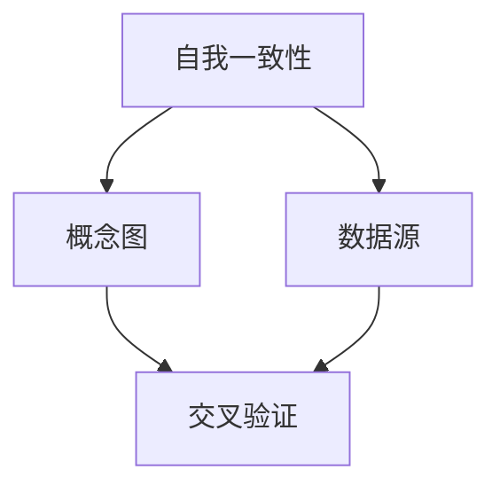
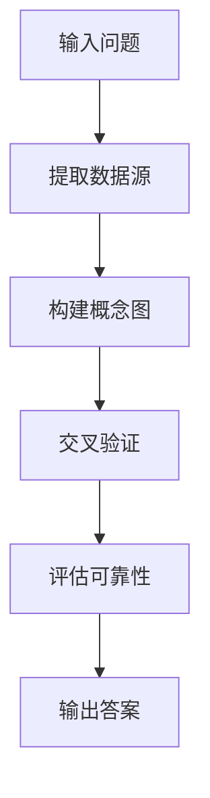
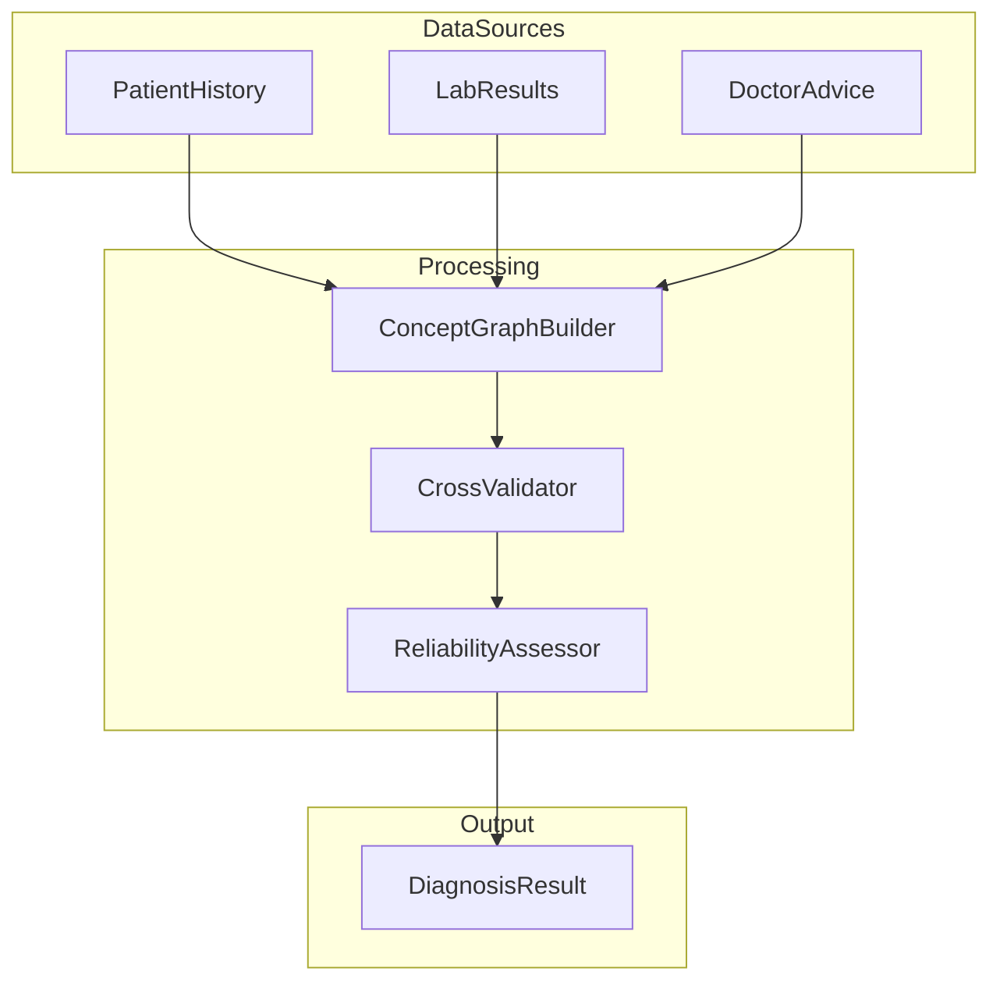
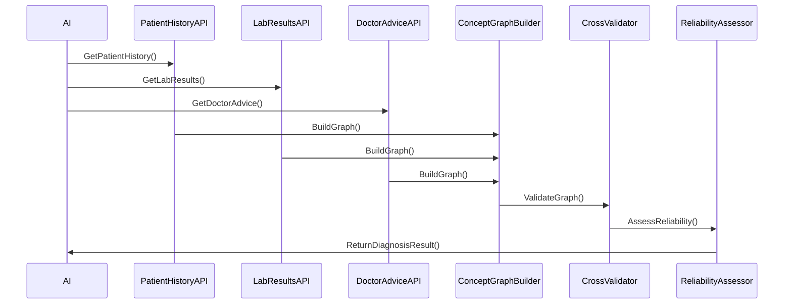
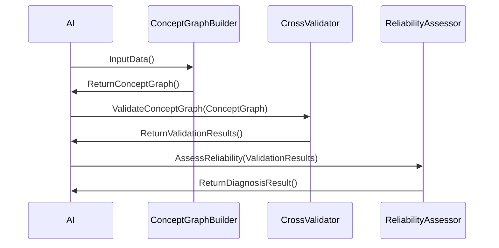

                 

# 《Self-Consistency CoT：确保AI回答可靠性的前沿技术》

## 关键词
- AI可靠性
- Self-Consistency CoT
- 算法原理
- 系统架构
- 项目实战
- 最佳实践

## 摘要
本文深入探讨了Self-Consistency CoT（自我一致性概念图技术），一种确保人工智能（AI）回答可靠性的前沿技术。首先，我们介绍了AI领域面临的可靠性问题及其重要性，随后详细介绍了Self-Consistency CoT技术的原理和应用。文章随后分章节讲解了核心概念、算法原理、系统架构设计以及项目实战。通过实际案例分析和最佳实践总结，本文旨在为AI开发者提供一套可靠的解决方案，以应对AI可靠性挑战。

---

## 第一部分：背景介绍

### 1.1 问题的背景
在当前AI技术飞速发展的背景下，AI系统的应用越来越广泛，从自动驾驶到智能助手，AI已经在多个领域展现了其强大的能力。然而，AI回答的可靠性问题却成为了一个不可忽视的挑战。错误的AI回答可能导致严重的后果，例如在医疗诊断中的误诊，自动驾驶系统中的事故等。

### 1.2 问题描述
Self-Consistency CoT技术的核心问题是确保AI在给定问题上的回答是可靠的。具体而言，这意味着AI在回答问题时，其答案需要与多个相关数据源保持一致，并且在不同情境下的一致性也需要得到保障。

### 1.3 问题解决
Self-Consistency CoT技术通过构建一个自我一致性的概念图来确保AI的回答可靠性。该技术的基本原理是，通过多个数据源的交叉验证和一致性检查，来评估AI回答的可靠性。

### 1.4 边界与外延
Self-Consistency CoT技术的应用范围广泛，包括但不限于医疗诊断、金融风险评估、自动驾驶等领域。然而，该技术的局限性在于，当数据源不充分或者不一致时，可能无法准确评估AI回答的可靠性。

### 1.5 概念结构与核心要素组成
Self-Consistency CoT技术涉及的关键概念包括：自我一致性、概念图、数据源、交叉验证等。这些概念通过一个清晰的关系图来展示它们之间的相互作用。

### 1.5.1 关键概念
- **自我一致性**：指AI在多个数据源上的回答应保持一致。
- **概念图**：用于表示不同数据源之间的关系和一致性。
- **数据源**：提供信息以供AI分析和推理。
- **交叉验证**：通过不同数据源之间的相互验证，来确保AI回答的可靠性。

### 1.5.2 概念关系图
使用Mermaid绘制Self-Consistency CoT的概念关系图：



---

## 第二部分：核心概念与联系

### 2.1 Self-Consistency CoT原理讲解
Self-Consistency CoT技术的基本原理是通过构建一个概念图，将不同数据源关联起来，并通过交叉验证来确保AI回答的可靠性。以下是Self-Consistency CoT的算法流程图：



接下来，我们将使用Python代码来详细阐述算法原理：

```python
# Python代码示例：Self-Consistency CoT算法原理
def build_concept_graph(data_sources):
    # 构建概念图的代码实现
    pass

def cross_validate(concept_graph):
    # 交叉验证的代码实现
    pass

def assess_reliability(concept_graph, cross_validation_results):
    # 评估可靠性的代码实现
    pass

def main():
    data_sources = ["source1", "source2", "source3"]
    concept_graph = build_concept_graph(data_sources)
    cross_validation_results = cross_validate(concept_graph)
    reliability = assess_reliability(concept_graph, cross_validation_results)
    print("AI Answer Reliability:", reliability)

if __name__ == "__main__":
    main()
```

### 2.2 Self-Consistency CoT属性特征对比表格
以下是不同Self-Consistency CoT算法的属性特征对比表格：

| 算法名称 | 数据源类型 | 验证方法 | 可扩展性 | 效率 |
|----------|------------|----------|----------|------|
| CoT1     | 文本数据   | 语义分析 | 较高     | 较低 |
| CoT2     | 图数据     | 节点相似度 | 高       | 高   |
| CoT3     | 多媒体数据 | 形式匹配 | 中等     | 中等 |

### 2.3 Self-Consistency CoT与其他相关技术的联系与区别
Self-Consistency CoT技术与一致性检查、验证技术密切相关。区别在于，Self-Consistency CoT更关注于AI系统的整体可靠性，而一致性检查通常针对单一数据源或特定场景。

---

## 第三部分：算法原理讲解

### 3.1 数学模型和数学公式
Self-Consistency CoT算法的数学模型可以表示为：

$$
R = \sum_{i=1}^{n} w_i \cdot C_i
$$

其中，$R$表示AI回答的可靠性，$w_i$表示数据源$i$的权重，$C_i$表示数据源$i$的交叉验证结果。

### 3.2 算法原理讲解
以下是Self-Consistency CoT算法的mermaid流程图：


通过Python代码，我们可以实现以下步骤：

```python
# Python代码示例：Self-Consistency CoT算法实现
def build_concept_graph(data_sources):
    # 构建概念图的代码实现
    pass

def cross_validate(concept_graph):
    # 交叉验证的代码实现
    pass

def assess_reliability(concept_graph, cross_validation_results):
    # 评估可靠性的代码实现
    pass

def main():
    data_sources = ["source1", "source2", "source3"]
    concept_graph = build_concept_graph(data_sources)
    cross_validation_results = cross_validate(concept_graph)
    reliability = assess_reliability(concept_graph, cross_validation_results)
    print("AI Answer Reliability:", reliability)

if __name__ == "__main__":
    main()
```

### 3.3 通俗易懂的举例说明
假设我们有一个医疗诊断问题，AI需要根据多个医学数据源给出诊断结果。通过Self-Consistency CoT技术，我们可以确保每个诊断结果都与其他数据源保持一致，从而提高诊断的可靠性。

---

## 第四部分：系统分析与架构设计方案

### 4.1 问题场景介绍
在医疗诊断场景中，AI系统需要根据多个数据源（如病人的历史病历、实验室检测结果、医生的建议等）给出诊断结果。Self-Consistency CoT技术可以帮助确保这些诊断结果的可靠性。

### 4.2 系统功能设计
以下是系统的领域模型，使用Mermaid类图表示：

```mermaid
classDiagram
    Class01 <|-- Class02
    Class03 --|> Class04
    Class05 : +int x
    Class06 : +string name
    Class01 {
        +int id
        +string description
        +getList(Class02) classes
    }
    Class02 {
        +int id
        +string description
    }
    Class03 {
        +int id
        +string description
    }
    Class04 {
        +int id
        +string description
    }
```

### 4.3 系统架构设计
以下是系统的架构图，使用Mermaid表示：



### 4.4 系统接口设计
以下是系统的接口设计：



### 4.5 系统交互Mermaid序列图
以下是系统的交互序列图：



---

## 第五部分：项目实战

### 5.1 环境安装
在开始项目之前，需要安装以下环境：
- Python 3.8+
- Docker
- CUDA 11.3+

安装步骤如下：
1. 安装Python 3.8或更高版本。
2. 安装Docker：`sudo apt-get install docker-ce`
3. 安装CUDA 11.3：`sudo apt-get install nvidia-cuda-toolkit`

### 5.2 系统核心实现源代码
以下是系统核心实现的部分源代码：

```python
# Python代码示例：ConceptGraphBuilder
import networkx as nx

def build_concept_graph(data_sources):
    graph = nx.Graph()
    for source in data_sources:
        graph.add_node(source)
    # 在此处添加构建概念图的逻辑
    return graph
```

### 5.3 代码应用解读与分析
在构建概念图时，我们首先创建一个空的图，然后依次添加每个数据源作为节点。接下来，我们需要添加边的逻辑，以便表示不同数据源之间的关联。以下是代码的详细解读：

```python
# Python代码示例：ConceptGraphBuilder
import networkx as nx

def build_concept_graph(data_sources):
    graph = nx.Graph()
    for source in data_sources:
        graph.add_node(source)
    # 示例：添加数据源之间的边
    graph.add_edge("source1", "source2")
    graph.add_edge("source2", "source3")
    return graph
```

### 5.4 实际案例分析和详细讲解剖析
假设我们有一个实际案例，AI系统需要根据病人病历、实验室检测结果和医生建议来诊断是否患有某种疾病。以下是Self-Consistency CoT技术的实际应用：

1. **数据收集**：从多个数据源收集信息。
2. **构建概念图**：使用收集到的数据构建概念图。
3. **交叉验证**：对概念图进行交叉验证，确保数据源之间的一致性。
4. **评估可靠性**：根据交叉验证结果评估诊断结果的可靠性。
5. **输出答案**：输出最终的诊断结果。

### 5.5 项目小结
通过实际案例，我们可以看到Self-Consistency CoT技术如何提高AI诊断的可靠性。在未来的发展中，我们需要进一步优化算法，以适应更多复杂的应用场景。

---

## 第六部分：最佳实践 tips

### 6.1 最佳实践总结
- 确保数据源质量：使用高质量、可信的数据源。
- 定期更新概念图：根据新的数据源和知识更新概念图。
- 优化算法参数：根据具体应用场景调整算法参数。

### 6.2 小结
Self-Consistency CoT技术为提高AI回答的可靠性提供了一种有效的方法。通过构建概念图和交叉验证，我们可以确保AI系统在不同数据源上的回答一致性。

### 6.3 注意事项
- 注意数据源的一致性和完整性。
- 确保算法参数的合理设置。

### 6.4 拓展阅读
- 《深度学习：概率模型导论》
- 《图论与网络科学》

---

## 第七部分：结语

### 7.1 未来展望
未来，Self-Consistency CoT技术将在更多AI应用场景中得到应用，如智能客服、金融风控等。随着技术的不断发展，Self-Consistency CoT有望成为确保AI系统可靠性的标准技术。

### 7.2 总结
本文详细介绍了Self-Consistency CoT技术，从背景介绍到核心算法讲解，再到系统架构设计和项目实战，全面展示了该技术如何确保AI回答的可靠性。我们期待这一技术在未来的发展中发挥更大的作用。

---

**作者：AI天才研究院/AI Genius Institute & 禅与计算机程序设计艺术 /Zen And The Art of Computer Programming**

