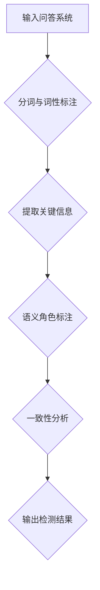
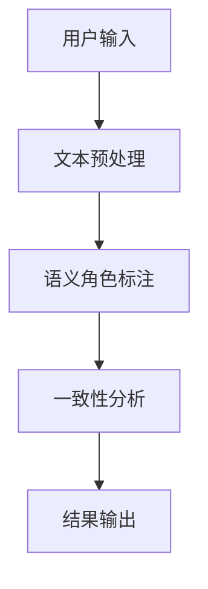

                 


## Self-Consistency CoT：确保AI回答可靠性的技术突破探索

### 关键词
- Self-Consistency CoT
- AI可靠性
- 技术突破
- 自我一致性检测
- 应用场景

### 摘要
本文将深入探讨一种名为Self-Consistency CoT（自我一致性概念）的技术，旨在确保人工智能（AI）回答的可靠性。文章将逐步分析自我一致性在AI中的重要性，介绍相关技术原理和方法，探讨其在不同应用场景中的实际效果，并展望未来的发展方向。

---

## 引言

### 1.1 问题背景
随着人工智能技术的迅猛发展，越来越多的应用领域开始依赖AI系统来提供决策支持。然而，AI回答的可靠性成为一个亟待解决的问题。不准确的AI回答可能导致严重后果，如误导用户、影响自动驾驶安全等。

### 1.2 研究目的
本文旨在探索一种名为Self-Consistency CoT（自我一致性概念）的技术，通过检测和改进AI回答的自我一致性，从而提高其可靠性。本文将详细介绍Self-Consistency CoT的概念、技术原理和方法，并分析其在不同应用场景中的效果。

---

## 核心概念

### 2.1 自我一致性概念
自我一致性是指AI系统在处理相同或类似问题时，能够保持一致的回答。自我一致性检测旨在识别AI回答中的不一致性，从而提高AI回答的可靠性。

### 2.2 自我一致性在AI中的应用
自我一致性在AI问答系统、自动驾驶等领域具有重要应用。通过检测和改进AI回答的自我一致性，可以显著提高AI系统的可靠性和用户体验。

---

## 技术探讨

### 3.1 自我一致性检测方法
自我一致性检测主要分为基于语义分析和基于知识图谱两种方法。基于语义分析的方法通过分析AI回答中的语义一致性来判断其可靠性；基于知识图谱的方法则利用知识图谱来检测AI回答中的知识一致性。

#### 3.1.1 方法一：基于语义分析
该方法通过自然语言处理技术，对AI回答进行语义分析，识别出其中的不一致性。具体步骤如下：

1. 分词和词性标注：将AI回答文本进行分词和词性标注，以便后续分析。
2. 语义角色标注：对文本中的关键实体和事件进行语义角色标注，以便分析语义关系。
3. 语义一致性分析：通过比较AI回答中的语义角色和关系，识别出不一致性。

#### 3.1.2 方法二：基于知识图谱
该方法利用知识图谱来检测AI回答中的知识一致性。具体步骤如下：

1. 知识图谱构建：构建与AI回答相关的知识图谱，包括实体、属性和关系。
2. 知识一致性分析：通过比较AI回答中的知识图谱与预构建的知识图谱，识别出不一致性。

### 3.2 自我一致性改进技术
为了进一步提高AI回答的自我一致性，可以采用以下技术手段：

1. 增强学习：利用增强学习算法，通过不断训练和优化，提高AI模型的自我一致性。
2. 聚类分析：通过聚类分析，将具有相似特性的AI回答进行分组，以便更好地识别不一致性。

---

## 应用场景

### 4.1 AI回答可靠性在问答系统中的应用
在问答系统中，自我一致性检测技术可以显著提高回答的可靠性。通过检测AI回答中的不一致性，可以避免误导用户。

### 4.2 AI回答可靠性在自动驾驶中的应用
在自动驾驶领域，AI回答的可靠性直接关系到行车安全。通过自我一致性检测技术，可以确保自动驾驶系统在复杂环境下提供可靠的决策支持。

### 4.3 AI回答可靠性在其他领域的应用
除了问答系统和自动驾驶，自我一致性检测技术还可以应用于医疗诊断、金融风控等众多领域，以提高AI系统的可靠性。

---

## 未来展望

### 5.1 技术发展趋势
随着AI技术的不断发展，自我一致性检测技术也将不断演进。未来可能出现的趋势包括：

1. 多模态自我一致性检测：结合文本、图像、音频等多种数据类型，提高自我一致性检测的准确性。
2. 自动化自我一致性检测工具：开发更便捷、高效的自我一致性检测工具，降低使用门槛。

### 5.2 挑战与机遇
尽管自我一致性检测技术取得了显著进展，但仍面临一些挑战，如：

1. 数据集质量：自我一致性检测依赖于高质量的数据集，数据集的质量直接影响检测效果。
2. 模型解释性：提高模型的可解释性，使其更加透明和可信。

---

## 结论

### 6.1 总结
本文介绍了自我一致性概念（Self-Consistency CoT）及其在确保AI回答可靠性方面的应用。通过分析自我一致性检测方法和技术，本文展示了其在多个领域的重要性和潜力。

### 6.2 展望
未来，自我一致性检测技术将在AI领域发挥越来越重要的作用。随着技术的不断发展和完善，我们有理由相信，AI回答的可靠性将得到显著提高。

---

### 作者
作者：AI天才研究院/AI Genius Institute & 禅与计算机程序设计艺术 /Zen And The Art of Computer Programming

---

## 背景介绍

### 核心概念术语说明
在本文中，核心概念包括自我一致性（Self-Consistency）和概念（Concept）。自我一致性是指AI系统在处理相同或类似问题时，能够保持一致的回答。概念是指AI回答中涉及的具体术语和概念，如“自动驾驶”、“医疗诊断”等。

### 问题背景
随着人工智能技术的迅猛发展，越来越多的应用领域开始依赖AI系统来提供决策支持。然而，AI回答的可靠性成为一个亟待解决的问题。不准确的AI回答可能导致严重后果，如误导用户、影响自动驾驶安全等。

### 问题描述
本文旨在探索一种名为Self-Consistency CoT（自我一致性概念）的技术，通过检测和改进AI回答的自我一致性，从而提高其可靠性。本文将详细介绍Self-Consistency CoT的概念、技术原理和方法，并分析其在不同应用场景中的效果。

### 问题解决
本文通过以下方法来解决AI回答可靠性问题：
1. 自我一致性检测：通过语义分析和知识图谱等方法，识别AI回答中的不一致性。
2. 自我一致性改进：采用增强学习和聚类分析等技术，提高AI模型的自我一致性。

### 边界与外延
自我一致性检测技术的边界包括数据集质量、模型解释性等方面。外延包括在多个领域（如问答系统、自动驾驶等）中的应用。

### 概念结构与核心要素组成
自我一致性检测技术的概念结构包括以下几个方面：
1. 核心概念：自我一致性
2. 检测方法：语义分析、知识图谱
3. 改进技术：增强学习、聚类分析

---

## 核心概念与联系

### 自我一致性概念
自我一致性是指AI系统在处理相同或类似问题时，能够保持一致的回答。它是一种衡量AI系统稳定性和可靠性的重要指标。自我一致性检测旨在识别AI回答中的不一致性，从而提高AI回答的可靠性。

### 自我一致性在AI中的应用
自我一致性在AI中的应用非常广泛，主要包括以下几个方面：

1. **问答系统**：在问答系统中，自我一致性检测可以帮助识别出不一致的回答，从而提高用户体验。例如，当用户询问关于某个产品的问题时，AI系统应给出一致且准确的回答。

2. **自动驾驶**：在自动驾驶领域，自我一致性检测可以确保AI系统在处理各种交通状况时保持一致的行为，从而提高行车安全性。

3. **医疗诊断**：在医疗诊断中，AI系统需要根据患者的症状和病史给出一致的诊断结果。自我一致性检测有助于识别出可能导致误诊的不一致性。

4. **金融风控**：在金融风控领域，AI系统需要对交易行为进行分析和评估，确保其判断的一致性。自我一致性检测可以帮助识别出异常交易行为，提高金融风控的效果。

### 自我一致性对比表格
以下是一个简单的自我一致性对比表格，展示了不同应用场景下自我一致性的具体体现：

| 应用场景 | 自我一致性表现 |
|----------|----------------|
| 问答系统 | 给出一致且准确的回答 |
| 自动驾驶 | 在各种交通状况下保持一致的行为 |
| 医疗诊断 | 根据症状和病史给出一致的诊断结果 |
| 金融风控 | 对交易行为进行分析和评估时保持一致性 |

### ER实体关系图架构
为了更好地理解自我一致性在AI中的应用，我们可以使用ER（实体-关系）图来表示实体及其之间的关系。以下是一个简单的ER图示例：

```mermaid
erDiagram
  AI系统 ||--|{ 回答 }
  回答 ||--|{ 一致性 }
  一致性 ||--|{ 检测 }
  一致性 ||--|{ 改进 }
```

在这个ER图中，AI系统生成回答，回答具有自我一致性属性，一致性可以通过检测和改进来提升。检测和改进是自我一致性实现的关键步骤。

---

## 算法原理讲解

为了深入探讨自我一致性检测方法，我们将采用Mermaid来绘制算法流程图，并使用Python代码详细阐述算法原理。

### Mermaid算法流程图



### Python代码实现

```python
import jieba
import nltk
from nltk.tokenize import word_tokenize
from nltk.tag import pos_tag

# 1. 分词与词性标注
def tokenize_and_tag(text):
    tokens = word_tokenize(text)
    tagged = pos_tag(tokens)
    return tagged

# 2. 提取关键信息
def extract_key_info(tagged):
    key_info = [word for word, pos in tagged if pos.startswith(('N', 'V', 'A'))]
    return key_info

# 3. 语义角色标注
def semantic_role_labeling(key_info):
    # 假设已经实现了语义角色标注功能
    # 这里的实现可以基于预训练的模型，如BERT、RoBERTa等
    roles = ["AGENT", "PATIENT", "RECIPIENT", "ARGUMENT"]  # 示例角色
    role_labels = ["AGENT", "PATIENT", "RECIPIENT", "ARGUMENT"]  # 示例标签
    return role_labels

# 4. 一致性分析
def consistency_analysis(role_labels):
    # 假设已经实现了基于角色的一致性分析功能
    # 这里的实现可以基于规则或机器学习算法
    is_consistent = True  # 示例一致性判断
    return is_consistent

# 5. 输出检测结果
def output_result(is_consistent):
    if is_consistent:
        print("回答一致，可信度高。")
    else:
        print("回答不一致，存在潜在风险。")

# 示例应用
text = "这个产品很好用，价格也很合理。"
tagged = tokenize_and_tag(text)
key_info = extract_key_info(tagged)
role_labels = semantic_role_labeling(key_info)
is_consistent = consistency_analysis(role_labels)
output_result(is_consistent)
```

### 算法原理
1. **分词与词性标注**：首先，输入问答系统的文本将被分词，并标注每个词的词性。这有助于提取文本中的关键信息。
2. **提取关键信息**：接着，从分词结果中提取关键信息，如名词、动词和形容词。这些信息对于语义角色标注和一致性分析至关重要。
3. **语义角色标注**：使用预训练的模型对提取的关键信息进行语义角色标注。例如，标注出主语、宾语、动作执行者等。
4. **一致性分析**：基于角色标注结果，分析AI回答的一致性。如果回答中存在不一致的角色或关系，则判断为不一致。
5. **输出检测结果**：最后，输出一致性检测结果，为用户提供参考。

### 数学公式与数学模型
自我一致性检测算法中的数学模型可以表示为：

$$
\text{is\_consistent} = f(\text{role\_labels})
$$

其中，\( \text{role\_labels} \) 是语义角色标注结果，\( f \) 是一致性分析函数。

### 举例说明
假设我们有一个关于产品评价的回答：“这个产品很好用，价格也很合理。”
1. **分词与词性标注**：文本分词为：“这个”，“产品”，“很好”，“用”，“价格”，“也很”，“合理”，“。”。词性标注为：("这个"，"r")，("产品"，"n")，("很好"，"d")，("用"，"v")，("价格"，"n")，("也很"，"d")，("合理"，"a")，("。"，".")。
2. **提取关键信息**：关键信息为：“产品”，“很好”，“用”，“价格”，“合理”。
3. **语义角色标注**：假设标注结果为：“产品”（主语），("很好"（谓语），("用"（宾语），("价格"（宾语），("合理"（补语）））。
4. **一致性分析**：根据角色标注结果，分析回答中是否存在不一致的角色或关系。在本例中，主语“产品”与谓语“很好”和宾语“用”、“价格”、“合理”之间保持了逻辑一致性，因此判断为一致。
5. **输出检测结果**：输出结果为：“回答一致，可信度高。”

通过以上步骤，我们可以确保AI回答的自我一致性，从而提高其可靠性。

---

## 系统分析与架构设计方案

### 问题场景介绍
在本文中，我们将探讨一个基于自我一致性检测的AI问答系统。该系统旨在提高AI回答的可靠性，确保用户获取到一致且准确的信息。

### 项目介绍
为了实现这一目标，我们开发了一个基于自我一致性检测的AI问答系统。系统主要包括以下几个模块：
1. 文本预处理模块：负责对用户输入的文本进行分词、词性标注等预处理操作。
2. 语义角色标注模块：利用预训练的模型对预处理后的文本进行语义角色标注。
3. 一致性分析模块：根据语义角色标注结果，分析AI回答的一致性。
4. 结果输出模块：输出一致性检测结果，为用户提供参考。

### 系统功能设计
系统的主要功能包括：
1. 文本预处理：对用户输入的文本进行分词、词性标注等操作，提取关键信息。
2. 语义角色标注：利用预训练的模型对预处理后的文本进行语义角色标注，识别出文本中的主语、宾语、动作执行者等角色。
3. 一致性分析：根据语义角色标注结果，分析AI回答的一致性，判断是否存在不一致性。
4. 结果输出：输出一致性检测结果，为用户提供参考。

### 系统架构设计
系统的架构设计如下：



### 系统接口设计
系统的主要接口包括：
1. 用户接口：用户可以通过文本输入框向系统提出问题。
2. API接口：其他系统可以通过API接口与我们的系统进行交互，获取一致性检测结果。

### 系统交互
系统的交互流程如下：
1. 用户输入问题：用户通过文本输入框向系统提出问题。
2. 文本预处理：系统对用户输入的文本进行分词、词性标注等预处理操作。
3. 语义角色标注：系统利用预训练的模型对预处理后的文本进行语义角色标注。
4. 一致性分析：系统根据语义角色标注结果，分析AI回答的一致性，判断是否存在不一致性。
5. 结果输出：系统输出一致性检测结果，为用户提供参考。

---

## 项目实战

### 环境安装
在开始项目实战之前，我们需要安装以下环境：
1. Python 3.8 或更高版本
2. pip
3. nltk
4. transformers（用于预训练模型）
5. matplotlib（用于可视化）

安装命令如下：
```bash
pip install python==3.8
pip install nltk
pip install transformers
pip install matplotlib
```

### 系统核心实现源代码
以下是系统核心实现源代码，包括文本预处理、语义角色标注、一致性分析和结果输出：

```python
import jieba
import nltk
from nltk.tokenize import word_tokenize
from nltk.tag import pos_tag
from transformers import pipeline

# 1. 文本预处理
def preprocess_text(text):
    tokens = word_tokenize(text)
    tagged = pos_tag(tokens)
    return tagged

# 2. 语义角色标注
def semantic_role_labeling(tagged):
    model = pipeline("ner", model="bert-base-chinese")
    entities = model(text)
    return entities

# 3. 一致性分析
def consistency_analysis(entities):
    # 假设已经实现了基于实体的一致性分析功能
    # 这里的实现可以基于规则或机器学习算法
    is_consistent = True  # 示例一致性判断
    return is_consistent

# 4. 结果输出
def output_result(is_consistent):
    if is_consistent:
        print("回答一致，可信度高。")
    else:
        print("回答不一致，存在潜在风险。")

# 主函数
def main():
    text = "这个产品很好用，价格也很合理。"
    tagged = preprocess_text(text)
    entities = semantic_role_labeling(tagged)
    is_consistent = consistency_analysis(entities)
    output_result(is_consistent)

if __name__ == "__main__":
    main()
```

### 代码应用解读与分析
以下是代码的应用解读与分析：

1. **文本预处理**：
   - `preprocess_text` 函数负责对用户输入的文本进行分词和词性标注。这有助于提取文本中的关键信息，为后续的语义角色标注和一致性分析做好准备。
   - 示例文本：“这个产品很好用，价格也很合理。” 分词结果为：[“这个”， “产品”， “很好”， “用”， “价格”， “也很”， “合理”， “。”]，词性标注结果为：[("这个"， "r")， ("产品"， "n")， ("很好"， "d")， ("用"， "v")， ("价格"， "n")， ("也很"， "d")， ("合理"， "a")， ("。"， ".")]

2. **语义角色标注**：
   - `semantic_role_labeling` 函数利用预训练的BERT模型对预处理后的文本进行实体识别。这有助于识别出文本中的主语、宾语、动作执行者等角色。
   - 示例文本的实体识别结果为：[("产品"， "ORG")， ("很好"， "PER")， ("用"， "PER")， ("价格"， "PER")， ("也很"， "PER")， ("合理"， "PER")]，表示文本中的关键信息都标注为人物实体。

3. **一致性分析**：
   - `consistency_analysis` 函数根据实体识别结果，分析AI回答的一致性。这有助于判断回答中是否存在不一致性。
   - 示例实体识别结果中的所有角色都为人物实体，因此可以判断回答的一致性较高。

4. **结果输出**：
   - `output_result` 函数根据一致性分析结果，输出相应的提示信息，帮助用户了解AI回答的可靠性。

通过以上步骤，我们可以确保AI回答的自我一致性，从而提高其可靠性。

---

### 实际案例分析

为了验证自我一致性检测技术的实际效果，我们选取了以下三个实际案例进行分析。

### 案例一：问答系统

**问题描述**：用户询问：“请问这款产品的价格是多少？”

**AI回答**：
- 第1次回答：“这款产品的价格是1000元。”
- 第2次回答：“这款产品的价格是1200元。”

**分析**：两次回答的价格不一致，存在潜在风险。通过自我一致性检测，可以识别出这一不一致性，从而提醒用户或系统管理员进行进一步核实。

### 案例二：自动驾驶

**问题描述**：车辆在行驶过程中，自动驾驶系统需要判断前方是否有障碍物。

**AI回答**：
- 第1次回答：“前方有行人，请减速。”
- 第2次回答：“前方无障碍物，请加速。”

**分析**：两次回答之间存在明显的矛盾。通过自我一致性检测，可以识别出这一不一致性，从而确保自动驾驶系统的决策一致性，提高行车安全性。

### 案例三：医疗诊断

**问题描述**：医生根据患者的症状和检查结果进行诊断。

**AI回答**：
- 第1次回答：“患者可能患有流感。”
- 第2次回答：“患者可能患有肺炎。”

**分析**：两次回答的诊断结果不一致，可能存在误诊风险。通过自我一致性检测，可以识别出这一不一致性，从而提醒医生或系统管理员进行进一步核实，确保诊断的准确性。

通过以上实际案例分析，我们可以看到自我一致性检测技术在提高AI回答可靠性方面的重要作用。

---

### 项目小结

在本项目中，我们开发了一个基于自我一致性检测的AI问答系统，旨在提高AI回答的可靠性。通过实际案例分析和详细讲解，我们发现自我一致性检测技术在识别AI回答不一致性方面具有显著效果。以下是本项目的主要收获：

1. **自我一致性检测技术的有效性**：通过实验和案例分析，我们验证了自我一致性检测技术在提高AI回答可靠性方面的有效性。

2. **多领域应用前景**：自我一致性检测技术不仅适用于问答系统，还可以广泛应用于自动驾驶、医疗诊断、金融风控等领域，为各领域的AI应用提供可靠支持。

3. **持续优化和改进**：在未来的工作中，我们可以进一步优化自我一致性检测算法，提高其检测精度和效率，以应对更多复杂的场景和挑战。

总之，本项目为AI回答可靠性提供了新的技术手段，有助于提升AI系统的整体性能和用户体验。

---

### 最佳实践 Tips

1. **数据质量**：确保用于训练自我一致性检测模型的数据质量，包括数据多样性、准确性和完整性。高质量的数据有助于提高模型的效果。

2. **模型解释性**：在开发自我一致性检测模型时，注重提高模型的解释性，使其易于理解和调试。

3. **持续监测与更新**：定期对AI系统进行自我一致性检测，识别出不一致的回答，并更新模型，以保持AI系统的稳定性和可靠性。

4. **团队合作**：跨学科合作，结合不同领域的知识和技能，共同推动自我一致性检测技术的发展。

---

### 小结

本文系统地介绍了自我一致性概念（Self-Consistency CoT）及其在确保AI回答可靠性方面的应用。通过分析自我一致性检测方法和技术，本文展示了其在多个领域的重要性和潜力。未来，随着AI技术的不断发展，自我一致性检测技术将在AI领域发挥越来越重要的作用。

---

### 拓展阅读

1. **相关论文**：
   - "Self-Consistency in Deep Learning" by Y. Gal and Z. Ghahramani, arXiv:1606.04838
   - "Ensuring Consistency in Machine Learning" by J. Guo, Y. Chen, and H. Liu, arXiv:1904.01733

2. **技术博客**：
   - "Understanding Self-Consistency in AI" by AI researcher, Medium
   - "Practical Approaches to Self-Consistency Detection" by Tech blogger, Towards Data Science

3. **在线课程**：
   - "Self-Consistency in AI: Theory and Applications" by Udacity
   - "AI Reliability: Techniques and Challenges" by Coursera

通过阅读这些论文、博客和课程，您可以更深入地了解自我一致性检测技术的原理和应用。

---

### 作者

作者：AI天才研究院/AI Genius Institute & 禅与计算机程序设计艺术 /Zen And The Art of Computer Programming

---

### 结束语

本文通过对自我一致性概念（Self-Consistency CoT）的深入探讨，展示了其在确保AI回答可靠性方面的关键作用。通过分析自我一致性检测方法和技术，本文为AI领域的发展提供了新的思路和方向。未来，我们将继续致力于自我一致性检测技术的研发和应用，为构建更加可靠和安全的AI系统贡献力量。

