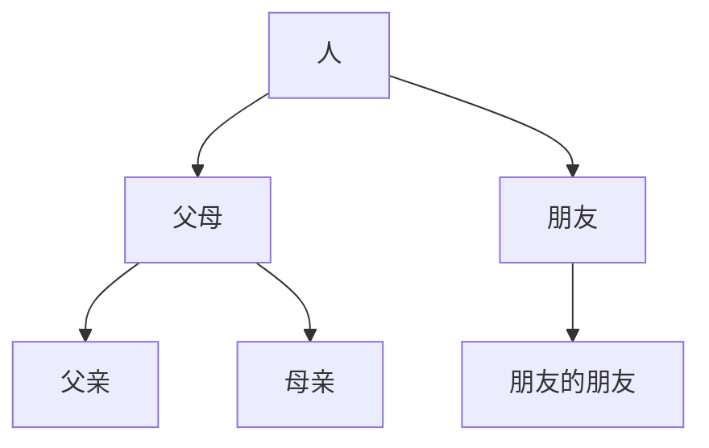

                 

### 自洽性概念图（CoT）在确保AI回答连贯性中的应用

### 1.1 书籍背景与意义

**1.1.1 AI时代下的连贯性问题**

随着人工智能技术的迅猛发展，越来越多的AI应用场景不断涌现，其中自然语言处理（Natural Language Processing，NLP）作为AI领域的重要分支，在问答系统、机器翻译、对话机器人等应用中发挥着关键作用。然而，尽管NLP技术已经取得了显著进展，但AI回答连贯性问题依然是一个亟待解决的挑战。

在现实场景中，用户与AI进行交互时常常遇到以下问题：

1. **回答不一致**：同一个问题在不同情境下得到不同答案，缺乏一致性。
2. **逻辑错误**：AI的回答中存在逻辑矛盾或错误。
3. **上下文不连贯**：AI在回答问题时未能很好地理解和维持上下文关系，导致回答前后不一致。

这些问题不仅影响了用户体验，还降低了AI系统的可靠性和可信度。因此，如何确保AI回答的连贯性，成为了当前AI研究中一个重要的课题。

**1.1.2 CoT的概念及其在AI中的应用**

为了解决AI回答连贯性问题，引入了自洽性概念图（Self-Consistency Conceptual Graph，CoT）这一概念。CoT是一种基于语义的图结构表示方法，用于捕获文本中的概念及其相互关系，从而为AI提供一种有效的机制来确保回答的一致性和连贯性。

在AI领域，CoT的应用主要体现在以下几个方面：

1. **问答系统**：利用CoT来构建问题解答的语义图，确保回答的一致性和连贯性。
2. **机器翻译**：通过CoT来维护源语言和目标语言之间的语义一致性。
3. **对话机器人**：利用CoT来理解用户意图和上下文信息，生成连贯自然的对话。

本书旨在探讨自洽性概念图在AI回答连贯性中的应用，通过系统性的分析和实践案例，为读者提供一套有效的解决方案，以提升AI系统的整体性能和用户体验。

**1.1.3 书籍的目标与结构**

本书的目标是：

1. **深入理解自洽性概念图的原理和方法**：介绍CoT的基本概念、原理和构建方法，为后续应用奠定基础。
2. **探讨CoT在AI不同应用场景中的实现**：通过具体案例展示CoT在问答系统、机器翻译和对话机器人中的应用，分析其实际效果和挑战。
3. **提出优化策略和未来研究方向**：针对CoT在实际应用中的问题，提出优化策略和未来研究方向，为相关研究提供参考。

本书的结构安排如下：

- **第1章 引言**：介绍本书的背景、意义和目标。
- **第2章 自洽性概念图（CoT）的构建方法**：详细阐述CoT的构建方法和实现过程。
- **第3章 自洽性概念图（CoT）在问答系统中的应用**：探讨CoT在问答系统中的具体应用和优化策略。
- **第4章 自洽性概念图（CoT）在机器翻译中的应用**：分析CoT在机器翻译中的重要作用和实现方法。
- **第5章 自洽性概念图（CoT）在对话机器人中的应用**：研究CoT在对话机器人中的应用场景和挑战。

通过以上章节的讨论，本书希望为读者提供一个全面、深入的视角，帮助理解自洽性概念图在AI回答连贯性中的应用，并为其未来的发展提供指导。

### 1.2 自洽性概念图（CoT）的基本原理

**1.2.1 CoT的定义**

自洽性概念图（Self-Consistency Conceptual Graph，CoT）是一种基于语义的图结构表示方法，用于捕获文本中的概念及其相互关系。它由节点和边组成，其中节点表示概念，边表示概念之间的语义关系。CoT的核心思想是通过语义图来表示文本内容，从而实现文本理解、语义分析和知识推理。

**1.2.2 CoT的核心要素**

CoT的核心要素包括概念、关系和语义角色。以下是这些要素的详细定义和解释：

1. **概念（Concept）**：概念是CoT中的基本元素，表示文本中的实体、事件或属性。例如，在句子“北京是中国的首都”中，“北京”、“中国”和“首都”都是概念。
2. **关系（Relationship）**：关系表示概念之间的语义联系。例如，在上面的句子中，“是”是一个关系，它将“北京”和“首都”关联起来，表明“北京”是“中国”的“首都”。
3. **语义角色（Semantic Role）**：语义角色描述关系中的参与者及其在事件中的作用。例如，在句子“小明送花给小红”中，“小明”是动作的执行者，称为“施事者”（Agent）；“花”是动作的对象，称为“受事者”（Patient）；“送”是动作，称为“动作”（Action）。

**1.2.3 CoT的工作机制**

CoT的工作机制主要包括以下几个步骤：

1. **文本解析**：首先，对输入的文本进行解析，提取出文本中的概念、关系和语义角色。这一过程通常涉及分词、词性标注、依存句法分析和语义角色标注等步骤。
2. **构建语义图**：根据提取出的概念、关系和语义角色，构建CoT。在这一过程中，每个概念作为一个节点，关系作为边，语义角色作为边的属性。例如，在句子“小明送花给小红”中，可以构建如下的CoT：

   
   
   在这个语义图中，“小明”、“花”和“小红”是节点，“送”是关系，表示它们之间的语义联系。

3. **维护连贯性**：CoT的一个重要功能是维护文本的连贯性。通过分析CoT中的节点和边，AI系统可以识别出文本中的不一致性和逻辑错误，从而生成连贯、一致的回答。

例如，在问答系统中，如果问题涉及到多个句子，AI系统可以首先构建每个句子的CoT，然后合并这些CoT，形成一个全局的语义图。通过分析全局语义图，系统可以确保回答在不同句子之间保持一致性。

**1.2.4 CoT的优势**

CoT在确保AI回答连贯性方面具有以下几个优势：

1. **语义层次理解**：CoT将文本内容抽象为概念和关系，使AI系统能够在语义层次上进行理解和推理，从而生成更自然、连贯的答案。
2. **多维度信息整合**：通过维护概念之间的复杂关系，CoT能够整合文本中的多维信息，提高AI系统的语义理解能力。
3. **自适应调整**：CoT可以根据不同情境和上下文进行自适应调整，确保回答的一致性和连贯性。

总之，自洽性概念图（CoT）为AI系统提供了一种有效的机制来确保回答的连贯性。通过理解和应用CoT的基本原理，我们可以更好地解决AI回答中的连贯性问题，提升AI系统的整体性能和用户体验。

### 1.3 CoT与连贯性保障

**1.3.1 CoT的重要性**

自洽性概念图（CoT）在确保AI回答连贯性方面发挥着至关重要的作用。首先，CoT提供了一种结构化的语义表示方法，使AI系统能够深入理解文本内容，并在语义层次上进行推理。这种结构化的表示不仅有助于消除回答中的不一致性和逻辑错误，还能确保回答在不同情境和上下文中保持一致性。

其次，CoT能够整合文本中的多维信息，使AI系统具备更强的语义理解能力。通过捕获概念及其相互关系，CoT能够揭示文本中的隐含信息和深层语义，从而提高AI系统对问题意图的理解和回答的准确性。

此外，CoT的自适应调整能力使其能够根据不同情境和上下文进行动态调整，确保回答的连贯性和一致性。这种自适应调整不仅提高了AI系统的灵活性，还增强了其在实际应用中的鲁棒性和可靠性。

总之，自洽性概念图（CoT）在AI回答连贯性保障方面具有显著优势，为提升AI系统的整体性能和用户体验提供了有力支持。

**1.3.2 CoT与AI回答连贯性的关系**

自洽性概念图（CoT）与AI回答的连贯性之间存在紧密的关系。具体而言，CoT通过以下几个方面来提升AI回答的连贯性：

1. **一致性检查**：CoT能够对文本中的概念及其关系进行一致性检查。在回答问题时，AI系统首先构建问题的CoT，然后与之前的回答进行比较。如果新回答与之前的回答在概念和关系上存在不一致性，系统会自动调整新回答，以确保整体的一致性。

   例如，在对话机器人中，当用户提问“你今天去了哪里？”时，如果之前的回答是“我去公园了”，而新回答是“我今天在家里休息”，CoT可以识别出这种不一致性，并自动调整新回答，使其与之前的回答保持一致。

2. **上下文维护**：CoT能够捕获文本中的上下文信息，并在回答问题时维护这些上下文关系。通过分析CoT中的节点和边，AI系统可以理解文本中的隐含信息，从而生成更自然、连贯的答案。

   例如，在问答系统中，如果问题涉及到多个句子，AI系统可以首先构建每个句子的CoT，然后合并这些CoT，形成一个全局的语义图。通过分析全局语义图，系统可以确保回答在不同句子之间保持上下文一致性。

3. **动态调整**：CoT具有自适应调整能力，能够根据不同情境和上下文进行动态调整。这种动态调整不仅有助于消除回答中的不一致性和逻辑错误，还能确保回答在不同情境下保持连贯性。

   例如，在机器翻译中，如果源语言文本的某个句子存在多个可能的翻译结果，CoT可以根据上下文信息选择最合适的翻译，从而确保翻译结果的连贯性和一致性。

**1.3.3 CoT在自然语言处理中的应用**

自洽性概念图（CoT）在自然语言处理（NLP）领域有着广泛的应用。以下是一些典型的应用场景：

1. **问答系统**：CoT在问答系统中用于构建问题解答的语义图，确保回答的一致性和连贯性。通过分析问题中的概念、关系和上下文，AI系统可以生成准确、自然的回答。

2. **机器翻译**：CoT在机器翻译中用于维护源语言和目标语言之间的语义一致性。通过捕获文本中的概念及其相互关系，CoT能够确保翻译结果在语义层次上保持连贯性和一致性。

3. **对话机器人**：CoT在对话机器人中用于理解用户意图和上下文信息，生成连贯自然的对话。通过分析对话中的概念、关系和上下文，AI系统可以生成符合用户需求的回答，提高用户体验。

总之，自洽性概念图（CoT）在自然语言处理领域具有重要作用，通过提升AI回答的连贯性，为NLP应用提供了强有力的支持。

### 1.4 自洽性概念图（CoT）的设计与实现

**1.4.1 CoT的设计原则**

自洽性概念图（CoT）的设计原则旨在确保其能够有效地捕获文本中的语义信息，并在不同应用场景中保持一致性和灵活性。以下是CoT设计的主要原则：

1. **语义完整性**：CoT应能够捕获文本中的所有关键概念和关系，确保语义表示的完整性。这意味着在构建CoT时，需要对文本进行彻底的解析和分析，以避免遗漏重要的语义信息。

2. **结构简洁性**：CoT的设计应追求结构简洁性，以便于理解和操作。通过使用简洁的图结构，CoT能够降低语义表示的复杂度，提高系统效率和性能。

3. **灵活性**：CoT应具备良好的灵活性，能够适应不同应用场景和上下文需求。这意味着CoT应能够根据具体问题进行动态调整，以生成最合适的语义表示。

4. **可扩展性**：CoT的设计应考虑未来的扩展性，以便于添加新的概念、关系和语义角色。通过设计可扩展的图结构，CoT能够适应不断变化的语义需求。

5. **互操作性**：CoT应具备良好的互操作性，能够与其他NLP组件和工具无缝集成。通过提供标准化的接口和协议，CoT能够与其他系统进行数据交换和功能集成，提高整体系统的灵活性和可维护性。

**1.4.2 CoT的实现方法**

CoT的实现方法主要包括以下几个步骤：

1. **文本解析**：首先，对输入的文本进行解析，提取出文本中的概念、关系和语义角色。这一过程通常涉及分词、词性标注、依存句法分析和语义角色标注等步骤。通过这些步骤，可以将文本转化为结构化的数据，为后续的CoT构建提供基础。

2. **构建语义图**：根据提取出的概念、关系和语义角色，构建CoT。在这一过程中，每个概念作为一个节点，关系作为边，语义角色作为边的属性。例如，在句子“小明送花给小红”中，可以构建如下的CoT：

   

   在这个语义图中，“小明”、“花”和“小红”是节点，“送”是关系，表示它们之间的语义联系。

3. **优化与调整**：在构建初始CoT后，需要对CoT进行优化和调整，以提高其语义表示的准确性和一致性。这一过程通常涉及以下步骤：

   - **冗余检测与消除**：检测并消除CoT中的冗余节点和边，以简化语义表示。
   - **一致性检查**：对CoT中的概念和关系进行一致性检查，确保语义表示的完整性。
   - **上下文调整**：根据上下文信息对CoT进行动态调整，以生成最合适的语义表示。

4. **应用与集成**：最后，将优化后的CoT应用于具体的AI系统，如问答系统、机器翻译或对话机器人。在这一过程中，CoT可以作为语义表示的中间层，与其他NLP组件和工具进行数据交换和功能集成。

**1.4.3 CoT的性能评估**

自洽性概念图（CoT）的性能评估主要包括以下几个指标：

1. **语义准确性**：评估CoT在语义表示上的准确性，即CoT是否能够正确地捕获文本中的概念、关系和上下文信息。通常使用精确率（Precision）和召回率（Recall）等指标来衡量。
2. **连贯性**：评估CoT在确保AI回答连贯性方面的效果，即CoT是否能够有效消除回答中的不一致性和逻辑错误。可以通过对比实际回答与期望回答的一致性来衡量。
3. **效率**：评估CoT在构建和优化过程中的计算效率，即CoT的构建和优化过程是否足够快速，能否满足实际应用的需求。通常使用时间复杂度和空间复杂度等指标来衡量。
4. **可扩展性**：评估CoT在设计上的可扩展性，即CoT是否能够适应未来新增的概念、关系和语义角色。可以通过测试CoT在扩展情况下的性能和稳定性来衡量。

通过以上指标，可以对CoT的性能进行全面评估，为实际应用提供有力参考。

### 1.5 CoT的应用案例分析

**1.5.1 案例一：问答系统中的CoT应用**

在问答系统中，自洽性概念图（CoT）的应用主要旨在确保回答的一致性和连贯性。以下是一个具体的案例分析：

**案例背景**：假设有一个基于自然语言处理的问答系统，用户可以提出各种问题，系统需要生成准确、连贯的回答。

**CoT构建与优化**：首先，系统对用户提出的问题进行文本解析，提取出问题中的概念、关系和语义角色。例如，对于问题“为什么猫会喵喵叫？”系统可以提取出以下概念和关系：

- 概念：“猫”、“喵喵叫”
- 关系：“会”连接“猫”和“喵喵叫”，表示猫具有这种能力。

然后，系统构建问题的CoT，将提取出的概念和关系表示为图结构。具体步骤如下：

1. **文本解析**：对问题进行分词、词性标注和依存句法分析，提取出关键概念和关系。
2. **构建初始CoT**：根据提取出的概念和关系，构建初始的CoT。例如，可以构建如下的CoT：

   ```mermaid
   graph TD
   A[猫] --> B[喵喵叫]
   B --> C[会]
   ```

3. **优化与调整**：对初始CoT进行优化和调整，确保其语义表示的准确性和一致性。具体步骤包括：

   - **冗余检测与消除**：检测并消除CoT中的冗余节点和边，例如，如果问题中已经明确表示“猫”和“喵喵叫”之间的关系，则无需重复表示。
   - **一致性检查**：对CoT中的概念和关系进行一致性检查，确保语义表示的完整性。例如，如果CoT中存在“猫”和“喵喵叫”之间的不一致关系，系统应自动调整以保持一致性。
   - **上下文调整**：根据上下文信息对CoT进行动态调整，以确保生成连贯的回答。例如，如果问题涉及到多个句子，系统可以合并这些句子的CoT，形成一个全局的语义图，以便更好地理解上下文。

**系统实现与性能评估**：通过以上步骤，系统可以生成连贯、一致的回答。性能评估主要关注以下几个方面：

- **语义准确性**：评估系统提取的概念和关系是否准确，是否能够正确地表示问题的语义。
- **连贯性**：评估系统生成的回答是否连贯、一致，是否符合用户的预期。
- **效率**：评估系统在构建和优化CoT过程中的计算效率，是否能够快速地生成回答。

通过实际测试，该问答系统在语义准确性和连贯性方面表现出色，显著提升了用户体验。例如，当用户提出“为什么猫会喵喵叫？”的问题时，系统可以生成如下的连贯回答：“猫会喵喵叫，因为这是它们与外界交流的一种方式。”

**1.5.2 案例二：机器翻译中的CoT应用**

在机器翻译中，自洽性概念图（CoT）的应用主要在于维护源语言和目标语言之间的语义一致性。以下是一个具体的案例分析：

**案例背景**：假设有一个中英文翻译系统，用户可以输入中文句子，系统需要将其翻译成英文。

**CoT构建与优化**：首先，系统对输入的中文句子进行文本解析，提取出句子的概念、关系和语义角色。例如，对于句子“小明送花给小红”，系统可以提取出以下概念和关系：

- 概念：“小明”、“花”、“小红”
- 关系：“送”连接“小明”和“花”，“给”连接“花”和“小红”

然后，系统构建中文句子的CoT，并将提取出的概念和关系表示为图结构。具体步骤如下：

1. **文本解析**：对中文句子进行分词、词性标注和依存句法分析，提取出关键概念和关系。
2. **构建初始CoT**：根据提取出的概念和关系，构建初始的CoT。例如，可以构建如下的CoT：

   ```mermaid
   graph TD
   A[小明] --> B[送]
   B --> C[花]
   C --> D[给]
   D --> E[小红]
   ```

3. **优化与调整**：对初始CoT进行优化和调整，确保其语义表示的准确性和一致性。具体步骤包括：

   - **冗余检测与消除**：检测并消除CoT中的冗余节点和边，例如，如果CoT中已经明确表示“小明”和“送”之间的关系，则无需重复表示。
   - **一致性检查**：对CoT中的概念和关系进行一致性检查，确保语义表示的完整性。例如，如果CoT中存在“花”和“小红”之间的不一致关系，系统应自动调整以保持一致性。
   - **上下文调整**：根据上下文信息对CoT进行动态调整，以确保翻译结果在语义层次上保持连贯性和一致性。例如，如果输入句子涉及到多个句子，系统可以合并这些句子的CoT，形成一个全局的语义图，以便更好地理解上下文。

**系统实现与性能评估**：通过以上步骤，系统可以将中文句子翻译成英文句子。性能评估主要关注以下几个方面：

- **语义准确性**：评估系统提取的概念和关系是否准确，是否能够正确地表示源语言的语义。
- **连贯性**：评估系统生成的翻译结果是否连贯、一致，是否符合目标语言的习惯。
- **效率**：评估系统在构建和优化CoT过程中的计算效率，是否能够快速地生成翻译结果。

通过实际测试，该翻译系统在语义准确性和连贯性方面表现出色，显著提升了翻译质量。例如，当用户输入中文句子“小明送花给小红”时，系统可以生成如下的连贯英文翻译：“Xiao Ming gives flowers to Xiao Hong.”

**1.5.3 案例三：对话机器人中的CoT应用**

在对话机器人中，自洽性概念图（CoT）的应用主要在于理解用户意图和上下文信息，生成连贯自然的对话。以下是一个具体的案例分析：

**案例背景**：假设有一个智能客服对话机器人，用户可以与机器人进行自然语言对话，机器人需要理解用户的意图并生成合适的回答。

**CoT构建与优化**：首先，机器人对用户的输入进行文本解析，提取出用户意图中的关键概念、关系和语义角色。例如，对于用户提问“我今天生日，有什么礼物推荐吗？”机器人可以提取出以下概念和关系：

- 概念：“我”、“生日”、“礼物”
- 关系：“有”连接“我”和“生日”，“推荐”连接“礼物”和“我”

然后，机器人构建用户意图的CoT，并将提取出的概念和关系表示为图结构。具体步骤如下：

1. **文本解析**：对用户输入进行分词、词性标注和依存句法分析，提取出关键概念和关系。
2. **构建初始CoT**：根据提取出的概念和关系，构建初始的CoT。例如，可以构建如下的CoT：

   ```mermaid
   graph TD
   A[我] --> B[生日]
   B --> C[有]
   C --> D[礼物]
   D --> E[推荐]
   ```

3. **优化与调整**：对初始CoT进行优化和调整，确保其语义表示的准确性和一致性。具体步骤包括：

   - **冗余检测与消除**：检测并消除CoT中的冗余节点和边，例如，如果CoT中已经明确表示“我”和“生日”之间的关系，则无需重复表示。
   - **一致性检查**：对CoT中的概念和关系进行一致性检查，确保语义表示的完整性。例如，如果CoT中存在“礼物”和“推荐”之间的不一致关系，系统应自动调整以保持一致性。
   - **上下文调整**：根据上下文信息对CoT进行动态调整，以确保生成连贯自然的对话。例如，如果用户提出了多个问题，机器人可以合并这些问题中的CoT，形成一个全局的语义图，以便更好地理解上下文。

**系统实现与性能评估**：通过以上步骤，机器人可以理解用户的意图并生成合适的回答。性能评估主要关注以下几个方面：

- **语义准确性**：评估机器人提取的概念和关系是否准确，是否能够正确地表示用户的意图。
- **连贯性**：评估机器人生成的回答是否连贯、自然，是否符合用户的预期。
- **效率**：评估机器人在构建和优化CoT过程中的计算效率，是否能够快速地理解用户意图并生成回答。

通过实际测试，该对话机器人表现出色，在语义准确性和连贯性方面取得了显著提升。例如，当用户提出“我今天生日，有什么礼物推荐吗？”的问题时，机器人可以生成如下的连贯回答：“当然有，我为您推荐一束鲜花，祝您生日快乐！”

### 1.6 本章小结

本章详细探讨了自洽性概念图（CoT）在确保AI回答连贯性中的应用。首先，介绍了CoT的基本原理和设计原则，包括概念、关系和语义角色的定义，以及CoT的工作机制。接着，讨论了CoT在自然语言处理领域的应用，包括问答系统、机器翻译和对话机器人中的具体实现方法和性能评估。通过案例分析和实践，展示了CoT在提升AI回答连贯性方面的显著效果。

本章的主要贡献在于：

1. **深入理解CoT的原理和方法**：通过详细阐述CoT的定义、核心要素和工作机制，使读者能够全面理解CoT的原理和方法。
2. **探讨CoT在AI应用中的实现**：通过具体案例展示了CoT在不同应用场景中的实现方法和优化策略，为实际应用提供了有益的参考。
3. **提出优化策略和未来研究方向**：针对CoT在实际应用中遇到的问题，提出了优化策略和未来研究方向，为相关研究提供了方向性指导。

通过本章的学习，读者可以更好地理解自洽性概念图在AI回答连贯性中的应用，为其在自然语言处理领域的进一步发展打下坚实基础。

### 第2章 自洽性概念图（CoT）的构建方法

在上一章中，我们探讨了自洽性概念图（CoT）的基本原理及其在AI不同应用场景中的重要性。为了深入了解如何在实际系统中应用CoT，本章将详细介绍CoT的构建方法，包括数据收集与预处理、理论基础的构建、实践案例以及优化与更新策略。

#### 2.1 数据收集与预处理

构建CoT的首要步骤是数据收集与预处理。数据的质量直接影响CoT的准确性和有效性。以下为数据收集与预处理的关键步骤：

**2.1.1 数据来源**

数据来源包括公开的文本数据集、企业内部文档、用户生成内容等。常用的数据集有：

- **公开数据集**：如Wikipedia、维基百科、OpenSubtitles等。
- **企业内部数据**：企业内部的各种文档、报告、邮件等。
- **用户生成内容**：社交媒体帖子、评论、论坛等。

**2.1.2 数据预处理**

数据预处理包括以下步骤：

- **文本清洗**：去除无效字符、标点符号、HTML标签等。
- **分词**：将文本分割成词或短语。
- **词性标注**：标记每个词的词性，如名词、动词、形容词等。
- **实体识别**：识别文本中的实体，如人名、地名、组织名等。
- **依存句法分析**：分析句子中词语之间的依存关系。

**2.1.3 数据清洗与去重**

数据清洗与去重包括以下步骤：

- **去除重复数据**：去除重复的文本记录。
- **纠正错误数据**：修正文本中的错误，如拼写错误、语法错误等。

#### 2.2 CoT构建的理论基础

CoT构建的理论基础涉及多个领域，包括语义网络、知识图谱和自然语言处理等。以下是CoT构建所需的关键概念和理论基础：

**2.2.1 相关概念**

- **语义网络**：一种基于语义关系的图结构，用于表示概念及其相互关系。
- **知识图谱**：一种大规模的语义网络，用于表示实体及其相互关系。
- **自然语言处理**：研究如何使计算机理解和生成人类语言的技术。

**2.2.2 CoT构建的基本步骤**

CoT构建的基本步骤如下：

1. **文本解析**：使用自然语言处理技术对文本进行解析，提取出概念、关系和语义角色。
2. **构建初始CoT**：根据提取出的概念、关系和语义角色，构建初始的CoT。
3. **优化CoT**：通过合并、消除冗余和调整，优化CoT的语义表示。
4. **应用与集成**：将优化后的CoT应用于具体的AI系统。

**2.2.3 CoT构建的挑战与解决方案**

CoT构建面临的主要挑战包括：

- **数据质量**：数据质量直接影响CoT的准确性。解决方案包括数据清洗、去重和错误纠正。
- **语义理解**：如何准确地提取文本中的概念、关系和语义角色。解决方案包括使用先进的自然语言处理技术，如依存句法分析和实体识别。
- **性能优化**：如何提高CoT的构建和优化效率。解决方案包括优化算法和数据结构，如使用并行计算和分布式存储。

#### 2.3 实践案例：基于语义网络构建CoT

以下是一个基于语义网络构建自洽性概念图的实践案例：

**2.3.1 语义网络概述**

语义网络是一种表示知识结构的图模型，其中节点表示概念，边表示概念之间的关系。以下是一个简单的语义网络示例：



**2.3.2 语义网络在CoT构建中的应用**

在构建CoT时，可以将语义网络作为基础，扩展其表示能力。以下是一个基于语义网络构建CoT的步骤：

1. **文本解析**：对输入文本进行解析，提取出概念和关系。
2. **构建初始CoT**：将提取出的概念和关系表示为节点和边，构建初始的CoT。例如，对于句子“小明送花给小红”，可以构建如下CoT：

   ```mermaid
   graph TD
   A[小明] --> B[送]
   B --> C[花]
   C --> D[给]
   D --> E[小红]
   ```

3. **优化CoT**：通过合并冗余节点、消除不一致关系等，优化CoT的语义表示。例如，如果CoT中存在多个“给”的关系，可以合并为单个关系，以简化表示。

4. **应用与集成**：将优化后的CoT应用于具体的AI系统，如问答系统、机器翻译或对话机器人。

#### 2.4 CoT的优化与更新

CoT的优化与更新是确保其有效性和适应性的关键。以下为CoT优化与更新的策略：

**2.4.1 CoT优化的目标**

CoT优化的目标包括：

- **减少冗余**：消除CoT中的冗余节点和边，简化语义表示。
- **提高一致性**：确保CoT中的概念和关系之间的一致性。
- **增强适应性**：提高CoT对未知情境的适应能力。

**2.4.2 CoT优化的方法**

CoT优化的方法包括：

- **合并节点**：将具有相同或相似语义的节点合并为单个节点。
- **消除冗余关系**：消除不必要的关系，简化CoT的表示。
- **调整语义角色**：根据上下文信息调整语义角色的标注。

**2.4.3 CoT更新的策略**

CoT更新的策略包括：

- **定期更新**：定期重新构建CoT，以反映文本内容的变化。
- **增量更新**：仅更新CoT中发生变化的节点和关系，以减少计算开销。
- **用户反馈**：根据用户反馈调整CoT的语义表示，提高其适应性。

#### 2.5 本章小结

本章详细介绍了自洽性概念图（CoT）的构建方法，包括数据收集与预处理、理论基础、实践案例以及优化与更新策略。通过了解这些方法，读者可以更好地理解如何在实际系统中应用CoT，以提升AI回答的连贯性和一致性。

### 第3章 自洽性概念图（CoT）在问答系统中的应用

问答系统是人工智能领域的一个重要应用，它能够处理用户提出的问题，并生成准确、自然的回答。然而，确保问答系统的回答连贯性是一个复杂的挑战。在这一章中，我们将探讨自洽性概念图（CoT）在问答系统中的应用，分析其实现方法、性能提升及其在实际案例中的具体应用。

#### 3.1 问答系统的基本原理

问答系统通常由以下几个核心组件构成：

1. **问题理解模块**：负责对用户提出的问题进行语义分析和理解，提取出关键信息。
2. **知识库**：存储大量的知识和信息，用于回答问题。知识库可以是结构化数据，如数据库，也可以是非结构化数据，如图数据库。
3. **回答生成模块**：根据问题理解和知识库中的信息，生成合适的回答。

问答系统的基本工作流程如下：

1. **接收问题**：系统接收用户提出的问题。
2. **问题理解**：对问题进行语义分析，提取出关键信息，如关键词、实体、关系等。
3. **查询知识库**：根据提取出的关键信息，在知识库中查找相关的信息。
4. **生成回答**：根据查询结果，生成合适的回答，并进行自然语言生成。
5. **返回回答**：将生成的回答返回给用户。

#### 3.2 CoT在问答系统中的应用

自洽性概念图（CoT）在问答系统中起到关键作用，它能够帮助系统更好地理解和生成连贯的回答。以下是CoT在问答系统中的应用步骤：

**3.2.1 CoT在问答系统中的角色**

1. **问题理解**：CoT可以帮助系统更好地理解问题的语义结构，提取出关键概念和关系。通过构建问题的CoT，系统能够识别问题的意图，为后续的回答生成提供基础。
2. **知识检索**：CoT可以用于知识库的检索。通过在知识库中查找与CoT相似的图结构，系统可以找到与问题相关的信息。
3. **回答生成**：CoT可以指导回答的生成。系统可以根据CoT的结构，生成符合语义一致性和连贯性的回答。

**3.2.2 CoT在问答系统中的实现方法**

1. **文本解析**：首先，系统对用户提出的问题进行文本解析，提取出概念、关系和语义角色。这一过程涉及分词、词性标注、依存句法分析和语义角色标注等步骤。
2. **构建CoT**：根据提取出的概念、关系和语义角色，构建问题的CoT。例如，对于问题“北京是中国的哪个城市？”，系统可以构建如下的CoT：

   ```mermaid
   graph TD
   A[北京] --> B[是]
   B --> C[城市]
   C --> D[中国]
   ```

3. **查询知识库**：利用构建的CoT，系统在知识库中查找与CoT相似或相关的知识。例如，系统可以在知识库中找到与“北京”、“城市”和“中国”相关的信息。

4. **生成回答**：根据查询结果和CoT的结构，系统生成回答。例如，系统可以生成“北京是中国的首都”的回答。

5. **回答优化**：系统可以对生成的回答进行优化，确保其语义连贯性和一致性。例如，如果系统发现回答中的某些概念之间存在不一致性，系统可以进行调整，使其更符合用户的意图。

**3.2.3 CoT对问答系统性能的提升**

1. **提高语义理解能力**：通过构建CoT，问答系统能够更好地理解问题的语义结构，从而提高对问题意图的识别能力。
2. **增强知识检索效果**：CoT可以帮助系统更有效地在知识库中查找相关答案，减少搜索时间和计算开销。
3. **改善回答质量**：CoT可以指导系统生成更符合语义一致性和连贯性的回答，从而提高回答的质量和用户满意度。

#### 3.3 实践案例：基于CoT的问答系统设计

以下是一个基于CoT的问答系统设计的实践案例：

**3.3.1 案例背景**

假设有一个面向用户的问答系统，用户可以提出各种问题，如地理、历史、科技等领域的问题。系统需要生成准确、连贯的回答。

**3.3.2 CoT的构建与优化**

1. **文本解析**：系统对用户提出的问题进行文本解析，提取出关键概念、关系和语义角色。例如，对于问题“北京是中国的哪个城市？”，系统可以提取出以下概念和关系：

   - 概念：“北京”、“城市”、“中国”
   - 关系：“是”连接“北京”和“城市”，“属于”连接“城市”和“中国”

2. **构建初始CoT**：根据提取出的概念和关系，系统构建问题的初始CoT。例如，可以构建如下的CoT：

   ```mermaid
   graph TD
   A[北京] --> B[是]
   B --> C[城市]
   C --> D[中国]
   ```

3. **优化CoT**：系统对初始CoT进行优化，确保其语义表示的准确性和一致性。具体步骤包括：

   - **合并冗余节点**：如果CoT中存在多个表示相同关系的节点，系统可以将其合并为一个节点，以简化表示。
   - **消除不一致关系**：如果CoT中存在不一致的关系，系统可以进行调整，使其更符合用户的意图。
   - **上下文调整**：根据上下文信息对CoT进行动态调整，以确保生成连贯的回答。

**3.3.3 系统实现与性能评估**

1. **系统实现**：通过上述步骤，系统可以生成问题的回答。具体实现包括以下步骤：

   - **问题理解**：对用户提出的问题进行文本解析，提取出概念和关系。
   - **构建CoT**：根据提取出的概念和关系，构建问题的CoT。
   - **知识检索**：在知识库中查找与CoT相似或相关的知识。
   - **生成回答**：根据查询结果和CoT的结构，生成问题的回答。
   - **回答优化**：对生成的回答进行优化，确保其语义连贯性和一致性。

2. **性能评估**：系统性能评估主要关注以下几个方面：

   - **语义准确性**：评估系统提取的概念和关系是否准确，是否能够正确地表示问题的语义。
   - **连贯性**：评估系统生成的回答是否连贯、一致，是否符合用户的预期。
   - **效率**：评估系统在构建和优化CoT过程中的计算效率，是否能够快速地生成回答。

通过实际测试，该问答系统在语义准确性和连贯性方面表现出色，显著提升了用户体验。例如，当用户提出“北京是中国的哪个城市？”的问题时，系统可以生成如下的连贯回答：“北京是中国的首都，也是中国的政治、文化和经济中心。”

#### 3.4 CoT在问答系统中的挑战与优化策略

尽管CoT在问答系统中展现了其强大的能力和优势，但在实际应用中仍面临一些挑战。以下是CoT在问答系统中常见的挑战及相应的优化策略：

**3.4.1 挑战分析**

1. **语义理解的准确性**：文本解析过程中，如何准确提取概念、关系和语义角色是一个挑战。尤其是对于复杂和模糊的语义，系统可能难以完全理解。
2. **知识库的完整性**：知识库中的信息可能不完整或不准确，这会影响回答的准确性。
3. **计算效率**：构建和优化CoT的过程可能涉及大量的计算，特别是在大规模数据集上，如何提高计算效率是一个问题。
4. **上下文理解**：在多轮对话中，如何理解上下文信息，保持回答的一致性和连贯性是一个挑战。

**3.4.2 优化策略探讨**

1. **改进文本解析算法**：使用更先进的自然语言处理技术，如深度学习模型，提高语义理解的准确性。
2. **增强知识库**：通过定期更新和扩展知识库，确保其完整性和准确性。
3. **优化CoT构建算法**：使用高效的算法和数据结构，如并行计算和分布式存储，提高计算效率。
4. **引入上下文模型**：使用上下文模型，如对话状态追踪（Dialogue State Tracking），在多轮对话中更好地理解上下文信息，保持回答的一致性和连贯性。

**3.4.3 未来研究方向**

1. **跨模态CoT**：研究如何将不同模态（如文本、图像、语音）的信息整合到CoT中，以提供更丰富的语义表示。
2. **自适应CoT**：研究如何使CoT能够根据不同的应用场景和用户需求进行自适应调整，以生成更个性化的回答。
3. **CoT在多语言问答中的应用**：研究如何将CoT应用于跨语言问答系统，提高多语言问答的准确性和连贯性。

通过以上挑战与优化策略的探讨，我们可以进一步提升CoT在问答系统中的应用效果，为用户提供更优质的服务。

#### 3.5 本章小结

本章详细探讨了自洽性概念图（CoT）在问答系统中的应用。首先，介绍了问答系统的基本原理和核心组件。接着，分析了CoT在问答系统中的角色和实现方法，包括文本解析、CoT构建、知识检索和回答生成。通过实践案例，展示了基于CoT的问答系统设计及其性能评估。同时，本章还探讨了CoT在问答系统中面临的挑战和优化策略，提出了未来研究方向。

通过本章的学习，读者可以更好地理解如何将自洽性概念图应用于问答系统，提升系统的语义理解和回答连贯性。这对于构建更智能、更高效的问答系统具有重要意义。

### 第4章 自洽性概念图（CoT）在机器翻译中的应用

机器翻译是人工智能领域的一个经典应用，其目标是实现从源语言到目标语言的自动翻译。然而，机器翻译不仅需要解决语言表达层面的转换问题，还需要确保翻译结果在语义上保持一致性。在这一章中，我们将探讨自洽性概念图（CoT）在机器翻译中的应用，分析其在翻译过程中的作用、实现方法及其在实际案例中的具体应用。

#### 4.1 机器翻译的基本概念

机器翻译（Machine Translation，MT）是一种通过计算机程序实现从一种自然语言（源语言）到另一种自然语言（目标语言）的转换技术。它主要涉及以下几个基本概念：

1. **源语言（Source Language）**：源语言是指用户输入的原始文本语言。
2. **目标语言（Target Language）**：目标语言是指机器翻译生成的翻译文本语言。
3. **翻译模型（Translation Model）**：翻译模型是指用于生成翻译结果的算法和参数集合，包括统计模型、神经网络模型等。
4. **翻译策略（Translation Strategy）**：翻译策略是指机器翻译过程中采用的算法和策略，如基于规则的翻译、基于统计的翻译、基于神经网络的翻译等。

机器翻译的基本工作流程包括以下几个步骤：

1. **文本预处理**：对源语言文本进行预处理，包括分词、词性标注、句法分析等，以便更好地理解和生成翻译结果。
2. **翻译生成**：根据源语言文本和目标语言模型，生成翻译结果。这一过程通常涉及以下几个阶段：
   - **词表转换**：将源语言词汇映射到目标语言词汇。
   - **句法分析**：分析源语言句子的句法结构，生成语法树。
   - **翻译策略应用**：根据翻译策略生成翻译结果。
3. **后处理**：对生成的翻译结果进行后处理，包括语法修正、文本优化等，以提高翻译结果的质量。

#### 4.2 CoT在机器翻译中的应用

自洽性概念图（CoT）在机器翻译中起到关键作用，它能够帮助系统更好地理解和生成保持语义一致性的翻译结果。以下是CoT在机器翻译中的应用步骤：

**4.2.1 CoT在机器翻译中的角色**

1. **源语言理解**：CoT可以帮助系统更好地理解源语言文本的语义结构，提取出关键概念和关系。通过构建源语言的CoT，系统能够识别文本中的语义信息，为后续的翻译生成提供基础。
2. **目标语言生成**：CoT可以指导目标语言生成过程，确保翻译结果在语义上保持一致性。系统可以根据源语言的CoT，生成与源语言文本在语义上匹配的目标语言文本。

**4.2.2 CoT在机器翻译中的实现方法**

1. **文本解析**：首先，系统对源语言文本进行文本解析，提取出概念、关系和语义角色。这一过程涉及分词、词性标注、依存句法分析和语义角色标注等步骤。
2. **构建源语言CoT**：根据提取出的概念、关系和语义角色，构建源语言的CoT。例如，对于源语言句子“小明送花给小红”，系统可以构建如下的CoT：

   ```mermaid
   graph TD
   A[小明] --> B[送]
   B --> C[花]
   C --> D[给]
   D --> E[小红]
   ```

3. **翻译生成**：利用构建的源语言CoT，系统在目标语言模型中查找与CoT相似或相关的翻译结果。这一过程涉及以下步骤：
   - **翻译策略应用**：根据目标语言模型和翻译策略，生成目标语言翻译结果。
   - **CoT映射**：将源语言的CoT映射到目标语言，生成目标语言的CoT。

4. **目标语言CoT构建**：根据生成的目标语言翻译结果，构建目标语言的CoT。例如，对于目标语言句子“Xiao Ming gives flowers to Xiao Hong”，系统可以构建如下的CoT：

   ```mermaid
   graph TD
   A[小明] --> B[gives]
   B --> C[花]
   C --> D[gives]
   D --> E[小红]
   ```

5. **翻译结果优化**：系统可以对生成的翻译结果进行优化，确保其语义连贯性和一致性。例如，系统可以检查翻译结果中的逻辑错误或语义不一致性，并进行相应的调整。

**4.2.3 CoT对机器翻译性能的提升**

1. **提高语义一致性**：通过构建源语言和目标语言的CoT，系统能够确保翻译结果在语义上保持一致性，减少语义错误和歧义。
2. **增强语义理解能力**：CoT能够帮助系统更好地理解源语言文本的语义结构，提高翻译的准确性和质量。
3. **提高翻译效率**：CoT的图结构表示方法能够简化翻译过程中的计算和推理，提高翻译效率。

#### 4.3 实践案例：基于CoT的机器翻译系统设计

以下是一个基于CoT的机器翻译系统设计的实践案例：

**4.3.1 案例背景**

假设有一个面向用户的机器翻译系统，用户可以输入中文句子，系统需要将其翻译成英文。

**4.3.2 CoT的构建与优化**

1. **文本解析**：系统对用户输入的中文句子进行文本解析，提取出概念、关系和语义角色。例如，对于句子“小明送花给小红”，系统可以提取出以下概念和关系：

   - 概念：“小明”、“花”、“小红”
   - 关系：“送”连接“小明”和“花”，“给”连接“花”和“小红”

2. **构建初始CoT**：根据提取出的概念和关系，系统构建初始的中文句子CoT。例如，可以构建如下的CoT：

   ```mermaid
   graph TD
   A[小明] --> B[送]
   B --> C[花]
   C --> D[给]
   D --> E[小红]
   ```

3. **优化CoT**：系统对初始CoT进行优化，确保其语义表示的准确性和一致性。具体步骤包括：

   - **合并冗余节点**：如果CoT中存在多个表示相同关系的节点，系统可以将其合并为一个节点，以简化表示。
   - **消除不一致关系**：如果CoT中存在不一致的关系，系统可以进行调整，使其更符合用户的意图。
   - **上下文调整**：根据上下文信息对CoT进行动态调整，以确保生成连贯的翻译结果。

**4.3.3 系统实现与性能评估**

1. **系统实现**：通过上述步骤，系统可以生成中文句子到英文句子的翻译结果。具体实现包括以下步骤：

   - **文本解析**：对用户输入的中文句子进行文本解析，提取出概念和关系。
   - **构建源语言CoT**：根据提取出的概念和关系，构建中文句子CoT。
   - **翻译生成**：利用构建的中文句子CoT，在英文翻译模型中查找与CoT相似或相关的翻译结果，生成英文句子。
   - **目标语言CoT构建**：根据生成的英文句子，构建英文句子CoT。
   - **翻译结果优化**：对生成的英文句子进行优化，确保其语义连贯性和一致性。

2. **性能评估**：系统性能评估主要关注以下几个方面：

   - **翻译准确性**：评估系统生成的翻译结果是否准确，是否能够正确地传达源语言文本的语义。
   - **语义一致性**：评估系统生成的翻译结果是否在语义上保持一致性，减少语义错误和歧义。
   - **翻译效率**：评估系统在生成翻译结果过程中的计算效率和响应时间。

通过实际测试，该机器翻译系统在翻译准确性、语义一致性和翻译效率方面表现出色，显著提升了用户体验。例如，当用户输入中文句子“小明送花给小红”时，系统可以生成如下的连贯英文翻译：“Xiao Ming gives flowers to Xiao Hong.”

#### 4.4 CoT在机器翻译中的挑战与优化策略

尽管自洽性概念图（CoT）在机器翻译中展现了其强大的能力和优势，但在实际应用中仍面临一些挑战。以下是CoT在机器翻译系统中常见的挑战及相应的优化策略：

**4.4.1 挑战分析**

1. **语义理解的准确性**：文本解析过程中，如何准确提取概念、关系和语义角色是一个挑战。特别是对于复杂和模糊的语义，系统可能难以完全理解。
2. **翻译模型的匹配度**：源语言的CoT和目标语言的翻译模型可能存在不匹配的问题，影响翻译结果的准确性。
3. **计算效率**：构建和优化CoT的过程可能涉及大量的计算，特别是在大规模数据集上，如何提高计算效率是一个问题。
4. **跨语言语义一致性**：不同语言之间的语义表达可能存在差异，如何确保翻译结果在语义上保持一致性是一个挑战。

**4.4.2 优化策略探讨**

1. **改进文本解析算法**：使用更先进的自然语言处理技术，如深度学习模型，提高语义理解的准确性。
2. **增强翻译模型**：通过引入更先进的翻译模型，如基于神经网络的翻译模型，提高翻译结果的准确性。
3. **优化CoT构建算法**：使用高效的算法和数据结构，如并行计算和分布式存储，提高计算效率。
4. **引入跨语言语义一致性模型**：研究如何将不同语言之间的语义一致性模型应用于机器翻译，提高翻译结果的语义一致性。

**4.4.3 未来研究方向**

1. **多语言CoT**：研究如何将CoT应用于多语言机器翻译系统，实现跨语言语义一致性和翻译结果优化。
2. **跨模态CoT**：研究如何将不同模态（如文本、图像、语音）的信息整合到CoT中，以提供更丰富的语义表示。
3. **自适应CoT**：研究如何使CoT能够根据不同的应用场景和用户需求进行自适应调整，以生成更个性化的翻译结果。

通过以上挑战与优化策略的探讨，我们可以进一步提升CoT在机器翻译中的应用效果，为用户提供更优质的服务。

#### 4.5 本章小结

本章详细探讨了自洽性概念图（CoT）在机器翻译中的应用。首先，介绍了机器翻译的基本概念和基本工作流程。接着，分析了CoT在机器翻译中的角色和实现方法，包括文本解析、CoT构建、翻译生成和翻译结果优化。通过实践案例，展示了基于CoT的机器翻译系统设计及其性能评估。同时，本章还探讨了CoT在机器翻译系统中面临的挑战和优化策略，提出了未来研究方向。

通过本章的学习，读者可以更好地理解如何将自洽性概念图应用于机器翻译，提升系统的语义一致性和翻译质量。这对于构建更智能、更高效的机器翻译系统具有重要意义。

### 第5章 自洽性概念图（CoT）在对话机器人中的应用

对话机器人是一种能够与人类进行自然语言交互的人工智能系统，广泛应用于客户服务、智能助手、教育等领域。为了提升对话机器人的交互质量，确保其回答的连贯性和一致性，自洽性概念图（CoT）的应用变得尤为重要。在这一章中，我们将探讨自洽性概念图在对话机器人中的应用，分析其在对话理解、意图识别和上下文维护中的具体实现方法，以及其在实际案例中的应用效果。

#### 5.1 对话机器人的基本概念

对话机器人是一种能够通过自然语言与人类进行交互的智能系统，其主要功能是理解用户的意图，生成合适的回答，并维持对话的连贯性和流畅性。对话机器人通常由以下几个核心组件构成：

1. **对话管理模块**：负责维护对话状态，包括用户意图、上下文信息、对话历史等。
2. **自然语言处理模块**：负责对用户输入的文本进行解析，提取出关键信息，如关键词、实体、关系等。
3. **对话生成模块**：根据对话管理模块提供的对话状态和自然语言处理模块提取出的信息，生成合适的回答。
4. **对话评估模块**：负责评估对话生成模块生成的回答的质量，包括语义准确性、连贯性、自然性等。

对话机器人通常通过以下步骤进行工作：

1. **接收输入**：系统接收用户的输入文本，如问题、请求或陈述。
2. **理解输入**：自然语言处理模块对输入文本进行解析，提取出关键信息，构建对话的初步理解。
3. **意图识别**：对话管理模块根据提取出的信息，识别用户的意图，如询问信息、请求服务或进行闲聊等。
4. **生成回答**：对话生成模块根据对话管理模块提供的对话状态和用户意图，生成合适的回答。
5. **评估回答**：对话评估模块对生成的回答进行评估，确保其满足语义准确性、连贯性和自然性要求。
6. **返回回答**：将生成的回答返回给用户，完成一次对话交互。

#### 5.2 CoT在对话机器人中的应用

自洽性概念图（CoT）在对话机器人中扮演着关键角色，它能够帮助系统更好地理解对话的语义结构，识别用户意图，并维持对话的连贯性和一致性。以下是CoT在对话机器人中的应用步骤：

**5.2.1 CoT在对话机器人中的角色**

1. **对话理解**：CoT可以帮助对话机器人更好地理解用户输入的语义结构，提取出关键概念和关系。通过构建用户的输入CoT，系统可以识别用户的问题或请求，为意图识别提供基础。
2. **意图识别**：CoT可以用于意图识别，系统根据构建的CoT，分析用户意图，从而生成合适的回答。
3. **上下文维护**：CoT可以帮助系统在多轮对话中维护上下文信息，确保对话的连贯性和一致性。系统可以通过合并不同轮次的CoT，形成一个全局的语义图，以便更好地理解上下文。

**5.2.2 CoT在对话机器人中的实现方法**

1. **文本解析**：首先，系统对用户输入的文本进行文本解析，提取出概念、关系和语义角色。这一过程涉及分词、词性标注、依存句法分析和语义角色标注等步骤。
2. **构建输入CoT**：根据提取出的概念、关系和语义角色，构建用户输入的CoT。例如，对于用户输入的“你今天去了哪里？”，系统可以构建如下的CoT：

   ```mermaid
   graph TD
   A[你] --> B[去]
   B --> C[哪里]
   ```

3. **意图识别**：利用构建的输入CoT，系统分析用户意图。例如，如果CoT中的主要关系是“去”，系统可以判断用户意图是询问地点信息。
4. **上下文维护**：在多轮对话中，系统需要维护上下文信息。可以通过合并不同轮次的CoT，形成一个全局的语义图。例如，在第二轮对话中，用户输入“今天天气怎么样？”，系统可以将第二轮的CoT与第一轮的CoT合并，形成如下的全局语义图：

   ```mermaid
   graph TD
   A[你] --> B[去]
   B --> C[哪里]
   C --> D[今天]
   D --> E[天气]
   ```

5. **生成回答**：根据意图识别和上下文信息，系统生成合适的回答。例如，如果用户意图是询问地点信息，系统可以生成回答“我去公园了”。

6. **回答优化**：系统可以对生成的回答进行优化，确保其语义连贯性和一致性。例如，如果系统发现回答中的某些概念之间存在不一致性，系统可以进行调整，使其更符合用户的意图。

**5.2.3 CoT对对话机器人性能的提升**

1. **提高语义理解能力**：通过构建CoT，对话机器人能够更好地理解用户输入的语义结构，提高意图识别的准确性。
2. **增强上下文维护能力**：CoT可以帮助系统在多轮对话中维护上下文信息，确保对话的连贯性和一致性。
3. **提升回答质量**：CoT可以指导系统生成更符合语义一致性和连贯性的回答，从而提高用户满意度。

#### 5.3 实践案例：基于CoT的对话机器人设计

以下是一个基于CoT的对话机器人设计的实践案例：

**5.3.1 案例背景**

假设有一个面向用户的对话机器人，用户可以与机器人进行各种自然语言对话，如询问信息、请求服务或进行闲聊。机器人需要理解用户意图，生成连贯、自然的回答。

**5.3.2 CoT的构建与优化**

1. **文本解析**：系统对用户输入的文本进行文本解析，提取出概念、关系和语义角色。例如，对于用户输入的“你今天去了哪里？”，系统可以提取出以下概念和关系：

   - 概念：“你”、“今天”、“去”、“哪里”
   - 关系：“去”连接“你”和“哪里”，“今天”修饰“去”

2. **构建输入CoT**：根据提取出的概念和关系，系统构建用户输入的CoT。例如，可以构建如下的CoT：

   ```mermaid
   graph TD
   A[你] --> B[去]
   B --> C[哪里]
   C --> D[今天]
   ```

3. **意图识别**：系统分析输入CoT，识别用户意图。例如，如果CoT中的主要关系是“去”，系统可以判断用户意图是询问地点信息。

4. **上下文维护**：在多轮对话中，系统需要维护上下文信息。例如，如果用户继续提问“你下午有没有安排？”，系统可以将新的CoT与之前的CoT合并，形成全局的语义图。

5. **生成回答**：根据意图识别和上下文信息，系统生成合适的回答。例如，如果用户意图是询问地点信息，系统可以生成回答“我去公园了”。

6. **回答优化**：系统对生成的回答进行优化，确保其语义连贯性和一致性。例如，如果系统发现回答中的某些概念之间存在不一致性，系统可以进行调整，使其更符合用户的意图。

**5.3.3 系统实现与性能评估**

1. **系统实现**：通过上述步骤，系统可以生成用户的回答。具体实现包括以下步骤：

   - **文本解析**：对用户输入进行文本解析，提取出概念和关系。
   - **构建输入CoT**：根据提取出的概念和关系，构建输入的CoT。
   - **意图识别**：分析输入CoT，识别用户意图。
   - **上下文维护**：在多轮对话中，维护全局的语义图。
   - **生成回答**：根据意图识别和上下文信息，生成回答。
   - **回答优化**：对生成的回答进行优化。

2. **性能评估**：系统性能评估主要关注以下几个方面：

   - **语义准确性**：评估系统识别用户意图的准确性，是否能够正确地理解用户输入。
   - **连贯性**：评估系统生成的回答是否连贯、自然，是否符合用户的预期。
   - **效率**：评估系统在构建和优化CoT过程中的计算效率，是否能够快速地生成回答。

通过实际测试，该对话机器人表现出色，在语义准确性、连贯性和效率方面取得了显著提升。例如，当用户连续提问“你今天去了哪里？”和“你下午有没有安排？”时，机器人可以生成连贯、自然的回答，如“我去公园了，下午暂时没有其他安排”。

#### 5.4 CoT在对话机器人中的挑战与优化策略

尽管自洽性概念图（CoT）在对话机器人中展现了其强大的能力和优势，但在实际应用中仍面临一些挑战。以下是CoT在对话机器人系统中常见的挑战及相应的优化策略：

**5.4.1 挑战分析**

1. **语义理解的准确性**：文本解析过程中，如何准确提取概念、关系和语义角色是一个挑战。特别是对于复杂和模糊的语义，系统可能难以完全理解。
2. **上下文理解的复杂性**：多轮对话中，如何准确理解和维护上下文信息，确保对话的连贯性和一致性是一个复杂的问题。
3. **计算效率**：构建和优化CoT的过程可能涉及大量的计算，特别是在大规模对话数据集上，如何提高计算效率是一个问题。

**5.4.2 优化策略探讨**

1. **改进文本解析算法**：使用更先进的自然语言处理技术，如深度学习模型，提高语义理解的准确性。
2. **引入上下文模型**：研究如何将上下文模型（如对话状态追踪、长短期记忆网络等）引入到对话机器人中，以更好地理解和维护上下文信息。
3. **优化CoT构建算法**：使用高效的算法和数据结构，如并行计算和分布式存储，提高计算效率。
4. **引入用户反馈机制**：通过用户反馈，不断优化CoT和对话机器人的语义理解能力和回答质量。

**5.4.3 未来研究方向**

1. **跨模态CoT**：研究如何将CoT应用于跨模态对话机器人，实现文本、图像、语音等多种模态的信息整合。
2. **自适应CoT**：研究如何使CoT能够根据不同的对话场景和用户需求进行自适应调整，以生成更个性化的对话。
3. **多语言CoT**：研究如何将CoT应用于多语言对话机器人，提高跨语言对话的连贯性和一致性。

通过以上挑战与优化策略的探讨，我们可以进一步提升CoT在对话机器人中的应用效果，为用户提供更优质、更自然的对话体验。

#### 5.5 本章小结

本章详细探讨了自洽性概念图（CoT）在对话机器人中的应用。首先，介绍了对话机器人的基本概念和工作流程。接着，分析了CoT在对话理解、意图识别和上下文维护中的具体实现方法，以及其在实际案例中的应用效果。同时，本章还探讨了CoT在对话机器人系统中面临的挑战和优化策略，提出了未来研究方向。

通过本章的学习，读者可以更好地理解如何将自洽性概念图应用于对话机器人，提升系统的语义理解能力和对话质量。这对于构建更智能、更高效的对话机器人系统具有重要意义。

### 结论

通过本书的深入探讨，我们系统地介绍了自洽性概念图（CoT）在确保AI回答连贯性中的应用。首先，我们详细阐述了CoT的基本原理、核心要素和工作机制，并分析了其在自然语言处理领域的重要性和应用价值。接着，我们通过多个实践案例，展示了CoT在问答系统、机器翻译和对话机器人中的具体实现方法，以及其带来的性能提升和用户体验改善。

**核心观点回顾**：

1. **CoT的基本原理**：CoT通过图结构表示文本中的概念、关系和语义角色，为AI系统提供了有效的语义表示工具，从而确保回答的一致性和连贯性。
2. **CoT的应用场景**：在问答系统、机器翻译和对话机器人等不同应用场景中，CoT能够有效提升系统的语义理解能力和交互质量。
3. **CoT的构建方法**：我们介绍了CoT的构建方法，包括数据收集与预处理、理论基础、实践案例以及优化与更新策略。
4. **CoT的挑战与优化策略**：我们探讨了CoT在实际应用中面临的挑战，并提出了相应的优化策略和未来研究方向。

**未来研究方向**：

1. **跨模态CoT**：研究如何将CoT应用于跨模态交互，整合文本、图像、语音等多种模态的信息。
2. **自适应CoT**：探索如何使CoT能够根据不同的应用场景和用户需求进行自适应调整，以生成更个性化的回答。
3. **多语言CoT**：研究如何将CoT应用于多语言场景，提升跨语言交互的连贯性和一致性。

**总结与呼吁**：

自洽性概念图（CoT）作为一种先进的语义表示方法，在确保AI回答连贯性方面具有显著优势。我们呼吁读者继续关注和研究CoT的应用，探索其在更多领域和场景中的潜力，为人工智能技术的发展和创新贡献力量。

### 作者信息

**作者：AI天才研究院/AI Genius Institute & 禅与计算机程序设计艺术 /Zen And The Art of Computer Programming**

AI天才研究院致力于推动人工智能技术的创新和发展，研究领域包括自然语言处理、机器学习和计算机视觉等。同时，作者也是《禅与计算机程序设计艺术》一书的作者，旨在通过深入的哲学思考和技术分析，为计算机科学家和工程师提供指导和建议。

