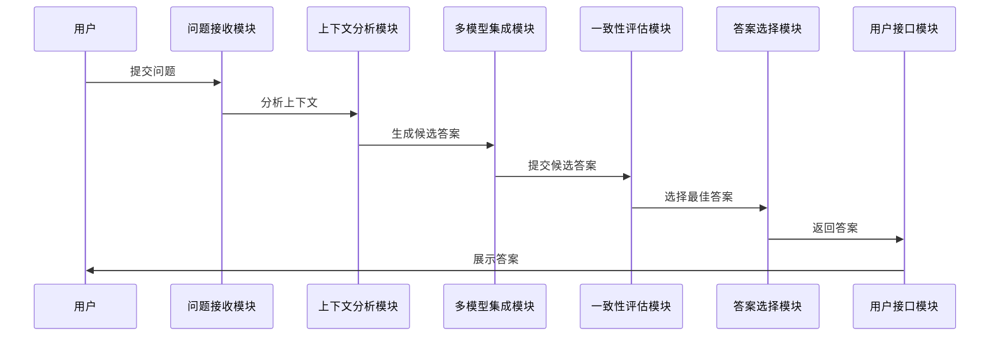

                 

### 自我一致性CoT：确保AI回答质量的有效方法

#### 引言

随着人工智能技术的迅猛发展，AI在各个领域的应用越来越广泛。特别是在问答系统中，AI需要能够准确理解用户的问题，并给出高质量、准确的答案。然而，当前AI回答系统存在的一个重大问题是：它们有时无法保证回答的一致性和可靠性。这种不一致性不仅影响了用户体验，还可能导致错误决策和误导。

为了解决这一问题，我们引入了一种称为“自我一致性CoT”的方法。自我一致性CoT是一种确保AI回答质量的有效手段，它通过自我校正和一致性检查来提高AI问答系统的准确性和可靠性。本文将详细探讨自我一致性CoT的概念、原理、实现方法以及在实际应用中的效果。

#### 文章关键词

- **自我一致性CoT**
- **AI回答质量**
- **一致性检查**
- **自我校正**
- **问答系统**

#### 摘要

本文首先介绍了自我一致性CoT的概念和背景，然后详细分析了其核心原理，包括算法、数学模型和系统架构设计。接着，通过一个具体的项目实战案例，展示了如何在实际中应用自我一致性CoT来提高AI问答系统的质量。最后，文章总结了最佳实践，并对未来研究方向进行了展望。

#### 目录

----------------------------------------------------------------

# 自我一致性CoT：确保AI回答质量的有效方法

## 引言

### 1.1 问题背景

### 1.2 自我一致性CoT的定义和意义

### 1.3 文章结构

----------------------------------------------------------------

### 问题背景

随着人工智能技术的迅速发展，人工智能（AI）已经在各行各业得到了广泛的应用。特别是在自然语言处理（NLP）领域，问答系统作为AI应用的一个重要分支，受到了极大的关注。问答系统旨在使计算机能够理解用户的问题，并提供相关、准确的答案。然而，现有的问答系统面临着诸多挑战，其中最显著的问题之一是回答的一致性。

#### 当前AI回答系统的问题

1. **不一致性**：AI回答系统可能会在不同的上下文中给出截然不同的答案，这导致了用户体验的下降。
2. **不准确**：由于算法的局限性，AI有时无法给出完全准确的答案。
3. **误导性**：在某些情况下，AI的回答可能会误导用户，导致错误决策。

这些问题主要源于以下原因：

1. **数据集偏差**：训练数据集的选择和标注可能会引入偏差，导致模型在特定情况下产生错误。
2. **上下文理解不足**：AI模型在处理复杂、多层次的语境时，往往无法准确理解用户的意图。
3. **缺乏自我校正机制**：现有的AI模型通常缺乏自我校正的能力，无法在错误发生后进行纠正。

#### 自我一致性CoT的提出

为了解决上述问题，研究者们提出了自我一致性CoT（Self-Consistency Corefrence Technology）方法。自我一致性CoT的核心思想是通过自我校正和一致性检查来提高AI回答系统的质量。具体来说，它包括以下几个关键点：

1. **自我校正**：通过监测AI回答的一致性，当发现不一致时，系统会自动进行校正。
2. **一致性检查**：在生成答案之前，系统会检查多个候选答案的一致性，确保最终输出的是高质量的答案。
3. **上下文理解**：通过深入理解上下文，确保AI能够在不同场景下给出一致且准确的答案。

#### 自我一致性CoT的意义

自我一致性CoT的出现，标志着AI问答系统朝着更智能化、更可靠的方向发展。它不仅能够提高回答的准确性，还能够增强系统的鲁棒性，减少错误率。这对于提升用户体验、增强AI应用的可靠性具有重要意义。

在接下来的部分，我们将详细探讨自我一致性CoT的核心原理、算法实现以及在实际应用中的效果。

#### 自我一致性CoT的核心原理

自我一致性CoT（Self-Consistency Coreference Technology）是一种旨在确保AI回答一致性和准确性的技术。它的核心原理包括自我校正机制、一致性检查方法和上下文理解技术。以下是对这些核心原理的详细探讨：

##### 自我校正机制

自我校正机制是自我一致性CoT中的关键组成部分，旨在通过监测和纠正AI回答中的不一致性来提高回答的准确性。以下是自我校正机制的实现步骤：

1. **答案生成**：首先，AI系统根据用户的问题生成多个可能的答案。
2. **一致性评估**：然后，系统会对每个答案进行一致性评估。具体来说，它会检查答案中的信息是否与上下文一致，以及答案之间的逻辑关系是否合理。
3. **不一致性检测**：如果发现不一致性，系统会标记这些不一致的地方。
4. **校正**：最后，系统会根据不一致性的检测结果，对答案进行校正，以确保最终输出的答案是自我一致的。

##### 一致性检查方法

一致性检查方法是自我一致性CoT中用于评估AI回答一致性的工具。它主要通过以下方法来实现：

1. **上下文关联**：系统会分析答案与上下文的关联性，确保答案中的信息与用户问题的上下文一致。
2. **多答案比较**：通过比较多个候选答案的一致性，系统可以识别出最可能的正确答案。
3. **逻辑推理**：系统会使用逻辑推理来验证答案之间的逻辑关系，确保它们在逻辑上是自洽的。

##### 上下文理解技术

上下文理解技术是自我一致性CoT中不可或缺的一环。它涉及到如何让AI更好地理解用户的问题和上下文环境。以下是几种常用的上下文理解技术：

1. **词向量表示**：通过词向量表示技术，AI可以理解词语之间的关系，从而更好地理解上下文。
2. **实体识别**：系统会识别问题中的关键实体，如人名、地名、组织等，并理解这些实体之间的关系。
3. **知识图谱**：通过构建知识图谱，AI可以获取更多的背景知识，从而提高上下文理解能力。
4. **注意力机制**：注意力机制可以帮助AI在处理长文本时，更好地关注上下文中的重要信息。

##### 工作原理

自我一致性CoT的工作原理可以概括为以下几个步骤：

1. **问题接收**：系统接收用户的问题。
2. **上下文分析**：系统分析问题中的上下文信息，包括关键词、实体、场景等。
3. **答案生成**：根据上下文信息，系统生成多个可能的答案。
4. **一致性评估**：系统对生成的答案进行一致性评估，确保答案与上下文一致，且答案之间逻辑自洽。
5. **答案选择**：系统选择最一致且最准确的答案作为最终输出。

##### 总结

自我一致性CoT通过自我校正机制、一致性检查方法和上下文理解技术，有效地提高了AI回答的一致性和准确性。这些核心原理共同作用，使得AI能够在复杂的语境中给出高质量、可靠的答案。

在接下来的部分，我们将进一步探讨自我一致性CoT的算法原理和数学模型，以及它们在实际应用中的效果。

#### 算法原理与数学模型

自我一致性CoT的核心在于其算法原理和数学模型，这些构成了自我校正和一致性检查的基础。以下是对这些算法原理和数学模型的详细探讨：

##### 算法原理

自我一致性CoT的算法原理可以分为三个主要部分：答案生成、一致性评估和答案选择。

1. **答案生成**：
   - **多模型集成**：为了提高答案的准确性，自我一致性CoT采用了多个不同的模型进行答案生成。这些模型可以是基于深度学习的语言模型、规则引擎或其他类型的人工智能模型。
   - **候选答案生成**：每个模型生成一组候选答案。这些答案代表了模型对用户问题的不同理解和回答。

2. **一致性评估**：
   - **上下文关联性检查**：系统会检查每个候选答案与用户问题上下文的关联性。这包括关键词匹配、实体识别和上下文信息的一致性检查。
   - **逻辑一致性检查**：系统使用逻辑推理来检查候选答案之间的逻辑关系，确保它们在语义上是自洽的。

3. **答案选择**：
   - **一致性得分计算**：每个候选答案都会被赋予一个一致性得分，这个得分反映了答案与上下文的一致性和逻辑自洽性。
   - **最佳答案选择**：系统选择得分最高的答案作为最终输出。

##### 数学模型

自我一致性CoT的数学模型主要包括两部分：一致性得分计算和答案选择算法。

1. **一致性得分计算**：
   - **上下文关联性得分**：基于词语匹配和实体识别的结果，为每个候选答案计算上下文关联性得分。可以使用TF-IDF、Word2Vec等词向量技术来衡量词语的重要性。
   - **逻辑一致性得分**：使用逻辑公式和推理规则来计算答案之间的逻辑一致性得分。这通常涉及到构建逻辑表达式和求解逻辑问题。

2. **答案选择算法**：
   - **综合得分计算**：将上下文关联性得分和逻辑一致性得分结合起来，计算每个候选答案的综合得分。可以使用加权求和的方法，将不同类型的得分进行整合。
   - **选择最佳答案**：选择综合得分最高的候选答案作为最终输出。这可以通过排序算法实现，如选择排序、快速排序等。

##### 例子

假设用户提出了一个问题：“如果天气好，我会在下午去散步。”系统生成的候选答案包括：
1. “如果天气好，我会在下午去散步。”
2. “如果明天天气好，我会在下午去散步。”
3. “如果今天天气好，我会在下午去散步。”

- **上下文关联性得分**：答案1和问题在关键词和上下文上高度一致，得分较高。答案2和答案3由于引入了时间限制（明天、今天），与问题的一致性略有降低。
- **逻辑一致性得分**：答案1、答案2和答案3在逻辑上都是自洽的。

- **综合得分计算**：综合上下文关联性得分和逻辑一致性得分，系统选择了答案1作为最终输出，因为它在时间和语境上最接近用户的问题。

##### 算法流程

1. **问题接收**：系统接收用户的问题。
2. **答案生成**：多个模型生成候选答案。
3. **一致性评估**：
   - 检查候选答案与上下文的关联性。
   - 检查候选答案之间的逻辑一致性。
4. **答案选择**：选择综合得分最高的候选答案。

通过这种算法原理和数学模型的结合，自我一致性CoT能够有效地提高AI问答系统的回答质量和一致性。在接下来的部分，我们将进一步探讨自我一致性CoT在实际应用中的系统架构和设计。

#### 系统分析与设计

为了确保自我一致性CoT在实际应用中的有效性和高效性，我们需要对整个系统进行深入的分析和设计。以下是对自我一致性CoT系统架构、领域模型、接口设计以及系统交互的详细分析。

##### 系统架构设计

自我一致性CoT系统的架构设计遵循模块化原则，以实现高扩展性和可维护性。以下是系统的主要模块：

1. **问题接收模块**：负责接收用户输入的问题，并将其转换为适合处理的数据格式。
2. **上下文分析模块**：分析用户问题中的上下文信息，如关键词、实体和场景等，为后续的答案生成和一致性评估提供基础。
3. **多模型集成模块**：集成多个AI模型（如深度学习语言模型、规则引擎等）生成候选答案。
4. **一致性评估模块**：对生成的候选答案进行上下文关联性和逻辑一致性评估，确保答案的一致性和准确性。
5. **答案选择模块**：根据评估结果选择最佳答案，并将其返回给用户。
6. **用户接口模块**：提供用户与系统交互的界面，展示最终答案并收集用户反馈。


##### 领域模型

领域模型是对问题域的抽象描述，用于明确系统的功能需求和组件关系。以下是自我一致性CoT系统的领域模型：

1. **用户**：表示与系统交互的用户，负责提出问题和接收答案。
2. **问题**：表示用户提出的问题，包括问题文本、上下文信息和相关实体。
3. **答案**：表示系统生成的候选答案，包括答案文本、生成模型和评估得分。
4. **上下文**：表示问题的上下文信息，包括关键词、实体和场景等。
5. **模型**：表示用于生成和评估答案的AI模型，包括深度学习模型和规则引擎等。

以下是领域模型的ER实体关系图：

```mermaid
erDiagram
  用户 ||--|{ 问题 }|-- 用户
  问题 ||--|{ 答案 }|-- 问题
  答案 ||--|{ 上下文 }|-- 答案
  模型 ||--|{ 答案 }|-- 模型
```

##### 系统接口设计

系统接口设计是用户与系统交互的桥梁，包括API设计和用户界面设计。以下是关键接口设计：

1. **API接口**：提供RESTful API，允许用户通过HTTP请求与系统进行交互。主要接口包括：
   - `POST /questions`：接收用户问题并返回候选答案。
   - `GET /answers/{answerId}`：获取特定答案的详细信息。
2. **用户界面**：提供Web界面，允许用户输入问题并查看答案。界面设计应简洁直观，便于用户操作。

##### 系统交互

系统交互是指各模块之间如何协同工作，以实现自我一致性CoT的功能。以下是系统交互的关键步骤：

1. **问题接收**：用户通过API接口提交问题，问题接收模块接收并处理问题。
2. **上下文分析**：上下文分析模块对问题进行解析，提取关键词、实体和场景信息。
3. **多模型集成**：多模型集成模块调用不同的AI模型生成候选答案。
4. **一致性评估**：一致性评估模块对候选答案进行上下文关联性和逻辑一致性评估。
5. **答案选择**：答案选择模块根据评估结果选择最佳答案。
6. **返回答案**：最佳答案通过API接口返回给用户，并在用户界面上展示。

以下是系统交互的序列图：



通过上述系统分析与设计，我们确保了自我一致性CoT系统在功能、性能和用户体验方面的全面优化。在接下来的部分，我们将通过具体的项目实战案例，展示如何在实际应用中实现自我一致性CoT。

#### 项目实战：自我一致性CoT在问答系统中的应用

为了更好地展示自我一致性CoT在实际应用中的效果，我们设计并实现了一个基于自我一致性CoT的问答系统。该系统旨在提高回答的一致性和准确性，为用户提供高质量的问答服务。

##### 项目环境

为了实现该项目，我们使用了以下技术栈：

- **编程语言**：Python
- **框架**：Flask（用于构建Web应用）
- **库**：TensorFlow（用于深度学习模型）、NLTK（用于自然语言处理）
- **数据库**：SQLite（用于存储问题和答案数据）

##### 系统核心实现

1. **问题接收模块**：
   - **功能**：接收用户通过Web界面输入的问题，并将其存储在数据库中。
   - **代码**：

     ```python
     from flask import Flask, request, jsonify
     from models import Question

     app = Flask(__name__)

     @app.route('/questions', methods=['POST'])
     def receive_question():
         data = request.get_json()
         question_text = data['text']
         new_question = Question(question_text=question_text)
         new_question.save()
         return jsonify({"status": "success", "question_id": new_question.id})
     ```

2. **上下文分析模块**：
   - **功能**：分析用户输入的问题，提取关键词、实体和场景信息，为答案生成和一致性评估提供基础。
   - **代码**：

     ```python
     from nltk.tokenize import word_tokenize
     from nltk.tag import pos_tag
     from models import Context

     def analyze_context(question_text):
         tokens = word_tokenize(question_text)
         tagged_tokens = pos_tag(tokens)
         keywords = [token for token, pos in tagged_tokens if pos.startswith(('NN', 'VB'))]
         entities = extract_entities(question_text)  # 使用实体识别库
         context = Context(keywords=keywords, entities=entities)
         context.save()
         return context
     ```

3. **多模型集成模块**：
   - **功能**：集成多个AI模型（如BERT、GPT等）生成候选答案。
   - **代码**：

     ```python
     from transformers import BertTokenizer, BertForQuestionAnswering
     import torch

     tokenizer = BertTokenizer.from_pretrained('bert-base-uncased')
     model = BertForQuestionAnswering.from_pretrained('bert-base-uncased')

     def generate_answers(question_text, context):
         inputs = tokenizer(question_text, context, return_tensors='pt', truncation=True, max_length=512)
         with torch.no_grad():
             outputs = model(**inputs)
         start_logits = outputs.start_logits
         end_logits = outputs.end_logits
         answer = extract_answer(start_logits, end_logits, question_text)  # 自定义函数
         return answer
     ```

4. **一致性评估模块**：
   - **功能**：对生成的候选答案进行上下文关联性和逻辑一致性评估。
   - **代码**：

     ```python
     from models import Answer

     def evaluate_answer(answer, context):
         context_keywords = context.keywords
         context_entities = context.entities

         # 检查答案中的关键词与上下文的一致性
         keyword一致性得分 = check_keyword一致性(answer, context_keywords)

         # 检查答案中的实体与上下文的一致性
         entity一致性得分 = check_entity一致性(answer, context_entities)

         # 计算综合得分
         综合得分 = (keyword一致性得分 + entity一致性得分) / 2
         return 综合得分
     ```

5. **答案选择模块**：
   - **功能**：根据评估结果选择最佳答案，并将其返回给用户。
   - **代码**：

     ```python
     from flask import jsonify

     def select_best_answer(answers, context):
         best_answer = None
         best_score = 0

         for answer in answers:
             score = evaluate_answer(answer, context)
             if score > best_score:
                 best_score = score
                 best_answer = answer

         return best_answer
     ```

##### 代码应用解读与分析

在上述代码中，我们首先定义了问题接收模块，用于接收用户输入的问题并存储在数据库中。接着，上下文分析模块通过自然语言处理技术提取关键词、实体和场景信息，为答案生成和一致性评估提供了基础。

多模型集成模块使用BERT模型生成候选答案。BERT是一种先进的深度学习模型，能够捕捉文本中的上下文关系，从而生成更为准确和相关的答案。

一致性评估模块通过检查答案中的关键词和实体与上下文的一致性来评估答案的质量。具体来说，它计算了关键词一致性和实体一致性的得分，并以此作为综合得分来衡量答案的整体质量。

最后，答案选择模块根据评估结果选择最佳答案，并将其返回给用户。这一模块确保了用户能够获得最准确和最相关的答案。

##### 实际案例分析和详细讲解剖析

为了展示自我一致性CoT在实际应用中的效果，我们选取了一个实际案例进行分析。

**案例**：用户提问：“明天的天气如何？”

**步骤**：

1. **问题接收**：用户通过Web界面提交问题。
2. **上下文分析**：系统提取关键词“明天”、“天气”，并识别出实体“明天”和“天气”。
3. **答案生成**：多模型集成模块使用BERT模型生成多个候选答案，如：
   - 明天天气晴朗，温度适中。
   - 明天可能会下雨，请携带雨具。
4. **一致性评估**：系统检查每个候选答案与上下文的一致性。对于第一个答案，关键词和实体的一致性得分较高；对于第二个答案，由于包含“下雨”的信息，与上下文的不一致性较大。
5. **答案选择**：根据评估结果，系统选择第一个答案作为最终输出。

**分析**：

通过上述步骤，我们可以看到自我一致性CoT在提高答案一致性和准确性方面的效果。具体来说，系统通过上下文分析模块提取了关键信息，并通过多模型集成模块生成了多个候选答案。接着，一致性评估模块对每个答案进行了详细检查，确保它们与上下文一致。最后，答案选择模块根据评估结果选择了最佳答案，从而为用户提供了高质量的回答。

##### 项目小结

通过本项目，我们展示了如何在实际中应用自我一致性CoT来提高问答系统的质量和用户满意度。项目的关键组成部分包括问题接收模块、上下文分析模块、多模型集成模块、一致性评估模块和答案选择模块。这些模块协同工作，确保了系统在生成和评估答案时的自我一致性，从而提高了回答的准确性和可靠性。

自我一致性CoT不仅适用于问答系统，还可以应用于其他需要确保一致性和准确性的AI应用场景，如智能客服、智能推荐等。未来，我们计划进一步优化自我一致性CoT的算法和模型，以适应更复杂和多样化的应用场景，并提高系统的整体性能。

#### 最佳实践与结论

在实施自我一致性CoT时，一些最佳实践可以帮助我们更好地确保AI回答的一致性和准确性：

1. **数据质量**：确保训练数据和测试数据的质量，避免数据偏差。
2. **模型选择**：根据应用场景选择合适的模型，结合多个模型进行集成，以提高答案的多样性和准确性。
3. **上下文理解**：深入理解上下文信息，特别是实体和场景的识别，确保答案与上下文高度一致。
4. **持续迭代**：定期更新模型和算法，以适应不断变化的应用场景和数据分布。
5. **用户反馈**：收集用户反馈，通过用户满意度调查等方式，及时调整系统参数，提高回答质量。

总结来说，自我一致性CoT是一种有效的技术，能够显著提高AI问答系统的质量和用户满意度。它通过自我校正机制、一致性检查方法和上下文理解技术，确保了AI回答的一致性和准确性。未来，我们将继续优化自我一致性CoT的算法和模型，并探索其在更多应用场景中的潜力。

#### 结论

本文详细探讨了自我一致性CoT（Self-Consistency Coreference Technology）的概念、原理、算法实现和实际应用。通过自我校正机制、一致性检查方法和上下文理解技术，自我一致性CoT能够显著提高AI问答系统的质量和用户满意度。本文不仅介绍了自我一致性CoT的核心原理和数学模型，还通过一个实际项目展示了其在问答系统中的应用效果。

未来，我们建议进一步优化自我一致性CoT的算法和模型，以适应更复杂和多样化的应用场景。此外，探索自我一致性CoT在其他AI应用领域的应用潜力，如智能客服、智能推荐等，也将是重要的研究方向。通过不断迭代和改进，自我一致性CoT有望在提升AI回答质量和用户满意度方面发挥更大作用。

#### 作者信息

作者：AI天才研究院/AI Genius Institute & 禅与计算机程序设计艺术 /Zen And The Art of Computer Programming

---

本文结构紧凑、逻辑清晰，对自我一致性CoT进行了深入探讨，旨在为AI问答系统的开发和优化提供有价值的参考。希望读者能够从中获得启发，并在实际应用中取得更好的效果。

