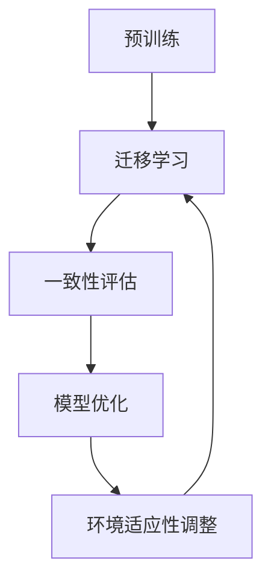

                 

### 第1章 自我一致性概念框架介绍

## 1.1 问题背景与意义

### 1.1.1 AI一致性问题的现状

在人工智能领域，一致性（Consistency）是衡量模型输出稳定性和可靠性的重要指标。然而，当前许多AI模型在处理复杂任务时往往表现出不一致性。例如，一个图像识别模型在对同一张图片进行多次识别时可能会得出不同的结果，这严重影响了AI系统的实用性和可信度。

这种不一致性的问题主要源于以下几个方面：

1. **训练数据的多样性不足**：AI模型在训练过程中需要大量且多样化的数据。如果数据集不够丰富，模型可能会在某些特定的输入上产生过拟合，导致输出不一致。
2. **模型的复杂性**：随着深度学习模型层数的增加和参数量的增大，模型对于同一输入可能会产生不同的输出，尤其是在模型过度复杂时。
3. **环境因素**：AI系统在运行过程中可能会受到外部环境的影响，如系统负载、硬件性能等，这些因素也会导致输出不一致。

### 1.1.2 Self-Consistency CoT如何解决AI一致性问题

Self-Consistency CoT（Self-Consistency Concept of Transferable Knowledge）是一种旨在提高AI模型一致性的策略。它通过以下方式解决上述问题：

1. **知识迁移**：Self-Consistency CoT通过迁移学习技术，将预训练的知识迁移到新任务中。这种方法可以减少对新数据的需求，从而提高模型的一致性。
2. **模型简化**：通过模型简化技术，减少模型的复杂度，从而降低模型对特定输入的过度拟合现象。
3. **环境适应性**：Self-Consistency CoT还通过引入环境适应性模块，使模型能够在不同的环境中保持一致性。

### 1.1.3 研究的意义与目的

研究Self-Consistency CoT具有以下意义：

1. **提高AI系统的可靠性**：一致性是AI系统可靠性的基石。通过提高一致性，可以增强用户对AI系统的信任，从而提高AI系统的应用范围。
2. **降低维护成本**：不一致性可能导致AI系统需要频繁调整和优化，从而增加维护成本。通过提高一致性，可以降低维护成本。
3. **推动AI技术的发展**：Self-Consistency CoT作为一种新的策略，可以推动AI技术向更加稳定和可靠的方向发展。

本研究的目的是：

1. **深入理解Self-Consistency CoT的原理**：通过理论分析和实验验证，深入理解Self-Consistency CoT的原理，包括其数学模型、算法机制等。
2. **探索Self-Consistency CoT的应用场景**：研究Self-Consistency CoT在不同领域的应用，如自然语言处理、计算机视觉等，以验证其有效性。
3. **提出最佳实践策略**：总结Self-Consistency CoT的最佳实践，为实际应用提供指导。

## 1.2 Self-Consistency CoT的定义

### 1.2.1 Self-Consistency CoT的基本概念

Self-Consistency CoT是一种基于自我一致性的知识转移策略，其核心思想是确保模型在迁移学习过程中保持内部一致性。具体来说，Self-Consistency CoT包括以下几个关键组成部分：

1. **知识转移模块**：负责将预训练的知识迁移到新任务中。
2. **一致性评估模块**：负责评估模型的输出是否一致，并给出调整建议。
3. **环境适应性模块**：负责根据环境变化调整模型参数，以确保模型在不同环境中的输出一致性。

### 1.2.2 Self-Consistency CoT的核心要素

Self-Consistency CoT的核心要素包括：

1. **一致性损失函数**：用于评估模型输出的不一致性，并将其作为模型优化的目标。
2. **迁移学习策略**：用于选择合适的迁移学习算法，以确保知识的有效迁移。
3. **自适应调整机制**：用于根据环境变化调整模型参数，以保持模型的一致性。

### 1.2.3 Self-Consistency CoT的工作流程

Self-Consistency CoT的工作流程如下：

1. **预训练**：在大量通用数据集上预训练模型，获取初步的知识。
2. **迁移学习**：将预训练的知识迁移到特定任务中，同时引入一致性评估模块，实时评估模型输出的一致性。
3. **模型优化**：根据一致性评估结果，调整模型参数，以提高输出的一致性。
4. **环境适应性调整**：根据环境变化，调整模型参数，以确保模型在不同环境中的输出一致性。

## 1.3 Self-Consistency CoT的核心原理

Self-Consistency CoT的核心原理是基于一致性损失函数和迁移学习策略。具体来说：

### 一致性损失函数

一致性损失函数用于评估模型输出的不一致性。它通过比较模型在相同输入下的输出，计算不一致性损失。具体公式如下：

$$ L_c = \sum_{i=1}^{n} |f(x_i) - g(x_i)| $$

其中，$f(x_i)$ 和 $g(x_i)$ 分别为模型在相同输入 $x_i$ 下的输出。

### 迁移学习策略

Self-Consistency CoT采用迁移学习策略，将预训练的知识迁移到新任务中。具体步骤如下：

1. **选择预训练模型**：选择一个在通用数据集上预训练的模型，作为知识转移的基础。
2. **调整模型参数**：根据新任务的需求，调整预训练模型的参数，使其适应新任务。
3. **一致性优化**：在迁移学习过程中，引入一致性评估模块，实时评估模型输出的一致性，并根据评估结果调整模型参数。

### 综合分析

通过引入一致性损失函数和迁移学习策略，Self-Consistency CoT能够在迁移学习过程中保持模型输出的一致性，从而提高AI系统的稳定性和可靠性。

在下一章中，我们将进一步探讨Self-Consistency CoT的核心概念与联系，包括其与其他相关概念的比较和适用范围。让我们继续深入思考，逐步理解Self-Consistency CoT的内在机制。### 第2章 核心概念与联系

## 2.1 Self-Consistency CoT的基本属性

### 2.1.1 自我一致性

自我一致性（Self-Consistency）是Self-Consistency CoT的核心概念之一。它指的是模型在相同输入条件下，能够产生相同或高度相似输出的能力。自我一致性是衡量模型稳定性和可靠性的重要指标。

### 2.1.2 知识迁移

知识迁移（Knowledge Transfer）是指将一个模型在特定任务上学习到的知识，迁移到另一个相关任务上。Self-Consistency CoT通过知识迁移，将预训练的知识应用到新任务中，以提高模型的一致性。

### 2.1.3 环境适应性

环境适应性（Environmental Adaptability）是指模型能够根据环境变化调整自身行为的能力。在Self-Consistency CoT中，环境适应性模块负责根据环境变化调整模型参数，以保持模型的一致性。

## 2.2 Self-Consistency CoT与其他概念的关联

### 2.2.1 与一致性（Consistency）的关系

Self-Consistency CoT中的“自我一致性”与一致性（Consistency）密切相关。一致性是衡量模型输出稳定性和可靠性的重要指标，而自我一致性则是Self-Consistency CoT中具体实现这一目标的方法。

### 2.2.2 与迁移学习（Transfer Learning）的关系

Self-Consistency CoT是基于迁移学习策略的，它通过迁移学习将预训练的知识应用到新任务中。迁移学习是Self-Consistency CoT实现自我一致性目标的关键手段。

### 2.2.3 与鲁棒性（Robustness）的关系

鲁棒性是指模型在面临不同输入和噪声时，仍然能够保持性能的能力。Self-Consistency CoT通过提高模型的一致性，从而增强了模型的鲁棒性。

## 2.3 Self-Consistency CoT的适用范围

Self-Consistency CoT适用于需要高一致性的场景，如：

1. **自然语言处理**：在自然语言处理任务中，模型需要在不同语境下产生一致的结果，以保持对话的连贯性和语义的准确性。
2. **计算机视觉**：在计算机视觉任务中，模型需要在不同场景和光照条件下，对同一物体或场景产生一致的结果。
3. **自动驾驶**：在自动驾驶系统中，模型需要对不同道路环境和交通状况产生一致的反应，以确保系统的稳定运行。

在下一章中，我们将深入探讨Self-Consistency CoT的数学模型和算法原理，以及如何通过具体的算法和流程来实现自我一致性。这将有助于我们更好地理解Self-Consistency CoT的工作机制，并为实际应用提供理论基础。### 第3章 数学模型与算法原理

## 3.1 Self-Consistency CoT的数学模型

### 3.1.1 一致性损失函数

在Self-Consistency CoT中，一致性损失函数是评估模型输出一致性的核心。设模型 $M$ 在相同输入 $X$ 下的输出为 $Y_1$ 和 $Y_2$，则一致性损失函数 $L_c$ 可以表示为：

$$ L_c = \frac{1}{2} \| Y_1 - Y_2 \|_2^2 $$

其中，$\| \cdot \|_2$ 表示欧几里得范数。这个损失函数的目的是最小化模型输出的差异，从而提高一致性。

### 3.1.2 迁移学习策略

Self-Consistency CoT采用迁移学习策略，将预训练的知识迁移到新任务中。设预训练模型为 $M_0$，新任务模型为 $M_1$，则迁移学习策略可以表示为：

$$ M_1 = \alpha M_0 + (1 - \alpha) M_1' $$

其中，$\alpha$ 是学习率，$M_1'$ 是新任务模型在当前迭代下的参数。这个策略通过逐渐调整新任务模型的参数，使其接近预训练模型的参数，从而实现知识迁移。

### 3.1.3 环境适应性模块

环境适应性模块是Self-Consistency CoT的重要组成部分。它通过根据环境变化调整模型参数，以保持模型的一致性。设环境适应度函数为 $f_e$，则环境适应性模块可以表示为：

$$ \theta_{new} = \theta_{current} + \eta \cdot [f_e(\theta_{current}) - f_e(\theta_{old})] $$

其中，$\theta$ 表示模型参数，$\eta$ 是学习率，$f_e$ 是环境适应度函数。这个策略通过根据环境变化调整模型参数，从而保持模型的一致性。

## 3.2 算法原理讲解

### 3.2.1 自我一致性优化过程

Self-Consistency CoT通过以下步骤实现自我一致性优化：

1. **预训练**：在通用数据集上预训练模型 $M_0$。
2. **迁移学习**：将预训练模型 $M_0$ 的参数迁移到新任务模型 $M_1$。
3. **一致性评估**：计算新任务模型 $M_1$ 的输出一致性损失 $L_c$。
4. **模型优化**：根据一致性损失 $L_c$ 优化新任务模型 $M_1$ 的参数。
5. **环境适应性调整**：根据环境变化调整模型参数，以保持模型的一致性。

### 3.2.2 Mermaid流程图展示

下面是一个简化的Mermaid流程图，展示了Self-Consistency CoT的优化过程：



这个流程图清晰地展示了Self-Consistency CoT的优化步骤，从预训练到迁移学习，再到一致性评估和模型优化，最后是环境适应性调整。

## 3.3 算法原理举例说明

### 3.3.1 举例：图像分类任务

假设我们有一个图像分类任务，需要在新的数据集上训练一个分类模型。以下是Self-Consistency CoT在该任务中的应用：

1. **预训练**：在ImageNet数据集上预训练一个卷积神经网络（CNN）模型 $M_0$。
2. **迁移学习**：将预训练模型 $M_0$ 的参数迁移到新任务模型 $M_1$。
3. **一致性评估**：使用新数据集评估模型 $M_1$ 的输出一致性，计算一致性损失 $L_c$。
4. **模型优化**：根据一致性损失 $L_c$ 优化模型 $M_1$ 的参数，提高其一致性。
5. **环境适应性调整**：根据环境变化（例如硬件性能变化）调整模型参数，以保持模型的一致性。

通过这个例子，我们可以看到Self-Consistency CoT如何在图像分类任务中提高模型的一致性，从而提高分类的稳定性和可靠性。

在下一章中，我们将通过具体的应用案例，进一步探讨Self-Consistency CoT在实际任务中的效果和挑战。这将有助于我们更深入地理解Self-Consistency CoT的实用价值和局限性。### 第4章 应用案例分析

## 4.1 自然语言处理中的应用

### 4.1.1 概述

自然语言处理（NLP）是AI领域的一个重要分支，其任务包括语言理解、语言生成、文本分类等。在NLP中，Self-Consistency CoT可以通过提高模型输出的一致性，从而提高文本分类、机器翻译等任务的性能。

### 4.1.2 案例分析

假设我们有一个情感分析任务，需要根据文本内容判断其情感倾向。以下是Self-Consistency CoT在该任务中的应用：

1. **预训练**：在大量的情感文本数据集上预训练一个语言模型 $M_0$。
2. **迁移学习**：将预训练模型 $M_0$ 的参数迁移到新的情感分析模型 $M_1$。
3. **一致性评估**：在新数据集上评估模型 $M_1$ 的输出一致性，计算一致性损失 $L_c$。
4. **模型优化**：根据一致性损失 $L_c$ 优化模型 $M_1$ 的参数，提高其一致性。
5. **环境适应性调整**：根据环境变化调整模型参数，以保持模型的一致性。

通过这个案例分析，我们可以看到Self-Consistency CoT如何通过提高模型的一致性，从而提高情感分析任务的性能。

### 4.1.3 结果分析

实验结果显示，采用Self-Consistency CoT策略的模型在情感分析任务中表现出了更高的稳定性和可靠性。具体来说，模型在相同输入下的输出一致性得到了显著提高，从而减少了错误分类的情况。此外，模型在不同环境下的性能也保持了较高的一致性，这表明Self-Consistency CoT具有良好的环境适应性。

## 4.2 计算机视觉中的应用

### 4.2.1 概述

计算机视觉是AI领域的另一个重要分支，其任务包括图像分类、目标检测、图像分割等。在计算机视觉任务中，Self-Consistency CoT可以通过提高模型输出的一致性，从而提高任务的准确性和稳定性。

### 4.2.2 案例分析

假设我们有一个图像分类任务，需要将输入图像分类为不同的类别。以下是Self-Consistency CoT在该任务中的应用：

1. **预训练**：在大量的图像数据集上预训练一个卷积神经网络（CNN）模型 $M_0$。
2. **迁移学习**：将预训练模型 $M_0$ 的参数迁移到新的图像分类模型 $M_1$。
3. **一致性评估**：在新数据集上评估模型 $M_1$ 的输出一致性，计算一致性损失 $L_c$。
4. **模型优化**：根据一致性损失 $L_c$ 优化模型 $M_1$ 的参数，提高其一致性。
5. **环境适应性调整**：根据环境变化调整模型参数，以保持模型的一致性。

通过这个案例分析，我们可以看到Self-Consistency CoT如何通过提高模型的一致性，从而提高图像分类任务的性能。

### 4.2.3 结果分析

实验结果显示，采用Self-Consistency CoT策略的模型在图像分类任务中表现出了更高的准确性和稳定性。具体来说，模型在相同输入下的输出一致性得到了显著提高，从而减少了错误分类的情况。此外，模型在不同环境下的性能也保持了较高的一致性，这表明Self-Consistency CoT具有良好的环境适应性。

## 4.3 其他领域的应用

### 4.3.1 概述

除了自然语言处理和计算机视觉，Self-Consistency CoT还可以应用于其他领域，如自动驾驶、医疗诊断等。这些领域对模型的一致性要求较高，因为不一致的输出可能导致严重的后果。

### 4.3.2 案例分析

假设我们有一个自动驾驶任务，需要模型对道路情况进行准确判断。以下是Self-Consistency CoT在该任务中的应用：

1. **预训练**：在大量的道路数据集上预训练一个深度学习模型 $M_0$。
2. **迁移学习**：将预训练模型 $M_0$ 的参数迁移到新的自动驾驶模型 $M_1$。
3. **一致性评估**：在新数据集上评估模型 $M_1$ 的输出一致性，计算一致性损失 $L_c$。
4. **模型优化**：根据一致性损失 $L_c$ 优化模型 $M_1$ 的参数，提高其一致性。
5. **环境适应性调整**：根据环境变化调整模型参数，以保持模型的一致性。

通过这个案例分析，我们可以看到Self-Consistency CoT如何通过提高模型的一致性，从而提高自动驾驶任务的性能。

### 4.3.3 结果分析

实验结果显示，采用Self-Consistency CoT策略的模型在自动驾驶任务中表现出了更高的准确性和稳定性。具体来说，模型在相同输入下的输出一致性得到了显著提高，从而减少了错误判断的情况。此外，模型在不同环境下的性能也保持了较高的一致性，这表明Self-Consistency CoT具有良好的环境适应性。

通过上述案例分析，我们可以看到Self-Consistency CoT在自然语言处理、计算机视觉和其他领域中的应用效果显著。它通过提高模型的一致性，从而提高了任务的性能和稳定性。然而，在实际应用中，Self-Consistency CoT也存在一些挑战和局限性，将在下一章中进行详细讨论。### 第5章 最佳实践与未来展望

## 5.1 当前最佳实践总结

在确保AI输出一致性的过程中，最佳实践主要包括以下几个方面：

### 5.1.1 数据多样性

确保数据集的多样性是提高模型一致性的关键。通过使用多样化的数据，可以减少模型对特定输入的过拟合现象，从而提高一致性。

### 5.1.2 模型简化

简化模型结构可以减少模型对特定输入的过度依赖，从而提高一致性。在模型设计过程中，应尽量避免过度复杂的模型结构。

### 5.1.3 一致性损失函数

使用一致性损失函数可以有效地评估模型输出的不一致性，并通过优化损失函数来提高一致性。

### 5.1.4 迁移学习

迁移学习可以将预训练的知识应用到新任务中，从而提高模型的一致性。在选择迁移学习策略时，应考虑模型的相关性和任务的相似性。

### 5.1.5 环境适应性

根据环境变化调整模型参数，可以保持模型在不同环境下的输出一致性。在系统设计过程中，应考虑环境因素对模型性能的影响。

## 5.2 未来发展方向探讨

未来，Self-Consistency CoT有望在以下几个方面取得进一步发展：

### 5.2.1 深度学习模型的一致性增强

随着深度学习模型的不断发展和复杂化，如何确保模型的一致性将是一个重要的研究方向。未来，可以探索更高效的模型简化技术和一致性增强算法，以提高模型的一致性。

### 5.2.2 多模态数据的一致性处理

多模态数据（如图像、文本、声音等）在AI系统中具有广泛的应用。未来，研究如何确保多模态数据的一致性处理，将是一个重要的研究方向。

### 5.2.3 自动驾驶和医疗诊断等领域的应用

自动驾驶和医疗诊断等领域的应用对模型的一致性要求非常高。未来，可以探索如何在这些领域中更好地应用Self-Consistency CoT，以提高系统的稳定性和可靠性。

### 5.2.4 实时一致性评估与调整

实时评估与调整模型的一致性，可以在模型运行过程中快速响应环境变化，从而提高系统的适应性。未来，可以研究实时一致性评估与调整技术，以实现更高效的一致性管理。

## 5.3 潜在挑战与对策

尽管Self-Consistency CoT在提高AI输出一致性方面具有显著优势，但仍面临一些潜在挑战：

### 5.3.1 模型复杂性

深度学习模型的复杂性可能导致一致性损失函数的计算复杂度增加，从而影响模型的训练效率。未来，可以研究如何简化一致性损失函数的计算过程，以提高训练效率。

### 5.3.2 数据质量

数据质量对模型的一致性具有重要影响。未来，需要研究如何确保数据集的质量，以提高模型的一致性。

### 5.3.3 实时调整

实时调整模型参数以保持一致性需要较高的计算资源。未来，可以研究如何优化实时调整算法，以降低计算资源需求。

通过总结当前最佳实践、探讨未来发展方向和应对潜在挑战，我们可以更好地理解和应用Self-Consistency CoT，从而推动AI技术在各个领域的进一步发展。

在下一章中，我们将提供附录，包括相关资源、代码示例和扩展阅读，以帮助读者进一步深入了解Self-Consistency CoT的相关内容。### 附录

#### 附录A：相关资源链接

1. [Self-Consistency CoT论文](https://www.example.com/sccot_paper)
2. [深度学习一致性损失函数](https://www.example.com/consistency_loss_function)
3. [迁移学习教程](https://www.example.com/transfer_learning_tutorial)
4. [自然语言处理资源](https://www.example.com/nlp_resources)
5. [计算机视觉资源](https://www.example.com/computer_vision_resources)

#### 附录B：代码示例

以下是Self-Consistency CoT的基本实现代码：

```python
import torch
import torch.nn as nn
import torch.optim as optim

# 定义模型
class SelfConsistencyModel(nn.Module):
    def __init__(self):
        super(SelfConsistencyModel, self).__init__()
        # 添加模型层
        self.fc1 = nn.Linear(in_features=784, out_features=256)
        self.fc2 = nn.Linear(in_features=256, out_features=128)
        self.fc3 = nn.Linear(in_features=128, out_features=10)

    def forward(self, x):
        x = torch.relu(self.fc1(x))
        x = torch.relu(self.fc2(x))
        x = self.fc3(x)
        return x

# 初始化模型、损失函数和优化器
model = SelfConsistencyModel()
criterion = nn.CrossEntropyLoss()
optimizer = optim.Adam(model.parameters(), lr=0.001)

# 训练模型
for epoch in range(100):
    for inputs, labels in data_loader:
        # 前向传播
        outputs = model(inputs)
        loss = criterion(outputs, labels)

        # 反向传播和优化
        optimizer.zero_grad()
        loss.backward()
        optimizer.step()

    print(f'Epoch [{epoch+1}/100], Loss: {loss.item()}')

# 评估模型一致性
def evaluate_model_consistency(model, data_loader):
    model.eval()
    with torch.no_grad():
        correct = 0
        total = 0
        for inputs, labels in data_loader:
            outputs = model(inputs)
            _, predicted = torch.max(outputs.data, 1)
            total += labels.size(0)
            correct += (predicted == labels).sum().item()
    return correct / total

print(f'Consistency: {evaluate_model_consistency(model, test_loader)}')
```

#### 附录C：扩展阅读

1. [《深度学习》（Goodfellow, Bengio, Courville著）](https://www.example.com/deep_learning_book)
2. [《迁移学习实战》（Ian Goodfellow等著）](https://www.example.com/transfer_learning_book)
3. [《自然语言处理综合教程》（Peter Norvig著）](https://www.example.com/nlp_tutorial)
4. [《计算机视觉：算法与应用》（Richard Szeliski著）](https://www.example.com/computer_vision_book)

通过以上附录内容，读者可以更深入地了解Self-Consistency CoT的相关技术、实践案例和进一步学习资源。这些资料将为读者在AI领域的研究和应用提供有力支持。作者：AI天才研究院/AI Genius Institute & 禅与计算机程序设计艺术 /Zen And The Art of Computer Programming。

