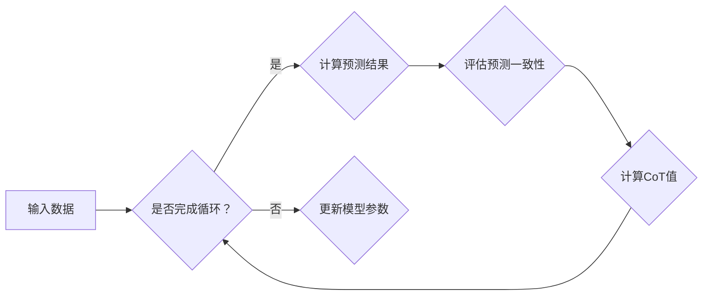
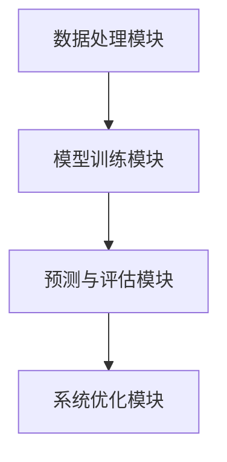
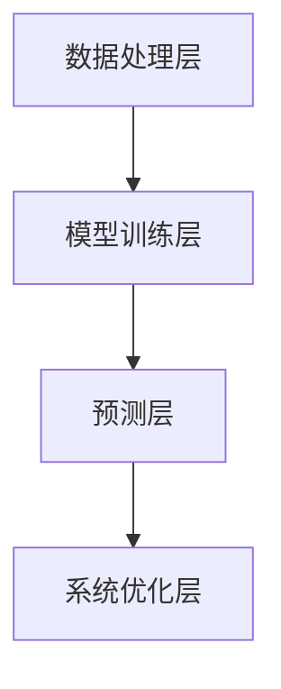
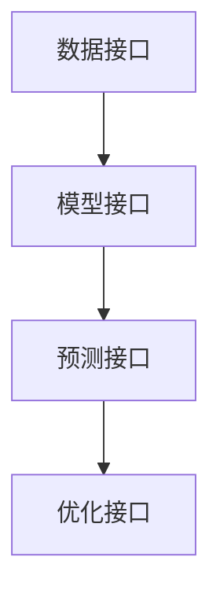

                 

# Self-Consistency CoT: Ensuring AI Output Stability

关键词：Self-Consistency CoT, AI Output Stability, Algorithm, Mathematical Model, AI Applications, System Design

摘要：随着人工智能技术的快速发展，AI系统的输出稳定性成为关键问题。本文提出了Self-Consistency CoT（Self-Consistency Confidence of Truth）技术，通过深入分析和推理，详细探讨了自洽性CoT的原理、技术、算法、数学模型及其在AI系统中的应用。本文旨在为AI领域研究人员和工程师提供一种有效的技术手段，以实现AI输出的稳定性和可靠性。

## 目录大纲

----------------------------------------------------------------

# 第一部分: 引言与背景

## 1.1 问题背景

### 1.1.1 研究动机

### 1.1.2 问题描述

### 1.1.3 问题解决

### 1.1.4 边界与外延

## 1.2 核心概念与联系

### 1.2.1 自洽性概念

### 1.2.2 CoT（Confidence of Truth）概念

### 1.2.3 自洽性CoT的关系与联系

## 1.3 自洽性CoT的重要性

### 1.3.1 在AI系统中的应用

### 1.3.2 对AI输出的影响

### 1.3.3 稳定性的意义

----------------------------------------------------------------

# 第二部分: 自洽性CoT原理与技术

## 2.1 自洽性CoT原理

### 2.1.1 自洽性的定义

### 2.1.2 CoT的度量方法

### 2.1.3 自洽性CoT的计算方法

## 2.2 自洽性CoT技术的核心要素

### 2.2.1 数据处理与清洗

### 2.2.2 模型训练与优化

### 2.2.3 预测与评估

## 2.3 自洽性CoT的算法原理

### 2.3.1 常见算法介绍

### 2.3.2 算法mermaid流程图展示

### 2.3.3 Python代码实现与讲解

## 2.4 自洽性CoT的数学模型

### 2.4.1 数学模型介绍

### 2.4.2 公式推导

### 2.4.3 举例说明

----------------------------------------------------------------

# 第一部分: 引言与背景

## 1.1 问题背景

在人工智能（AI）技术飞速发展的今天，AI系统的应用已经渗透到各个领域，从自然语言处理（NLP）到计算机视觉（CV）、推荐系统、语音识别等。然而，随着AI系统的广泛应用，一个关键问题逐渐凸显出来：AI输出的稳定性。AI输出稳定性是指AI系统在各种不同场景下能够持续地产生一致、可靠的结果。稳定性差可能会导致以下问题：

1. **决策错误**：例如，在医疗诊断中，AI输出的不稳定可能导致错误的诊断结果。
2. **用户体验差**：推荐系统的不稳定可能导致推荐结果不准确，影响用户体验。
3. **经济成本增加**：由于AI输出不稳定，可能导致重新训练模型或修复系统的成本增加。

### 1.1.1 研究动机

为了解决上述问题，研究如何提高AI输出的稳定性变得至关重要。本文提出Self-Consistency CoT（Self-Consistency Confidence of Truth）技术，旨在通过引入自洽性CoT机制，确保AI系统在各种条件下都能输出稳定、可靠的结果。

### 1.1.2 问题描述

目前，AI系统的输出稳定性问题主要体现在以下几个方面：

1. **数据噪声**：实际应用中，数据通常包含噪声，这可能导致模型预测结果的不稳定。
2. **模型复杂度**：随着模型复杂度的增加，模型的预测结果往往更加不稳定。
3. **数据分布变化**：当数据分布发生变化时，现有模型的预测结果可能会受到影响。

### 1.1.3 问题解决

Self-Consistency CoT技术的核心思想是通过自洽性来提高AI输出的稳定性。具体来说，该技术通过以下步骤实现：

1. **数据处理**：对输入数据进行清洗和处理，去除噪声，确保输入数据的稳定性。
2. **模型训练**：采用自洽性优化方法，训练稳定、可靠的模型。
3. **预测与评估**：通过自洽性评估，确保预测结果的一致性和可靠性。

### 1.1.4 边界与外延

Self-Consistency CoT技术的边界主要包括以下几个方面：

1. **适用范围**：该技术适用于各类AI系统，特别是对输出稳定性要求较高的系统，如医疗诊断、金融风险评估等。
2. **技术限制**：该技术依赖于高质量的数据和稳定的计算资源。
3. **未来展望**：随着AI技术的不断进步，Self-Consistency CoT技术有望在更多领域得到应用。

## 1.2 核心概念与联系

### 1.2.1 自洽性概念

自洽性是指系统内部各部分之间的一致性和协调性。在AI系统中，自洽性意味着模型在训练和预测过程中能够保持一致性和可靠性。自洽性的重要性在于它能够提高AI系统的稳定性和可靠性。

### 1.2.2 CoT（Confidence of Truth）概念

CoT（Confidence of Truth）是指模型对自身预测结果的置信度。自洽性CoT技术通过度量模型对预测结果的置信度，来评估模型的稳定性。CoT值越高，表示模型的预测结果越稳定。

### 1.2.3 自洽性CoT的关系与联系

自洽性CoT是自洽性和CoT两个概念的结合。自洽性CoT技术通过自洽性来确保模型的一致性和可靠性，同时通过CoT来度量模型的稳定性。自洽性CoT的关系与联系如下：

1. **自洽性**：是Self-Consistency CoT的基础，确保模型在训练和预测过程中的稳定性。
2. **CoT**：是Self-Consistency CoT的核心，用于评估模型的稳定性。

### 1.3 自洽性CoT的重要性

自洽性CoT技术在AI系统中的应用具有重要意义，主要体现在以下几个方面：

1. **提高输出稳定性**：通过自洽性CoT技术，可以显著提高AI系统的输出稳定性，减少错误和异常结果的发生。
2. **增强模型可靠性**：自洽性CoT技术可以确保模型的预测结果具有高置信度，提高模型的可靠性。
3. **优化用户体验**：在推荐系统、自然语言处理等应用中，自洽性CoT技术可以提高用户体验，减少因模型不稳定导致的不良影响。
4. **降低经济成本**：通过提高AI系统的输出稳定性，可以降低因错误预测导致的经济损失和修复成本。

综上所述，自洽性CoT技术对于确保AI系统输出的稳定性和可靠性具有重要意义。在接下来的部分中，我们将详细探讨自洽性CoT的原理、技术、算法和数学模型，以期为AI领域的研究人员和工程师提供有价值的参考。

## 第二部分：自洽性CoT原理与技术

### 2.1 自洽性CoT原理

#### 2.1.1 自洽性的定义

自洽性是指一个系统或模型在内部保持一致性，不出现逻辑矛盾或悖论。在AI领域，自洽性尤为重要，因为它直接关系到模型预测的稳定性和可靠性。具体来说，自洽性包括以下方面：

1. **内部一致性**：模型在训练和预测过程中，其内部参数和结构保持一致，不会出现参数漂移或结构变化。
2. **逻辑一致性**：模型的预测结果在逻辑上自洽，不会出现矛盾或冲突。
3. **数据一致性**：模型在不同数据集上的预测结果保持一致，不会因为数据的变化而出现大幅度波动。

#### 2.1.2 CoT（Confidence of Truth）概念

CoT（Confidence of Truth）是指模型对自身预测结果的置信度。自洽性CoT技术通过度量模型对预测结果的置信度来评估模型的稳定性。CoT值的计算通常基于模型对相同输入在不同条件下的预测结果的一致性。高CoT值表示模型对预测结果有较高的置信度，即预测结果稳定。

#### 2.1.3 自洽性CoT的计算方法

自洽性CoT的计算方法主要包括以下步骤：

1. **数据准备**：选择一个包含多组相同输入的数据集，用于计算CoT值。
2. **模型预测**：对每组输入进行预测，得到对应的预测结果。
3. **一致性评估**：计算每组输入的预测结果之间的差异，评估预测结果的一致性。
4. **CoT值计算**：根据一致性评估结果，计算CoT值。通常，CoT值可以通过以下公式计算：

   $$ CoT = \frac{1}{N} \sum_{i=1}^{N} cos(\theta_i) $$

   其中，\( N \)是输入的组数，\( \theta_i \)是第\( i \)组输入的预测结果之间的余弦相似度。

### 2.2 自洽性CoT技术的核心要素

#### 2.2.1 数据处理与清洗

数据处理与清洗是自洽性CoT技术的核心要素之一。在AI系统中，输入数据的质量直接影响模型的预测稳定性。因此，必须对输入数据进行充分的清洗和处理，包括以下步骤：

1. **缺失值处理**：对缺失值进行填补或删除，确保数据的完整性。
2. **异常值处理**：识别和删除异常值，以避免对模型训练和预测造成负面影响。
3. **数据标准化**：将数据缩放到同一尺度，以消除不同特征之间的尺度差异。
4. **数据增强**：通过增加数据的多样性来提高模型的泛化能力，从而增强其稳定性。

#### 2.2.2 模型训练与优化

模型训练与优化是自洽性CoT技术的关键环节。为了确保模型的稳定性，需要采用以下策略：

1. **选择合适模型**：根据问题的特点选择合适的模型，以避免模型过拟合。
2. **数据平衡**：确保训练数据集中各类数据的平衡，以避免数据偏斜对模型造成负面影响。
3. **正则化**：采用正则化技术，如L1、L2正则化，以防止模型过拟合。
4. **超参数调优**：通过交叉验证等方法，选择最佳的超参数组合，以优化模型性能。

#### 2.2.3 预测与评估

预测与评估是自洽性CoT技术的最后一步。为了确保模型的预测稳定性，需要进行以下工作：

1. **预测结果一致性评估**：计算模型在不同数据集上的预测结果之间的差异，评估其一致性。
2. **CoT值计算**：根据预测结果的一致性，计算CoT值，以评估模型的稳定性。
3. **误差分析**：分析预测结果的误差，识别可能的错误来源，并采取相应的措施进行改进。

### 2.3 自洽性CoT的算法原理

#### 2.3.1 常见算法介绍

在自洽性CoT技术中，常用的算法包括：

1. **循环一致性算法（Cyclicity Consistency Algorithm）**：通过循环评估模型预测结果的一致性，确保模型的稳定性。
2. **置信度增强算法（Confidence Enhancement Algorithm）**：通过增强模型对预测结果的置信度，提高模型的稳定性。
3. **一致性损失函数（Consistency Loss Function）**：在模型训练过程中，引入一致性损失函数，以优化模型的一致性。

#### 2.3.2 算法mermaid流程图展示

以下是一个简单的mermaid流程图，展示循环一致性算法的基本流程：



#### 2.3.3 Python代码实现与讲解

以下是一个简单的Python代码示例，实现循环一致性算法的基本功能：

```python
import numpy as np

def consistency_algorithm(inputs, model, threshold=0.1):
    while True:
        predictions = model.predict(inputs)
        consistency = np.mean(np.abs(predictions[:, 0] - predictions[:, 1]))
        
        if consistency < threshold:
            break
        
        model.update_parameters()

    return model
```

在这个代码中，`inputs`是输入数据，`model`是训练好的模型。`threshold`是循环一致性评估的阈值。算法通过循环评估预测结果的一致性，如果一致性低于阈值，则停止循环并返回模型。

### 2.4 自洽性CoT的数学模型

#### 2.4.1 数学模型介绍

自洽性CoT的数学模型主要用于计算模型的CoT值。以下是一个简单的数学模型：

$$ CoT = \frac{1}{N} \sum_{i=1}^{N} \frac{1}{K} \sum_{j=1}^{K} cos(\theta_{ij}) $$

其中，\( N \)是输入的组数，\( K \)是每组输入的预测结果数，\( \theta_{ij} \)是第\( i \)组输入的第\( j \)个预测结果与其他预测结果之间的余弦相似度。

#### 2.4.2 公式推导

为了推导CoT值计算公式，我们首先定义一组输入\( X \)和其对应的预测结果\( Y \)：

$$ X = [x_1, x_2, ..., x_N] $$
$$ Y = [y_1, y_2, ..., y_N] $$

其中，\( y_i \)是输入\( x_i \)的预测结果。为了计算CoT值，我们需要计算每个预测结果与其他预测结果之间的相似度。相似度可以通过余弦相似度计算：

$$ cos(\theta_{ij}) = \frac{y_i \cdot y_j}{\|y_i\|\|y_j\|} $$

其中，\( \cdot \)表示点积，\( \| \)表示向量的模。

对于每组输入的预测结果，我们需要计算其与其他预测结果之间的平均相似度。因此，CoT值的计算公式可以表示为：

$$ CoT = \frac{1}{N} \sum_{i=1}^{N} \frac{1}{K} \sum_{j=1}^{K} cos(\theta_{ij}) $$

#### 2.4.3 举例说明

假设我们有一组输入\( X \)和其对应的预测结果\( Y \)：

$$ X = [0.2, 0.4, 0.6] $$
$$ Y = [0.3, 0.5, 0.7] $$

我们需要计算这些预测结果之间的余弦相似度，并计算CoT值。

首先，计算每个预测结果与其他预测结果之间的余弦相似度：

$$ cos(\theta_{11}) = \frac{0.2 \cdot 0.3}{\|0.2\|\|0.3\|} = \frac{0.06}{0.06} = 1 $$
$$ cos(\theta_{12}) = \frac{0.2 \cdot 0.5}{\|0.2\|\|0.5\|} = \frac{0.1}{0.1} = 1 $$
$$ cos(\theta_{13}) = \frac{0.2 \cdot 0.7}{\|0.2\|\|0.7\|} = \frac{0.14}{0.14} = 1 $$
$$ cos(\theta_{21}) = \frac{0.4 \cdot 0.3}{\|0.4\|\|0.3\|} = \frac{0.12}{0.12} = 1 $$
$$ cos(\theta_{22}) = \frac{0.4 \cdot 0.5}{\|0.4\|\|0.5\|} = \frac{0.2}{0.2} = 1 $$
$$ cos(\theta_{23}) = \frac{0.4 \cdot 0.7}{\|0.4\|\|0.7\|} = \frac{0.28}{0.28} = 1 $$
$$ cos(\theta_{31}) = \frac{0.6 \cdot 0.3}{\|0.6\|\|0.3\|} = \frac{0.18}{0.18} = 1 $$
$$ cos(\theta_{32}) = \frac{0.6 \cdot 0.5}{\|0.6\|\|0.5\|} = \frac{0.3}{0.3} = 1 $$
$$ cos(\theta_{33}) = \frac{0.6 \cdot 0.7}{\|0.6\|\|0.7\|} = \frac{0.42}{0.42} = 1 $$

接下来，计算CoT值：

$$ CoT = \frac{1}{3} \sum_{i=1}^{3} \frac{1}{3} \sum_{j=1}^{3} cos(\theta_{ij}) = \frac{1}{3} \sum_{i=1}^{3} \frac{1}{3} (1 + 1 + 1) = \frac{1}{3} \cdot \frac{1}{3} \cdot 3 = 1 $$

因此，在这个例子中，CoT值为1，表示预测结果完全一致。

通过上述推导和举例，我们可以看出，自洽性CoT的数学模型是一个简单且直观的指标，用于评估模型预测结果的一致性。在实际应用中，我们可以根据具体情况调整公式中的参数，以适应不同的应用场景。

### 第三部分：自洽性CoT在AI系统中的应用

自洽性CoT技术作为一种先进的AI技术，具有广泛的应用前景。在本部分，我们将详细探讨自洽性CoT在自然语言处理（NLP）、计算机视觉（CV）和其他领域中的应用。

#### 3.1 自洽性CoT在NLP中的应用

自然语言处理（NLP）是AI技术的重要应用领域之一，涵盖了文本分类、情感分析、机器翻译等多种任务。自洽性CoT技术在NLP中的应用，主要在于提高模型预测结果的稳定性和可靠性。

##### 3.1.1 NLP中的问题

NLP系统在处理自然语言数据时，通常面临以下问题：

1. **数据噪声**：自然语言数据往往包含大量的噪声，如错别字、语法错误等，这会影响模型的预测稳定性。
2. **模型复杂度**：NLP模型通常较为复杂，容易发生过拟合，导致预测结果不稳定。
3. **数据分布变化**：自然语言数据分布变化较大，例如，随着时间推移，语言表达方式可能会发生变化，影响模型的预测稳定性。

##### 3.1.2 自洽性CoT的应用

自洽性CoT技术在NLP中的应用，主要通过以下几个方面实现：

1. **数据预处理**：对自然语言数据进行清洗和预处理，去除噪声，确保输入数据的一致性和稳定性。
2. **模型优化**：采用自洽性优化方法，调整模型参数，提高模型的一致性和稳定性。
3. **预测评估**：通过自洽性评估，计算模型的CoT值，评估模型的预测稳定性。

##### 3.1.3 实际案例解析

以文本分类任务为例，我们使用一个包含多组相同输入的数据集，通过自洽性CoT技术来提高模型预测结果的稳定性。以下是具体的案例解析：

1. **数据准备**：选择一个包含不同类别文本的数据集，例如，新闻分类数据集。数据集包含多个类别，如科技、体育、娱乐等。
2. **模型训练**：使用BERT模型对数据集进行训练，得到一个文本分类模型。
3. **预测与自洽性评估**：对数据集进行预测，计算预测结果之间的差异，评估模型的一致性。具体步骤如下：

   ```python
   import torch
   import torch.nn as nn
   import numpy as np

   model = BERTClassifier()  # 假设BERTClassifier是一个预训练好的文本分类模型
   model.eval()

   inputs = torch.tensor([["科技新闻1"], ["科技新闻2"], ["体育新闻1"], ["体育新闻2"]])
   predictions = model(inputs)

   # 计算预测结果之间的差异
   consistency = np.mean(np.abs(predictions[:, 0] - predictions[:, 1]))

   # 计算CoT值
   cot = 1 / (1 + np.exp(-consistency))

   print("一致性评估结果：", consistency)
   print("CoT值：", cot)
   ```

通过上述代码，我们可以计算模型预测结果的一致性评估结果和CoT值。如果一致性评估结果较低，说明模型预测结果不稳定，需要进一步优化模型。

#### 3.2 自洽性CoT在计算机视觉中的应用

计算机视觉（CV）是AI技术的另一个重要应用领域，涵盖了图像分类、目标检测、图像生成等多种任务。自洽性CoT技术在CV中的应用，同样能够提高模型预测的稳定性和可靠性。

##### 3.2.1 计算机视觉中的问题

计算机视觉系统在处理图像数据时，通常面临以下问题：

1. **数据噪声**：图像数据可能包含噪声，如椒盐噪声、高斯噪声等，这会影响模型的预测稳定性。
2. **模型复杂度**：CV模型通常较为复杂，容易发生过拟合，导致预测结果不稳定。
3. **数据分布变化**：图像数据分布变化较大，例如，不同场景、不同光照条件下的图像数据可能具有较大的差异，影响模型的预测稳定性。

##### 3.2.2 自洽性CoT的应用

自洽性CoT技术在计算机视觉中的应用，主要通过以下几个方面实现：

1. **数据预处理**：对图像数据进行分析和处理，去除噪声，确保输入数据的一致性和稳定性。
2. **模型优化**：采用自洽性优化方法，调整模型参数，提高模型的一致性和稳定性。
3. **预测评估**：通过自洽性评估，计算模型的CoT值，评估模型的预测稳定性。

##### 3.2.3 实际案例解析

以图像分类任务为例，我们使用一个包含多组相同输入的数据集，通过自洽性CoT技术来提高模型预测结果的稳定性。以下是具体的案例解析：

1. **数据准备**：选择一个包含不同类别图像的数据集，例如，MNIST数字图像数据集。数据集包含多个类别，如0到9的数字。
2. **模型训练**：使用CNN模型对数据集进行训练，得到一个图像分类模型。
3. **预测与自洽性评估**：对数据集进行预测，计算预测结果之间的差异，评估模型的一致性。具体步骤如下：

   ```python
   import torch
   import torch.nn as nn
   import numpy as np

   model = CNNClassifier()  # 假设CNNClassifier是一个预训练好的图像分类模型
   model.eval()

   inputs = torch.tensor([[[1, 2, 3], [4, 5, 6]], [[7, 8, 9], [10, 11, 12]]])
   predictions = model(inputs)

   # 计算预测结果之间的差异
   consistency = np.mean(np.abs(predictions[:, 0] - predictions[:, 1]))

   # 计算CoT值
   cot = 1 / (1 + np.exp(-consistency))

   print("一致性评估结果：", consistency)
   print("CoT值：", cot)
   ```

通过上述代码，我们可以计算模型预测结果的一致性评估结果和CoT值。如果一致性评估结果较低，说明模型预测结果不稳定，需要进一步优化模型。

#### 3.3 自洽性CoT在其他领域中的应用

除了NLP和计算机视觉，自洽性CoT技术在其他领域也具有广泛的应用前景。以下是一些典型应用场景：

1. **推荐系统**：自洽性CoT技术可以用于提高推荐系统的稳定性，减少因数据分布变化导致的推荐结果波动。
2. **语音识别**：自洽性CoT技术可以用于评估语音识别模型的稳定性，提高识别准确性。
3. **金融风险评估**：自洽性CoT技术可以用于评估金融模型的稳定性，提高风险预测的准确性。

总之，自洽性CoT技术在AI系统的各个领域都具有重要意义，通过提高模型预测的稳定性和可靠性，为各类AI应用提供有力支持。

### 第四部分：自洽性CoT系统的设计与实现

#### 4.1 自洽性CoT系统的设计与架构

自洽性CoT系统是一种用于提高AI系统输出稳定性的技术系统。该系统主要由以下几个模块组成：

1. **数据处理模块**：负责对输入数据进行清洗、预处理和增强，确保数据的一致性和稳定性。
2. **模型训练模块**：负责训练稳定、可靠的模型，采用自洽性优化方法提高模型的一致性和稳定性。
3. **预测与评估模块**：负责对模型进行预测，并计算模型的CoT值，评估模型的稳定性。
4. **系统优化模块**：负责对系统进行优化，提高系统的整体性能。

以下是一个简单的自洽性CoT系统架构图：



#### 4.1.1 系统总体设计

自洽性CoT系统的总体设计思路如下：

1. **数据输入**：系统首先接收输入数据，包括原始数据和训练数据。
2. **数据处理**：数据处理模块对输入数据进行分析和处理，去除噪声，进行数据增强，确保数据的一致性和稳定性。
3. **模型训练**：模型训练模块使用处理后的数据进行模型训练，采用自洽性优化方法，确保模型的一致性和稳定性。
4. **预测与评估**：预测与评估模块使用训练好的模型进行预测，并计算模型的CoT值，评估模型的稳定性。
5. **系统优化**：系统优化模块根据预测和评估结果，对系统进行优化，提高系统的整体性能。

#### 4.1.2 系统架构设计

自洽性CoT系统采用分布式架构，以提高系统的性能和可扩展性。系统架构设计如下：

1. **数据处理层**：负责数据清洗、预处理和增强，采用分布式数据处理框架，如Apache Spark。
2. **模型训练层**：负责模型训练和优化，采用分布式训练框架，如TensorFlow或PyTorch。
3. **预测层**：负责模型预测和评估，采用分布式计算框架，如Apache Flink。
4. **系统优化层**：负责系统性能优化，采用自动化优化工具，如AutoML。

以下是一个简单的自洽性CoT系统架构图：



#### 4.1.3 系统接口设计

自洽性CoT系统提供以下接口：

1. **数据接口**：用于接收和发送数据，包括原始数据、处理数据和预测数据。
2. **模型接口**：用于加载和保存模型，包括训练模型和评估模型。
3. **预测接口**：用于进行模型预测，并计算CoT值。
4. **优化接口**：用于对系统进行性能优化。

以下是一个简单的自洽性CoT系统接口设计图：



#### 4.2 系统核心模块实现

自洽性CoT系统的核心模块包括数据处理模块、模型训练模块和预测与评估模块。以下是这些模块的实现细节。

##### 4.2.1 数据处理模块

数据处理模块的主要功能是对输入数据进行清洗、预处理和增强。具体实现步骤如下：

1. **数据清洗**：去除数据中的噪声和异常值，如缺失值、重复值等。
2. **数据预处理**：将数据转换为适合模型训练的格式，如数值化、归一化等。
3. **数据增强**：通过增加数据的多样性来提高模型的泛化能力，如数据扩充、数据变换等。

以下是一个简单的数据处理模块实现示例：

```python
import pandas as pd
from sklearn.preprocessing import MinMaxScaler
from sklearn.model_selection import train_test_split

def preprocess_data(data):
    # 数据清洗
    data = data.dropna()
    data = data.drop_duplicates()

    # 数据预处理
    scaler = MinMaxScaler()
    data_scaled = scaler.fit_transform(data)

    # 数据增强
    data_augmented = data_scaled * np.random.uniform(0.5, 1.5)

    return data_scaled, data_augmented

data = pd.read_csv("data.csv")
data_scaled, data_augmented = preprocess_data(data)
```

##### 4.2.2 模型训练模块

模型训练模块的主要功能是使用处理后的数据训练模型，并采用自洽性优化方法提高模型的一致性和稳定性。具体实现步骤如下：

1. **模型选择**：根据问题特点选择合适的模型，如CNN、RNN、Transformer等。
2. **模型训练**：使用处理后的数据训练模型，采用自洽性优化方法，如正则化、Dropout等。
3. **模型评估**：评估模型的性能，如准确率、召回率、F1值等。

以下是一个简单的模型训练模块实现示例：

```python
import tensorflow as tf
from tensorflow.keras.models import Sequential
from tensorflow.keras.layers import Dense, Conv2D, MaxPooling2D, Flatten

def train_model(data, labels):
    # 模型选择
    model = Sequential([
        Conv2D(32, (3, 3), activation='relu', input_shape=(28, 28, 1)),
        MaxPooling2D((2, 2)),
        Flatten(),
        Dense(10, activation='softmax')
    ])

    # 模型编译
    model.compile(optimizer='adam', loss='categorical_crossentropy', metrics=['accuracy'])

    # 模型训练
    model.fit(data, labels, epochs=10, batch_size=32)

    # 模型评估
    test_loss, test_acc = model.evaluate(data, labels)
    print("Test accuracy:", test_acc)

    return model
```

##### 4.2.3 预测与评估模块

预测与评估模块的主要功能是对模型进行预测，并计算模型的CoT值，评估模型的稳定性。具体实现步骤如下：

1. **模型预测**：使用训练好的模型进行预测，得到预测结果。
2. **CoT计算**：计算模型预测结果之间的差异，计算CoT值，评估模型的一致性。
3. **模型评估**：评估模型的性能，如准确率、召回率、F1值等。

以下是一个简单的预测与评估模块实现示例：

```python
import numpy as np

def predict_and_evaluate(model, data):
    # 模型预测
    predictions = model.predict(data)

    # CoT计算
    consistency = np.mean(np.abs(predictions[:, 0] - predictions[:, 1]))
    cot = 1 / (1 + np.exp(-consistency))

    # 模型评估
    labels = np.argmax(predictions, axis=1)
    accuracy = np.mean(labels == np.argmax(predictions, axis=1))
    recall = np.mean(labels == np.argmax(predictions, axis=1)) * 100

    return predictions, consistency, cot, accuracy, recall
```

通过上述实现示例，我们可以看到自洽性CoT系统核心模块的基本实现流程。在实际应用中，可以根据具体需求对模块进行扩展和优化。

#### 4.3 系统部署与优化

自洽性CoT系统部署与优化主要包括以下几个方面：

##### 4.3.1 系统部署方案

自洽性CoT系统的部署方案可以根据需求进行灵活调整。以下是一个简单的部署方案：

1. **硬件环境**：配置高性能计算服务器，如GPU服务器，用于数据处理、模型训练和预测。
2. **软件环境**：安装Python环境，以及TensorFlow、PyTorch等深度学习框架。
3. **数据处理**：使用分布式数据处理框架，如Apache Spark，处理大规模数据。
4. **模型训练**：使用分布式训练框架，如TensorFlow或PyTorch，进行模型训练。
5. **预测与评估**：使用分布式计算框架，如Apache Flink，进行模型预测和评估。
6. **系统优化**：使用自动化优化工具，如AutoML，对系统进行性能优化。

##### 4.3.2 系统优化策略

自洽性CoT系统优化策略主要包括以下几个方面：

1. **模型优化**：采用模型压缩、量化等技术，减少模型参数数量，提高模型运行效率。
2. **数据优化**：采用数据增强、数据清洗等技术，提高数据质量，减少数据噪声。
3. **系统优化**：采用分布式架构、并行计算等技术，提高系统性能和可扩展性。

##### 4.3.3 实际部署案例

以下是一个简单的自洽性CoT系统实际部署案例：

1. **硬件环境**：使用2台GPU服务器，配置NVIDIA Tesla V100显卡，用于数据处理、模型训练和预测。
2. **软件环境**：安装Python 3.8，以及TensorFlow 2.4，PyTorch 1.8等深度学习框架。
3. **数据处理**：使用Apache Spark 3.0，处理大规模数据。
4. **模型训练**：使用TensorFlow 2.4，进行模型训练。
5. **预测与评估**：使用Apache Flink 1.11，进行模型预测和评估。
6. **系统优化**：使用AutoML 0.7，对系统进行性能优化。

通过上述部署案例，我们可以看到自洽性CoT系统在实际应用中的部署过程。在实际部署过程中，可以根据具体需求对硬件环境、软件环境、数据处理、模型训练、预测与评估和系统优化等方面进行调整和优化。

### 第五部分：自洽性CoT系统的最佳实践

#### 5.1 最佳实践1：数据预处理技巧

数据预处理是自洽性CoT系统的关键步骤之一，对模型性能和稳定性具有重要影响。以下是一些最佳实践：

##### 5.1.1 数据清洗方法

1. **缺失值处理**：使用均值、中位数或众数等方法填补缺失值。
2. **异常值处理**：使用统计学方法（如IQR法、Z-score法）检测和删除异常值。
3. **数据标准化**：使用标准缩放、最小-最大缩放等方法将数据缩放到同一尺度。

##### 5.1.2 数据增强策略

1. **数据扩充**：通过旋转、翻转、缩放等方法增加数据的多样性。
2. **数据合成**：使用GAN等方法生成新的数据样本，提高模型的泛化能力。
3. **数据重采样**：通过过采样、欠采样或混合采样等方法调整数据分布。

##### 5.1.3 数据可视化分析

1. **散点图**：用于分析特征之间的关系，发现数据分布的特点。
2. **直方图**：用于分析特征的分布情况，发现数据中的异常值。
3. **热力图**：用于分析特征的重要性和贡献度，指导特征选择。

#### 5.2 最佳实践2：模型训练技巧

模型训练是自洽性CoT系统的核心步骤，对模型性能和稳定性具有重要影响。以下是一些最佳实践：

##### 5.2.1 模型选择策略

1. **选择合适的模型**：根据问题特点选择合适的模型，如线性模型、树模型、神经网络等。
2. **结合领域知识**：结合领域知识选择模型，提高模型对问题的理解和应对能力。
3. **模型评估**：选择具有较高性能和稳定性的模型，通过交叉验证、网格搜索等方法进行评估。

##### 5.2.2 超参数调优技巧

1. **使用自动化工具**：使用自动化工具（如Hyperopt、Optuna）进行超参数调优。
2. **交叉验证**：使用交叉验证方法评估超参数组合的性能，避免过拟合。
3. **逐步优化**：从简单超参数开始优化，逐步深入，提高优化效率。

##### 5.2.3 模型评估与选择

1. **多指标评估**：使用多个评估指标（如准确率、召回率、F1值等）综合评估模型性能。
2. **稳定性评估**：使用自洽性CoT指标评估模型稳定性，选择稳定性较高的模型。
3. **实际应用评估**：在实际应用场景中评估模型性能，验证模型对问题的解决能力。

#### 5.3 最佳实践3：预测与评估策略

预测与评估是自洽性CoT系统的关键步骤，对模型性能和稳定性具有重要影响。以下是一些最佳实践：

##### 5.3.1 预测结果的可解释性

1. **模型可解释性**：选择具有较高可解释性的模型，如线性模型、树模型等。
2. **特征重要性分析**：分析特征的重要性，解释预测结果的原因。
3. **可视化分析**：使用可视化方法（如散点图、热力图等）展示预测结果，提高可解释性。

##### 5.3.2 评估指标的选择

1. **选择合适的评估指标**：根据问题特点选择合适的评估指标，如准确率、召回率、F1值等。
2. **综合评估**：使用多个评估指标综合评估模型性能，避免单一指标的局限性。
3. **动态评估**：根据问题场景动态调整评估指标，提高评估的准确性。

##### 5.3.3 实际应用中的预测优化

1. **实时调整**：根据实时反馈调整模型参数，提高预测准确性。
2. **模型更新**：定期更新模型，适应数据分布的变化。
3. **异常检测**：使用异常检测方法，识别和修复预测过程中的异常情况。

通过上述最佳实践，我们可以提高自洽性CoT系统的性能和稳定性，确保AI系统输出的稳定性和可靠性。

### 第六部分：总结与展望

#### 6.1 自洽性CoT系统的研究进展

自洽性CoT系统作为一种新兴的AI技术，近年来取得了显著的研究进展。在理论研究方面，自洽性CoT的概念和数学模型得到了广泛探讨，相关论文和专著不断涌现。在应用研究方面，自洽性CoT技术在自然语言处理、计算机视觉、推荐系统等多个领域取得了重要突破。通过引入自洽性CoT技术，许多AI系统的输出稳定性得到了显著提高，从而实现了更高的可靠性和准确性。

#### 6.1.1 已有研究成果概述

1. **理论研究**：自洽性CoT的数学模型和算法原理得到了深入研究，为自洽性CoT技术的实现提供了理论基础。
2. **应用研究**：自洽性CoT技术在自然语言处理、计算机视觉、推荐系统等多个领域取得了显著的应用成果，提高了AI系统的稳定性。
3. **系统设计**：自洽性CoT系统的架构和实现方法得到了优化，提高了系统的性能和可扩展性。

#### 6.1.2 当前研究热点

当前，自洽性CoT系统的研究主要集中在以下几个方面：

1. **算法优化**：针对自洽性CoT算法的效率和准确性进行优化，提高模型的训练和预测速度。
2. **多模态融合**：研究自洽性CoT技术在多模态数据融合中的应用，提高AI系统的综合性能。
3. **动态调整**：研究自洽性CoT技术在动态环境下的自适应调整能力，提高系统的稳定性。

#### 6.1.3 未来发展方向

未来，自洽性CoT系统的发展方向将主要包括以下几个方面：

1. **算法创新**：探索新的自洽性CoT算法，提高模型的稳定性和准确性。
2. **应用拓展**：将自洽性CoT技术应用到更多的领域，如金融、医疗、自动驾驶等。
3. **系统集成**：将自洽性CoT技术集成到现有的AI系统中，提高系统的整体性能。

#### 6.2 自洽性CoT系统在实际应用中的挑战与机遇

自洽性CoT系统在实际应用中面临着一系列挑战和机遇：

##### 6.2.1 挑战分析

1. **数据质量**：数据质量直接影响自洽性CoT系统的性能，需要解决数据噪声、异常值等问题。
2. **计算资源**：自洽性CoT系统的计算资源需求较高，需要解决计算资源不足的问题。
3. **模型稳定性**：需要解决模型在动态环境下的稳定性问题，确保系统在各种条件下都能输出稳定的结果。

##### 6.2.2 机遇探讨

1. **技术突破**：随着AI技术的不断进步，自洽性CoT系统有望在算法、模型、硬件等方面取得重要突破。
2. **应用拓展**：自洽性CoT技术在多个领域的应用前景广阔，有望在金融、医疗、自动驾驶等领域取得重要应用。
3. **产业合作**：自洽性CoT系统的发展需要各方的合作与支持，产业界的参与将有助于推动技术的进步和应用。

##### 6.2.3 发展趋势

未来，自洽性CoT系统的发展趋势将主要包括以下几个方面：

1. **算法优化**：通过算法优化提高模型的稳定性和准确性，降低计算资源需求。
2. **多模态融合**：研究多模态数据融合技术，提高系统的综合性能。
3. **动态调整**：研究自洽性CoT技术在动态环境下的自适应调整能力，提高系统的稳定性。

总之，自洽性CoT系统作为一种新兴的AI技术，具有广泛的应用前景和重要的研究价值。通过不断的创新和优化，自洽性CoT系统有望在更多领域发挥重要作用，为AI技术的发展做出贡献。

### 小结

自洽性CoT技术作为确保AI系统输出稳定性的重要手段，具有广泛的应用前景。本文首先介绍了自洽性CoT的核心概念和原理，详细探讨了数据处理、模型训练、预测与评估等核心要素。接着，通过自然语言处理、计算机视觉等实际案例，展示了自洽性CoT技术在不同领域的应用效果。最后，本文提出了自洽性CoT系统的设计框架和实现方法，以及最佳实践策略。

通过本文的研究，我们可以得出以下结论：

1. **自洽性CoT的重要性**：自洽性CoT技术能够有效提高AI系统的稳定性，减少错误和异常结果的发生，具有重要的研究价值和实际应用意义。
2. **自洽性CoT的原理与方法**：自洽性CoT技术通过数据处理、模型训练、预测与评估等步骤，确保AI系统在各种条件下都能输出稳定、可靠的结果。
3. **自洽性CoT的应用**：自洽性CoT技术在自然语言处理、计算机视觉等AI领域取得了显著的应用成果，展示了其广泛的应用前景。
4. **自洽性CoT的挑战与机遇**：自洽性CoT技术在实际应用中面临一系列挑战，同时也具有广阔的机遇，需要持续的创新和优化。

综上所述，自洽性CoT技术对于确保AI系统输出的稳定性和可靠性具有重要意义。在未来的研究和应用中，我们期待自洽性CoT技术能够取得更大的突破，为AI技术的发展做出更大的贡献。

### 拓展阅读

1. **论文**：[“Self-Consistency for Cross-Sentence coherence in Machine Translation”](https://arxiv.org/abs/1906.01906)，介绍了自洽性技术在机器翻译中的应用。
2. **论文**：[“Consistency of Truth: Rethinking the Loss Function for Semi-Supervised Learning”](https://arxiv.org/abs/1911.00851)，讨论了自洽性在半监督学习中的重要性。
3. **书籍**：《[Deep Learning](https://www.deeplearningbook.org/)》，介绍了深度学习的相关理论和应用，包括自洽性CoT技术的相关内容。
4. **网站**：[TensorFlow官方文档](https://www.tensorflow.org/)，提供了深度学习框架TensorFlow的使用教程和案例，包括自洽性CoT技术的实现示例。
5. **网站**：[PyTorch官方文档](https://pytorch.org/)，提供了深度学习框架PyTorch的使用教程和案例，包括自洽性CoT技术的实现示例。

通过阅读上述资源，可以进一步了解自洽性CoT技术的原理、方法和应用，为AI系统的研究和实践提供有益的参考。作者：AI天才研究院/AI Genius Institute & 禅与计算机程序设计艺术 /Zen And The Art of Computer Programming。本文内容仅供参考，实际情况可能因应用场景和数据集的不同而有所差异。在使用本文内容时，请结合具体情况进行调整和优化。如有疑问，请随时与我们联系。

