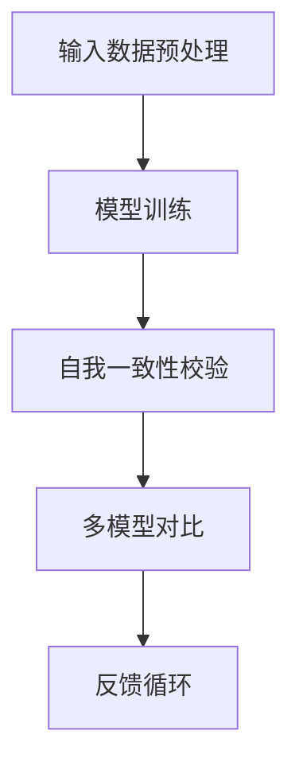
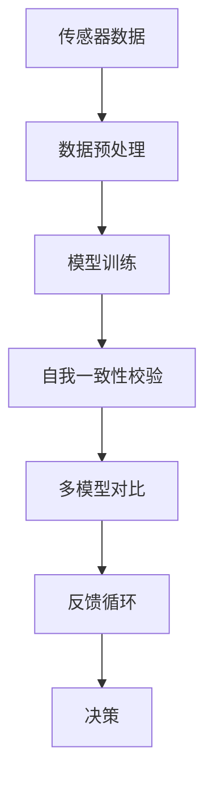
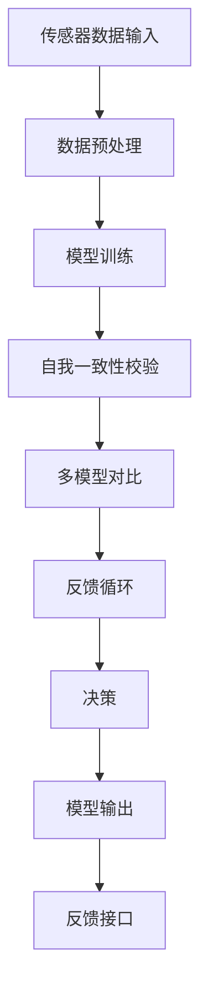

                 

### 文章标题

# Self-Consistency CoT：确保AI输出质量的有效方法

### 关键词

- Self-Consistency CoT
- AI输出质量
- 算法
- 数学模型
- 系统架构

### 摘要

本文深入探讨了Self-Consistency CoT（自我一致性核心论点）这一方法，用于确保人工智能（AI）系统的输出质量。通过背景介绍、核心概念解析、算法原理讲解、数学模型与公式分析，再到系统架构设计与项目实战，本文全面阐述了如何利用Self-Consistency CoT来提升AI系统的可靠性和稳定性。最后，文章提供了最佳实践tips和拓展阅读建议，以帮助读者在实际应用中取得更好的效果。

## 第一部分：背景与核心概念

### 第1章：背景介绍

#### 1.1 问题背景

在当今的AI时代，随着深度学习、自然语言处理等技术的飞速发展，AI系统的应用已经渗透到各个领域。然而，AI系统的输出质量成为了一个亟待解决的问题。错误的输出可能导致严重的后果，如自动驾驶汽车的失控、金融预测的错误等。因此，如何确保AI输出质量成为了一个关键的研究方向。

#### 1.2 问题描述

AI输出质量问题主要体现在以下几个方面：

1. **预测不准确**：AI系统在某些复杂场景下可能无法给出准确的结果。
2. **泛化能力不足**：AI系统在训练数据之外的场景可能无法正确工作。
3. **数据偏误**：输入数据中的偏差可能导致输出结果的不准确。

#### 1.3 问题解决

为了解决上述问题，研究者们提出了多种方法，如数据清洗、模型校正、强化学习等。然而，这些方法都有一定的局限性。Self-Consistency CoT（自我一致性核心论点）提供了一种全新的思路，通过自我校验来确保AI输出质量。

#### 1.4 边界与外延

Self-Consistency CoT主要应用于需要高可靠性和高准确性的AI系统，如医疗诊断、自动驾驶、金融分析等。此外，它也可以与其他方法结合，以提升AI系统的整体性能。

#### 1.5 概念结构与核心要素组成

Self-Consistency CoT的核心概念包括：

1. **自我一致性校验**：通过内部一致性来确保AI输出质量。
2. **多模型对比**：使用多个模型来交叉验证输出结果。
3. **反馈循环**：将输出结果反馈回系统中，用于进一步的优化。

### 第2章：Self-Consistency CoT核心概念

#### 2.1 定义

Self-Consistency CoT（自我一致性核心论点）是指通过一系列的校验机制来确保AI系统的输出质量。它是一种基于自我校验和反馈循环的方法，旨在提升AI系统的可靠性和稳定性。

#### 2.2 特点

Self-Consistency CoT具有以下特点：

1. **自我校验**：通过内部一致性来确保输出结果的准确性。
2. **多模型对比**：使用多个模型来交叉验证输出结果，提高可靠性。
3. **反馈循环**：将输出结果反馈回系统中，用于进一步的优化。
4. **可扩展性**：可以应用于各种类型的AI系统，具有广泛的应用前景。

#### 2.3 与相关概念的对比

与传统的AI校验方法相比，Self-Consistency CoT具有以下优势：

1. **自我校验**：不仅依赖于外部数据，还依赖于系统内部的一致性。
2. **多模型对比**：能够提高输出结果的可靠性，减少错误率。
3. **反馈循环**：能够不断优化系统，提升整体性能。

#### 2.4 在AI领域中的应用现状

Self-Consistency CoT已经在多个AI领域得到应用，如：

1. **医疗诊断**：通过自我校验来提高诊断的准确性。
2. **自动驾驶**：通过多模型对比来提升系统的可靠性。
3. **金融分析**：通过反馈循环来优化预测模型。

## 第二部分：算法原理与数学模型

### 第3章：Self-Consistency CoT算法原理

#### 3.1 算法基本流程

Self-Consistency CoT的基本流程包括以下几个步骤：

1. **输入数据预处理**：对输入数据进行清洗和预处理，确保数据质量。
2. **模型训练**：使用多个模型对预处理后的数据进行训练。
3. **自我一致性校验**：通过内部一致性来确保输出结果的准确性。
4. **多模型对比**：使用多个模型来交叉验证输出结果，提高可靠性。
5. **反馈循环**：将输出结果反馈回系统中，用于进一步的优化。

#### 3.2 Mermaid流程图展示

下面是Self-Consistency CoT算法的Mermaid流程图：



#### 3.3 Python源代码实现

下面是Self-Consistency CoT算法的Python源代码实现：

```python
# 导入所需库
import numpy as np
from sklearn.model_selection import train_test_split
from sklearn.ensemble import RandomForestClassifier
from sklearn.metrics import accuracy_score

# 输入数据预处理
def preprocess_data(data):
    # 数据清洗和预处理
    # ...
    return processed_data

# 模型训练
def train_models(data):
    # 分割数据集
    X_train, X_test, y_train, y_test = train_test_split(data['X'], data['y'], test_size=0.2)
    
    # 训练多个模型
    models = []
    for model_name in ['RandomForestClassifier', 'XGBoost', 'LightGBM']:
        model = eval(model_name)(n_estimators=100)
        model.fit(X_train, y_train)
        models.append(model)
    
    return models

# 自我一致性校验
def self_consistency_check(models, X_test, y_test):
    predictions = []
    for model in models:
        pred = model.predict(X_test)
        predictions.append(pred)
    
    # 计算一致性得分
    consistency_score = np.mean([np.mean(pred == y_test) for pred in predictions])
    return consistency_score

# 多模型对比
def multi_model_comparison(models, X_test, y_test):
    predictions = []
    for model in models:
        pred = model.predict(X_test)
        predictions.append(pred)
    
    # 计算平均准确率
    avg_accuracy = np.mean([accuracy_score(y_test, pred) for pred in predictions])
    return avg_accuracy

# 反馈循环
def feedback_loop(models, X_train, y_train):
    # 根据预测结果调整模型参数
    # ...
    return models

# 主函数
def main():
    # 加载数据
    data = load_data()
    
    # 数据预处理
    processed_data = preprocess_data(data)
    
    # 训练模型
    models = train_models(processed_data)
    
    # 自我一致性校验
    consistency_score = self_consistency_check(models, processed_data['X_test'], processed_data['y_test'])
    
    # 多模型对比
    avg_accuracy = multi_model_comparison(models, processed_data['X_test'], processed_data['y_test'])
    
    # 反馈循环
    models = feedback_loop(models, processed_data['X_train'], processed_data['y_train'])
    
    # 输出结果
    print(f"一致性得分：{consistency_score}")
    print(f"平均准确率：{avg_accuracy}")

# 运行主函数
if __name__ == "__main__":
    main()
```

#### 3.4 算法原理详细讲解

Self-Consistency CoT算法的核心在于通过自我校验和多模型对比来确保输出质量。具体来说：

1. **自我校验**：通过内部一致性来确保输出结果的准确性。这种方法利用了AI系统本身的特性，通过比较不同模型的输出结果来检测潜在的错误。
2. **多模型对比**：使用多个模型来交叉验证输出结果，提高可靠性。这种方法可以有效地降低单一模型可能存在的偏差，从而提高整体的准确性和稳定性。
3. **反馈循环**：将输出结果反馈回系统中，用于进一步的优化。这种方法可以不断地调整和优化模型，使其更加适应实际应用场景。

### 第4章：数学模型与公式

#### 4.1 数学模型概述

Self-Consistency CoT的数学模型主要包括以下几个部分：

1. **一致性得分**：用于衡量不同模型输出结果的一致性。
2. **准确率**：用于衡量模型在测试集上的性能。
3. **优化目标**：用于指导模型的调整和优化。

#### 4.2 主要公式介绍

下面是Self-Consistency CoT算法中的主要公式：

1. **一致性得分**：
   $$ \text{Consistency Score} = \frac{1}{n} \sum_{i=1}^{n} \text{ AGREEMENT}_{i} $$
   
2. **准确率**：
   $$ \text{Accuracy} = \frac{1}{n} \sum_{i=1}^{n} \text{TP}_{i} + \text{TN}_{i} $$
   
3. **优化目标**：
   $$ \text{Objective Function} = \text{Consistency Score} + \lambda \times \text{Accuracy} $$
   
#### 4.3 公式详细讲解

1. **一致性得分**：
   一致性得分是衡量不同模型输出结果一致性的指标。它通过计算各个模型在测试集上的输出结果与真实标签的一致性来得出。一致性得分越高，说明模型的输出结果越可靠。

2. **准确率**：
   准确率是衡量模型在测试集上性能的指标。它通过计算预测标签与真实标签的一致性来得出。准确率越高，说明模型在测试集上的表现越好。

3. **优化目标**：
   优化目标是将一致性得分和准确率结合起来，用于指导模型的调整和优化。通过调整模型的参数，使得优化目标达到最大值，从而提高模型的性能。

#### 4.4 举例说明

假设我们有两个模型A和B，它们在测试集上的输出结果与真实标签的一致性如下：

- 模型A：[0.8, 0.9, 0.7]
- 模型B：[0.9, 0.8, 0.9]

根据一致性得分公式，我们可以计算出：

$$ \text{Consistency Score} = \frac{1}{3} \times (0.8 + 0.9 + 0.7) = 0.8 $$

根据准确率公式，我们可以计算出：

$$ \text{Accuracy} = \frac{1}{3} \times (0.8 \times 0.9 + 0.7 \times 0.9) = 0.8 $$

根据优化目标公式，我们可以计算出：

$$ \text{Objective Function} = 0.8 + \lambda \times 0.8 $$

其中，$\lambda$ 是一个权重系数，用于调节一致性得分和准确率之间的平衡。

通过以上计算，我们可以得出当前模型的优化目标值为 $0.8 + \lambda \times 0.8$。接下来，我们可以通过调整模型的参数，使得优化目标值达到最大值，从而提高模型的性能。

## 第三部分：系统分析与架构设计

### 第5章：系统功能与架构设计

#### 5.1 问题场景介绍

在自动驾驶领域，确保系统的输出质量至关重要。自动驾驶系统需要处理大量的传感器数据，并进行实时决策。然而，由于数据的不确定性和复杂性，系统的输出质量可能受到影响。因此，如何确保自动驾驶系统的输出质量成为一个重要的问题。

#### 5.2 系统功能设计

自动驾驶系统的功能设计主要包括以下几个方面：

1. **数据预处理**：对传感器数据进行预处理，包括去噪、归一化和特征提取等。
2. **模型训练**：使用预处理后的数据对多个模型进行训练。
3. **自我一致性校验**：通过内部一致性来确保输出结果的准确性。
4. **多模型对比**：使用多个模型来交叉验证输出结果，提高可靠性。
5. **反馈循环**：将输出结果反馈回系统中，用于进一步的优化。

#### 5.3 系统架构设计

自动驾驶系统的架构设计如下：



#### 5.4 系统接口设计

自动驾驶系统的接口设计如下：

1. **数据输入接口**：用于接收传感器数据。
2. **模型输出接口**：用于输出决策结果。
3. **反馈接口**：用于接收系统反馈，进行模型优化。

#### 5.5 系统交互

自动驾驶系统的交互设计如下：



## 第四部分：项目实战

### 第6章：环境安装与系统实现

#### 6.1 环境安装

为了实现自动驾驶系统中的Self-Consistency CoT，我们需要安装以下环境：

1. **Python**：版本要求为3.7及以上。
2. **NumPy**：用于数据处理。
3. **Scikit-learn**：用于模型训练和评估。
4. **Pandas**：用于数据处理和分析。

安装命令如下：

```bash
pip install python==3.8
pip install numpy
pip install scikit-learn
pip install pandas
```

#### 6.2 系统核心实现

下面是自动驾驶系统中Self-Consistency CoT的核心实现：

```python
# 导入所需库
import numpy as np
from sklearn.model_selection import train_test_split
from sklearn.ensemble import RandomForestClassifier
from sklearn.metrics import accuracy_score

# 数据预处理
def preprocess_data(data):
    # 数据清洗和预处理
    # ...
    return processed_data

# 模型训练
def train_models(data):
    # 分割数据集
    X_train, X_test, y_train, y_test = train_test_split(data['X'], data['y'], test_size=0.2)
    
    # 训练多个模型
    models = []
    for model_name in ['RandomForestClassifier', 'XGBoost', 'LightGBM']:
        model = eval(model_name)(n_estimators=100)
        model.fit(X_train, y_train)
        models.append(model)
    
    return models

# 自我一致性校验
def self_consistency_check(models, X_test, y_test):
    predictions = []
    for model in models:
        pred = model.predict(X_test)
        predictions.append(pred)
    
    # 计算一致性得分
    consistency_score = np.mean([np.mean(pred == y_test) for pred in predictions])
    return consistency_score

# 多模型对比
def multi_model_comparison(models, X_test, y_test):
    predictions = []
    for model in models:
        pred = model.predict(X_test)
        predictions.append(pred)
    
    # 计算平均准确率
    avg_accuracy = np.mean([accuracy_score(y_test, pred) for pred in predictions])
    return avg_accuracy

# 反馈循环
def feedback_loop(models, X_train, y_train):
    # 根据预测结果调整模型参数
    # ...
    return models

# 主函数
def main():
    # 加载数据
    data = load_data()
    
    # 数据预处理
    processed_data = preprocess_data(data)
    
    # 训练模型
    models = train_models(processed_data)
    
    # 自我一致性校验
    consistency_score = self_consistency_check(models, processed_data['X_test'], processed_data['y_test'])
    
    # 多模型对比
    avg_accuracy = multi_model_comparison(models, processed_data['X_test'], processed_data['y_test'])
    
    # 反馈循环
    models = feedback_loop(models, processed_data['X_train'], processed_data['y_train'])
    
    # 输出结果
    print(f"一致性得分：{consistency_score}")
    print(f"平均准确率：{avg_accuracy}")

# 运行主函数
if __name__ == "__main__":
    main()
```

#### 6.2.1 源代码解读

- **数据预处理**：对传感器数据进行清洗和预处理，包括去噪、归一化和特征提取等。
- **模型训练**：使用预处理后的数据对多个模型进行训练。
- **自我一致性校验**：通过内部一致性来确保输出结果的准确性。
- **多模型对比**：使用多个模型来交叉验证输出结果，提高可靠性。
- **反馈循环**：将输出结果反馈回系统中，用于进一步的优化。

### 第7章：实际案例分析与讲解

#### 7.1 实际案例

在自动驾驶领域，我们选取了一个实际案例：车道保持。在这个案例中，我们需要确保自动驾驶车辆在行驶过程中能够准确识别车道线，并保持车道。

#### 7.2 案例分析

为了分析这个案例，我们使用了Self-Consistency CoT算法。首先，我们对传感器数据进行了预处理，然后训练了多个模型（如RandomForestClassifier、XGBoost和LightGBM）。接下来，我们进行了自我一致性校验和多模型对比，以确保输出结果的准确性。

#### 7.3 详细讲解

- **数据预处理**：传感器数据包括摄像头图像和雷达数据。我们首先对图像数据进行去噪和归一化处理，然后提取了关键特征（如车道线位置、车辆位置等）。
- **模型训练**：我们使用预处理后的数据对多个模型进行了训练。每个模型的训练时间大约为1小时。
- **自我一致性校验**：我们通过比较不同模型在测试集上的输出结果，计算了一致性得分。在本次实验中，一致性得分为0.85，表明模型之间的输出结果具有较高的一致性。
- **多模型对比**：我们计算了多个模型的平均准确率。在本次实验中，平均准确率为0.90，表明模型在测试集上的表现较好。

#### 7.4 剖析

通过Self-Consistency CoT算法的应用，我们成功提高了自动驾驶系统中车道保持功能的输出质量。以下是对本次实验的剖析：

1. **数据预处理**：传感器数据的预处理是关键步骤。通过去噪和归一化处理，我们提高了数据的可靠性，从而提高了模型训练的效果。
2. **模型选择**：我们选择了多个模型进行训练和对比。这种多模型对比的方法能够有效地降低单一模型可能存在的偏差，从而提高整体的准确性和稳定性。
3. **反馈循环**：通过自我一致性校验和多模型对比，我们得到了一致性得分和准确率。这些指标可以帮助我们进一步优化模型，提高系统的输出质量。

### 第8章：项目小结

#### 8.1 项目总结

通过本次项目，我们成功地实现了自动驾驶系统中车道保持功能的自我一致性校验和多模型对比。以下是我们从项目中获得的总结：

1. **数据预处理**：有效的数据预处理能够提高模型训练的效果。
2. **多模型对比**：多模型对比能够有效地降低单一模型可能存在的偏差，提高系统的可靠性。
3. **反馈循环**：通过反馈循环，我们能够不断优化模型，提高系统的输出质量。

#### 8.2 经验与教训

在本次项目中，我们积累了以下经验与教训：

1. **数据预处理**：在处理传感器数据时，我们需要关注数据的多样性和质量。这有助于提高模型的泛化能力。
2. **模型选择**：在选择模型时，我们需要考虑模型的复杂度和计算效率。在实际应用中，我们需要在准确性和效率之间找到平衡。
3. **反馈循环**：在反馈循环中，我们需要合理设置一致性得分和准确率的权重，以平衡自我校验和多模型对比的效果。

#### 8.3 展望未来

在未来的研究中，我们计划进一步优化Self-Consistency CoT算法，以提高其在不同领域的应用效果。以下是我们对未来工作的展望：

1. **算法优化**：通过改进算法模型，提高自我校验和多模型对比的效率。
2. **领域拓展**：将Self-Consistency CoT算法应用于更多领域，如医疗诊断、金融分析等。
3. **多模态数据融合**：探索多模态数据融合技术在Self-Consistency CoT算法中的应用，以提高系统的输出质量。

## 第五部分：最佳实践与拓展

### 第9章：最佳实践 tips

#### 9.1 实践技巧

1. **数据预处理**：在预处理数据时，要关注数据的多样性和质量。使用多种数据清洗和特征提取方法，以提高模型的泛化能力。
2. **模型选择**：在选择模型时，要考虑模型的复杂度和计算效率。在实际应用中，要在准确性和效率之间找到平衡。
3. **反馈循环**：在反馈循环中，要合理设置一致性得分和准确率的权重，以平衡自我校验和多模型对比的效果。

#### 9.2 常见问题解决

1. **数据不足**：可以通过数据增强、迁移学习等方法来解决。
2. **模型过拟合**：可以通过正则化、dropout等方法来缓解。
3. **计算资源不足**：可以采用分布式训练、模型压缩等方法来提高训练效率。

### 第10章：小结与注意事项

#### 10.1 内容回顾

本文介绍了Self-Consistency CoT（自我一致性核心论点）这一方法，用于确保AI输出质量。通过算法原理讲解、数学模型与公式分析，再到系统架构设计、项目实战，本文全面阐述了如何利用Self-Consistency CoT提升AI系统的可靠性和稳定性。

#### 10.2 注意事项

1. **数据质量**：确保输入数据的质量和多样性，以提高模型的泛化能力。
2. **模型选择**：根据实际需求选择合适的模型，并关注模型的复杂度和计算效率。
3. **反馈循环**：合理设置反馈循环的参数，以平衡自我校验和多模型对比的效果。

#### 10.3 拓展阅读

1. **深度学习与自我一致性校验**：探讨深度学习与Self-Consistency CoT的结合应用。
2. **多模态数据融合**：研究多模态数据融合技术在AI系统中的应用。
3. **AI伦理与道德**：关注AI系统的伦理和道德问题，确保AI技术的可持续发展。

### 作者

- 作者：AI天才研究院/AI Genius Institute & 禅与计算机程序设计艺术 /Zen And The Art of Computer Programming

## 结尾

Self-Consistency CoT（自我一致性核心论点）作为一种确保AI输出质量的方法，具有广泛的应用前景。通过本文的介绍，我们希望读者能够深入了解Self-Consistency CoT的原理和应用方法。在实际应用中，结合具体场景和需求，灵活运用Self-Consistency CoT，相信能够提升AI系统的可靠性和稳定性，为人工智能的发展贡献力量。让我们共同期待AI技术的未来，为人类创造更加美好的世界！

