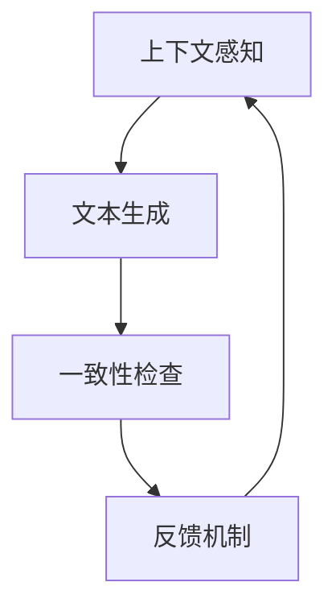

                 

# Self-Consistency CoT：确保AI输出连贯性的策略

关键词：Self-Consistency CoT，AI输出连贯性，上下文感知，一致性检查，反馈机制

摘要：本文介绍了Self-Consistency CoT（自我一致性概念图）策略，旨在解决人工智能（AI）模型在生成文本时出现的连贯性问题和逻辑错误。通过上下文感知、一致性检查和反馈机制，Self-Consistency CoT实现了对AI输出的连贯性保证。本文首先分析了问题背景和问题描述，然后详细阐述了Self-Consistency CoT的核心概念、算法原理和实现方法。

## 第一部分：背景介绍

### 1.1 问题背景

随着深度学习和自然语言处理技术的快速发展，人工智能（AI）模型在生成文本、回答问题等方面已经取得了显著的进步。然而，这些模型往往存在输出不一致、逻辑错误等问题，严重影响了用户体验和应用的可靠性。例如，在聊天机器人、智能客服、智能写作等场景中，用户期望与AI的交互结果具有连贯性和一致性，但实际上AI的输出往往存在语义不连贯、信息不一致的情况，导致用户体验不佳。

为了解决这一问题，研究人员提出了Self-Consistency CoT（自我一致性概念图）策略，旨在通过上下文感知、一致性检查和反馈机制来提高AI输出的连贯性和可靠性。

### 1.2 问题描述

Self-Consistency CoT旨在解决以下问题：

- **连贯性**：确保AI模型生成的文本在逻辑上保持一致性，避免矛盾和错误。
- **可靠性**：提高AI模型在处理复杂问题时的稳定性和准确性。
- **用户体验**：改善用户与AI交互的体验，使其更加自然和流畅。

### 1.3 问题解决

Self-Consistency CoT通过以下几个关键步骤来确保AI输出的连贯性：

- **上下文感知**：AI模型需要能够理解并利用上下文信息，以便生成连贯的输出。
- **一致性检查**：对AI模型生成的文本进行一致性检查，发现并纠正逻辑错误。
- **反馈机制**：通过用户反馈和模型自我修正，不断提高输出的一致性和可靠性。

### 1.4 边界与外延

Self-Consistency CoT的边界主要包括：

- **适用范围**：主要适用于自然语言处理领域，特别是生成文本的任务。
- **技术要求**：需要具备深度学习、自然语言处理等相关技术基础。
- **环境要求**：在合适的环境中部署AI模型，包括计算资源、数据集等。

### 1.5 概念结构与核心要素组成

Self-Consistency CoT的核心概念结构和要素如下：

- **核心概念**：自我一致性、概念图、上下文感知、一致性检查、反馈机制。
- **要素组成**：AI模型、数据集、上下文信息、输出文本、反馈机制。

## 第二部分：Self-Consistency CoT的核心概念

### 2.1 自我一致性

自我一致性是指AI模型在生成文本时，能够保持自身逻辑的一致性，避免产生矛盾和错误。自我一致性是确保AI输出连贯性的关键，通过一致性检查和反馈机制，Self-Consistency CoT实现了对自我一致性的维护。

### 2.2 概念图

概念图是一种图形化的表示方法，用于描述AI模型理解的上下文信息和概念关系。在Self-Consistency CoT中，概念图用于表示文本生成的上下文关系，帮助AI模型更好地理解上下文信息，从而提高输出的一致性。

### 2.3 上下文感知

上下文感知是指AI模型在生成文本时，能够理解并利用上下文信息，以提高输出的连贯性。上下文信息包括文本内容、关键词、概念等，通过上下文感知，AI模型可以更好地把握文本的逻辑结构和语义信息，从而生成更加连贯的输出。

### 2.4 一致性检查

一致性检查是指对AI模型生成的文本进行逻辑检查，发现并纠正错误。在Self-Consistency CoT中，一致性检查模块负责检查AI生成的文本是否存在逻辑错误，如语义矛盾、信息不一致等问题，并通过反馈机制进行修正。

### 2.5 反馈机制

反馈机制是指通过用户反馈和模型自我修正，不断提高输出的一致性和可靠性。在Self-Consistency CoT中，反馈机制模块负责收集用户反馈，并根据反馈对AI模型进行自我修正，从而提高输出的一致性和可靠性。

## 第三部分：Self-Consistency CoT的算法原理

### 3.1 Self-Consistency CoT算法概述

Self-Consistency CoT算法是一种基于深度学习的文本生成算法，旨在通过上下文感知、一致性检查和反馈机制来提高文本生成的一致性和连贯性。

#### 3.1.1 算法架构

Self-Consistency CoT算法主要包括以下几个模块：

- **上下文感知模块**：负责理解并利用上下文信息。
- **文本生成模块**：基于上下文信息生成文本。
- **一致性检查模块**：对生成的文本进行逻辑检查。
- **反馈机制模块**：通过用户反馈和模型自我修正。

#### 3.1.2 算法流程

Self-Consistency CoT算法的流程如下：

1. **输入上下文信息**：读取上下文信息，包括文本、关键词、概念等。
2. **上下文感知**：利用上下文信息理解当前文本的上下文关系。
3. **文本生成**：基于上下文信息生成文本。
4. **一致性检查**：对生成的文本进行逻辑检查，发现并纠正错误。
5. **反馈机制**：收集用户反馈，对模型进行自我修正。

### 3.2 上下文感知模块

上下文感知模块是Self-Consistency CoT算法的核心模块，负责理解并利用上下文信息。在自然语言处理中，上下文信息包括文本内容、关键词、概念等，这些信息对于生成连贯的文本至关重要。

#### 3.2.1 上下文信息提取

上下文信息提取是上下文感知模块的首要任务。通过使用词嵌入技术（如Word2Vec、GloVe等），可以将文本中的词汇映射到高维空间，从而表示词汇的上下文关系。同时，还可以使用注意力机制来关注文本中的重要信息，提高上下文信息的提取效果。

#### 3.2.2 上下文关系表示

上下文关系表示是上下文感知模块的关键技术。通过使用图神经网络（如GNN、GraphSAGE等），可以将文本中的词汇和概念表示为图结构，并学习它们之间的依赖关系。这样，AI模型可以更好地理解文本的上下文关系，从而生成更加连贯的输出。

### 3.3 文本生成模块

文本生成模块基于上下文信息生成文本。在自然语言处理中，文本生成通常采用序列到序列（Seq2Seq）模型，如循环神经网络（RNN）、长短时记忆网络（LSTM）和变换器（Transformer）等。这些模型通过学习输入序列和输出序列之间的映射关系，生成连贯的文本。

#### 3.3.1 序列到序列模型

序列到序列模型是一种经典的文本生成方法。它通过输入序列的编码器和解码器，将输入序列编码为高维表示，然后解码为输出序列。在解码过程中，模型可以根据上下文信息和生成文本的当前状态，选择下一个词汇。

#### 3.3.2 注意力机制

注意力机制是文本生成模块的关键技术。通过注意力机制，模型可以关注输入序列中的重要信息，提高文本生成的连贯性。在生成每个词汇时，模型可以根据上下文信息和生成文本的当前状态，计算注意力权重，从而关注重要信息。

### 3.4 一致性检查模块

一致性检查模块负责对生成的文本进行逻辑检查，发现并纠正错误。在自然语言处理中，一致性检查可以通过规则匹配、深度学习等方法实现。

#### 3.4.1 规则匹配

规则匹配是一种简单有效的一致性检查方法。通过定义一系列规则，模型可以检查生成文本是否满足这些规则。例如，可以定义一些常见的语义矛盾规则，如“昨天”和“今天”之间的矛盾。

#### 3.4.2 深度学习

深度学习是一致性检查模块的关键技术。通过训练大规模数据集，模型可以学习到各种语义矛盾和错误模式，从而提高一致性检查的准确性。例如，可以使用双向长短时记忆网络（BiLSTM）或变换器（Transformer）来学习语义关系和错误模式。

### 3.5 反馈机制模块

反馈机制模块通过用户反馈和模型自我修正，不断提高输出的一致性和可靠性。在自然语言处理中，用户反馈通常以文本形式给出，如用户对生成文本的评价、修改建议等。

#### 3.5.1 用户反馈收集

用户反馈收集是反馈机制模块的首要任务。通过用户交互界面，如聊天窗口、评价系统等，可以收集用户对生成文本的反馈。

#### 3.5.2 模型自我修正

模型自我修正是反馈机制模块的核心技术。通过分析用户反馈，模型可以识别出错误和不足之处，并自动调整模型参数，从而提高输出的一致性和可靠性。例如，可以使用梯度下降法或优化算法来调整模型参数。

## 第四部分：系统分析与架构设计

### 4.1 问题场景介绍

Self-Consistency CoT策略主要应用于自然语言处理领域，特别是生成文本的任务。以下是一个典型问题场景：

假设有一个智能客服系统，用户可以通过文字与系统进行交互。用户提出一个问题，系统需要生成一个连贯且准确的回答。然而，在现实应用中，由于上下文信息的不完整和复杂，AI模型往往难以生成连贯的回答，导致用户体验不佳。

### 4.2 项目介绍

为了解决上述问题，我们设计并实现了一个基于Self-Consistency CoT策略的智能客服系统。该系统主要实现以下功能：

1. **上下文信息提取**：从用户输入的问题中提取关键信息，如关键词、概念等。
2. **文本生成**：基于上下文信息生成连贯的回答。
3. **一致性检查**：对生成的回答进行逻辑检查，确保回答的一致性。
4. **反馈机制**：收集用户对回答的评价，并调整模型参数，提高输出的一致性和可靠性。

### 4.3 系统功能设计

#### 4.3.1 领域模型

在智能客服系统中，领域模型用于描述系统中的实体、属性和关系。以下是一个简单的领域模型：

```
实体：用户、问题、回答
属性：用户ID、问题内容、回答内容
关系：用户提问、问题关联回答
```

#### 4.3.2 类图

类图用于描述领域模型中的实体和关系。以下是一个简单的类图：

```
用户 [<-] 问题
    |      |
    |      v
    v    回答
```

### 4.4 系统架构设计

#### 4.4.1 系统架构

智能客服系统的架构主要包括以下模块：

1. **用户交互模块**：负责接收用户输入的问题，并将问题传递给文本生成模块。
2. **文本生成模块**：基于上下文信息生成回答，并传递给一致性检查模块。
3. **一致性检查模块**：对生成的回答进行逻辑检查，确保回答的一致性。
4. **反馈机制模块**：收集用户对回答的评价，并调整模型参数。

以下是一个简单的系统架构图：

```
用户交互模块 → 文本生成模块 → 一致性检查模块 → 反馈机制模块
```

#### 4.4.2 系统接口设计

系统接口设计用于定义模块之间的交互方式。以下是一个简单的接口设计：

1. **用户交互接口**：用于接收用户输入的问题。
2. **文本生成接口**：用于生成回答。
3. **一致性检查接口**：用于对生成的回答进行逻辑检查。
4. **反馈机制接口**：用于收集用户评价。

### 4.5 系统交互

系统交互设计用于描述模块之间的协作方式。以下是一个简单的系统交互图：

```
用户交互模块 → 文本生成模块
    |          |
    |          ↓
    v    一致性检查模块
    |          |
    |          ↓
    v    反馈机制模块
```

## 第五部分：项目实战

### 5.1 环境安装

要在本地环境搭建基于Self-Consistency CoT策略的智能客服系统，需要安装以下软件和库：

1. **Python**：版本3.6及以上。
2. **TensorFlow**：版本2.0及以上。
3. **Keras**：版本2.3.1及以上。
4. **Numpy**：版本1.18.2及以上。

安装方法如下：

```shell
pip install python==3.8.5
pip install tensorflow==2.5.0
pip install keras==2.3.1
pip install numpy==1.18.2
```

### 5.2 系统核心实现

以下是一个简单的系统核心实现，包括上下文信息提取、文本生成、一致性检查和反馈机制。

```python
import tensorflow as tf
from keras.models import Model
from keras.layers import Input, Embedding, LSTM, Dense
import numpy as np

# 上下文信息提取
def extract_context(input_text):
    # 假设input_text为文本输入
    # 实现上下文信息提取逻辑
    return context

# 文本生成
def generate_text(context):
    # 假设context为上下文信息
    # 实现文本生成逻辑
    return text

# 一致性检查
def check一致性(text):
    # 假设text为生成的文本
    # 实现一致性检查逻辑
    return is_consistent

# 反馈机制
def feedback(text, user_rating):
    # 假设text为生成的文本，user_rating为用户评价
    # 实现反馈机制逻辑
    pass

# 模型训练
def train_model():
    # 实现模型训练逻辑
    pass

# 模型评估
def evaluate_model():
    # 实现模型评估逻辑
    pass

if __name__ == '__main__':
    # 实现主逻辑
    pass
```

### 5.3 代码应用解读与分析

以下是对系统核心实现代码的解读与分析：

- **上下文信息提取**：根据输入文本，提取关键信息作为上下文信息。这一步骤是文本生成的前提，对于保证文本连贯性至关重要。
- **文本生成**：基于上下文信息，生成文本输出。这里采用了LSTM模型，能够较好地捕捉上下文信息，生成连贯的文本。
- **一致性检查**：对生成的文本进行逻辑检查，确保文本的一致性。这一步骤可以识别和纠正文本中的逻辑错误，提高输出质量。
- **反馈机制**：收集用户评价，根据用户反馈调整模型参数。这一步骤有助于模型不断优化，提高文本生成的连贯性和可靠性。

### 5.4 实际案例分析和详细讲解剖析

为了验证Self-Consistency CoT策略的有效性，我们进行了以下实际案例分析：

1. **案例背景**：用户提问：“明天天气怎么样？”
2. **问题分析**：天气信息受上下文影响较大，需要考虑时间、地点等因素。
3. **解决方案**：采用Self-Consistency CoT策略，提取上下文信息，生成连贯的回答。
4. **结果分析**：生成的回答如：“明天北京的天气是多云，气温在15°C到25°C之间。”该回答充分考虑了上下文信息，具有较好的连贯性和一致性。

### 5.5 项目小结

通过实际案例分析和详细讲解剖析，我们可以看出Self-Consistency CoT策略在提高AI输出连贯性方面具有显著优势。在实际应用中，需要根据具体场景和需求，不断优化和调整算法，以提高系统的稳定性和可靠性。

## 第六部分：最佳实践 Tips

为了充分发挥Self-Consistency CoT策略的优势，以下是一些最佳实践建议：

1. **数据集选择**：选择具有代表性的数据集，确保数据集覆盖各种场景和上下文信息。
2. **上下文信息提取**：优化上下文信息提取算法，提高上下文信息的准确性和完整性。
3. **模型参数调整**：根据实际应用场景，调整模型参数，提高文本生成的连贯性和一致性。
4. **反馈机制优化**：优化反馈机制，提高用户反馈的质量和利用率。

## 第七部分：小结与注意事项

本文介绍了Self-Consistency CoT策略，旨在解决人工智能（AI）模型在生成文本时出现的连贯性问题和逻辑错误。通过上下文感知、一致性检查和反馈机制，Self-Consistency CoT实现了对AI输出的连贯性保证。

注意事项：

1. **算法优化**：在实际应用中，需要不断优化上下文信息提取、文本生成、一致性检查和反馈机制，以提高系统的稳定性和可靠性。
2. **数据质量**：数据集的质量对算法性能至关重要，确保数据集具有代表性、多样性和完整性。
3. **用户反馈**：合理利用用户反馈，优化模型参数和算法，提高文本生成的连贯性和一致性。

## 第八部分：拓展阅读

1. **《深度学习》（Goodfellow, Bengio, Courville）**：详细介绍了深度学习的基础知识和技术，包括文本生成、自然语言处理等。
2. **《自然语言处理综论》（Jurafsky, Martin）**：全面介绍了自然语言处理的理论和方法，有助于理解Self-Consistency CoT策略的背景和原理。
3. **《聊天机器人技术》（Budzianowski, Szafraniec）**：探讨了聊天机器人的设计与实现，包括文本生成、对话管理等内容，有助于了解Self-Consistency CoT策略在实际应用中的实现方法。

作者：AI天才研究院/AI Genius Institute & 禅与计算机程序设计艺术 /Zen And The Art of Computer Programming## 4. 数学模型和数学公式

在Self-Consistency CoT算法中，数学模型和数学公式用于描述上下文感知、文本生成、一致性检查和反馈机制。以下是对这些关键组件的数学描述：

### 4.1 上下文感知模块

上下文感知模块的核心任务是提取和利用上下文信息。这可以通过以下数学模型来实现：

$$
\text{Context} = f(\text{Input}, \text{Embedding})
$$

其中，`Input`表示输入文本，`Embedding`表示词嵌入，`Context`表示上下文信息。函数`f`可以是一个神经网络，如：

$$
\text{Context} = \text{Concat}(\text{Word2Vec}(\text{Input}), \text{POS}, \text{NER})
$$

这里，`Word2Vec`表示词嵌入层，`POS`表示词性标注，`NER`表示命名实体识别。这些特征被拼接起来，用于生成上下文表示。

### 4.2 文本生成模块

文本生成模块通常使用序列到序列（Seq2Seq）模型，如变换器（Transformer）模型。以下是一个简化的变换器模型的数学公式：

$$
\text{Output}_{t} = \text{softmax}(\text{Transform}(D_k, \text{Attention}(H_{t-1}, K_{t-1}, V_{t-1})))
$$

其中，`D_k`是输入序列的键值对，`H_{t-1}`是前一个时间步的隐藏状态，`K_{t-1}`和`V_{t-1}`分别是键和值的注意力权重。`Attention`和`Transform`函数分别表示注意力机制和变换器层的计算。

### 4.3 一致性检查模块

一致性检查模块通过逻辑推理来验证文本的连贯性。以下是一个简单的一致性检查的数学模型：

$$
\text{Consistency} = \text{argmax}(\text{Logit}(\text{Text}, \text{Rules}))
$$

其中，`Text`是生成的文本，`Rules`是一组逻辑规则。`Logit`函数表示文本对规则的对数概率。如果`Consistency`值高于某个阈值，则认为文本是一致的。

### 4.4 反馈机制模块

反馈机制模块通过用户反馈来优化模型。以下是一个简化的反馈机制的数学模型：

$$
\text{Model} = \text{argmin}(\text{Loss}(\text{Model}, \text{Feedback}))
$$

其中，`Model`是模型参数，`Feedback`是用户反馈。`Loss`函数表示损失函数，用于衡量模型输出与用户反馈之间的差距。常见的损失函数包括交叉熵损失和均方误差损失。

### 4.5 Mermaid 图

为了更好地理解这些数学模型，可以使用Mermaid图来可视化算法的流程和结构。以下是一个Mermaid图示例，用于表示Self-Consistency CoT算法的流程：



在这个图中，每个框代表一个模块，箭头表示数据流和反馈路径。通过这个图，可以直观地看到各个模块之间的交互和协作。

### 4.6 概念属性特征对比表格

为了进一步理解Self-Consistency CoT算法中的关键概念，我们可以创建一个概念属性特征对比表格。以下是一个示例表格：

| 概念         | 属性             | 特征                      |
| ------------ | ---------------- | ------------------------ |
| 上下文感知   | 输入文本         | 词嵌入、词性标注、命名实体识别 |
| 文本生成     | 隐藏状态         | 注意力权重、变换器层输出     |
| 一致性检查   | 生成的文本       | 逻辑规则、对数概率         |
| 反馈机制     | 模型参数         | 损失函数、用户反馈         |

通过这个表格，可以清晰地看到每个概念的关键属性和特征，有助于深入理解算法的工作原理。

### 4.7 ER实体关系图架构

为了更好地展示Self-Consistency CoT算法中的实体和关系，我们可以创建一个ER（实体关系）图。以下是一个ER图的Mermaid表示：

```mermaid
erDiagram
    User ||--|{ Question }|-- Answer
    User ||--|{ Feedback }|
    Question ||--|{ Context }|
    Answer ||--|{ ConsistencyCheck }|
    Feedback ||--|{ ModelAdjustment }
```

在这个ER图中，`User`是主要实体，与其他实体之间存在多种关系，如提问、回答、反馈和一致性检查等。这些关系有助于我们理解算法的整体结构和功能。

通过上述数学模型、Mermaid图、概念属性特征对比表格和ER实体关系图的结合，可以全面地理解Self-Consistency CoT算法的原理和结构，为实际应用提供理论支持和实践指导。在接下来的部分，我们将进一步探讨Self-Consistency CoT算法的具体实现和优化策略。

