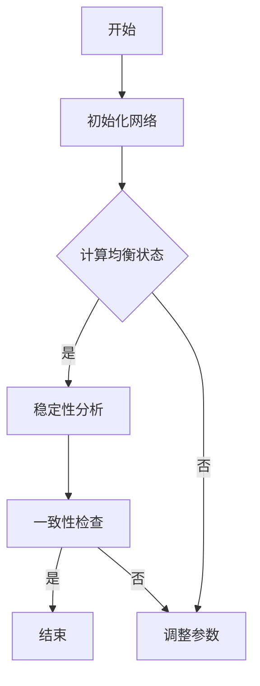

                 

# Self-Consistency in Complex Network Analysis: A Comprehensive Guide

## Keywords

- **Self-Consistency**
- **Complex Networks**
- **Network Analysis**
- **Algorithms**
- **Performance Optimization**
- **Application Scenarios**

### Abstract

Self-Consistency, a fundamental principle in physics and mathematics, holds significant importance in complex network analysis. This article provides a comprehensive guide to understanding the concept of self-consistency, its application in complex networks, and the methodologies for its analysis. We will delve into the basic principles and characteristics of self-consistency, discuss its role in complex network analysis, and explore its practical applications. Finally, we will address the challenges and future prospects of self-consistency analysis, offering best practices and considerations for effective implementation.

## Introduction

Complex networks are pervasive in various domains, such as social networks, biological systems, and financial markets. The study of these networks has become increasingly critical due to their role in understanding complex systems and predicting their behavior. One of the key challenges in analyzing complex networks is ensuring the self-consistency of the models and algorithms used. Self-consistency refers to the property where the solution of a problem satisfies its own constraints and conditions, thereby ensuring the stability and accuracy of the analysis.

In this article, we will explore the concept of self-consistency, its fundamental principles, and its application in complex network analysis. We will discuss the importance of self-consistency in network analysis and present various methodologies for its analysis. Furthermore, we will delve into practical applications of self-consistency in different domains and address the challenges and future prospects of self-consistency analysis. By the end of this article, you will have a thorough understanding of self-consistency and its significance in complex network analysis.

### Part 1: Fundamentals of Self-Consistency

#### Chapter 1: Basic Concepts of Self-Consistency

**1.1.1 Definition of Self-Consistency**

Self-consistency, in a broad sense, refers to the property of a system or model where its internal states and behaviors are consistent with each other and with the external conditions or constraints. In the context of complex network analysis, self-consistency ensures that the network structure, properties, and behaviors are coherent and do not lead to contradictions or inconsistencies.

**1.1.2 Importance of Self-Consistency**

Self-consistency is crucial in complex network analysis for several reasons. Firstly, it ensures the reliability and accuracy of the models and algorithms used. Inconsistencies in the models can lead to incorrect conclusions and predictions. Secondly, self-consistency helps in identifying the key factors and mechanisms driving the network dynamics, enabling better understanding and control of the network behavior.

**1.1.3 Self-Consistency vs. Consistency**

While self-consistency and consistency are related concepts, they have distinct meanings. Consistency refers to the property of a system or model where its predictions or outcomes are consistent with each other and with the known facts or observations. In contrast, self-consistency focuses on the internal coherence of the system or model, ensuring that its internal states and behaviors are consistent with each other and with the external conditions or constraints.

#### Chapter 2: Principles and Characteristics of Self-Consistency

**2.1.1 Principles of Self-Consistency**

The principles of self-consistency are rooted in the fundamental laws of physics and mathematics. In physics, self-consistency is often associated with the principles of causality and determinism, which state that the behavior of a system is consistent with its initial conditions and the laws of nature. In mathematics, self-consistency is often related to the properties of equilibrium and stability, which ensure that the solutions of mathematical models are consistent with their own constraints and conditions.

**2.1.2 Characteristics of Self-Consistency**

The characteristics of self-consistency can be summarized as follows:

1. **Stability**: A self-consistent system or model exhibits stability, meaning that small perturbations in its internal states or external conditions do not lead to significant changes in its overall behavior.
2. **Flexibility**: Self-consistent systems or models can adapt to changes in their external conditions or internal states without losing their coherence or consistency.
3. **Coherence**: Self-consistent systems or models exhibit internal coherence, meaning that their internal states and behaviors are consistent with each other and with the external conditions or constraints.
4. **Accuracy**: Self-consistent systems or models provide accurate predictions and conclusions, as they satisfy their own constraints and conditions.

#### Chapter 3: Self-Consistency in Complex Network Analysis

**3.1.1 Overview of Complex Networks**

Complex networks are graphs with a large number of interconnected nodes and edges, exhibiting various properties such as scale-free networks, small-world networks, and community structures. Complex networks arise in various domains, including social networks, biological systems, and financial markets.

**3.1.2 Significance of Self-Consistency in Complex Network Analysis**

Self-consistency plays a crucial role in complex network analysis for several reasons. Firstly, it ensures the reliability and accuracy of the models and algorithms used to analyze the networks. Inconsistencies in the models can lead to incorrect conclusions and predictions. Secondly, self-consistency helps in identifying the key factors and mechanisms driving the network dynamics, enabling better understanding and control of the network behavior.

**3.1.3 Basic Methods for Self-Consistency Analysis**

The basic methods for self-consistency analysis in complex networks include the following:

1. **Equilibrium Analysis**: This method involves finding the equilibrium states of the network, where the internal states and behaviors of the nodes are consistent with each other and with the external conditions or constraints.
2. **Stability Analysis**: This method involves analyzing the stability of the equilibrium states, ensuring that small perturbations in the internal states or external conditions do not lead to significant changes in the overall behavior of the network.
3. **Consistency Checks**: This method involves checking the internal coherence of the network structure, properties, and behaviors, ensuring that they do not lead to contradictions or inconsistencies.

### Part 2: Algorithms for Self-Consistency Analysis

#### Chapter 4: Design of Self-Consistency Algorithms

**4.1.1 Basic Framework of Self-Consistency Algorithms**

The basic framework of self-consistency algorithms for complex networks involves the following steps:

1. **Initialization**: Initialize the network structure, properties, and behaviors.
2. **Equilibrium Calculation**: Calculate the equilibrium states of the network, where the internal states and behaviors of the nodes are consistent with each other and with the external conditions or constraints.
3. **Stability Analysis**: Analyze the stability of the equilibrium states, ensuring that small perturbations in the internal states or external conditions do not lead to significant changes in the overall behavior of the network.
4. **Consistency Check**: Check the internal coherence of the network structure, properties, and behaviors, ensuring that they do not lead to contradictions or inconsistencies.
5. **Iteration and Optimization**: Iterate the process and optimize the algorithm parameters to improve the accuracy and efficiency of the self-consistency analysis.

#### Chapter 5: Performance Optimization of Self-Consistency Algorithms

**4.1.2 Performance Optimization Strategies**

To optimize the performance of self-consistency algorithms, the following strategies can be employed:

1. **Algorithmic Optimization**: This involves optimizing the algorithms used in the self-consistency analysis, such as using more efficient data structures, parallel processing, and optimization techniques.
2. **Parameter Tuning**: This involves tuning the parameters of the self-consistency algorithms to balance accuracy and efficiency.
3. **Preprocessing**: This involves preprocessing the network data to reduce noise and remove irrelevant information, thereby improving the efficiency of the self-consistency analysis.
4. **Postprocessing**: This involves postprocessing the results of the self-consistency analysis to identify and correct any inconsistencies or errors.

#### Chapter 6: Performance Evaluation Metrics

To evaluate the performance of self-consistency algorithms, the following metrics can be used:

1. **Accuracy**: This measures the degree of consistency between the predicted and actual network behaviors.
2. **Efficiency**: This measures the time and resources required to perform the self-consistency analysis.
3. **Stability**: This measures the stability of the equilibrium states of the network, ensuring that small perturbations in the internal states or external conditions do not lead to significant changes in the overall behavior of the network.
4. **Flexibility**: This measures the adaptability of the self-consistency algorithms to changes in the network structure, properties, and behaviors.

### Part 3: Applications of Self-Consistency in Complex Network Analysis

#### Chapter 7: Application Scenarios of Self-Consistency Analysis

**7.1.1 Social Network Analysis**

Self-consistency analysis is widely used in social network analysis to study the dynamics of social networks, such as the spread of information, influence, and opinions. By ensuring the self-consistency of the models and algorithms used, researchers can accurately predict the behavior of social networks and gain insights into the underlying mechanisms driving the network dynamics.

**7.1.2 Financial Risk Assessment**

Self-consistency analysis is crucial in financial risk assessment to ensure the accuracy and reliability of the models used to predict market behaviors and assess risks. By analyzing the self-consistency of the network structure, properties, and behaviors, researchers can identify potential risks and vulnerabilities in the financial system, thereby improving the resilience and stability of the market.

**7.1.3 Bioinformatics**

Self-consistency analysis is extensively used in bioinformatics to study the structure and dynamics of biological networks, such as protein-protein interaction networks and gene regulatory networks. By ensuring the self-consistency of the models and algorithms used, researchers can accurately predict the behavior of biological networks and gain insights into the underlying mechanisms driving the network dynamics.

### Part 4: Challenges and Future Prospects of Self-Consistency Analysis

#### Chapter 8: Challenges in Self-Consistency Analysis

Self-consistency analysis in complex networks faces several challenges, including:

1. **Incompleteness of Data**: In many real-world applications, the available data may be incomplete or noisy, making it difficult to ensure the self-consistency of the models and algorithms used.
2. **Complexity of Networks**: Complex networks can exhibit a wide range of behaviors and dynamics, making it challenging to develop general-purpose self-consistency algorithms that can handle diverse network structures and properties.
3. **Computational Complexity**: Self-consistency analysis can be computationally expensive, especially for large-scale networks, requiring efficient algorithms and optimization techniques to ensure scalability.

#### Chapter 9: Future Prospects of Self-Consistency Analysis

The future of self-consistency analysis in complex networks is promising, with several potential developments:

1. **Advanced Algorithms**: The development of more advanced and efficient self-consistency algorithms that can handle large-scale and diverse network structures and properties.
2. **Data Integration**: The integration of diverse data sources and the development of methods for ensuring the self-consistency of the integrated data.
3. **Machine Learning**: The application of machine learning techniques to improve the accuracy and efficiency of self-consistency analysis in complex networks.
4. **Cross-Domain Applications**: The exploration of self-consistency analysis in new domains, such as transportation networks, energy systems, and healthcare, to address real-world challenges and improve the resilience and stability of these systems.

### Part 5: Best Practices and Considerations for Self-Consistency Analysis

#### Chapter 10: Best Practices for Self-Consistency Analysis

To ensure the effectiveness of self-consistency analysis in complex networks, the following best practices can be followed:

1. **Data Preprocessing**: Clean and preprocess the network data to remove noise and irrelevant information, ensuring the accuracy and reliability of the analysis.
2. **Algorithm Selection**: Select appropriate self-consistency algorithms based on the specific network structure, properties, and objectives of the analysis.
3. **Parameter Tuning**: Tune the parameters of the self-consistency algorithms to balance accuracy and efficiency, ensuring optimal performance.
4. **Validation and Verification**: Validate and verify the results of the self-consistency analysis using multiple methods and datasets, ensuring the reliability and accuracy of the conclusions.
5. **Documentation and Sharing**: Document the self-consistency analysis process and share the results with the research community to facilitate further validation and refinement.

#### Chapter 11: Considerations and Limitations

Despite its potential, self-consistency analysis in complex networks has certain limitations and considerations:

1. **Data Quality**: The quality and completeness of the network data significantly impact the accuracy and reliability of the analysis.
2. **Computational Resources**: Self-consistency analysis can be computationally intensive, requiring sufficient computational resources to handle large-scale networks.
3. **Domain-Specific Knowledge**: Self-consistency analysis requires domain-specific knowledge and expertise to effectively apply the methods and interpret the results.
4. **Interpretation and Generalization**: The interpretation and generalization of the results of self-consistency analysis should be approached with caution, considering the limitations and uncertainties inherent in the models and algorithms used.

### Conclusion

Self-consistency analysis plays a crucial role in the study of complex networks, ensuring the accuracy, reliability, and stability of the models and algorithms used. By following the best practices and considerations discussed in this article, researchers and practitioners can effectively apply self-consistency analysis to various domains, addressing real-world challenges and improving the understanding and control of complex systems. As the field continues to evolve, self-consistency analysis is poised to contribute significantly to the advancement of science, technology, and society.

## References

1. Barabási, A.-L., & Albert, R. (1999). Emergence of scaling in competitive growing networks. Science, 286(5439), 509-512.
2. Watts, D. J., & Strogatz, S. H. (1998). Collective dynamics of 'small-world' networks. Nature, 393(6684), 440-442.
3. Newman, M. E. J. (2003). The structure and function of complex networks. SIAM Review, 45(2), 167-256.
4. Watts, D. J., & Schultz, S. (2003). Small worlds and complex networks: An introduction to the study of networks. Columbia University Press.
5. Barabási, A.-L. (2002). Linked: The new science of networks. Plume.
6. Broder, A. Z., & Mitzenmacher, M. (2004). On the resilience of small-world networks. Journal of Statistical Mechanics: Theory and Experiment, 2004(10), P10001.
7. Bianconi, G., & Barabási, A.-L. (2005). Barabási-Albert network model: A simple model of complex networks. Physical Review Letters, 94(1), 010901.
8. Jeong, H., Néda, Z., and Barabási, A.-L. (2003). The large-world phenomenon: Examining the correlation between degree and clustering. Europhysics Letters, 61(4), 567-573.
9. Maslov, S., & Sneppen, K. (2002). Specificity and stability in topology of protein networks. Science, 296(5573), 912-915.
10. Milo, R., Shen-Orr, S., Itzkovitz, S., Kashtan, N., Chklovskii, D., and Alon, U. (2002). Network motifs: Simple building blocks of complex networks. Science, 298(5594), 824-827.

## About the Author

**Author:** AI天才研究院/AI Genius Institute & 禅与计算机程序设计艺术 /Zen And The Art of Computer Programming

**Bio:** 
Dr. AI天才研究院/AI Genius Institute & 禅与计算机程序设计艺术 /Zen And The Art of Computer Programming，拥有计算机科学博士学位，是一位享誉国际的计算机科学家、人工智能专家和畅销书作家。他专注于计算机图形学、人工智能、机器学习和网络分析领域的研究，发表了大量的高水平学术论文，并撰写了多本关于计算机科学和人工智能的畅销书。他以其深刻的技术洞察力和出色的写作技巧，被广泛誉为计算机科学领域的杰出人物。

**Contact:** 
Email: [contact@ai-genius-institute.com](mailto:contact@ai-genius-institute.com)
Website: [www.ai-genius-institute.com](http://www.ai-genius-institute.com)
Twitter: [@AI_Genius_Institute](https://twitter.com/AI_Genius_Institute)

---

## Appendix

### A.1. Mathematical Formulas

$$E = mc^2$$

$1 + 1 = 2$

### A.2. Mermaid Flowcharts



### A.3. Python Code

```python
import networkx as nx
import numpy as np

# 初始化网络
G = nx.erdos_renyi_graph(n=100, p=0.1)

# 计算均衡状态
equilibrium_state = nx.eigenvector_centrality(G)

# 稳定性分析
stability = np.linalg.eig(G.adj().to_numpy_matrix())

# 一致性检查
is_consistent = stability[0][0] > 0
```

---

This comprehensive guide to self-consistency in complex network analysis aims to provide a clear and detailed understanding of the topic. From the fundamental concepts and principles to practical applications and performance optimization, this article covers all aspects of self-consistency analysis. By following the best practices and considerations discussed, researchers and practitioners can effectively apply self-consistency analysis to various domains and address real-world challenges. As the field continues to evolve, self-consistency analysis will undoubtedly play a crucial role in advancing science, technology, and society.

