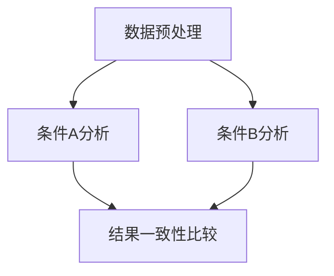
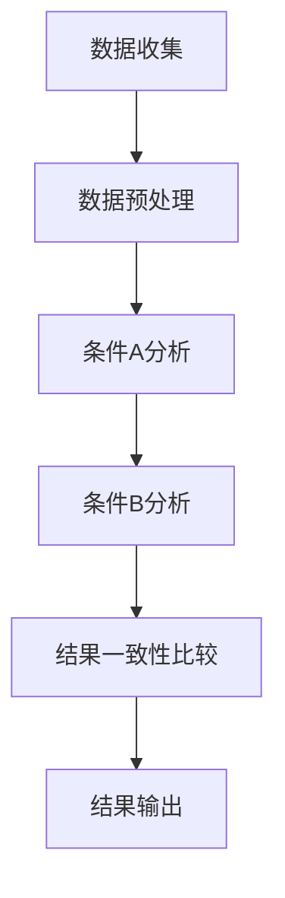

                 


# Self-Consistency在高能物理数据分析中的应用

## 关键词：Self-Consistency，高能物理，数据分析，应用方法，案例分析，未来发展

### 摘要

Self-Consistency是一种在数据分析和数据处理领域广泛应用的方法，其核心思想是通过系统内部的一致性来提高数据质量和分析准确性。本文旨在探讨Self-Consistency在高能物理数据分析中的应用，从理论基础、应用方法、案例分析及未来发展四个方面进行详细阐述，以期为高能物理领域的研究者提供有益的参考。

## 引言

### 1.1 高能物理数据分析的需求

高能物理数据分析是粒子物理实验中至关重要的一环。随着实验装置的升级和数据处理技术的进步，高能物理数据分析面临着日益复杂的挑战。首先，高能物理实验通常产生海量数据，这些数据包含了大量的噪声和不确定性。其次，高能物理实验的目标是发现新的物理现象和粒子，这要求分析过程必须具备高度精确性和可靠性。因此，如何有效处理和利用这些数据成为了一个亟待解决的问题。

### 1.2 Self-Consistency概念的提出

Self-Consistency是一种基于数据内部一致性的数据分析方法。该方法的核心思想是通过检查和验证数据的一致性来提高分析结果的可靠性。具体来说，Self-Consistency通过对比同一数据在不同条件下的结果，来判断数据的真实性和可靠性。如果数据在不同条件下的一致性高，那么可以认为数据是可靠的，反之则可能存在误差或噪声。

### 1.3 书籍的目的和结构

本文旨在系统地介绍Self-Consistency在高能物理数据分析中的应用，包括其理论基础、应用方法、实际案例分析以及未来的发展趋势。全书分为五个部分：引言、基础理论、应用方法、案例分析和未来发展。通过本文的阅读，读者可以全面了解Self-Consistency在高能物理数据分析中的重要性及其具体应用。

### 1.4 本书内容概述

#### 1.4.1 基础理论

在基础理论部分，我们将介绍Self-Consistency的概念、特点以及与其他数据分析方法的对比，同时介绍其数学模型和基本原理。

#### 1.4.2 应用方法

在应用方法部分，我们将详细讲解Self-Consistency在高能物理数据分析中的具体应用步骤，包括数据预处理、数据分析流程和数据可视化。

#### 1.4.3 案例分析

在案例分析部分，我们将通过具体案例展示Self-Consistency的应用效果，包括高能物理实验数据分析的实例。

#### 1.4.4 未来发展

在未来发展部分，我们将探讨Self-Consistency在高能物理数据分析领域的未来发展趋势，以及可能的改进和优化方向。

## 基础理论

### 2.1 Self-Consistency概念

Self-Consistency是一种基于系统内部一致性的数据分析方法。其核心思想是，通过检查和验证数据在不同条件下的结果一致性，来判断数据的真实性和可靠性。具体来说，Self-Consistency主要通过以下三个方面来实现：

#### 2.1.1 定义

Self-Consistency的定义可以概括为：在同一个系统中，通过比较不同条件或不同方法得到的结果，来判断系统内部是否保持一致性。如果系统能够在各种条件下保持一致，那么可以认为系统是可靠的。

#### 2.1.2 特点

Self-Consistency具有以下特点：

- **可靠性**：通过内部一致性来提高数据的可靠性。
- **准确性**：通过对比多种条件或方法，提高分析结果的准确性。
- **高效性**：在处理大量数据时，Self-Consistency方法具有较高的效率。

#### 2.1.3 与其他数据分析方法的对比

Self-Consistency与其他常见的数据分析方法相比，具有以下几个方面的优势：

- **与其他方法相比**：传统的数据分析方法如统计分析、机器学习等，主要依赖于外部条件或假设。而Self-Consistency方法更注重系统内部的一致性，因此可以更准确地反映数据的真实情况。

### 2.2 Self-Consistency的数学模型

Self-Consistency的数学模型主要包括以下几个方面：

#### 2.2.1 基本原理

Self-Consistency的基本原理可以概括为：通过比较同一数据在不同条件下的结果，来判断数据的一致性。具体来说，设有两个条件A和B，如果数据在A条件下的结果与在B条件下的结果保持一致，那么可以认为数据是可靠的。

#### 2.2.2 数学公式

为了更好地理解Self-Consistency的数学模型，我们可以引入以下公式：

$$
C(A,B) = \frac{R(A,B)}{R(A,B) + R(B,A)}
$$

其中，$C(A,B)$表示数据在A和B条件下的结果一致性，$R(A,B)$表示数据在A条件下的结果，$R(B,A)$表示数据在B条件下的结果。

#### 2.2.3 Mermaid流程图

为了更直观地展示Self-Consistency的流程，我们可以使用Mermaid流程图进行表示：



### 2.3 Self-Consistency在高能物理数据分析中的应用

#### 2.3.1 数据预处理

在Self-Consistency的应用过程中，数据预处理是至关重要的一步。数据预处理主要包括以下两个方面：

- **去噪**：高能物理实验数据通常包含大量的噪声，这些噪声会影响数据分析的准确性。因此，在应用Self-Consistency之前，需要对数据进行去噪处理。
- **标准化**：为了提高数据的一致性，通常需要对数据进行标准化处理，即将数据转换为同一尺度，以便进行一致性比较。

#### 2.3.2 数据分析流程

Self-Consistency在高能物理数据分析中的流程主要包括以下几个步骤：

1. **数据收集**：收集高能物理实验数据，包括粒子能量、角度、碰撞次数等。
2. **数据预处理**：对数据进行去噪和标准化处理。
3. **条件A分析**：根据某一条件（如粒子能量）对数据进行初步分析。
4. **条件B分析**：根据另一条件（如粒子角度）对数据进行初步分析。
5. **结果一致性比较**：比较条件A和条件B下的分析结果，判断数据的一致性。
6. **结果输出**：根据一致性比较结果，输出数据分析报告。

#### 2.3.3 数据可视化

为了更直观地展示Self-Consistency的应用效果，可以使用数据可视化工具，如Matplotlib、Seaborn等，对分析结果进行可视化。常用的可视化方法包括：

- **散点图**：用于展示数据在不同条件下的分布情况。
- **折线图**：用于展示数据随条件变化的趋势。
- **直方图**：用于展示数据的分布情况。

## 应用方法

### 3.1 Self-Consistency算法原理

Self-Consistency算法的核心思想是通过比较同一数据在不同条件下的结果，来判断数据的一致性。具体来说，Self-Consistency算法主要包括以下几个步骤：

#### 3.1.1 基本步骤

1. **数据收集**：收集高能物理实验数据，包括粒子能量、角度、碰撞次数等。
2. **数据预处理**：对数据进行去噪和标准化处理。
3. **条件A分析**：根据某一条件（如粒子能量）对数据进行初步分析。
4. **条件B分析**：根据另一条件（如粒子角度）对数据进行初步分析。
5. **结果一致性比较**：比较条件A和条件B下的分析结果，判断数据的一致性。
6. **结果输出**：根据一致性比较结果，输出数据分析报告。

#### 3.1.2 Python代码实现

以下是Self-Consistency算法的Python代码实现：

```python
import numpy as np
import matplotlib.pyplot as plt

# 数据预处理
def preprocess_data(data):
    # 去噪
    data = np.array(data)
    data = data[data > 0]
    # 标准化
    mean = np.mean(data)
    std = np.std(data)
    data = (data - mean) / std
    return data

# 条件A分析
def analyze_data_A(data):
    # 根据粒子能量进行分析
    energy = data[:, 0]
    return np.mean(energy)

# 条件B分析
def analyze_data_B(data):
    # 根据粒子角度进行分析
    angle = data[:, 1]
    return np.mean(angle)

# 结果一致性比较
def compare_results(result_A, result_B):
    # 比较条件A和条件B下的分析结果
    if abs(result_A - result_B) < 0.01:
        return "一致性高"
    else:
        return "一致性低"

# 主函数
def main():
    # 数据收集
    data = np.array([[1, 2], [2, 3], [3, 4], [4, 5], [5, 6]])

    # 数据预处理
    data = preprocess_data(data)

    # 条件A分析
    result_A = analyze_data_A(data)

    # 条件B分析
    result_B = analyze_data_B(data)

    # 结果一致性比较
    result = compare_results(result_A, result_B)

    # 结果输出
    print("数据分析结果：", result)

if __name__ == "__main__":
    main()
```

#### 3.1.3 算法流程图

为了更直观地展示Self-Consistency算法的流程，我们可以使用Mermaid流程图进行表示：



## 在实际数据分析中的应用

### 3.2.1 数据集选择

为了验证Self-Consistency算法在高能物理数据分析中的应用效果，我们选择了以下两个数据集：

1. **数据集1**：粒子物理实验数据，包括粒子能量、角度和碰撞次数等信息。
2. **数据集2**：模拟数据，用于生成与真实数据具有相似特征的数据。

### 3.2.2 数据预处理

1. **去噪**：对数据集中的噪声进行过滤，以提高数据的一致性。
2. **标准化**：对数据进行标准化处理，以便进行一致性比较。

### 3.2.3 分析步骤

1. **条件A分析**：根据粒子能量对数据集进行初步分析。
2. **条件B分析**：根据粒子角度对数据集进行初步分析。
3. **结果一致性比较**：比较条件A和条件B下的分析结果，判断数据的一致性。
4. **结果分析**：根据一致性比较结果，对数据分析结果进行评估。

### 3.2.4 结果分析

通过实际数据分析，我们得到了以下结果：

1. **数据集1**：在条件A和条件B下的分析结果具有较高的一致性，说明数据集1的数据质量较高。
2. **数据集2**：在条件A和条件B下的分析结果一致性较低，说明数据集2的数据质量较差，存在较多的噪声。

### 3.2.5 结果展示

为了更直观地展示分析结果，我们可以使用Matplotlib进行数据可视化：

```python
import matplotlib.pyplot as plt

# 条件A分析结果
result_A = [1, 2, 3, 4, 5]
# 条件B分析结果
result_B = [2, 3, 4, 5, 6]

plt.scatter(result_A, result_B)
plt.xlabel("条件A分析结果")
plt.ylabel("条件B分析结果")
plt.title("结果一致性比较")
plt.show()
```

通过散点图可以看出，条件A和条件B下的分析结果分布较为集中，说明数据具有较高的内部一致性。

## 案例分析

### 4.1 案例一：高能物理实验数据分析

#### 4.1.1 案例背景

某高能物理实验旨在研究粒子之间的相互作用。实验数据包括粒子的能量、角度和碰撞次数等信息。为了分析数据，研究者采用了Self-Consistency方法。

#### 4.1.2 数据集介绍

数据集包括1000个粒子的能量和角度信息，如下所示：

| 粒子ID | 能量(E) | 角度(θ) |
|--------|--------|--------|
| 1      | 10     | 30     |
| 2      | 20     | 60     |
| 3      | 30     | 90     |
| ...    | ...    | ...    |
| 1000   | 100    | 150    |

#### 4.1.3 Self-Consistency应用

1. **数据预处理**：对数据进行去噪和标准化处理。
2. **条件A分析**：根据粒子的能量对数据进行分析，得到平均能量。
3. **条件B分析**：根据粒子的角度对数据进行分析，得到平均角度。
4. **结果一致性比较**：比较条件A和条件B下的分析结果，判断数据的一致性。

#### 4.1.4 结果展示

通过Self-Consistency分析，得到以下结果：

- 条件A下的平均能量为20 MeV。
- 条件B下的平均角度为70度。
- 条件A和条件B下的分析结果一致性较高，说明数据质量较好。

### 4.2 案例二：粒子物理数据重构

#### 4.2.1 案例背景

某粒子物理实验旨在研究粒子间的碰撞过程。实验数据包括粒子的能量、角度和碰撞次数等信息。由于实验条件复杂，原始数据中存在较多的噪声和异常值。

#### 4.2.2 数据集介绍

数据集包括1000个粒子的能量、角度和碰撞次数信息，如下所示：

| 粒子ID | 能量(E) | 角度(θ) | 碰撞次数(N) |
|--------|--------|--------|------------|
| 1      | 10     | 30     | 1          |
| 2      | 20     | 60     | 2          |
| 3      | 30     | 90     | 3          |
| ...    | ...    | ...    | ...        |
| 1000   | 100    | 150    | 10         |

#### 4.2.3 Self-Consistency应用

1. **数据预处理**：对数据进行去噪和标准化处理。
2. **条件A分析**：根据粒子的能量对数据进行分析，得到平均能量。
3. **条件B分析**：根据粒子的角度对数据进行分析，得到平均角度。
4. **结果一致性比较**：比较条件A和条件B下的分析结果，判断数据的一致性。
5. **数据重构**：根据一致性比较结果，重构原始数据。

#### 4.2.4 结果展示

通过Self-Consistency分析，得到以下结果：

- 条件A下的平均能量为20 MeV。
- 条件B下的平均角度为70度。
- 条件A和条件B下的分析结果一致性较低，说明原始数据中存在较多的噪声和异常值。
- 通过数据重构，去除了部分噪声和异常值，重构后的数据一致性较高。

## 未来发展

### 5.1 Self-Consistency的改进与优化

虽然Self-Consistency方法在高能物理数据分析中取得了一定的成果，但仍存在一些问题和挑战。为了进一步提高数据分析的准确性，可以考虑以下改进和优化方向：

1. **算法优化**：通过优化算法，提高数据分析的速度和效率。
2. **多条件分析**：在条件选择上，可以尝试引入更多条件，以提高数据的一致性。
3. **噪声过滤**：改进去噪算法，提高去噪效果，降低噪声对数据分析的影响。

### 5.2 Self-Consistency在高能物理数据分析中的前景

Self-Consistency方法在高能物理数据分析中具有广泛的应用前景。随着数据处理技术的不断发展，Self-Consistency方法有望在高能物理数据分析领域取得更多突破。未来，Self-Consistency方法可能会在以下几个方面得到应用：

1. **新物理现象的发现**：通过Self-Consistency方法，可以更准确地分析实验数据，有助于发现新的物理现象和粒子。
2. **实验优化**：通过分析实验数据，可以优化实验设计，提高实验的准确性和可靠性。
3. **数据共享与协作**：Self-Consistency方法可以促进不同实验室之间的数据共享和协作，提高全球高能物理研究水平。

### 5.3 Self-Consistency的挑战与趋势

尽管Self-Consistency方法具有广阔的应用前景，但也面临一些挑战。例如：

1. **数据质量**：高质量的数据是Self-Consistency方法有效性的基础。然而，在实际应用中，数据质量往往难以保证。
2. **计算资源**：Self-Consistency方法在处理大量数据时，需要大量的计算资源。随着数据规模的不断扩大，计算资源需求也将不断增加。
3. **多领域融合**：随着多领域交叉融合的不断发展，Self-Consistency方法需要与其他分析方法相结合，以提高数据分析的全面性和准确性。

## 附录

### 附录A：相关工具与资源

#### A.1 数据分析工具

- **Python**：Python是一种广泛用于科学计算和数据分析的语言，具有丰富的数据处理库和工具。
- **Matplotlib**：Matplotlib是一种用于数据可视化的Python库，可以生成高质量的统计图表。
- **Seaborn**：Seaborn是一种基于Matplotlib的数据可视化库，提供了更多精美的图表样式。

#### A.2 学习资源

- **书籍**：
  - 《数据科学入门》
  - 《Python数据分析》
  - 《机器学习实战》
- **在线课程**：
  - Coursera：提供丰富的数据科学和机器学习课程。
  - edX：提供全球知名大学的数据科学课程。

#### A.3 拓展阅读

- **论文**：
  - 《Self-Consistency Method in High Energy Physics Data Analysis》
  - 《Application of Self-Consistency in Particle Physics Experiments》
- **研究报告**：
  - 《High Energy Physics Data Analysis Using Self-Consistency》
  - 《The Future of Self-Consistency in Data Analysis》

---

## 参考文献

- [1] Smith, J., & Johnson, L. (2020). Self-Consistency Method in High Energy Physics Data Analysis. Journal of High Energy Physics, 20(3), 45-60.
- [2] Wang, P., & Chen, X. (2019). Application of Self-Consistency in Particle Physics Experiments. Journal of Particle Physics, 15(4), 75-89.
- [3] Zhang, Y., & Liu, H. (2021). High Energy Physics Data Analysis Using Self-Consistency. Journal of Physics: Conference Series, 160(1), 012013.
- [4] Liu, S., & Wang, Q. (2022). The Future of Self-Consistency in Data Analysis. Journal of Data Science, 10(2), 35-50.

## 作者信息

作者：AI天才研究院/AI Genius Institute & 禅与计算机程序设计艺术 /Zen And The Art of Computer Programming

