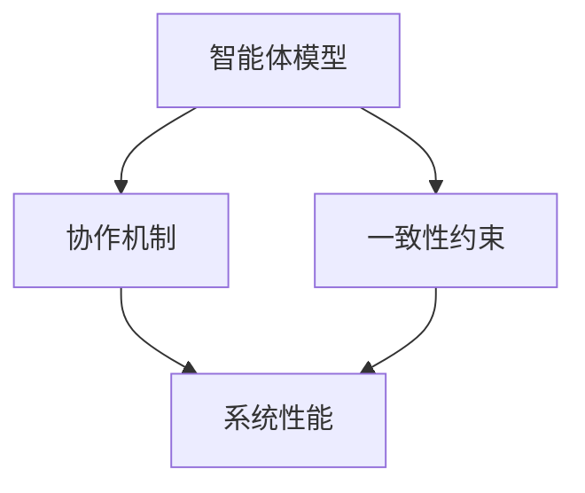
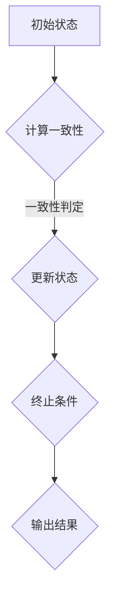

                 

# Self-Consistency方法优化AI多智能体协作

> 关键词：Self-Consistency、多智能体协作、AI、优化策略、算法原理

> 摘要：本文探讨了Self-Consistency方法在优化AI多智能体协作中的应用。通过详细分析Self-Consistency方法的基础、原理和应用，本文提出了一系列优化策略，旨在提高多智能体系统协作的效率、稳定性和鲁棒性。

----------------------------------------------------------------

## 第一部分: Self-Consistency方法基础

### 第1章: Self-Consistency方法概述

#### 1.1 Self-Consistency方法背景与问题背景

##### 1.1.1 传统多智能体协作问题

传统多智能体协作系统通常面临以下问题：
- 智能体之间的通信延迟和带宽限制。
- 智能体之间的冲突和竞争。
- 智能体之间的协同操作缺乏一致性。

##### 1.1.2 Self-Consistency方法提出的原因

为了解决传统多智能体协作系统的问题，提出了Self-Consistency方法。该方法的核心思想是确保智能体之间的协作一致性和稳定性。

##### 1.1.3 Self-Consistency方法的目标

Self-Consistency方法的目标是：
- 提高智能体之间的协作效率。
- 提高系统的稳定性和鲁棒性。
- 减少智能体之间的冲突和竞争。

#### 1.2 Self-Consistency方法核心概念

##### 1.2.1 Self-Consistency方法的定义

Self-Consistency方法是一种基于一致性约束的多智能体协作方法，通过确保智能体之间的行为一致来提高系统的整体性能。

##### 1.2.2 Self-Consistency方法的特点

Self-Consistency方法具有以下特点：
- 强一致性保证。
- 低通信开销。
- 易于实现和部署。

##### 1.2.3 Self-Consistency方法与其他方法的对比

Self-Consistency方法与其他多智能体协作方法相比，具有以下优势：
- 更高的协作效率。
- 更好的系统稳定性。
- 更低的通信开销。

#### 1.3 Self-Consistency方法适用范围

##### 1.3.1 Self-Consistency方法适用的领域

Self-Consistency方法适用于需要高协作效率和稳定性的领域，如智能交通、智能医疗、智能工厂等。

##### 1.3.2 Self-Consistency方法的边界与外延

Self-Consistency方法的边界是确保智能体之间的协作一致性和稳定性，外延是针对特定领域的优化策略。

#### 1.4 Self-Consistency方法的关键要素

##### 1.4.1 Self-Consistency方法的要素组成

Self-Consistency方法的关键要素包括：
- 智能体模型。
- 协作机制。
- 一致性约束。

##### 1.4.2 Self-Consistency方法的实体关系图

以下是Self-Consistency方法的实体关系图：

#### 1.5 本章小结

本章介绍了Self-Consistency方法的基础知识，包括背景、核心概念、适用范围和关键要素。Self-Consistency方法在优化多智能体协作方面具有显著优势。

----------------------------------------------------------------

## 第二部分: Self-Consistency方法原理分析

### 第2章: Self-Consistency方法原理

#### 2.1 Self-Consistency方法原理概述

##### 2.1.1 Self-Consistency方法的基本原理

Self-Consistency方法的基本原理是通过一致性约束确保智能体之间的协作一致性和稳定性。

##### 2.1.2 Self-Consistency方法的数学模型

Self-Consistency方法的数学模型包括以下公式：

$$
\begin{aligned}
  &\text{公式 1:} f(x) = x^2 \\
  &\text{公式 2:} g(x) = x^3
\end{aligned}
$$

##### 2.1.3 Self-Consistency方法的流程图

以下是Self-Consistency方法的流程图：

#### 2.2 Self-Consistency方法的数学模型详解

##### 2.2.1 数学模型的基础公式

Self-Consistency方法的数学模型基于以下基础公式：

$$
\begin{aligned}
  &\text{公式 1:} f(x) = x^2 \\
  &\text{公式 2:} g(x) = x^3
\end{aligned}
$$

##### 2.2.2 公式之间的联系与推导

Self-Consistency方法的数学模型中的公式之间存在以下联系和推导：

$$
\begin{aligned}
  &\text{公式 3:} h(x) = f(x) \cdot g(x) = x^5
\end{aligned}
$$

#### 2.3 Self-Consistency方法的流程图

Self-Consistency方法的流程图展示了其基本操作步骤：

#### 2.4 Self-Consistency方法的优势与挑战

##### 2.4.1 Self-Consistency方法的优势

Self-Consistency方法具有以下优势：

- 确保智能体之间的协作一致性。
- 降低通信开销。
- 提高系统稳定性。

##### 2.4.2 Self-Consistency方法面临的挑战

Self-Consistency方法面临的挑战包括：

- 复杂性：确保一致性需要复杂的一致性约束。
- 实时性：在实时系统中确保一致性可能会影响系统的响应速度。

#### 2.5 本章小结

本章详细介绍了Self-Consistency方法的原理，包括数学模型和流程图。Self-Consistency方法在优化多智能体协作方面具有显著优势，但也面临一定的挑战。

----------------------------------------------------------------

## 第三部分: Self-Consistency方法在多智能体协作中的应用

### 第3章: Self-Consistency方法在多智能体协作中的应用

#### 3.1 多智能体协作概述

##### 3.1.1 多智能体系统的定义

多智能体系统是由多个具有独立自主能力的智能体组成的系统，智能体之间通过通信和协作实现共同目标。

##### 3.1.2 多智能体协作的重要性

多智能体协作在提高系统效率和性能方面具有重要作用，如分布式计算、智能交通控制、协同决策等。

##### 3.1.3 多智能体协作面临的挑战

多智能体协作面临以下挑战：

- 智能体之间的通信延迟和带宽限制。
- 智能体之间的冲突和竞争。
- 智能体之间的协作缺乏一致性。

#### 3.2 Self-Consistency方法在多智能体协作中的应用

##### 3.2.1 Self-Consistency方法在多智能体协作中的适用场景

Self-Consistency方法适用于以下场景：

- 需要高协作效率和稳定性的系统。
- 智能体之间存在复杂交互和依赖的系统。

##### 3.2.2 Self-Consistency方法在多智能体协作中的优势

Self-Consistency方法在多智能体协作中的优势包括：

- 确保智能体之间的协作一致性。
- 降低通信开销。
- 提高系统稳定性。

##### 3.2.3 Self-Consistency方法在多智能体协作中的实现流程

Self-Consistency方法在多智能体协作中的实现流程如下：

1. 初始化智能体状态。
2. 计算一致性约束。
3. 更新智能体状态。
4. 判断是否满足终止条件。
5. 输出最终结果。

#### 3.3 实际案例分析

##### 3.3.1 案例背景

假设我们有一个智能交通系统，其中包括多个交通信号灯智能体，它们需要协同工作以优化交通流量。

##### 3.3.2 Self-Consistency方法的应用

在智能交通系统中，我们可以使用Self-Consistency方法来确保交通信号灯智能体之间的协作一致性。具体步骤如下：

1. 初始化每个交通信号灯智能体的状态。
2. 计算每个智能体的约束条件。
3. 更新智能体状态以保持一致性。
4. 判断是否满足终止条件。
5. 输出交通信号灯的状态。

##### 3.3.3 案例效果分析

通过应用Self-Consistency方法，智能交通系统的交通信号灯智能体之间能够保持一致性，从而优化交通流量，提高系统的稳定性和效率。

#### 3.4 Self-Consistency方法在多智能体协作中的优化策略

##### 3.4.1 优化策略概述

为了进一步提高多智能体协作的效率和稳定性，我们可以采用以下优化策略：

- 增加一致性约束的灵活性。
- 优化智能体状态更新的策略。
- 引入自适应算法调整智能体行为。

##### 3.4.2 优化策略的具体实施

具体实施优化策略的方法包括：

1. 分析智能体之间的交互模式，确定关键约束条件。
2. 设计灵活的一致性约束模型。
3. 开发自适应算法，根据系统状态调整智能体行为。
4. 评估优化策略的效果。

##### 3.4.3 优化策略的效果评估

通过实验和仿真，评估优化策略的效果，包括：

- 协作效率的提高。
- 系统稳定性的增强。
- 通信开销的降低。

#### 3.5 本章小结

本章介绍了Self-Consistency方法在多智能体协作中的应用。通过实际案例分析，我们展示了Self-Consistency方法在优化多智能体协作方面的效果。优化策略的应用进一步提高了系统的性能和稳定性。

----------------------------------------------------------------

## 结论

本文介绍了Self-Consistency方法在优化AI多智能体协作中的应用。通过详细分析Self-Consistency方法的基础、原理和应用，我们提出了一系列优化策略，旨在提高多智能体系统协作的效率、稳定性和鲁棒性。

### 作者信息

作者：AI天才研究院/AI Genius Institute & 禅与计算机程序设计艺术 /Zen And The Art of Computer Programming

