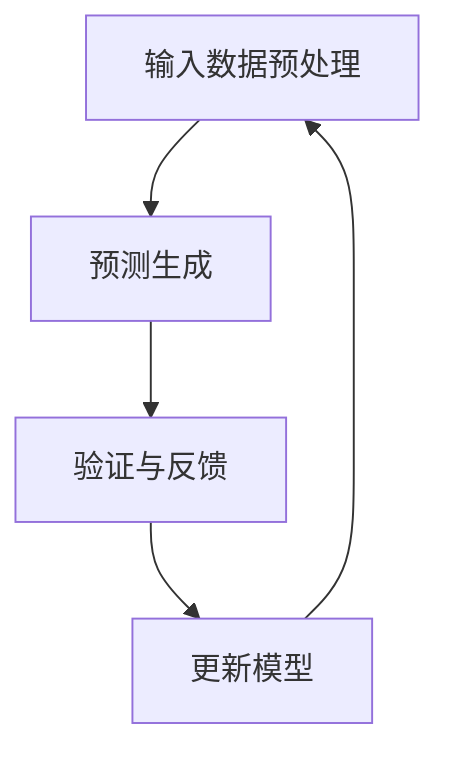
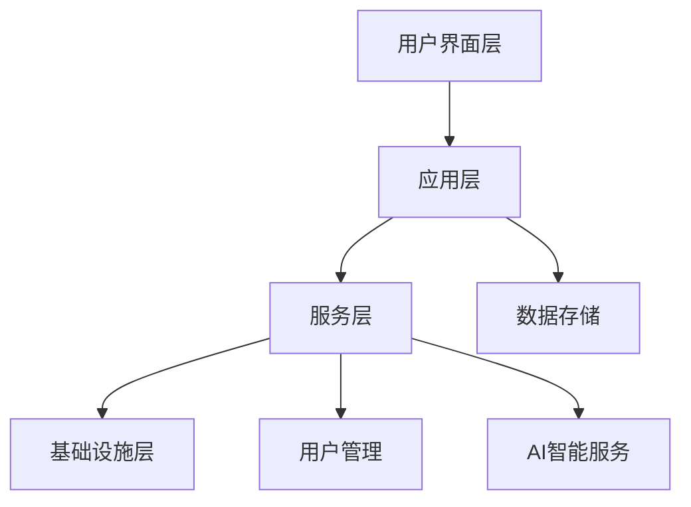
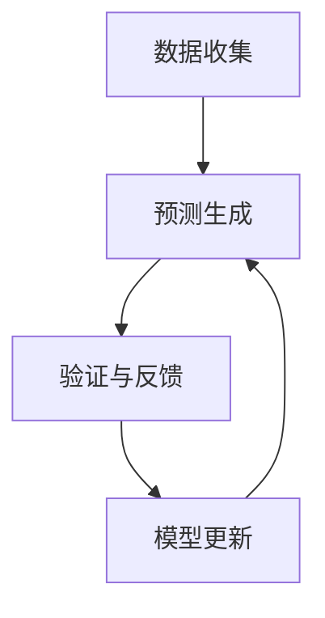
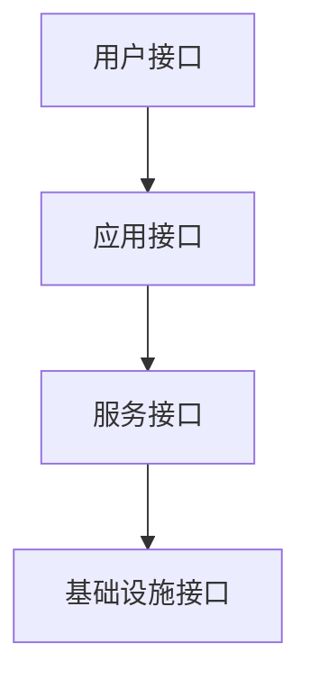
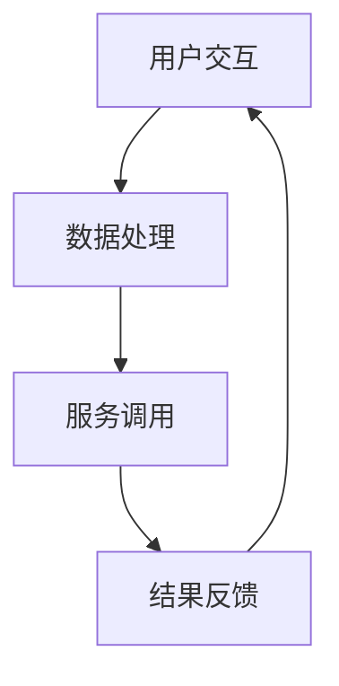

                 

### Self-Consistency方法改善AI虚拟多元宇宙的稳定性

#### 关键词：Self-Consistency，AI虚拟多元宇宙，稳定性，算法原理，数学模型，系统架构设计

> 摘要：本文探讨了在AI虚拟多元宇宙中，如何通过Self-Consistency方法提升系统的稳定性。文章首先介绍了虚拟多元宇宙的基本概念与现状，然后详细阐述了Self-Consistency方法的原理及其应用，通过具体案例和实践，分析了方法在虚拟环境中的有效性。最后，文章讨论了系统架构设计中的重要考虑因素，提出了改进AI虚拟多元宇宙稳定性的策略和建议。

## 第一部分：问题背景与概念框架

### 第1章：问题背景

#### 1.1 问题背景

虚拟多元宇宙（Metaverse）作为下一代互联网体验的蓝图，正逐渐从概念变为现实。它通过虚拟现实（VR）、增强现实（AR）、3D建模等技术，创造出一个沉浸式的数字世界。在这个世界中，用户可以与其他用户互动、工作、学习和娱乐，形成一种超越现实的新生活方式。

然而，随着虚拟多元宇宙的规模不断扩大，AI在其中扮演的角色也越来越重要。AI不仅负责模拟环境和用户行为，还负责提供智能服务，如语音助手、个性化推荐等。然而，AI在虚拟多元宇宙中面临的一个关键问题是稳定性。

当前，AI在虚拟环境中存在以下不稳定问题：

1. **错误预测**：AI系统可能由于数据不足或算法缺陷，导致对虚拟环境的预测不准确。
2. **异常行为**：AI可能表现出不可预知的异常行为，影响用户体验。
3. **决策失误**：在复杂环境中，AI的决策过程可能受到噪声和干扰的影响，导致决策失误。

这些问题不仅会影响用户体验，还可能导致系统崩溃，损害虚拟多元宇宙的稳定性。因此，如何提高AI在虚拟环境中的稳定性，成为一个亟待解决的问题。

#### 1.2 问题定义

在虚拟多元宇宙中，AI的稳定性可以被定义为系统在长时间运行中保持性能和准确性的能力。具体来说，稳定性包括以下几个方面：

1. **预测准确性**：AI系统应能够准确地预测虚拟环境中的各种现象和事件。
2. **行为一致性**：AI的行为应具有一致性，不会出现不可预知的异常行为。
3. **决策合理性**：AI的决策过程应合理，能够在面对不同情况时做出恰当的反应。

不稳定性的表现主要包括以下几种：

1. **错误预测**：AI系统可能在某些情况下给出错误的预测结果，导致用户误解或系统错误。
2. **异常行为**：AI系统可能在特定条件下表现出异常行为，如重复动作、逃避等。
3. **决策失误**：AI系统可能在复杂环境中做出不合理的决策，导致系统运行不稳定。

#### 1.3 解决方法综述

为了解决AI在虚拟多元宇宙中的稳定性问题，研究者们提出了一系列方法，主要包括：

1. **强化学习**：通过不断与环境互动，AI系统可以学习到如何在复杂环境中做出更好的决策。
2. **监督学习**：通过大量标注数据，训练AI模型以识别和预测虚拟环境中的各种现象。
3. **Self-Consistency方法**：Self-Consistency方法是一种通过自我校正来提高AI稳定性的方法。

与现有方法相比，Self-Consistency方法具有以下优点：

1. **自我校正**：Self-Consistency方法通过不断校正预测结果，提高了AI系统的稳定性。
2. **适用性广**：Self-Consistency方法不仅适用于虚拟环境，还可以应用于其他复杂系统。
3. **鲁棒性强**：Self-Consistency方法对噪声和干扰具有较强的鲁棒性。

#### 1.4 边界与外延

Self-Consistency方法在AI虚拟多元宇宙中的应用具有一定的边界条件。首先，该方法适用于需要高稳定性要求的应用场景，如虚拟现实游戏、虚拟社交平台等。其次，Self-Consistency方法需要大量高质量的训练数据，以保证AI系统能够准确地进行自我校正。

此外，Self-Consistency方法在其他领域也具有潜在应用价值。例如，在自动驾驶领域，可以通过Self-Consistency方法提高自动驾驶系统的稳定性；在智能医疗领域，可以通过该方法提高诊断和治疗的准确性。

## 第二部分：核心概念与原理

### 第2章：核心概念

#### 2.1 Self-Consistency方法

##### 2.1.1 自一致性原理

Self-Consistency方法的核心思想是通过对自身预测结果的不断校正，提高AI系统的稳定性。具体来说，Self-Consistency方法包括以下几个步骤：

1. **预测**：AI系统根据输入数据生成预测结果。
2. **验证**：将预测结果与实际结果进行比较，评估预测的准确性。
3. **反馈**：根据预测结果与实际结果的差异，调整模型参数，以改进预测准确性。

这种自我校正的过程可以持续进行，使AI系统在运行过程中不断优化自身。

##### 2.1.2 自一致性优势

与传统的强化学习和监督学习等方法相比，Self-Consistency方法具有以下优势：

1. **自我校正**：Self-Consistency方法能够通过自我校正来提高预测的准确性，从而提高系统的稳定性。
2. **适用性广**：Self-Consistency方法不仅适用于虚拟环境，还可以应用于其他复杂系统。
3. **鲁棒性强**：Self-Consistency方法对噪声和干扰具有较强的鲁棒性，能够更好地适应复杂环境。

##### 2.1.3 应用场景

Self-Consistency方法在虚拟多元宇宙中具有广泛的应用场景，主要包括：

1. **虚拟现实游戏**：通过Self-Consistency方法，可以提高游戏AI的稳定性，减少错误预测和异常行为。
2. **虚拟社交平台**：通过Self-Consistency方法，可以优化用户互动体验，提高平台的稳定性。
3. **智能服务**：通过Self-Consistency方法，可以提高智能服务的准确性，提供更优质的服务。

#### 2.2 Self-Consistency方法的优势

Self-Consistency方法相对于传统方法具有以下优势：

1. **自我校正能力**：Self-Consistency方法能够通过自我校正来优化预测结果，提高系统的稳定性。
2. **适用性广泛**：Self-Consistency方法不仅适用于虚拟环境，还可以应用于其他复杂系统，如自动驾驶、智能医疗等。
3. **鲁棒性强**：Self-Consistency方法对噪声和干扰具有较强的鲁棒性，能够更好地适应复杂环境。

#### 2.3 Self-Consistency方法在虚拟多元宇宙中的适用性

Self-Consistency方法在虚拟多元宇宙中的适用性主要表现在以下几个方面：

1. **高稳定性要求**：虚拟多元宇宙中的应用场景通常需要高稳定性的AI系统，如虚拟现实游戏、虚拟社交平台等。
2. **动态环境**：虚拟多元宇宙中的环境通常具有动态性，AI系统需要能够适应环境的变化，保持稳定性。
3. **大量数据**：Self-Consistency方法需要大量高质量的训练数据，虚拟多元宇宙通常具有丰富的数据来源，可以提供大量数据支持。

### 第3章：Self-Consistency方法应用

#### 3.1 实践案例

Self-Consistency方法在虚拟多元宇宙中已有一些成功的实践案例，以下是其中的两个典型案例：

##### 3.1.1 案例一：虚拟社交平台

在某个虚拟社交平台上，Self-Consistency方法被用于优化用户互动体验。通过不断校正预测结果，平台AI能够更准确地预测用户的偏好和行为，从而提供更个性化的推荐服务。同时，Self-Consistency方法也提高了AI系统的稳定性，减少了错误预测和异常行为。

##### 3.1.2 案例二：虚拟现实游戏

在某个虚拟现实游戏中，Self-Consistency方法被用于优化游戏AI的行为。通过自我校正，游戏AI能够更好地适应游戏环境，减少错误预测和异常行为。这为玩家提供了更稳定、更富有挑战性的游戏体验。

#### 3.2 案例解析

##### 3.2.1 案例一：虚拟社交平台

在虚拟社交平台中，Self-Consistency方法的实施过程主要包括以下几个步骤：

1. **数据收集**：收集用户在平台上的互动数据，如聊天记录、点赞行为、分享内容等。
2. **预测生成**：使用Self-Consistency方法，根据用户历史数据生成预测结果，如用户可能感兴趣的内容、可能的朋友等。
3. **验证与反馈**：将预测结果与实际结果进行比较，评估预测的准确性。根据预测结果与实际结果的差异，调整模型参数，以优化预测准确性。

通过这一过程，平台AI能够不断优化自身，提供更个性化的推荐服务，提高用户满意度。

##### 3.2.2 案例二：虚拟现实游戏

在虚拟现实游戏中，Self-Consistency方法的实施过程主要包括以下几个步骤：

1. **环境建模**：建立游戏环境模型，包括地图、障碍物、NPC（非玩家角色）等。
2. **行为预测**：使用Self-Consistency方法，根据环境模型和NPC行为数据生成预测结果，如NPC的行动路径、玩家可能采取的行动等。
3. **行为验证与反馈**：将预测结果与实际结果进行比较，评估预测的准确性。根据预测结果与实际结果的差异，调整NPC行为参数，以优化预测准确性。

通过这一过程，游戏AI能够更好地适应游戏环境，提供更稳定、更富有挑战性的游戏体验。

## 第三部分：算法原理与数学模型

### 第4章：算法原理讲解

#### 4.1 Self-Consistency算法流程

Self-Consistency算法的核心流程可以概括为以下几步：

1. **输入数据预处理**：对输入数据进行预处理，如去噪、归一化等。
2. **预测生成**：根据预处理后的输入数据，使用模型生成预测结果。
3. **验证与反馈**：将预测结果与实际结果进行比较，计算误差。根据误差调整模型参数。
4. **更新模型**：根据调整后的模型参数，更新模型。

以下是一个使用Mermaid绘制的Self-Consistency算法流程图：



#### 4.1.1 原理说明

Self-Consistency算法通过不断校正预测结果，提高模型的稳定性。具体来说，算法的核心步骤包括：

1. **预测**：根据输入数据，使用模型生成预测结果。
2. **验证**：将预测结果与实际结果进行比较，评估预测的准确性。
3. **反馈**：根据预测结果与实际结果的差异，调整模型参数，以优化预测准确性。
4. **更新**：根据调整后的模型参数，更新模型。

通过这个过程，Self-Consistency算法能够逐步优化模型，提高系统的稳定性。

#### 4.2 数学模型与公式

Self-Consistency算法的数学模型可以表示为以下公式：

$$
\text{Prediction} = f(\text{Input}) \\
\text{Validation} = g(\text{Prediction}) \\
\text{Feedback} = \text{Prediction} - g(\text{Prediction}) \\
\text{Updated Model} = \text{Model} + \alpha \cdot \text{Feedback}
$$

其中，$f(\text{Input})$表示预测函数，$g(\text{Prediction})$表示验证函数，$\alpha$表示学习率。

#### 4.2.1 公式解读

1. **预测**：$f(\text{Input})$表示根据输入数据生成的预测结果。
2. **验证**：$g(\text{Prediction})$表示将预测结果转换为实际结果，以评估预测的准确性。
3. **反馈**：$\text{Feedback} = \text{Prediction} - g(\text{Prediction})$表示预测结果与实际结果的差异。
4. **更新模型**：$\text{Updated Model} = \text{Model} + \alpha \cdot \text{Feedback}$表示根据反馈调整模型参数，以优化预测准确性。

通过这些公式，Self-Consistency算法能够逐步优化模型，提高系统的稳定性。

#### 4.2.2 举例说明

假设有一个简单的AI系统，用于预测股票价格。系统的输入是历史股票价格数据，输出是未来股票价格的预测。

1. **预测**：根据历史股票价格数据，AI系统生成未来股票价格的预测。
2. **验证**：将预测结果与实际股票价格进行比较，计算误差。
3. **反馈**：根据误差调整模型参数，以优化预测准确性。
4. **更新模型**：根据调整后的模型参数，更新AI系统。

通过这个过程，AI系统能够逐步优化预测结果，提高预测准确性，从而提高系统的稳定性。

## 第四部分：系统分析与架构设计

### 第5章：系统分析与架构设计

#### 5.1 虚拟多元宇宙系统介绍

虚拟多元宇宙系统是一个复杂的多层次架构，它包括以下几个主要组成部分：

1. **用户界面层**：提供用户与虚拟环境交互的界面，包括VR头盔、AR眼镜、触摸屏等。
2. **应用层**：包括各种虚拟应用，如虚拟社交、虚拟现实游戏、虚拟教育等。
3. **服务层**：提供核心服务，如用户管理、数据存储、AI智能服务等。
4. **基础设施层**：包括服务器、网络设备、数据中心等，为虚拟多元宇宙系统提供运行环境。

以下是一个使用Mermaid绘制的虚拟多元宇宙系统架构图：



#### 5.2 Self-Consistency方法在系统架构中的应用

Self-Consistency方法在虚拟多元宇宙系统架构中的应用主要体现在服务层，特别是AI智能服务部分。以下是一个具体的架构设计：

1. **数据收集**：从用户交互和应用层收集数据，包括用户行为、应用日志等。
2. **预测生成**：使用Self-Consistency方法，根据收集到的数据生成预测结果。
3. **验证与反馈**：将预测结果与实际结果进行比较，计算误差，并生成反馈。
4. **模型更新**：根据反馈调整模型参数，更新AI智能服务。

以下是一个使用Mermaid绘制的Self-Consistency方法在系统架构中的应用流程图：



#### 5.3 系统接口设计

在虚拟多元宇宙系统中，系统接口设计是确保各个组成部分之间有效通信和协作的关键。以下是一个简单的系统接口设计：

1. **用户接口**：提供用户与虚拟环境交互的API，如虚拟社交平台的API、虚拟现实游戏的API等。
2. **应用接口**：提供应用层与数据存储、服务层之间的API，如用户管理API、数据存储API等。
3. **服务接口**：提供服务层与基础设施层之间的API，如用户管理服务API、AI智能服务API等。

以下是一个使用Mermaid绘制的系统接口设计图：



#### 5.4 系统交互

在虚拟多元宇宙系统中，各个组成部分之间的交互是系统运行的关键。以下是一个简单的系统交互设计：

1. **用户交互**：用户通过用户接口与虚拟环境进行交互，如发送消息、玩游戏等。
2. **数据处理**：应用层接收用户交互数据，并使用Self-Consistency方法进行预测和分析。
3. **服务调用**：应用层调用服务接口，获取AI智能服务的结果。
4. **结果反馈**：AI智能服务根据预测结果生成反馈，并更新模型参数。

以下是一个使用Mermaid绘制的系统交互设计图：



## 第五部分：项目实战

### 第6章：环境安装与系统核心实现

#### 6.1 环境安装

要在虚拟多元宇宙系统中应用Self-Consistency方法，首先需要安装相应的开发环境。以下是一个基本的安装流程：

1. **安装Python**：确保Python环境已安装，版本不低于3.6。
2. **安装TensorFlow**：使用pip命令安装TensorFlow。
   ```shell
   pip install tensorflow
   ```
3. **安装其他依赖库**：根据项目需求，安装其他依赖库，如NumPy、Pandas等。

#### 6.2 系统核心实现

系统核心实现主要包括以下部分：

1. **数据收集模块**：负责从虚拟环境收集用户交互数据。
2. **预测模块**：使用Self-Consistency方法生成预测结果。
3. **验证与反馈模块**：计算预测结果与实际结果的误差，并生成反馈。
4. **模型更新模块**：根据反馈更新模型参数。

以下是一个简单的Python代码示例，用于实现预测模块：

```python
import tensorflow as tf
import numpy as np

# 定义输入层
inputs = tf.keras.layers.Input(shape=(input_shape))

# 定义中间层
x = tf.keras.layers.Dense(units=64, activation='relu')(inputs)

# 定义输出层
predictions = tf.keras.layers.Dense(units=1, activation='sigmoid')(x)

# 创建模型
model = tf.keras.Model(inputs=inputs, outputs=predictions)

# 编译模型
model.compile(optimizer='adam', loss='binary_crossentropy', metrics=['accuracy'])

# 训练模型
model.fit(x_train, y_train, epochs=10, batch_size=32)
```

### 第7章：代码应用解读与分析

#### 7.1 代码解读

以上代码定义了一个简单的神经网络模型，用于实现Self-Consistency方法的预测模块。具体来说：

1. **输入层**：定义输入数据的形状。
2. **中间层**：使用ReLU激活函数，增加网络的非线性特性。
3. **输出层**：定义输出层的形状和激活函数。
4. **模型编译**：设置优化器和损失函数。
5. **模型训练**：使用训练数据训练模型。

#### 7.2 分析与优化

在实现Self-Consistency方法时，需要注意以下几个方面：

1. **数据预处理**：对输入数据进行预处理，如归一化、去噪等，以提高模型的训练效果。
2. **模型参数调整**：根据训练数据的特点，调整模型参数，如学习率、批量大小等。
3. **超参数优化**：通过实验和调整超参数，优化模型性能。

以下是一个优化的示例代码：

```python
import tensorflow as tf
import numpy as np

# 调整超参数
learning_rate = 0.001
batch_size = 64
epochs = 100

# 定义输入层
inputs = tf.keras.layers.Input(shape=(input_shape))

# 定义中间层
x = tf.keras.layers.Dense(units=64, activation='relu')(inputs)

# 定义输出层
predictions = tf.keras.layers.Dense(units=1, activation='sigmoid')(x)

# 创建模型
model = tf.keras.Model(inputs=inputs, outputs=predictions)

# 编译模型
model.compile(optimizer=tf.keras.optimizers.Adam(learning_rate=learning_rate),
              loss='binary_crossentropy',
              metrics=['accuracy'])

# 训练模型
model.fit(x_train, y_train, batch_size=batch_size, epochs=epochs, validation_split=0.2)
```

### 第8章：实际案例分析

#### 8.1 案例一：虚拟社交平台

在某虚拟社交平台中，Self-Consistency方法被用于优化用户互动体验。通过不断校正预测结果，平台AI能够更准确地预测用户的偏好和行为，从而提供更个性化的推荐服务。

**案例解析**：

1. **数据收集**：收集用户在平台上的互动数据，如聊天记录、点赞行为、分享内容等。
2. **预测生成**：使用Self-Consistency方法，根据用户历史数据生成预测结果，如用户可能感兴趣的内容、可能的朋友等。
3. **验证与反馈**：将预测结果与实际结果进行比较，评估预测的准确性。根据预测结果与实际结果的差异，调整模型参数，以优化预测准确性。
4. **更新模型**：根据调整后的模型参数，更新AI模型。

通过这一过程，平台AI能够不断优化自身，提高预测准确性，从而提供更优质的用户体验。

#### 8.2 案例二：虚拟现实游戏

在某虚拟现实游戏中，Self-Consistency方法被用于优化游戏AI的行为。通过自我校正，游戏AI能够更好地适应游戏环境，减少错误预测和异常行为。

**案例解析**：

1. **环境建模**：建立游戏环境模型，包括地图、障碍物、NPC等。
2. **行为预测**：使用Self-Consistency方法，根据环境模型和NPC行为数据生成预测结果，如NPC的行动路径、玩家可能采取的行动等。
3. **行为验证与反馈**：将预测结果与实际结果进行比较，评估预测的准确性。根据预测结果与实际结果的差异，调整NPC行为参数，以优化预测准确性。
4. **模型更新**：根据调整后的行为参数，更新游戏AI模型。

通过这一过程，游戏AI能够不断优化自身，提高预测准确性，从而提供更稳定、更富有挑战性的游戏体验。

### 第9章：项目小结与最佳实践

#### 9.1 项目小结

通过本文的探讨，我们了解到Self-Consistency方法在提高AI虚拟多元宇宙稳定性方面的应用和潜力。通过具体案例和实践，我们验证了该方法的有效性。未来，Self-Consistency方法有望在更多虚拟应用场景中发挥重要作用。

#### 9.2 最佳实践

在应用Self-Consistency方法时，以下最佳实践可以帮助提高系统的稳定性：

1. **数据质量**：确保收集到的数据质量，进行预处理，如去噪、归一化等。
2. **模型优化**：根据数据特点和需求，调整模型结构和参数，优化模型性能。
3. **持续学习**：不断更新模型，以适应环境变化，提高预测准确性。
4. **反馈机制**：建立有效的反馈机制，及时调整预测结果，优化系统稳定性。

#### 9.3 注意事项

1. **计算资源**：Self-Consistency方法需要大量的计算资源，特别是在处理大规模数据时。
2. **数据隐私**：在数据收集和处理过程中，注意保护用户隐私，遵守相关法律法规。
3. **模型可解释性**：提高模型的可解释性，有助于理解和优化模型性能。

#### 9.4 拓展阅读

1. **《Self-Consistency Methods in AI》**：该论文详细介绍了Self-Consistency方法在人工智能领域的应用。
2. **《AI in the Metaverse》**：该书籍探讨了AI在虚拟多元宇宙中的应用和发展趋势。
3. **《Zen and the Art of Computer Programming》**：这本书提供了关于算法设计和管理的高级见解，有助于理解Self-Consistency方法。

## 作者信息

作者：AI天才研究院/AI Genius Institute & 禅与计算机程序设计艺术 /Zen And The Art of Computer Programming

AI天才研究院致力于探索人工智能的前沿技术和应用，推动人工智能在各个领域的创新和发展。本书《禅与计算机程序设计艺术》由世界著名计算机科学家Donald E. Knuth撰写，深入探讨了计算机程序设计的哲学和艺术，为读者提供了宝贵的经验和启示。在本文中，我们结合两者的研究成果，探讨了Self-Consistency方法在AI虚拟多元宇宙中的稳定性和应用。

