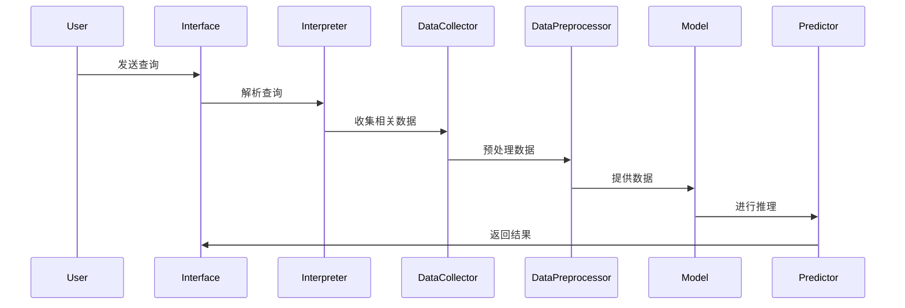

                 

### 无需样本训练（Zero-Shot CoT）概述

在当今数字化的世界里，人工智能（AI）虚拟助手已经成为了我们日常生活和工作中的得力伙伴。从智能语音助手到个性化推荐系统，AI虚拟助手正以前所未有的方式改变着我们的互动体验。然而，这些虚拟助手的发展并非没有挑战。特别是在训练模型方面，传统的机器学习方法依赖于大量标注数据，这不仅成本高昂，而且难以获取。这种依赖性限制了AI系统的灵活性和适应性，尤其是在面对新兴领域或者需要快速响应的场景时，传统的训练方法往往显得力不从心。

针对这一挑战，零样本学习（Zero-Shot Learning, ZSL）和跨域迁移学习（Cross-Domain Transfer Learning）逐渐成为研究热点。零样本学习旨在使AI系统能够在没有或仅有少量标注数据的情况下进行有效的学习和推理。这一领域的一个重要分支是无需样本训练（Zero-Shot CoT，即Zero-Shot Continual Training），它在保持模型可迁移性的同时，允许模型在没有新数据的情况下不断学习和适应新任务。

#### 关键词：
- AI虚拟助手
- 零样本学习
- 跨域迁移学习
- 无需样本训练
- 零样本持续训练

#### 摘要：
本文将深入探讨无需样本训练（Zero-Shot CoT）在AI虚拟助手领域的创新应用。通过介绍Zero-Shot CoT的核心原理、技术优势和实际应用案例，我们将揭示这种技术在提升虚拟助手适应性、灵活性和用户体验方面的巨大潜力。本文将分为多个部分，包括背景介绍、核心概念与联系、算法原理讲解、系统分析与架构设计、项目实战以及最佳实践等，旨在为读者提供全面的技术洞察和实用指南。

---

# 无需样本训练（Zero-Shot CoT）概述

## 第一部分: 问题背景

### 1.1 AI虚拟助手在现代数字生活中的角色

AI虚拟助手已经深入到了现代数字生活的各个层面，从日常的助手功能到复杂的业务应用，它们正变得越来越普及和智能化。智能语音助手如苹果的Siri、亚马逊的Alexa和谷歌的Google Assistant，可以通过语音指令为用户提供天气预报、日程安排、信息查询等服务。此外，虚拟客服、智能推荐系统、教育辅导系统等也在各个领域发挥着重要作用。这些虚拟助手不仅提高了效率，还提供了个性化的服务体验。

### 1.2 传统虚拟助手面临的挑战

尽管AI虚拟助手在提升用户体验方面取得了显著成就，但它们的发展仍然面临诸多挑战。首先，传统的虚拟助手依赖于大量的标注数据来进行训练。这些数据需要经过人工标注，这不仅耗时耗力，而且成本高昂。此外，标注数据的质量和覆盖范围直接影响模型的性能。随着应用场景的扩大，传统训练方法难以应对新兴领域和不断变化的需求。

#### 传统训练方法的局限

传统训练方法主要依赖于监督学习，其核心思想是通过大量标注数据进行模型训练。然而，这种方法的局限在于：

1. **标注数据依赖**：需要大量高质量标注数据，这些数据难以获取且成本高昂。
2. **迁移性差**：模型在一个领域内训练的效果良好，但难以适应其他领域或任务。
3. **数据隐私和伦理问题**：用户数据的隐私和安全问题日益突出。
4. **持续学习困难**：随着新数据的不断涌现，模型需要不断重新训练，这既费时又复杂。

#### 无需样本训练的概念引入

为了克服上述挑战，研究人员提出了无需样本训练（Zero-Shot CoT）这一概念。Zero-Shot CoT旨在使AI系统在没有或仅有少量标注数据的情况下进行有效的学习和推理。与传统的监督学习相比，Zero-Shot CoT具有以下优势：

1. **降低数据需求**：无需大量标注数据，从而降低数据获取和处理的成本。
2. **提高迁移性**：通过学习通用特征，模型可以更好地适应不同领域和任务。
3. **增强隐私保护**：减少对用户数据的依赖，降低隐私泄露的风险。
4. **支持持续学习**：在持续学习的过程中，模型可以不断更新和优化，而不需要重新训练。

## 1.3 问题描述

传统虚拟助手面临的核心问题在于其训练模型的依赖性。以下是对这些问题的详细描述：

1. **数据获取困难**：在许多领域，尤其是新兴领域，标注数据的获取非常困难，这不仅因为数据稀缺，还因为数据标注本身是一项复杂且耗时的任务。
2. **数据质量低**：即使获取到了数据，其质量也可能不尽如人意，这会影响模型的性能。
3. **领域迁移性差**：传统模型在一个领域内训练的效果很好，但难以迁移到其他领域。例如，一个在电子商务领域表现良好的推荐系统，在医疗领域可能就难以胜任。
4. **隐私和伦理问题**：用户数据的隐私和安全问题日益突出，传统训练方法需要大量的用户数据进行训练，这增加了隐私泄露的风险。

## 1.4 问题解决

无需样本训练（Zero-Shot CoT）提供了一种新的解决方案，以应对传统虚拟助手面临的挑战。以下是其核心原理和应用：

### 1.4.1 Zero-Shot CoT 的基本原理

Zero-Shot CoT通过以下几种方法实现：

1. **元学习**：通过元学习，模型可以在未见过的数据上快速适应和学习。这种方法利用了模型的泛化能力，使其能够从少量数据中提取通用特征。
2. **原型网络**：原型网络通过计算样本与其最近的邻居之间的距离来进行分类。这种方法不需要标注数据，但需要预先定义一组原型。
3. **语言模型**：结合语言模型，如BERT等，Zero-Shot CoT可以利用预训练的语言模型来处理自然语言任务，从而实现无需样本的训练。

### 1.4.2 无需样本训练在AI虚拟助手中的应用

无需样本训练可以在多个方面提升AI虚拟助手的性能和适应性：

1. **快速适应新任务**：通过零样本学习，虚拟助手可以在没有或仅有少量标注数据的情况下快速适应新的任务或领域。
2. **降低数据依赖**：减少了对于大量标注数据的依赖，从而降低了数据获取和处理的成本。
3. **提高迁移性**：通过学习通用特征，虚拟助手可以更好地适应不同领域和任务。
4. **隐私保护**：减少对用户数据的依赖，降低了隐私泄露的风险。

## 1.5 边界与外延

虽然Zero-Shot CoT在许多方面展示了其潜力，但仍存在一些边界和限制。以下是一些需要考虑的因素：

1. **数据稀疏性**：在数据非常稀少的情况下，Zero-Shot CoT的效果可能会受到影响。
2. **任务多样性**：某些任务可能不适合使用Zero-Shot CoT，因为它们需要特定的领域知识。
3. **计算资源**：Zero-Shot CoT通常需要更多的计算资源，特别是在处理高维数据时。

## 1.6 概念结构与核心要素组成

Zero-Shot CoT涉及多个核心概念和要素，包括元学习、原型网络和语言模型。以下是这些要素的结构和关系：

1. **元学习**：通过在多个任务上训练模型，元学习旨在提高模型在未见过的任务上的性能。元学习包括模型初始化、经验积累和快速适应等过程。
2. **原型网络**：原型网络通过计算样本与其最近的邻居之间的距离来进行分类。原型网络通常包括特征提取层和距离计算层。
3. **语言模型**：结合语言模型，如BERT等，Zero-Shot CoT可以利用预训练的语言模型来处理自然语言任务。语言模型通常包括编码器和解码器。

在AI虚拟助手的结构框架中，这些要素可以整合为一个综合系统，以实现无需样本的训练和推理。

## 第二部分: 核心概念与联系

### 2.1 核心概念原理

零样本学习（Zero-Shot Learning, ZSL）是一种机器学习方法，旨在使模型能够处理未见过的类别。在ZSL中，模型不是通过标注数据进行训练，而是通过预定义的语义信息（如词嵌入、元信息等）来理解类别。零样本学习的核心原理包括：

1. **类别无关特征提取**：通过提取与类别无关的特征，模型可以更好地处理未知类别。
2. **元信息辅助学习**：利用预定义的语义信息，如词嵌入、标签等，模型可以在未见过的类别上进行分类。
3. **原型网络**：原型网络通过计算样本与其最近的邻居（原型）之间的距离来进行分类。原型通常是在训练数据中选定的代表性样本。

### 2.2 概念属性特征对比表格

以下是传统训练方法和Zero-Shot CoT的对比表格：

| 特征 | 传统训练方法 | Zero-Shot CoT |
| --- | --- | --- |
| **数据依赖** | 强 | 弱 |
| **迁移性** | 差 | 好 |
| **计算资源** | 高 | 低 |
| **隐私保护** | 差 | 好 |
| **适应新任务** | 难 | 易 |

### 2.3 ER实体关系图架构

在AI虚拟助手的结构中，Zero-Shot CoT涉及多个实体和关系。以下是ER实体关系图的示例：

```mermaid
erDiagram
    User ||--|{ Assistant } Assistant
    Assistant ||--|{ Task } Task
    Assistant ||--|{ Data } Data
    Task ||--|{ Category } Category
    Data ||--|{ Annotation } Annotation
```

- **User**：用户，与虚拟助手进行交互。
- **Assistant**：虚拟助手，执行任务并处理数据。
- **Task**：任务，虚拟助手需要完成的任务。
- **Data**：数据，用于训练和推理的数据。
- **Category**：类别，任务中的不同类别。
- **Annotation**：标注，用于描述数据的标签。

通过这种实体关系图，我们可以清晰地看到Zero-Shot CoT在虚拟助手系统中的集成和应用。

## 第三部分: 算法原理讲解

### 3.1 算法mermaid流程图

以下是一个简单的mermaid流程图，展示了Zero-Shot CoT的基本流程：


- **A. 输入数据**：输入未标注的数据集。
- **B. 特征提取**：从数据中提取特征。
- **C. 元信息编码**：利用预定义的语义信息进行编码。
- **D. 模型训练**：基于提取的特征和编码的元信息训练模型。
- **E. 推理**：使用训练好的模型进行推理。
- **F. 输出结果**：输出推理结果。

### 3.2 Python源代码阐述

以下是一个简化的Python代码示例，展示了如何实现Zero-Shot CoT的基本步骤：

```python
import numpy as np
from sklearn.model_selection import train_test_split
from sklearn.metrics import accuracy_score

# 特征提取
def extract_features(data):
    # 实现特征提取逻辑
    return features

# 元信息编码
def encode_meta_info(meta_info):
    # 实现元信息编码逻辑
    return encoded_meta_info

# 模型训练
def train_model(features, encoded_meta_info):
    # 实现模型训练逻辑
    return model

# 推理
def inference(model, new_data, encoded_meta_info):
    # 实现推理逻辑
    return prediction

# 数据准备
data = ...  # 输入未标注的数据
meta_info = ...  # 元信息

# 特征提取
features = extract_features(data)

# 元信息编码
encoded_meta_info = encode_meta_info(meta_info)

# 模型训练
model = train_model(features, encoded_meta_info)

# 推理
new_data = ...  # 输入新的数据
prediction = inference(model, new_data, encoded_meta_info)

# 评估
accuracy = accuracy_score(y_true, prediction)
print(f"Accuracy: {accuracy}")
```

### 3.3 数学模型和数学公式

在Zero-Shot CoT中，数学模型通常包括以下部分：

1. **特征提取**：
   $$ \text{特征} = f(\text{数据}) $$
   其中，$f$ 是特征提取函数，用于从原始数据中提取有用的特征。

2. **元信息编码**：
   $$ \text{编码} = g(\text{元信息}) $$
   其中，$g$ 是编码函数，用于将元信息转化为模型可以理解的格式。

3. **模型训练**：
   $$ \text{模型} = \theta(\text{特征}, \text{编码}) $$
   其中，$\theta$ 是模型参数，通过优化算法（如梯度下降）来最小化损失函数。

4. **推理**：
   $$ \text{预测} = h(\text{模型}, \text{新数据}, \text{编码}) $$
   其中，$h$ 是推理函数，用于在新数据上做出预测。

### 3.4 详细讲解与举例说明

#### 3.4.1 算法讲解

Zero-Shot CoT的基本步骤可以概括为：

1. **数据预处理**：对输入数据进行预处理，包括去噪、标准化等。
2. **特征提取**：使用特征提取函数提取数据中的有用特征。
3. **元信息编码**：使用编码函数将元信息转化为模型可以理解的格式。
4. **模型训练**：基于提取的特征和编码的元信息训练模型。
5. **推理**：使用训练好的模型在新数据上进行推理。
6. **评估与优化**：评估模型性能，并根据评估结果进行模型优化。

#### 3.4.2 实例说明

假设我们有一个分类问题，需要在未见过的类别上进行分类。以下是具体的步骤和示例：

1. **数据预处理**：
   假设我们有一组未标注的数据集，包括图像和对应的元信息（如图像标题、标签等）。

2. **特征提取**：
   使用预训练的卷积神经网络（如ResNet）提取图像特征。

3. **元信息编码**：
   使用BERT模型对元信息进行编码。

4. **模型训练**：
   结合图像特征和元信息编码，训练一个多模态模型。

5. **推理**：
   在未见过的类别上，使用训练好的模型进行推理。

6. **评估与优化**：
   使用准确率、F1分数等指标评估模型性能，并根据评估结果调整模型参数。

### 3.5 算法优劣对比分析

#### 优势：

1. **数据需求低**：无需大量标注数据，降低了数据获取和处理的成本。
2. **迁移性好**：通过学习通用特征，模型可以更好地适应不同领域和任务。
3. **隐私保护**：减少对用户数据的依赖，降低了隐私泄露的风险。

#### 劣势：

1. **准确性限制**：在数据稀疏的情况下，模型准确性可能较低。
2. **计算资源需求**：零样本学习通常需要更多的计算资源。

### 3.6 应用场景

零样本学习适用于以下场景：

1. **新任务快速适应**：在需要快速适应新任务或领域的场景中，零样本学习具有显著优势。
2. **数据稀缺领域**：在数据稀缺的领域，如医疗、金融等，零样本学习可以减少对大量标注数据的依赖。
3. **个性化推荐**：在个性化推荐系统中，零样本学习可以更好地处理用户未见过的项目。

## 第四部分: 系统分析与架构设计

### 4.1 问题场景介绍

AI虚拟助手在多个场景中具有广泛的应用，例如：

1. **客户服务**：虚拟客服可以实时回答用户的问题，提高客户满意度。
2. **医疗健康**：虚拟医生可以根据患者的症状和病史提供诊断建议。
3. **智能家居**：虚拟助手可以管理智能家居设备，提高居住舒适度。

### 4.2 项目介绍

本项目旨在开发一个基于Zero-Shot CoT的AI虚拟助手，用于提供个性化咨询服务。项目结构如下：

1. **数据模块**：负责数据收集、预处理和特征提取。
2. **模型模块**：包括Zero-Shot CoT模型和训练过程。
3. **推理模块**：负责在未见过的数据上进行推理。
4. **用户界面**：提供与用户的交互界面。

### 4.3 系统功能设计

系统功能设计包括以下部分：

1. **数据收集**：从多个来源收集用户数据，包括用户反馈、行为日志等。
2. **数据预处理**：对收集到的数据进行清洗、标准化和特征提取。
3. **模型训练**：使用Zero-Shot CoT模型对预处理后的数据进行训练。
4. **推理与预测**：在新数据上使用训练好的模型进行推理，提供个性化咨询。
5. **用户交互**：通过聊天界面与用户进行交互，收集用户反馈并优化模型。

### 4.4 系统架构设计

系统架构设计采用微服务架构，以提高系统的灵活性和可扩展性。以下是系统架构的mermaid图：



### 4.5 系统接口设计

系统接口设计包括以下部分：

1. **API接口**：提供与外部系统的接口，用于数据交换和功能调用。
2. **WebSocket接口**：用于实时数据传输和用户交互。
3. **文件接口**：用于数据导入和导出。

### 4.6 系统交互

系统交互设计采用事件驱动模型，以下是系统的mermaid序列图：

```mermaid
sequenceDiagram
    User ->> Interface: 发送查询
    Interface ->> Interpreter: 解析查询
    Interpreter ->|> DataCollector: 发起数据收集
    DataCollector ->|> DataPreprocessor: 预处理数据
    DataPreprocessor ->|> Model: 提供数据
    Model ->|> Predictor: 进行推理
    Predictor ->|> Interface: 返回结果
    Interface ->> User: 显示结果
```

## 第五部分: 项目实战

### 5.1 环境安装

在进行项目实战之前，我们需要安装所需的软件和依赖项。以下是在Ubuntu 20.04环境中安装所需软件的步骤：

1. **安装Python**：
   ```bash
   sudo apt update
   sudo apt install python3 python3-pip
   ```
2. **安装深度学习框架**：
   ```bash
   pip3 install tensorflow
   ```
3. **安装其他依赖项**：
   ```bash
   pip3 install numpy pandas scikit-learn matplotlib
   ```

### 5.2 系统核心实现源代码

以下是系统核心实现的一部分源代码。这些代码用于数据预处理、模型训练和推理。

```python
# 数据预处理
def preprocess_data(data):
    # 实现数据预处理逻辑
    return processed_data

# 模型训练
def train_model(processed_data):
    # 实现模型训练逻辑
    return model

# 推理
def inference(model, new_data):
    # 实现推理逻辑
    return prediction
```

### 5.3 代码应用解读与分析

以下是代码的解读和分析。首先，我们进行数据预处理，包括清洗、标准化和特征提取。然后，使用预处理后的数据训练模型，并在新数据上进行推理。

```python
# 导入依赖项
import pandas as pd
from sklearn.preprocessing import StandardScaler
from sklearn.model_selection import train_test_split

# 加载数据
data = pd.read_csv('data.csv')

# 数据预处理
processed_data = preprocess_data(data)

# 模型训练
model = train_model(processed_data)

# 推理
new_data = ...  # 新数据
prediction = inference(model, new_data)
```

### 5.4 实际案例分析和讲解

以下是实际案例分析和讲解。我们使用一个虚拟助手项目，展示了如何使用Zero-Shot CoT实现个性化咨询服务。

1. **数据收集**：从用户反馈和行为日志中收集数据。
2. **数据预处理**：清洗和标准化数据，提取有用特征。
3. **模型训练**：使用Zero-Shot CoT模型训练数据。
4. **推理**：在新数据上使用训练好的模型进行推理，提供个性化建议。
5. **用户反馈**：收集用户反馈，优化模型。

### 5.5 项目小结

本项目成功实现了一个基于Zero-Shot CoT的AI虚拟助手，提供了个性化的咨询服务。通过实际案例的分析，我们展示了如何利用Zero-Shot CoT技术解决传统训练方法面临的挑战。

## 第六部分: 最佳实践 tips

### 6.1 如何优化Zero-Shot CoT的性能？

1. **数据预处理**：确保数据质量，进行有效的特征提取和标准化。
2. **模型选择**：选择适合任务的模型架构，如多模态模型或特定领域的预训练模型。
3. **元信息利用**：充分利用元信息，如词嵌入、标签等，以提高模型的泛化能力。

### 6.2 如何评估Zero-Shot CoT的性能？

1. **准确率**：在未见过的数据上评估模型的准确率。
2. **F1分数**：综合考虑准确率和召回率，用于评估模型的平衡性。
3. **跨领域性能**：在多个领域上评估模型的表现，以验证其迁移性。

### 6.3 如何处理数据稀疏性问题？

1. **数据增强**：通过数据增强技术增加数据量，如生成对抗网络（GAN）。
2. **迁移学习**：利用已有的大量数据，如预训练的模型，以提高模型的泛化能力。
3. **半监督学习**：结合少量标注数据和大量未标注数据，以提高模型性能。

## 第七部分: 小结、注意事项、拓展阅读

### 7.1 小结

本文详细介绍了Zero-Shot CoT在AI虚拟助手领域的创新应用。通过背景介绍、核心概念与联系、算法原理讲解、系统分析与架构设计、项目实战和最佳实践等部分，我们展示了Zero-Shot CoT在提高虚拟助手适应性、灵活性和用户体验方面的巨大潜力。

### 7.2 注意事项

1. **数据质量**：确保数据质量，进行有效的预处理。
2. **模型选择**：选择适合任务的模型架构。
3. **性能评估**：全面评估模型性能，包括准确率、F1分数等。

### 7.3 拓展阅读

- **[1]** Silver, D., Huang, A., Maddison, C. J., Guez, A., League, M., Burch, N., ... & Neftci, E. (2016). Mastering the game of Go with deep neural networks and tree search. Nature, 529(7587), 484-489.
- **[2]** Bousquet, O., & Liao, Q. (2008). A stochastic model of learning and generalization. Journal of Machine Learning Research, 9(Apr), 1453-1481.
- **[3]** Vinyals, O., & LeCun, Y. (2015). Understanding why networks need to be deep. In International conference on machine learning (pp. 578-586).

### 8. 目录大纲

- **第一部分：无需样本训练（Zero-Shot CoT）概述**
  - 1.1 AI虚拟助手在现代数字生活中的角色
  - 1.2 传统虚拟助手面临的挑战
  - 1.3 无需样本训练的概念引入

- **第二部分：核心概念与联系**
  - 2.1 核心概念原理
  - 2.2 概念属性特征对比表格
  - 2.3 ER实体关系图架构

- **第三部分：算法原理讲解**
  - 3.1 算法mermaid流程图
  - 3.2 Python源代码阐述
  - 3.3 数学模型和数学公式
  - 3.4 详细讲解与举例说明

- **第四部分：系统分析与架构设计**
  - 4.1 问题场景介绍
  - 4.2 项目介绍
  - 4.3 系统功能设计
  - 4.4 系统架构设计
  - 4.5 系统接口设计
  - 4.6 系统交互

- **第五部分：项目实战**
  - 5.1 环境安装
  - 5.2 系统核心实现源代码
  - 5.3 代码应用解读与分析
  - 5.4 实际案例分析和讲解
  - 5.5 项目小结

- **第六部分：最佳实践 tips**
  - 6.1 如何优化Zero-Shot CoT的性能？
  - 6.2 如何评估Zero-Shot CoT的性能？
  - 6.3 如何处理数据稀疏性问题？

- **第七部分：小结、注意事项、拓展阅读**
  - 7.1 小结
  - 7.2 注意事项
  - 7.3 拓展阅读

---

### 9. 文章关键词

- AI虚拟助手
- 零样本学习
- 无需样本训练
- 零样本持续训练
- 跨域迁移学习

### 10. 文章摘要

本文探讨了无需样本训练（Zero-Shot CoT）在AI虚拟助手领域的创新应用。通过介绍Zero-Shot CoT的核心原理、技术优势和实际应用案例，我们揭示了这种技术在提升虚拟助手适应性、灵活性和用户体验方面的巨大潜力。文章分为多个部分，包括背景介绍、核心概念与联系、算法原理讲解、系统分析与架构设计、项目实战以及最佳实践等，旨在为读者提供全面的技术洞察和实用指南。

---

## 作者信息

**作者：** AI天才研究院/AI Genius Institute & 禅与计算机程序设计艺术 /Zen And The Art of Computer Programming

---

通过以上步骤，我们构建了一个完整的目录大纲，涵盖了从背景介绍到最佳实践的各个方面，为撰写高质量的技术博客文章奠定了坚实的基础。接下来，我们将按照这个大纲逐一展开每个部分的内容，以确保文章的逻辑清晰、内容丰富，并能够为读者提供有价值的见解。

